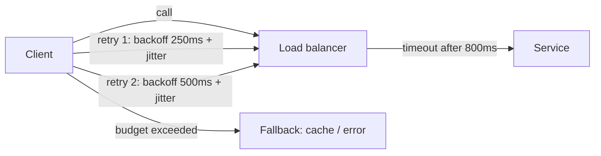

# Retry, Timeout, Exponential Backoff, and Jitter

## 1. One-Line Definition
Retries are re-issuing a failed call after a delay — governed by timeouts (when a call is considered failed) and exponential backoff with jitter (how long to wait) — the standard way to make transient failures disappear without hammering the dependency.

## 2. Why Do We Need It?
Distributed calls fail transiently: a connection blip, a GC pause, a brief deploy, a timeout on a slow-but-ok request. Without retries, one 200ms deployment window fails thousands of requests. But retries done naively (immediate, unbounded) turn a small failure into a thundering herd that completes the outage. Timeout+retry+backoff is the discipline that gets the benefits (surviving blips) without the harm (amplifying storms).

## 3. Simple Intuition
Calling customer service: you call, the line drops. You redial — but not instantly and not forever. First you wait 2 seconds, then 4, then 8, up to a cap, and you add a little random wiggle (jitter) so the whole city isn't redialing on the exact same second — otherwise your spontaneous retries *are* the busy signal. You also give up after N tries, or when the line is known to be dead (don't keep calling a permanently closed office).

## 4. What Happens Without It?
Two failure modes:
- *No retries:* any blip = a failed request; error rates equal to dependency outage frequency (bad under 99.9%+ targets).
- *Naive retries (fixed, tight, unbounded):* on an outage, every caller retries on the same schedule → retry storm doubles/triples traffic → the system that was 80% loaded saturates and truly fails; "retrying makes it worse."

## 5. Core Idea
- **Timeout is the foundation:** you must declare a deadline or you can't classify anything as failed. Per-call timeout + an overall budget (`timeout` on client, `context.WithTimeout`/circuit overall).
- **Which errors are retryable?** Only transient ones: connection drops, timeouts, 429/503 (backoff), 5xx that are not permanent. Never retry: 400/401/403/422/409 (permanent, client's fault), payload too large, idempotency-key conflict without care.
- **Retry budget:** cap attempts (e.g., 1 initial + 2 retries); a budget (max total time) is often better than a count.
- **Exponential backoff:** wait grows multiplicatively: 200ms, 400, 800, 1600 … with a max (say 8s) and a total cap. This spaces load as an outage continues.
- **Jitter is not optional at scale:** add ±random% (full or equal jitter) so retries from N clients arrive randomized, not synchronized. Classic failure: cron/50ms-fixed-backoff storms.
- **Where to retry:** at each layer? No — retry once at the caller boundary (gateway/service proxy) primarily, and let idempotency make retries safe. Every hop you retry doubles request generation.
- **Combine with:** circuit breaker (stop retrying during a known outage — see circuit-breaker), idempotency (retries safe only if the operation is safe to repeat — see delivery-semantics/idempotency), hedging for tail latency (see hedged-requests).

## 6. Important Terminology

| Term | Simple Meaning |
|------|----------------|
| Timeout | Deadline for a call to be considered failed |
| Retry | Re-issuing a failed request |
| Retryable error | Transient, safe to retry |
| Backoff | Wait time before retrying |
| Exponential backoff | Wait doubles per attempt |
| Jitter | Randomization of backoff to de-synchronize |
| Retry budget | Max attempts / total time budget |
| Degraded fallback | Serve stale/cached when retries fail |

## 7. Basic Architecture



## 8. Request or Data Flow
1. Client sends request with a timeout (e.g., 600ms).
2. Response missed/timeout or 503 → classified retryable.
3. Sleep exponential backoff + jitter; re-send with same idempotency key.
4. Success on attempt 2 → response; otherwise continue to budget.
5. Budget exhausted → fallback (stale cache, degraded response) or a clean 5xx to the user.

## 9. Practical Example
**Payment calls (assumptions):** checkout depends on card processor, P99 300ms.
- Timeout 800ms; retries 2 with backoff 250/500ms +jitter, both retry-safe with idempotency key `(order_id, attempt)`.
- Normal blips: hidden by retries. During a processor outage, circuit breaker opens quickly → retries stop early, callers get degraded "pay later" instead of 3× retry storm.
- Upstream 429 → honor `Retry-After` header, not your fixed schedule (the server is telling you its own expected recovery time).

## 10. Scaling
- **Amplification math:** 3 retries × 10k QPS base = up to 40k QPS through the LB/dependency during a blip. Keep retry levels minimal and multiply budgets.
- **Global retry storms:** all nodes hitting an outage retry by same clock → coordinate via jitter and circuit open state shared (or regional jitter).
- **Autoscaling interaction:** retried load can burn autoscaler capacity in seconds; monitor retry-induced QPS separately from real traffic.

## 11. Reliability and Failure Scenarios

| Failure | Happens | Detection | Recovery | Trade-off |
|---------|---------|-----------|----------|-----------|
| Dependency blip | Transient timeouts | Client metrics | Retries hide it | added latency |
| Full outage | Every retry fails | Circuit opens | Stop retrying early | availability of fallback |
| Payload processing delay | Slow (not dead) | Tail latency | Hedging vs retry | cost |
| Permanent error | 400/422 | Status metrics | No retry; alert | correctness |
| Retry storm | Saturation | QPS spikes | Jitter + circuit | coordination |

## 12. Consistency and Correctness
Retries multiply work; without **idempotency** they also multiply side effects (double-charge). Every retry should carry the same idempotency key so a retried request that *was* processed returns the stored result instead of re-processing. Timeouts create ambiguity (did it commit?) — the answer is always the idempotency layer, and/or outbox for writes.

## 13. Performance
- Retries add latency: with backoff, P99 and P99.9 grow by design — set the budget so the *user-visible* tail stays within SLO (e.g., budget 1.2s bounded).
- Jitter costs nothing measurable; fixed-backoff storms cost everything.
- Prefer async/background retry for jobs (queue with retry/DLQ) over synchronous retry loops for long operations.

## 14. Security
- Never retry auth/rate-limit failures blindly (can lock the account / trip the WAF).
- Retries carrying sensitive payloads: ensure replay is not an unintended duplicate side effect (idempotency + short-lived session data); don't log the retried payload.
- A distributed retry storm is also a self-DDoS vector — circuit-open + request rates + per-client caps contain it.

## 15. Trade-Offs

| Choice | Advantages | Disadvantages | When to Use |
|--------|------------|---------------|-------------|
| No retries | Predictable latency | Blips fail requests | Real-time reads, idempotency-impossible |
| Fixed short backoff | Fast recovery | Thundering herd | Low QPS, keyed to user |
| Exponential + jitter | De-synchronized, converges | Slightly slower than ideal | Default for network calls |
| Budget-based | Bounded total time | More knobs | SLO-bound flows |
| Fallback after retry | Keeps user served | Complexity of stale data | Read paths, payments "later" |

## 16. Common Mistakes
- Retrying non-idempotent operations without a key (double-charge bugs).
- Same jitterless schedule across all clients (self-DDoS everyone).
- Retrying 4xx errors forever (no progress, wasted load).
- No overall budget → a "retry" chain that takes 30s when the API should fail in 1s.
- Retrying at every hop (gateway + service + client) = cubed amplification.

## 17. HLD vs LLD Boundary
HLD: retry policy per dependency (timeout/budget/backoff/Jitter), idempotency keys, DR of retry storms, fallback choices. LLD: client config (axios/grpc/HTTP), backoff implementation, context/timeouts, per-status-code classification.

## 18. Interview Questions

### Beginner
- Why is jitter so important in a large fleet?
- Which status codes should you retry, and which never?

### Intermediate
- A dependency is having a partial outage. Walk the design that survives it without a retry storm.
- When would you NOT retry, even though it's retryable?

### Advanced
- Design retry policy for a payment system with 99.99% availability, 1.2s user-latency budget, and idempotency. Include budgets, jitter, circuit, and fallback.
- 1000 nodes all retry a dead dependency at 100ms fixed backoff. Model the traffic; then fix it with jitter/circuit and estimate new behavior.

## 19. Interview Memory Summary

> [!abstract]- Interview Memory Summary

### Remember

- Retry only transient, retryable failures — never permanent client errors.
- Timeout and an overall budget come first; a retry without a budget is a runaway.
- Exponential backoff + jitter de-synchronizes retry load across a fleet.
- Retries are safe only with idempotency — same key returns the stored result instead of re-processing.
- Retry at the caller boundary, once; every extra hop cubes request amplification.
- Circuit breakers stop retries during real outages; 429 deserves Retry-After, not a fixed schedule.
- Long operations belong in async retry (queue/DLQ), not a blocking retry loop.

### 30-Second Explanation

Set a timeout, classify retryable errors, back off exponentially with jitter inside a budget, carry an idempotency key, and open the circuit before a blip becomes a storm.

### Interview Traps

- Answering "how do you handle failures?" with just "we retry" — without budgets, jitter, idempotency, and circuit-breaking, retries are part of the problem.
- Retrying non-idempotent writes without a key (double-charge bugs).
- Retrying at every hop — cubed amplification.
- Retrying 4xx forever — no progress, wasted load.

### Key Trade-Off

Retries buy resilience against transient blips at the cost of added latency and multiplied request load; budgets, jitter, idempotency, and circuit breaking decide whether that amplification is a safety net or a self-inflicted storm.

## 20. Related Concepts

### Prerequisites

- [[reliability|Reliability]]
- [[availability|Availability]]

### Commonly Used Together

- [[circuit-breaker|Circuit Breaker]]
- [[rate-limiter|Rate Limiter]]
- [[delivery-semantics|Delivery Semantics]]
- [[golden-signals|Golden Signals]]
- [[distributed-tracing|Distributed Tracing]]

### Alternatives

- [[message-queue|Message Queue]] — async retry with DLQ replaces synchronous retry loops

### Advanced Concepts

- [[outbox-pattern|Outbox Pattern]]
- [[sli-slo-sla|SLI / SLO / SLA]]

Related planned topics (not authored yet): hedging and hedged requests, bulkheads, load shedding.

## 21. References
AWS Architecture Center (timeout, retry, backoff), Google SRE Workbook retry patterns, Resilience4j/Netflix Hystrix docs. Verify current library defaults.

## 22. Active Recall

Test yourself before revealing each answer.

> [!question]- What distinguishes a timeout, a retry, and backoff from each other?
> A timeout declares when a call is considered failed (a deadline); a retry re-issues a failed call; backoff is how long you wait before re-issuing — exponential with jitter, bounded by max wait and an overall budget. Timeout is the foundation: without one you can't classify anything as failed.

> [!question]- Which failure classes should you retry, and which never?
> Retry transient errors: timeouts, connection drops, 429 (honor Retry-After), and recoverable 5xx. Never retry permanent client errors (400/401/403/409/422), payload-too-large, or non-idempotent operations without a key — no progress is possible and you double side effects.

> [!question]- Design retry policy for a payment processor (P99 300ms) inside a 1.2s user-latency budget.
> Timeout 800ms; 2 retries with 250/500ms backoff + jitter; a total budget capped near 1.2s; idempotency key (order_id, attempt); a circuit breaker so a full outage stops retries early instead of a 3× storm; fallback "pay later" or a clean 5xx at the budget ceiling.

> [!question]- Where in the architecture should retries happen, and why once?
> At the caller boundary (gateway/proxy client), once. Retrying at gateway + service + client multiplies request generation per hop — cubed amplification. Internal layers classify errors and propagate; idempotency makes the single retry safe.

> [!question]- What do you pay for retries, and how do you bound the cost?
> Added latency (P99/P99.9 grow with backoff by design) and multiplied load — 3 attempts × 10k QPS base = up to 40k QPS. Bound with an overall budget (max total time / attempt count) and jitter to de-synchronize; monitor retry-induced QPS separately from real traffic.

> [!question]- Why is fixed 100ms backoff across a fleet dangerous?
> All callers retry on the same clock cadence → synchronized spikes that concentrate load into clumps and complete the outage (thundering herd). Jitter (full or equal) randomizes each client's timing so the retry load flattens out.

> [!question]- A blip becomes a full outage and retries triple the traffic. What stops the storm?
> A circuit breaker opens once the error rate breaches a threshold, so calls fail fast instead of retrying; combine with jittered backoff, per-client caps, and honoring Retry-After. The goal: retries hide blips, circuits stop them from becoming storms.

> [!question]- A retried payment charges the customer twice. Trace the bug and the fix.
> The retry re-executed a non-idempotent write — the server processed the duplicate instead of returning the stored first result. Fix: every retry carries the same idempotency key (order_id, attempt); the server stores the result of the first attempt and returns it on duplicate. Timeout ambiguity ("did it commit?") is resolved by idempotency, and outbox for writes.

> [!question]- "We handle failures by retrying." How do you probe this answer?
> Ask for the policy: which errors are retryable, the timeout and total budget, backoff curve + jitter, the idempotency key, whether a circuit breaker stops retries on real outages, and how 429/Retry-After and fallback behave. A bare "we retry" without these is part of the problem.

> [!question]- Interview scenario: a deploy causes 5% of calls to fail for 30 seconds. What's the safe response?
> Let bounded retries absorb the blip: timeout under budget, a couple of attempts with backoff + jitter, idempotency keys. Don't hammer — the deploy window resolves on its own. If failures persist past the budget, let the circuit trip and serve fallback rather than keep retrying.

## 23. When Should I Use This?

### Use it when

- A dependency has transient failures (connection blips, GC pauses, deploys) that would otherwise fail user requests.
- Availability targets (99.9%+) can't tolerate an error rate equal to dependency outage frequency.
- The operation is idempotency-safe or can carry an idempotency key.
- You can bound the damage: an overall budget, exponential backoff, and jitter.
- Recovery can be deferred — async retry via queue/DLQ fits long jobs better than blocking loops.

### Avoid it when

- The operation is non-idempotent and can't carry a key — retries double side effects.
- The failure is permanent (4xx, client bug) — retrying makes no progress.
- The dependency is known to be down — circuit breaking/failover belongs there instead.
- The latency budget can't absorb retry delay — real-time low-latency reads fail fast.
- Retrying at multiple hops would amplify load beyond the path's capacity.

### What problem does it solve?

Valid requests fail even though the system mostly works, because dependencies hiccup. The bottleneck: a transient blip maps 1:1 to a user-visible failure (and naive fixed retries map a small outage into a bigger storm). Retry with timeout + exponential backoff + jitter inside a bounded budget re-issues only the failures worth re-issuing, de-synchronized, so blips disappear while a real outage is detected and contained fast.

### What problem does it NOT solve?

Permanent dependency outages (needs circuit breaking + failover), non-idempotent writes (needs idempotency/outbox), tail latency from a slow-but-alive dependency (needs hedging), and throughput beyond the dependency's capacity (needs rate limiting or more capacity).

## 24. Decision Connections

Decisions that go together with retry, timeout, and backoff:

- [[circuit-breaker|Circuit Breaker]] — they compose: short retries while closed, stop the moment the circuit opens.
- [[rate-limiter|Rate Limiter]] — caps clients so their retry loops can't hammer; 429 + Retry-After pairs with backoff.
- [[delivery-semantics|Delivery Semantics]] — retries are only meaningful under a defined at-least-once/exactly-once model.
- [[outbox-pattern|Outbox Pattern]] — the safe pattern for write reliability: publish transactionally instead of blind replay.
- [[message-queue|Message Queue]] — async retry with DLQ replaces synchronous retry loops for long jobs.
- [[sli-slo-sla|SLI / SLO / SLA]] — timeouts and retry budgets are engineered against the user-latency SLO.
- [[distributed-tracing|Distributed Tracing]] — retry rounds become child spans; traces reveal hidden amplification.
- [[golden-signals|Golden Signals]] — the error/latency signals apportion where retries amplify vs protect.

Decision tree:

```
Dependency call fails or times out
    |
    +-- Permanent client error (4xx) or non-idempotent without key?
    |      → no retry; surface error
    |
    +-- Dependency known to be down?
    |      → [[circuit-breaker|Circuit Breaker]] opens; fail fast / fallback
    |
    +-- Transient blip (timeout, 5xx, 429)?
    |      → retry within budget
    |         |
    |         +-- Retry safe (idempotency key)? → exponential backoff + jitter
    |         +-- Long-running job?            → [[message-queue|Message Queue]] + DLQ
    |         +-- Budget exhausted?            → fallback / clean 5xx
    |
    +-- Latency budget can't absorb a retry?
           → fail fast; hedging for tail latency
```