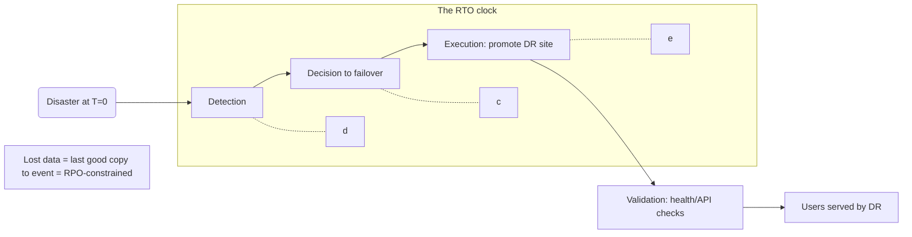

# RPO and RTO

## 1. One-Line Definition
RPO (Recovery Point Objective) is how much data loss you can tolerate measured in time; RTO (Recovery Time Objective) is how long you can tolerate downtime — together they are the two numbers that define your disaster-recovery requirements and every backup/replication budget.

## 2. Why Do We Need It?
"Be reliable" is a feeling, not a spec. Two questions force engineering and product to agree: *when a disaster happens, how fresh must the recovered data be?* (RPO) and *how quickly must we be back serving?* (RTO). Every DR architecture decision — replication frequency, standby warmth, automation, drill cadence, budget — is a consequence of those two numbers. Teams that skip this agreement build either gold-plated DR (wasted money) or invented resilience (false comfort).

## 3. Simple Intuition
Health: "If you faint, how much memory may you lose?" (RPO = acceptable amnesia, e.g., "5 minutes" of memory) and "how fast must you be able to talk again?" (RTO = e.g., "within the hour"). A short-memory scan every minute, a clinic across the street, and rehearsal — all sized by those two answers. For systems it's identical: RPO says "the copy frequency," RTO says "the plan's speed and warmth."

## 4. What Happens Without It?
Every failure becomes an improvisation: "how much did we lose?" is answered after the loss, "how long before we're back?" is answered during the outage. Backup schedules were set by "every night at 2am" (RPO = 24h) while a product promised "no data loss" — a mismatch nobody noticed until data vanished. RPO/RTO make the trade-off explicit *before* someone needs it: placing a number on acceptable loss and downtime forces backup/replication design, not vibes.

## 5. Core Idea
- **RPO (Recovery Point Objective):** the maximum acceptable period of data loss measured as "how far back in time is the last good copy." RPO=15min → a recovery replays to a point ≤15 minutes before the disaster; up to 15 minutes of committed work may be gone. NOT "we only lose 15 minutes," it's "we accept losing up to 15 minutes."
- **RTO (Recovery Time Objective):** the maximum acceptable downtime from disaster declaration to working service. Includes detection + decision + execution + validation ("time to recovery" is the clock), not just "restore the DB."
- **The spectrum:**
  - RPO hours/days → nightly/hourly backups, batch replication.
  - RPO minutes → continuous async replication of DB/streams/blobs.
  - RPO ~0 (often called "zero" — meaning "within seconds" in practice) → sync replication at *same-region/AZ*, or strong active-active multi-region with careful reconciliation; true WAN sync RPO=0 is physically hard.
  - RTO hours/days → backup+restore from cold. RTO minutes → warm standby + automation. RTO seconds → active-active geo with LB reroute.
- **RTO vs RPO are independent:** you can have RPO=5min + RTO=24h (copy constantly, restart slowly) or RPO=24h + RTO=5min (old data, fast). Both must be set per system.
- **RTO/RPO ≠ availability:** 99.9% availability is about *normal* uptime; RPO/RTO governs the *disaster* recovery contract. (RTO also shows up in failover HA, where it's often called "MTTR-like succession for a DR event.")
- **Setting them:** business/product decides (money lost per minute, compliance limits like payments/health privacy), engineering translates to architecture + budget. Cheap for non-critical, expensive for tier-0 (see disaster-recovery).

## 6. Important Terminology

| Term | Simple Meaning |
|------|----------------|
| RPO | Max acceptable data loss (time window) |
| RTO | Max acceptable downtime to be back |
| Recovery point | The point-in-time you restore to |
| Detection time | Time to discover the disaster |
| Decision time | Time to choose to fail over |
| Execution time | Time to actually switch over |
| Validation | Confirming the DR site works pre-traffic |
| RPO=0 | (Practically) no data loss expected |
| RTO=0 | Continuous availability ("zero downtime") |

## 7. Basic Architecture



## 8. Request or Data Flow
1. Define: ledger RPO 5m / RTO 1h; analytics RPO 24h / RTO 6h.
2. Time-to-recover breakdown for ledger: detect 30s + decide 5m + promote-SQL 30s + validate 2m = 8m < 1h (headroom > cleared DR queue).
3. On disaster: failover runs; data replayed to last 5-minute window; LDAP/audit/trace checks pass; traffic cut; RTO clock stopped at measurement.
4. Post-event: RPO measured vs target (how much data the window really cost) — target missed → tighten replication or accept & document.

## 9. Practical Example
**Payments + analytics (assumptions):** payments must never lose >60s of transactions and must be back in 15 min; analytics tolerates 24h loss and 6h restore.
- Payments: sync DB replication used same-region AZ; async cross-region; heated warm standby in DR region; failover automation + quarterly drills hitting 12 min RTO, 40s RPO.
- Analytics: nightly warehouse snapshots; archive copy to objects; recovery = reschedule 6h pipeline. $ cost is tiny; measured RTO 4h.
- Product approved *different* numbers per system — that's the whole point of per-system RPO/RTO.

## 10. Scaling
- RPO forces replication throughput: async streams scale with WAN bandwidth; if catch-up exceeds RPO under heavy write load (e.g., 2am batch burst), you need either slack or a windowed replica. 
- RTO forces *automation* and *validation*: manual steps scale poorly; rehearse with scripts measuring each phase (detection/decision/execution).
- DR scale: warm standby uses partial compute until scaled; active-active maintains both regions' capacity (2× or more).
- Chaos/drill cadence scales as complexity: quarterly for tier-0, bi-annual elsewhere, always with measured numbers.

## 11. Reliability and Failure Scenarios

| Failure | Happens | Detection | Recovery | Trade-off |
|---------|---------|-----------|----------|-----------|
| Replication lag > RPO | Miss window | Lag metric vs RPO | Fast replication or bigger RPO | cost |
| Detection slow | RTO partially consumed | Alerts + watchdog | Faster detection/quorum | false positives |
| Decision uncertainty | Blast "is it really a disaster?" | Runbook trigger | Pre-agreed thresholds | business fear |
| Execution bug | Failover fails | Drill catch | Fix automation | rehearsal time |
| Partial (zone, not region) | Full DR not needed | Scoped response | Zone-level failover | complexity |

## 12. Consistency and Correctness
RPO/RTO set the **business contract**, but consistency lives in the *implementation*: async replication can reorder/gap data (reconcile + dedup on restore); RPO=0 across WAN needs physical sense (sync same-AZ + range-keyed), then "RPO 0" is honest only *within region*. Document per-store and prove it with drills, not prose.

## 13. Performance
- Cost = f(RPO): RPO 5min → continuous replication (network + storage + compute); RPO 24h → cheap snapshot + restore.
- RTO = f(standby warmth + automation): 1h RTO needs warm infra + scripted recovery; 24h RTO can live with cold restore being manually kicked. Both trade money.
- Measured numbers beat tuned formulas — track time-to-detect, time-to-restore on every drill.

## 14. Security
- RPO/RTO planning must reach KMS, secrets, TLS identity, and object stores — recovery that can't decrypt or authenticate is a silent RTO miss. 
- DR copies extend data-surface and retention exposure; keep the DR site's ACLs and encryption policy equal to primary, and include it in audit/compliance evidence.

## 15. Trade-Offs

| RPO | Cost posture | Typical RTO | When |
|-----|--------------|-------------|------|
| 24h+ | Snapshot/backup, cheap | hours–days | Analytics, archives |
| 15m–1h | Async replication | minutes–hours | Normal online services |
| <1m–0 | Sync/active-active replication | seconds–minutes | Ledgers, identity, payments |
| RTO vs cost | more warmth = more money | | Decide per system, not globally |

## 16. Common Mistakes
- Publishing "RPO 0 / RTO 0" as marketing without physical possibility (WAN sync) or cost.
- Setting RPO/RTO *after* the architecture (tail now wags dog) or writing them without a drill.
- Confusing RPO with "we won't lose data" — RPO is *acceptance* of a loss window.
- Not measuring RTO's components (detect/decide/execute/validate) → "1h" is actually 6h when counted honestly.
- App's RPO/RTO ≠ business's (copy 5-min replication but the messaging stream still loses a day — chain mismatch).

## 17. HLD vs LLD Boundary
HLD: per-system RPO/RTO targets, DR posture + replication chain, failover automation + validation, RPO/RTO reporting. LLD: replication config (frequency/async), snapshot schedules, promotion scripts, drill harnesses, metrics exported per phase.

## 18. Interview Questions

### Beginner
- RPO vs RTO — one sentence each, with a counter-example showing they can differ widely.
- Why do we set RPO *before* buying backup tooling?

### Intermediate
- Payments (RPO 1m, RTO 15m, WAN 40ms): design replication + standby + failover path and estimate where the minutes go.
- How do you *prove* an RTO of 1 hour on a quarterly cadence without a full prod outage?

### Advanced
- Design a per-system RPO/RTO matrix for a two-sided marketplace (payments, listings, search, reviews, analytics) and justify each number + the DR cost it buys.
- Argue "RPO 0" is achievable or not in these two designs: active-active 2-region; or hot sync same-AZ + async cross-region. Be explicit about physical/WAN constraints.

## 19. Interview Memory Summary

> [!abstract]- Interview Memory Summary

### Remember

- RPO = max acceptable data-loss window (how far back the last good copy may be).
- RTO = max acceptable downtime, counting detect + decide + execute + validate, not just "restore the DB."
- The two are independent and must be set per system with the business, not globally by reflex.
- Architecture follows the numbers: RPO → copy frequency; RTO → standby warmth + automation.
- RPO/RTO ≠ availability SLOs: 99.9% governs normal uptime; RPO/RTO govern disaster recovery.
- Untested RPO/RTO are fiction — drill and measure; "RPO 0" across a WAN is physically dishonest.

### 30-Second Explanation

Ask the business "how much may we lose and how long may we be down," turn that into per-store copy frequency and per-region failover speed, then rehearse and measure against it.

### Interview Traps

- Mixing availability SLAs with RPO/RTO.
- Claiming RTO without counting the human decision step — the clock starts at "it failed."
- Publishing RPO 0 / RTO 0 as marketing when WAN sync makes it impossible.
- Setting RPO/RTO after the architecture, or writing them without a drill.
- Confusing RPO's acceptance of a loss window with "we won't lose data."

### Key Trade-Off

RPO/RTO turn reliability into a money question: every minute of RPO costs replication bandwidth and every minute of RTO costs standby warmth and automation — so they're set painstakingly per system rather than uniformly.

## 20. Related Concepts

### Prerequisites

- [[availability|Availability]]
- [[reliability|Reliability]]

### Commonly Used Together

- [[disaster-recovery|Disaster Recovery]]
- [[standby-models|Standby Models]]
- [[database-replication|Database Replication]]
- [[failover|Failover]]

### Alternatives

- [[sli-slo-sla|SLI / SLO / SLA]] — steady-state availability targets; complementary, not interchangeable with the disaster contract

### Advanced Concepts

- [[replication-lag|Replication Lag]] — the real-time drift that must stay under RPO
- [[strong-vs-eventual-consistency|Strong vs Eventual Consistency]] — sync/async replication trade-offs behind small RPOs

Related planned topics (not authored yet): multi-region systems, cross-region replication, chaos engineering.

## 21. References
AWS DR whitepaper (RPO/RTO definitions), Microsoft Well-Architected (RPO/RTO), Google SRE (error budgets vs DR objectives). Verify current guidance for interviews.

## 22. Active Recall

Test yourself before revealing each answer.

> [!question]- RPO vs RTO in one sentence each, with a counter-example showing they can differ widely.
> RPO = the maximum acceptable period of data loss (how far back the last good copy may be); RTO = the maximum acceptable downtime from disaster to serving again. Counter-example: RPO 5min + RTO 24h (copy constantly, restart slowly) vs RPO 24h + RTO 5min (old data, fast) — they are independent numbers.

> [!question]- Why must RPO be set before buying backup tooling?
> Because backup frequency IS the RPO: "nightly at 2am" is an RPO of 24h whether or not anyone said so. Setting the number first lets you choose snapshot cadence, replication type, and DR posture deliberately instead of discovering the mismatch at the first real loss.

> [!question]- Payments with RPO 1 minute, RTO 15 minutes, WAN 40ms — where do the minutes go?
> Sync same-AZ replication covers writes instantly; async cross-region keeps the WAN gap bounded (or windowed queued replication). RTO 15m spends: detection ~30s + decision ~5m + promote/automation ~2m + validation ~2m, leaving headroom. Rehearse each phase and measure its clock contribution.

> [!question]- How do you prove a 1-hour RTO quarterly without a full production outage?
> Compartmentalized drills: fail over a shadow or low-traffic shard, or a pre-production stack that mirrors config, KMS, and quota. Automate phase timing (detect/decide/execute/validate), record time-to-restore and the data gap, and fix the slowest phase on each iteration.

> [!question]- What does tightening RPO from 24h to 5min buy and cost?
> It buys a smaller loss window at the price of continuous replication: bandwidth, storage, WAL shipping, catch-up engineering, and WAN headroom under write bursts. For analytics that may be invisible; for payments it's usually non-negotiable — so tier per system (see the payments-vs-analytics example in section 9).

> [!question]- Why is "RPO 0" not straightforward, and what's the honest engineering position?
> True RPO 0 is a synchronous hop where every commit waits for the replica's ack — across a WAN that's latency-proportional and throughput-capped. Honest position: sync same-AZ + async cross-region gives "RPO 0 within region, windowed across region"; state it precisely and reconcile with idempotency/dedup on restore.

> [!question]- Replication lag exceeds RPO during a 2am batch burst. Diagnose and fix.
> A write spike outpaced WAN transfer, so the DR replica fell behind — detection is a lag-vs-RPO alert, not a raw-lag alert. Fixes: faster/pipelined replication, jittered or prioritized batch windows, a windowed replica, or a business-signed wider RPO.

> [!question]- A mock drill shows the DR site can't decrypt. What broke and where was it missed?
> Secret/KMS replication wasn't part of the RPO chain — the data was copied but keys/config weren't, a silent miss until the first real restore. Fix: replicate KMS/secrets/certs cross-region, include decryption in every drill's validation phase, and keep the DR data store's ACL/encryption policy identical to primary.

> [!question]- Interview scenario: per-system RPO/RTO matrix for a two-sided marketplace (payments, listings, search, reviews, analytics). Justify the cost.
> Payments/identity: RPO seconds, RTO 5–15m — sync same-AZ + async cross-region, warm/hot standby, expensive. Listings/reviews: RPO 15m–1h, RTO 1h — async replication + warm standby. Search index: rebuildable — loosen RPO/RTO and rebuild from source. Analytics: RPO 24h, RTO 6h — nightly snapshots, near-zero cost. Each justified by revenue/compliance impact vs copy + standby spend.

> [!question]- "We have 99.99% availability, so DR is handled." Respond.
> 99.99% availability measures steady-state uptime within your regions and says nothing about losing a whole region, or how fresh the data copy there is. Different clock, different contract: DR needs its own RPO/RTO, its own copy chain, and its own drills. Availability SLOs and RPO/RTO are two different goals.

## 23. When Should I Use This?

### Use it when

- The business can articulate loss and downtime tolerance ("how much may we lose, how long may we be down").
- A component's data is irreplaceable under a region/DC loss.
- You must justify replication/standby spend against an objective.
- Compliance requires documented recovery targets.
- You're choosing a standby posture and need the input numbers.

### Avoid it when

- The service is stateless or rebuildable — a copy chain isn't warranted.
- No one will own the numbers and drills — unused RPO/RTO is theater.
- The physical reality blocks the target (WAN sync RPO 0) and can't be re-scoped.
- The actual gap is steady-state availability, not disaster — that's an SLO problem.

### What problem does it solve?

"Be reliable" is unmeasurable and every disaster becomes an improvisation where loss and downtime are decided after the fact. The bottleneck is reliability with no agreed contract. RPO and RTO convert it into a two-number spec that drives copy frequency, standby warmth, automation, drills, and budget — per system, agreed before anyone needs it.

### What problem does it NOT solve?

It doesn't provide the mechanisms (replication, failover, fencing — those live in [[disaster-recovery|Disaster Recovery]], [[standby-models|Standby Models]], and [[failover|Failover]]); it doesn't guarantee steady-state availability metrics (that's [[sli-slo-sla|SLI / SLO / SLA]]); and it doesn't make an unrehearsed plan recoverable — numbers without drills are promises.

## 24. Decision Connections

Decisions that go together with RPO and RTO:

- [[disaster-recovery|Disaster Recovery]] — RPO/RTO are the input; the DR plan is built to hit them.
- [[standby-models|Standby Models]] — standing warmth is how you engineer the chosen RTO.
- [[database-replication|Database Replication]] and [[replication-lag|Replication Lag]] — replication cadence and drift determine the achievable RPO.
- [[failover|Failover]] — its speed fills part of the RTO clock (promote/fence/route/validate).
- [[sli-slo-sla|SLI / SLO / SLA]] — steady-state SLOs and disaster RPO/RTO are different contracts on different clocks.
- [[availability|Availability]] — frames what the nines mean in normal operation vs disaster recovery.
- [[strong-vs-eventual-consistency|Strong vs Eventual Consistency]] — picks the replication trade-offs behind small RPOs.

Decision tree:

```
"Be reliable" needs a number
    |
    +-- How much data may we lose?  → RPO (copy frequency, replication type)
    |      +-- hours   → snapshots / batch replication
    |      +-- minutes → continuous async replication
    |      +-- ~0      → sync same-AZ / active-active (no WAN sync shortcuts)
    |
    +-- How fast must we be back?   → RTO (standby warmth + automation)
    |      +-- hours   → backup + restore (cold)
    |      +-- minutes → warm standby, automated failover
    |      +-- seconds → active-active traffic switch
    |
    +-- Per-system or global?       → per system, set with the business
    |
    +-- Proven?                     → drills measuring detect/decide/execute/validate
           → [[disaster-recovery|Disaster Recovery]] → [[standby-models|Standby Models]]
```