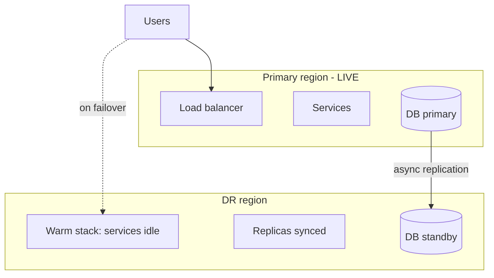

# Standby Models (Active-Passive, Warm, Cold, Active-Active)

## 1. One-Line Definition
Standby models describe how "ready" a disaster-recovery or failover site is before it's needed — cold (nothing running), warm (running but idle/light), hot (fully running and warm-synced), and active-active (both sites serving real traffic) — trading cost, RTO, and complexity.

## 2. Why Do We Need It?
A DR site that doesn't exist (architecturally) means your RTO is "build it during the outage." A 1-hour RTO is impossible from cold infra. Standby models are the knob that turns RTO into a *procurement decision*: how much compute/storage/standby capacity you pre-pay determines how fast you can realistically be back. Choosing the model IS choosing cost vs speed, and it's usually per-system, not one size fits all.

## 3. Simple Intuition
Keeping a spare generator:
- *Cold standby:* the generator lives in a crate. Cheap, but on a blackout you must unbox, fuel, and test it (RTO: an afternoon).
- *Warm standby:* the generator is fueled, parked, tested monthly (RTO: minutes).
- *Hot standby:* it's running at idle, synced to the grid, ready to take load instantly (RTO: seconds).
- *Active-active:* two generators already powering half the building each (RTO: near zero, but much more cost and maintenance).
Same machine, four postures — four price tags, four recovery speeds.

## 4. What Happens Without It?
"DR" that is actually just *backups in a box*: at disaster time you install servers, configure networking, restore data, and hope the runbook covers what's gone. RTOs of "we'll find out." Meanwhile teams that went straight to active-active everywhere overspend 2–3× on capacity nobody uses. Without a *model* (and its price tag), you either under-commit (fake DR) or over-commit (gold-plated DR). The model gives you a menu to pick from honestly.

## 5. Core Idea
- **The spectrum (primary → DR site):**
  - **Cold standby:** infrastructure planned (IaC manifests) but nothing provisioned; data backups only. Cheap; RTO hours–days. Fine for non-critical or rebuildable services.
  - **Pilot light:** a *minimum* footprint (data plane: DB replica, core config, empty infra) running continuously; the rest scale up on demand. Data flows but services are thin. Mid RTO (tens of minutes–hours).
  - **Warm standby:** full stack deployed with same config/version, running idle/at low traffic, data replicated continuously. RTO minutes. The workhorse for production workloads.
  - **Hot standby:** warm standby with everything continuously validating, ready to accept production immediately (pre-provisioned capacity, top-up connections). RTO seconds–minutes, but pays capacity for `RTO→0` ambitions.
  - **Active-active (multi-region/multi-AZ):** both sites serve real user traffic continuously (traffic split), state partitioned/replicated so each region fails over with only LB reroute. RTO ~ seconds (often measured as "traffic switch only"). Highest cost + the app must be written multi-region-aware (session/state affinity, conflict handling, per-region partitioning).
- **RTO/RPO mapping:** cold→long RTO; warm/hot→minutes; active-active→seconds. RPO is driven by *data replication*, which all models can share (async vs sync) — appetite matches the model (active-active usually wants little/no loss).
- **Choosing per system:** tier-0 identity/ledger → active-active (or hot with excellent handler)? Core CRUD → warm. Analytics/reports → cold/pilot; their RTO tolerates hours.
- **Failback matters too:** models describe going *away* from primary and coming *back*; plan the return (usually: DR becomes primary until required cleanup).

## 6. Important Terminology

| Term | Simple Meaning |
|------|----------------|
| Cold standby | Nothing running; restore-from-backup |
| Pilot light | Tiny always-on footprint + scale on demand |
| Warm standby | Full stack running, idle/light, data synced |
| Hot standby | Fully provisioned/validated, ready now |
| Active-active | Both regions live, traffic split |
| Primary site | Region normally serving traffic |
| Failover | Moving traffic to standby |
| Failback | Returning traffic to primary |
| Warm-up/replay | Getting DR data up-to-date before serving |
| Capacity warming | Scaling DR to production size before cutover |

## 7. Basic Architecture



## 8. Request or Data Flow
1. Primary serves traffic; DR stack runs at idle/warm with data replica streaming.
2. Failover: route traffic to DR's LB; promote DR DB; replay replication gap (within RPO); validate health endpoints before traffic.
3. DR now serves prod traffic (that's the point — not "fully back to primary," it *is* primary).
4. When primary healthy: sync-back (data forward from DR), re-point traffic, demote; keep a recovery window/quiet period to allow catch-up.

## 9. Practical Example
**Two-marketplace systems, two models (assumptions):**
- *Payments:* **active-active** across two regions; per-region write partitioning with tenant → region routing; ledger replication near-sync; RTO = just LB/DNS (≈seconds), tested monthly.
- *Analytics/reporting:* **cold standby**; nightly warehouse snapshot + schema-as-code; RTO 4h and RPO 24h, measured annually; cost near zero.
- *Catalog API:* **warm standby**; same image stack, DB replica synced, RTO under 10 min, driven by quarterly drill.

## 10. Scaling
- **Warm/hot standby scales on demand** — pre-provision the *control* plane; compute auto-scales at failover (subject to scale limits). Pre-warm capacity to RTO for tier-0.
- **Active-active** doubles capacity cost (both regions sized for peak) unless there's regional load sharing to recover capacity.
- **Data:** warm/hot + async replication has a WAN bandwidth and catch-up latency cost as data grows; tune replication window vs RPO.
- **Multi-region correctness:** partition writes by region/tenant, route reads with affinity, handle cross-region conflicts (order of battle: partition writes to avoid them; global reads via index/replica).

## 11. Reliability and Failure Scenarios

| Failure | Happens | Detection | Recovery | Trade-off |
|---------|---------|-----------|----------|-----------|
| Cold site never tested | Failover = first run | Drill results | Fix/backfill | rehearsal time |
| Warm stack drifts (config/version) | Wont match prod | Config diff audit | Sync IaC | discipline |
| Replica lag | RPO breach at DR | Lag metrics | Tune/faster replication | cost |
| Active-active split brain | Both accept the same writes | Fencing/quorum | Prevent via routing+fencing | design complexity |
| DR capacity under-provisioned | Scale-up too slow for RTO | Load test | Pre-warm capacity | cost |

## 12. Consistency and Correctness
- **RPO/intent mapping:** warm/hot with async gives *windowed* loss (RPO > 0). Active-active with sync gives near-zero, but only if writes are *partitioned*, not dual-primary (dual-primary needs conflict resolution — usually avoided).
- **Fencing/quorum:** any multi-writer standby (active-active or promote-based) must suppress stale primaries recovering (write-fencing, epoch IDs) — split-brain data corruption is the #1 DR horror.

## 13. Performance
- Cost scales with model warmth: cold ≈ backup cost; pilot ≈ minimal compute; warm ≈ partial stack; hot ≈ full capacity; active-active ≈ 2× (or 3× if non-sharable states).
- Warm/hot also pay for *validation* (the stack must believe it's production — config, quota, kms, DNS reachability) — cheap but mandatory.

## 14. Security
- Standby = more secrets/regions: replicate KMS keys and registry auth to DR; the DR data store carries the same PII obligations.
- Active-active security surface doubles: each region needs WAF, ACLs, audit; and DR's entire attack surface must be watched (it's equally alive).

## 15. Trade-Offs

| Model | RTO | Cost | Data RPO fit | Use |
|-------|-----|------|--------------|-----|
| Cold | hours–days | very low | hours–days | Non-critical/rebuildable |
| Pilot light | tens of min–hrs | low | minutes–hrs | Slow features, secondary |
| Warm | minutes | medium | minutes | General production |
| Hot | seconds–min | high | near-0 possible | Tier-0 |
| Active-active | seconds | highest | near-0 (partitioned) | Identity/payments/media-critical |

## 16. Common Mistakes
- Cold-standing "DR" sold as meeting a 1-hour RTO (untested guarantee).
- Warm standby with wrong image/configs → useless on failover; hyperfocus on data, forgetting config drift.
- Active-active with dual-primary writes and no partition/conflict plan (split-brain corruption).
- Not testing the DR stack — a drill first-tests it, making it "cold" in the worst sense.
- Scaling DR compute to "idle," then discovering at cutover it can't take the load (capacity warming ignored).

## 17. HLD vs LLD Boundary
HLD: standby model per system, RTO/RPO fit, failover/failback plan, capacity warming, replication topology, fencing/quorum design. LLD: IaC for DR, promotion scripts, LB-routing rules/DNS TTL/latency probing, replication configs, drill harness.

## 18. Interview Questions

### Beginner
- Cold vs warm vs hot vs active-active in one line each.
- Why shouldn't a blog and a payments system use the same standby model?

### Intermediate
- Design the standby model for a core read-heavy catalog with RTO 5 min/RPO 5 min. What runs at DR, what does failover look like, and what could break silently?
- Warm standby drifted in config — describe the detection and prevention loop.

### Advanced
- Active-active across 2 regions for a marketplace: partition writes by region/tenant, handle reads, explains fencing that prevents split brain, and quotes the cost difference vs hot standby.
- Design the failback sequence (DR→primary) without data loss or double-handling; where does the risky step live, and how do you rehearse it?

## 19. Interview Memory Summary

> [!abstract]- Interview Memory Summary

### Remember

- Spectrum of readiness: cold → pilot light → warm → hot → active-active, trading cost and complexity for lower RTO.
- RTO follows warmth; RPO follows data replication (all models can share async/sync; small RPO wants warm/active-active).
- Warm standby is the production workhorse; active-active is tier-0 only (cost + multi-region app semantics).
- Config drift + untested drills silently degrade any standby to "cold" — failover becomes the first run.
- Failover needs fencing/quorum to prevent split brain; failback needs its own engineered plan.
- Capacity warmth matters: DR sized for "idle" can't take production load at cutover.

### 30-Second Explanation

Match each system to a standby posture by its RTO/RPO, keep DR IaC-identical and validated, replicate data within RPO, and rehearse failover+failback including fencing — money spent on warmth should show up as measured RTO.

### Interview Traps

- Calling idle replicas "hot standby" when capacity isn't provisioned for production load.
- Planning active-active without partitioned writes and conflict handling (split-brain corruption).
- Warm standby with drifting config/images — useless at failover; keep DR IaC-identical.
- Not testing the DR stack or skipping capacity warming.
- Picking one model for everything — blogs and payments don't share a posture.

### Key Trade-Off

Standby models trade money and complexity for recovery speed: each step from cold to active-active buys lower RTO (and, with replication, lower RPO) but scales cost, drift risk, and the need for multi-region engineering — so the choice is per system, driven by RTO/RPO, not one size fits all.

## 20. Related Concepts

### Prerequisites

- [[rpo-rto|RPO and RTO]]
- [[availability|Availability]]

### Commonly Used Together

- [[disaster-recovery|Disaster Recovery]]
- [[failover|Failover]]
- [[database-replication|Database Replication]]
- [[replication-lag|Replication Lag]]

### Alternatives

- [[failover|Failover]] — same-region HA failover when cross-region RTO isn't required

### Advanced Concepts

- [[strong-vs-eventual-consistency|Strong vs Eventual Consistency]] — sync/async choices behind active-active
- [[cap-theorem|CAP Theorem]] — constraints once writes span regions

Related planned topics (not authored yet): multi-region systems, cross-region replication.

## 21. References
AWS DR whitepaper (standby strategies), Azure/SiteRecovery docs, GCP multi-region patterns. Verify provider capabilities for interviews.

## 22. Active Recall

Test yourself before revealing each answer.

> [!question]- Cold vs warm vs hot vs active-active in one line each.
> Cold = nothing provisioned, restore from backup (RTO hours–days). Warm = full stack deployed and running idle/light with data synced (RTO minutes). Hot = fully provisioned and continuously validated, ready for production now (RTO seconds–minutes). Active-active = both sites serve live traffic, so failover is only LB/DNS reroute (RTO ~seconds, highest cost).

> [!question]- Why shouldn't a blog and a payments backend share one standby model?
> They have different RTO/RPO. A blog tolerates 24h loss and 6h restore → cold/pilot at near-zero cost. Payments may cap losses in seconds and downtime in minutes → active-active or hot. Rightsizing each avoids both fake DR (blog needs nothing warm) and gold-plated DR (payments needs nothing less).

> [!question]- Design the standby model for a read-heavy catalog with RTO 5 min, RPO 5 min. What runs at DR and what breaks silently?
> Warm standby: the same image/stack deployed in the DR region, DB replica streaming with lag kept under 5 min, reads served after cutover. Silent breaks: config/version drift, schema drift, missing KMS/quotas, replica lag exceeding RPO, and DR capacity not warmed to production load.

> [!question]- Active-active across 2 regions for a marketplace — how are writes handled without conflicts?
> Partition writes by region/tenant: each tenant has a home region and writes go there; reads are served near-home with affinity; ledger replication is near-sync; global reads go through an index/replica. Avoid dual-primary writes on the same keys, fence a stale region from re-joining, and failover becomes a routing decision, not a conflict reconciliation.

> [!question]- What does each step of warmth cost, and when is it worth it?
> Cold ≈ backup cost only; pilot ≈ minimal compute; warm ≈ a second partial stack; hot ≈ full provisioned capacity; active-active ≈ 2–3× capacity plus multi-region engineering. Worth it when the business RTO/RPO demands seconds (payments, identity); otherwise the warmth is money sitting in a standby nobody uses.

> [!question]- What's quietly worse than no drills on a warm standby?
> A warm standby that's never cut over behaves like cold precisely when you need it — first test = first disaster. Drift in config, version, quota, KMS, or DNS gives "recovered but won't run." IaC-identical DR plus rehearsals is the anti-drift mechanism; without it the "warm" tag is a cold promise.

> [!question]- At cutover, the DR stack can't take the load. Diagnose and prevent.
> Capacity warming was ignored — the DR stack was sized for "idle" and the first production load saturated it. Prevent by pre-provisioning DR to expected production size (or auto-scaling with limits), load-testing at cutover rehearsal, and treating DR capacity as a first-class cost.

> [!question]- After failover, both regions accept the same writes. What's the fix?
> Split brain — two primaries. Prevention is in the design: partitioned writes (tenant → region routing) plus fencing the old primary at failover (write fences, epoch IDs, quorum) so it can't rejoin and corrupt; the same discipline applies to failback: demote, sync forward from DR, validate, and keep a quiet observation window.

> [!question]- Interview scenario: "We use active-active, so we're fully covered." Probe and correct.
> Ask what happens to writes on a regional loss: are they partitioned per region? What about session/state affinity? How are conflicts resolved — or avoided via partitioning? And what does the failover drill measure? Active-active without partitioned writes + fencing is split-brain risk, it costs 2× capacity, and it's only the right posture if the RTO honestly needs seconds.

> [!question]- Interview scenario: design failover then FAILBACK (DR → primary) without data loss or double-handling.
> Failback plan: demote the new primary (was DR) and let it drain; sync data forward to the recovered primary while fencing writes; validate checksums/health; cut routing back; keep a quiet observation window to catch lag. Rehearse the risky step (the write cutover) independently, and use idempotency/dedup to guard against double-processing.

## 23. When Should I Use This?

### Use it when

- You have defined per-system RPO/RTO and a standby-region budget.
- Downtime of the primary region beyond minutes/hours is not acceptable.
- Failover speed matters and you can afford the pre-provisioned capacity.
- You can run regular drills and validation — a standby that's never exercised is a promise.
- You need a cost/speed menu to argue DR spend with the business.

### Avoid it when

- The service is rebuildable or stateless — replicate nothing, rebuild instead.
- Budget can't fund the standby posture the real RPO/RTO demands.
- Multi-region engineering is infeasible (sync RPO 0, or no cross-region data path).
- The team can't sustain IaC/drill discipline — drift will still turn it to cold.
- Same-region HA covers the actual blast radius — the standby guards a different risk.

### What problem does it solve?

After a region loss, "when will we be back?" is unknown because nothing was pre-positioned — RTO is bottlenecked by everything postponed (procurement, config, data transfer). Standby models map a chosen posture (cold/pilot/warm/hot/active-active) so the interval from disaster to service is an engineered, measurable number: warmth bought in advance converts unplanned downtime into a planned one.

### What problem does it NOT solve?

Steady-state availability SLOs (that's [[sli-slo-sla|SLI / SLO / SLA]]), split brain if fencing/partitioning is skipped, data-loss-free RPO 0 across a WAN without synchronous specialty links, and drift — IaC and drills are required or any standby degrades toward cold.

## 24. Decision Connections

Decisions that go together with standby models:

- [[rpo-rto|RPO and RTO]] — the two numbers that pick the model; warmth and loss tolerance come from them.
- [[disaster-recovery|Disaster Recovery]] — the planning umbrella; standby models are the topology knob inside it.
- [[failover|Failover]] — the promote/fence/route sequence the standby enables (and why fencing matters for promote-based and active-active models).
- [[database-replication|Database Replication]] — the data-sync layer that sets achievable RPO at any warmth.
- [[replication-lag|Replication Lag]] — the drift metric that must stay under RPO or the model's promise breaks.
- [[strong-vs-eventual-consistency|Strong vs Eventual Consistency]] — sync/async and partitioned-write semantics behind active-active.
- [[cap-theorem|CAP Theorem]] — constraints kick in the moment writes span regions.
- [[sli-slo-sla|SLI / SLO / SLA]] — normal uptime SLOs vs disaster RTO: different clocks, same system.

Decision tree:

```
Region-level failure: how ready is the recovery site before it's needed?
    |
    +-- Can tolerate hours–days of downtime / no standby budget?
    |      → cold standby: IaC only + backups (restore from scratch)
    |
    +-- Mid RTO (tens of minutes to hours) acceptable?
    |      → pilot light: minimal always-on skeleton, scale on demand
    |
    +-- Production RTO in minutes / moderate cost?
    |      → warm standby: full stack idle, data replicated, automated promote
    |
    +-- RPO ~0, RTO seconds, writes partitionable, cost acceptable?
    |      → hot standby / active-active (LB reroute only)
    |
    +-- Always: IaC-identical DR, fencing/quorum, capacity warming
           → [[rpo-rto|RPO and RTO]] → [[disaster-recovery|Disaster Recovery]] → [[failover|Failover]]
```