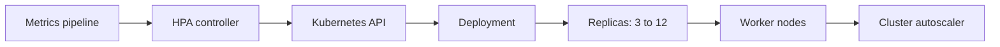

# Autoscaling

## 1. One-Line Definition
Autoscaling automatically adjusts the number of running instances (or their resources) in response to real-time demand signals — metrics like CPU, queue depth, or request rate — so capacity tracks traffic without human intervention.

## 2. Why Do We Need It?
Traffic is not flat: flash sales, viral spikes, and business hours swing demand by 10-100x. Provisioning for the peak wastes money the other 99% of the time; provisioning for the average means outages at peak. Autoscaling buys both sides: scale up before you melt, scale down when idle, without a human watching a dashboard at 3am. It is also the point of stateless horizontally-scalable services — see [[horizontal-vs-vertical-scaling|Horizontal vs Vertical Scaling]].

## 3. Simple Intuition
A bridge with adjustable toll booths. In rush hour, sensors see queue lengths and traffic volume, and quickly open more booths. At night, booths close one by one. The rules are: widen when queues form too fast, tighten when booths sit idle for too long. Nobody pages a supervisor to open booth seven — the bridge reacts to how long cars are waiting (the sizing signal).

## 4. What Happens Without It?
You pick a fixed instance count. Pick low: a spike melts the service, error rates climb, onboarding a celebrity causes an outage. Pick high: you pay for machines that sit idle and the CFO asks why. Every traffic event needs someone awake to resize cloud fleets or tweak replica counts, and manual resizes lag badly behind fast-moving spikes.

## 5. Core Idea
- **Horizontal pod autoscaling (HPA):** scales replicas based on metrics. Desired replicas = current replicas × current utilization / target utilization. Metrics come from resource usage (CPU/memory) or custom/application metrics (QPS, queue length).
- **Vertical pod autoscaling (VPA):** resizes pod CPU/memory requests instead of the count — right-sizing containers that can't be horizontally split; usually requires a restart.
- **Cluster/node autoscaling:** adds/removes whole machines so there is room to schedule the pods HPA asks for. Without it, HPA hits a ceiling at the current node count.
- **The reactive lag makes scaling non-instant:** you detect the signal, wait for metrics freshness, and boot instances which themselves take time. Proactive scaling (predicted traffic) and scale-down thresholds that are slower than scale-up avoid thrash.
- **The controller loop:** metrics pipeline → HPA controller → replica count mutation → scheduler places pods → LB endpoints update → load spreads.

## 6. Important Terminology

| Term | Simple Meaning |
|------|----------------|
| HPA | Horizontal pod autoscaler: adjusts replica count |
| VPA | Vertical pod autoscaler: adjusts pod resource sizes |
| Cluster autoscaler | Adds/removes nodes on scheduling pressure |
| Target utilization | The utilization you hold replicas to |
| Scale-up | Adding instances on rising load |
| Scale-down | Removing instances on falling load |
| Cooldown / stabilization | Delay before shrinking to avoid thrash |
| Metric server | In-cluster collector of resource metrics |
| Custom metrics | App-level signals via an API adapter |
| Burst / headroom | Extra capacity reserved for spikes |

## 7. Basic Architecture



Metrics feed the HPA, which mutates replica counts through the API; if there is no room on nodes, the cluster autoscaler adds machines. The load balancer then spreads traffic across the grown endpoint set.

## 8. Request or Data Flow
1. Request rate climbs; CPU utilization across pods rises past 70%.
2. The metric pipeline reports the new utilization; HPA computes desired replicas = current × measured/target = 8 × 90/70 ≈ 10.
3. The Deployment's replica count becomes 10; the scheduler places 2 new pods on nodes with capacity.
4. Readiness probes pass; the Service endpoints grow to 10; the load balancer spreads traffic.
5. Utilization returns to 40%; after the stabilization window, HPA shrinks to 5. If capacity was short, the cluster autoscaler adds nodes first.

## 9. Practical Example
**Checkout API, target 60% CPU, min 3 / max 20 replicas.** Ordinary Monday: 3 replicas at 55% utilization. Flash-sale minute: QPS triples, utilization hits 95%. HPA raises to 10 within ~2 minutes, and because nodes were 90% packed, the cluster autoscaler adds two nodes so 5 more pods schedule. After the sale, utilization falls to 30% for 10 minutes straight → HPA scales down to 5, then idle hours bring it to 3. The fleet cost varies by demand instead of being a fixed bill for worst-case capacity.

## 10. Scaling
- **HPA scales by replica count; cluster autoscaler scales by node count; both compose**: HPA can't add pods without node room; the autoscaler fills that gap.
- **What breaks:** metrics latency makes you chase events; rapid scaling of fat pods wastes resources; scale-down hysteresis (shrinking too eagerly) thrashes and wrecks stability; registry/node limits cap the practical max pool.
- **Per-region/mesh scaling:** each region sizes its own fleet from local metrics; a global spike needs per-region headroom rules, not one global controller.

## 11. Reliability and Failure Scenarios

| Failure | What Happens | Detection | Recovery | Trade-off |
|---------|--------------|-----------|----------|-----------|
| Metric pipeline down | HPA freezes on stale data | Pipeline health | Fallback CPU, override signals | unknown desired state |
| Instant spike | Scale-up lags the attack | Alert on error rate | Pre-scale + burst headroom | wasted idle capacity |
| Scale-down thrash | Pods churn, errors spike | Replica history | Stabilization windows, slower down | slower to idle |
| Node pool exhausted | HPA stuck, cannot schedule | Pending pod count | Cluster autoscaler + quotas | cost at ceiling |

## 12. Consistency and Correctness
- Autoscaling is a feedback loop, so oscillations are the correctness risk: the classic fix is to scale up quickly and scale down slowly (asymmetric thresholds + a stabilization window).
- During scale-out, new pods must be ready before they take traffic (readiness) or the LB hits a black hole — see [[kubernetes-services|Kubernetes Services and Ingress]].
- Scale-down of stateful instances can lose data; stateless designs (or draining + persistent volumes) make autoscaling safe. Never autoscale down a leader without a failover plan.

## 13. Performance
- Autoscaling is only as fast as the whole chain: metric interval (15-60s), HPA evaluation (default ~15s), image pull, boot, readiness, endpoint propagation — often 2-5 minutes from first signal to full capacity.
- Burst headroom matters: pre-scale before predicted peaks (time-based rules) or keep spare replicas warm. This is the "scale the culture, not just the count" trick: boot time is the real latency.
- Each replica added multiplies QPS linearly only until the shared bottleneck (DB connection pool, cache, queue) saturates — know the true constraint resource.

## 14. Security
- The metrics/adapter surface can be used to infer private usage patterns, so restrict who can query it.
- Autoscaling metadata and credentials live in the control plane — apply RBAC so only trusted pipelines can mutate replica counts and node groups.
- Scaling events change the attack surface (more pods, more open ports); admission policies that flag new images/IPs prevent malware from riding in on a scale-up.

## 15. Trade-Offs

| Strategy | Advantages | Disadvantages | When to Use |
|----------|------------|---------------|-------------|
| HPA | Right-sized for stateless app load | 2-5 min lag, needs metric pipeline | Stateless services, QPS-driven |
| VPA | Right-sizes containers, saves memory | Restarts pods, doesn't help sudden load | Right-sizing, single-thread services |
| Cluster autoscaler | Adds raw capacity | Node-provisioning delay, cost spikes | When replicas outgrow nodes |
| Fixed count + headroom | Zero control-plane complexity | Worst-case bill, no adaptation | Predictable low-load or tiny fleet |

## 16. Common Mistakes
- Autoscaling on CPU when the real bottleneck is queue depth or DB connections — you scale nodes that can't work anyway because the DB melts.
- Scaling on laggy signals (minutes-old metrics) during spikes; pre-scale + burst reserve is the honest answer.
- Scale-down symmetric with scale-up: causes thrash and intermittent 5xx from constant pod churn.
- Ignoring readiness in the scale-up path: new pods get traffic before they can serve.
- Autoscaling stateful services (a DB) horizontally and losing sanity/durability — VPA and a fixed quorum are usually correct there.

## 17. HLD vs LLD Boundary
HLD: which services autoscale, min/max and target utilization, the metric to drive each, pre-scale/headroom policy, cluster-autoscaler budget and node pools, per-region sizing, and the stateful-exclusion policy. LLD: the concrete HPA YAML, the specific metric query, stabilization window values, image pre-warm hooks, and the readiness endpoint the scale-out depends on.

## 18. Interview Questions

### Beginner
- What is the difference between HPA, VPA, and cluster autoscaling?
- Why is CPU a poor autoscale signal for some services?

### Intermediate
- A checkout service scales up on CPU but the DB becomes the bottleneck seconds before CPUs look hot. Redesign the signal.
- Design autoscaling for a known recurring flash sale at 10pm daily.

### Advanced
- Design autoscaling so no scale-up ever hits the "pods cannot schedule" wall, with cost control.
- A scale-down event thrashes the fleet 3x in 10 minutes. Diagnose and fix while explaining the stabilization math.

## 19. Interview Memory Summary

> [!abstract]- Interview Memory Summary
> ### Remember
> - Autoscaling tracks demand with three levers: HPA (count), VPA (size), cluster autoscaler (nodes).
> - Desired = current × measured/target. Scale up fast, scale down slow.
> - The chain has real lag: metric → eval → image pull → boot → readiness → endpoints (2-5 min).
> - Pre-scale and headroom beat chasing spikes reactively.
> - Not all services autoscale: stateful/DB and leader-ful services stay fixed.
> - The whole point requires stateless, unwritable replicas — see stateless services.
> - Right-sizing the signal (queue depth vs CPU) is half the design.

### 30-Second Explanation

Autoscaling makes capacity follow demand using a control loop: metrics feed a controller that grows or shrinks replica count (and node count), with asymmetric thresholds so you scale up fast and scale down slowly, plus a stabilization window to prevent thrash. It works because services are stateless and health-checked; the trick is pre-scaling for known spikes, choosing the right signal (CPU, queue depth, QPS), and gating new traffic on readiness.

### Interview Traps

- Claiming instant elasticity — every step of the chain adds seconds-to-minutes of lag.
- Designing scale-up and scale-down with the same speed — that's the thrash recipe.
- Autoscaling a stateful store horizontally as if it were stateless.
- Ignoring the cluster/node dimension: HPA is capped without room to schedule.

### Key Trade-Off

You trade predictable, always-billed capacity for the risk of lag (scale-up might be seconds too late) and oscillation; correctness lives in the signal you pick, the thresholds, and the stabilization discipline.

## 20. Related Concepts

### Prerequisites

- [[horizontal-vs-vertical-scaling|Horizontal vs Vertical Scaling]]
- [[stateless-vs-stateful-services|Stateless vs Stateful Services]]
- [[kubernetes|Kubernetes]]

### Commonly Used Together

- [[kubernetes-services|Kubernetes Services and Ingress]]
- [[kubernetes|Kubernetes]]
- [[load-balancing|Load Balancing]]
- [[latency-vs-throughput|Latency and Throughput]]

### Alternatives

- [[capacity-estimation|Capacity Estimation]] (static sizing)
- [[serverless|Serverless]] (the provider autoscales for you)

### Advanced Concepts

- [[service-mesh|Service Mesh]]
- [[cloud-infrastructure|Cloud Infrastructure (Regions / AZs / VPC)]]

Related planned topics (not authored yet): auto-scaling, backpressure, microservices.

## 21. References
Kubernetes HPA, VPA, and cluster-autoscaler documentation. Google SRE Book for scaling and capacity. Cloud-autoscaler docs (AWS/GCP/Azure) for node-group and target-tracking semantics. Verify current metric-server and custom-metrics adapter behavior with official docs.

## 22. Active Recall

Test yourself before revealing each answer.

> [!question]- Why is the HPA formula "current × measured/target" rather than "measured/target × ..." phrasing?
> The ratio is the point: desired replicas = current replicas × (current utilization / target utilization). Utilization 90% against 60% target on 8 pods → 8 × 1.5 = 12. The controller converges by adjusting toward the target over evaluation cycles rather than jumping blindly.

> [!question]- A service scales fine at midday but the flash-sale spike always 5xxs for the first two minutes. Diagnose.
> Metric freshness, evaluation interval, image pull, pod boot, readiness, and endpoint propagation add 2-5 minutes of lag; reactive scaling is slower than the spike. Fix by pre-scaling before the known event, keeping burst headroom (a couple of warm replicas), and letting overriding signals (error rate) trigger emergency scale-up.

> [!question]- Why must scale-down be slower than scale-up, and what mechanism enforces it?
> Load can rise and fall quickly; symmetric response makes the controller oscillate and churn pods repeatedly — each change is a traffic blip. A stabilization window (hold the new smaller count until sustained low metrics for N minutes) and slower scale-down bounds damp this.

> [!question]- When would you choose VPA over HPA?
> When a pod cannot be split horizontally (single long-running computation, memory-bound worker, stateful single writer) or when the problem is wrong-sized requests rather than too few replicas — VPA adjusts per-pod resources but restarts the pod and cannot respond to sudden load.

> [!question]- What is the classic trap with autoscaling a database-like service?
> Statefulness: replicas can't simply be added/removed without data-safety concerns, leader identity, and quorum requirements. Horizontal DB autoscaling needs sharding itself (see [[sharding|Sharding]]), a topology manager, and fixed-quorum design rather than HPA-style churn.

> [!question]- Interview scenario: design autoscaling for a notification service processor that fans out SMS and email sends.
> Signal: queue depth (backlog per consumer) not CPU. HPA on queue lag with min/max consumers, cluster autoscaler for nodes, slow scale-down to avoid flushing reconnects, and backpressure on the API if the queue backs up (see [[message-queue|Message Queue]]). Consumers are stateless and read the same queue, so churn is safe.

## 23. When Should I Use This?

### Use it when

- Demand is spiky and unpredictable; fixed sizing is wasteful or unsafe.
- Workloads are stateless, horizontally scaling, and health-checked.
- You need to react to events (sales, viral content) without humans resizing fleets.

### Avoid it when

- Workloads are stateful/leaders and can't be churned safely.
- Demand is flat and predictable — fixed sizing is cheaper and simpler.
- The real bottleneck is a shared external resource (a single DB); scaling app replicas won't help.

### What problem does it solve?

It matches cost to demand in real time: no permanent bill for peak capacity, no outage from a spike, so engineering effort goes to signals and policy, not watching dashboards.

### What problem does it NOT solve?

It cannot out-scale a fixed shared backend (DB/cache/queue), cannot hide the boot-lag of fat workloads, cannot protect you from a thrashed feedback loop, and does not make a stateful service safe to resize. Those need architecture (stateless services, partitioned backends), not scaling knobs.

## 24. Decision Connections

Decisions that go together with autoscaling:

- [[horizontal-vs-vertical-scaling|Horizontal vs Vertical Scaling]] — the underlying lever: replicas out (HPA) or resources up (VPA).
- [[stateless-vs-stateful-services|Stateless vs Stateful Services]] — the precondition; only stateless instances can churn safely.
- [[kubernetes|Kubernetes]] — the platform where HPA/VPA/cluster autoscaler live.
- [[kubernetes-services|Kubernetes Services and Ingress]] — readiness gates traffic to new replicas during scale-out.
- [[load-balancing|Load Balancing]] — spreads load as the endpoint set grows.
- [[capacity-estimation|Capacity Estimation]] — sets min/max ranges and headroom against projected peaks.
- [[latency-vs-throughput|Latency and Throughput]] — the target metric; latency often drives CPU targets.
- [[serverless|Serverless]] — outsourcing the whole scale story to the provider.

Decision tree:

```
Capacity under variable demand?
    |
    +-- Flat predictable load?
    |      → [[capacity-estimation|Capacity Estimation]] fixed sizing
    |
    +-- Stateless app, spiky?
    |      |
    |      +-- CPU-bound hot path?   → HPA on CPU/memory
    |      +-- Queue/DB bound?       → HPA on custom metrics + backpressure
    |      +-- No node room?         → cluster autoscaler on top
    |
    +-- Stateful or single writer?
    |      → VPA + fixed quorum, do not HPA
    |
    +-- Want zero server watching?
           → [[serverless|Serverless]]
```