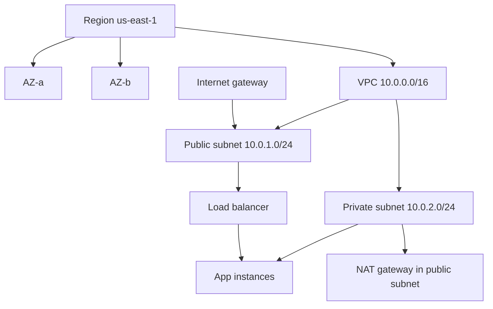

# Cloud Infrastructure (Regions / AZs / VPC)

## 1. One-Line Definition
Cloud infrastructure is organized into regions (geographic clusters of datacenters) containing availability zones (AZs, isolated datacenter groups within a region), and a Virtual Private Cloud (VPC) — a logically isolated network you carve into subnets with route tables, NAT/Internet gateways, and security boundaries — where your resources live.

## 2. Why Do We Need It?
Datacenters aren't interchangeable: network latency across the globe changes user experience, a whole datacenter can fail, and "the cloud" without isolation would mean your VMs share a network with strangers. The region/AZ/VPC model gives you three dials: place resources near users (regions), survive a datacenter failure (AZs), and own a clean, policy-enforced network (VPC with public/private subnets and gateways).

## 3. Simple Intuition
A chain of warehouse districts: regions are whole cities where you might operate, AZs are separate warehouses in one city (each with its own power and sprinklers, so one burning down doesn't take out the whole city), and a VPC is your gated warehouse lot with a fence, a loading dock for trucks from the outside (Internet Gateway), a secure back door for supply trucks that never stops on the street (NAT), and internal aisles you control (subnet routing).

## 4. What Happens Without It?
Without regions you deploy wherever and your users eat 300ms round-trips. Without AZ awareness, your "redundant" pair sits in the same datacenter that just burned. Without a VPC, every service shares a flat, open network: prod talks to a test DB, a leaky debug port is a public port, and there's no boundary to audit. Each of these is a recognizable, real-world outage or breach in the news; the model exists to prevent exactly those shapes.

## 5. Core Idea
- **Region:** a population-dense cluster of datacenters with low internal latency (e.g., us-east-1). Latency, compliance (data residency), and cost/pricing differ across regions; the global edge (DNS + CDN + load balancing) then routes users to the right region.
- **AZ:** one or more datacenters with independent power, cooling, and networking. Two AZs give real failure-domain separation; three are the standard for quorum (see [[cap-theorem|CAP Theorem]]). Inter-AZ traffic has a small cost and an extra couple of ms.
- **VPC:** your private virtual network, isolated from other customers. It has a CIDR, subnets (public vs private), route tables, and gateways (IGW for public internet in/out, NAT for private subnets initiating outbound, VPC peering/transit for VPC-to-VPC).
- **Security groups + network ACLs:** SG = instance-level stateful firewall you attach; NACL = subnet-level stateless filter. Default-deny inbound is the safe default posture.
- **Views that matter:** load balancers live on the edge or in public subnets; databases and internals live in private subnets, unreachable from the internet; edge/DNS/CDN bring users to the front door.

## 6. Important Terminology

| Term | Simple Meaning |
|------|----------------|
| Region | Geographic set of datacenters (us-east-1) |
| AZ | Isolated datacenter group within a region |
| VPC | Your private virtual network in a region |
| Subnet | Network segment inside a VPC (CIDR range) |
| IGW | Internet Gateway: VPC's door to the public internet |
| NAT Gateway | Private subnet's one-way-out to the internet |
| Route table | Map subnet traffic to gateways/peers |
| Security group | Instance firewall (stateful, allow-lists) |
| NACL | Subnet-level stateless firewall |
| Peering / transit | Connect multiple VPCs/regions privately |

## 7. Basic Architecture



Public subnets hold edge components (LB, NAT, bastion) reachable via the IGW; private subnets hold apps and databases, reachable only via routing rules and the NAT for outbound. App span both AZs for failure-domain redundancy.

## 8. Request or Data Flow
1. DNS resolves your domain to the region's load balancer or edge CDN.
2. The LB (in a public subnet) receives the request through the IGW, enforces listener rules, and forwards to a healthy target in a private subnet.
3. Route tables direct the traffic; security groups allow the LB → app port only.
4. The app in the private subnet calls the database in another private subnet via route + SG allow-list.
5. If the app needs outbound internet (patch, external API), it goes out through the NAT gateway — never exposing a public IP on the instance.

## 9. Practical Example
**A payments platform in us-east-1 across 3 AZs.** VPC 10.0.0.0/16 carved into public/private subnets × 3 AZs. An ALB in public subnets fronts 12 API instances spread across AZ-a/b/c; RDS runs multi-AZ (primary in AZ-a, standby in AZ-b) so an AZ failure keeps the DB alive. The IGW exposes only the ALB; the API subnets are pure private, egress-only through a NAT gateway. When AZ-b's power fails, the load balancer and DB recover across the surviving AZs; the security groups and route tables never changed.

## 10. Scaling
- **Across regions:** scale out by standing up the same stack in another region and using geo-DNS/global load balancing — never served 300ms to a user on the other continent from one region.
- **Across AZs:** spread replicas across ≥2-3 AZs for both capacity and failure cover; inter-AZ bandwidth is billed and adds a few ms — weigh using an AZ as a scaling axis vs region copies.
- **VPC scale limits:** a VPC has CIDR and subnet quotas; for huge deployments split into multiple VPCs per team/stack and peer them. Cross-VPC and cross-region traffic flows via peering, transit, or gateway routes, each with capacity and cost notes.

## 11. Reliability and Failure Scenarios

| Failure | What Happens | Detection | Recovery | Trade-off |
|---------|--------------|-----------|----------|-----------|
| Whole AZ down | Instances/LB/DB in that AZ lost | AZ health, monitors | Rebalance to other AZs, re-provision | needs multi-AZ design |
| NAT gateway down | Private instances lose internet | Health checks | Multi-AZ NAT, route to secondary | egress cost |
| IGW/LB config wrong | Worse: public ingress broken | Edge monitors | Route/weighted change | blast radius of network change |
| Region-wide event | Entire region impaired | Provider + SLO | DR runbook → other region | replicate data + standby |
| SG misconfig (too tight) | Legit traffic dropped | Connectivity checks | Fix allow-lists | closed by default |

## 12. Consistency and Correctness
- **Isolation is a correctness statement:** private vs public subnet placement, SG allow-lists, and NACLs define "who can reach what" — a naive "wide-open" subnet violates the contract even if the code works.
- **Multi-AZ state needs a duplicate-tolerant data layer** — see [[database-replication|Database Replication]]: replicated writes across AZs, quorum reads, failover semantics (RPO/RTO decided at the data layer, not the network).
- Statefulness at the edge (LB sessions, DNS TTLs) must align with AZ failover: drains, health checks, and TTLs all affect how cleanly a region/AZ changeover behaves.

## 13. Performance
- **Latency budget is regional geography:** within a region, AZ-to-AZ is ~0.5-2ms extra; cross-region is transit and 50-150ms+ for real distances — the single biggest latency lever (see [[latency-vs-throughput|Latency and Throughput]]).
- **Egress and inter-AZ traffic are billed:** cost is a performance dial too; high fan-out across AZs or regions multiplies bandwidth spend.
- Every network hop (LB → app → DB) is inside the VPC and cheap; the expensive, high-latency jumps are the region boundaries and the public internet.

## 14. Security
- **Default-deny in security groups and NACLs** (see [[web-vulnerabilities|Web Vulnerabilities]]): inbound only what the app needs, from the LB, and admin via bastion/VPN.
- Private subnets keep DBs and internals off the public internet entirely — the single most valuable network structure security-wise.
- Segregation by environment (prod/dev VPCs) plus least-privilege IAM roles for resources (see [[authentication-vs-authorization|Authentication vs Authorization]]).
- Encrypt in transit inside the VPC where policy demands, and at rest everywhere ([[encryption-and-keys|Encryption and Keys]]).

## 15. Trade-Offs

| Choice | Advantages | Disadvantages | When to Use |
|--------|------------|---------------|-------------|
| Single region | Simple, low latency regional, cheap | No geo/DR story | Early stage, single market |
| Multi-AZ single region | Failure cover, low inter-AZ latency | Inter-AZ cost, still one region | Most production stacks |
| Multi-region | User proximity, DR, compliance | Replication/data complexity, cost | Global users, compliance, DR SLOs |
| Shared VPC / per-team VPCs | Clean boundaries vs peering overhead | Governance overhead | Mid-size orgs |
| Everything public vs private | Simpler vs secure | Blast radius | Never fully public |

## 16. Common Mistakes
- Single-AZ "redundancy": two instances in one AZ is one failure domain pretending to be availability.
- Wide-open security groups ("port 22 and 3306 to 0.0.0.0/0") — the classic hardcoded, reviewless flaw.
- Putting databases in public subnets or apps in private subnets with no routing path — invisible outages at first deploy.
- Ignoring inter-AZ and egress cost in the budget until the bill arrives.
- Region counting as HA: one region is not HA across the world; multi-region without a real replication story is decoration.

## 17. HLD vs LLD Boundary
HLD: region strategy, AZ placement of tiers, VPC/subnet topology, public-vs-private boundaries, cross-region replication and failover policy, security posture (SG/NACL/IAM). LLD: the exact CIDR blocks, the SG rule allow-lists, the route table entries, NAT/IGW resource definitions (often written as [[infrastructure-as-code|Infrastructure as Code]]), and the multi-AZ listener configs.

## 18. Interview Questions

### Beginner
- What is an AZ and why does two-AZ beat two instances?
- What is the difference between public and private subnets, and where does each tier go?

### Intermediate
- Design a VPC layout for a two-tier app across 3 AZs: subnets, gateways, security groups, routing.
- Your API is in us-east-1 but half your users are in Singapore. Analyze and propose the fix.

### Advanced
- Design a region-failover story: what must replicate, what breaks, and how fast can you switch?
- A VPC peering diagram across 4 VPCs has a routing loop chance. Walk the route-table design and failure modes.

## 19. Interview Memory Summary

> [!abstract]- Interview Memory Summary
> ### Remember
> - Region = geography/latency/compliance; AZ = failure domain; VPC = your isolated network.
> - Public subnets hold the edge (IGW, LB, NAT); private subnets hold apps/DBs, egress via NAT.
> - Security groups = stateful instance firewalls; NACLs = stateless subnet filters; default-deny.
> - Spread across ≥3 AZs for real failure cover; single-AZ isn't redundancy.
> - Inter-AZ is cheap and low-latency; cross-region is slow and costly — nearest-region wins for latency.
> - State follows the network: multi-AZ data needs replication and failover semantics.
> - Multi-region isn't HA without a real data story.
> - All of it becomes code: [[infrastructure-as-code|Infrastructure as Code]].

### 30-Second Explanation

Cloud infrastructure is laid out as regions (geography, latency, residency) containing AZs (independent datacenters — the failure-domain unit) and a VPC (your isolated network). You carve the VPC into public subnets for the edge (IGW, LB, NAT) and private subnets for apps and databases, enforce reachability with route tables and default-deny security groups, and spread tiers across ≥3 AZs for survival. Nearest-region placement handles latency; multi-AZ replication handles reliability; private subnets handle the security boundary.

### Interview Traps

- Calling two boxes in one AZ "highly available" — that's one failure domain.
- Designating a region as DR without a data-replication and failover answer.
- Wide-open SGs "for simplicity" — they're the canonical incident.
- Forgetting egress/inter-AZ billing in the size-estimation.

### Key Trade-Off

Multi-AZ/multi-region buy failure cover and user proximity; you pay inter-AZ egress, replication complexity, and a far harder data story the moment your "network layout" also implies your consistency model.

## 20. Related Concepts

### Prerequisites

- [[system-design-fundamentals|System Design Fundamentals]]
- [[availability|Availability]]
- [[dns|DNS and DNS Resolution]]

### Commonly Used Together

- [[infrastructure-as-code|Infrastructure as Code]]
- [[kubernetes|Kubernetes]]
- [[load-balancing|Load Balancing]]

### Alternatives

- [[cdn|CDN and Edge Caching]] (static/content edge without a full region)
- On-prem or edge-computing (planned) for latency/compliance niches

### Advanced Concepts

- [[database-replication|Database Replication]]
- [[disaster-recovery|Disaster Recovery]]
- [[rpo-rto|RPO and RTO]]

Related planned topics (not authored yet): vpc-and-subnets, nat, multi-region-models, data-residency, geo-dns-anycast.

## 21. References
AWS/Azure/GCP docs on regions, AZs, VPCs, subnets, IGW/NAT, security groups, and multi-AZ services. Kleppmann ch. 5-6 for why failure domains and replication belong together. Google SRE Book for multi-region and capacity. Verify per-provider current AZ/region limits and pricing.

## 22. Active Recall

Test yourself before revealing each answer.

> [!question]- Why is spanning two AZs "availability" but two boxes in one AZ is not?
> AZs are independent failure domains — separate power, cooling, and network. Two boxes in one AZ share every single failure point; the second is theater unless the wiring, and the datacenter itself, are independent.

> [!question]- When does NAT exist in a private subnet, and what does it solve?
> A private subnet needs outbound-only internet (package installs, external APIs) without a public IP. The NAT gateway, placed in a public subnet, translates outgoing connections so instances stay private while egress still works — and it must be multi-AZ or it's a single point of failure.

> [!question]- A DB is in a private subnet but a deployment job in the public subnet times out reaching it. Diagnose.
> Routing or firewall: the DB's security group must allow the job's source IP/range, the route table must have a path, and the job must be able to reach private IPs (they only exist inside the VPC). When in doubt, test reachability layer by layer: VPC route → SG → NACL.

> [!question]- You pick a region 5,000km from your users. What's the actual double whammy?
> Latency and egress: every user round-trip grows by the physics of the distance (tens-to-hundreds of ms), and data moving across regions/egress is billed. Fix: nearest-region placement (or edge/CDN for static), or accept latency SLA at a price you've actually budgeted.

> [!question]- Interview scenario: design the network layout of a new payments service. Walk it.
> Region with 3 AZs; VPC with public subnets (ALB, NAT ×2, bastion) and private subnets (API instances ×3 AZs; RDS multi-AZ primary/standby). IGW fronts only the LB; SGs default-deny; API→DB via private route + allow-list; outbound via NAT. DR and compliance notes: alternate region receive-only replicas per RPO policy.

## 23. When Should I Use This?

### Use it when

- Your users are distributed and latency/geography matters.
- The system must survive a datacenter outage (the standard reliability bar).
- You need isolation and auditable network boundaries between environments/teams.
- Compliance requires data to stay within certain regions.

### Avoid it when

- A single box for a hackathon is all you need — regions/AZs/VPCs are ceremony here.
- You can't run multi-AZ state: if the data layer doesn't replicate, AZ-splitting the compute buys less than the paper trail suggests.

### What problem does it solve?

It gives you the geographic placement, failure-isolation, and network-isolation primitives that make "reliable cloud" real: users near compute, a datacenter death without an outage, and a private network whose rules you own.

### What problem does it NOT solve?

It does not fix the data model (replication, consistency, RPO/RTO still live in the database layer, not the network), does not make a single region immune to region-wide events, does not automatically secure any misconfiguration you left open, and does not remove the cost/ops of the bridge you lay between regions.

## 24. Decision Connections

Decisions that go together with cloud infrastructure:

- [[infrastructure-as-code|Infrastructure as Code]] — regions, VPCs, and subnets declared, versioned, diffed.
- [[kubernetes|Kubernetes]] — nodes, services, and ingress all land on the VPC/subnet layout.
- [[load-balancing|Load Balancing]] and [[dns|DNS and DNS Resolution]] — bring users to the right region and AZ.
- [[availability|Availability]] — AZ spread is the compute-side lever the availability model relies on.
- [[database-replication|Database Replication]] — multi-AZ data needs replication, quorum, and failover.
- [[disaster-recovery|Disaster Recovery]] and [[rpo-rto|RPO and RTO]] — the region-level stories built on replicated state.
- [[cdn|CDN and Edge Caching]] — the cheaper fast path for static content to distant users.
- [[serverless|Serverless]] — functions also live in a region/VPC with the same boundaries.

Decision tree:

```
Where should this service run?
    |
    +-- Users concentrated in one region?
    |      → single region, multi-AZ across ≥3 AZs
    |
    +-- Users scattered / latency matters?
    |      → nearest-region placement + [[dns|DNS and DNS Resolution]]
    |      +-- static content? → [[cdn|CDN and Edge Caching]]
    |
    +-- Must survive a datacenter loss?
    |      → multi-AZ + replicated DB, failover rehearsed
    |
    +-- Must survive a REGION loss?
    |      → active/passive other-region + [[rpo-rto|RPO and RTO]]
    |
    +-- Compliance / residency?
           → region chosen by law, data pinned there
```