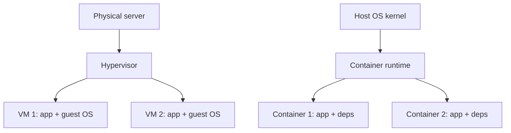

# Containers and VMs

## 1. One-Line Definition
A virtual machine (VM) is a software-emulated computer with its own full operating system running on a hypervisor, while a container is a lightweight, isolated package of an application plus its dependencies that runs directly on the host operating system's kernel.

## 2. Why Do We Need It?
Servers in datacenters sat at single-digit CPU utilization because every app got its own physical machine. We needed a way to pack many isolated workloads onto shared hardware, move them between machines, and ship the exact same environment to every machine. VMs solved sharing at the cost of heavy overhead (a whole OS per workload); containers solved the overhead by sharing one kernel while keeping isolation per app.

## 3. Simple Intuition
A VM is a hotel: each guest gets a full private unit — kitchen, plumbing, walls — the hotel buys everything per unit. A container is a shipping container on a cargo ship: the ship (kernel) provides propulsion and hull once, and standardized containers stack together; each container only carries its own cargo (app + dependencies). You can lift a container off one ship and put it on another without changing its contents.

## 4. What Happens Without It?
Back to bare-metal: every deployment is a manual, error-prone ritual of installing an OS, patching libraries, and hoping nothing conflicts. One app per machine wastes hardware; two apps per machine risk dependency hell and interference. Environments drift between dev, staging, and prod ("works on my machine"). Scaling means buying a physical box and waiting days for it to be racked.

## 5. Core Idea
- **Virtualization:** a hypervisor (KVM, VMware, Hyper-V) partitions one physical host into VMs, each running a full guest OS. The hypervisor multiplexes CPU, memory, and I/O and isolates faults at the OS boundary.
- **Containerization:** a container reuses the host kernel. `namespaces` give each container an isolated view of processes, network, mounts, and PIDs; `cgroups` limit and meter CPU, memory, and I/O. The app and its libraries are baked into an immutable image.
- **Images as artifacts:** a container image is a layered, versioned filesystem (Dockerfile → image). Push to a registry, pull anywhere — build once, run anywhere.
- **Ephemerality by design:** containers are stateless and disposable; state lives in databases or volumes so instances are replaced freely.
- **Orchestration:** containers alone give no placement, restarts, or scaling — that is what an orchestrator like Kubernetes adds.

## 6. Important Terminology

| Term | Simple Meaning |
|------|----------------|
| Hypervisor | Software that creates and runs VMs, sharing one physical host |
| VM | Full guest OS plus app running on a hypervisor |
| Container | App + dependencies sharing the host kernel with isolation |
| Image | Immutable, layered filesystem snapshot of an app |
| Registry | Where images are stored and pulled from |
| cgroups | Kernel feature limiting CPU, memory, and I/O per container |
| Namespaces | Kernel feature isolating processes, network, mounts, PIDs |
| Container runtime | Software (Docker, containerd) that runs containers |
| Orchestrator | System managing many containers across hosts |
| Dockerfile | Recipe that builds a container image |

## 7. Basic Architecture



A single physical host can run either pattern (or both). VMs isolate at the OS boundary: each guest OS is a separate trust domain. Containers share the host kernel and are isolated by namespaces and resource-limited by cgroups, so they achieve far higher density at the cost of a larger kernel attack surface shared with the host.

## 8. Request or Data Flow
1. Developer builds an image from a Dockerfile and pushes it to a registry.
2. A runner or orchestrator pulls the image to a target host.
3. The runtime unpacks layers, creates namespaces and cgroups, and starts the container process.
4. A [[load-balancing|Load Balancing]] layer or router sends traffic to the container's mapped port.
5. On update, the old container stops and a new image starts — the instance is replaced, not patched.

## 9. Practical Example
**A 4-vCPU/16GB host.** A typical app needs roughly 0.5 vCPU and 1GB idle. As VMs, each carrying a 1-2GB guest OS, you fit maybe 6-8 on the host and spend a quarter of memory on OS overhead. As containers, the same app's footprint is the process plus deps — you fit 15-20 and boot new ones in under a second. A Kubernetes deployment running 5 frontend containers across 3 nodes shares one host OS per node and restarts a failed container in milliseconds after a health-check failure.

## 10. Scaling
- **Container scaling** is near-instant (seconds), so an orchestrator can burst replica counts on demand — the basis of horizontal autoscaling.
- **VM scaling** takes minutes (provision OS, boot, config), but VMs can be resized vertically without changing the code.
- **Horizontal scale:** more replicas behind a load balancer; containers make this cheap because replicas are stateless — see [[horizontal-vs-vertical-scaling|Horizontal vs Vertical Scaling]].
- **What breaks:** stateful workloads (a container's local disk is lost on restart), image-pull storms when many replicas start at once, and host saturation when too many containers land on one node — solved with placement rules, quotas, and node pools.

## 11. Reliability and Failure Scenarios

| Failure | What Happens | Detection | Recovery | Trade-off |
|---------|--------------|-----------|----------|-----------|
| Container crashes | Instance gone, traffic disrupted | Runtime health check | Orchestrator restarts or replaces | brief blip per replica |
| Host dies | All its containers disappear | Node heartbeat timeout | Schedule replicas on other nodes | need spare capacity |
| Image missing or corrupt | Pull fails, no start | Pull error | Re-push, retry, pin digests | registry availability |
| Resource starvation | Container OOM-killed or throttled | cgroup metrics | Raise limits or split pods | density vs stability |

## 12. Consistency and Correctness
- Containers are **ephemeral and stateless**: after a restart the filesystem is fresh. Any state kept on the container disk is lost — so correctness demands that stores live in [[database-fundamentals|Database Fundamentals]], object storage, or attached volumes.
- **Immutable images** give reproducible behavior: the same image produces the same app on every host (dependencies pinned at build time).
- Rollouts replace instances; the orchestrator must drain old connections before terminating (graceful-shutdown window) so in-flight requests are not lost mid-update.

## 13. Performance
- Containers run near-native speed — the host kernel is already doing the work; there is no hardware emulation or second OS in the path.
- VMs add a real but modest tax: extra memory for guest OSes and hypervisor CPU overhead.
- Density is the real performance lever: containers pack 2-3x more workloads per host, which cuts the machine footprint and network hops needed to serve the same traffic.
- Cold pulls of large images add startup latency; pre-warming images on nodes hides that cost.

## 14. Security
- Containers share the host kernel, so a container escape is a host compromise — treat hosts as a real trust boundary. Run containers as non-root, use read-only root filesystems, and consider seccomp and AppArmor profiles.
- VMs isolate at the OS boundary: a compromise inside a guest OS stays there (absent hypervisor bugs). Choose VMs when tenants are hostile or workloads need hard isolation.
- Image provenance matters: pull only from trusted registries, sign images, and scan them for known vulnerabilities before deploy.

## 15. Trade-Offs

| Choice | Advantages | Disadvantages | When to Use |
|--------|------------|---------------|-------------|
| VM | Strong isolation, any OS, familiar, vertical resize | Slower boot, more memory overhead per unit | Hard multi-tenancy, legacy OS apps, security-sensitive |
| Container | Near-native speed, instant start, huge density, immutable images | Shared kernel risk, state must move out | High-density, fast-changing, cloud-native workloads |
| Bare metal | No virtualization tax, best for exotic I/O | One app per machine, manual ops, slow scaling | GPU/HPC, extreme performance |

## 16. Common Mistakes
- Architecting for VMs (state on the instance, manual config) and then "containerizing" without changing the design — you keep VM problems at container density.
- Storing state in containers and silently losing data on restart.
- Treating the host kernel as safe: running privileged containers or root processes in production.
- Pulling images without pinning digests — reproducibility lost.
- Forgetting containers isolate you from other apps, not from the kernel: noisy-neighbor CPU contention still happens without cgroup limits.

## 17. HLD vs LLD Boundary
HLD: choose VM or container per workload, decide density per host, pick orchestrator vs managed VMs, define image strategy and state placement. LLD: write the Dockerfile, the health-check endpoint, the runtime memory limits, the container entrypoint script.

## 18. Interview Questions

### Beginner
- What is the difference between a VM and a container, architecturally?
- Why is a container more efficient than a VM at startup and density?

### Intermediate
- You are containerizing a stateful legacy app. What do you move out of the container, and why?
- A container host is at 100% memory. How do you diagnose which container is responsible?

### Advanced
- Design the isolation story for running untrusted multi-tenant workloads: when do you need VMs over containers?
- How would you run containers at scale across 10,000 hosts — what must orchestrator, registry, and networking provide?

## 19. Interview Memory Summary

> [!abstract]- Interview Memory Summary
> ### Remember
> - VM = full guest OS on a hypervisor; container = app + deps sharing the host kernel.
> - Containers isolate via namespaces and cgroups; VMs isolate at the OS boundary.
> - Images are immutable, layered, pushed to a registry, pulled to any host — build once, run anywhere.
> - Containers are ephemeral: state must live in a database, volume, or object store.
> - Density and startup speed are containers' wins; hard isolation is VMs' win.
> - Containers need an orchestrator for placement, health, and scaling.
> - Trusted images, non-root execution, and cgroup limits are baseline security.

### 30-Second Explanation

Containers package an app with its dependencies and run it on the host kernel, isolated by namespaces and constrained by cgroups, so thousands of them boot in seconds at high density from immutable images. VMs run a whole guest OS on a hypervisor, giving hard isolation at higher overhead. Use containers for cloud-native services, VMs for security-sensitive or legacy workloads; give state to external stores either way.

### Interview Traps

- Claiming containers give the same isolation as VMs — they share the kernel by design.
- Putting state inside a container and assuming it survives a restart.
- Saying "we containerized" without addressing image provenance or resource limits.
- Confusing the image (build artifact) with the container (running instance).

### Key Trade-Off

You buy near-native density, instant startup, and immutable artifacts from containers; you pay with a shared-kernel attack surface and forced statelessness, so hard isolation and durable state live outside the container.

## 20. Related Concepts

### Prerequisites

- [[horizontal-vs-vertical-scaling|Horizontal vs Vertical Scaling]]
- [[stateless-vs-stateful-services|Stateless vs Stateful Services]]

### Commonly Used Together

- [[kubernetes|Kubernetes]]
- [[load-balancing|Load Balancing]]
- [[cloud-infrastructure|Cloud Infrastructure (Regions / AZs / VPC)]]

### Alternatives

- [[serverless|Serverless]] (give up the host entirely)
- [[cloud-infrastructure|Cloud Infrastructure (Regions / AZs / VPC)]] (managed VMs, pick sizes)

### Advanced Concepts

- [[kubernetes|Kubernetes]]
- [[service-mesh|Service Mesh]]

Related planned topics (not authored yet): microservices, monolith, api-gateway.

## 21. References
Kleppmann ch. 6 uses partitioning language but ch. 1 covers the compute-model spectrum; Docker and Kubernetes official docs for image and runtime specifics. For VM/container overhead figures, consult current managed-Hypervisor and runc/containerd benchmarks.

## 22. Active Recall

Test yourself before revealing each answer.

> [!question]- What is the key architectural difference between a VM and a container?
> A VM runs a full guest operating system on a hypervisor (isolation at the OS boundary). A container shares the host kernel and is isolated at the process level by namespaces and resource-limited by cgroups — so no second OS is booted.

> [!question]- Why does a container boot in milliseconds while a VM takes minutes?
> A container starts one process on an already-running kernel; there is no BIOS, no OS boot, and no guest-driver initialization. A VM must boot an entire guest OS.

> [!question]- A container holds user-uploaded state in a local directory. What is the failure mode?
> Containers are ephemeral: on any restart, replacement, or reschedule the local filesystem is fresh. The state is silently lost. Correct design moves mutable state to an attached volume, object storage, or a database.

> [!question]- Why would you still choose a VM over a container for one workload even though containers are cheaper?
> Isolation. Containers share the host kernel, so an escape compromises the host and neighbors; a VM with its own guest OS is a hard trust boundary. Unmanaged or hostile tenants get VMs.

> [!question]- A host runs 20 containers and one of them consumes all available CPU. How do you prevent that class of problem?
> The kernel gives each container only what its cgroup quota allows. Set explicit requests and limits per container (CPU, memory) and monitor throttling and OOM kills; otherwise one noisy neighbor starves the rest.

> [!question]- Your team says, "We containerized, so we are cloud-native." How do you respond in an interview?
> Containerizing is necessary but not sufficient. Cloud-native value comes from stateless replicable services, health checks, orchestrated autoscaling, centralized state, and automated deployment. A container that still holds state and is configured by hand is a VM in disguise.

## 23. When Should I Use This?

### Use it when

- You need high density of similar workloads on shared hardware.
- You want the exact same environment from dev to prod (immutable images).
- Your services are stateless and replaceable, and you want fast start/stop.
- You want to move workloads among hosts cheaply (orchestrator placement).

### Avoid it when

- You need hard isolation between hostile or untrusted tenants — use VMs.
- Your app needs a specific guest OS or heavyweight kernel-level dependencies — contains hyperscale, GPU, exotic drivers.
- Your team is not ready for an orchestrator: running containers by hand is worse than managed VMs.
- The workload is CPU-bound legacy code with no path to statelessness.

### What problem does it solve?

It solves hardware utilization ("one app per server" waste) and environment drift by packaging each app with its dependencies into a portable image, and by isolating workloads cheaply on shared hosts.

### What problem does it NOT solve?

It does not give you scaling, health-based replacement, networking, or rollout automation by itself — that needs an orchestrator. It does not make stateful data safe (state must move out). It does not provide strong security isolation between kernels.

## 24. Decision Connections

Decisions that go together with containers and VMs:

- [[kubernetes|Kubernetes]] — the orchestrator that turns containers into a platform (placement, health, scaling).
- [[horizontal-vs-vertical-scaling|Horizontal vs Vertical Scaling]] — stateless containers scale out; memory-bound VMs scale up.
- [[stateless-vs-stateful-services|Stateless vs Stateful Services]] — containers assume statelessness; stateful work needs volumes or external stores.
- [[load-balancing|Load Balancing]] — a fleet of interchangeable containers needs a router in front.
- [[cloud-infrastructure|Cloud Infrastructure (Regions / AZs / VPC)]] — hosts, subnets, and node placement define where containers run.
- [[serverless|Serverless]] — the endpoint of this spectrum: give up managing hosts entirely.
- [[ci-cd|CI/CD]] — images are produced by pipelines and consumed by deployments.

Decision tree:

```
Deployment target choice
    |
    +-- Need hard isolation or full guest OS control?
    |      → [[cloud-infrastructure|Cloud Infrastructure (Regions / AZs / VPC)]] VMs
    |
    +-- Need high density, speed, reproducible env?
    |      |
    |      +-- One host, manual?  → container runtime only
    |      +-- Many hosts, orchestrated?
    |             → [[kubernetes|Kubernetes]]
    |
    +-- Don't want to manage any host?
    |      → [[serverless|Serverless]]
    |
    +-- Altitude check: capacity fixed?
           → [[horizontal-vs-vertical-scaling|Horizontal vs Vertical Scaling]]
```