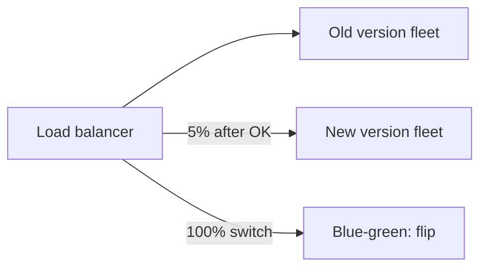

# Deployment Strategies

## 1. One-Line Definition
Deployment strategies are the pattern by which a new software version replaces the old one in production — from simple replace-in-place (recreate), to rolling updates, blue-green switches, canary rollouts, and shadow releases — chosen to trade speed against downtime and risk.

## 2. Why Do We Need It?
Shipping new code is when systems usually break: a bad version goes live, traffic hits it, and the team races a rollback while users see errors. A good deploy strategy minimizes the window in which bad code can harm users, gives an escape hatch (traffic flip instead of code revert), and lets the team verify a version on real traffic before committing fully. The strategy is the front line of the reconciliation between safety and shipping speed.

## 3. Simple Intuition
Changing the engine on a plane while it's flying at 800mph is obviously insane — you land a second identical plane first (blue-green), test the engine there, then switch passenger flow to it. If the new plane misbehaves, you switch the passengers back to the old one. A rolling change replaces wheels one at a time mid-takeoff (fine on a car, risky on a jet); a canary demotes one passenger to run the gamble first.

## 4. What Happens Without It?
A deploy is: kill all old version, start all new version, hope. If the new version crashes or misbehaves, you're fully down until you revert — and if migrations or state changed, the revert may be even worse. Every release is a capacity-dropping, availability-ripping event. The team becomes afraid to ship, and releases batch up and grow more dangerous.

## 5. Core Idea
- **Recreate:** stop old, start new. Simple, but a full downtime window. Fine for maintenance windows and incompatible state changes.
- **Rolling update:** take a few old instances down, bring up equal new ones, repeat — capacity is always near-100% and no flip exists to abort; you roll back by reversing the rolling process if caught early enough.
- **Blue-green:** run two full environments. Traffic switches wholesale (e.g., LB/DNS) from blue to green; rollback is an instant flip back. Cost: double the capacity during deploy.
- **Canary:** route a small slice (5-10%) of real traffic to the new version, observe, then widen — the safest gradual exposure. Rollback is a traffic redirect.
- **Feature-flag overlap:** many teams use canary/blue-green for the environment flip plus [[feature-flags|Feature Flags]] for per-user toggles inside a version.

## 6. Important Terminology

| Term | Simple Meaning |
|------|----------------|
| Recreate | Kill all; start all; downtime |
| Rolling update | Swap instances in small batches |
| Blue-green | Two live environments; atomic traffic flip |
| Canary | Small real-traffic slice to the new version |
| Shadow / dark launch | Send copies of real traffic to a passive app |
| Max surge / max unavailable | K8s rolling knobs (how many extra/down) |
| Rollback | Return to a known-good version |
| Traffic weighting | Percentage split of requests between versions |
| Drain | Gracefully finish in-flight requests before stop |
| Bake time | Observational pause before widening |

## 7. Basic Architecture



One drawing shows two families: canary weights traffic (5% → 50% → 100%), while blue-green flips 100% between two pre-warmed environments. Both rely on a traffic controller rather than instance replacement.

## 8. Request or Data Flow
1. CI produces a new artifact; the rollout begins.
2. Rolling: kubelet stops 1 old pod, starts 1 new, waits for readiness, repeats; capacity never drops and endpoints only ever see healthy pods.
3. Canary: the LB sends 5% of requests to v2; the dashboards (errors, latency, p99) stay green for 10 minutes, then weight rises to 50, then 100.
4. Blue-green: v2 environment passes smoke tests; the LB target group switches to v2 wholesale; old v1 is kept warm an hour for instant rollback, then decommissioned.
5. Any strategy ends by confirming error rate and latency at full flow before declaring the release done.

## 9. Practical Example
**Checkout service, 4.2M orders/day.** Blue-green would need a full duplicate stack; instead they canary: 3% to v2 → 10 minutes → errors and p99 flat → lift to 25% → 50% → 100% over an hour (weighted LB on a shared cluster). They keep a v1 deployment for 30 minutes for flip-back. When a bad rule slips in at 100% (a config, not a crash), they flip the LB to v1 in under a minute while the offending rule is reverted. Cost: no doubling of checkout capacity, just cluster headroom.

## 10. Scaling
- **Rolling scales naturally with pod counts** (one swap at a time); very large fleets can parallelize batches — that's maxSurge/maxUnavailable on a Deployment.
- **Canary weight granularity** matters at huge QPS: a 1% slice of 100k QPS is already 1k req/s — enough signal; at tiny QPS, 100% still isn't a canary, you need staging + synthetic traffic.
- **Blue-green doubles cost** but is the simplest scale behavior: flip atomic at any fleet size. Its cost is the reason it tends to be used for big, infrequent releases.

## 11. Reliability and Failure Scenarios

| Strategy | Failure Mode | Detection | Recovery | Trade-off |
|----------|--------------|-----------|----------|-----------|
| Recreate | Full outage if new version crashes | Immediate errors | Redeploy previous version | downtime window |
| Rolling | Bad version spreads before caught | Error-rate monitors | Reverse the rollout, reapply old | partial exposure during roll |
| Blue-green | Green breaks at 100% | Before-drain smoke + dashboard | Flip back to blue instantly | double infra cost |
| Canary | 5% users see bugs | Canary telemetry | Set weight to 0 immediately | signal latency, small exposure |

## 12. Consistency and Correctness
- **Schema and data compatibility is the silent killer:** a new app version against old schema (or vice versa) breaks mid-rolling. Version N must work with schema N and N-1 (expand-contract / dual-write) or the deploy must be a forced recreate with migration.
- **Idempotent and backward-compatible changes** keep rollback safe: if v2 writes a new field the old readers can't parse, flipping back does not un-write it.
- Banking-style guarantees: the deploy system should only promote an instance into the routing set after its readiness/health passes — a half-initialized pod must never take traffic.

## 13. Performance
- **Rolling keeps capacity flat** (one pod down at a time) — the least overhead at scale.
- **Blue-green temporarily doubles resource cost** but has zero per-request overhead and the fastest rollback.
- **Canary** adds near-zero overhead; its real cost is telemetry sensitivity (you must be able to detect a 1% error slice via logs/metrics correlation, e.g. version-label on traces).
- Bake times extend the "release duration": every minute of canary weighting is a minute the "real" feature is only partially available.

## 14. Security
- Canary and blue-green reduce the window of exposure to a bad (possibly compromised) artifact and allow quick quarantine — the LB flip is the isolation control.
- Keep old environments only as long as the rollback window; orphaned blue environments are attack surface and cost.
- CI/CD credentials that perform deploys must be least-privilege and audited; rotating them on artifact signing is part of a defendable release chain.

## 15. Trade-Offs

| Strategy | Downtime | Risk Control | Cost | When to Use |
|----------|----------|--------------|------|-------------|
| Recreate | Full | None | Cheapest | Maintenance windows, incompatible schema |
| Rolling | None | Partial | Low | Most day-to-day web deploys |
| Blue-green | None | Instant rollback | Double capacity | Critical, infrequent, big launches |
| Canary | None | Best gradual detection | Low | High blast radius, continuous deploys |
| Shadow | None | None to users | Medium | Regression/capacity validation |

## 16. Common Mistakes
- Rolling a version that's not backward-compatible with the old schema — carnage mid-roll.
- Canary metrics that can't distinguish versions (no version label on traces), so a 5% error is invisible.
- No defined escape: assuming rollback = "redeploy old image" while ignoring migration side effects already applied.
- Blue-green with zero bake time — flipping green the second it's healthy and later flipping a green that wasn't actually validated.
- Using the console sneaky-path for the traffic switch instead of the deploy system — the flip must be versioned with the release.

## 17. HLD vs LLD Boundary
HLD: choose strategy per service (blast radius, downtime allowance, cost), decide bake times, weight steps, rollback procedure, and schema-compatibility rule. LLD: the Deployment rolling config (maxSurge/maxUnavailable), the LB weight values, the canary labeler for telemetry splits, the pipeline stage that performs the flip.

## 18. Interview Questions

### Beginner
- What is the difference between rolling and blue-green deployment?
- When is recreate the right, not just the lazy, choice?

### Intermediate
- Pick a strategy for a payments service. Justify with blast radius, cost, and rollback path.
- Canary at 5% shows zero errors, yet your users complain. What's broken in the detection path?

### Advanced
- Design a blue-green that can also serve as a quick blue→blue rollback after green runs for a week with schema changes applied.
- Combine deployment strategy, feature flags, and a data migration for a zero-downtime schema change — walk the ordering.

## 19. Interview Memory Summary

> [!abstract]- Interview Memory Summary
> ### Remember
> - Rolling: swap instances in batches; capacity flat, no flip.
> - Blue-green: two full envs; atomic traffic flip; double cost.
> - Canary: small real-traffic slice → widen; best gradual detection.
> - Create = full downtime; fine for maintenance/incompatible-schema windows.
> - Schema/data compatibility decides whether rollback is even possible.
> - Traffic flip on the LB beats code revert for escape.
> - Canary is only as good as its per-version telemetry.
> - Bake time prevents "deployed but unvalidated" surprises.

### 30-Second Explanation

Choose deploy shape by blast radius: rolling swaps instances batch-by-batch at full capacity with no rollback switch; blue-green flips traffic atomically between two pre-warmed environments, spending double capacity for instant escape; canary exposes the new version to a small real-traffic slice and widens only while green telemetry holds. The "rollback" is usually a traffic redirect plus a data-compat check, not a code revert — that's why schema compatibility decides the ceiling of every strategy.

### Interview Traps

- Claiming a rollback is just "redeploy the old image" — migrations and schema changes rarely undo.
- Confusing canary weight steps with traffic-shifting feature flags — both exist and serve different goals.
- Canaries without version-correlated monitoring are theater, not safety.
- Forgetting blue-green still needs a bake time and a drain for the old fleet.

### Key Trade-Off

You trade capacity, time, or detection power for safety: rolling is cheap but has no flip, blue-green has a perfect rollback at double cost, canary offers the best gradual detection with a modest telemetry burden — pick the shape the blast radius of the change deserves.

## 20. Related Concepts

### Prerequisites

- [[load-balancing|Load Balancing]]
- [[ci-cd|CI/CD]]
- [[containers-and-vms|Containers and VMs]]

### Commonly Used Together

- [[feature-flags|Feature Flags]]
- [[kubernetes|Kubernetes]]
- [[autoscaling|Autoscaling]]
- [[observability|Observability]]

### Alternatives

- [[feature-flags|Feature Flags]] (per-user toggle vs per-traffic switch)
- Shadow Traffic (planned; dark launch of a version for capacity testing without user impact)

Related planned topics (not authored yet): connection-draining, backward-compatibility, shadow-traffic.

## 21. References
Kubernetes Deployment docs (rolling update semantics, maxSurge/maxUnavailable). Martin Fowler's "BlueGreenDeployment" write-up (2009/update) for blue-green and canary. Google SRE Book chapter on releasing software. Verify current rollout/AB/weighted-routing behavior in Istio/nginx-ingress docs.

## 22. Active Recall

Test yourself before revealing each answer.

> [!question]- When is recreate deployment not a cop-out but the right choice?
> When a change is fundamentally incompatible with the old version — schema migrations, connection-protocol changes — so old and new cannot coexist transiently. Forced downtime in a maintenance window is safer than a rolling delete-and-recreate that breaks mid-roll.

> [!question]- Why is canary detection "as good as its telemetry"?
> The canary exposes new code to a tiny slice of real users. To learn anything, logs/metrics/traces must be partitioned by version — if the only signals aggregate across versions, a 5% bug becomes invisible noise until the whole fleet is on it.

> [!question]- A blue-green flips green and 10 minutes later incidents start. What does the postmortem likely say?
> No bake time: green was switched immediately after health checks instead of observing it with real load long enough; or the flip raced a background migration that only surfaced post-switch. The fix is a bake window with version-labeled telemetry and a re-flippable green for the whole rollback window.

> [!question]- Canary at 100% errors but the dashboard stays green. Rank the failure points.
> 1) Telemetry not version-partitioned. 2) Alerts threshold too high for the slice. 3) The error happens on code paths only a wider cohort exercises (DB writes vs cached reads). 4) Metrics flush latency masks the spike. Fix all four before trusting any canary.

> [!question]- Interview scenario: zero-downtime release of a payments migration. Walk the plan.
> 1) Expand schema: write new column alongside old (dual-write), old code reads old, new code starts slowly via canary. 2) Canary 5→50→100 with version-labeled p99/error alarms and a flip-back path. 3) Feature-flag the new code path for full control. 4) Bake at 100%, then migrate data, then contract (drop the old column) in a separate release. Never let the deploy outpace the data compatibility.

## 23. When Should I Use This?

### Use it when

- Paying a downtime window for releases is unacceptable.
- The change could regress behavior you can't fully test offline — real-traffic validation helps.
- You need a rapid, cheap escape path (rollback via traffic, not redeploys).
- The code and its data are kept backward-compatible release-over-release.

### Avoid it when

- The change is a forced incompatible schema or protocol upgrade — a controlled recreate beats a rolling faceplant.
- You can't distinguish versions in metrics (no point canarying blindly).
- You have a single service and no LB/rollout controller — strategies need a traffic knob.

### What problem does it solve?

It replaces "ship and pray" with a measured, reversible release: production changes happen at roughly-full capacity, problems are detected on a small population first, and the way back is a traffic decision, not a midnight code sprint.

### What problem does it NOT solve?

It does not fix an incompatible schema history (that's data engineering + expand-contract), does not prevent logical bugs (only narrows their exposure), does not remove the need for smoke tests and monitoring, and does not help you if the team lacks the telemetry that makes canaries meaningful.

## 24. Decision Connections

Decisions that go together with deployment strategies:

- [[ci-cd|CI/CD]] — the pipeline that builds artifacts and drives the rollout stages.
- [[load-balancing|Load Balancing]] — every strategy is ultimately a traffic-routing decision (weights, target groups, flips).
- [[kubernetes|Kubernetes]] — rolling updates are the K8s default; canary via weights/manifests.
- [[feature-flags|Feature Flags]] — the code-level complement: toggles that survive a deploy boundary.
- [[observability|Observability]] — error-rate/version-partitioned signals are the eyes of any canary.
- [[autoscaling|Autoscaling]] — capacity must exist for blue-green doubles and canary overheads.
- [[reliability|Reliability]] and [[availability|Availability]] — deploy shape directly sets the window of risk.

Decision tree:

```
Releasing v2 into production
    |
    +-- Incompatible schema with v1?
    |      → recreate in maintenance window or migrate-first then deploy
    |
    +-- Cheap to double capacity?
    |      |
    |      +-- Want instant rollback? → blue-green
    |      +-- Need gradual real-traffic validation? → canary from blue-green
    |
    +-- Standard service, need speed + capacity?
    |      → rolling update
    |
    +-- Want zero real-traffic risk while validating?
           → shadow traffic with observed capacity
```