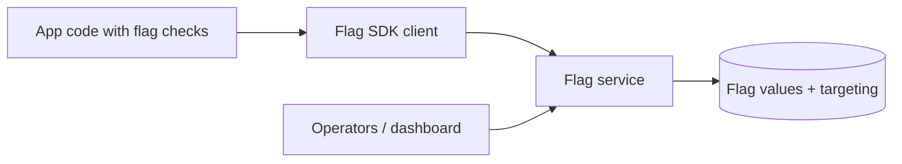

# Feature Flags

## 1. One-Line Definition
Feature flags (feature toggles) are runtime-configurable switches in code that gate access to new behavior — a feature can be shipped dark, turned on for a subset of users, and flipped off instantly — decoupling deployment of code from release of behavior.

## 2. Why Do We Need It?
Shipping code and releasing features fight each other: merging a half-finished feature indexes risk, deploying a risky feature with no off-switch turns every release into a leap of faith, and slow rollbacks turn small bugs into long incidents. Feature flags break the coupling — code arrives in production long before it's visible, is toggled per user/per environment, and the kill switch is a config flip instead of a redeploy, so the whole [[deployment-strategies|Deployment Strategies]] catalog works better and the team ships faster.

## 3. Simple Intuition
A theater backstage with a lighting board. The actors (code) are all on stage, but the lights (flags) decide which set the audience actually sees — some scenes are lit only for preview audiences, and at any second the lighting tech can snap everything back to the visible default. The stage designer's mistake is fixed by flipping a switch, not by wheeling the entire set off and re-building it.

## 4. What Happens Without It?
Every unfinished feature blocks a merge (long-lived branches, merge hell), and every risky release "goes big or goes home" with no way to dial it down. Rolling back a crashing release is a clumsy, minutes-long redeploy while users see errors. Testing is all-or-nothing: new behavior can't be validated in production on 5% before the whole population is affected.

## 5. Core Idea
- **The flag is data, not code:** the flag's value lives in a config service (or in the app, declining in sophistication: files → redis → a dedicated SDK service). Runtime changes reach all instances in seconds.
- **Split the "deploy" from the "release":** code ships always-on-but-dark; the flag controls visibility. Deploys become boring; releases become deliberate.
- **Flags are permanent levers, not code-removal tools:** kill switches (emergency off), canary/percent releases, staged rollout to user cohorts (username hash), per-account enablement, A/B experiments.
- **Drift and debt are the real cost:** every flag left in the code is dead weight, branchiness, and testing ambiguity. A flag lifecycle (create → roll out → evaluate → remove) is part of the design, not an afterthought.
- **Consistent across environments:** flag values must be explicit per env (dev, staging, prod) so a feature tested in staging is on the same switch in prod.

## 6. Important Terminology

| Term | Simple Meaning |
|------|----------------|
| Flag / toggle | Boolean gate on behavior in code |
| Kill switch | Emergency off for a risky feature |
| Percentage rollout | Flag true for N% of requests |
| User cohort | Flag true for a defined user segment |
| A/B test flag | Randomized variant assignment for experiments |
| Flag drift / debt | Orphan flags left in code forever |
| Kill gate | The team process around flipping the switch |
| Flag SDK / service | Central system distributing flag values |

## 7. Basic Architecture



The app evaluates flags through an SDK that pulls (and caches) current values from a central flag service; operators change values per user/percent/env in the dashboard, and instances converge within seconds.

## 8. Request or Data Flow
1. Merged code references `is_checkout_v2()` for a new checkout flow.
2. The flag starts false (off), so v1 remains the visible behavior in prod.
3. A/B or staged rollout: the operator sets "on for users ending in 0-4" — the SDK returns true for that cohort at request time.
4. A crash in v2 at 20%: operator sets rollout to 0%; within seconds all users are back on v1, no redeploy.
5. When the rollout is stable and measurements collected, the flag's true-branch becomes the default and the flag is removed in a later code change.

## 9. Practical Example
**New checkout at 3% → 10% → 100% over two weeks.** Deploy includes the `checkout_v2` flag, off by default — the code is live every day, but users see v1. Monday: 3% cohort (by user-id modulo) sees v2; conversion tracks even. Thursday: 10%; p99 latency spikes on cart-heavy users → flag dropped to 0% while a fix lands; Friday: 100%, then five days at full flow before the flag code is deleted in a later release. Dependencies outside the flag (the payment migration) were already released dark behind the same gate.

## 10. Scaling
- **Flag service is a read-hot path:** every request may evaluate several flags; cache aggressively (SDK polls or subscribes with long TTLs) and shard per-region. The flag service itself must scale like any hot config system.
- **Evaluation cost is per flag per request:** hundreds of flags × high QPS adds work — batch evaluations, evaluate once per request, keep flag lookups out of tight loops.
- **What breaks:** flag storms from a misconfigured rollout (everyone flips at once), sync delay across regions (mobile clients keep the old value), and cross-team flag dependencies that make one flip cascade.

## 11. Reliability and Failure Scenarios

| Failure | What Happens | Detection | Recovery | Trade-off |
|---------|--------------|-----------|----------|-----------|
| Flag service down | Clients use cached last-known values | Service health | Deep-cache fallback, fail open/closed | staleness vs availability |
| Wrong flag toggle | Sudden behavior change fleet-wide | Dashboards instantly red | Toggle back; audit why | human-error surface |
| Flag left on in prod | Unreleased feature visible from staging | Tremendous confusion | Remove the flag from config | config hygiene |
| Coding error at 100% rollback | Full blast radius | Error rate | Kill switch + traffic flip | the flag can't fix the bug |

## 12. Consistency and Correctness
- **Flag convergence is eventual:** different instances/clients see old and new values during a transition — v1 and v2 logic may both be live briefly; design for that (no assumption that "everyone sees the same flag" except by target-group sync).
- **Your data model can be at odds with your flag:** a user provisioned under v2 semantics but later flipped back can have partial writes. Keep flag transitions "logical" — write in dual-mode until the flag is removed or accept a reconciliation story.
- **Idempotent flag checks:** one request must use one consistent set of flag values; sample the flag once per request (or per scope), not per sub-call, or behavior can wobble mid-request.

## 13. Performance
- **Per-request evaluation cost** is the main overhead: one SDK call at the start of a request is negligible; do not re-fetch per flag per loop iteration.
- **Sync latency** (SDK poll interval, CDN push, mobile app cache TTL) sets how fast a kill switch reaches the fleet — the performance metric that matters for a flag is the reach-latency, not the eval cost.
- Cached flags with nil side effects are effectively free; the cost grows when flags carry heavy custom logic or trigger remote lookups.

## 14. Security
- A flag is power: whoever can flip it can disable a payment path or expose a beta — treat the flag dashboard as a privileged surface with authentication + audit (see [[authentication-vs-authorization|Authentication vs Authorization]]).
- Don't gate security features solely with flags that can be toggled off in an incident.
- Flag targeting rules can leak user identity semantics — ensure cohort/segment definitions don't expose PII through error paths or SDK logs.

## 15. Trade-Offs

| Approach | Advantages | Disadvantages |
|----------|------------|---------------|
| In-code constants | Zero infra, compile-time safety | Revert = redeploy, no runtime control |
| Config files | Portable, git-tracked | Slow to reach fleet, env-brittle |
| Central flag service | Instant, granular control, auditing | A service to operate + a dependency |
| Flag SDK on CDN | Fast propagation, mobile-friendly | Edge caching, consent/complexity |

## 16. Common Mistakes
- Flags never removed — codebase fills with dead branches, every test suite ends up testing 16 states.
- Using flags to hide sloppy migrations: the flag hides the feature but the data model is already live and incompatible.
- Per-request flag chaos (each sub-call re-evaluates) — a half-switched request behaves inconsistently.
- Trusting the flag to fix the bug — a bug flagged on for everyone isn't a flag problem, it's a release discipline problem.
- No kill-switch drill: nobody knows the fast flip path until the incident is happening.

## 17. HLD vs LLD Boundary
HLD: which features are flaggable, the envelope (service vs files), rollout/rollback policy, flag naming and lifecycle standard, audit and dashboards. LLD: the `if (flag.isOn(...))` calls in code, the SDK init, the flags in the config, the dashboard role bindings.

## 18. Interview Questions

### Beginner
- What does it mean that code can deploy "dark"?
- Contrast a feature flag with a branch and with a deployment strategy.

### Intermediate
- You need to roll out a new algorithm to 5% of users. Design the flag criteria and the measurement that decides the next step.
- What risks appear when flags are left in the codebase for a year?

### Advanced
- Design a flag system with per-user targeting and kill-switch semantics for mobile apps that sync slowly.
- A flag turns on "the new billing," the service misbehaves at 50%. Walk the kill + recovery sequence including data-consistency consequences of flipping back.

## 19. Interview Memory Summary

> [!abstract]- Interview Memory Summary
> ### Remember
> - Flags split deploy (code in prod) from release (behavior visible).
> - The flag is runtime data, not code — flip = config change, not redeploy.
> - Kill switch, percent rollout, cohort targeting, A/B = the main uses.
> - Flag evaluation is a hot read path; cache and batch.
> - Convergence is eventual: old/new values briefly coexist — design for it.
> - Flag debt is real: define creation-to-removal lifecycle.
> - Flag dashboard is a privileged surface — auth and audit it.
> - Flags shrink the blast radius of a deploy but never fix a bug.

### 30-Second Explanation

A feature flag gates new behavior behind a runtime-controlled switch, so code ships to prod dark and the release decision is a config flip — enabling kill switches, staged percent rollouts, cohort targeting, and instant rollback without a redeploy. Evaluation runs through a flag service with cached SDK reads; the discipline is lifecycle hygiene (remove flags when the new path wins) and convergence tolerance, because flags don't make a bug go away, they just contain it.

### Interview Traps

- Treating flags as a substitute for deployment strategies — they complement, not replace.
- Leaving flags in forever — dead branches are testing and readability debt.
- Expecting instant fleet-wide convergence (mobile/edge caches lag).
- Flipping a flag as the fix while the underlying bug stays live.

### Key Trade-Off

You buy instant runtime control and tiny blast radii, and pay with flag-service complexity, evaluation overhead on hot paths, and an ongoing tax of removing flags the design forgot to schedule.

## 20. Related Concepts

### Prerequisites

- [[deployment-strategies|Deployment Strategies]]
- [[ci-cd|CI/CD]]

### Commonly Used Together

- [[deployment-strategies|Deployment Strategies]]
- [[observability|Observability]]
- [[autoscaling|Autoscaling]]

### Alternatives

- [[deployment-strategies|Deployment Strategies]] (traffic-level control vs code-level toggles)
- Config files with restart (cheap, but no runtime flip)

### Advanced Concepts

- [[deployment-strategies|Deployment Strategies]]
- [[observability|Observability]]

Related planned topics (not authored yet): backward-compatibility, api-versioning, a-b testing (experimentation).

## 21. References
Martin Fowler's "Feature Toggles" article (2010) covers types and trade-offs — still the canonical intro. LaunchDarkly engineering blog and Unleash docs for flag-service patterns (targeting, caching, kill switches). Kelsey Hightower's discussions of deploy-vs-release separation. Verify SDK caching/consistency semantics against the specific flag vendor.

## 22. Active Recall

Test yourself before revealing each answer.

> [!question]- What is the minimum unit of control a feature flag must provide beyond on/off?
> Staged rollout: percent or user-cohort targeting, plus instant kill. On/off alone is already a kill switch, but the safe release path needs "on for 5% of users whose id hash ends in X" and the ability to shrink to 0 immediately.

> [!question]- Why does a flag evaluate deterministically once per request?
> If each sub-call re-checks the flag during a rollout transition, one request can mix new and old logic mid-flight (data written under v2 semantics, read under v1). Sampling once per request/scope gives coherent behavior even while the fleet converges.

> [!question]- Flags accumulate; what specifically degrades?
> Dead branches make every test suite combinatorial, static analysis noisier, and onboarding harder; deleting an old flag later can silently change behavior that depended on its side effects. The cost is real debt, which is the argument for pairing every flag with a removal date or owner.

> [!question]- A flag must reach mobile clients that may be offline for hours. How do you design the kill switch?
> Push the value via CDN/edge with a short TTL, bundle the last-known flag set into the app's startup cache, and ship a bull "off by default" fallback and a server-side old-version block list as last resorts. The flag is guidance, not a guarantee — the server must also reject the flagged path if the client is stale.

> [!question]- Interview scenario: v2 billing misbehaves at 50% rollout. Walk the response.
> 1) Set rollout to 0% immediately (kill switch) — production behavior returns to v1 without a deploy. 2) Audit who flipped what and the error signature. 3) Decide data implications: users who already exercised v2 billing keep partial state — run the reconciliation story (feature-flag transition isn't a full transaction). 4) Fix, re-rollout from a smaller slice. The flag contains the blast radius; it does not delete the bug.

## 23. When Should I Use This?

### Use it when

- You want to ship code continuously but expose features on schedule.
- High blast radius releases need a fast, dependable off switch.
- You run canary/percent rollouts or per-tenant enablement.
- Teams can maintain the lifecycle discipline (flags get removed).

### Avoid it when

- The team won't remove flags — the debt you deposit later out-earns the safety now.
- A feature is coupled to infrastructure (schema change, dependency swap) that flags alone can't gate — the data model must also be dual-mode.
- You need the change available offline/deterministically and legitimately cannot handle convergence lag.

### What problem does it solve?

It decouples deploying from releasing, so risky behavior can ship dark, be validated on a slice, and be killed in seconds — converting release risk from "redeploy gamble" to "configuration decision."

### What problem does it NOT solve?

It does not make a schema change safe (that's dual-write/expand-contract), does not remove the need for a real rollback path when the flagged code corrupts data, does not converge instantly across clients mid-transition, and cannot mask the underlying bug once the flag stays on.

## 24. Decision Connections

Decisions that go together with feature flags:

- [[deployment-strategies|Deployment Strategies]] — flags add per-user control to canary/blue-green traffic control.
- [[ci-cd|CI/CD]] — the flag rollout lands via the same pipeline that builds the artifact.
- [[observability|Observability]] — flag-aware metrics answer "which slice is misbehaving?"
- Backward Compatibility (planned) — flags keep old paths alive while the schema changes underneath.
- [[kubernetes|Kubernetes]] — flags complement rolling updates (rollout shape + code toggles).
- API Versioning (planned) — flags are a runtime alternative to distinct versions.
- [[autoscaling|Autoscaling]] — flags can steer percent traffic to new replicas when capacity spikes.

Decision tree:

```
Releasing behavior X
    |
    +-- Can ship fully dark until ready?
    |      |
    |      +-- Risky, want kill switch?    → feature flag, off by default
    |      +-- Validate on a slice of users? → percent/cohort targeting + observability
    |      +-- Testing variants vs control?   → A/B flags
    |
    +-- Deployment-shaped control only?
    |      → [[deployment-strategies|Deployment Strategies]]
    |
    +-- Schema/state must change with the code?
    |      → flag + expand-contract; flag alone is not enough
```