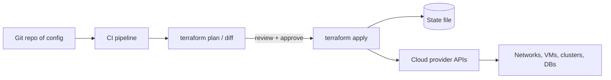

# Infrastructure as Code

## 1. One-Line Definition
Infrastructure as Code (IaC) is managing infrastructure — VMs, clusters, networks, load balancers, databases — through machine-readable, versionable configuration files (declarative or procedural) rather than by clicking through cloud consoles or running manual scripts.

## 2. Why Do We Need It?
Click-built infrastructure is invisible, unrepeatable, and ungovernable: no one can rebuild a production environment from scratch, drift appears between "golden" and actual config, audits fail, and one engineer's console session becomes the de-facto source of truth. IaC puts every resource under review, rollback, and reproducibility — infrastructure becomes an artifact of the same git-based review pipeline that builds the code, so staging and prod can converge and disaster recovery is a rerun, not a mystery.

## 3. Simple Intuition
A chef who cooks only from experience (clicking) can't reproduce last week's dish and can't explain why it changed for the worse. Write the recipe down (IaC): ingredient list, steps, and versions. Now anyone can serve the exact dish, diff last week's recipe to find what changed, and roll back to the trusted version by checking out the old recipe. The kitchen (cloud) stays the same; the recipe file is the real product.

## 4. What Happens Without It?
Every environment is a snowflake: the "prod config" exists only in one person's memory and a cloud console's current state. A new engineer clones an environment and misses 40 subtle settings. A security group change breaks prod and there's no diff to blame; rollback means "reconstruct from memory." Capacity spikes, OR audits, DR tests, and even routine region expansion become slow, risky, human rituals.

## 5. Core Idea
- **Declarative vs imperative:** declarative (Terraform, CloudFormation) — you say what the end state must be; the tool diffs reality and applies the delta, and can destroy resources it decides are no longer needed. Imperative (Ansible, Pulumi scripts) — you say what steps to run; simpler mental model but no automatic reconciliation.
- **State and drift:** declarative tools keep a state file (the recorded reality). Drift happens when someone changes resources out-of-band (console, script); the next apply may fight or destroy the change — hence "no console" discipline.
- **Idempotency and plan:** running the same config twice yields the same result; dry-run (plan/diff) previews exactly what will change before you do it.
- **Modules and reuse:** parameterized building blocks (a VPC module, a DB module) make environments consistent and compose-level reviewable.
- **Git as the System of Record:** every infra change is a PR, reviewable and rollback-able; CI runs the plan/diff; CD applies it on merge.

## 6. Important Terminology

| Term | Simple Meaning |
|------|----------------|
| Declarative | Config says desired end state; tool figures out the steps |
| Imperative | Script says the steps to run |
| State file | Record of what the tool currently manages |
| Plan / diff | Dry-run preview of changes before applying |
| Drift | Reality diverging from recorded config |
| Module | Reusable parameterized config block |
| Provisioning | Creating the base infra (VMs, networks) |
| Configuration management | Enforcing software config inside machines |
| Idempotency | Re-running produces no extra changes |
| Workspaces / environments | Separate state per env (dev, stage, prod) |

## 7. Basic Architecture



The engine of IaC is: config in git → plan/diff → review → apply → state. The provider API is the source of "actual"; the config is the source of "desired"; the state file records what the tool owns.

## 8. Request or Data Flow
1. An engineer edits a module: add 2 nodes to a node pool, tighten a security group.
2. CI runs `terraform plan`: the diff shows "create 2 instances, update SG rule X, destroy 1 orphaned subnet."
3. A reviewer approves the plan diff; the PR merges.
4. CI runs `terraform apply`: it contacts the cloud API, executes only the delta, updates state.
5. Monitoring verifies the resulting environment; a later PR can roll back by reversing the diff, because the old config is still in git.

## 9. Practical Example
**A team of 12 manages 8 environments across dev/stage/prod with Terraform modules.** A new region launch = one module instantiation + apply: VPCs, 4 subnets, 3 EKS node pools, 2 DBs, 1 LB, 15 SG rules — created in one reviewable PR instead of a week of clicking. A security incident (open 3306 to the world) is fixed by editing the rule, and the diff lands in 20 minutes with a git blame. Drift is caught by scheduled `plan` runs in CI, which report "unexpected resource X changed" so snowflakes are hunted down.

## 10. Scaling
- **State locking:** concurrent applies destroy each other's assumptions; serialize via a remote state backend (S3 + DynamoDB lock, or Terraform Cloud). Across teams, structure state per project/env.
- **Monorepo vs separate repos:** a monorepo gets one review stream but slow plan times; separate repos complicate versioned dependencies between modules. Module registry (versioned modules) resolves this.
- **What breaks:** huge single state files make plans slow and risky, and blast-across teams sharing one state file is a recipe for accidental destruction. Split state at natural boundaries while pinning module versions.

## 11. Reliability and Failure Scenarios

| Failure | What Happens | Detection | Recovery | Trade-off |
|---------|--------------|-----------|----------|-----------|
| State file corrupt/stale | Apply threatens to destroy real resources | Versioned state + backups | Restore state, re-import resources | manual reconciliation |
| Out-of-band console change | Next apply may revert/destroy it | Scheduled plan drift report | Formalize change in config | enforcement discipline |
| Apply half-fails | Partial mutations, state desync | Apply error + state refresh | Re-apply/refresh; fix resource | partial availability during repair |
| Provider API hiccup | Apply fails non-deterministically | Retry/logging | Re-run after backoff | delayed change |

## 12. Consistency and Correctness
- **Idempotency is the correctness contract:** applying twice must be a no-op the second time. Think of each resource definition in "desired end state" form, not "actions to take."
- **Ordering:** dependencies between resources must be explicit (depends_on / references) so creation and destruction order is deterministic — replacement order mistakes cause downtime windows.
- **Atomicity is not guaranteed:** do not pretend apply is transactional. If a change must be atomic (e.g., SG rule + target switch), sequence it with a stateful plan or split into two applies with verification between.

## 13. Performance
- Plan/apply latency grows with resource count and provider API calls; thousands of resources can take minutes. Split state, use targeted applies, and tolerate plan time as a feedback-loop cost (run them in CI, in parallel per env).
- Each apply is a series of API round-trips; batching and concurrency options help. Set provider-level timeouts so a hung API doesn't stall the pipeline.

## 14. Security
- IaC files contain the attack graph for your company — treat them as secret-adjacent: never commit plaintext credentials, secrets, or keys (see [[encryption-and-keys|Encryption and Keys]]; use vault/secret references).
- The apply runner's credentials are the keys to the kingdom: least privilege per environment, short-lived tokens, and audit the runner identity.
- Enforce policy-as-code too (e.g., Sentinel/OPA checks): "no public buckets, no wide SG opens" evaluated at plan time, not post-incident.

## 15. Trade-Offs

| Approach | Advantages | Disadvantages |
|----------|------------|---------------|
| Declarative (Terraform/CloudFormation) | Self-heals drift, diffable, destroys-safe | State complexity, more abstraction |
| Imperative (Ansible/Pulumi scripts) | Step-by-step mental model, simpler | No auto-reconcile, hard to diff |
| Console clicks | Fast for prototypes | Unreviewable, unreproducible, drift-prone |
| Managed IaC services (Cloud Run/AWS) | Enforced, integrated | Vendor lock-in, less flexibility |

## 16. Common Mistakes
- Editing real resources by console "just this once" — the occasional workaround becomes the invisible drift that later destroys someone's apply.
- Committing secrets into IaC repos — a Secret Scanner and secret store are required from day one.
- State file treated as disposable or local-only — losing it means "re-import everything."
- One giant state file for everything — plan time and blast radius both explode.
- Applying infra changes with no plan review or no CI gates — the "git or it didn't happen" rule gets skipped silently.

## 17. HLD vs LLD Boundary
HLD: environment topology (per env/region state splits), module boundaries and versioning, drift/plan cadence, policy-as-code rules, apply access and approval flow. LLD: the actual resource blocks, the module inputs, the specific security groups and subnet CIDRs, the provider version pins, and the CI job definitions.

## 18. Interview Questions

### Beginner
- What is the difference between declarative and imperative IaC?
- Why does a state file exist, and what happens if you lose it?

### Intermediate
- A teammate creates a resource in the console; the next apply destroys 500 things. Diagnose and set policy.
- Design the state layout for 3 environments × 2 regions and explain blast-radius control.

### Advanced
- Design IaC + CI/CD for zero-downtime changes to a region's networking (subnets, SG, LB).
- How do you manage secrets and drift in a 2,000-resource deployment without admitting console edits?

## 19. Interview Memory Summary

> [!abstract]- Interview Memory Summary
> ### Remember
> - IaC = infrastructure as reviewable, versionable config instead of console clicks.
> - Declarative: desired state + drift correction + state file. Imperative: step scripts.
> - Plan/diff → review → apply → state is the core loop.
> - Git is the source of truth; rollback is a reverse diff.
> - Drift is enemy #1: out-of-band changes undermine the model.
> - State needs locking, backup, and env-split (blast radius).
> - Secrets never in repos; policy-as-code enforces rules at plan time.
> - Idempotency is the correctness contract — re-run produces zero changes.

### 30-Second Explanation

Infrastructure as Code turns the cloud into a build artifact: declarative config in git expresses desired end state, a state file records reality, and plan/diff previews changes for review before apply drifts-reconcile. Env-split state, locking, and policy-as-code keep blast radius small; rollback is just reverting the diff. The console is reserved for curiosity, and the discipline — no out-of-band edits — is what makes it actually work.

### Interview Traps

- Claiming IaC is "transactional" — applies are not atomic; plan mid-failures.
- Treating the state file as throwaway — losing it is a reimport disaster.
- Mixing console edits in "to be safe" — that is how drift destroys applies later.
- Forgetting modules and policy checks don't review themselves — CI gates matter.

### Key Trade-Off

You buy reproducibility, reviewability, and rollback of all infrastructure at the cost of a state-management layer, an abstraction overhead, and an enforcement discipline that the whole team must honor every day.

## 20. Related Concepts

### Prerequisites

- [[cloud-infrastructure|Cloud Infrastructure (Regions / AZs / VPC)]]
- [[containers-and-vms|Containers and VMs]]

### Commonly Used Together

- [[ci-cd|CI/CD]]
- [[cloud-infrastructure|Cloud Infrastructure (Regions / AZs / VPC)]]
- [[kubernetes|Kubernetes]]

### Alternatives

- [[deployment-strategies|Deployment Strategies]] (code rollout; IaC is the infra counterpart)
- Console/manual config (the thing IaC replaces)

### Advanced Concepts

- [[cloud-infrastructure|Cloud Infrastructure (Regions / AZs / VPC)]]
- [[kubernetes|Kubernetes]]

Related planned topics (not authored yet): vpc-and-subnets, data-migration.

## 21. References
Terraform (HashiCorp) documentation — state file, modules, workspaces/backends. AWS CloudFormation docs for the managed-cloud variant. "Terraform Up & Running" (Brikman) covers state split and drift. Policy-as-code: OPA/Sentinel docs. Verify current provider/state-backend behavior.

## 22. Active Recall

Test yourself before revealing each answer.

> [!question]- Why must the state file be stored remotely, locked, and backed up?
> It records what the tool owns; without it the next apply can't diff and may destroy resources it no longer recognizes. Remote+locked prevents two concurrent applies from double-creating/destroying; backups allow restoring after corruption.

> [!question]- Describe the plan/diff/apply loop in one breath.
> Config in git → CI computes the diff against state → reviewer approves the plan → apply executes exactly the delta against the provider API → if reality matches config, the next plan is a no-op; any out-of-band drift surfaces in scheduled plan runs.

> [!question]- A developer opens port 3306 to 0.0.0.0 "for debugging." What does IaC reinstating it teach us?
> It's an enforcement lesson: declarative reconcile will revert out-of-band changes on the next apply. That can be protective (policy compliance back) or destructive (if the random edit is lost). The right answer is a policy guard — the config stays source of truth, reviewers see the diff.

> [!question]- Why are imperative steps a drift trap?
> Running the same imperatively-defined steps twice may not converge (e.g., creating an already-created resource fails or duplicates). Without reconciliation there's no guarantee re-runs reproduce the intended state, which is why declarative "desired state" is the standard for infrastructure.

> [!question]- Interview scenario: a production change to an SG must not go through the console workaround. Design the safe flow.
> Edit the module → PR → CI runs plan → the diff shows exactly "add rule X, remove rule Y" → reviewer or policy gate approves → apply with least-privilege runner credentials → verify in monitoring. Rollback = merge the reverse diff. Console is blocked for prod by policy.

## 23. When Should I Use This?

### Use it when

- You have more than one environment that must stay consistent (dev/stage/prod, multiple regions).
- Availability of the exact configuration matters more than one person's expertise.
- You run audits, DR tests, or capacity expansion on a schedule.
- You want every infra change to be reviewable and rollback-able.

### Avoid it when

- You're prototyping a hackathon environment that will be thrown away.
- The infra is a trivial one-VM demo where config file overhead exceeds its value.
- Nobody will maintain it — an unattended IaC build is worse than a click-built snowflake, because wrong drift-fighting applies can destroy prod.

### What problem does it solve?

It makes infrastructure reproducible, reviewable, diffable, and rollback-able by turning it into code and state, ending the "works only in that one console" and "rebuild from memory" failure modes.

### What problem does it NOT solve?

It does not make resources atomic to change, does not protect you from bad config choices (a wrong CIDR is still wrong), does not remove the need for backups/DR testing, and does not forgive out-of-band edits — the discipline gap, not the tool, is where incidents still come from.

## 24. Decision Connections

Decisions that go together with IaC:

- [[cloud-infrastructure|Cloud Infrastructure (Regions / AZs / VPC)]] — the raw language of resources (VPC, subnets, IGW) that config files describe.
- [[ci-cd|CI/CD]] — plan/diff/apply run as pipeline stages; infra and app deploy in the same review stream.
- [[kubernetes|Kubernetes]] — manifests are themselves declarative IaC for the cluster layer.
- [[deployment-strategies|Deployment Strategies]] — infrastructure changes carry the same rollout discipline as code.
- [[containers-and-vms|Containers and VMs]] — images are built in CI; the hosts they run on are declared in infra.
- [[encryption-and-keys|Encryption and Keys]] — secrets must live outside the repo, referenced, not copied.
- [[autoscaling|Autoscaling]] — capacity is another declared, versioned resource.

Decision tree:

```
Manage cloud resources as code?
    |
    +-- One-off throwaway prototype?
    |      → console, skip the ceremony
    |
    +-- Any team or env beyond a single box?
    |      |
    |      +-- Want drift-fighting + diff? → declarative + state file
    |      +-- Prefer scripted steps?      → imperative config mgmt
    |      +-- Team shares changes?        → git PRs + CI plan/apply gates
    |
    +-- Platform must enforce policy?
           → policy-as-code at plan time
```