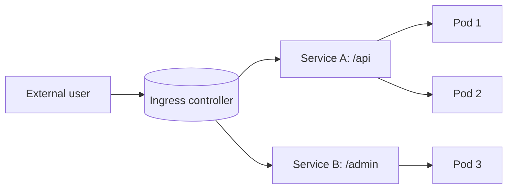

# Kubernetes Services and Ingress

## 1. One-Line Definition
A Kubernetes Service is a stable virtual IP and DNS name in front of a changing set of pods, and Ingress is an HTTP-layer gateway that routes external traffic to Services based on host and path rules.

## 2. Why Do We Need It?
Pods are ephemeral and their IPs change on restart, reschedule, and scale events, so pods cannot be addressed directly. Clients need one stable address that always reaches the current replicas of an app. And once you have internal routing, external traffic needs a single entry point that maps URLs to Services, terminates TLS, and centralizes HTTP rules — otherwise every app reinvents its own router and everyone's DNS breaks.

## 3. Simple Intuition
The Service is a phone number for an office where everyone moves desks constantly: you dial the same number and the receptionist finds whoever is present today. Ingress is the front desk for a whole building: visitors arrive at one lobby (host: path), tell the receptionist "I'm here for billing," and get directed to the right floor. The building (cluster) stays invisible from outside.

## 4. What Happens Without It?
Every deployment would hardcode pod IPs, which die on the first reschedule. Clients would point at dead addresses, load balancers would be wrong, and every new replica would need a new DNS entry. External traffic would require a per-app public IP and host firewall rules, and TLS termination would be done inconsistently inside every app.

## 5. Core Idea
- **Service types:** ClusterIP (internal virtual IP, default), NodePort (expose a port on every node), LoadBalancer (provision an external LB per Service). ClusterIP is the workhorse.
- **Selector + endpoints:** a Service selects pods by labels; the endpoints controller watches pod changes and keeps the Service's pod list accurate. Traffic to the virtual IP is Load-Balanced across those endpoints by kube-proxy (or a CNI datapath).
- **DNS:** each Service gets `<name>.<namespace>.svc.cluster.local`, giving applications a stable name to call.
- **Ingress:** an API object — a routing table. The real routing is done by an Ingress controller (an reverse proxy/DLB in the cluster) that watches Ingress objects and programs its config. The controller also terminates TLS via certificates declared on the object.
- **IngressClass / Gateway API:** you may have several controllers (nginx, envoy); Gateway API is the newer, more expressive successor — "Ingress v2."
- **Headless services:** when per-pod identity matters (stateful), a Service with no virtual IP gives DNS records pointing at each pod directly.

## 6. Important Terminology

| Term | Simple Meaning |
|------|----------------|
| ClusterIP | Internal virtual IP reachable only inside the cluster |
| NodePort | Expose a fixed port on every node's IP |
| LoadBalancer Service | Provisions an external load balancer per Service |
| Endpoints | The current pod IPs behind a Service |
| kube-proxy | Node component translating Service IPs to pod IPs |
| Ingress | Declarative HTTP routing rules (host, path) |
| Ingress controller | The proxy that actually implements Ingress rules |
| Headless Service | No virtual IP; DNS returns pod IPs directly |
| CNI | Container network interface doing pod-to-pod networking |
| Gateway API | Newer, more expressive routing API family |

## 7. Basic Architecture



One external entry (Ingress) routes by host and path to internal Services; each Service load-balances to the current ready pods selected by its label selector.

## 8. Request or Data Flow
1. External user hits `https://api.example.com/orders`.
2. The Ingress controller (with TLS cert) terminates TLS, matches host + path rule `/orders`.
3. It forwards to the backing Service's ClusterIP on the target port.
4. kube-proxy (or CNI load balancing) picks one endpoint pod and delivers the packet.
5. If a pod becomes unready, the endpoints controller drops its IP from the set, and subsequent traffic goes only to healthy pods.

## 9. Practical Example
**SaaS control plane with `api.example.com` and `admin.example.com`.** One Ingress object declares both hosts + path rules; one nginx controller terminates TLS for both. `/api/orders` → orders Service (3 replicas). `/admin` → admin Service (2 replicas, IP-allowlisted). Rolling out a new image changes the pod endpoints but never the Service IP — DNS is untouched, clients keep calling the same URL, and traffic shifts to new pods as readiness passes.

## 10. Scaling
- **Service layer scales because replicas scale:** the endpoint set grows with pods; kube-proxy rules scale linearly with service count.
- **Ingress controller is the gateway bottleneck:** it terminates TLS and fans out — scale it horizontally (multiple replicas behind an external LB), and watch connection/session handling. It is where ingress traffic load-balancing and rate limiting belong, not in each app.
- **What breaks:** a single-rule-per-pod design explodes the rule count; per-service LoadBalancers multiply cloud LBs and Cost; big headers/websockets need controller configuration beyond defaults.

## 11. Reliability and Failure Scenarios

| Failure | What Happens | Detection | Recovery | Trade-off |
|---------|--------------|-----------|----------|-----------|
| Pod unready | Removed from endpoints | Readiness probe | Traffic moves to healthy pods | brief 502 during transition |
| Ingress controller crash | All external routing fails | Controller health | Multi-replica controller, external LB | extra capacity idle |
| Service selector mismatch | No endpoints, connection refused | Endpoint count check | Fix labels, verify selectors | silent until checked |
| NodePort collision | Random users hit wrong service | Config validation | Choose distinct ports, avoid NodePort | flexibility loss |
| Certificate expiry | TLS handshake failures | Cert monitoring | Auto-renew + alert | ops discipline |

## 12. Consistency and Correctness
- Service membership is eventually consistent: after a pod restarts, there is a window where endpoints still list the old IP. DNS TTLs and connection draining must tolerate stale endpoints during rollouts.
- kube-proxy rules are eventually applied node-by-node — a user may briefly hit an un-updated node. Keep old pods draining until all nodes converge.
- Ingress controllers reconcile desired rules but lag on change; hot-reload semantics and config ordering matter for rules that must land atomically (e.g., staging vs prod host).

## 13. Performance
- ClusterIP via kube-proxy adds a small per-connection overhead (or per-packet in older modes) — usually negligible; for maximum throughput use CNI-level load balancing or direct pod networking.
- Ingress controller TLS termination is the main cost center: each TCP connection costs termination CPU; enable session reuse, HTTP/2, and connection keep-alive.
- Endpoint churn during rolling updates causes transient error spikes if readiness is slow — tune progress-deadline and rolling-window settings.

## 14. Security
- Network Policies (CNI-enforced) are the real isolation between namespaces — a Service only adds reachability, not protection.
- TLS belongs at the Ingress (terminate + re-encrypt) so internal traffic can be encrypted with mTLS if needed — see [[encryption-and-keys|Encryption and Keys]].
- Careful host-level allowlists in front of the Ingress; validate paths/headers and add rate limiting at the gateway (a natural place for [[rate-limiter|Rate Limiter]] logic).
- Secrets: default TLS certs for internal Services are self-signed by design; only the ingress needs trusted certs.

## 15. Trade-Offs

| Approach | Advantages | Disadvantages |
|----------|------------|---------------|
| ClusterIP only | Simple, internal-only, free | No external access |
| NodePort | No cloud LB needed, cheap | All nodes exposed on a port; SSL at app layer |
| LoadBalancer Service | One LB per service, easy | Costly at scale, per-service LB limits |
| Ingress | One entry, host/path/HTTPS rules, controller flexibility | Single choke point, operator must run it well |
| Gateway API | More expressive, multi-tenant safe | Newer, fewer implementations |

## 16. Common Mistakes
- Using NodePort or a LoadBalancer Service for every app instead of one Ingress — endpoint sprawl and cost.
- Mis-matching label selectors: the Service has zero endpoints and everything 502s, silently.
- Missing readiness probes: traffic goes to pods still warming up; intermittent 500s.
- Treating the Ingress controller as stateless — it holds config and connection state; don't scale it without draining.
- Hardcoding pod IPs instead of using Service DNS names.

## 17. HLD vs LLD Boundary
HLD: the routing topology — what is a per-service ClusterIP + shared Ingress, host/path structure, TLS strategy, north-south vs east-west traffic, ingress capacity. LLD: the concrete Service YAML selector/ports, the Ingress object's host/path rules, kube-proxy mode, ingress controller replica count and header/path regex quirks.

## 18. Interview Questions

### Beginner
- What problem do Kubernetes Services solve beyond just "web traffic"?
- What is the difference between ClusterIP, NodePort, and LoadBalancer Services?

### Intermediate
- A Service has no endpoints. How do you diagnose why?
- You add an Ingress rule but traffic still 502s. List the places the chain can break.

### Advanced
- Design external traffic for a multi-tenant SaaS on K8s: TLS, host-based routing, per-tenant rate limiting, and isolation.
- How would you scale an Ingress controller to 100k concurrent connections without dropping websockets?

## 19. Interview Memory Summary

> [!abstract]- Interview Memory Summary
> ### Remember
> - Service = stable virtual IP + DNS in front of churning pod IPs.
> - Selector → endpoints: the endpoint controller keeps the pod list current.
> - ClusterIP is default; NodePort and LoadBalancer expose outward per-service.
> - Ingress = declarative HTTP routing table; a controller (proxy) enforces it.
> - Ingress terminates TLS, does host/path routing, and is the north-south bottleneck.
> - Readiness feeds endpoints: unready pods are instantly unlisted.
> - Headless Services expose per-pod DNS for stateful workloads.
> - Network policy, not Service, is the real isolation mechanism.

### 30-Second Explanation

Pods' IPs are disposable, so a Service pins one stable virtual IP to them via label selectors and an endpoints controller, and every replication move keeps the DNS name valid. Ingress is a routing table at the cluster border — one TLS-terminating entry point for host/path rules — typically backed by an nginx/envoy controller that fans out to Services. Traffic correctness lives at the boundaries between selector, endpoints, proxy rules, and controller config.

### Interview Traps

- Calling the Service IP durable data — pods are churn; membership is eventually consistent.
- Thinking a Service is a firewall: it provides reachability, isolation needs Network Policy.
- Ignoring the Ingress controller as the single gate/bottleneck (and its need for HA + draining).
- Confusing readiness probe (unlist from endpoints) with liveness probe (restart).

### Key Trade-Off

You buy stable addressing and centralized HTTP control at the cost of a shared ingress choke point, eventually-consistent endpoint membership, and another layer of config to keep in sync with the actual pod topology.

## 20. Related Concepts

### Prerequisites

- [[kubernetes|Kubernetes]]
- [[load-balancing|Load Balancing]]

### Commonly Used Together

- [[service-discovery|Service Discovery]]
- [[autoscaling|Autoscaling]]
- [[cloud-infrastructure|Cloud Infrastructure (Regions / AZs / VPC)]]

### Alternatives

- [[service-mesh|Service Mesh]] (east-west traffic control beyond Services)
- [[reverse-proxy|Reverse Proxy]] (single-host alternative)

### Advanced Concepts

- [[service-mesh|Service Mesh]]
- [[kubernetes|Kubernetes]]

Related planned topics (not authored yet): api-gateway, dns-load-balancing.

## 21. References
Kubernetes official docs: Service, Ingress, Gateway API. Nginx-ingress and Envoy/Contour docs for controller behavior. Verify selector/endpoints semantics against the current K8s version.

## 22. Active Recall

Test yourself before revealing each answer.

> [!question]- What exactly keeps a Service's pod list up to date?
> The endpoints controller, which watches pods selected by the Service's label selector (and readiness status) and continuously writes the current IP set to the endpoints object that kube-proxy and the CNI consume.

> [!question]- Why is ClusterIP invisible from outside the cluster, and how does a request still get served?
> ClusterIP is a virtual IP with no physical owner — routing rules inside the cluster forward to endpoints. External clients cannot reach it; they need Ingress/NodePort/LoadBalancer to enter, after which routing goes Service → endpoint pod.

> [!question]- You deployed a Service but curl to the ingress 502s. Rank the top suspects.
> 1) Label selector matches no pods → zero endpoints. 2) Readiness probe failing → pods exist but unlisted. 3) Ingress rule targets the wrong namespace/port. 4) Ingress controller hasn't picked up the rule. 5) Network policy silently blocking. Check endpoints object first.

> [!question]- When is a headless Service the right call?
> When a client pool needs each pod's identity directly — e.g., a stateful DB cluster where replicas address peers and the primary by stable pod DNS — rather than load-balanced virtual IP.

> [!question]- How do you prevent a rolling update from briefly sending traffic to a dying pod?
> Readiness probe + connection draining. The new pod must pass readiness before endpoints list it, and the old pod should get a pre-stop drain (sleep) so in-flight requests finish before kube-proxy removes it — otherwise the window where membership lags kills a few requests.

> [!question]- Interview scenario: you must expose 40 microservices to the internet cleanly. Design the surface.
> One Ingress (or Gateway API) as the single TLS-terminating entry, host/path rules per service, per-service ClusterIP backends, a small HA ingress controller (2+ replicas) behind an external LB, rate limiting at the gateway, and Network Policies restricting east-west flow between namespaces.

## 23. When Should I Use This?

### Use it when

- You run replicated pods whose IPs change (the normal case on Kubernetes).
- External traffic should enter through one TLS/routing edge rather than many.
- You want DNS-stable internal names between services.

### Avoid it when

- A single VM + [[reverse-proxy|Reverse Proxy]] is all you need — K8s networking is overkill.
- Workloads are only internal and fixed (DaemonSet agents talking directly).
- You demand packets-level, kernel-direct routing with zero proxy overhead — consider host networking + CNI tuning.

### What problem does it solve?

It solves the address instability of ephemeral pods by decoupling consumers from pod IPs, and it centralizes external traffic control (TLS, host/path routing, one entry point) instead of scattering routers across apps.

### What problem does it NOT solve?

It does not isolate tenants (that's Network Policy + namespace), does not give durable identity (StatefulSet + volumes), does not handle cross-cluster or multi-region routing (needs cloud LB / mesh federation), and does not make the ingress fast — the controller still must be sized and drained correctly.

## 24. Decision Connections

Decisions that go together with Services and Ingress:

- [[kubernetes|Kubernetes]] — the platform these objects live on; Deployments create pods Services address.
- [[service-discovery|Service Discovery]] — a Service is the discovery mechanism; DNS names resolve to it.
- [[load-balancing|Load Balancing]] — the Service virtual IP load balances across endpoints; the ingress does the external LB role in-cluster.
- [[autoscaling|Autoscaling]] — endpoint sets grow/shrink as HPA changes replica counts; routing must keep up.
- [[service-mesh|Service Mesh]] — when app-level L7 traffic control (retries, mTLS, telemetry) exceeds what Services provide.
- [[reverse-proxy|Reverse Proxy]] — the pattern the Ingress controller implements at cluster scale.
- [[cloud-infrastructure|Cloud Infrastructure (Regions / AZs / VPC)]] — node subnet design and the external LB in front of the ingress.
- [[rate-limiter|Rate Limiter]] — the ingress is the natural enforcement point.

Decision tree:

```
External traffic into Kubernetes?
    |
    +-- Single-service simple app?
    |      → LoadBalancer Service
    |
    +-- Many services behind one edge?
    |      |
    |      +-- Host/path HTTP routing + TLS?
    |      |      → Ingress (nginx/envoy)
    |      +-- Expressive policies, multi-tenant?
    |      |      → Gateway API
    |
    +-- Internal services only?
    |      → ClusterIP Service + DNS
    |
    +-- Instances need unique identity after discovery?
           → Headless Service
```