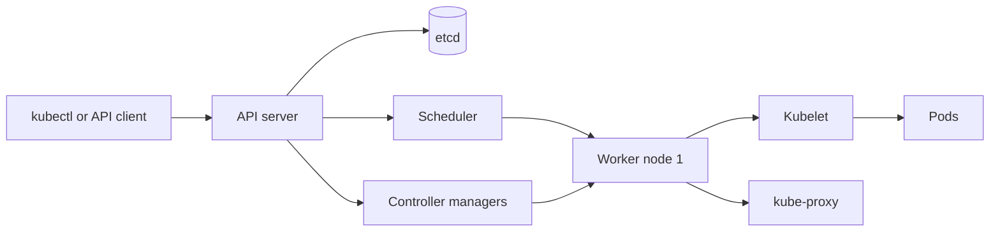

# Kubernetes

## 1. One-Line Definition
Kubernetes (K8s) is an open-source container orchestrator that runs and manages many containers across a cluster of machines — deciding where they run, restarting them on failure, scaling replicas, and wiring them to each other and to the outside world.

## 2. Why Do We Need It?
Running containers on a handful of servers by hand is fine. On fleets of servers it breaks down: you need placement, health-based self-healing, rolling updates, discovery of pods whose IPs change constantly, autoscaling, and configuration management — all repeatably and declaratively. Kubernetes is the control system that makes a pool of machines behave like one large computer for containers.

## 3. Simple Intuition
A hotel concierge for containers. You tell the concierge (declarative spec): "I want three front-desk clerks available at all times, each at a desk, and if one calls in sick replace them within a minute." The concierge watches the lobby (watch loop), keeps a reservations book (etcd), picks which floor (node) each desk goes on, and swaps a sick clerk before anyone queues. You never point at a specific desk (pod IP); you just ask for "the front desk" and get a stable phone number (Service).

## 4. What Happens Without It?
Containers run but nothing copes with reality: a host dies and half the service is gone until a human intervenes; every replica has a random IP that breaks DNS and load balancers; a new build requires manual, all-at-once replacement with downtime; providers and testers fight over which version is live. Deployment becomes a fragile, manual, all-hands ritual.

## 5. Core Idea
- **Desired state vs actual state:** you write a spec (YAML) saying what should exist; controllers continuously reconcile actual state toward desired state. If a pod dies, a controller makes a new one. This reconciliation loop is the heart of K8s.
- **Control plane vs data plane:** the control plane (API server, etcd, scheduler, controllers) makes decisions; worker nodes run the workloads (pods). If the control plane is down, running workloads keep serving but nothing is repaired or rescheduled.
- **Pod:** the smallest unit — one or a few tightly coupled containers sharing a network namespace, an IP, and a volume.
- **Workload controllers:** Deployment (stateless replicas, rolling updates), StatefulSet (stable identity/order for stateful services), DaemonSet (one pod per node, e.g., agents).
- **Service:** a stable virtual IP + DNS name in front of a changing set of pod IPs.
- **etcd:** the single source of truth; all desired state and cluster records live here. Every API mutation goes through a consensus write to etcd.
- **Declarative everywhere:** git becomes the deployment history; the manifest is the interface, not shell scripts.

## 6. Important Terminology

| Term | Simple Meaning |
|------|----------------|
| Control plane | API server, etcd, scheduler, controllers — the brains |
| Node | A worker machine that runs pods |
| Pod | Smallest deployable unit: one or more containers, one IP |
| Deployment | Controller for stateless replicas with rolling updates |
| StatefulSet | Controller giving pods stable identity and ordering |
| DaemonSet | One pod per node (agents, log collectors) |
| ReplicaSet | Ensures a stable set of running pod replicas |
| Service | Stable IP + DNS in front of a set of pods |
| etcd | Distributed key-value store holding desired state |
| ConfigMap / Secret | Config and sensitive data injected into pods |
| Kubelet | Node agent that runs pods reported by the API server |

## 7. Basic Architecture



The API server is the only way in and out. Changes are written to etcd, controllers converge state, the scheduler places pods on nodes, and each node's kubelet executes what it's told. Workload traffic flows through kube-proxy rules that implement Services.

## 8. Request or Data Flow
1. `kubectl apply` sends a Deployment manifest to the API server.
2. The API server validates it and writes desired state to etcd.
3. The Deployment controller sees replicas = 3 but actual = 0 and asks the scheduler for placement.
4. The scheduler picks healthy nodes and records pod bindings; kubelets start containers from the registry images.
5. A Service's endpoint controller discovers the new pod IPs and adds them to the service's routing set.
6. Traffic to the Service's virtual IP is forwarded to one of the ready pods.
7. A health check fails → kubelet restarts, or the controller replaces the pod; reconciliations continue forever.

## 9. Practical Example
**Checkout service, target 4 replicas.** Manifest sets `replicas: 4`, each pod with a readiness probe hitting `/health`. During a release, the Deployment starts 1 new pod, waits until ready, then terminates 1 old pod — no downtime. Metrics show CPU at 70% average; the horizontal pod autoscaler raises the replica count to 6. One node dies mid-day; the controller reschedules its 2 pods onto other nodes within tens of seconds while the Service keeps a stable endpoint the whole time.

## 10. Scaling
- **Horizontal pod autoscaling (HPA):** reads metrics (CPU, memory, custom metrics) and adjusts replica count of a Deployment against a target utilization — scales the workload, not the cluster.
- **Cluster autoscaling:** adds or removes whole nodes when pods cannot be scheduled; this is the second level, above HPA.
- **What breaks:** the API server/etcd carry every mutation — high pod-churn floods them; kube-proxy or CNI rules become a bottleneck at very high per-node traffic; pod startup time is dominated by image pulls, so pre-warming and rate-limiting pulls matter.
- **Vertical scaling:** raising pod CPU/memory limits (VPA) causes restarts; K8s prefers horizontal for stateless, vertical only when required.

## 11. Reliability and Failure Scenarios

| Failure | What Happens | Detection | Recovery | Trade-off |
|---------|--------------|-----------|----------|-----------|
| Node dies | Its pods vanish | Heartbeat timeout | Controllers reschedule pods | spare capacity needed |
| Pod unready | Endpoints removed from Service | Readiness probe | Traffic diverted, pod replaced | no traffic during probe window |
| etcd lost | Cluster unmanageable | Leader election fails | Restore from backup, failover | availability depends on quorum |
| API server down | No new mutations | Control-plane health | Multi-replica API servers, LB | read-heavy workloads continue |
| Image pull fail | Pods CrashLoopBackOff | Backoff status | Fix registry, digest pinning | delayed rollout |

## 12. Consistency and Correctness
- etcd serializes all desired-state changes through consensus — "this is what the cluster should be" is never reordered or lost once accepted.
- Convergence is eventual: after a change, actual state lags desired state (controllers poll). Read your own writes through etcd's linearizable reads; use optimistic concurrency (resourceVersion) to avoid clobbering concurrent edits.
- Pods are ephemeral and unversioned: never treat pod identity as durable. StatefulSets give stable identity, but they still assume a storage backend decides durability.

## 13. Performance
- kube-proxy and the CNI layer add a small per-packet hop vs raw host networking; at very high rates consider direct pod networking with host ports or a service mesh offload.
- API server + etcd handle all writes; bursts of short-lived pods (churn) are the classic overhead spike.
- Per-pod overhead: a few MB of memory for the pause container + kubelet; thousands of pods per node are the practical ceiling before scheduling becomes the bottleneck.

## 14. Security
- **RBAC** controls who can mutate the API; least-privilege service accounts for pods.
- **Network policies** enforce which pods may talk to which — default-deny is the safe baseline.
- **Secrets** are base64-encoded in etcd by default — encrypt etcd, and prefer external secret stores.
- Pod security: run non-root, read-only root FS, no privileged escalation. The kubelet needs its own certificate identity; the API server terminates TLS for all clients.

## 15. Trade-Offs

| Approach | Advantages | Disadvantages |
|----------|------------|---------------|
| Full managed K8s (EKS/GKE/AKS) | Patched control plane, integrations | Cost, upgrade rigidity, vendor lock-in |
| Self-hosted K8s | Full control, no per-control-plane fees | Operation burden: etcd, upgrades, certificates |
| Containers without K8s | Simple, low overhead | Manual placement/health/discovery, no self-healing |
| Serverless on K8s (Knative-style) | Scale-to-zero, per-event billing | Cold starts, less control |

## 16. Common Mistakes
- Putting state in pods and assuming StatefulSets make it safe — the volume must be the durability layer.
- Readiness vs liveness confusion: wrong signal causes either traffic to failed pods or a crash-loop restart storm.
- No resource requests/limits: the scheduler overpacks nodes and OOM kills take down production.
- Hand-editing live state instead of re-applying manifests from git — the API state and codebase drift apart.
- Running one giant all-in-one pod instead of small deployable services.

## 17. HLD vs LLD Boundary
HLD: cluster topology (zones, node pools), control-plane sizing/ha, Service/Ingress model, autoscaling policy, namespace/tenancy strategy, upgrade + DR cadence. LLD: the concrete Deployment/Service/HPA YAML, probe endpoints and thresholds, container resource numbers, the CNI policy to write.

## 18. Interview Questions

### Beginner
- What does the reconciliation loop mean and why does it matter?
- What is the difference between a Pod, a Deployment, and a Service?

### Intermediate
- A node dies. Walk through everything that happens and what still works.
- Design resource requests/limits and an HPA policy for a latency-sensitive API with spiky traffic.

### Advanced
- etcd is the single source of truth. How do you make the control plane itself highly available, and what still fails?
- Design a multi-tenant cluster: namespaces, quotas, network policies, and isolation boundaries for 50 teams.

## 19. Interview Memory Summary

> [!abstract]- Interview Memory Summary
> ### Remember
> - K8s reconciles desired state (manifest) with actual state (cluster) on a continuous watch loop.
> - Control plane = API server, etcd, scheduler, controllers; workers = nodes with kubelet.
> - Pod = smallest unit; Deployment for stateless rolling updates, StatefulSet for stable identity.
> - Service gives a stable virtual IP in front of churning pod IPs.
> - etcd is the single source of truth — consensus writes, linearizable reads.
> - HPA scales replicas, cluster autoscaler scales nodes; metric pipeline feeds both.
> - Readiness vs liveness probes are different: readiness gates traffic, liveness gates restart.
> - Recovery is automatic because the loop repeats forever — orchestration, not babysitting.

### 30-Second Explanation

You declare desired state as a manifest through the API server, which persists it in etcd. Controllers reconcile actual state toward that spec, the scheduler places pods, and kubelets run them. A Service gives one stable address across a set of moving pods; HPA scales replicas on metrics. Any divergence is repaired automatically. The cost is the control plane's complexity and several layers of overhead you never see on one box.

### Interview Traps

- Saying pods are durable or that StatefulSets survive data loss without a real volume.
- Confusing readiness (traffic gate) with liveness (restart gate).
- Forgetting the control plane is a system that itself needs HA (multi-replica API server + etcd quorum).
- Claiming zero-downtime rollouts without walking through probe + max-surge + max-unavailable.

### Key Trade-Off

You buy declarative, self-healing, scalable orchestration and a stable service layer; you pay for control-plane complexity (etcd, upgrades, RBAC), abstraction overhead, and a learning curve that punishes teams expecting "just run my container on many boxes."

## 20. Related Concepts

### Prerequisites

- [[containers-and-vms|Containers and VMs]]
- [[cloud-infrastructure|Cloud Infrastructure (Regions / AZs / VPC)]]

### Commonly Used Together

- [[kubernetes-services|Kubernetes Services and Ingress]]
- [[service-discovery|Service Discovery]]
- [[autoscaling|Autoscaling]]
- [[ci-cd|CI/CD]]

### Alternatives

- [[containers-and-vms|Containers and VMs]] (no orchestration, single host)
- [[serverless|Serverless]] (no cluster to manage)

### Advanced Concepts

- [[service-mesh|Service Mesh]]
- [[infrastructure-as-code|Infrastructure as Code]]
- [[cloud-infrastructure|Cloud Infrastructure (Regions / AZs / VPC)]]

Related planned topics (not authored yet): microservices, control-plane-vs-data-plane, api-gateway.

## 21. References
Kubernetes official documentation (Concepts — Architecture, Controllers, Services, HPA). Kelsey Hightower's "Kubernetes the Hard Way" for control-plane details. Brendan Burns, "Designing Distributed Systems" (patterns view). Verify current version-specific behavior with the official docs.

## 22. Active Recall

Test yourself before revealing each answer.

> [!question]- What happens when a pod's readiness probe fails?
> The pod stays running (no restart), but its IP is removed from the Service's endpoints — traffic stops being routed to it. Liveness, a different probe, is what triggers a restart. Mixing them up famously causes incident-class behavior.

> [!question]- A Deployment says replicas: 3, but only 2 pods exist. What makes the third appear?
> The Deployment controller's reconciliation loop watches the actual replica count against desired state; seeing 2 vs 3, it creates a ReplicaSet delta, the scheduler binds a pod to a node, and that node's kubelet starts the container. It then happens again immediately for any future divergence.

> [!question]- Why is etcd's role so central, and what is the blast radius of losing it?
> etcd is the single source of truth for all desired and recorded cluster state, and every API mutation is a consensus write to it. Lose quorum and no mutation works: no scaling, no rollouts, no rescheduling — although already-running pods keep serving traffic.

> [!question]- Design-for-scale: what saturates first at very high pod-churn?
> The API server and etcd, because every pod create/delete is a serialized mutation, and the scheduler. Mitigations: batch-related changes, use higher-level controllers that hide churn, rate-limit clients, and scale the control plane independently from worker nodes.

> [!question]- A stateful database is moved into K8s. What must still be guaranteed outside the pod?
> Durability and stable identity. A StatefulSet gives stable names and ordering, but the actual data must live on persistent volumes attached to the host (or an external database). If only a local emptyDir is mounted, every pod move loses data.

> [!question]- Interview scenario: describe the whole flow from kubectl apply to a user request being served.
> API server validates + persists to etcd → Deployment controller creates ReplicaSet → scheduler picks nodes → kubelets pull images and start pods → readiness probes pass → endpooints controller adds pod IPs to the Service → kube-proxy forwards traffic to a ready pod → health fails later → controller replaces the pod and the loop continues.

## 23. When Should I Use This?

### Use it when

- You run many containers on multiple hosts and need automatic placement, self-healing, and rollouts.
- Services are primarily stateless and horizontally scalable.
- The team wants declarative, git-driven infrastructure and reproducible environments.
- You need autoscaling, service discovery, and stable endpoints without building them yourself.

### Avoid it when

- A single host or a few VMs suffice — K8s is heavy machinery.
- The workload is stateful, latency-critical to the kernel, or needs exotic hardware; strict per-request latency budgets resent its overhead.
- The team lacks the operational capacity to run or buy a managed control plane.

### What problem does it solve?

The operational chaos of running containers at fleet scale: placement, health-driven repair, discovery with churning IPs, rolling releases, autoscaling, and configuration, unified behind one declarative interface.

### What problem does it NOT solve?

It does not make your application stateless or distributed — it only stops punishing you for it. It does not give you service-level reliability (still need [[availability|Availability]] budgets, probes, and multi-zone placement), does not replace the database durability layer, and does not remove the need for the control plane to be operated and upgraded safely.

## 24. Decision Connections

Decisions that go together with Kubernetes:

- [[containers-and-vms|Containers and VMs]] — the unit K8s orchestrates; images are the artifact.
- [[kubernetes-services|Kubernetes Services and Ingress]] — how traffic enters and routes inside the cluster.
- [[service-discovery|Service Discovery]] — pod IPs churn constantly; K8s is a built-in discovery system.
- [[autoscaling|Autoscaling]] — HPA + cluster autoscaler are the scaling story.
- [[ci-cd|CI/CD]] — manifests and images flow from pipelines into the cluster.
- [[infrastructure-as-code|Infrastructure as Code]] — the cluster itself should be declaratively managed.
- [[cloud-infrastructure|Cloud Infrastructure (Regions / AZs / VPC)]] — where the nodes run and how the network is laid out.
- [[service-mesh|Service Mesh]] — the next layer when intra-cluster traffic control demands more than Services provide.

Decision tree:

```
Run many containers at fleet scale?
    |
    +-- One or few hosts, simple ops?
    |      → [[containers-and-vms|Containers and VMs]]
    |
    +-- Fleet scale, need self-healing + rollouts?
    |      |
    |      +-- Pain point is node/hardware op?
    |      |      → managed K8s on [[cloud-infrastructure|Cloud Infrastructure (Regions / AZs / VPC)]]
    |      +-- Need deep control plane control?
    |      |      → self-hosted K8s
    |      +-- Fine, then wire: Service + Ingress + HPA
    |             → [[kubernetes-services|Kubernetes Services and Ingress]]
    |             → [[autoscaling|Autoscaling]]
    |
    +-- Want to manage no cluster?
           → [[serverless|Serverless]]
```