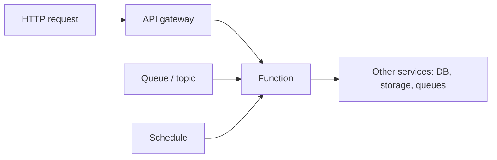

# Serverless

## 1. One-Line Definition
Serverless (FaaS) is a compute model where the cloud provider runs your function code on demand, scales it to zero when idle, and bills only for executed request-time and memory — with no server or cluster the developer ever provisions, sees, or pays for while idle.

## 2. Why Do We Need It?
Most services spend most of their time at low utilization: a box that must be ready for a weekly batch or a rare spike sits at 5% for days. Traditional compute forces you to pay and administer capacity you barely use. Serverless transfers that burden to the provider: event-driven code runs only when needed, scales instantly to thousands of instances, and disappears to zero between events — eliminating idle cost, provisioning ceremony, and the entire patch/patch/scale operational loop for the right workloads.

## 3. Simple Intuition
Ordering takeout vs running a restaurant. Servers: you rent a full restaurant (kitchen, staff, rent) even if it serves dinner three nights a month. Serverless: a cloud kitchen with delivery-only — you supply the recipe (function code); on the nights you get orders, extra stoves appear automatically; no orders, no rent. You get billed per meal made, not per vacant seat.

## 4. What Happens Without It?
An idle fleet bleeding money and burning engineer time on patching and capacity math. A video encoder used 2 hours a week needs a big reserved instance; a webhook consumer must poll a box that sits idle; a campaign job defies autoscaling because scaling happens too slowly for a burst. You pick between overpaying (fixed capacity) and risking spikes (too little), and the operational tax — deploys, versions, logs, scaling — lands on the same team that should be writing features.

## 5. Core Idea
- **Functions as the unit:** code is split into small event handlers (handler(event, context)) triggered by events — HTTP via an API gateway/function URL, queue/topic messages (see [[message-queue|Message Queue]]), storage events, cron schedules.
- **Scale-to-zero:** no invocation → no instance → no bill. This is the defining economic and operational property; it is also what causes the cold start.
- **Managed everything below the code:** the provider handles runtime, resource isolation, patching, autoscaling, and availability; the unit of capacity you think in is the number of concurrent invocations.
- **Billing by request/memory-time:** GB-seconds or invocation count; long-lived or always-on compute is un-Lambdalike and better served by containers.
- **Composition patterns:** fans-out for parallel tasks, steps/state machines for orchestrating ordered calls, and integration as glue (APIs, queues, buckets) are the idiomatic serverless design — the function is a cog, not a monolith.

## 6. Important Terminology

| Term | Simple Meaning |
|------|----------------|
| FaaS | Function-as-a-Service; event-driven function execution |
| Cold start | First invocation pays container spin-up delay |
| Warm instance | Reused invocation container, near-zero init overhead |
| Concurrency | Number of concurrent function executions |
| GB-seconds | Billing unit: memory × active seconds |
| Event source | What triggers the function (HTTP, queue, timer) |
| API Gateway | Turns HTTP requests into function invocations |
| Step functions | Orchestrated, stateful multi-step workflows |
| Scale-to-zero | Zero running instances between events |

## 7. Basic Architecture



A function sits behind event sources; every trigger routes into the same handler. The provider scales out instances of the function per incoming event and down to zero between bursts.

## 8. Request or Data Flow
1. A message lands on a queue, or an HTTP request hits the API gateway.
2. The provider's runtime finds/creates an execution environment for the function.
3. If none is warm, a cold start: pull the image, init runtime and handler, then run.
4. The function executes, reads/writes to [[cloud-infrastructure|Cloud Infrastructure (Regions / AZs / VPC)]] services (DB, object storage), returns/acknowledges.
5. The environment is held warm briefly (seconds-minutes) then reclaimed; idle invocations cost nothing.

## 9. Practical Example
**Image-resize pipeline in a photo-sharing app.** Uploads write to object storage; an object-created event triggers a resize function; it processes the 300KB upload (CPU ~800ms), writes thumbnails, returns. Benchmark: 8MB image, 1024MB memory: billed ~0.8 GB-seconds — sub-cent per image. At a peak of 200 concurrent uploads the provider spins up 200 instances in seconds; at 2am it runs zero. Monthly cost for 2M bursts ≈ a fraction of one reserved VM instance, and the team's "production ops" is the code plus a couple of alerts.

## 10. Scaling
- **Concurrency is the unit:** functions scale per-invocation almost instantly (a burst of 10k events becomes thousands of instances), far beyond what a cluster controller can do in the same seconds — this is serverless's scale superpower.
- **Provisioned concurrency / warm pools:** for latency-critical paths, keep N warm instances to kill cold starts — this blends back toward paid, always-on compute (the trade-off returns).
- **What breaks:** per-account concurrency limits, downstream saturation (your DB can't take the burst), and event-source throttling by the same provider you're bursting from.

## 11. Reliability and Failure Scenarios

| Failure | What Happens | Detection | Recovery | Trade-off |
|---------|--------------|-----------|----------|-----------|
| Cold start too slow | First requests time out | Latency metrics | Warm pool, provisioned concurrency | idle cost returns |
| Function error | Failed events / 5xx | Error monitoring | Retries via queue DLQ, idempotent handlers | must build retry logic |
| Downstream DB saturation | Burst kills the DB | Backpressure errors | Rate-limit invocation, buffer queue | complexity |
| Provider zone hiccup | Regional function outage | Provider status + alerts | Multi-region functions + failover | cost and routing |
| Timeout exceeded | Long jobs truncated | Duration metrics | Step functions / async pattern | statefulness |

## 12. Consistency and Correctness
- **Idempotency is mandatory:** providers retry at-least-once by default (queue redelivery, duplicate events); your handler must be safe to run twice (see [[delivery-semantics|Delivery Semantics]]).
- **Functions are ephemeral and stateless:** filesystem/tmp and local state vanish; persistent state goes to external stores. Same rule as containers, unforgiving because instance reuse is opaque.
- **Orchestration needs a real state machine:** a multi-step flow requires event step functions or a persistent workflow, not "call the next function from inside a function" (deep call chains explode concurrency and fail coordinator-style).

## 13. Performance
- **Cold start is the headline latency:** typically 0.5-3s for the first hit (container init + handler init); subsequences hit warm instances in single-digit-ms. The answer for latency-critical paths is a warm pool — which costs money, reintroducing the always-on trade.
- **Per-invocation overhead is fixed:** measured in ms rather than seconds once warm; the throughput ceiling is your downstream and provider concurrency limit, not the runtime.
- GB-seconds billing means CPU-heavy work is pricey: choose more memory for CPU bursts, and keep long/heavy computation off the function path.

## 14. Security
- **Least privilege at the function level:** one IAM role per function, not a shared umbrella role — a compromised handler should only reach the services it needs (see [[authentication-vs-authorization|Authentication vs Authorization]]).
- VPC attach + security groups bound what the function can touch internally.
- Secret handling: env vars/SSM/KMS references, never committed ([[encryption-and-keys|Encryption and Keys]]).
- Injection surfaces enter through event payloads and env; validate the same as any API, and audit function-network egress (a numbers-tuned trust boundary).

## 15. Trade-Offs

| Aspect | Serverless | Containers/VMs |
|--------|------------|----------------|
| Scaling latency | Instant, to thousands | Seconds-minutes, cluster-dependent |
| Idle cost | Zero | Always-on bill |
| Cold start | Yes (or pay for warm pool) | No |
| Ops load | Minimal (provider) | You patch, run, upgrade |
| Long-running tasks | Not native (timeouts) | Yes |
| Debugging | Harder locally, opaque runtime | Familiar local dev |
| Provider lock-in | High (IAM, event semantics) | Portable-ish via K8s |

## 16. Common Mistakes
- Writing a long-running job against a function's timeout — serverless wants many short events, not ten-minute transactions.
- State in `tmp/`: cold instance nukes it.
- Ignoring idempotency — at-least-once retry doubles writes; your queue consumer must dedupe.
- Over-hitting the DB with function bursts: the function scales to thousands while your SQL connection pool stays at 15 — throttle, partition, or buffer.
- Treating every function as independent: deep chained invocations create latency, cost, and failure cascades; prefer queues + workflow steps.

## 17. HLD vs LLD Boundary
HLD: which workloads are function-shaped (event, stateless, short), event-source mapping, concurrency/warm-pool sizing, per-function IAM model, multi-region story, cost model (GB-seconds budget). LLD: the handler code, its memory/timeout settings, the event-source binding syntax, the IAM policy JSON, and the retry/DLQ wiring.

## 18. Interview Questions

### Beginner
- What does "serverless" actually mean if servers still exist?
- What is a cold start and why does scale-to-zero cause it?

### Intermediate
- Design an image-processing pipeline as serverless. Where do you store state and why?
- A function's retries double writes on a queue redelivery. Fix and explain why.

### Advanced
- Design a latency-critical API on serverless where p95 must stay under 100ms during bursts.
- Contrast the cost and scaling behaviors of serverless vs containers for a 24/7 workload with occasional 10x spikes — numbers for both.

## 19. Interview Memory Summary

> [!abstract]- Interview Memory Summary
> ### Remember
> - Serverless: code + event triggers; provider owns the runtime, scaling, availability.
> - Scale-to-zero is the defining property — with cold start as its price.
> - Billing = concurrency + GB-seconds; idle costs nothing.
> - Idempotency and statelessness are mandatory, not optional.
> - Concurrency bursts to thousands instantly — but your DB is the real ceiling.
> - Cold starts cost latency; warm pools/provisioned concurrency buy it back.
> - Deep chains are an anti-pattern; prefer queues + workflow steps.
> - Not for long-running or always-on compute — containers win there.

### 30-Second Explanation

Serverless runs your function only when an event triggers it — the provider scales instances instantly and to zero between events, billing by GB-seconds. It shines for event-driven, stateless, bursty workloads: upload processors, webhooks, queue consumers, glue. The key costs: cold starts on first invocation (mitigated by warm pools, which reintroduce idle cost), mandatory idempotency and statelessness, and downstream saturation when a 10k-instance burst meets a 20-connection database.

### Interview Traps

- Saying "no servers" literally — servers exist; you just don't operate them (or pay when idle).
- Designing for a 24/7 load with no bursts — that's a container/VM job, not a function.
- Forgetting retries are at-least-once by default; the handler must dedupe.
- Deep function-to-function call chains as project architecture.

### Key Trade-Off

You swap provisioning and idle cost for cold-start latency, idempotency discipline, an opaque runtime, and higher provider lock-in — spectacular when bursts are the workload, wasteful when the load never goes near zero.

## 20. Related Concepts

### Prerequisites

- [[containers-and-vms|Containers and VMs]]
- [[horizontal-vs-vertical-scaling|Horizontal vs Vertical Scaling]]
- [[cloud-infrastructure|Cloud Infrastructure (Regions / AZs / VPC)]]

### Commonly Used Together

- [[autoscaling|Autoscaling]] (provider-side, for non-FaaS parts)
- [[message-queue|Message Queue]]
- [[cloud-infrastructure|Cloud Infrastructure (Regions / AZs / VPC)]]

### Alternatives

- [[containers-and-vms|Containers and VMs]]
- [[kubernetes|Kubernetes]]

### Advanced Concepts

- [[kubernetes|Kubernetes]]
- [[observability|Observability]]

Related planned topics (not authored yet): serverless-at-scale, edge-computing, api-gateway.

## 21. References
AWS Lambda / GCP Cloud Functions / Azure Functions core docs (limits, concurrency, cold starts, billing). "Serverless Architectures on AWS" (Sbarski) — the design-patterns book. UC Berkeley "Serverless Computing" (2021) paper for the model and open problems. Verify current cold-start and concurrency limits against your provider's docs.

## 22. Active Recall

Test yourself before revealing each answer.

> [!question]- What exactly causes a cold start, and when is it acceptable?
> The first invocation finds no warm execution environment, so the provider pulls the function image, initializes the runtime and handler — typically 0.5-3s before your code's first line runs. It's fine for async event processing; for a synchronous user API it's death, so you provision a warm pool at a cost that starts to look like a server.

> [!question]- A function fans out 5,000 image conversions. What actually limits throughput?
> Not the function count — the provider runs thousands of instances. The ceilings are account concurrency caps, the event source's throttling, and the downstream (object storage POST rates, DB connections). Design the fan-out with those limits in mind, e.g. batching or queued deadlines.

> [!question]- Why must a serverless handler be idempotent?
> Redelivery is the norm: the queue or event source retries at-least-once after a crash or timeout, so your side effects (writes, payments, notifications) may run twice. Every handler must be safe to invoke again with the same event — dedupe keys, upsert writes, or natural idempotence.

> [!question]- When is serverless the wrong tool for a workload?
> 24/7 traffic with stable utilization (a busy always-on API), long-running compute (batch jobs over 15 min, streaming), and workloads needing kernel/fine control or hard state locality. Those spend their GB-seconds continuously and their cold starts every day — containers/VM win.

> [!question]- Interview scenario: a burst on a queue consumer melts the SQL database. Fix at serverless scale.
> The function scales to thousands while the pool stays small. Fixes: cap function concurrency to the DB's ceiling; add a bounded patience/backoff or a two-stage pattern (function pushes to a rate-limited worker or batch collector); scale the DB first — provisioned concurrency on the DB side — or shard by key [[sharding|Sharding]]. Never let the event source act as an unlimited spigot.

## 23. When Should I Use This?

### Use it when

- Workloads are event-driven, stateless, short-running, and bursty (uploads, webhooks, queue consumers, cron-ish jobs).
- Idle-heavy compute where paying for an always-on instance is waste.
- You want to eliminate provisioning, patching, and capacity planning for the workload.
- Traffic is spiky and unpredictable — instant scale-out is the killer feature.

### Avoid it when

- The load is constant and high — serverless billing for a 24/7 service is a tax vs reserved capacity.
- Functions must be long-running or hold state/connections.
- You need control over runtime, kernel, networking, or local debugging — maturity costs more than the savings.
- Cold starts are unacceptable and you refuse to pay for warm capacity.

### What problem does it solve?

It removes the idle-cost and provisioning problem for bursty, event-driven code: compute exists exactly when needed, scales instantly, and disappears to zero — billing only for work actually done.

### What problem does it NOT solve?

It does not replace containers for always-on, stateful, or long-running workloads; does not absolve the handler of idempotency and statelessness requirements (retries/state are still your problem); does not protect your now-burstable consumers from drowning; and does not free you from provider lock-in or cold-start latency on latency-critical user paths.

## 24. Decision Connections

Decisions that go together with serverless:

- [[containers-and-vms|Containers and VMs]] — the natural alternative; the comparison column for any workload.
- [[autoscaling|Autoscaling]] — serverless IS instant autoscaling; elsewhere you still build the loop.
- [[message-queue|Message Queue]] — queues are the canonical event source for functions (and their retry/DLQ behavior).
- [[kubernetes|Kubernetes]] — the container alternative when load is steady or stateful.
- [[cloud-infrastructure|Cloud Infrastructure (Regions / AZs / VPC)]] — VPC/region placement, ingress, and IAM apply to functions too.
- [[sharding|Sharding]] — how the burst's downstream keeps up (partition the store, not just the function).
- [[observability|Observability]] — the opaque runtime makes traced, correlated metrics essential.
- [[horizontal-vs-vertical-scaling|Horizontal vs Vertical Scaling]] — serverless scales out automatically; the knob you no longer turn.

Decision tree:

```
Running this workload in the cloud?
    |
    +-- Event-driven, short, bursty, stateless?
    |      → [[serverless|Serverless]] function
    |
    +-- Always-on / steady 24-7 traffic?
    |      → containers or managed VMs
    |
    +-- Latency-critical user path convinced cold starts matter?
    |      → warm pool, else reconsider
    |
    +-- Batch/long-running or stateful compute?
    |      → [[kubernetes|Kubernetes]] / dedicated instances
    |
    +-- Burst hammering a shared DB?
           → throttle concurrency + partition the store
```