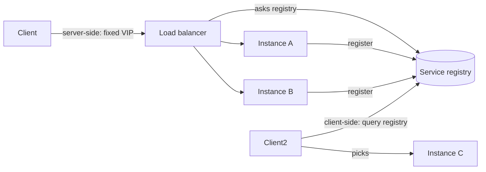

# Service Discovery

## 1. One-Line Definition
Service discovery is how a client finds the currently reachable network addresses of a service instance without being handed a hardcoded IP, using either a registry/DNS that the client asks at request time (client-side) or a load balancer that clients always call and which picks a healthy instance (server-side).

## 2. Why Do We Need It?
In dynamic systems, instance addresses change constantly: autoscaling spawns them, deployments replace them, failures kill them. Hardcoded IPs and config edits cannot keep up. Discovery decouples "I need the checkout service" from "where is it right now," letting the fleet change beneath clients without application rewrites — and it is required for horizontal scaling, upgrades, and self-healing to actually work.

## 3. Simple Intuition
A taxi company with 50 cars whose parking spots change by the minute. Every passenger calls one phone number (the dispatcher). The dispatcher knows the fleet's current locations and either gives the nearest car's details (client-side: you then call that driver) or sends a car to you directly (server-side: you never know which driver). If a car breaks down, the dispatcher stops listing it and no passenger is routed to a dead car.

## 4. What Happens Without It?
Every microservice would carry a hardcoded list of every other service's node IPs. A scale-out, a new version, or one unhealthy node quietly breaks that list. Requests fail at random, ops edits config endlessly, new replicas go unused until someone manually updates everyone. Discovery is the difference between "deploy and it's live" and "deploy and notify everyone by email."

## 5. Core Idea
- **Registration and deregistration:** instances register their address (and a health signal) on boot and remove it on shutdown/failure. The registry is only as good as its liveness data.
- **Client-side discovery:** the client asks the registry for healthy instances and load-balances itself (e.g., gRPC DNS-based or Consul client). Pros: no proxy hop. Cons: every client implements LB and must tolerate stale registry data.
- **Server-side discovery:** the client talks to a fixed address (load balancer/API gateway); the LB consults the registry and forwards to a healthy instance. Client stays dumb; the LB is the single point that must scale.
- **The watch effect:** registries push changes to interested clients (or clients poll). The freshness-vs-load trade-off on this channel decides how fast dead instances are missed.
- **Failure detection:** TTL heartbeats and health checks distinguish "quiet" from "dead"; deregistration lags detection by design, causing brief routing to dying instances.
- **Kubernetes does this for you:** Services + DNS + endpoints are built-in discovery — see [[kubernetes-services|Kubernetes Services and Ingress]].

## 6. Important Terminology

| Term | Simple Meaning |
|------|----------------|
| Registry | System holding instance name → addresses |
| Registration | Instance joining the registry |
| Deregistration | Instance leaving the registry |
| Heartbeat / TTL | Renewal signal so stale entries expire |
| Health check | Active probe deciding if an instance is usable |
| Client-side discovery | Client queries registry and load-balances itself |
| Server-side discovery | Client hits a fixed LB that picks an instance |
| Service mesh discovery | Sidecar proxies resolve names for local apps |
| DNS TTL | How long a name lookup stays cached in clients |

## 7. Basic Architecture



Client-side and server-side are shown together for contrast: one client queries the registry directly; the other uses a fixed LB that already knows the fleet.

## 8. Request or Data Flow
1. Instance B starts; it registers `billing → 10.0.0.2:8080` and begins sending TTL heartbeats.
2. A client (server-side) calls the billing Service's fixed name/IP — the LB address never changes.
3. The LB checks the registry, sees A and B healthy, and forwards to B.
4. B crashes; its heartbeat stops; after TTL, the registry marks it unhealthy and removes it.
5. New requests route only to A; nothing in the client changed because the address was abstract all along.

## 9. Practical Example
**Checkout microservice with 12 replicas behind a Consul-managed LB registry in one region.** Replicas register with the region registry on start and deregister on graceful shutdown. Deploying v2: 2 new replicas register, a load balancer drains the old ones (deregistration), so every request hits a live v2. During an autoscale event the count swings 12 → 24 → 15 across a flash sale; clients never edit a config file — the registry absorbs the whole dance, and stale-route error rate stays under the noise floor even during the churn.

## 10. Scaling
- **Registry is a shared hot spot:** every instance registers and every client queries/watches it. Gossip-backed registries (like some Consul/etcd setups) scale registrations reasonably; central registries become the scaling ceiling.
- **Client-side spreads the load:** clients query the registry then talk directly — no proxy in the data path — but the registry still sees N clients × M queries.
- **What breaks at scale:** watch fan-out (every client subscribes to every change), DNS caching defeating discovery freshness, and registries themselves becoming a SPOF — run them in a quorum/HA topology and watch their health, or lean on the mesh/control plane to distribute queries.

## 11. Reliability and Failure Scenarios

| Failure | What Happens | Detection | Recovery | Trade-off |
|---------|--------------|-----------|----------|-----------|
| Registry down | New lookups fail; cached ones survive | Registry health | HA/quorum registry, client caching | staleness vs availability |
| Instance dies silently | Clients route to a dead address briefly | Heartbeat timeout | Shorter TTL, health checks, retries | false-positive load |
| Register stale/duplicate | Zombie endpoints pollute routing | Health probe | Deregister + re-register, watch | extra churn |
| Watch channel oversubscribed | Clients miss changes | Metrics on watch lag | Sharded streams, polling fallback | freshness/load |

## 12. Consistency and Correctness
- Discovery is eventually consistent by nature: there is always a window between an instance's actual state and the registry's record. Clients must tolerate stale addresses (retries, second resolved target) rather than expect instant consistency.
- Registration order matters at scale-out (list new instances before draining old so capacity never drops below need) and graceful shutdown matters at deploys (deregister → drain → stop).
- DNS-based discovery has a freshness ceiling: honoring the TTL is mandatory or a deleted service lingers in client caches for the entire stale TTL.

## 13. Performance
- Client-side discovery avoids an extra hop — lowest latency at high throughput.
- Server-side adds one fixed hop, which is usually negligible compared with DNS + TLS setup for a typical request.
- Watch-based updates are far cheaper than polling: a subscriber industry-standard gets push; polling multiplies traffic by the poll interval.
- The registry is a read-heavy workload: cache aggressively, keep writes (registration) cheap, and prefer quorum-only writes for critical deregistrations.

## 14. Security
- Discovery metadata reveals your service topology, so limit who can query the registry and authenticate requests to it — least privilege via roles.
- Registration must be authenticated so an attacker can't register a fake instance and hijack traffic (a classic poisoning attack); validate senders on the wire.
- Encryption end-to-end (see [[encryption-and-keys|Encryption and Keys]]): discovery is address data, not a substitute for authenticating the actual service (mTLS). Cross-trust "confused deputy" issues arise when a registry spans tenants.

## 15. Trade-Offs

| Approach | Advantages | Disadvantages | When to Use |
|----------|------------|---------------|-------------|
| Client-side registry (Consul client, ZK) | No proxy hop; direct routing | Every client implements LB + failure handling | gRPC, internal high-QPS client pools |
| Server-side LB (registry + LB) | Dumb clients; central policy | Proxy hop; LB is a SPOF if not HA | Web/HTTP, heterogeneous clients |
| DNS round-robin | Zero extra infra; universal | Poor expiration control; can't weight/failover | Cheap fallback, SRV-aware stacks |
| Service mesh discovery | Transparent, mTLS + retries bundled | Heavy layer; moves complexity into proxies | Large microservice orgs |

## 16. Common Mistakes
- Discovery with no failure detection: entries linger forever and clients keep hitting dead instances.
- Long DNS TTLs defeating instantaneous deregistration — you can't deregister faster than clients' caches.
- Treating the registry as just another DB you query ad hoc — it needs HA and is on every critical path.
- Relying on the registry for security (authenticate the application, not just the name).
- Abusing the load balancer as the registry: healthy-but-cold instances get hammered.

## 17. HLD vs LLD Boundary
HLD: client-side vs server-side strategy, registry topology/HA, TTL/health policy, name→namespace scheme, mesh involvement, multi-region discovery story. LLD: the registration SDK call, heartbeat loop timer, exact DNS TTL values, the LB health-check path, the specific service-name syntax.

## 18. Interview Questions

### Beginner
- What problem does service discovery solve that DNS alone does not really solve?
- Contrast client-side and server-side discovery in one diagram each.

### Intermediate
- A service deregistered by the registry still receives traffic. Why, and how do you make it stop faster?
- How would you choose between DNS-based and registry-based discovery for an internal gRPC fleet?

### Advanced
- Design discovery for 20 regions with a mesh: how do names, health, and failover work across region boundaries?
- A compromised client can register fake instances. What protections do you add at the registry?

## 19. Interview Memory Summary

> [!abstract]- Interview Memory Summary
> ### Remember
> - Discovery decouples "what service" from "what instance", because addresses churn.
> - Client-side: client queries registry, load-balances itself. Server-side: client hits fixed LB.
> - Registration + TTL heartbeats + health checks keep the registry honest.
> - It's eventually consistent by nature — stale addresses are normal, tolerate with retries.
> - Watch (push) beats poll (pull) for freshness at scale.
> - DNS is the cheap fallback but TTL caps how fast stale names disappear.
> - Kubernetes embeds discovery via Services + endpoints + DNS.
> - The registry is a hot shared component: HA it, cache reads, safeguard writes.

### 30-Second Explanation

Services register their addresses plus a health signal; the registry (or DNS/LB) publishes healthy instances; clients resolve the name at request time. Client-side discovery pays no proxy hop but pushes LB logic into every client; server-side keeps clients dumb behind a load balancer. Either way names stay stable while the fleet churns, and everything downstream tolerates the brief staleness window after an instance dies.

### Interview Traps

- Claiming discovery is "real-time" — it is eventually consistent; you must handle stale lookups.
- Ignoring TTL: a healthy deregistration is still followed by TTL-duration stale traffic.
- Forgetting the registry is a critical-path component that needs HA and access control.
- Conflating discovery (find the address) with identity/security (prove it's the real service).

### Key Trade-Off

You trade a tiny per-request lookup for the ability to survive a constantly changing fleet; the cost is one more critical component (the registry) whose freshness, HA, and security you now own.

## 20. Related Concepts

### Prerequisites

- [[kubernetes|Kubernetes]]
- [[load-balancing|Load Balancing]]
- [[dns|DNS and DNS Resolution]]

### Commonly Used Together

- [[kubernetes-services|Kubernetes Services and Ingress]]
- [[service-mesh|Service Mesh]]
- [[autoscaling|Autoscaling]]
- [[cloud-infrastructure|Cloud Infrastructure (Regions / AZs / VPC)]]

### Alternatives

- [[load-balancing|Load Balancing]] (server-side, fixed entry)
- [[dns|DNS and DNS Resolution]] (static-name fallback)

### Advanced Concepts

- [[service-mesh|Service Mesh]]
- [[kubernetes|Kubernetes]]

Related planned topics (not authored yet): global-coordination, geo-dns-anycast, microservices.

## 21. References
Consul docs (registry + health + watch), Kubernetes Services/endpoints documentation, gRPC naming and discovery docs, and Netflix's Eureka design notes for client-side discovery trade-offs. Verify health/TTL semantics against the specific registry you select.

## 22. Active Recall

Test yourself before revealing each answer.

> [!question]- What exactly should a client do when the instance it just discovered is already dead?
> Retry against another discovered instance: resolve again, pick a different healthy entry, apply retry with backoff (see [[retry-and-timeout|Retry and Timeout]]). Discovery is eventually consistent, so stale lookups are an expected, handled condition rather than a rare bug.

> [!question]- Why does a long DNS TTL sabotage deregistration, and what is the fix?
> A client caches the name for the TTL, so even after an instance deregisters, clients keep dialing its address until their cache expires. Fix: honor deregistration with short TTLs, remove the record on the authoritative side, and let clients expire early via SRV lookup or registry push.

> [!question]- Choose client-side vs server-side discovery for an internal gRPC checkout fleet. Justify.
> Client-side: no proxy hop, lowest latency, and gRPC includes load-balancing support against a discovered address list. The cost is that every client must implement retry and health-aware selection; server-side wins when you want dumb clients and central policy despite the extra hop.

> [!question]- You spawn 50 new replicas and traffic still hits only the old 5. Diagnose.
> They registered but traffic is pinned elsewhere: the LB's health check hasn't passed them into the pool, DNS cache TTL or the watch stream is stale, or the registration path (wrong registry/namespace) silently failed. Verify the registry's listing, the LB's health verdict per replica, and client cache TTL in that order.

> [!question]- The registry goes down for 30 seconds. What breaks and what survives?
> New registrations fail (scale-out stuck, deploys can't list) and cache-miss lookups fail; clients with cached names/LBs keep working because the resolution already happened. Survives if clients cache + retry. So: HA the registry, make clients cache, and run it on a quorum in more than one datacenter.

> [!question]- Interview scenario: 5,000 microservices, gRPC, weekly deploys, autoscale in seconds. Design discovery.
> Push-based registry (or sidecar mesh) with watch streams, short effective TTL, health-checked deregistration, and load balancing on the client side over SRV-style names; no long-TTL DNS in the hot path; registry split by region with a quorum, authenticated registration, and every client coded to treat stale entries as normal and retry — deploys and scale events then cause zero config churn.

## 23. When Should I Use This?

### Use it when

- Instance addresses change constantly (autoscaling, rolling deploys, failures).
- You run many services that call each other and want zero manual config edits.
- You need health-aware routing: never send traffic to a known-dead instance.

### Avoid it when

- A handful of fixed, long-lived VMs with static IPs — DNS or config is cheaper.
- You want the absolute simplest topology and tolerate manual wiring.
- Single-instance services where the "registry" is one entry in a config file.

### What problem does it solve?

It makes the fleet's churn invisible: clients keep asking for "the checkout service" and always get a live instance, while registrations, health checks, and deregistrations happen without human or config involvement.

### What problem does it NOT solve?

It does not guarantee liveness (a health check can still lag), does not secure the connection (pair it with mTLS), does not auto-failover storage (see [[failover|Failover]]), and does not relieve you of scaling the registry itself — it is a new component with its own availability needs.

## 24. Decision Connections

Decisions that go together with service discovery:

- [[kubernetes|Kubernetes]] — embedded discovery (Services, endpoints, DNS) is the default in-K8s answer.
- [[kubernetes-services|Kubernetes Services and Ingress]] — the concrete routing implementation behind discovery in a cluster.
- [[load-balancing|Load Balancing]] — server-side discovery is a load balancer fed by a registry.
- [[service-mesh|Service Mesh]] — sidecar proxies implement discovery + balancing + mTLS transparently.
- [[dns|DNS and DNS Resolution]] — the universal static-fallback discovery layer everyone starts with.
- [[autoscaling|Autoscaling]] — instances churn fast, which is exactly the churn discovery must absorb.
- [[retry-and-timeout|Retry and Timeout]] — the client-side response to eventually-consistent stale addresses.
- [[cloud-infrastructure|Cloud Infrastructure (Regions / AZs / VPC)]] — names and health must be resolved within VPC/region boundaries.

Decision tree:

```
How do callers find instances?
    |
    +-- Fleet is closing to static (few, fixed VMs)?
    |      → [[dns|DNS and DNS Resolution]] or config files
    |
    +-- On Kubernetes?
    |      → [[kubernetes-services|Kubernetes Services and Ingress]] built in
    |
    +-- Dynamic fleet, internal calls?
    |      |
    |      +-- gRPC/high QPS, want no hop? → client-side registry
    |      +-- Dumb clients, central policy? → server-side LB
    |      +-- Many services, want mTLS + retries?
    |             → [[service-mesh|Service Mesh]]
    |
    +-- World must see one name?
           → [[load-balancing|Load Balancing]] + [[dns|DNS and DNS Resolution]] at the edge
```