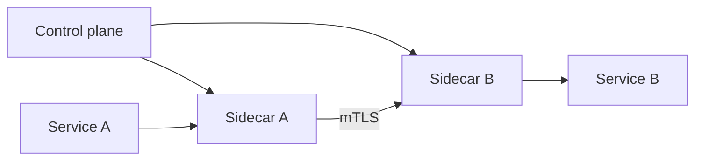

# Service Mesh

## 1. One-Line Definition
A service mesh is a dedicated, transparent infrastructure layer (typically sidecar proxies plus a control plane) that handles all in-cluster service-to-service traffic — routing, retries, timeouts, mTLS, observability, and policy — so application code no longer implements network concerns.

## 2. Why Do We Need It?
In a microservice fleet, every service must quietly solve the same hard network problems: retry, timeout, circuit breaking, load balancing, TLS between instances, authn/authz between peers, and distributed tracing. Naively, each team re-implements these in every service (inconsistently, and usually with bugs). A mesh extracts all of it into infrastructure: sidecar proxies intercept traffic near each pod, and a control plane distributes configuration and policies centrally — so the business code stays clean and the network behavior is uniform, enforceable, and observable.

## 3. Simple Intuition
Each courier in a delivery company is given a phone (the sidecar) that only they carry. The phone knows the route-checking rules, calls ahead to confirm the recipient exists, retries a ringing line once, logs every call, and encrypts any voice over the wire. The courier (your app) just talks; the phone handles protocol-level life. A central dispatcher (control plane) updates every phone's rules at once — new route policy, a colleague's number change — from one dashboard instead of visiting every courier.

## 4. What Happens Without It?
Every service ships its own half-broken soup of retries, timeouts, TLS, and tracing. Retries are tuned differently per team, so a flaky downstream gets hammered 10x by inconsistent retry storms. TLS is absent in places, certificates are a mess, and mTLS is effectively impossible fleet-wide. Distributed traces stop at service boundaries unless each team agrees on headers. Network policy (who may call whom) is scattered across code and conf files — untrustworthy and ungovernable.

## 5. Core Idea
- **Data plane vs control plane:** the data plane is the actual traffic path — one sidecar (Envoy-style) proxy per pod or per node — intercepting all inbound/outbound calls. The control plane (like Istio's istiod, or Linkerd's controller) pushes config and certificates to every proxy.
- **Transparent interception:** iptables or eBPF redirect pod traffic through the local proxy. The app neither knows nor configures anything; a mesh is adopted without code change.
- **L7 features at scale:** retries, timeouts, circuit breaking, observability, traffic shifting, and policy are configured as mesh CRDs, not in every codebase.
- **Identity, not address:** the mesh gives every pod a SPIFFE-style identity; mTLS becomes the default between pods, and authorization policies are expressed in terms of that identity, not IPs.
- **Observability is free:** each proxy emits traces, metrics, and access logs for every call — golden signals for the fleet without per-team composite work.

## 6. Important Terminology

| Term | Simple Meaning |
|------|----------------|
| Sidecar | Proxy injected beside each pod, intercepting its traffic |
| Data plane | The proxies that move and govern actual traffic |
| Control plane | System that configures the proxies |
| mTLS | Mutual TLS — both sides verify each other's identity |
| VirtualService / DestinationRule | Mesh rules for routing and resilience |
| Circuit breaking | Stop sending to a failing instance after threshold |
| Traffic shifting | Send % of requests to a new version (canary) |
| SPIFFE identity | Standard peer identity for services |
| Mesh telemetry | Traces, metrics, logs emitted by the proxies |

## 7. Basic Architecture



Service A's local sidecar receives its outbound call, applies retry/timeout/policy, and sends it over mTLS to Service B's sidecar, which enforces inbound authz and forwards to B's local port. The control plane keeps both proxies' rules and certificates fresh.

## 8. Request or Data Flow
1. Service A calls `http://b-svc` for an order.
2. The local sidecar intercepts the connection before it leaves the pod.
3. The control plane has already pushed a VirtualService: retries = 2, timeout = 3s, weighted traffic 90/10 between v1/v2.
4. The sidecar verifies identity of the destination with mTLS, chooses an endpoint, and forwards with a trace header added.
5. Service B's sidecar checks an AuthorizationPolicy (peer identity allows reads), accepts, and delivers to B.
6. Both proxies emit span/status metrics; distributed traces now cross the fleet boundary correctly.

## 9. Practical Example
**50 microservices, 300 pods, mesh adopted in a weekend, no code changes.** Before, retry storms melted the payments service during a bad deploy: 8 services retried 5x each uncontrolled. The mesh sets retries = 2 with backoff at the virtual service level and a circuit breaker on payments (max 5 pending requests, open after 10 failures). mTLS turns on fleet-wide; a trace from checkout to ledger now renders end-to-end. The deploy team ships v2 to 10% of traffic via weighted routing with zero app involvement; errors trigger auto-failover to v1.

## 10. Scaling
- **The data plane scales linearly with pods** (one sidecar each), but at high per-pod throughput the sidecar becomes a CPU/connection bottleneck — you may need node-shared proxies or kernel-bypass placements instead of per-pod sidecars.
- **The control plane is the hot spot:** it pushes config and manages mTLS certificates for every proxy. Watch its CPU, mTLS rotation rate, and config push volume; use namespace/shards for isolation at scale.
- **What breaks:** very high per-request concurrency through a sidecar adds latency per hop (tens of microseconds to a few ms), memory grows with route/config size, and churn-heavy fleets (autoscaling) drive certificate-rotation load.

## 11. Reliability and Failure Scenarios

| Failure | What Happens | Detection | Recovery | Trade-off |
|---------|--------------|-----------|----------|-----------|
| Sidecar crashes | Local traffic interrupted | Proxy liveness | Restart proxy; fail-closed vs open policy | availability vs isolation |
| Control plane down | Existing rules still enforced by proxies | CP health | Multi-replica CP, cached config | policy changes frozen |
| mTLS rotation stalls | Cert expiry breaks peer calls | Rotation metrics | Increase rotation budget, warm caches | security vs load |
| Misconfigured VirtualService | Global 5xxs on one rule | Trace/error spike | Version + rollback rules quickly | config blast radius |

## 12. Consistency and Correctness
- The mesh is **eventually consistent by config**: rules pushed asynchronously to proxies, so a weighted-shift does not flip atomically fleet-wide. Traffic percentages are approximations within a window.
- **Ordering and idempotency are not solved by retries alone** — the mesh retries a request whose side effect may have already happened; your service must stay idempotent, exactly as with any retry layer.
- mTLS identity must map cleanly to policy: if identity is per-pod rather than per-service, one boxed service can impersonate another via its pod identity — pin identity to deployment/namespace labels.

## 13. Performance
- The sidecar adds a per-request hop in both directions: typically tens of microseconds to a few milliseconds of latency and a CPU/memory tax per pod — roughly 1-5% overhead on a hot path, more if proxies are undersized.
- TLS termination twice per hop (client→proxy, proxy→proxy, proxy→server) costs CPU; larger proxies and HTTP/1→2 upgrades amortize it.
- At very high QPS, per-pod sidecars can bottleneck the pod; node-shared pooled proxies or resolving mesh off the hot path are the escaping-hack plays.

## 14. Security
- The mesh is one of the strongest mTLS stories: identity-based mutual authentication fleet-wide, with short-lived certificates rotated automatically.
- Authorization policies (who may call whom) become enforceable in one layer instead of many app-level checks.
- The control plane is powerful: compromise it, and you redefine policy and identity for everything. Guard it with least-privilege, audit its mutations, and treat it as a security-critical component (see [[encryption-and-keys|Encryption and Keys]]).

## 15. Trade-Offs

| Approach | Advantages | Disadvantages |
|----------|------------|---------------|
| Service mesh | Uniform L7 features, transparent, central policy | High ops complexity, per-hop overhead, control-plane operational cost |
| Library/SDK (resiliency in code) | Fine control, no extra hop | Feature drift per team, code pollution, hard to upgrade |
| Bare K8s Services | Simple, low overhead | No retries/mTLS/traces — other layers must provide them |
| API gateway only | North-south control | Covers edge calls, not east-west microservice traffic |

## 16. Common Mistakes
- Adopting a mesh before there is a problem: for small fleets it adds cost and complexity with little return — start with libraries.
- Treating mesh retries as free: uncoordinated retries still cascade into retry storms; set sane budgets and circuit breakers together.
- Ignoring the control plane: it's a critical, security-sensitive workload that needs HA, capacity, and careful upgrades.
- Skipping idempotency thinking because "the mesh handles retries" — retries still duplicate side effects.
- Oversizing config: one giant VirtualService touching everything makes the config a SPOF and the blast radius of a bad rule enormous.

## 17. HLD vs LLD Boundary
HLD: whether to adopt a mesh, data-plane placement (sidecar vs node proxy), control-plane HA/sharding, the mTLS and authorization model, cross-team policy ownership, and the performance budget for the extra hop. LLD: the concrete VirtualService/DestinationRule/AuthorizationPolicy resources, retry/timeout circuit values per service, the sidecar resource request and routing mode.

## 18. Interview Questions

### Beginner
- What does "transparent" mean for a service mesh, and how does interception actually work?
- Contrast the data plane and the control plane.

### Intermediate
- A flaky payments service is being pounded by 8 callers retrying aggressively. How does the mesh fix this at the infrastructure layer?
- Why does mTLS need short-lived certificates, and what can break in rotation?

### Advanced
- Design a mesh for 10k pods with per-region control planes. Where do config pushes, mTLS, and cross-region traffic get tricky?
- Evaluate mesh vs SDK-based resiliency for a 5-person team's 20-service system. When is the mesh the wrong call?

## 19. Interview Memory Summary

> [!abstract]- Interview Memory Summary
> ### Remember
> - Mesh = data plane (sidecar proxies) + control plane (config, mTLS, certs).
> - Adoption is transparent: traffic is intercepted, apps don't change.
> - Uniform retries/timeouts/circuit breaking/traces come from config, not code.
> - mTLS identity (SPIFFE) enables real peer authz, fleet-wide.
> - It adds a per-request hop (µs–ms) and a heavier ops burden.
> - Config distribution is eventually consistent; weighted shifts aren't atomic.
> - Control plane is security-critical, needs HA + capacity.
> - Know when NOT to use it: small fleets, hot paths, tight latency.

### 30-Second Explanation

A service mesh routes all in-cluster traffic through local sidecar proxies managed by a central control plane. The proxies enforce centrally configured retries, timeouts, circuit breaking, traffic shifting, mTLS identity, and telemetry transparently. The win is uniform, policy-driven, observable networking; the price is an extra hop per request, operational complexity for the control plane, and an adoption that only pays off once the fleet is big enough for coordination cost to be real.

### Interview Traps

- Claiming mesh retries are free or lossless — they can amplify storms; use budgets and circuits.
- Forgetting the sidecar hop adds latency and CPU on hot paths.
- Ignoring control-plane HA/security (it defines your security perimeter).
- Suggesting mesh for a 3-service team when SDK libraries are cheaper.

### Key Trade-Off

You buy uniform L7 resiliency, identity-enforced security, and fleet-wide telemetry, but you pay an extra network hop, heavy operational complexity, and a powerful control plane that must itself be secured and scaled — adopt only when coordination pain exceeds that bill.

## 20. Related Concepts

### Prerequisites

- [[kubernetes|Kubernetes]]
- [[service-discovery|Service Discovery]]
- [[load-balancing|Load Balancing]]

### Commonly Used Together

- [[kubernetes-services|Kubernetes Services and Ingress]]
- [[observability|Observability]]
- [[encryption-and-keys|Encryption and Keys]]
- [[retry-and-timeout|Retry and Timeout]]

### Alternatives

- [[kubernetes-services|Kubernetes Services and Ingress]]
- Plain [[retry-and-timeout|Retry and Timeout]] libraries in code

### Advanced Concepts

- [[distributed-tracing|Distributed Tracing]]
- [[circuit-breaker|Circuit Breaker]]
- [[service-discovery|Service Discovery]]

Related planned topics (not authored yet): control-plane-vs-data-plane, microservices, api-gateway.

## 21. References
Istio and Linkerd official documentation (architecture, mTLS, VirtualService/DestinationRule). Envoy proxy documentation for the data-plane mechanics. Google SRE Book and "Patterns of Distributed Systems" for network-layer resiliency. Verify control-plane scaling guidance against current versions.

## 22. Active Recall

Test yourself before revealing each answer.

> [!question]- What problem does transparent interception actually solve during mesh adoption?
> Applications keep their existing IP:port calls; the mesh intercepts them through iptables/eBPF and applies policy without code changes. That is what makes a mesh adoptable across 50 services without a coordinated code sprint — the network behavior changes under the app, not inside it.

> [!question]- A caller retries 5x and the callee gets 20x load because other callers do too. How does the mesh prevent the storm?
> Set a global retry budget at the virtual service level (e.g., 2 retries max with backoff), a per-caller timeout, and a circuit breaker on the callee (open after N failures, so callers fail fast via a fallback instead of hammering). The mesh centralizes these so no team tunes its own loop.

> [!question]- mTLS certs must be short-lived. What can break, and why do short lifetimes exist?
> Rotation is a periodic control-plane load burst (every proxy re-requests/re-syncs certs). If rotation stalls or the CA is unreachable, certs expire and previously fine peer calls start failing with TLS handshake errors. Short lifetimes limit the blast radius of a leaked identity — that is the security reason for them.

> [!question]- During a 90/10 canary, users report intermittent 403s and 5xxs. Diagnose in mesh terms.
> Config distribution is eventually consistent: some proxies still carry the old rules and route 100% to v1, others apply the new VirtualService/AuthorizationPolicy inconsistently. The 403 suggests the new v2 pods fail the peer authorization policy until their identity/cert propagates. Check policy version skew and cert rotation state across proxies.

> [!question]- Interview scenario: your service triggers on low latency. The team adds a mesh and p99 jumps from 2ms to 6ms. React.
> The mesh adds a proxy hop each way plus double TLS termination. Verify proxy/mesh sizing (CPU, connection pooling), consider HTTP/2 multiplexing and session reuse, move to node-shared proxies if per-pod proxies are the bottleneck, and re-budget RPC timeouts for the new overhead — then decide if the feature gains (mTLS, tracing, policy) justify the latency tax on this path.

## 23. When Should I Use This?

### Use it when

- You have many services calling each other and inconsistent network behavior is causing incidents.
- You need fleet-wide mTLS, peer authorization, and traffic shifting without rewriting every service.
- Cross-team observability (traces/metrics per call) matters and per-team libraries keep drifting.

### Avoid it when

- The fleet is small (fewer than a handful of services) — the coordination problem it solves isn't there yet.
- Services have strict latency budgets that resent an extra hop on the hot path.
- The team can't operate the control plane; a misconfigured mesh is an outage amplifier.

### What problem does it solve?

It centralizes every microservice's messy, duplicative network concerns — retries, timeouts, circuit breaking, TLS, identity, policy, and telemetry — into one consistent infrastructure layer that apps no longer write.

### What problem does it NOT solve?

It does not make bad architecture scale (a monolith behind a mesh is still a monolith), does not make retries idempotent (side effects still duplicate), does not add cross-cluster/multi-cloud traffic without significant federation work, and does not remove normal Kubernetes networking basics — Services, Ingress, and readiness still rule.

## 24. Decision Connections

Decisions that go together with a service mesh:

- [[kubernetes|Kubernetes]] — the usual substrate; mesh policy lives as CRDs on the same platform.
- [[service-discovery|Service Discovery]] — the mesh is itself a discovery+failure-detection layer per proxy.
- [[kubernetes-services|Kubernetes Services and Ingress]] — the mesh sits above/beside Services for L7 behavior.
- [[retry-and-timeout|Retry and Timeout]] — centralized retry/timeout budgets are core mesh features.
- [[circuit-breaker|Circuit Breaker]] — mesh-level circuit breaking stops failing callees from melting callers.
- [[observability|Observability]] and [[distributed-tracing|Distributed Tracing]] — the proxies emit the golden signals fleet-wide.
- [[encryption-and-keys|Encryption and Keys]] — mTLS and identity management happen here.
- Control Plane vs Data Plane (planned) — the architectural split the mesh embodies.

Decision tree:

```
Many internal service-to-service calls?
    |
    +-- Small fleet, needs simple handles?
    |      → [[retry-and-timeout|Retry and Timeout]] libraries in code
    |
    +-- Fleet large, network behavior inconsistent?
    |      |
    |      +-- Strict latency budget on hot path? → measure first, maybe skip sidecar
    |      +-- mTLS + per-peer authz + tracing wanted?
    |             → adopt [[service-mesh|Service Mesh]] with HA control plane
    |
    +-- Only edge (north-south) traffic control needed?
           → [[kubernetes-services|Kubernetes Services and Ingress]] + gateway
```