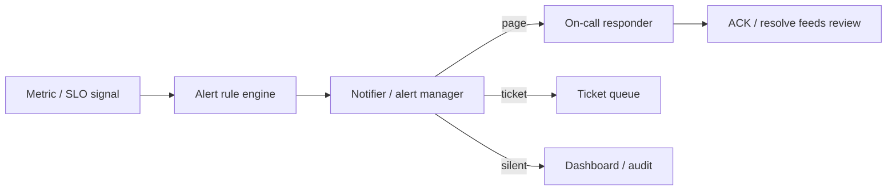

# Alerting and Alert Fatigue

## 1. One-Line Definition
Alerting is the system that turns monitored signals into timely, actionable notifications to humans — and alert fatigue is the failure mode where so many alerts fire (or too many are irrelevant) that responders ignore them, including the real ones.

## 2. Why Do We Need It?
Monitoring alone is passive: dashboards describe health but nobody stares at them. Alerting is the active step — push a page to the right person when a signal crosses a threshold that means a user-visible problem is happening or about to happen. But the discipline is the point: a pager that fires on every CPU blip teaches responders to sleep through everything. Alerting must be designed around signal, threshold, routing, and, above all, credibility.

## 3. Simple Intuition
A car's warning lights are fine because they're rare, meaningful, and tied to action. If you wired the horn to the gas gauge and the winker to the radio, you'd stop reacting to any of it — the dashboard becomes noise. Alerting is exactly that horn: every page must be worth the adrenaline, or it's just noise that devalues the next page.

## 4. What Happens Without It?
Two failure sides: (1) no alerting — you find out about outages from users; (2) bad alerting — an alert storm. Every dashboard spike pages, thresholds are copied from a template, someone clicks snooze on everything, real 5xx storms get lost in the noise, and on-call learns to ignore the pager. The cost is downtime that should have been actionable in minutes but instead rolls for hours.

## 5. Core Idea
- **Alert, don't just monitor:** monitoring answers "is it broken right now?"; alerting answers "who should act, and when?" The alert is a decision, not a telemetry query.
- **Alert on user-visible outcomes, not infra trivia:** page when the error budget is burning (see [[sli-slo-sla|SLI / SLO / SLA]]), when p99 exceeds target, when saturation predicts failure — not when a single host CPU is high. Use [[golden-signals|Golden Signals]] as the pattern.
- **Severity ladder:** page (someone must wake up) → task/ticket (do it at office hours) → dashboard/insight (no one notified). Most "alerts" should be the lower two.
- **Every alert needs an owner + a runbook:** the page says what to look at, what the blast radius is, and the first recovery step. A page without a runbook is a panic.
- **Multi-window / burn-rate:** pair short windows (e.g., 1h at 14.4x burn) with long ones (e.g., 6h) to catch both fast broke and slow bleed; see [[sli-slo-sla|SLI / SLO / SLA]].
- **Noise control is a feedback loop:** measure page count metrics, review every page in a weekly alert review, deduplicate, throttle, and use maintenance windows.
- **Warning vs paging threshold:** a warning can be a dashboard condition; a page has to be actionable. Anything alerting more than a handful of times a week per team is already fatiguing.

## 6. Important Terminology

| Term | Simple Meaning |
|------|----------------|
| Alert rule | Condition + frequency + severity definition |
| Severity | Pager vs ticket vs silent insight |
| Escalation | Routing up if no acknowledgement |
| On-call | The person/team who takes pages |
| Burn rate | How fast the error budget is being spent |
| Alert fatigue | Ignoring real alerts because too many fire |
| Runbook | The doc for what to do when the page fires |
| Maintenance window | Declared silence during planned work |
| Deduplication | Collapsing repeated firing alerts into one |
| SLO alerting | Alert when budget burns too fast |

## 7. Basic Architecture



## 8. Request or Data Flow
1. A signal (error-rate, SLO burn, saturation) crosses its rule threshold for the configured window.
2. The rule engine fires; the alert manager deduplicates and routes by severity + owning team.
3. For page-level alerts: notify on-call, escalate if unacknowledged within the timeout, page again if the resolve deadline passes.
4. Responder reads the runbook, investigates (logs → traces), fixes or rolls back, resolves with a note. Metrics on the alert feed next week's review.

## 9. Practical Example
**SLO burn alert on checkout (assumptions):**
- Rule: error budget burns at 14.4x for 1h (fast) OR 2x for 6h (slow); pages only when either fires. One bad deploy burned 20% of the monthly budget in 20 minutes → the fast rule paged on-call instantly.
- Compare a naive rule "5xx > 1%" — it would have fired a dozen times on normal daily peaks (noise) and added fatigue instead of pointing at the one real deploy. The burn window is what separates signal from story.

## 10. Scaling
- **Alert sprawl:** rules multiply with services; review and prune regularly — an "obsolete alert" is a real one at 3am.
- **Central alert manager:** one place for dedup, throttle, grouping, routing; per-team ownership prevents cross-team noise.
- **Grouping:** aggregate alerts by incident (all DB pods failing = one page, not 40).
- **Auto-suppression:** maintenance windows and deploy windows suppress expected noise; correlating with deploys automates "this changed" context.

## 11. Reliability and Failure Scenarios

| Failure | What Happens | Detection | Recovery | Trade-off |
|---------|--------------|-----------|----------|-----------|
| Alert rule never fires | Silent outage | Users, dashboards | Test the rule, synthetic checks | effort |
| Alert storm | Real page lost | On-call complaints | Prune, group, dedupe | tuning |
| Notifier down | No one paged | Heartbeat on notifier | Redundant channel | cost |
| Escalation unbounded | Everyone paged | — | Stop escalation, alert on itself | complexity |
| On-call missed | Response delayed | — | Backup rotation, multi-party | staffing |

## 12. Consistency and Correctness
Universal alerting contract: every team defines success and failure of its own signals the same way (an "error" is the same error everywhere); otherwise combined alerts lie. Prefer alerting on measured SLIs / SLOs rather than ad-hoc thresholds so behavior is consistent with what users experience. Always alert on the *burn* of the budget, never on the budget being "low" in the abstract, to avoid a blinking pager while reality is fine.

## 13. Performance
Alert evaluation should live in a stream processor or monitoring sidecar — a query per rule per minute over an aggregated store, never complex joins per request. Keep rule evaluation on the metrics pipeline (cheap, pulled or streamed) and put routing/dedup in a layer between evaluation and notification so storms collapse before reaching people.

## 14. Security
Alert payloads leak topology, tenant activity, and internal hostnames — restrict dashboards and alert channels to authenticated internal systems. Never put customer data or secrets in alert text (they travel through SMS/chat). Harden the alert manager itself: it's a target — a compromised notifier can page every engineer or, worse, suppress pages during an attack.

## 15. Trade-Offs

| Choice | Advantages | Disadvantages | When to Use |
|--------|------------|---------------|-------------|
| Page on everything | No surprises missed | Fatigue, ignored pages | Never |
| SLO / burn-rate pages | Rare, credible, user-meaningful | Requires SLIs defined | Real services |
| Ticket for low severity | Record without waking anyone | May be ignored | Low-risk issues |
| Dashboard-only | Zero interruption | Nobody looks | Insights, ambient |
| Alert on symptoms (CPU) | Early hardware problems | Not user-visible | Infra automation, not humans |

## 16. Common Mistakes
- Thresholds copied with no review → constant noise and burnout.
- No runbook on the page → responder wakes up blind.
- Alerting on every dashboard panel instead of user-visible outcomes.
- No dedup / grouping → 40 pages for 1 incident.
- Ignoring page-count trends and pretending "no one complained."
- No dead-man switch or synthetic check → alert rules that silently broke.

## 17. HLD vs LLD Boundary
HLD: alerting philosophy (page vs ticket), SLO/burn-window strategy, severity ladder, routing/ownership model, dedup/grouping design, runbook requirement, feedback loop. LLD: the actual rule expressions, notifier config, escalation steps, maintenance-window templates, alert message formats.

## 18. Interview Questions

### Beginner
- Alert vs monitoring — what's the difference?
- Why does paging on every CPU spike create alert fatigue?

### Intermediate
- Design the alerting for a payment service: what would you page on, why, and what are the windows?
- How do you differentiate a "fast broke" from a "slow bleed" outage?

### Advanced
- Your alert storm roars at 3am: 40 pages for one root cause. Design the full fix (grouping, dedup, throttling, alerts on alerting).
- Design alerting that survives the alerting system being down — fail-safe, not fail-silent.

## 19. Interview Memory Summary

> [!abstract]- Interview Memory Summary

### Remember

- Alert = a decision with owner + runbook, not a telemetry query.
- Page on user-visible outcomes and SLO burn, not infra trivia.
- Severity ladder: page / ticket / dashboard — most things are tickets.
- Burn-rate windows catch fast and slow failures; single thresholds fatigue.
- Dedup and group — one incident is one page, not forty.
- Every page gets a review loop; alert counts are a health metric too.
- Never rely on a single path for the notifier itself.

### 30-Second Explanation

Alert on SLO burn and golden signals (latency, errors, saturation), page only when a human action is needed while the budget burns, route with deduplication and grouping, attach a runbook to every page, and run a feedback loop that prunes noise — so the pager rings exactly when it matters.

### Interview Traps

- Saying "alerts = thresholds on dashboards" — that's monitoring, not alerting.
- Ignoring alert fatigue as a design input (40 pages per incident is self-inflicted).
- Confusing alert fires with incidents — alerting quality is a metric too.
- No dead-man switch: a broken alert rule can silence everything silently.

### Key Trade-Off

Alerting trades notification noise for surety: alert on everything and you can't hear the real alarm; alert on little and you risk missing rare issues — SLO burn-rate alerting plus a review loop keeps alerts rare, meaningful, and acted on.

## 20. Related Concepts

### Prerequisites

- [[golden-signals|Golden Signals]]
- [[sli-slo-sla|SLI / SLO / SLA]]

### Commonly Used Together

- [[observability|Observability]]
- [[logging|Structured / Centralized Logging]]
- [[incident-management|Incident Management / On-Call / Postmortem]]

### Alternatives

- [[observability|Observability]] (dashboards for ambient awareness, alerting for action)

### Advanced Concepts

- [[circuit-breaker|Circuit Breaker]] (the behavior that keeps a service out of alert territory)
- [[rate-limiter|Rate Limiter]] (admission control that protects the user-facing SLO under load)

Related planned topics (not authored yet): dead-man switches, runbook automation, alert-management systems.

## 21. References
Google SRE Workbook (alerting on SLOs, burn-rate alerting), Prometheus alerting documentation, PagerDuty incident-response docs. Verify current SLO-alerting guidance pre-interview.

## 22. Active Recall

Test yourself before revealing each answer.

> [!question]- Alerting vs monitoring: what's the real difference?
> Monitoring asks "is the system healthy right now?" (dashboards, metrics). Alerting asks "is there a specific person who should act, and precisely whom?" — the alert is a routed, prioritized decision with an owner, severity, and usually a runbook, not a raw telemetry query.

> [!question]- Why does paging on every CPU spike cause alert fatigue, and what's the fix?
> CPU is one host's symptom, mostly not a user-visible problem, so almost every page is a false positive from the user's view; repeated wrong pages teach responders to ignore the pager. Fix: alert on user-visible signals (latency/error SLO burn, saturation), dedup and group the rest, and route infra issues to tickets or dashboards.

> [!question]- Design alerting for a payment service. What do you page on?
> Page on SLO burn (error budget burned too fast in short and long windows), error rate exceeding the SLO for a sustained window, and p99 latency crossing budget. Ticket on individual failed tenant journeys, high queue depth without budget impact, and repeated dependency warnings. Every page has an owner + runbook.

> [!question]- Fast broke vs slow bleed — how does alerting handle both?
> Two burn-rate windows: a short window (e.g., 14.4x burn for 1h) catches a fast catastrophic regression; a long window (e.g., 2x burn for 6h) catches a slow degradation that hides in a monthly average. A single static threshold can't tell them apart — it fires on normal peaks or misses the creep.

> [!question]- A team missed a real outage because the pager was full of noise. What's the systemic fix?
> Catch noise at the manager: group alerts into incidents, dedupe repeated fires, throttle flapping rules, and add a dead-man switch so a silent broken rule can't hide. Then run a weekly review of every page, prune thresholds with no real action, and re-promote genuinely actionable alerts — the alert-count trend becomes a health metric itself.

> [!question]- Your alerting stack itself goes down. How do you stay fail-safe?
> Redundant notifier channels, a dead-man/heartbeat alert from the alerting stack to a separate independent channel, on-call rotations that don't depend on the single manager, and synthetic checks that would page even if rules silently vanish. An ambient dashboard is the backup — it must keep working through the outage.

## 23. When Should I Use This?

### Use it when

- You have a system that must meet an SLO or user-expectation (most production services).
- Human action is required within minutes of a failure.
- You can define what "wrong" looks like measurably (error rate, latency, saturation).

### Avoid it when

- Failure is tolerable and post-hoc investigation suffices (experiments, prototypes).
- You can't define user-visible outcomes — without SLIs, thresholds are guesswork that creates noise.
- The team won't staff on-call or maintain runbooks — pages without responders are theater.

### What problem does it solve?

Monitoring is passive; alerting is the active step that converts a signal into a timely, routed, actionable notification — and alert fatigue is the main design risk it must overcome. Burn-rate alerting on SLOs with ownership and runbooks is the mechanism that keeps pages rare, credible, and acted on.

### What problem does it NOT solve?

It does not fix the underlying failure (that's reliability engineering), does not tell you *why* (logs/traces do), cannot guarantee delivery from a single renderer, and if thresholds are meaningless or unowned, alerting is just a louder dashboard.

## 24. Decision Connections

Decisions that go together with alerting:

- [[golden-signals|Golden Signals]] — the metric set alert rules should be built on (latency, traffic, errors, saturation).
- [[sli-slo-sla|SLI / SLO / SLA]] — burn-rate windows define the alert thresholds; the error budget decides what "fast enough" means.
- [[observability|Observability]] — the pipeline that produces the signals and the dashboards for ambient awareness.
- [[logging|Structured / Centralized Logging]] — the diagnosis step after the page fires; correlation IDs link alert → trace → log.
- [[incident-management|Incident Management / On-Call / Postmortem]] — the page hands off to the incident process; runbooks bridge them.
- [[circuit-breaker|Circuit Breaker]] — a well-tuned circuit breaker pre-empts alert storms by failing fast.
- [[rate-limiter|Rate Limiter]] — protects user-facing SLOs so alerting isn't constantly triggered by overload.

Decision tree:

```
Signal exists and someone must act?
    |
    +-- User-visible symptom (SLO burn, latency, errors)?
    |      → page on broadband SLO alerting (short + long burn windows)
    |
    +-- Component/health condition with no user impact?
    |      → ticket / dashboard — do not page
    |
    +-- SLOs defined?
    |      → [[sli-slo-sla|SLI / SLO / SLA]] values → burn-rate rules
    |      +-- Else → use [[golden-signals|Golden Signals]] static thresholds first, then convert to SLO
    |
    +-- Volume/noise problem?
    |      → dedup + group + throttle + maintenance windows
    |
    +-- Responder action defined?
           → runbook attached, owner assigned, review loop
           → hand off to [[incident-management|Incident Management / On-Call / Postmortem]]
```