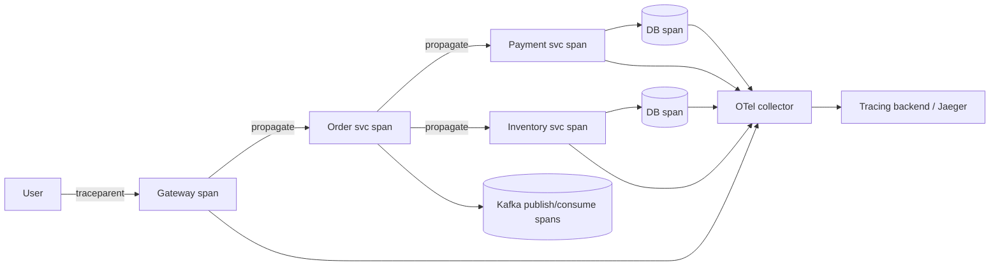

# Distributed Tracing

## 1. One-Line Definition
Distributed tracing follows a single request through every service it touches by propagating a trace context (trace ID + span IDs), producing a tree of timed spans that shows exactly where time went and where errors happened.

## 2. Why Do We Need It?
In a monolith, a stack trace shows the whole call path. In microservices, one user action fans across 5–30 services plus queues and databases — and no single log file has the whole story. Metrics tell you *the system* is slow; only a trace tells you *this request* was slow because span `db.query` waited 1.8s inside `inventory-svc` after `payment-svc` timed out. It's the only tool that reconstructs causality across service and network boundaries.

## 3. Simple Intuition
A parcel's tracking history: one tracking number (trace ID), each stage (span) with a timestamp — "received 10:01, sorted 10:04, in transit 10:06, delayed 11:20." If the parcel is late you don't guess — you read the chain and see exactly which stage held it. Distributed tracing is package tracking for requests: one ID, a chain of timed stages, and the bottleneck visible.

## 4. What Happens Without It?
"Checkout is slow" → every team's metrics look fine in isolation because the delay is *in the seam between services* (network + timeout + retry) or in a service whose own latency metric is averaged over fast paths. Teams add logging, re-deploy, and still can't reproduce. Tail latencies hide in the cross-service path (see tail latency), and incidents stretch from minutes to days.

## 5. Core Idea
- **One trace = one request** (or one job); **spans** are the units — one per operation (HTTP handler, DB query, cache call, message publish/consume). Each span has: span ID, parent span ID, service, operation, start time, duration, status, tags/attributes.
- **The trace is a tree**, built from parent-child links; the critical path is the time-ordered chain.
- **Context propagation:** the trace context travels in headers (`traceparent` in W3C Trace Context) or message metadata. Every hop must propagate + create a child span; any hop that drops context breaks the trace.
- **Instrumentation:** auto (agents/frameworks intercept HTTP/DB/queue calls) + manual spans for business steps. **OpenTelemetry** standardizes API/SDK/propagation.
- **Sampling:** you can't store every trace at scale.
  - *Head-based:* decide at the entry (e.g., 1% of requests) — cheap, but may miss rare slow ones.
  - *Tail-based:* buffer the trace and keep it only if interesting (error, slow) — better coverage of problems, needs a collector buffer.
  - *Adaptive/priority:* more sampling on errors/specific routes; keep the slow tail (see tail-latency).
- **Link to logs/metrics:** inject trace/span IDs into log lines and exemplars in metrics → click from a spike to a representative trace to its logs. That's the observability triangle closing.
- **Trace formats:** Jaeger, Zipkin, Tempo, commercial backends; export via OTLP.

## 6. Important Terminology

| Term | Simple Meaning |
|------|----------------|
| Trace | One full request's path, one trace ID |
| Span | One timed operation (hop) within a trace |
| Parent/child span | Causal nesting between operations |
| Trace context | IDs propagated across hops |
| W3C traceparent | Standard header for trace propagation |
| Sampling | Keeping only a fraction of traces |
| Tail sampling | Keep traces that look interesting |
| Span attributes/tags | Key-values (HTTP status, DB, tenant) |
| Critical path | The chain that determines total latency |

## 7. Basic Architecture



## 8. Request or Data Flow
1. Entry point creates a trace (root span) + sets `traceparent`.
2. Each downstream call creates a child span and forwards context; DB/queue clients auto-instrument.
3. Spans are batched and exported to the collector; the collector samples, then forwards to the backend.
4. The backend assembles spans by trace ID into the tree; you inspect the critical path and error spans.
5. Trace ID appears in log lines → you pivot trace→logs for that exact request.

## 9. Practical Example
**Checkout P99 regression (assumptions):**
- Metric: checkout p99 3.4s (SLO 1.5s), error rate normal.
- Tail-sampled traces of slow requests show spans: gateway 40ms → cart 30ms → **payment 2.9s** (of which `retry` child spans 3× ~900ms) → inventory 80ms.
- Payment's own dashboard p50 looked fine (900ms); only the *trace* revealed retry fan-out from a flaky 3rd-party timeout. Fix: tune timeout/retry, add circuit breaker. p99 back to 1.4s.
- Without traces, the outage is "payment latency" misleadingly averaged.

## 10. Scaling
- **Volume:** traces grow with request count × spans/request; sampling is mandatory (head 1–10%, tail for errors/slow). Span attributes are the storage driver — keep bounded.
- **Collector tier:** buffer + batch + sample before the backend; separate from apps (don't let tracing overload prod).
- **Cost model:** commercial tracing is priced per span — trim noisy spans (health checks, metrics scrapes) or auto-instrumentation will bill you.
- **Rare tail:** combine tail sampling with per-route budgets so slow/error traces survive.

## 11. Reliability and Failure Scenarios

| Failure | Happens | Detection | Recovery | Trade-off |
|---------|---------|-----------|----------|-----------|
| Broken propagation | Split trace, orphan spans | Trace length anomaly | Fix middleware/propagation config | blind path |
| Collector down | Traces buffered/lost | Exporter errors | Buffering, retry | telemetry loss |
| Sampling misses tail | Slow requests untraced | "not in trace" gaps | Tail sampling | collector memory |
| High span volume | Backend cost/latency | Cost dashboards | Sampling, span limits | visibility |
| Clock skew | Wrong span ordering | Duration anomalies | NTP, monotonic clocks | — |

## 12. Consistency and Correctness
Traces are *observational*, not transactional: don't use them for correctness. But they must be *complete enough to trust*: partial/missing context makes conclusions wrong ("no db span" might mean "not instrumented," not "no DB call"). Document instrumentation coverage and alert on propagation gaps (traces starting mid-service = missing upstream context).

## 13. Performance
- Agents add ~0.1–1% overhead typically (varies with span volume); batching/async export keeps it low.
- Span attributes dropped/truncated above limits — keep IDs stable but bounded.
- Tail sampling buffers traces in the collector (memory cost) — size buffers for peak slow-trace concurrency.

## 14. Security
- Trace attributes often include tenant IDs, URLs, and sometimes PII — apply redaction and access control to the tracing backend; treat it like logs (which it partly is).
- Never put secrets/tokens in span attributes. Propagation headers are trusted data — validate/limit incoming `traceparent` (malicious context injection/hop amplification).

## 15. Trade-Offs

| Choice | Advantages | Disadvantages | When to Use |
|--------|------------|---------------|-------------|
| No tracing | Cheap | No cross-service causality | Monolith/simple |
| Head sampling | Predictable cost | Misses rare slow/errors | Steady systems |
| Tail sampling | Captures problems | Collector memory | Most prod systems |
| Full tracing | Total visibility | Huge cost | Low-QPS critical flows |
| Auto-instrument only | Fast rollout | Noisy spans, blind business steps | First adoption |

## 16. Common Mistakes
- Instrumenting some services but not the queue consumers → traces end at publish (invisible async work).
- Sampling 100% at low volume then forgetting to reduce → cost cliff.
- Trace IDs not injected into logs → can't pivot to the exact request's logs.
- Ignoring tail latency in the trace: only looking at p50 traces (the average case is fine; the interesting trace is the p99.9).
- Treating traces as a replacement for metrics/alerting (they're for *why*, not *when*).

## 17. HLD vs LLD Boundary
HLD: trace coverage contract (all critical paths), propagation standard, sampling strategy + budget, backend topology. LLD: OpenTelemetry init per language, span creation/attributes, collector pipelines, sampling policies, log-trace ID linkage.

## 18. Interview Questions

### Beginner
- What is a span vs a trace?
- Why do you need context propagation?

### Intermediate
- A request is slow across 3 services with normal individual metrics. Walk how a trace finds the culprit.
- Design sampling for 200k RPS with error/slow-trace capture and bounded cost.

### Advanced
- Design tracing across a Kafka-based flow (produce/consume) so async work isn't a hole, and explain how trace context survives the queue.
- Traces show a 2s gap between two spans (no span in between). Enumerate every cause and how you'd distinguish them.

## 19. Interview Memory Summary

> [!abstract]- Interview Memory Summary

### Remember

- Trace = one request, span = one hop; parent-child links build a tree whose critical path shows where time went.
- Context propagation (traceparent header / message metadata) must survive every hop — a dropped context breaks the trace.
- Sampling is mandatory at scale: head-based (predictable cost) or tail-based (keep slow/error) — never lose the rare tail.
- Traces answer where; metrics answer how bad; logs answer why — link trace IDs into log lines to close the triangle.
- Instrument the whole critical path including queue consumers and async work, or the trace ends at publish.

### 30-Second Explanation

Create a root trace at ingress, propagate context with every call and message, emit spans for each hop, sample smartly, and offload to a collector/backend — then read the critical path when something's slow.

### Interview Traps

- A trace that stops at a service boundary — queue consumers uninstrumented leaves invisible async work.
- Sampling that keeps the fast requests but drops the slow tail — destroys the diagnostic value.
- Trace IDs not injected into logs — can't pivot to the exact request.
- Expecting traces to replace metrics/alerting — they explain "why," not "when."
- High-cardinality or noisy span attributes driving storage and cost.

### Key Trade-Off

Distributed tracing trades instrumentation cost and span volume (sampled down to stay affordable) for the ability to reconstruct any request's cross-service causality — you give up trace completeness for cost, so budget sampling to keep exactly the traces you'll need in an incident.

## 20. Related Concepts

### Prerequisites

- [[observability|Observability]]
- [[latency-vs-throughput|Latency vs Throughput]]

### Commonly Used Together

- [[golden-signals|Golden Signals]]
- [[sli-slo-sla|SLI / SLO / SLA]]
- [[kafka-producers-consumers|Kafka Producers and Consumers]] — async/queue hops must propagate context
- [[retry-and-timeout|Retry and Timeout]] — retry rounds show up as child spans

### Advanced Concepts

- [[consumer-lag|Consumer Lag]] — tracing shows where the wait is; consumer lag quantifies it
- [[message-queue|Message Queue]] — trace context must survive the queue

Related planned topics (not authored yet): tail-latency sampling strategies, OpenTelemetry deployment patterns.

## 21. References
OpenTelemetry docs (context propagation, sampling), W3C Trace Context spec, Jaeger architecture docs. Verify SDK/collector behavior for interviews.

## 22. Active Recall

Test yourself before revealing each answer.

> [!question]- Span vs trace — what's the difference?
> A trace is one request's full journey (one trace ID, a tree of spans). A span is a single timed operation within it — one hop: an HTTP call, a DB query, a queue publish — linked by parent/child IDs. The tree's critical path (the time-ordered chain) determines total latency.

> [!question]- Why does context propagation matter, and what breaks without it?
> Without propagating the trace context (W3C traceparent header / message metadata) each hop starts a separate trace: spans orphan, the tree splits, and you can't assemble the request's path. Every hop must forward context and create a child span; any drop (uninstrumented middleware, queues, async workers) creates a blind hole.

> [!question]- A request is slow across 3 services where each shows normal averages. How does a trace find the culprit?
> Individual metrics average over fast paths and miss the cross-service seam (network, timeout, retry). A tail-sampled trace of the slow request shows per-span durations: find the span holding the chain (e.g., payment 2.9s driven by three ~900ms retry child spans while its own p50 was 900ms). That span is the culprit, and its correlated log shows why.

> [!question]- Design sampling for 200k RPS that captures errors and slow traces at bounded cost.
> Head-sample a base rate at ingress (1–10%); add tail-based sampling at the collector so anything flagged error or slow (p99.9+) is retained; per-route budgets to protect money flows; strip noisy spans (health checks); keep span attributes bounded; collectors buffer and sample before the backend so backend cost stays flat.

> [!question]- What exactly do you give up when you sample traces?
> Complete per-request visibility — you keep a representative (and error/tail-targeted) subset and lose the rest, so a rare slow request is missable unless tail sampling retains it. The trade: cost stays bounded at scale in exchange for accepting that not every trace survives.

> [!question]- Auto-instrumentation vs manual spans — where's the line?
> Auto (agents/frameworks) catches HTTP/DB/queue calls quickly but emits noisy, generic spans. Manual spans add business steps (cart, checkout) where the real time goes. Auto-only = fast rollout but blind to business logic and billing-noise; manual-only = right spans, more code to maintain. Most production systems use both.

> [!question]- A trace shows a 2s gap between adjacent spans. Enumerate every cause and how you'd distinguish them.
> (1) Uninstrumented work (DB driver, sync wrapper, proxy); (2) queue wait while the job hasn't started; (3) dropped context creating orphan spans stored elsewhere; (4) clock skew making ordering wrong; (5) an async step (scheduler) not linked. Distinguish via instrumentation coverage docs, span count around the gap, trace IDs in logs, NTP/monotonic clocks, and message-metadata propagation.

> [!question]- Your async pipeline shows traces that end at publish. Diagnose and fix.
> The consumer isn't propagating context — traceparent isn't read from message metadata and no child span is created on consume. Fix: serialize trace context into message headers, create a child/root span on consume, and sample consistently so producer, queue, and consumer appear in one trace.

> [!question]- "Our dashboards are green." Probe for whether tracing exists.
> Green dashboards answer "is anything wrong" — they can't say why a given request was slow or whether the slowness lives in the seam. Ask: do you have trace IDs on log lines, does tracing cover the full critical path including queues, and can you tail-sample slow requests on demand? If not, the next outlier becomes a multi-team archaeology session.

> [!question]- Interview scenario: build tracing across a Kafka-based flow so async work isn't a hole.
> The producer span ends at publish; serialize the trace context into the message headers; the consumer deserializes it and creates a child span on consume; include ingest/to-process lag as a span metric to separate queue wait from processing time. Coverage must include producer, queue, and consumer — plus tail sampling so any slow/error path survives.

## 23. When Should I Use This?

### Use it when

- Requests traverse multiple services and no single log file tells the story.
- Slow paths and errors hide "in the seam" (network, retries, queues).
- You need to see exactly where p99 outliers spend their time.
- You can build the correlation contract: every hop instrumented, trace→log linkage.
- Money/critical flows justify richer retained data.

### Avoid it when

- A single service or monolith where stack traces already suffice — tracing adds cost, not insight.
- Instrumentation can't cover the critical path — a half-traced system lies.
- No logging/metrics baseline exists — traces short-circuit the troubleshooting hierarchy.
- Span volume has no sampling plan — the backend bill explodes.
- The team won't maintain propagation across queues/async — traces silently end mid-request.

### What problem does it solve?

A single user action fans out across 5–30 services plus queues and databases, so no single component can explain why it was slow or where it failed — the bottleneck is cross-service causality, the seam. A propagated trace ID assembles every hop into one timed tree; sampling (head/tail) keeps the interesting traces so the critical path of any slow request is inspectable at scale.

### What problem does it NOT solve?

It's observational, not a correctness mechanism; it doesn't say how bad overall (metrics do); it doesn't explain root cause alone (logs do); and it's useless if sampling drops the tail or context propagation breaks — coverage discipline is a prerequisite, not an add-on.

## 24. Decision Connections

Decisions that go together with distributed tracing:

- [[observability|Observability]] — tracing is the third pillar; it depends on the correlation + instrumentation contract from observability.
- [[golden-signals|Golden Signals]] — latency/error metrics point at WHAT; traces go deeper to WHICH hop.
- [[sli-slo-sla|SLI / SLO / SLA]] — trace the slow outliers that breach SLOs; traces evidence error-budget burn.
- [[retry-and-timeout|Retry and Timeout]] — retry rounds become child spans; traces reveal hidden amplification.
- [[message-queue|Message Queue]] and [[kafka-producers-consumers|Kafka Producers and Consumers]] — async hops must propagate trace context or the trace ends at publish.
- [[consumer-lag|Consumer Lag]] — separates queue wait (lag) from processing time (spans) in the same pipeline.
- [[latency-vs-throughput|Latency vs Throughput]] — the vocabulary for reading span durations and critical paths.

Decision tree:

```
"Which part was slow?" / "where did it fail?"
    |
    +-- Metric baseline exists (golden signals)?
    |      → yes: trace the outliers
    |      → no: start with [[observability|Observability]] metrics/logs
    |
    +-- Every hop propagates context (headers / message metadata)?
    |      → else: instrument middleware and queue consumers first
    |
    +-- Can you afford every trace at this QPS?
    |      → no: sample — head base + tail keep slow/error + per-route budgets
    |
    +-- Trace IDs on log lines?
    |      → inject at every hop (log ↔ trace pivot)
    |
    +-- Done
           → [[distributed-tracing|Distributed Tracing]] → read the critical path, close with [[sli-slo-sla|SLI / SLO / SLA]]
```