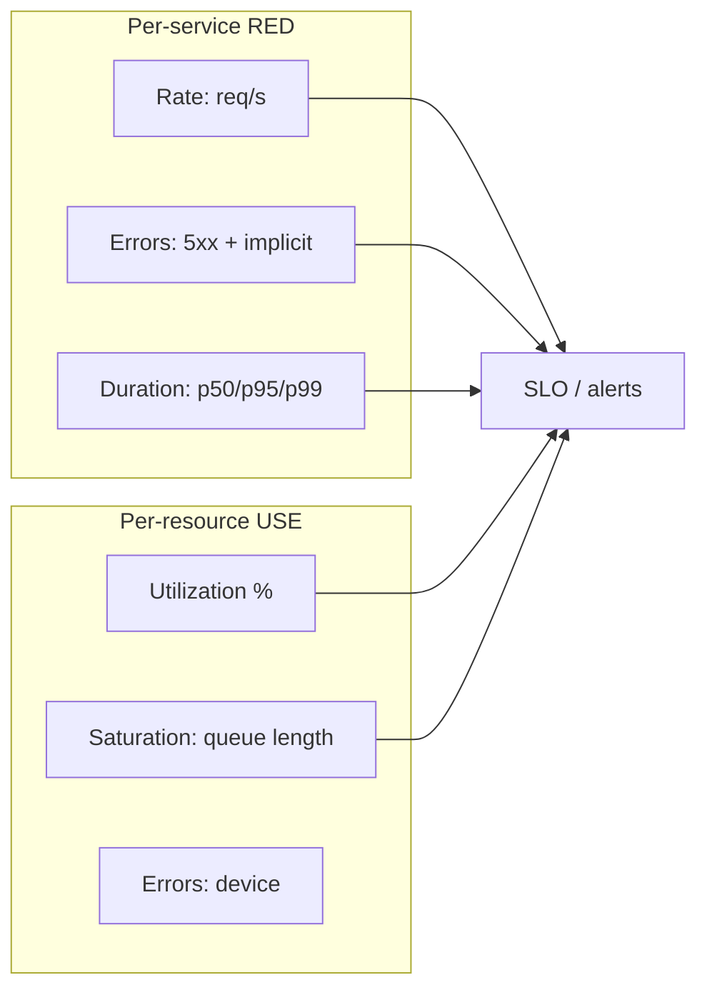

# Golden Signals (RED and USE)

## 1. One-Line Definition
The golden signals are the four metrics that tell you the health of any service — **latency, traffic, errors, saturation** — with RED (Rate, Errors, Duration) and USE (Utilization, Saturation, Errors) as their service-centric and resource-centric framings.

## 2. Why Do We Need It?
Hundreds of metrics exist (JVM heap, gc, thread pools, cache hits). Staring at all of them is monitoring noise; missing the right ones is blindness. The golden signals are the *minimum sufficient set* for alerting and dashboards — pick these four and you can detect almost any user-visible problem, then drill down into lower-level metrics to explain it. They turn "what should we monitor?" into a checklist.

## 3. Simple Intuition
A pilot's core instruments: how many aircraft are flying (traffic), how late they are (latency), how many are in trouble (errors), and how close to full the airport is (saturation). You don't start with fuel-mixture ratios — you start with the four things that answer "are we okay right now?" and only go deeper when one is off.

## 4. What Happens Without It?
Dashboards full of infrastructure noise: CPU fine, memory fine, but the *checkout* error rate is 30% and nobody has that panel. Alerts fire on disk I/O percentiles while users are blocked by a dependency timeout. Or, in the opposite failure, so many metrics are alerting that on-call becomes alert-blind ("alert fatigue") and the real signal drowns (see alerting).

## 5. Core Idea
- **The four golden signals (Google SRE):**
  1. **Latency** — time to serve, and critically **split success vs failure latency** (a 503 returning in 2ms is fast but broken — never average it into healthy latency).
  2. **Traffic** — demand on the system: requests/sec, transactions/sec, queues processed; per endpoint/tenant.
  3. **Errors** — rate of failed requests, by type: explicit (5xx) plus *implicit* (200 with wrong/failed business result — the silent ones).
  4. **Saturation** — how "full" the most constrained resource is: CPU/memory, queue depth, connection pool usage, thread pool, disk I/O. Saturation is the *leading* indicator: it predicts latency before it appears.
- **RED (service-centric):** for every service/microservice — **R**ate (traffic), **E**rrors, **D**uration (latency). A pragmatic dashboard per service.
- **USE (resource-centric):** for every infra resource (CPU, disk, NIC, memory, lock) — **U**tilization, **S**aturation (queue length), **E**rrors (device errors). Catches bottlenecks the service view might miss.
- **Percentiles, not averages:** latency must be p50/p95/p99/p99.9 — averages hide the tail (the tail is where users complain). Track the *distribution*.
- **Use them for what:** dashboards show them; SLOs (see sli-slo-sla) are built from latency/error/traffic SLIs; alerts page on their burn rates. They're the shared vocabulary between dev, SRE, and product.

## 6. Important Terminology

| Term | Simple Meaning |
|------|----------------|
| Latency | Time to serve, split by success/failure |
| Traffic | Demand (RPS, jobs/sec) |
| Errors | Failed request rate, explicit + implicit |
| Saturation | Constraint fullness (leading signal) |
| RED | Rate, Errors, Duration per service |
| USE | Utilization, Saturation, Errors per resource |
| p99 | 99th percentile latency |
| Implicit error | "Success" response with a bad business result |

## 7. Basic Architecture



## 8. Request or Data Flow
1. Instrument handler: increment rate counter, error counter (by status), and record duration in a histogram (percentile-ready).
2. Export to metrics store; dashboards render RED per endpoint and USE per resource.
3. SLOs computed from latency + errors + traffic SLIs; alerts on burn rate.
4. Saturation alerts fire *before* user-visible latency (queue depth climbing) → early action.

## 9. Practical Example
**API gateway dashboard (assumptions):**
- Rate: 12k rps (baseline 10k), peak-normal.
- Errors: 5xx 0.02%, BUT implicit `paymentTimeout:200` metric 4× normal — found only because they track business-level errors.
- Duration: p50 120ms (normal), p99 2.1s, p99.9 4s — tail problem in one shard.
- Saturation: DB connection pool 92%, queue depth rising. Because saturation led (pool high), the on-call scales the pool/reads before p99 hits the SLO limit.
- Every panel maps to an action (scale/gate/rollback), which is the real test of a good golden-signals dashboard.

## 10. Scaling
- **Metric cardinality:** guard labels (endpoint, status class, tenant tier) — never raw user IDs. Pre-aggregate by service.
- **Sampling vs accuracy:** histograms can be approximated (sketches) to save memory while preserving percentiles.
- **Per-tenant:** for SaaS, a few critical tenants may get tenant-level dashboards (bounded set) — not all.
- **Resource fan-out:** USE metrics × thousands of nodes = huge; roll up (cluster-level saturation) and keep raw only on-demand.

## 11. Reliability and Failure Scenarios

| Failure | Happens | Detection | Recovery | Trade-off |
|---------|---------|-----------|----------|-----------|
| Averaged latency | Tail hidden | Users complain; metrics green | Switch to percentiles | storage |
| Implicit errors missed | False "healthy" | Business KPIs dip | Track business error metric | instrumentation |
| Missing saturation | Latency surprises | Too late | Add saturation alerts | metric cost |
| Cardinality blow-up | Store breaks | Cardinality dashboards | Reduce labels | visibility |
| Alert on one signal only | Noise/blind spots | Fatigue or misses | Combine signals | tuning |

## 12. Consistency and Correctness
Latency and error definitions must be *consistent across services* (what counts as an error? server-side 5xx vs client cancellations). If each team defines them differently, the aggregate lies. And always measure **client-observed** as well as server-observed latency — the network and gateway time matter and often explain "our service is fine."

## 13. Performance
Metric recording overhead is tiny if done right (counters/histograms, async flush). High-cardinality histograms are the actual cost — bound buckets. Keep SLO computation out of the hot path (downstream query). 

## 14. Security
Metrics can leak traffic levels (business-sensitive) and tenant activity — internal access only. Error messages in metrics labels should not contain raw user input. Saturation data can reveal capacity (a reconnaissance goldmine) — restrict externally.

## 15. Trade-Offs

| Choice | Advantages | Disadvantages | When to Use |
|--------|------------|---------------|-------------|
| Four golden signals | Enough to detect nearly anything | Entity-level detail missing | Always — the baseline |
| RED per service | Simple, actionable | Resource blind | Microservices dashboards |
| USE per resource | Predicts bottlenecks | Not user-facing | Infra + capacity |
| Business-level errors | Catches silent fails | Extra instrumentation | Money/revenue flows |
| Percentiles | Truthful tail | More storage/compute | All latency reporting |

## 16. Common Mistakes
- Alerting on CPU alone (a resource metric) while user-facing errors go unwatched.
- Dashboards with averages; "latency is 120ms" while 5% of users wait 5s.
- Omitting implicit errors — 200 OK with "failed" business status passes as health.
- One metric per panel (no correlation view) — the whole point is the four together.
- SLOs built on averages → meaningless error budget.

## 17. HLD vs LLD Boundary
HLD: which signals per service, SLOs derived from them, dashboard/alerting philosophy, cardinality policy, business-error definitions. LLD: histogram buckets, counters, exporter queries, Grafana panels, alert expressions.

## 18. Interview Questions

### Beginner
- Name the four golden signals and one question each answers.
- RED vs USE — when do you use which?

### Intermediate
- Design the dashboard for a new service and the three alerts you'd create first.
- How do you catch an implicit error (200 with a failed business result)?

### Advanced
- Sketch SLOs for checkout using golden signals and design alerting that catches a 4× latency regression in 5 minutes without paging on normal daily peaks.
- A service shows normal RED but users complain. What's missing, and how do you fix the observability gap?

## 19. Interview Memory Summary

> [!abstract]- Interview Memory Summary

### Remember

- Four signals: latency (split success vs failure), traffic (demand), errors (explicit + implicit), saturation (how full).
- RED = service-centric view (Rate, Errors, Duration); USE = resource-centric view (Utilization, Saturation, Errors).
- Report percentiles, never means — averages hide the tail where users complain.
- Saturation is the leading indicator: it predicts latency before users feel it.
- The chain: signals → SLIs → SLOs → alerts; every panel should map to an action.

### 30-Second Explanation

Instrument rate/error/duration per service and utilization/saturation per resource; track business-level errors and p99 latencies; alert on saturation early and SLO burn rates, and keep every panel tied to an action.

### Interview Traps

- Dashboards on averages and server-side only — the tail and client-observed latency hold the real problems.
- Alerting on CPU (a resource metric) while user-facing errors go unwatched.
- Omitting implicit errors — 200 OK with a failed business result passes as health.
- Checking one signal per panel instead of the four together.
- SLOs built on means — meaningless error budgets.

### Key Trade-Off

The four signals trade detail for coverage: a cheap, minimal metric set catches nearly any user-visible problem, but you sacrifice entity-level and component-level diagnosis (that's tracing and lower-level metrics) and risk missing failures that only show in business state, not availability state.

## 20. Related Concepts

### Prerequisites

- [[latency-vs-throughput|Latency vs Throughput]]
- [[observability|Observability]]

### Commonly Used Together

- [[sli-slo-sla|SLI / SLO / SLA]]
- [[distributed-tracing|Distributed Tracing]]
- [[bottleneck-identification|Bottleneck Identification]]

### Advanced Concepts

- [[consumer-lag|Consumer Lag]] — saturation expressed as queue depth in stream pipelines
- [[capacity-estimation|Capacity Estimation]] — cluster-level saturation signals drive capacity planning

Related planned topics (not authored yet): alerting design, burn-rate alerting, dashboards-as-code.

## 21. References
Google SRE Book (monitoring distributed systems, golden signals), SRE Workbook (SLOs), Brendan Gregg's USE method. Verify current best practices pre-interview.

## 22. Active Recall

Test yourself before revealing each answer.

> [!question]- Name the four golden signals and one question each answers.
> Latency (how long to serve — split success vs failure); traffic (how much demand — requests/sec, jobs/sec); errors (how many failures — explicit 5xx plus implicit business failures); saturation (how full the most constrained resource is — the leading predictor of latency).

> [!question]- RED vs USE — when does each apply?
> RED (Rate, Errors, Duration) is the service/microservice view — user-facing health per service. USE (Utilization, Saturation, Errors) is the resource view (CPU, disk, NIC, memory, lock) — it catches bottlenecks the service view misses, like queue length climbing before any error appears.

> [!question]- Design the dashboard for a new service and the three alerts you'd create first.
> Dashboard: RED 4-pane — rate (RPS by endpoint), errors (5xx + business errors), duration (p50/p99/p99.9 histograms) — plus saturation (pool/queue depth) and client-observed latency. First alerts: (1) error-rate/SLO burn or 5xx spike, (2) p99 latency above SLO, (3) saturation crossing a threshold (the leading signal) — tuned as multi-window burn rates so routine peaks don't page.

> [!question]- How do you catch an implicit error — 200 OK with a failed business result?
> Instrument business-level outcomes as a first-class error signal (e.g., paymentTimeout:200, orderFailed counters) rather than only HTTP status. Alert when the business-error rate deviates from baseline (e.g., 4× normal), and define "what counts as an error" consistently across services so aggregates stay honest.

> [!question]- Percentiles vs averages: what does switching cost and buy?
> Averages hide the 5% of users waiting 5 seconds, so the tail is invisible and the dashboard falsely reassures. Percentiles (p50/p95/p99/p99.9) buy truthful tail visibility at the cost of more storage and compute (histograms) — a trade worth taking; sketches compress the storage.

> [!question]- Always all four signals, or selectively?
> All four is the baseline — RED gives actionability, USE adds prediction, together they catch both user-visible and impending problems. But the trade-offs: entity/topology-level detail is missing (that's tracing and lower-level metrics), and business-state failures need extra instrumentation beyond the four (implicit errors).

> [!question]- "Latency is fine" on the dashboard but users complain. What's missing?
> The wrong measurement: averages (tail hidden), server-observed only (client latency includes network and gateway time), or implicit errors counted as success (200 with a failed checkout). Fix with percentiles + client-observed latency + a business-error signal — and check whether saturation had been climbing all along.

> [!question]- The metric store blows up mid-incident. What likely happened and how do you recover?
> Cardinality explosion — a free-form or derived label (user IDs, unbounded endpoint names) multiplied the series count. Recovery: drop/reduce the violating labels, aggregate by service, use triage dashboards. Prevention: a bounded-label policy, uniqueness budgets, and pre-aggregation (see observability's cardinality rules in section 10).

> [!question]- "What should we monitor?" — sketch the answer.
> Start from user journeys: the four golden signals per service (latency split success/error), RED per service and USE per constraint, business-level errors for revenue flows, client-observed latency, percentiles not averages, and saturation as the leading signal. Then tie each signal to an SLI/SLO and an action (scale/gate/rollback).

> [!question]- Normal RED but users complain — what's the observability gap?
> The complaining users' journey is broken while the service looks fine: check client-observed vs server latency, trace the actual requests ([[distributed-tracing|Distributed Tracing]]), split by tenant/tier, look for implicit business errors, and probe saturation deeper in the stack. RED alone misses exactly these — the four signals must be decomposed along the request's path.

## 23. When Should I Use This?

### Use it when

- You're starting observability from scratch — this is the minimum viable signal set.
- You want alerts that reflect user-visible problems, not infrastructure noise.
- You're defining SLIs/SLOs — latency/error/traffic are their building blocks.
- You need a shared vocabulary across dev, SRE, and product.
- Saturation matters in your capacity plan (queues, pools, connections).

### Avoid it when

- You already need per-request causality as the primary tool — that's [[distributed-tracing|Distributed Tracing]].
- The failure mode is business-state (200 with wrong result) — you need extra instrumentation beyond the four.
- Metric cardinality can't be bounded — the labels break the store.
- Entity-level or topology-level detail is the goal — use lower-level metrics.
- The org can't act on panels — without alert-to-action mapping, dashboards are decoration.

### What problem does it solve?

Hundreds of available metrics create either monitoring noise or blind spots — you can't answer "are we okay right now?" The bottleneck is picking what to watch when something breaks invisibly in the path. Four signs — latency, traffic, errors, saturation (RED for services, USE for resources) — detect nearly any user-visible problem and feed SLOs, alerts, and capacity planning from one minimal set.

### What problem does it NOT solve?

Entity-level detail (which tenant/customer), cross-service causality (where the latency lives — that's tracing), root-cause explanation (logs), contract/budget decisions ([[sli-slo-sla|SLI / SLO / SLA]]), and business-state failures unless you explicitly instrument implicit business errors.

## 24. Decision Connections

Decisions that go together with golden signals:

- [[observability|Observability]] — the umbrella; golden signals are the metric pillar and alerting vocabulary.
- [[sli-slo-sla|SLI / SLO / SLA]] — the signals are the SLIs; SLOs and burn-rate alerts are built directly on them.
- [[distributed-tracing|Distributed Tracing]] — signals say WHAT (and which endpoint); traces say WHERE/WHY for the slow ones.
- [[bottleneck-identification|Bottleneck Identification]] — saturation is the leading indicator this capability feeds on.
- [[consumer-lag|Consumer Lag]] — saturation expressed as queue depth in streaming pipelines.
- [[capacity-estimation|Capacity Estimation]] — saturation roll-ups back capacity decisions.
- [[latency-vs-throughput|Latency vs Throughput]] — the definitions behind the latency and traffic signals.
- [[retry-and-timeout|Retry and Timeout]] — retry-induced error/latency signatures appear in the signals.

Decision tree:

```
What to monitor for a service?
    |
    +-- Service view (user-facing)       → RED: Rate, Errors, Duration (percentiles)
    +-- Resource view (predicting)       → USE: Utilization, Saturation, Errors
    +-- Success vs failure latency split → separate 2ms-error responses from healthy latency
    +-- Business correctness?             → implicit/business errors (200 + failed result)
    +-- Client-observed too?              → measure at the edge, not only server-side
    |
    +-- Feed into:
           → [[sli-slo-sla|SLI / SLO / SLA]] (targets + burn-rate alerts)
           → [[distributed-tracing|Distributed Tracing]] (drill into outliers)
           → [[capacity-estimation|Capacity Estimation]] (saturation trends)
```