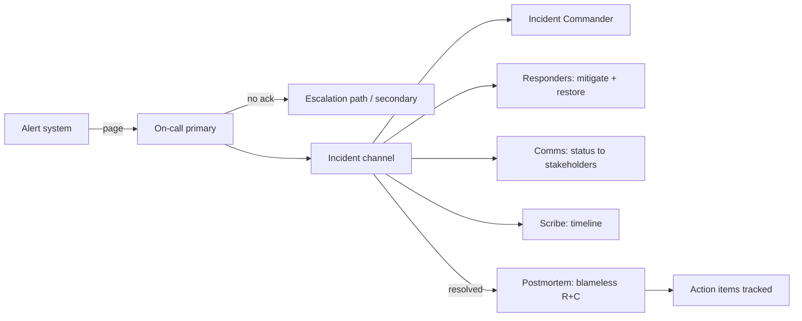

# Incident Management / On-Call / Postmortem

## 1. One-Line Definition
Incident management is the runbook-ized process for containing, communicating, and resolving a production disruption — with on-call rotations defining who responds, and blameless postmortems institutionalizing what we learn so the incident never repeats.

## 2. Why Do We Need It?
Production outages are inevitable; the distinction between a 15-minute bounce and a 6-hour catastrophe is process. Without defined roles and channels, responders diagnose on the fly, communication is guesswork, the wrong people are paged, and every incident ends with the same "we'll be more careful next time." Incident management turns chaos into a rehearsed drill: someone has authority, the status is visible, actions are recorded, and afterwards the system — not the humans — gets the autopsy.

## 3. Simple Intuition
A fire department: you don't want a crowd of well-meaning people spraying water everywhere. You want a chief who triages, a crew who attacks the fire, a communications person who keeps the neighborhood informed, and a report afterwards about why the fire started (and why the alarm was 4 minutes late). Same for incidents: roles, command, comms, and the retrospective.

## 4. What Happens Without It?
Chaos: five engineers each "fixing" the same DB migration, a pager going to the wrong team, customers tweeting before you've told your own support team, and a root cause that never gets found because the logs weren't preserved. Afterwards, blame tennis ("their deploy broke it") suppresses learning. Overnight, the same incident happens again with slightly different details — because nothing institutionalized the fix.

## 5. Core Idea
- **Severity ladder:** SEV1 (customer-facing, affecting many) to SEV4 (localized, low impact). Severity drives response time and who is awakened.
- **Roles:** Incident Commander (owns the response, makes calls), Deputy/Comms (status updates, stakeholders), Scribe (records timeline), responders (experts investigating/fixing). One brain, many hands.
- **On-call:** rotation with handoff, escalation path, timeouts; a primary + secondary so the pager always gets answered. Load-bearing fatigue is a real operational risk (see [[alerting|Alerting and Alert Fatigue]]).
- **Slack vs action:** the goal is customers first — mitigation over root-causing during the incident (rollback, feature-flag off, traffic shift). Root cause is explored after.
- **Communication:** internal status page, then external. Keep a living timeline: what changed, what was tried, what's the current hypothesis.
- **Postmortem:** blameless, factual timeline, root-cause analysis (5 whys), contributory factors, and action items with owners. The measure is: action items shipped, not apologies given.
- **Runbooks:** the documented "here's how we fixed it last time" — half of incident efficiency is a good runbook.
- **Link to SLOs:** incidents are budget burns ([[sli-slo-sla|SLI / SLO / SLA]]); postmortem decides whether to take deploy risk again.

## 6. Important Terminology

| Term | Simple Meaning |
|------|----------------|
| Incident | A production disruption needing coordinated response |
| Severity | SEV1–4: how many customers, how bad |
| Incident Commander | Owner of response, decisions, roles |
| On-call | The engineer/team who takes pages |
| Escalation | Bubbling up when unacknowledged |
| Runbook | Documented recovery steps for a known failure |
| Timeline | Ordered record of events and actions |
| Blameless postmortem | Retrospective without blame |
| Root cause | First cause in a causal chain (often multiple) |
| Follow-up action | Tracked fix with an owner and due date |

## 7. Basic Architecture



## 8. Request or Data Flow
1. An alert fires or a monitor flags customer impact; the on-call acknowledges within the deadline.
2. If impact is broad or response escalates past a threshold, an incident is declared and a channel is opened.
3. The Incident Commander assigns roles: mitigation team on the symptom, scribe recording the timeline, comms on status.
4. Mitigate first (rollback, feature flag, scale, route-around); then stabilize; declare resolution; preserve evidence.
5. Postmortem within days: timeline, causes, contributory factors, corrective actions with owners; track to completion.

## 9. Practical Example
**Payment gateway outage (assumptions):** p99 spikes, error budget burning at 10x.
- SEV2 declared; primary on-call acknowledges and opens incident channel; IC assigns payment team to mitigate, scribe to timeline.
- Mitigation in 40 minutes was a feature flag rolling back the new charge-batching code; customers saw degraded but working payments.
- Postmortem found the flag was never canaried to the payment cluster, the runbook didn't mention the flag, and the alert fired 11 minutes late (SLO window). Three tracked actions: canary gate, runbook update, alert review. Learnings shipped in two sprints.

## 10. Scaling
- **Global/24x7 orgs:** follow-the-sun rotations, per-region on-call, and a distributed incident command structure so time zones never form a bottleneck.
- **Many services:** anchor response to ownership (which team owns which signal) to avoid paging the wrong team during a crisis.
- **Runbook proliferation:** version them, test them (fire drills/chaos), and associate each with its alert.
- **Postmortem backlog:** cap the number of in-flight postmortems; prioritize SEV1/2 and repeat offenders, and track action completion as a metric.

## 11. Reliability and Failure Scenarios

| Failure | What Happens | Recovery | Trade-off |
|---------|--------------|----------|-----------|
| IC not appointed | Decision paralysis | Declare roles at incident open | process cost |
| Pager unacked | Response delay | Escalation path + secondary | staffing |
| Comms silent | Stakeholders guess | Status cadence | overhead |
| Evidence lost | No root cause | Preserve logs/traces pre-resolution | discipline |
| Postmortem blameless | Learning suppressed | Facilitation, "5 whys" | honesty |

## 12. Consistency and Correctness
The incident timeline must be a single source of truth recorded live (scribing beats memory). Status updates use fixed templates so states don't drift. Resolution vs root-cause must stay distinct — "resolved" is operational; the postmortem owns causality. Corrections/rollbacks during an incident must be logged even if they look embarrassing afterwards; that logging is what makes the postmortem real.

## 13. Performance
Speed metric = Mean Time To Detect (MTTD) and Mean Time To Restore (MTTR), with the caveat that trimming detection latency can mean noisier alerts (see [[alerting|Alerting and Alert Fatigue]]). A strong rule: make restore the fastest path first (rollback over fix), and design runbook steps so responders can act in seconds, not minutes.

## 14. Security
Security incidents need their own playbook (contain > preserve evidence > notify > investigate) and usually an isolated channel — you cannot page a security incident into the same public channel as a deploy emergency. Postmortems involving sensitive data must redact before sharing, and incident evidence (logs, traffic captures) must be retained under the same retention policy as audit data.

## 15. Trade-Offs

| Choice | Advantages | Disadvantages | When to Use |
|--------|------------|---------------|-------------|
| Rollback first | Fastest restore | Lose new features | Default on regression |
| Fix forward | Keep feature | Riskier, slower | Rollback expensive (migrations) |
| Single IC | Clear authority | Solo bottleneck | Small/medium incidents |
| Full incident team | Scales effort | Overhead for SEV4 | SEV1/2 only |
| Blameless postmortem | Honest learning | Needs facilitation | Every incident |

## 16. Common Mistakes
- No explicit IC → committee chaos.
- Paging is broken (wrong team, no escalation).
- Root-causing during the incident instead of mitigating.
- Postmortems that stop at "human error" without fixing the system that allowed it.
- Blame culture suppresses honest reporting; action items never get owners or due dates.
- Forgetting communication — support and customers hear about it from the news first.

## 17. HLD vs LLD Boundary
HLD: severity model, on-call geography/rotation, incident roles, comms channels, postmortem policy, action-item ownership. LLD: the concrete runbooks, escalation schedules, status-page templates, incident channel configurations, postmortem doc templates.

## 18. Interview Questions

### Beginner
- What does an incident commander do, and why is there only one?
- MTTR vs MTTD — what does each measure?

### Intermediate
- Design the on-call + incident process for a 24x7 payments platform.
- What goes into a good blameless postmortem, and how do you keep it blameless?

### Advanced
- Design a runbook-only incident scenario for a DB migration gone wrong and walk the mitigation-first sequence with feature flags.
- Why might MTTR look great while the same SEV2 repeats quarterly? What metric is missing?

## 19. Interview Memory Summary

> [!abstract]- Interview Memory Summary

### Remember

- Roles: IC owns; responders fix; scribe records; comms updates.
- Mitigate first (rollback/flag/scale), root-cause after.
- Severity ladder drives who is paged, how fast, and how many.
- On-call needs escalation paths and secondary coverage.
- Timeline must be recorded live — memory is unreliable in fires.
- Postmortems are blameless; corrective actions are the deliverable.
- Measure MTTD and MTTR; prune noise from the former.

### 30-Second Explanation

Declare incidents by severity, put one IC in charge with responder, scribe and comms roles, mitigate first via the fastest safe rollback path, keep a live timeline, then run a blameless postmortem that produces tracked corrective actions — supported by on-call rotations and escalation so the pager always lands on a person.

### Interview Traps

- Treating resolution as root-cause — they are different phases.
- "Human error" as the conclusion — the system that made it possible is the lesson.
- Mitigation is not a blame moment; rollback before fix-forward.
- Saying MTTR < hours while the same incident repeats — process, not heroics.

### Key Trade-Off

Incident management invests in process (roles, runbooks, comms, postmortems) to compress chaos-down: the more rehearsal and ownership you build, the faster restore and the more learning you bank — at the cost of process overhead that must be sized to the severity.

## 20. Related Concepts

### Prerequisites

- [[sli-slo-sla|SLI / SLO / SLA]]
- [[alerting|Alerting and Alert Fatigue]]

### Commonly Used Together

- [[observability|Observability]]
- [[logging|Structured / Centralized Logging]]
- [[rpo-rto|RPO and RTO]]
- [[disaster-recovery|Disaster Recovery]]

### Advanced Concepts

- [[circuit-breaker|Circuit Breaker]] (protects vs cascading incidents)
- [[retry-and-timeout|Retry and Timeout]] (a failure signature that causes escalations)

Related planned topics (not authored yet): chaos engineering, postmortem templates, incident-command CRTs.

## 21. References
Google SRE Workbook (incident response, postmortem culture), PagerDuty Incident Response documentation, USGS Manual of Scientific Investigation (blameless postmortem practice). Verify current guidance pre-interview.

## 22. Active Recall

Test yourself before revealing each answer.

> [!question]- Why does an IC exist, and why exactly one?
> Because committees flood decisions with consensus delays and diffuse accountability. One IC owns triage, decisions, role assignment, and comms — responders execute fast, the scribe keeps the timeline, and the IC can be overridden by no one during the incident (they're responsible for the response).

> [!question]- What goes into a blameless postmortem, and how do you keep it blameless?
> Timeline of facts, root-cause analysis (5 whys), contributory factors (why did the process allow it), and corrective actions with owners. Keep it blameless by fixing the system, not the person: focus on automation gaps, unwritten runbooks, and weak controls that made human error possible, and have a facilitator whose job is separating "who" from "what."

> [!question]- Design the on-call + incident process for a 24x7 payments platform.
> Follow-the-sun rotations with primary + secondary (escalation path), per-service ownership tied to alert routing, a severity ladder SEV1-4, pre-assigned IC/rc/rr roles switched in at incident-open, mitigation-first procedure (rollback and flag off), live scribed timeline, external status cadence, and mandatory blameless postmortems with tracked actions for anything SEV2 or above.

> [!question]- MTTR is excellent but the same SEV2 repeats quarterly. What metric is missing?
> The repeat rate: MTTR measures restore speed, not learning. Track postmortem action completion rate, incident types, and recurrence; if the same signature repeats, your recovery speed is hiding a missing proactive control — the rectification loop broke even though the pager is fine.

> [!question]- A DB migration incident: you're on-call. Walk mitigation-first.
> Acknowledge, confirm SEV/customer impact, open incident channel, assign IC. Mitigate first: attempt rollback (if reversible), else feature-flag off the new code path, else scale/limit DB impact; keep the scribe updating the timeline. Only after restore do you investigate root cause; then postmortem with corrective actions (gated migrations, pre-flight checks).

> [!question]- 3am page, but the pager doesn't find an on-call engineer. What went wrong, and how do you fix it?
> The escalation path failed. Fix: always schedule a primary + secondary, enforce acknowledgement deadlines (escalate after N minutes), keep rotations with handoff across time zones, alert on missed acks ("dead-man" checks), and drill escalations so the chain is tested, not theoretical.

## 23. When Should I Use This?

### Use it when

- Production is customer-facing and a bad deploy or dependency can take it down.
- Multiple teams/services are involved and response must be coordinated.
- You need to comply with reliability requirements (SLO-backed, contractual).
- Failure keeps repeating and nothing is being learned.

### Avoid it when

- A single engineer can always fix a bug solo with negligible impact (still keep a runbook).
- There is no production customer to protect and failures are acceptable (prototypes, experiments).
- The team won't staff rotations or attend postmortems — process without participation is theater.

### What problem does it solve?

Outages are chaotic and lessons evaporate: no roles, no comms, no preserved evidence, and blame that suppresses the truth. Incident management gives structure (severity, command, timeline, communication), on-call gives answerability, and the blameless postmortem converts incidents into a hardening program so the fleet gets better with every fire.

### What problem does it NOT solve?

It doesn't prevent incidents (that's ownership, testing, [[circuit-breaker|Circuit Breaker]]s, good code) — it contains them; it doesn't fix intra-incident diagnosis (that's [[observability|Observability]] — logs/traces); and a postmortem cannot fix a culture that never ships the corrective actions.

## 24. Decision Connections

Decisions that go together with incident management:

- [[alerting|Alerting and Alert Fatigue]] — the alert is the incident's trigger; severity/routing feed the runbook.
- [[sli-slo-sla|SLI / SLO / SLA]] — incidents are budget burns; SEV categories map to how fast the budget is being eaten.
- [[observability|Observability]] — logs/traces/metrics are the evidence for mitigation and root-cause.
- [[logging|Structured / Centralized Logging]] — the timeline reconstruction and postmortem facts come from correlated logs.
- [[rpo-rto|RPO and RTO]] — for data-loss incidents, recovery targets define what "resolution" means operationally.
- [[disaster-recovery|Disaster Recovery]] — the scripted, high-severity end of incident management (region failures).
- [[circuit-breaker|Circuit Breaker]] / [[retry-and-timeout|Retry and Timeout]] — resilience artifacts that both prevent and shape incidents.

Decision tree:

```
Outage happens (or is paged)
    |
    +-- Severity?  → SEV1-2 : declare incident, full roles, wake relevant teams
    |                 SEV3-4 : responder + runbook, ticket/document
    |
    +-- Who responds?  → [[alerting|Alerting and Alert Fatigue]] routing → on-call owner
    |                     +-- unacked → escalation to secondary
    |
    +-- How to restore fastest?
    |      +-- Rollback possible      → rollback first
    |      +-- Flag/canary off        → toggle off
    |      +-- Scale / route-around   → capacity or [[disaster-recovery|Disaster Recovery]]
    |
    +-- After restore?   → preserve evidence → [[observability|Observability]] analysis
    |                     → blameless postmortem → tracked corrective actions
    |
    +-- Learning lands back into the system via [[sli-slo-sla|SLI / SLO / SLA]]
           → [[incident-management|Incident Management / On-Call / Postmortem]] loop closes
```