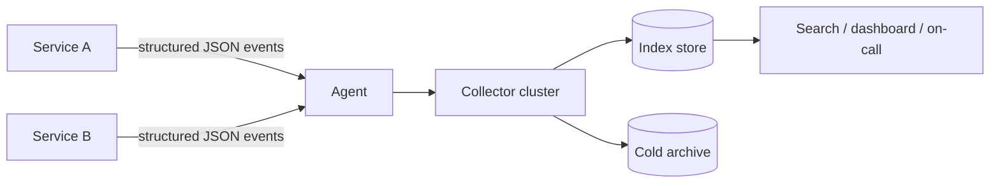

# Structured / Centralized Logging

## 1. One-Line Definition
Structured / centralized logging is the practice of emitting machine-parseable log events with consistent fields (timestamp, level, service, trace_id) and aggregating them into one searchable store, so you can reliably reconstruct "what happened" across a fleet instead of grepping per-host text files.

## 2. Why Do We Need It?
Logs answer the observability question "what happened" — the narrative that gives context to metrics and traces (see [[observability|Observability]]). A system has hundreds of hosts, and a single request touches many services, so per-host plaintext files cannot be searched, correlated, filtered, or monitored in any systematic way. Structured + centralized logging turns raw prose into data: format is checked at write time, fields become filterable, and one store is queryable in seconds by anyone on call.

## 3. Simple Intuition
A flight recorder: the plane records every event as structured facts — altitude, throttle, heading, time — on one tamper-proof tape that investigators can replay. Now multiply that: instead of 500 pilots keeping handwritten notes in their own notebooks (per-host log files), every event goes to one searchable recorder vault where you type a query and instantly see the whole fleet's story for one flight (one trace_id).

## 4. What Happens Without It?
Debugging becomes archaeology: SSH into ten servers, tail -f, regex over ragged prose, then blame each other. Unstructured logs can't be filtered by field, grouped by tenant, or joined to a trace; alerting on them is unreliable; secrets and PII embed themselves in free text where no redaction can systematically find them; and storage costs explode storing junk you can't even query. Half a day per incident while users wait.

## 5. Core Idea
- **Structured:** each line is a typed record (usually JSON) with agreed fields: timestamp, level, service, host/pod, trace_id / span_id, event name, plus domain fields. Machine-parseable by construction — a missing field is a bug, not a sentence.
- **Levels and sampling:** debug / info / warn / error with runtime-configurable minimums. Debug volume is sampled or disabled in prod, else cost grows with QPS.
- **Centralization:** a pipeline — in-process logger → local agent → cluster of collectors → index + search store (ELK, Loki, Datadog, CloudWatch). Everything searchable in one place with one query language.
- **Correlation is the glue:** every event carries the request's trace_id / span_id (see [[distributed-tracing|Distributed Tracing]]). That is what lets you reassemble one request's full story from many services on many hosts.
- **Index policy matters:** index the fields you filter on (service, level, trace_id, endpoint), keep the payload in cheap raw/cold storage, and use full-text search only on the message field. Index-everything is the classic cost blow-up.
- **Retention tiers:** hot (7 days, fully searchable) → warm (90 days, partially indexed) → cold archive (object storage for compliance). Sizes are designed in, not discovered after the bill.
- **Logs are not metrics:** log volume is bursty and lossy; keep alerting and SLOs on metrics (see [[golden-signals|Golden Signals]] and [[sli-slo-sla|SLI / SLO / SLA]]) and use logs for the diagnosis.

## 6. Important Terminology

| Term | Simple Meaning |
|------|----------------|
| Structured log | Machine-parseable event (usually JSON) with typed fields |
| Plaintext log | Free-form prose, hard to filter or join |
| Level | Severity: debug / info / warn / error |
| Agent | Local process shipping host logs to the collector |
| Collector | Buffer/sample/forward stage of the pipeline |
| Index | Inverted structure allowing fast field search |
| Retention | How long logs are kept and where |
| Correlation ID | trace_id / span_id linking events of one request |
| Sampling | Dropping a fraction of events to control volume |
| Ingestion rate | Events/sec; the number that drives pipeline sizing |

## 7. Basic Architecture



## 8. Request or Data Flow
1. A request enters with a trace_id; each service appends that id to every log event it emits.
2. The local agent batches events, applies sampling/redaction rules, and ships to the collector.
3. The collector buffers, compresses, and forwards; the index store ingests hot data asynchronously.
4. On-call searches by trace_id, timeline filters by level/service/endpoint, and rebuilds the request's story field by field.

## 9. Practical Example
**Checkout latency spike (assumptions):** 10k RPS; average structured event ~300 bytes.
- A user's failed checkout traced by filtering `trace_id` — 14 linked events across gateway, auth, cart, payment.
- The payment span log shows `charge.failed case=declined reason=insufficient_funds` while the metric showed only a p99 spike. Logs identified the reason; metrics identified the blast radius.
- Daily volume math: 10k RPS × 300B = ~3 MB/s ∼ 260 GB/day before compression; tiered retention keeps hot at 7 days searchable and archives the rest — the sizing decision, not an accident.

## 10. Scaling
- **Volume is the enemy:** options are sampling (log N% of info), truncation, and aggregation. Errors are never sampled.
- **Pipeline is infrastructure:** agents and collectors need capacity, buffering, and backpressure; a dropped log during an incident is embarrassing precisely when you need it.
- **Index sharding:** partition logs by day; put hot days on fast storage, older to warm/cold. See the partitioning idea in [[partitioning-vs-sharding|Partitioning vs Sharding]] applied to time-series data.
- **Cardinality:** multi-tenant systems add tenant_id to every line; keep label dimensions bounded (even in logs) to keep aggregation queries fast.

## 11. Reliability and Failure Scenarios

| Failure | What Happens | Detection | Recovery | Trade-off |
|---------|--------------|-----------|----------|-----------|
| Agent down | Per-host logs lost | Heartbeat | Restart, buffer locally | disk usage |
| Collector down | Ingestion stalls | Queue depth | Failover collectors | complexity |
| Store full / slow | Search degrades or loses writes | Ingestion lag | Drop sampled info, scale store | coverage loss |
| Volume spike | Bill and latency blow up | Rate alerts | Aggressive sampling, truncation | lost fidelity |
| Clock skew | Wrong ordering between hosts | NTP checks | NTP sync everywhere | infra hygiene |

## 12. Consistency and Correctness
Logs are eventually consistent and lossy by design — never a source of truth for correctness or a reliable alert input (alert on metrics, use [[sli-slo-sla|SLI / SLO / SLA]] burn rates). Ordering across hosts is approximate; use the trace_id + client timestamp to reconstruct a request chronology, not host wall-clock order. Keep timestamps UTC + high resolution. Where a log line is used for billing/audit, make it exactly-once (see [[exactly-once-effect|Exactly-Once Effect]]).

## 13. Performance
Structured logging costs a few µs per event when done synchronously; amortize with a bulk/batched API to a background queue. Never serialize the request body or full stack traces by default. Keep DEBUG off hot paths. The dominant cost is ingestion + storage at scale, which is why sampling and retention tiers are designed in, not tuned under pressure.

## 14. Security
Logs are data too: redact PII, tokens, credit-card numbers at the writer (see [[data-masking|Data Masking and Privacy]]), encrypt at rest and in transit, enforce least-privilege read access, and define retention to limit blast radius. Never log passwords or raw secrets even "masked" — masking on a moving target is how secrets leak. Compliance often requires log integrity (append-only, tamper-evident) for audit trails.

## 15. Trade-Offs

| Choice | Advantages | Disadvantages | When to Use |
|--------|------------|---------------|-------------|
| Structured JSON | Filter/join/alert-ready | More bytes, schema discipline | Always |
| Plaintext | Tiny, cheap to write | Unsearchable, no fields | Throwaway debugging only |
| Centralized | Query the whole fleet | Pipeline cost, dependency | Multi-service systems |
| Sample info | Bounded cost | Missing rare events | High volume, low heat |
| Index everything | Fast any-field search | Expensive | Small systems |
| Tiered retention | Cheap compliance | Cold queries slow | Any real system |

## 16. Common Mistakes
- Logging unstructured prose (cannot filter or join).
- No correlation/trace_id → per-host hunting.
- No sampling in high-volume info paths.
- Indexing every field (bill explodes) or none (search useless).
- Letting secrets/PII into logs and calling it "debugging."
- Treating logs as the alert source instead of metrics.
- No retention — endless growth, and a compliance question mark.

## 17. HLD vs LLD Boundary
HLD: which events are logged at each service, field contract/schema, sampling policy, retention tiers, redaction rules, pipeline topology (agent → collector → store), who may search. LLD: logger configuration in each service, JSON serialization code, field names, sample rates, query syntax, deployment of agents.

## 18. Interview Questions

### Beginner
- Why can't we just tail per-host log files?
- What makes a log "structured," and why does it matter?

### Intermediate
- Design the logging pipeline for 100k RPS with cost control.
- A request fails across five services. How do logs help you find why?

### Advanced
- Your logging store is the first thing to melt during the biggest incident of the year. Design the defense in depth so logs survive.
- Design logging for a multi-tenant SaaS while guaranteeing tenant privacy (PII redaction, isolation, retention).

## 19. Interview Memory Summary

> [!abstract]- Interview Memory Summary

### Remember

- Logs answer "what happened"; structure turns prose into filterable data.
- Every event carries trace_id / span_id → one request's story reassembles from many hosts.
- Pipeline: service → agent → collector → index → search; sizing is a first-class decision.
- Sampling protects info-level volume but never errors.
- Index what you filter; tier retention (hot/warm/cold).
- Alert on metrics + SLO burn, not on logs.
- Redact PII/secrets at the writer, not after the fact.

### 30-Second Explanation

Emit typed JSON events with a shared field contract (timestamp, level, service, trace_id, event), ship them through agents and collectors to one searchable store, sample the low-value paths, index only the fields you filter, and tier retention — then any on-call engineer can rebuild a single request's story in seconds instead of tailing fifty hosts.

### Interview Traps

- Claiming logs are for alerting — alert on metrics, use logs to diagnose.
- Forgetting sampling, then quoting a storage bill and calling it "scale."
- No correlation IDs — logs that can't join are barely better than prose.
- Treating structured as "JSON so it's fine" without a field contract.

### Key Trade-Off

Structured + centralized logging buys fleet-wide search, correlation, and reliable diagnosis at the cost of ingestion volume, index spend, steady pipeline operations, and strict discipline about schema and secrets — the "small logging tax" that pays off the moment something breaks.

## 20. Related Concepts

### Prerequisites

- [[observability|Observability]]
- [[distributed-tracing|Distributed Tracing]]

### Commonly Used Together

- [[golden-signals|Golden Signals]]
- [[sli-slo-sla|SLI / SLO / SLA]]
- [[alerting|Alerting and Alert Fatigue]]

### Alternatives

- [[observability|Observability]] (metrics as the reliable signal; logs for narrative)

### Advanced Concepts

- [[incident-management|Incident Management / On-Call / Postmortem]]
- [[data-masking|Data Masking and Privacy]]

Related planned topics (not authored yet): log-sampling strategies, schema registry for log fields.

## 21. References
Google SRE Book (monitoring/logging chapter), Twelve-Factor App (logs as event streams), OWASP Logging Cheat Sheet, OpenTelemetry logging documentation. Verify field conventions against the log store used pre-interview.

## 22. Active Recall

Test yourself before revealing each answer.

> [!question]- Why can't we just tail per-host log files in production?
> Because the fleet has hundreds of hosts and one request spans many services — a failure story is scattered across hundreds of files, in inconsistent formats, with no common filter, no join across hosts, no central search, and no uniform redaction or retention. Centralized, structured logs make that story queryable in one place.

> [!question]- What fields must every log event carry, and why is that the single most important rule?
> Timestamp (UTC), level, service, host/pod, and the request's trace_id / span_id. The trace_id is the glue: it lets you reassemble the full path of one request across all the services and hosts it touched.

> [!question]- Design logging for 100k RPS without bankrupting the team. What are your three levers?
> 1) Sampling — keep 100% of errors, sample info/debug to a few percent. 2) Index policy — index only fields you actually filter on (service, level, trace_id, endpoint). 3) Retention tiers — 7 days hot and fully searchable, warm partial index for ~90 days, cold archive for compliance.

> [!question]- Why is alerting on logs a bad idea, and what should you alert on instead?
> Log volume is bursty, lossy, and format-dependent — a logging pipeline hiccup can fire or silence alerts for reasons unrelated to user health. Alert on metrics and SLO burn rates (golden signals), where the measurement is stable, and use logs for the diagnosis.

> [!question]- A store full of logs melts during the biggest incident of the year. What protects you?
> Degradation hierarchy: drop sampled info first, keep errors, spill writes to warm/cold; agents buffering to disk buys time; a second collector path provides failover; and preforked alerting on metrics (not logs) keeps the pager accurate while search is degraded.

> [!question]- "We just log JSON, we're fine." Why is that insufficient?
> JSON without a shared field contract is still unsearchable chaos: one service calls it `userId`, another `user_id`, a third `uid`. True structured logging requires an agreed schema per event type, consistent naming, sampled levels, a correlation ID, and an index policy — not merely a serialization format.

> [!question]- Behavioral: a p99 latency spike appears in metrics. Walk how logs constrain the cause.
> Pull the slowest trace_ids from the traces store; filter each one's structured logs by level and service; the payment span reveals `charge.failed reason=insufficient_funds` or a timeout on a downstream dependency; then quantify how many requests hit that error path. Metrics gave the where, logs the why.

## 23. When Should I Use This?

### Use it when

- The system is multi-service or multi-host and debugging crosses boxes.
- You need to rebuild a single request's story (troubleshooting, support, audits).
- You want tenant/metadata filtering across the whole fleet.
- You have any compliance or forensics requirement for events.

### Avoid it when

- A single process where a debugger or quick println suffices — full pipeline is overkill (but real systems still get logs).
- You refuse to agree on a common field schema — unstructured + central is just a big pile of noise with a bill.
- You can't staff the pipeline as infrastructure (buffering, sampling, retention as a built-in).

### What problem does it solve?

The story of "what happened" is scattered across hosts, formats, and teams, and per-host text is unsearchable, uncorrelated, and unruly. Centralized, structured logs make every event queryable, linkable to one request, redactable, and budgetable.

### What problem does it NOT solve?

It does not tell you the system is healthy (that's metrics/golden signals), does not tell you the request's path or latency breakdown (traces), does not trigger reliable alerts, does not fix a broken service, and cannot be fully trusted for correctness or exactly-once semantics unless the pipeline is built for it.

## 24. Decision Connections

Decisions that go together with structured/centralized logging:

- [[observability|Observability]] — the umbrella; logging is the "what happened" pillar alongside metrics and traces.
- [[distributed-tracing|Distributed Tracing]] — the trace_id contract on every log line is what makes logs joinable into a request story.
- [[golden-signals|Golden Signals]] — alert on these metrics; logs supply the why behind the signal.
- [[sli-slo-sla|SLI / SLO / SLA]] — SLO burn happens on metrics; logs give the incident context that decides priorities.
- [[alerting|Alerting and Alert Fatigue]] — well-structured logs make the alert's follow-on investigation minutes, not hours.
- [[data-masking|Data Masking and Privacy]] — what you may put in a log field is a privacy decision made before writing it.
- [[incident-management|Incident Management / On-Call / Postmortem]] — logs are the first artifact read during an incident's resolution.

Decision tree:

```
Need to answer "what happened" in the fleet?
    |
    +-- Multi-service / multi-host?
    |      → [[logging|Structured / Centralized Logging]] (centralized store)
    |
    +-- Machine-parseable & filterable?
    |      → structured JSON with field contract (not prose)
    |
    +-- Need to rebuild one request's story?
    |      → trace_id / span_id on every event ([[distributed-tracing|Distributed Tracing]])
    |
    +-- Volume is the worry?
    |      +-- Errors only?        → keep 100%
    |      +-- Info/debug paths?   → sample, truncate, aggregate
    |
    +-- Storage budget?
    |      → index only filter fields; tiered retention hot/warm/cold
    |
    +-- Alerting question?
           → use [[golden-signals|Golden Signals]] metrics + [[sli-slo-sla|SLI / SLO / SLA]], not raw logs
```