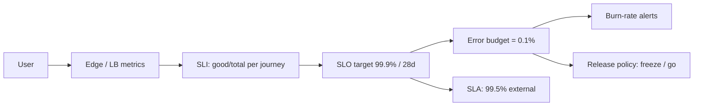

# SLI, SLO, SLA, and Error Budgets

## 1. One-Line Definition
An **SLI** is a measured service indicator (e.g., % of requests < 300ms), an **SLO** is the internal target for it (e.g., 99.9% per month), an **SLA** is the external contract with consequences (credits/penalties), and the **error budget** is the allowed miss (100% − SLO) that turns reliability into a manageable, shared engineering budget.

## 2. Why Do We Need It?
"We want 100% uptime" is expensive and impossible; "be reliable" is unmeasurable. Without explicit targets, every team optimizes something different: product wants features, ops wants stability, and reliability debates are opinion wars. SLOs translate user happiness into a number, and error budgets make the trade-off explicit: spend budget on shipping, or slow down and stabilize. It converts reliability from an argument into arithmetic.

## 3. Simple Intuition
A household budget for "late fees": you allow yourself up to 4 late-payment incidents a year (the error budget). Otherwise you never miss a payment. If you've used 3 by June, you tighten up; if you've used 0, you can take a slightly riskier month (travel, new expense). And if you have a contract with a bank that charges you *money* for a late payment, that's the SLA — your private budget (SLO) should be stricter than the bank's charge (SLA) so you're never surprised.

## 4. What Happens Without It?
Reliability becomes perpetual firefighting: outages are "bad luck" not "budget spent." One team ships aggressively (fueling outages) while ops carries the pager; nobody can say whether to freeze releases. Or the reverse: perfectionism blocks every launch for a 0.001% gain no user notices. Without SLI/SLO, alerts can't be tuned (what threshold?) and reliability can't be prioritized against features. Chaos on both sides.

## 5. Core Idea
- **SLI (the measurement):** a ratio of good events to total events, at a user-relevant boundary.
  - Availability SLI: `successful requests / valid requests` (valid excludes user-caused 400s).
  - Latency SLI: `requests under threshold / all requests` (e.g., <300ms *served*).
  - Quality/saturation SLIs: freshness, throughput, error-free transactions.
  - Measure at the **user's edge** (LB/edge), over a rolling window (28d is common).
- **SLO (the target):** e.g., 99.9% availability, 99% of requests < 300ms, measured over 28 days. Set from user expectations + what the system can plausibly achieve; *slightly stricter than the SLA*.
- **SLA (the contract):** external, with financial/legal teeth — "99.9% monthly or service credits." The SLA is usually looser than the SLO because you want a safety margin before you owe money.
- **Error budget = 100% − SLO.** 99.9% → 0.1% budget = ~43 minutes/month (for availability). The budget is a *shared currency*:
  - Burned fast (>some rate) → freeze risky releases, focus reliability.
  - Under budget → you may take calculated risks (deploy more).
  - **Burn rate alerts** page when you'll exhaust the budget too early (e.g., 2% of budget in 1h = fast burn), not on every blip.
- **The math of nines:** 99.9% = 43m downtime/month; 99.99% = 4.3m; 99.999% = 26s. Each extra nine costs ~10×. Choose per user impact, not by reflex.
- **Alignment:** SLOs must be *user-facing* and *per journey* (checkout, login), not per component — a user doesn't care which microservice failed.

## 6. Important Terminology

| Term | Simple Meaning |
|------|----------------|
| SLI | Measured indicator (good/total) |
| SLO | Internal target for an SLI |
| SLA | External contract with penalties |
| Error budget | 100% − SLO; allowed failure |
| Burn rate | Speed of budget consumption |
| Good event | Request meeting the SLI criterion |
| Valid event | Request that should count (exclude client errors) |
| Rolling window | e.g., 28-day measurement period |
| Nines | Availability table (99.9% = 43 min/month) |

## 7. Basic Architecture



## 8. Request or Data Flow
1. Define user journeys (login, search, checkout) and their SLIs at the edge.
2. Set SLOs (say 99.9% availability, 99% < 300ms) with a 28-day window.
3. Instrument edge/middleware to count good/valid/total; export to a monitoring/SLO system.
4. Compute error budget consumption + burn rates; dashboards show budget remaining.
5. Burn-rate alerts page (fast burn) and inform release decisions (budget policy).

## 9. Practical Example
**Checkout journey (assumptions):**
- SLI availability: HTTP 2xx–3xx (and non-user-caused) / total at edge; SLI latency: <800ms.
- SLO: 99.95% available, 99% <800ms, 28-day window; SLA: 99.9% with credits.
- Budget: 0.05% ≈ 20 minutes per 28 days. A bad deploy burns 12 minutes in one hour → burn-rate alert fires → release freeze until fixed. A month ends with 4 minutes burned → teams ship boldly.
- Note SLA (99.9) is *looser* than SLO (99.95) → the company almost never pays credits, by design.

## 10. Scaling
- **Per journey × per region:** multi-region products define SLOs per region; failures localized to one region burn that region's budget while global stays healthy — gives precision.
- **Number of SLOs:** too many = overhead and alert noise; keep to the handful of user journeys (5–10).
- **Aggregation:** some SLIs aggregate (availability), some are per-endpoint; document which, and keep computation automated (not a spreadsheet).
- **Error-budget policy scales culturally:** the freeze/go rule must be automatic and agreed; otherwise budgets are decoration.

## 11. Reliability and Failure Scenarios

| Failure | Happens | Detection | Recovery | Trade-off |
|---------|---------|-----------|----------|-----------|
| Budget exhausted | Freeze releases | Burn dashboard | Stabilize, then resume | delivery speed |
| SLO too loose | Users unhappy, alerts silent | User complaints | Tighten SLO | cost |
| SLO too tight | Constant freeze / alert noise | Alert storms | Recalibrate to user pain | engineering morale |
| Wrong SLI | Measures wrong thing | Business metrics diverge | Redefine SLI | time |
| SLA stricter than SLO | Credits owed | Contract breaches | Never set SLA>SLO | margin |
| Missing budget policy | Budget ignored | — | Agreed freeze/go rules | culture |

## 12. Consistency and Correctness
SLI definitions must be stable, automated, and identical wherever used; changing an SLI mid-window invalidates comparisons. Compute availability at the **edge** and exclude user-caused errors (400/401) from the "valid" denominator, or your teams get punished for client bugs. Budgets are about *user-visible reliability*, not internal resource health — map every SLI to a real user journey.

## 13. Performance
SLO systems cost a monitoring query + storage — trivial vs the architectural cost the SLO *implies*. The real cost is the engineering it forces (extra nines = more redundancy). Use the nines table to make cost/benefit visible: going 99.9→99.99 might cost 10× for a feature users barely notice. Keep measurement windows rolling and cheap.

## 14. Security
Brownout/security incidents burn error budget too — plan for them; security controls (auth, encryption) are part of the user-visible journey (login SLO). Don't put sensitive tenant data in SLO dashboards; availability numbers are business-sensitive.

## 15. Trade-Offs

| Choice | Advantages | Disadvantages | When to Use |
|--------|------------|---------------|-------------|
| No SLO | Free, flexible | Firefighting, no priorities | Very early prototypes |
| Loose SLO | Easy, cheap | Users suffer silently | Internal tools |
| Tight SLO | Great UX | 10× cost, freeze culture | Money-critical journeys |
| Few SLOs (journeys) | Actionable, aligned | Some paths unmeasured | Most products |
| Many per-component SLOs | Granular | Noise, misalignment | Large orgs with tooling |

## 16. Common Mistakes
- Setting SLO on *components* (DB, service) rather than *user journeys*; users don't care about your topology.
- Averaging a month into "99.9%" while burning in one day (need burn-rate windows).
- SLA stricter than SLO → guaranteed credits; set the internal goal tighter.
- Counting user-caused 4xx as failures → teams optimize the wrong thing.
- Declaring an SLO and never tying it to a release decision — the budget must *change behavior*, or it's theater.

## 17. HLD vs LLD Boundary
HLD: user journeys + SLIs, SLO targets + windows, error-budget policy (freeze/go), SLA margin, burn-rate alert design, per-region strategy. LLD: SLI instrumentation queries, SLO system config, burn-rate expressions, dashboards, release-gate integration.

## 18. Interview Questions

### Beginner
- SLI vs SLO vs SLA — one line each.
- Why is an SLA usually looser than the SLO?

### Intermediate
- Define an availability and a latency SLO for checkout, with the SLI expression and the error budget in minutes.
- Design burn-rate alerts so ordinary daily peaks don't page, but a bad deploy does.

### Advanced
- Your team burned 60% of the 28-day error budget in one day. Walk the incident→policy process (what freezes, how you re-plan, when you resume) and design the burn-rate thresholds that surfaced it fast.
- Argue for/against doubling availability from 99.9 to 99.99 on a checkout with revenue math — include marketing, SLA penalty, and the 10× cost reality.

## 19. Interview Memory Summary

> [!abstract]- Interview Memory Summary

### Remember

- SLI = measured good/total at the user's edge; SLO = internal target; SLA = external contract with penalties.
- Error budget = 100% − SLO — the allowed failure, spent like money through release policy.
- Burn-rate alerts page on exhausting the budget too early, not on every blip.
- SLOs live on user journeys, not components; keep to the handful of journeys that matter.
- The SLA should be looser than the SLO to leave a safety margin; each extra nine costs ~10×.
- Nines math: 99.9% ≈ 43 min/month; 99.99% ≈ 4.3 min; 99.999% ≈ 26s.

### 30-Second Explanation

Measure user-facing good-events, set internal targets with a rolling window, keep a slightly looser external SLA, and spend the error budget deliberately — fast burn freezes releases, slow burn is normal, and every alert fires on burn rate.

### Interview Traps

- Reporting availability averages and calling it an SLO.
- Setting SLO ≤ SLA — guaranteed credits.
- Setting SLOs on components instead of user journeys.
- Counting user-caused 4xx as failures in the SLI.
- Declaring an SLO never tied to a release decision — the budget is then theater.

### Key Trade-Off

SLOs convert reliability from an argument into a budget: the tighter the target (higher nines) the more redundancy and release discipline it costs, so you set it on the user journeys that matter, accept the allowed error, and trade shipping speed against the burn.

## 20. Related Concepts

### Prerequisites

- [[reliability|Reliability]]
- [[observability|Observability]]

### Commonly Used Together

- [[golden-signals|Golden Signals]]
- [[distributed-tracing|Distributed Tracing]]
- [[retry-and-timeout|Retry and Timeout]]

### Alternatives

- [[rpo-rto|RPO and RTO]] — the disaster-recovery contract; complementary, on a different clock

### Advanced Concepts

- [[circuit-breaker|Circuit Breaker]] — the availability behavior that holds an SLO under dependency failure
- [[rate-limiter|Rate Limiter]] — admission control that protects the user-facing SLO under over-demand

Related planned topics (not authored yet): alerting design, burn-rate alerting, multi-region SLOs, release-gate automation.

## 21. References
Google SRE Workbook (SLO engineering, burn rates), Google SRE Book (embracing risk), service-level objective examples from cloud vendors. Verify current best practices for interviews.

## 22. Active Recall

Test yourself before revealing each answer.

> [!question]- SLI vs SLO vs SLA — one line each.
> SLI = the measured ratio of good events to total at the user edge; SLO = the internal target for an SLI over a rolling window (e.g., 99.9% per 28 days); SLA = the external contract to customers, usually looser than the SLO, carrying credits/penalties.

> [!question]- Why is an SLA typically looser than the SLO?
> The SLA is what you owe customers when you miss it. If the SLO is slightly stricter than the SLA, any internal wobble that breaches the target is still above the contractual line — so SLA credits are almost never triggered. Set the internal goal tighter than what you promise.

> [!question]- Define availability and latency SLOs for checkout, with the SLI expressions and budget in minutes.
> Availability SLI = (2xx–3xx, non-user-caused) / total at the edge; SLO 99.95%/28d → error budget 0.05% ≈ 20 minutes per 28 days. Latency SLI = requests < 800ms / total; SLO 99% < 800ms → budget 1%. Track both per journey; a fast burn (e.g., 12 minutes used in one hour) pages a release freeze.

> [!question]- Design burn-rate alerts so routine daily peaks don't page but a bad deploy does.
> Alert on budget consumption rate rather than raw error level: multiple windows (e.g., fast window: 2% of budget burned in 1 hour ⇒ page; moderate: 5% in 6 hours; long: 3% of 28-day budget in 3 days). Ordinary peaks consume well within budget and stay silent; a bad deploy burns multiple windows in hours and pages.

> [!question]- Going from 99.9% to 99.99% availability — what exactly do you buy and pay?
> You buy ~38 more minutes of uptime per month and, mostly, trust and competitive positioning. You pay about 10× (redundancy, capacity, testing discipline) plus the risk of a freeze culture. Use revenue math per journey: if the extra nine can't be monetized or justified to users, the 10× cost is rarely worth it.

> [!question]- Tight SLO vs loose SLO — what's the hidden cost of each?
> Tight: great UX and defensibility, but ~10× infrastructure cost, alert noise, and release freezes that slow feature delivery. Loose: cheap and removes operational drag, but users suffer silently and the slack 99% hides real pain. The error-budget mechanism forces the decision to be explicit rather than accidental.

> [!question]- Your team burns 60% of the 28-day error budget in one day. Walk the process.
> Burn-rate alert fires → a reliability freeze (no risky releases) → incident work: root-cause, rollback/stabilize, remove contributing changes → re-plan: spend the remaining budget on stabilization and measure until the burn slows → then resume shipping. The budget is the governance — burn-rate windows exist precisely to surface this day fast.

> [!question]- The search SLO says 99.9% but users complain. What may be wrong?
> The SLI is probably measuring the wrong thing: availability but not latency (users feel slowness, not errors), per-component instead of per-journey, user-caused 400s in the denominator, server-observed instead of edge/client-observed, or a 28-day average masking a one-day burn. Rebuild the SLI at the user edge with a correct validity definition and separate latency/error SLIs.

> [!question]- Argue for/against raising checkout availability from 99.9 to 99.99, with revenue math.
> For: checkout has a revenue cliff — even 0.1% of checkout failures may exceed the ~10× infrastructure cost each month, and SLA credits are avoided. Against: if the extra nine costs 10× and users can't distinguish, the money is better spent on features and latency — and checkout is time-sensitive, so a latency-shaped SLO may matter more than raw availability. Decide with actual revenue-per-failed-order numbers, not reflex.

> [!question]- "We want 100% uptime." Redirect the conversation.
> 100% means a zero error budget and infinite cost, and even the availability gate is practically unachievable. Drive toward measurable: pick user journeys, define SLIs at the edge, choose realistic nines with their cost, set the SLA slightly looser, and manage the error budget deliberately. 100% as a goal is a negotiation prompt, not an SLO.

## 23. When Should I Use This?

### Use it when

- You need a defensible reliability target and a budget to argue product-vs-reliability trade-offs.
- Customers need a contract (SLA) with compensation for missing it.
- Alerting needs principled thresholds (burn rates, not per-blip noise).
- You want releases governed by budget instead of opinion wars.
- Money journeys (checkout, login, payments) deserve explicit guarantees.

### Avoid it when

- At prototype/very early stage — SLO overhead outweighs the value.
- You can't measure at the user edge (no measurement machinery).
- No one will enforce the budget — unenforced thresholds are decoration.
- The org can't staff the freeze/go policy or operate SLO tooling.
- Targets are component-level rather than user journeys — fix that first.

### What problem does it solve?

"Be reliable" and "100% uptime" are unmeasurable, so reliability debates become opinion wars and outages become bad luck. The bottleneck is no agreed contract between product, engineering, and ops. SLIs measure user-visible good events, SLOs set the target plus an error budget, and the budget governs release policy and alerts (burn rate) — reliability becomes arithmetic, and money is made visible through the SLA.

### What problem does it NOT solve?

It doesn't fix the underlying service (that needs redundancy, failover, [[disaster-recovery|Disaster Recovery]]); it doesn't provide the mechanisms that hold the SLO ([[circuit-breaker|Circuit Breaker]], [[rate-limiter|Rate Limiter]], capacity); it only measures defined journeys (uninstrumented paths stay invisible); and a target that's never measured or enforced is theater.

## 24. Decision Connections

Decisions that go together with SLI / SLO / SLA:

- [[golden-signals|Golden Signals]] — the signals from which SLIs and SLOs are composed.
- [[observability|Observability]] — the measurement machinery that makes SLOs enforceable.
- [[distributed-tracing|Distributed Tracing]] — drill into the outliers that burned the budget.
- [[retry-and-timeout|Retry and Timeout]] — timeouts and retry budgets are engineered against the latency SLO.
- [[circuit-breaker|Circuit Breaker]] — the behavior that holds availability under dependency failure.
- [[rate-limiter|Rate Limiter]] — admission control that protects the user-facing SLO under over-demand.
- [[rpo-rto|RPO and RTO]] — the disaster contract, on a different clock, complementary to steady-state SLOs.
- [[availability|Availability]] — the framing behind availability SLIs and the nines table.

Decision tree:

```
"Reliable" without a number
    |
    +-- What do we measure?     → [[golden-signals|Golden Signals]] → SLIs (good/total at the user edge)
    +-- What is the target?     → SLO (per journey, rolling 28d, slightly stricter than SLA)
    +-- How much may we miss?   → error budget = 100% − SLO, spent like money
    |      +-- Fast burn        → freeze risky releases, focus reliability
    |      +-- Slow/remaining   → keep shipping (calculated risk)
    +-- What's the contract?    → SLA (external, looser than SLO, credits)
    +-- How do we see it early? → burn-rate alerts (multi-window), not per-blip pages
    |
    +-- Enforced?
           → [[sli-slo-sla|SLI / SLO / SLA]] to release gate + recovery actions
```