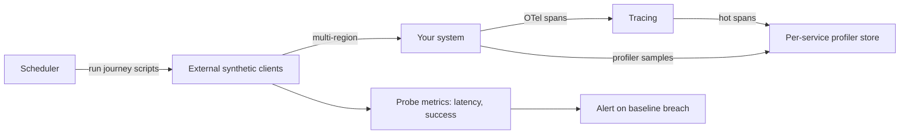

# Synthetic Monitoring and Profiling

## 1. One-Line Definition
Synthetic monitoring runs scripted, scheduled "fake user" requests against the system from outside to prove availability and key user journeys, while profiling samples the actual application at runtime to show where CPU and memory are spent — together they catch regressions before real users and before they hurt.

## 2. Why Do We Need It?
Users don't start at your dashboards; they start at a browser or API call. Real-user monitoring (RUM) only tells you after the fact. Synthetic monitoring lets you detect outages, regressions, and degraded journeys before customers complain, from the outside where your app is actually consumed. Profiling, the second half, answers "why is it slow or hungry" at the code level — CPU-bound? Allocating too much? — which metric walls can't show. Both are about catching problems earlier than metrics alone, and about finding where time and memory actually go.

## 3. Simple Intuition
Synthetic monitoring = test-driving your own car every morning on the same route before you're due at work: same steps, same time, measured. If the route takes 5 seconds instead of 3, you know before the phone rings. Profiling = a mechanic putting a sensor on the engine during a real drive and recording which part burns the most fuel in which gear — you see the actual distribution of work, not just "it feels slower."

## 4. What Happens Without It?
Blind launches: a new signup flow breaks at the edge (stale CDN, bad JS asset, blocked region) and nobody sees it until support tickets pile up. Or everything "looks healthy" on dashboards while one endpoint crawls because it burns CPU in a hot loop. Without synthetic checks, silent regression ships; without profiling, you guess where the cycles went and the fix is a shotgun.

## 5. Core Idea
- **Synthetic probes:** scheduled scripts that execute a user journey (login, search, checkout) against the system as an external client — plus simple uptime/HTTP checks. They run from multiple regions/locations to catch regional and edge problems (see [[cdn|CDN and Edge Caching]]).
- **What they catch:** availability ("is the journey up"), latency regressions ("did p95 just double"), behavior changes ("did the page structure change"), and canary/launch verification — pre-release smoke tests against staging or a prod shadow.
- **Baseline and comparison:** compare current probe time against a rolling baseline so a consistent regression alerts, not noise. Correlate probe failure with [[alerting|Alerting and Alert Fatigue]] to page humans.
- **Profiling at runtime:** integrated profilers (CPU, memory, wall-clock/flame graphs) sample the running process, attribute cost by function, and link back to the hot request path (can connect to [[distributed-tracing|Distributed Tracing]] spans).
- **On-demand vs continuous:** on-demand profiling for incidents and spot checks; coarse-grained always-on sampling to surface persistent hotspots (the "which endpoint eats 60% of CPU" question).
- **The merge:** synthetic = "the user's view, proactively"; profiling = "the code's view, precisely." One finds the symptom, the other the cause.

## 6. Important Terminology

| Term | Simple Meaning |
|------|----------------|
| Synthetic probe | Scripted external request simulating a user |
| Uptime check | Is the endpoint reachable with an expected status |
| Journey check | Multi-step flow (login → search → checkout) |
| Baseline | Rolling expected value to compare regressions |
| RUM | Real-user monitoring (passive, after the fact) |
| Flame graph | Visual view of time/memory spent per call |
| CPU profile | Where compute time goes |
| Heap profile | Where memory is allocated |
| Sampling profiler | Periodic samples instead of per-call instrumentation |
| Hot spot | The function/call dominating time or memory |

## 7. Basic Architecture



## 8. Request or Data Flow
1. Scheduler triggers the journey script (login → search → add-to-cart → checkout) from many regions against a target environment.
2. Each step records its own latency/success; overall and per-step metrics land in the metric store with a baseline comparison.
3. On breach, an alert fires with a link to the trace/spans for that run and the profiler snapshot for the hot service.
4. Profiler samples run constantly (low overhead) and on demand; flame graphs are viewable per service/deploy/version to localize hotspots.
5. A launch's synthetic run + profile tells SRE: availability OK, but the new codepath eats 40% more CPU — decide before real users arrive.

## 9. Practical Example
**Checkout journey, 9 regions (assumptions):** synthetic order takes p50 400ms, records 99.9% success.
- After a deploy, region EU-west p95 jumps from 500ms to 2.3s while other regions are fine — the probe isolates geography, not just "the system." The probe trace shows the new code serving from a faraway shard; fix in minutes.
- Profile on the payment service shows 55% of CPU in JSON serialization of a heavy order payload; the sampled profile flags it before it becomes the next metric anomaly. Same class of bug — regression and hotspot — caught from two angles.

## 10. Scaling
- **Probe fleet cost:** journeys are cheap individually but regions times services times frequency adds up — tier journeys by business value (deep checkout every 2 min in major regions, uptime check every 30s everywhere).
- **Profiling at scale:** always-on sampling adds a few percent overhead times fleet. Sample selectively (hot services or a fraction of instances), store flame graphs with short TTL, and aggregate hotspots by endpoint/version.
- **Orchestration:** keep probe definitions in code (versioned), triggered by CI on deploy — synthetic canary gates for release.
- **Baseline drift:** systems naturally get slower as they grow — re-baseline on capacity events so alerts stay calibrated.

## 11. Reliability and Failure Scenarios

| Failure | What Happens | Detection | Recovery | Trade-off |
|---------|--------------|-----------|----------|-----------|
| Probe false positive | Wrong page, stale test data | Review probe itself | Fix quota/test data | probe hygiene |
| Baseline too tight | Alert storm on noise | Alert review | Widen baseline | signal loss |
| Profiler overhead | CPU sees 3-5% cost | Cost metrics | Sample less / selective | visibility |
| Probe target invalid | Failure not your system | Red herring | Seeded test tenants | isolation |
| Region removed | Blind spot | Probe coverage check | Re-add region | cost |

## 12. Consistency and Correctness
Synthetic must test *stable journeys*, not things that change every sprint — a journey that breaks on every deploy generates chaos, not signal. Probes need deterministic test data/tenants and idempotent side effects (don't create real orders). Baseline comparison is relative: today-vs-baseline, not absolute golden values, so legit growth doesn't fire. Like logs, synthetic is observational — it proves a symptom; the trace/profile prove the cause.

## 13. Performance
Probe overhead to prod is near zero (it's external traffic). The cost is fleet-side: regions times journeys times frequency, plus the metric/trace volume. Profiler overhead is the interesting trade — per-call instrumentation costs far more than sampling, so production profiling always samples; overhead stays under ~5% CPU at reasonable sample rates.

## 14. Security
Synthetic probes bypass real credentials — harden them: they are externally reachable service accounts walking your most sensitive journeys. Keep them scoped, use dedicated synthetic accounts/tenants, never embed real secrets in probe scripts, and consider that probe traffic patterns could leak internal-to-external topology. Profile data is extremely revealing (function names, stack traces) — treat it as internal, redact before sharing with third parties.

## 15. Trade-Offs

| Choice | Advantages | Disadvantages | When to Use |
|--------|------------|---------------|-------------|
| Synthetic vs RUM | Proactive, deterministic | Scale/variety limits; upkeep | Journeys with real stakes |
| RUM only | Real traffic, real users | After-the-fact | Amplify, not replace |
| Uptime vs journey | Cheap, many | Misses behavior regressions | Baseline net |
| Journey check | Deep verification | Expensive, needs test data | Critical flows |
| Always-on profiling | Constant hotspot detection | Overhead + storage | Hot/core services |
| On-demand profiling | Zero idle cost | Blind between triggers | Incident/spot |

## 16. Common Mistakes
- Building journeys that break on cosmetic changes (false fires).
- No baseline — everything always ok or always red.
- Using real user accounts/credentials in probes.
- Profilers only on demand — hotspots live undiscovered until a metric crashes.
- Ignoring regional coverage (new region silently never probed).
- Not tying the probe to a trace/profile — you see "it's slow" but not "why."

## 17. HLD vs LLD Boundary
HLD: which journeys are synthetic-checked and at what cadence/regions, baseline policy, alerting thresholds per journey, profiling policy (which services, always-on vs on-demand), flame-graph retention, CI synthetic canary gates. LLD: the probe scripts themselves, profiler config/sample rates, per-service flame-graph dashboards, journey step assertions.

## 18. Interview Questions

### Beginner
- Synthetic vs RUM — one line each.
- What does a profile tell you that a metric doesn't?

### Intermediate
- Design the synthetic-monitoring set for a checkout + login system with regional coverage.
- How do you correlate a synthetic failure to a root cause in code?

### Advanced
- Design always-on profiling for a fleet without killing the budget: sampling, aggregation, retention.
- Your synthetic check is green but users complain. Defend the gap and design the complementary tooling.

## 19. Interview Memory Summary

> [!abstract]- Interview Memory Summary

### Remember

- Synthetic = scripted external user-journey checks, proactive, deterministic.
- RUM = real traffic after the fact; use both, not either-or.
- Scope: multi-region, stable journeys, baseline comparison.
- Profiling answers "where does CPU/memory actually go" at function level.
- Distributed tracing links probe symptom to hot span; profile localizes cause.
- Cost levers: journey tiers, probe frequency, sampled (never per-call) profilers.

### 30-Second Explanation

Run scheduled scripted journeys (uptime + login/search/checkout) from many regions with baseline comparison so a regression pages a human, then use the probe's trace to find the slow span and an always-on sampling profiler to localize the hotspot in the code — synthetic finds "users will feel this," profiling finds "this function is eating the fleet."

### Interview Traps

- Saying synthetic replaces alerting on real metrics — it's complementary early detection.
- Building journeys against production real data — use seeded tenants/ids.
- Per-call profilers in prod (overhead) — always sample.
- Green probes with unhappy users — you lack RUM or journey realism.

### Key Trade-Off

Synthetic monitoring trades running external "robot users" and their upkeep (journeys, baselines, regions, test data) for discovering regressions before real users feel them; profiling trades a few percent of runtime overhead in exchange for finding the code-level cause of latency and memory, not the symptom.

## 20. Related Concepts

### Prerequisites

- [[observability|Observability]]
- [[golden-signals|Golden Signals]]

### Commonly Used Together

- [[distributed-tracing|Distributed Tracing]]
- [[alerting|Alerting and Alert Fatigue]]
- [[cdn|CDN and Edge Caching]]

### Advanced Concepts

- [[bottleneck-identification|Bottleneck Identification]]
- [[tail-latency|Predictable Tail Latency]]

Related planned topics (not authored yet): RUM end-to-end, profile-driven capacity planning.

## 21. References
Google SRE Book (monitoring distributed systems), AWS CloudWatch Synthetics and X-Ray profiling docs, OpenTelemetry profiling documentation. Verify current tooling behavior pre-interview.

## 22. Active Recall

Test yourself before revealing each answer.

> [!question]- Synthetic monitoring vs RUM — what does each catch that the other misses?
> Synthetic is proactive and deterministic: a scripted journey runs from outside on a schedule and catches regressions before real users arrive. RUM catches what real users actually experienced — including paths you never scripted, devices, and geography — but only after the fact. Both together cover pre-launch verification and live truth.

> [!question]- What does a profile show that metrics and dashboards can't?
> The actual distribution of time and memory at the function level: a flame graph shows which function/call dominates CPU, freeing you from guessing "it's slow" or "memory is high." Metrics say a resource is saturated; a profile says exactly where it's being spent.

> [!question]- Design the synthetic-monitoring set for a checkout system.
> Tier journeys by business value: uptime/HTTP check every 30s from every region; shallow journey (landing → search) every minute; full checkout every 2-3 min from major regions — with seeded test tenants, idempotent actions, per-step latency capture, and rolling baselines that alert on deviation, tied to trace/profile for diagnosis.

> [!question]- Your synthetic check is green but real users complain. What's the gap, and what fills it?
> You're missing journey realism and real-user truth: probes script one canonical path with your own data and may hit a privileged/stale path while the real path (different devices, ad blockers, region, cache state, auth edge case) breaks. Fill it with RUM, broader probe coverage, and probe-to-trace correlation.

> [!question]- Design always-on profiling for a large fleet without bankrupting the budget.
> Sample, never instrument per-call: run sampling profilers on a fraction of instances per service (or hot services only), aggregate profiles to flame graphs by endpoint/version with short TTL, keep raw capture on demand for incidents, and connect hot spans from traces to the profile so you only deep-profile the requests that matter. Overhead stays a few percent.

> [!question]- A new deploy doubles p95 checkout latency in one region only. Walk the full design.
> Synthetic journey (that region) flags the regression against baseline → the probe's distributed trace shows the checkout spans including which shard/dependency → a sampled profiler on the checkout service reveals the new code path burning CPU in serialization → decide: fix the serialization or feature-flag the new path, then re-run the synthetic journey to confirm the baseline is restored.

## 23. When Should I Use This?

### Use it when

- User journeys matter and regressions must be caught before customers feel them.
- You need launch/canary verification beyond unit tests (stale assets, CDN, region wiring).
- You suspect or must design out hotspots (CPU/memory) before alerts and migrations hurt.
- Multiple regions must be proven to work, not assumed.

### Avoid it when

- Cheap static content with no critical journey — an uptime check may suffice.
- You can't maintain the journeys (test data, bootstrapping) — they rot and become noise.
- Profiling a system you're not changing — the overhead buys little signal.

### What problem does it solve?

Metrics can't tell you a journey is broken before users arrive, and dashboards can't tell you which function eats the fleet. Synthetic monitoring catches availability/latency/behavior regressions from the outside-in, pre-launch; profiling catches CPU/memory hotspots from the inside-out, in production — together, the symptom and its cause surface early.

### What problem does it NOT solve?

It does not know what real users experienced (RUM does); it does not explain a regression by itself (traces/logs do); a synthetic check proves the symptom, not the fix; and it adds its own fleet + storage cost and upkeep burden that must be designed and maintained.

## 24. Decision Connections

Decisions that go together with synthetic monitoring and profiling:

- [[observability|Observability]] — the umbrella these tools bolt onto; they extend metrics/traces/logs.
- [[golden-signals|Golden Signals]] — the probe metrics are latency/error shaped; synthetic feeds the same dashboards.
- [[distributed-tracing|Distributed Tracing]] — connect a probe failure to its spans for the root cause.
- [[alerting|Alerting and Alert Fatigue]] — probe baseline breaches flow into the alerting ladder.
- [[bottleneck-identification|Bottleneck Identification]] — profiling is the function-level layer of that capability.
- [[cdn|CDN and Edge Caching]] — regional probes validate edge/CDN delivery as part of the journey.
- [[tail-latency|Predictable Tail Latency]] — profiles and probes both chase the tail that users feel.

Decision tree:

```
Need to catch regressions before users feel them?
    |
    +-- External journey can be automated?
    |      +-- yes → synthetic journey checks (multi-region, baseline)
    |      |        → feed [[alerting|Alerting and Alert Fatigue]]
    |      |        → link probe run → [[distributed-tracing|Distributed Tracing]]
    |      +-- no  → RUM (real-user data, after-the-fact)
    |
    +-- "Why is it slow / CPU-high" at the code level?
    |      → always-on sampling profiler on hot services
    |      → flame graphs per endpoint/version
    |      → correlate hot spans → profile
    |
    +-- Launch gate?
    |      → synthetic canary runs in CI before release
    |
    +-- Budget realities?
           +-- Probe journeys tiered; uptime checks cheap and everywhere
           +-- Profiles sampled and short-TTL — not per-call, not forever
```