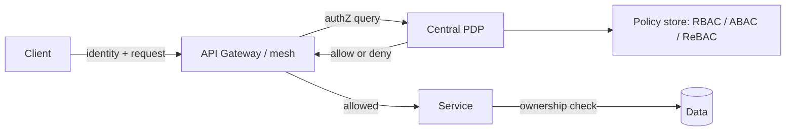

# Access Control (RBAC / ABAC / Least Privilege)

## 1. One-Line Definition
Access control is the authorization layer that decides, per request, whether an authenticated identity may perform a given action on a given resource — modeled with roles (RBAC), attributes (ABAC), or relations (ReBAC/Zanzibar) — and is governed by the principle of least privilege so every identity gets the minimum permission its job requires.

## 2. Why Do We Need It?
Authentication establishes who you are; access control decides what you may do (see [[authentication-vs-authorization|Authentication vs Authorization]]). The classic breach is not a broken login — it's a working login with too much power: an employee token with admin, a service account that can read the whole fleet, an API key scoped too wide. Without a deliberate access-control model you get accidental superusers, untraceable changes, and a compliance disaster when an auditor asks "who can read what?" Least privilege is the antidote: constrained, revocable, auditable permission.

## 3. Simple Intuition
A hotel key system: your key opens your room, the gym between 6 and 10pm, and nothing else. Roles (RBAC) are like cards that come pre-programmed by role — "housekeeping opens every room but can't read the safe." Attributes (ABAC) are like a card that works based on conditions — "any staff can enter the boiler room only before 8am." Relations (ReBAC) are like "you can share your room key only with people you explicitly add." Enforcement at the door is the access-control engine; the combination that follows you is your token.

## 4. What Happens Without It?
Worst-case survivorship is the norm: a single "user" role that is actually god-mode, an admin endpoint protected only by being unlisted, an over-scoped service credential. Result: one leaked token reads everything, an insider deletes prod with no trail, a support agent sees another customer's data (IDOR-style via overly broad role). Auditors find "who has access" is answered per team, non-reproducibly. Even worse: coupling authZ to authN so roles are embedded in signed tokens with no enforcement server-side — revoke a role and permissions persist until expiry.

## 5. Core Idea
- **The enforcement point (PEP/PDP):** a policy decision point decides "may identity X do action Y on resource Z in context C"; a policy enforcement point (in your API/gateway/service) applies the decision. Decide centrally, enforce everywhere.
- **RBAC:** users → roles → permissions. Simple, auditable, industry default. Fine for coarse abilities (admin/editor/viewer) but grows brittle as permissions multiply and don't map to roles cleanly.
- **ABAC:** policies over attributes (user dept, resource owner, document sensitivity, time) via rules like "HR may read payroll of dept=HR." Most expressive, most complex — attribute explosion and policy sprawl are risks; needs a policy language (e.g., OPA/Cedar).
- **ReBAC / relationship-based:** permission derived from relations like "is owner of document," "is member of org"; Zanzibar-style (Google) — great fit for sharing/collaboration, scales with a graph. See [[tenant-isolation|Tenant Isolation / Audit Trails / Zero Trust]] for the tenant-aware framing.
- **Ownership checks:** the highest-frequency real-world pattern — "can resource owner do X on their own resource" via a WHERE clause or ownership record. Cheap, correct for most per-user data.
- **Least privilege & privilege elevation:** start deny-by-default; grant narrowly (scoped API keys, scoped tokens — see [[api-keys-sessions|API Keys and Signed Session Tokens]]); elevate temporarily (just-in-time admin) and log it. Also: separability of duty — no single identity may both approve and execute a sensitive action.
- **Central vs distributed enforcement:** central PDP (single source of truth, harder to bypass), sidecar/service-mesh enforcement, or per-service library. Faster feedback with libraries; fewer bypass holes with a mesh — choose by latency + blast radius.

## 6. Important Terminology

| Term | Simple Meaning |
|------|----------------|
| AuthN vs AuthZ | Who you are vs what you may do |
| PEP / PDP | Policy enforcement point / decision point |
| RBAC | Roles → permissions |
| ABAC | Policies over attributes |
| ReBAC | Permissions derived from relations |
| Least privilege | Minimum permission necessary |
| Deny by default | Anything not granted is denied |
| Scope | Boundary of a token/key permission |
| IDOR | Accessing another's object by id |
| Just-in-time | Elevation granted temporarily |

## 7. Basic Architecture



## 8. Request or Data Flow
1. Request arrives with an authenticated identity (token, API key) — authN already done.
2. Enforcement point asks the decision point: subject, action, resource, context.
3. The PDP evaluates roles/attributes/relations against the policy store; caches the decision; returns allow/deny.
4. On allow, the service may still perform an *ownership* check at the row level (resource.owner_id = user_id).
5. Every decision is logged for audit. Denials are default (a missing policy is a deny, not a permit).

## 9. Practical Example
**Enterprise document SaaS (assumptions):** RBAC for coarse access (admin/editor/viewer/auditor) + ReBAC for sharing ("John shared doc X with team marketing").
- User opens doc X: gateway queries PDP with (user=John, action=read, resource=docX). PDP allows via ReBAC relation.
- Editing requires editor role AND relation. Admin can force-close a doc but can't read contents unless also an editor (separation).
- A leaked "viewer" token cannot write anywhere; an auditor role sees audit logs but no document contents. Every allow is logged with the reason (role/relation/attribute) that justified it.

## 10. Scaling
- **Central PDP per region:** a shared decision point is a hot path — cache decisions, replicate the policy store, shard by tenant block; the PDP itself must be HA (its failure blocks authZ → fail closed for deny-by-default, fail open carefully for availability).
- **Policy graph scalability (ReBAC):** relationship graphs at billions of edges are solved with sharded relation stores and index trees (Zanzibar-style), not one big database.
- **Policy sprawl:** thousands of ABAC rules are unmaintainable — tier the models (RBAC base + ABAC edges + ReBAC for sharing), review policy drift, and version policies with the code (policy as code, CI-reviewed).
- **Multi-tenant:** tenant_id becomes a mandatory attribute in every ABAC policy / relation scope — a role may be "admin in tenant A" but not tenant B; policy decisions are always tenant-scoped (see [[tenant-isolation|Tenant Isolation / Audit Trails / Zero Trust]]).
- **Latency of decisions:** inlining a PDP call per request adds a network hop — cache normalized decisions (subject+action+resource) with a short TTL and invalidate on role change via a versioned policy store.

## 11. Reliability and Failure Scenarios

| Failure | What Happens | Detection | Recovery | Trade-off |
|---------|--------------|-----------|----------|-----------|
| PDP down | Requests can't be authorized | Health/error spike | HA + cached decisions | staleness window |
| Cached allow stale | Revoked role still works | Audit, token guard | Short TTL, event invalidation | latency |
| Policy error widens | Over-permission, silent | Policy tests, least-privilege review | Rollback policy, tests | review cadence |
| Ownership check missed | Cross-tenant read (IDOR) | Test cases, pentest | Add row-level check | perf |
| Policy as code drift | Policy ≠ deployed | CI + drift detection | Code review on policy change | process |

## 12. Consistency and Correctness
Authorization must be **default-deny and race-free**: the decision is taken against a consistent policy snapshot; if policies change mid-request, the effective result must be unambiguous — version the policy store and include the version in the decision log. Revocation must be near-instant for tokens/keys that reference permissions (short TTL or introspection), never "until expiry." Enforce ownership checks at the data layer to defeat IDOR even if the PDP is bypassed (defense in depth).

## 13. Performance
Central PDP adds ~1 network hop per request; with caching this is sub-ms amortized. Row-level ownership checks are cheap indexed lookups. The expensive end is ReBAC graph queries on deep relations — precompute/denormalize access in an index, or allow-list of visited nodes, to keep p99 in budget. Watch out for policy evaluation loops on huge attribute sets (flatten at write time).

## 14. Security
The access-control engine is the crown jewel: protect the PDP (service auth, mTLS, no anonymous read of policy store), log every decision (who/what/when/why), and never let resource owners self-grant beyond their role. Guard records/roles with their own least privilege, and treat grants as data: they need versioning, audit, and revocation, not just "who has access now."

## 15. Trade-Offs

| Choice | Advantages | Disadvantages | When to Use |
|--------|------------|---------------|-------------|
| RBAC | Simple, auditable, fast | Permission explosion | Coarse, stable roles |
| ABAC | Expressive, contextual | Attribute sprawl, complex | Dynamic environments |
| ReBAC | Natural for sharing/graphs | Graph cost, engineering | Collaborative products |
| Ownership check | Correct per-row, minimal | Per-item only | Per-user data security |
| Central PDP | Single truth, no bypass | Network hop, SPOF | Multi-service fleets |
| Service-library enforcement | Fast, no hop | Duplication, drift | Small systems |

## 16. Common Mistakes
- Roles built as "user = everything" (no least privilege).
- Enforcing authZ only at the gateway, never a row-level ownership check → IDOR.
- Storing permissions in JWTs with long TTL → revocation never lands.
- ABAC policy sprawl that nobody reads — rules that conflict silently.
- PDP as single point of failure with no cache/HA.
- No audit trail on policy decisions — "who had access" is unanswerable at audit time.

## 17. HLD vs LLD Boundary
HLD: access-control model (RBAC/ABAC/ReBAC), PEP/PDP topology, enforcement points (gateway/service/mesh), policy-as-code and versioning, default-deny + least-privilege stance, just-in-time elevation, audit logging contract. LLD: concrete policy rules/language, role definitions, relationship schema for ReBAC, decision caching/invalidation, enforcement hook code.

## 18. Interview Questions

### Beginner
- RBAC vs ABAC vs ReBAC — one line each.
- Why is least privilege a design principle, not a slogan?

### Intermediate
- Design access control for a document SaaS: which model where, and where does the ownership check live?
- A role is revoked but a user still acts as admin for hours. Diagnose and fix.

### Advanced
- Design ReBAC-style shared-document authorization at Zanzibar scale: how do you evaluate "is user U allowed read on doc D" when the graph is billions of edges?
- Split your access-control calls into fail-closed and fail-open paths and defend each choice.

## 19. Interview Memory Summary

> [!abstract]- Interview Memory Summary

### Remember

- AuthN = who; authZ = may they; access control is authZ done deliberately.
- Decide centrally (PDP); enforce everywhere (PEP edge + service + data layer).
- RBAC = roles; ABAC = attribute policies; ReBAC = relations; ownership check = per-row.
- Default is deny — missing policy is a deny, not a permit.
- Least privilege: narrow scopes, just-in-time elevation, logged grants.
- Revocation must be near-instant; don't trust long-lived permissions in tokens.
- Policy as code, reviewed, versioned, drift-checked.

### 30-Second Explanation

Choose an access model per dimension — RBAC for coarse roles, ABAC for contextual rules, ReBAC for sharing/graph relations, plus a row-level ownership check every time — then apply decisions through a central PDP with a deny-by-default policy store, enforce at gateway/service/data, log every decision, grant narrowly with just-in-time elevation, and version the whole thing as code.

### Interview Traps

- Confusing access control with authentication — a working login with too much power is the whole problem.
- Only gateway enforcement — no need to go past a gateway to be exploited (row-level IDOR).
- Long-lived permissions in tokens → revocation can't land.
- "User role" that is actually admin — the accidental superuser.

### Key Trade-Off

A deliberate access-control model (decide centrally with PEP/PDP, ownership check at the data layer) buys least-privilege safety, revocation, and auditability — at the cost of a central decision point to keep available, policy complexity to keep maintained, and the care needed to deny-by-default without breaking legitimate access.

## 20. Related Concepts

### Prerequisites

- [[authentication-vs-authorization|Authentication vs Authorization]]
- [[oauth-oidc-jwt|OAuth 2.0 / OIDC / JWT]]

### Commonly Used Together

- [[api-keys-sessions|API Keys and Signed Session Tokens]]
- [[tenant-isolation|Tenant Isolation / Audit Trails / Zero Trust]]
- [[session-management|Session Management]]

### Advanced Concepts

- [[web-vulnerabilities|Web Vulnerabilities]] (IDOR violations of access control)
- [[encryption-and-keys|Encryption and Keys]] (key access is itself an access-control surface)

Related planned topics (not authored yet): policy-as-code engines (OPA/Cedar), Zanzibar-style relation stores.

## 21. References
NIST SP 800-162 (ABAC), OWASP Authorization Cheat Sheet, Google Zanzibar paper (OSDI 2019). Verify current guidance pre-interview.

## 22. Active Recall

Test yourself before revealing each answer.

> [!question]- RBAC, ABAC, ReBAC — when do you pick each?
> RBAC when abilities are coarse and stable (admin/editor/viewer). ABAC when decisions need context (attribute-based: dept, sensitivity, time). ReBAC when permissions come from relationships (owner of doc, member of org, team sharing) — the natural fit for collaborative products. Most real systems combine them.

> [!question]- Why can't gateway-only enforcement stop IDOR?
> Because the gateway authorizes the API call, not the object: "can this user call GET /orders?id=1" doesn't check whether the order belongs to them. You need a row-level ownership check at the data/application layer (resource.owner_id = user_id, or a ReBAC relation), which gateway denial can't provide.

> [!question]- A revoked role still works for hours. What's the design flaw and the fix?
> Permissions were baked into a long-TTL token (e.g., claims in a JWT) and never re-validated against the PDP, so revocation can't land until expiry. Fixes: short-TTL tokens + server-side revalidation, token/refresh revocation, or introduce an introspection/deny-list step for sensitive actions.

> [!question]- Design a central PDP without making it a SPOF.
> HA/active-standing PDP or multi-PDP with shared policy store; cache normalized allow decisions with a short TTL at the enforcement point so a PDP blip degrades to staleness, not outage; fail-open only for idempotent, non-sensitive reads after careful risk review — else fail closed. Version the policy store so decisions are reproducible.

> [!question]- Least privilege in practice — name three concrete mechanisms.
> Scoped API keys/tokens (read-only, per-endpoint), just-in-time privilege elevation (time-boxed, logged, auto-expiring), and separation of duties (approver vs executor must be different identities). All three make an over-broad credential less likely and audits answerable.

> [!question]- Behavioral: a support agent reads another tenant's data "by accident." Trace the fix.
> Likely missing object-level ownership check or tenant scoping (the agent's role was tenant-blind). Fix: tenant_id as a mandatory attribute/scope in every policy AND data query, row-level ownership check, PDP logging, and the RBAC role re-scoped to "support:tenant X only" — deny-by-default; the same request pattern becomes impossible to re-perform.

## 23. When Should I Use This?

### Use it when

- Multiple identities share one system and must not read/write each other's data.
- Compliance (GDPR, SOX, HIPAA) demands answerable "who can access what."
- A service or API key would otherwise get a too-broad credential by default.
- You need revocation that actually works (not "until token expiry").

### Avoid it when

- A single-user prototype with no permission surface — access control is overhead here.
- You can't commit to a policy-as-code review loop — ungoverned policies rot into either over-permission or outages.
- AuthZ is already trivially per-user (one user per object) — an ownership check may suffice.

### What problem does it solve?

Without a deliberate model, permissions are accidental: accidental superusers, unanswerable audit questions, cross-tenant reads, and revocation that can't land. Access control answers "who may do what and why, and can we prove it later" at every layer — policy, enforcement, and the data itself — under least privilege.

### What problem does it NOT solve?

It doesn't authenticate anyone (that's [[authentication-vs-authorization|Authentication vs Authorization]]); it doesn't protect against stolen-but-validly-scoped credentials; and it assumes the PDP, cache, and ownership checks stay correct — a policy bug that grants too much is still a breach unless denial is default and tested.

## 24. Decision Connections

Decisions that go together with access control:

- [[authentication-vs-authorization|Authentication vs Authorization]] — the identity layer feeds the authZ decision; they are separate systems.
- [[oauth-oidc-jwt|OAuth 2.0 / OIDC / JWT]] — scopes on tokens are the least-privilege surface on the wire.
- [[api-keys-sessions|API Keys and Signed Session Tokens]] — static credentials need the same scoping/revocation treatment.
- [[tenant-isolation|Tenant Isolation / Audit Trails / Zero Trust]] — tenant_id scoping is access control at the multi-tenant scale.
- [[session-management|Session Management]] — sessions carry the subject the PDP needs; revocation overlaps.
- [[encryption-and-keys|Encryption and Keys]] — key access policies are access-control domains too.
- [[web-vulnerabilities|Web Vulnerabilities]] — IDOR is an access-control failure with an authorization exploit.

Decision tree:

```
Need to decide "may this identity do this action on this resource?"
    |
    +-- Coarse, stable abilities?
    |      → [[access-control|Access Control]] RBAC (roles → permissions)
    |
    +-- Decisions depend on context (dept, time, sensitivity)?
    |      → ABAC (attribute policies, policy-as-code)
    |
    +-- Permissions come from relationships (shared docs, orgs)?
    |      → ReBAC (relation graph, Zanzibar-style)
    |
    +-- Per-user object access?
    |      → row-level ownership check at the data layer (deny IDOR)
    |
    +-- Where to decide?
    |      +-- One place, no bypass?  → central PDP (HA + cached)
    |      +-- Fast, small system?     → service-library enforcement
    |
    +-- How to scope?
           → least privilege: scoped keys, just-in-time elevation, audit logs
           → see [[api-keys-sessions|API Keys and Signed Session Tokens]]
```