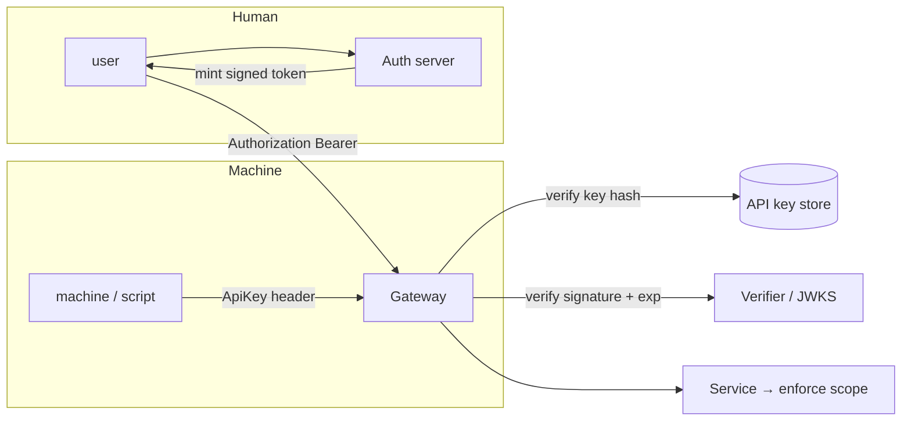

# API Keys and Signed Session Tokens

## 1. One-Line Definition
API keys are long-lived, static, shared-secret credentials that identify a caller (machine or user) for API access, while signed session tokens (typically JWTs) are short-lived, self-contained credentials carrying claims that a service can verify locally without a store lookup — two ends of the "how do I prove who I am to your API" spectrum.

## 2. Why Do We Need It?
Services must know who is calling and whether the caller is allowed. Two extremes are common: (1) machine-to-machine and teammate scripts need a persistent "this integration is allowed" credential — the API key; (2) user sessions must be verifiable cheaply at every hop of a distributed system without a global session lookup — signed tokens (see [[session-management|Session Management]] for the session-state sibling, and [[oauth-oidc-jwt|OAuth 2.0 / OIDC / JWT]] for delegated-identity flows). These are different problems demanding different trade-offs, and conflating them — using a long-lived key where a short-lived token belongs — is a recurring breach vector.

## 3. Simple Intuition
An API key is your building's old-fashioned door key: permanent, unlocks the door until you change the lock, and multiple cleaners can carry copies. A signed session token is a timed entry badge: expires at 5pm, says which floors you may visit, and the guard verifies it by checking the signature (no need to phone the office every time). Keys are simple but durable; badges are short-lived, scoped, and verifiable locally.

## 4. What Happens Without It?
Either you trust everyone who can reach the network (compromise, no accountability) or you over-authenticate: users log in with passwords on every request, microservices each hold the same master credential, and a single leak unlocks every endpoint. Long-lived keys in public repos, tokens pasted into chat, authenticated endpoints reachable unauthenticated — access control theater plus credential sprawl. The consequence is the classic breached credential: one leaked static key with write scope = attacker-owned account.

## 5. Core Idea
- **API keys (static shared secrets):** an identifying string usually prefixed with scope (`live_secret_...`, `test_...`); the server stores the hash (never the plaintext), looks it up per request, and checks scope + owner. Long-lived, revocable, and simple — best for machine calls, CLI/infra scripts, SDKs, webhooks.
  - Carry them in a header (`Authorization: ApiKey ...` or `X-Api-Key`), never in URLs (log leakage).
  - Rotation is the hard part: keys last months/years, so provide rotate endpoints, dual-key windows (old + new both valid), and require periodic rotation for customers.
  - Treat key **scope + owner** as the authorization contract (see [[access-control|Access Control (RBAC / ABAC / Least Privilege)]]).
- **Signed session tokens (JWT-style):** a header(alg).payload(claims: sub, iss, aud, exp, scope).signature. Stateless: any service with the public key verifies locally — no server-side session store per request.
  - Claims travel in plaintext JSON — **never put secrets in the payload**; it's readable, only the signature is protected.
  - The hard parts: **signature verification** (never trust the payload), `alg=none` attacks, algorithm confusion, and the **revocation problem** — a JWT stays valid until `exp` because there is no server state to check. Mitigation: short TTL + rotation (access + refresh), deny-list of compromised `jti`s, audience/issuer validation.
- **The decision matrix:** static, long-lived, caller identity and no user in the loop → API key. User session with cheap cross-service verification and a bounded validity window → signed token. See [[stateless-vs-stateful-services|Stateless vs Stateful Services]] for the statefulness angle.

## 6. Important Terminology

| Term | Simple Meaning |
|------|----------------|
| API key | Static shared-secret credential for API access |
| Scope | Permission bound to a key/token (read-only, limits) |
| Rotation | Replacing a key with a new one (dual-key window) |
| JWT | Self-contained signed token: header.payload.signature |
| Claims | Named assertions in the payload (sub, exp, scope) |
| TTL / exp | Validity window of the token |
| jti | Token id (for denylist/revocation) |
| Refresh token | Longer-lived credential minting new access tokens |
| Denylist | Server-side list of revoked ids |
| HMAC vs RSA | Shared-secret signing vs pub/priv key signing |

## 7. Basic Architecture



For machine-to-machine and user-token access.

## 8. Request or Data Flow
1. Machine: sends `Authorization: ApiKey key-id:secret`; gateway looks up the key hash, checks scope and owner, logs the identity, then routes to the service.
2. Human: logs in → auth server signs a JWT (sub, exp ~15m, scope) → client sends `Bearer <jwt>` on every request.
3. Each hop verifies the signature via published public keys (JWKS) and checks iss/aud/exp, enforcing scope at the service.
4. Expiry: client uses a refresh token to mint a new access token; on logout or compromise, the refresh family and/or denylist entry invalidates access.

## 9. Practical Example
**Payments platform (assumptions):**
- Merchant integration uses an API key `pk_live_...` + secret with scope `charges:write, refunds:read`, hashed in the key store, rotated annually with a 30-day dual-key window.
- Users of the merchant dashboard get a signed session token (TTL 15 minutes, refresh token 30 days, rotated on use).
- A leaked dashboard token from a phishing email expires in <20 minutes and the refresh rotation kills reuse; a leaked API key rotates out in an emergency within minutes via the owner revoking + rotating.
- The API key, being long-lived, is the higher-risk surface, so it has stricter scope and audit than the short-lived user token.

## 10. Scaling
- **API keys at scale:** key store must be read-hot (cache hashes), but revocation must propagate — short-TTL cache or check-on-sensitive-actions. Keys multiplied per customer, so keep metadata (owner, scope, last-used, created) structured and queryable.
- **Signed tokens scale verification** (local crypto, cached JWKS) — the reason distributed/microservice systems prefer them over per-request session lookups.
- **Revocation at scale:** denylists (jti) sized by compromise volume; refresh rotation with reuse detection (family revocation) is the practical tool.
- **JWKS rotation:** publish new keys, keep old for overlap; verify by `kid`. Misrotation bricks every token; automate and test it.

## 11. Reliability and Failure Scenarios

| Failure | What Happens | Detection | Recovery | Trade-off |
|---------|--------------|-----------|----------|-----------|
| Key leak (repo/chat) | Broad access until rotated | Secret scanning, audit | Rotate + revoke immediately | incident |
| Key store down | All API-key callers denied | Health/error spike | HA key store + cached hash | staleness |
| Long-lived key forgotten | Expired scope lives forever | Last-used audit | Expire unused keys | ops |
| Token algorithm confusion | Signature bypass | Security tests | Pin verifiers, reject alg=none | hardening |
| JWKS misrotation | All tokens fail verify | Verify error spike | Keep old keys in overlap | rollout discipline |
| Refresh token theft | Persistent access via family | Reuse detection | Family revocation, re-authn | detection latency |

## 12. Consistency and Correctness
Keys and tokens are assertions of permission at issuance/creation time — scope may be stale for a long-lived key or a 15-minute token. Enforce scope at the service on every request (never trust claims alone, see [[access-control|Access Control (RBAC / ABAC / Least Privilege)]]). Revocation semantics differ: delete/rotate the key → immediate for the next lookup; denylist a JWT → effective only where the denylist is consulted. Document the correctness contract: what does "revoked" mean for each credential type.

## 13. Performance
API key lookup = one store/cache read per request (cheap but stateful). JWT verify = local signature + claim checks (microseconds, no network). Refresh journeys add a token-endpoint call at expiry boundaries only. Watch list: fat JWTs (limit claims and size), deny-list lookups on the hot path (keep them in-memory), and per-request HMAC vs RSA cost (HMAC cheaper, RSA enables public verification).

## 14. Security
- Never log keys/tokens; never put them in URLs or client-side storage that XSS can read (see [[web-vulnerabilities|Web Vulnerabilities]]).
- Store key hashes with a keyed function (HMAC or bcrypt-style), rotate on suspicion, and use scopes as the authorization contract.
- Validate every JWT claim: signature (correct key, reject alg=none), iss/aud/exp/nbf, bound jti. Never treat the payload as secret.
- Use short TTLs, refresh rotation with reuse detection, and prefer signed tokens with denylists over unrevocable long-lived tokens for user sessions.

## 15. Trade-Offs

| Choice | Advantages | Disadvantages | When to Use |
|--------|------------|---------------|-------------|
| API key (long-lived) | Simple, stable for machines | Broad blast radius, must rotate manually | M2M, CLIs, SDKs |
| Signed token (short TTL) | Cheap local verify, scoped, short window | Revocation delayed until exp | User sessions, distributed |
| Refresh token | Long-lived session without re-login | Must be stored securely, rotated | Any user session |
| Opaque session id in store | Instant revoke | Lookup per request, stateful | [[session-management|Session Management]] |
| Denylist of jti | Target revocation of suspicious tokens | Adds lookup, can grow | Compromise response |

## 16. Common Mistakes
- Using one long-lived key everywhere (master key) instead of scoped per-integration keys.
- Putting tokens in URLs (log leakage) or localStorage (XSS theft).
- Storing the API key plaintext server-side; not hashing it.
- Never rotating: keys live for years and leak slowly.
- JWT accepted without signature/claim validation (`alg=none`, missing aud/exp).
- Long-lived user tokens with no refresh rotation → revocation can't land.
- Keys in env vars/pods with no structured metadata → unanswerable audit.

## 17. HLD vs LLD Boundary
HLD: when to use a static API key vs a signed token (matrix), key scopes and rotation policy, JWT TTL and refresh strategy, verification topology (JWKS, verifier placement), denylist/rotation/revocation design, secret storage posture. LLD: key generation/hashing code, JWT library config, claim validation logic, refresh rotation handlers, key metadata schema, rotation endpoints.

## 18. Interview Questions

### Beginner
- API key vs signed session token — one line each.
- Why must a JWT's signature be verified even though it looks "signed"?

### Intermediate
- Design API keys for a payments integration with scopes, rotation, and silent (no-downtime) key changes.
- A stolen JWT: what makes the damage limited, and which levers actually revoke?

### Advanced
- Your user-facing tokens are long-lived and revocation is a joke. Design the migration to short-TTL + refresh rotation with zero downtime.
- Mixed fleet: some microservices verify JWTs, some call a session store. Where do you draw the line, and what consistency contract do you need?

## 19. Interview Memory Summary

> [!abstract]- Interview Memory Summary

### Remember

- API keys = static, long-lived, machine credentials; hashed server-side, scoped, rotated.
- Signed tokens = stateless, cheap to verify, short-lived; claims readable, never secret.
- Never put secrets in JWT payloads; validate signature + iss/aud/exp.
- Revocation: rotate/delete keys; denylist tokens or rely on refresh rotation + short TTL.
- Keys/tokens in URLs or JS-readable storage = leak by design.
- Long-lived >= high risk: prefer short TTL + refresh rotation for users.

### 30-Second Explanation

Use scoped, rotated, hashed API keys for machine-to-machine and long-lived integrations; use short-TTL signed tokens (verify signature + claims via JWKS) for user sessions, with refresh rotation and denylists for revocation; never place secrets in token payloads or URLs, and always enforce scope server-side on every request.

### Interview Traps

- Saying a JWT is "secure because it's signed" — that's only part; claims, expiry, and revocation matter too.
- "We revoke by deleting from the DB" — for a stateless token there's no DB; you need denylists/TTL/refresh.
- Long-lived key with full access → the accidental master key.
- Storing keys where XSS/logs can see them — defeat by design.

### Key Trade-Off

A static API key is simple and durable but slow to rotate and broad-scoped; a signed token verifies locally and expires fast but pushes the work to refresh rotation and denylists — and the trick is choosing by context (machine vs user), never conflating the two surfaces.

## 20. Related Concepts

### Prerequisites

- [[authentication-vs-authorization|Authentication vs Authorization]]
- [[http-and-https|HTTP and HTTPS]]
- [[stateless-vs-stateful-services|Stateless vs Stateful Services]]

### Commonly Used Together

- [[session-management|Session Management]]
- [[oauth-oidc-jwt|OAuth 2.0 / OIDC / JWT]]
- [[access-control|Access Control (RBAC / ABAC / Least Privilege)]]

### Alternatives

- [[session-management|Session Management]] (opaque store-based sessions with instant revoke)

### Advanced Concepts

- [[encryption-and-keys|Encryption and Keys]] (hashing keys, key management)
- [[web-vulnerabilities|Web Vulnerabilities]] (XSS token theft, log leakage)

Related planned topics (not authored yet): API-key rotation protocols, token denylist scaling.

## 21. References
OWASP API Security Top 10, RFC 6750 (Bearer Token Usage), JWT Best Current Practices (RFC 8725). Verify current key-management guidance pre-interview.

## 22. Active Recall

Test yourself before revealing each answer.

> [!question]- When do you choose an API key over a signed token?
> When a machine/integration needs a long-lived identity with no user in the loop: CLI tools, CI/CD, merchant SDKs, cron jobs. Choose a signed token when a user session must verify cheaply at many services with a short validity window and rotation/revocation matters (login-based access).

> [!question]- Why would signing alone be insufficient for a JWT?
> Signing proves authenticity, not permission or freshness. Without validation of iss/aud/exp/scope, a stolen or reused token is still valid; algorithm confusion (alg=none) and wrong-key cases defeat the signature. You must verify the signature is from the expected issuer with the expected algorithm, and that claims are within window and bounds — server-side.

> [!question]- A stolen JWT is reported. Which levers make it worthless, and how fast each?
> 1) Short TTL makes it expire in minutes/hours by design. 2) Denylist of its jti makes the verifier reject it immediately, where consulted. 3) Refresh rotation + reuse detection revokes the whole family on the next refresh attempt. Order of effectiveness: denylist (now) > refresh family kill (next use) > natural expiry (soon). Long-lived static keys are the worst case — rotate and revoke immediately.

> [!question]- Design no-downtime API key rotation for a merchant.
> Issue a new key but keep the old valid (dual-key window), migrate the merchant's calls (send both or let them switch at their pace), then disable the old after a grace period with notices; validate on every request that the active key is within its allowed window. This decouples a slow client upgrade from a security deadline.

> [!question]- Describe the failure mode of a long-lived "master" API key.
> A single static key with broad scope shared across integrations is a single point of credential compromise: one repo leak or chat paste grants everything, rotation requires coordinated downtime, and there is no per-integration audit trail. The fix is per-integration scoped keys with metadata, rotation policy, and least privilege.

> [!question]- Behavioral: I can't revoke a user's access because "their token lives 30 days." What do you change?
> Move to short access TTLs + refresh token with rotation and reuse detection, and a denylist for suspicious tokens; enforce scope at the service on every request; audit who holds which refresh families so revocation targets the user/device rather than waiting for expiry. The token TTL decides the worst-case revocation window — so bind it to acceptable risk.

## 23. When Should I Use This?

### Use it when

- Machines/integrations need an identity (M2M API access, CLIs, SDKs, webhooks).
- Distributed services must verify user identity cheaply without a shared session store per hop.
- You need scoped, auditable, revocable credentials for API consumers.

### Avoid it when

- You need instant, global revocation with no denylist machinery — an opaque session id in a store (see [[session-management|Session Management]]) does that better.
- The "caller" is actually just your own browser app with a single login — a server session may suffice.
- You cannot hold secret material securely (no key store/HSM, no safe header/hared storage).

### What problem does it solve?

Credentials that are either everything-or-nothing and unverifiable end up as static shared secrets pasted everywhere. A deliberate key-vs-token choice gives machines a durable, scoped, rotatable identity and gives users a short-lived, locally verifiable, refreshable one — with revocation mechanisms designed for each.

### What problem does it NOT solve?

It doesn't decide what the credential may do (that's [[access-control|Access Control (RBAC / ABAC / Least Privilege)]]), doesn't authenticate users on its own (needs an auth flow, see [[oauth-oidc-jwt|OAuth 2.0 / OIDC / JWT]]), and won't protect you if scopes or TTLs are set too broad/long — the credential is only the wrapper, the policy underneath still decides safety.

## 24. Decision Connections

Decisions that go together with API keys and signed session tokens:

- [[session-management|Session Management]] — the store-based sibling; choose by revocation vs statelessness.
- [[oauth-oidc-jwt|OAuth 2.0 / OIDC / JWT]] — the standard flows that mint these tokens for users.
- [[authentication-vs-authorization|Authentication vs Authorization]] — keys/tokens handle identity; authZ is separate.
- [[access-control|Access Control (RBAC / ABAC / Least Privilege)]] — scopes are where the two connect.
- [[encryption-and-keys|Encryption and Keys]] — key storage, hashing, and management.
- [[web-vulnerabilities|Web Vulnerabilities]] — XSS and log leakage are how these credentials get stolen.
- [[rate-limiter|Rate Limiter]] — abuse of keys/tokens is throttled per-account at the API layer.

Decision tree:

```
Need to identify a caller at the API?
    |
    +-- Long-lived machine/integration identity?
    |      → [[api-keys-sessions|API Keys and Signed Session Tokens]] → API key (scoped, hashed, rotated)
    |
    +-- Short-lived user session, verify at every hop?
    |      → signed session token (short TTL + refresh rotation + denylist)
    |
    +-- Instant global revocation required?
    |      → [[session-management|Session Management]] (opaque id in store)
    |
    +-- Who decides permissions?
    |      → scopes on the key/token → [[access-control|Access Control (RBAC / ABAC / Least Privilege)]]
    |
    +-- Storage/leak posture?
           → keys in secret store, tokens in HttpOnly secure storage, never in URLs/JS
```