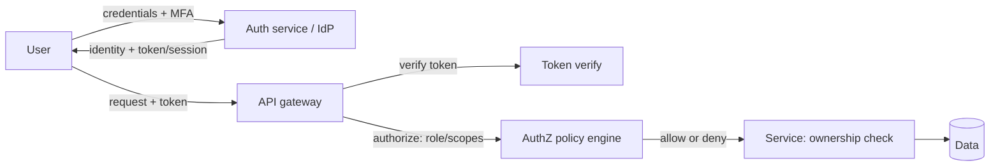

# Authentication vs Authorization

## 1. One-Line Definition
**Authentication (authN)** verifies *who you are*; **authorization (authZ)** decides *what you're allowed to do* — two separate steps where identity is established first and permissions are evaluated per action.

## 2. Why Do We Need It?
Security bugs most often come from conflating the two: "the user is logged in, so they can view this invoice" — but it's someone else's invoice (authN passed, authZ missing). Systems need a trustworthy identity layer (login, tokens, MFA) and a separate, enforced permission layer (roles, policies, ownership checks) evaluated on every protected action. Keeping them distinct is what makes a system auditable and least-privileged.

## 3. Simple Intuition
A hotel: the front desk checks your ID and gives you a room card (authentication — who you are). The card opens your room, the gym at certain hours, but not the penthouse or other guests' rooms (authorization — what you may access). Security fails if the desk hands out master keys (weak authN) or if the door opens for any valid card regardless of room (missing authZ). Two questions, two systems.

## 4. What Happens Without It?
- *AuthN missing/weak:* impersonation, credential stuffing, account takeover.
- *AuthZ missing/wrong:* the "logged-in = allowed" bug — IDOR (insecure direct object reference) leaks every user's data, privilege escalation, a normal user hitting an admin endpoint.
- *Confused together:* permissions embedded in sessions/JWTs without re-checking, so revocation can't take effect; role changes don't propagate; audits are impossible. Result: a breach that would have been blocked by one clean authZ check.

## 5. Core Idea
- **Authentication mechanisms:**
  - Password + hashing (store hashes with salt+work factor — never plaintext/reversible).
  - Multi-factor (TOTP, WebAuthn/passkeys, push) — something you know/have/are.
  - Federated identity via OAuth 2.0/OIDC (login with Google/enterprise SSO) — the IdP authenticates, your app trusts the assertion (see oauth-oidc-jwt).
  - Sessions (server-side state) vs tokens (stateless JWT) — trade revocation vs scalability.
- **Authorization models:**
  - *RBAC (role-based):* users → roles → permissions. Simple, standard for most apps (admin/editor/viewer).
  - *ABAC (attribute-based):* policies over attributes (department, region, sensitivity, time) — flexible, more complex.
  - *ReBAC / relationship-based:* permissions derived from relationships ("owner of this document," "member of this org") — Google Zanzibar-style; great for sharing/collaboration.
  - *Ownership checks:* the most common real-world authZ: `WHERE resource.owner_id = current_user_id` — must be enforced server-side, always.
- **Where enforcement lives:** server/API layer (never trust the client), a central policy engine (OPA/Cedar) or a library, checked on **every** request/action — ideally default-deny, with explicit permission checks. Deny by default, log decisions.
- **Principle of least privilege:** grant the minimum scope (an access token for `read:orders`, not `admin`); short-lived credentials; re-validate on sensitive actions.
- **The lifecycle:** authenticate → establish identity/session → authorize per action → revoke/refresh. Sessions/JWTs need a strategy for revocation (short TTLs, refresh tokens, denylist).

## 6. Important Terminology

| Term | Simple Meaning |
|------|----------------|
| Authentication (authN) | Verifying identity ("who are you") |
| Authorization (authZ) | Verifying permission ("what may you do") |
| MFA | Multiple factors of proof |
| Session | Server-side login state |
| Token / JWT | Portable credential carrying claims |
| RBAC / ABAC / ReBAC | Role / attribute / relationship-based access |
| IDOR | Accessing another's object by ID (missing authZ) |
| Least privilege | Minimum necessary rights |
| Default deny | Anything not explicitly allowed is blocked |
| Policy engine | Central service evaluating authZ rules |

## 7. Basic Architecture



## 8. Request or Data Flow
1. User authenticates (password+MFA or OIDC redirect) → receives session cookie or access/refresh tokens.
2. Request hits gateway → authN middleware validates token/session signature + expiry.
3. authZ evaluates policy for the route/action + resource; default deny; ownership checks inside the service (`owner_id = subject`).
4. Allow → process; deny → 403 (and audit-log the decision). No decision is made client-side.

## 9. Practical Example
**Collaborative docs app (assumptions):**
- AuthN: OIDC with Google Workspace + MFA; short-lived JWT (5 min) + refresh token.
- AuthZ: ReBAC — `viewer` can read, `editor` can edit, only `owner` can delete/share; enforced at the API on every `document_id` with an ownership/relationship check.
- Critical bug class prevented: changing `doc_id` in the URL to another user's doc → 403 (no object-level authZ = classic IDOR). The check is a single enforced path, auditable, default-deny.
- Admin actions are a separate role with a separate audit trail and MFA re-prompt ("step-up auth").

## 10. Scaling
- **Tokens scale statelessly** (JWT verified at the edge without a DB hit) but revocation is harder — mitigate with short TTL + deny-list for compromised tokens.
- **Sessions scale with a shared store** (Redis) — stateful but revocable.
- **Policy evaluation** at scale: cache decisions with a short TTL keyed by (subject, action, resource), or use a fine-grained authorization service with sub-ms checks (Zanzibar-style).
- **Multi-tenant:** scope every check by tenant; tenant isolation is an authZ concern, not just a data concern (see tenant-isolation).

## 11. Reliability and Failure Scenarios

| Failure | Happens | Detection | Recovery | Trade-off |
|---------|---------|-----------|----------|-----------|
| AuthN weak (no MFA) | Credential stuffing | Login anomaly detection | Add MFA, rate-limit | friction |
| Missing object authZ | IDOR data leak | Bug bounty/audit | Owner checks everywhere | dev effort |
| Token never expires | Stolen token forever | None by default | Short TTL + refresh + revoke | UX |
| Role creep | Over-permission | Access review | Least privilege, RBAC review | ops |
| IdP down | Nobody can log in | Health | Fallback auth / break-glass | security |
| Policy engine down | AuthZ unavailable | Health | Fail-closed for writes; cache | availability |

## 12. Consistency and Correctness
Identity and permissions can be *stale*: a user removed from a group still holds a valid JWT until it expires. Correctness requires deciding the acceptable staleness window (short TTLs) and re-checking high-risk actions ("step-up"). Never trust claims from the client — verify signatures and issuers; never put authZ decisions only in the UI.

## 13. Performance
Token verification is cheap (local signature check) vs a DB-backed session lookup; the trade is revocation. Fine-grained authZ can add a network hop — cache decisions and co-locate policy engine. MFA and step-up costs are UX, not latency — apply risk-based.

## 14. Security
- Store credentials hashed (bcrypt/argon2) with per-user salt; compare timing-safely.
- Tokens: short-lived, audience/issuer bound, encrypted or signed, transmitted only over TLS, stored securely (HttpOnly cookies vs JS-accessible storage).
- Default-deny, fail-closed on authZ errors; log all authN/authZ decisions for forensics; rate-limit auth endpoints; rotate secrets/keys.

## 15. Trade-Offs

| Choice | Advantages | Disadvantages | When to Use |
|--------|------------|---------------|-------------|
| Sessions | Easy revocation, server control | State store, scaling | Web apps, admin |
| Stateless JWT | Scale, no lookup | Hard revoke, size | APIs, microservices |
| RBAC | Simple, well-understood | Coarse | Most B2B apps |
| ABAC | Fine-grained, context-aware | Complex policies | Regulated/enterprise |
| ReBAC | Natural for sharing/collab | Newer tooling | Social/docs/orgs |
| Central policy engine | Consistent, auditable | Service to run | Large orgs/multi-tenant |

## 16. Common Mistakes
- Trusting client-side checks for authZ (hiding a button ≠ enforcing).
- Putting permissions in JWT claims and never re-checking → privilege persists after revocation.
- Conflating login with permission (any authenticated user → full access).
- Forgetting object-level ownership checks (IDOR — the top real-world API bug).
- Permanent tokens / never expiring sessions; no MFA on admin.

## 17. HLD vs LLD Boundary
HLD: identity provider + MFA strategy, session vs token, authZ model (RBAC/ABAC/ReBAC), default-deny + object checks, revocation/staleness policy, audit. LLD: token signing/verify code, middleware, policy rules, hashing library choice, step-up triggers.

## 18. Interview Questions

### Beginner
- AuthN vs authZ with a concrete hotel/login example.
- Why is "the user is logged in" not sufficient for access control?

### Intermediate
- Design authN/authZ for a multi-tenant SaaS: login, token/session choice, roles vs ownership checks, and revocation.
- A report says users can see others' orders by changing an ID. Diagnose the class of bug and design the fix and prevention.

### Advanced
- Design fine-grained authorization (ReBAC) for a Google-Docs-like product at 100k QPS with cached decisions and tenant isolation; include the audit trail.
- JWT vs server sessions at 1M active users with instant logout requirements — design the compromise (short TTL, deny-list, refresh rotation) and its failure modes.

## 19. Interview Memory Summary

> [!abstract]- Interview Memory Summary

### Remember

- AuthN = identity, authZ = permission; separate layers.
- Enforce authZ server-side with default-deny + object-level ownership on every action.
- RBAC → ABAC → ReBAC as granularity grows.
- Credentials stored hashed; MFA on high-risk; least privilege.
- Sessions vs tokens is revocation-vs-scale — manage the staleness window.
- Never trust the client; a hidden button is not enforcement. Log all authN/authZ decisions.

### 30-Second Explanation

Establish identity (MFA/OIDC), issue short-lived credentials, then check permissions on *every* action with default-deny and an ownership check — never trust the client, and log the decisions.

### Interview Traps

- Automatically granting all authenticated users access, or checking permissions only in the UI — the interviewer's next question is always "what prevents me from calling the API directly?"
- Conflating login with permission (any authenticated user → full access).
- Skipping object-level ownership checks — IDOR is the top real-world API bug.
- Permanent tokens / never-expiring sessions; no MFA on admin.

### Key Trade-Off

Sessions are revocable but need a shared state store; stateless JWTs scale but hold stale permissions until expiry — the whole design trades revocation speed against scalability, and you manage it with short TTLs, refresh rotation/deny-lists, and re-checking high-risk actions.

## 20. Related Concepts

### Prerequisites

- [[http-and-https|HTTP and HTTPS]]

### Commonly Used Together

- [[oauth-oidc-jwt|OAuth 2.0 / OIDC / JWT]]
- [[web-vulnerabilities|Web Vulnerabilities]]
- [[encryption-and-keys|Encryption and Keys]]

### Alternatives

- [[stateless-vs-stateful-services|Stateless vs Stateful Services]] (sessions vs tokens — where authN state lives)

### Advanced Concepts

- [[rate-limiter|Rate Limiter]] (hardening the authN surface against credential stuffing)

Related planned topics (not authored yet): Access Control, Tenant Isolation.

## 21. References
OWASP Authentication Cheat Sheet + Authorization Cheat Sheet, NIST RBAC/ABAC guidance, Google Zanzibar paper (ReBAC), OWASP API Security Top 10 (IDOR). Verify specifics pre-interview.

## 22. Active Recall

Test yourself before revealing each answer.

> [!question]- What is the difference between authentication and authorization?
> Authentication (authN) verifies *who you are* — identity (login, MFA, tokens). Authorization (authZ) decides *what you're allowed to do* — permissions evaluated per action. Identity is established first; permissions are then checked on every protected action.

> [!question]- Why is "the user is logged in" not enough for access control?
> Login only proves identity (authN). It says nothing about permission (authZ): the invoice might belong to someone else, or the user has viewer rights hitting an admin endpoint, so "logged in = allowed" is the core IDOR/privilege-escalation bug. Permissions must be evaluated per action with default-deny.

> [!question]- What is IDOR and what design prevents it?
> Insecure Direct Object Reference: changing an ID in a URL/request accesses another user's object because only login was checked (e.g., doc_id swap). Prevention: enforce ownership checks server-side on every object access (`WHERE resource.owner_id = current_user_id`), default-deny, never trust the client.

> [!question]- Sessions vs stateless JWT — what's the core trade-off?
> Sessions are revocable (server-side state, instant) but need a shared store. JWTs scale (verified at the edge, no DB hit) but can't be revoked until expiry — a removed user's token still works. Trade-off: revocation speed vs scaling+staleness window; mitigated by short TTLs, refresh rotation, deny-lists.

> [!question]- How do you choose between RBAC, ABAC, and ReBAC?
> RBAC (roles → permissions) is simple and standard for most B2B apps. ABAC (attribute-based policies) when decisions depend on attributes like department/region/time — flexible but complex. ReBAC (relationship-based, Zanzibar-style) when permissions derive from relationships ("owner of this doc", "member of this org") — natural for sharing/collaboration.

> [!question]- Why are object-level ownership checks considered the most critical authZ enforcement?
> Because they defeat IDOR, the top real-world API bug. Global role checks (is this user admin?) are coarse; the question "does *this* user have rights to *this* resource?" can only be answered per-object. Skip it and any logged-in user can scan other users' IDs. Build it into every resource-serving service, default-deny, audited.

> [!question]- A user removed from a group keeps accessing the group's data via a valid JWT. Diagnose and fix.
> The permission was captured in the JWT at issuance and is now stale — the token isn't re-checked, so revocation lags the TTL. Fix: short access-token TTLs, revoke refresh tokens, re-verify for high-risk actions (step-up), and/or check authZ live per request instead of trusting long-lived claims.

> [!question]- The IdP or policy engine is down. What breaks, and what's the recovery?
> AuthN down: nobody can log in — recovery via health checks, fallback/break-glass auth, cached refresh. AuthZ engine down: decisions unavailable — fail-closed for writes, cache decisions with short TTLs, monitor. Trade-off is availability vs security: failing open risks data access, failing closed risks outage.

> [!question]- Interview scenario: design authN/authZ for a multi-tenant SaaS (login, token/session choice, roles vs ownership, revocation).
> AuthN: OIDC + MFA, short-lived JWT (5 min) + rotating refresh token. AuthZ: RBAC for route-level roles + ReBAC/ownership checks on every `tenant_id`/`doc_id`; enforce at the API layer, default-deny, scope every check by tenant. Revocation: short TTL + deny-list + refresh rotation; step-up auth + separate audit trail for admin. Never trust client-side or long-lived claims.

> [!question]- "We hid the button in the UI, so users can't do that." Why is this wrong?
> Hiding a button is UX, not enforcement — an attacker calls the API directly. AuthZ must be enforced server-side on every request: policy evaluation, ownership checks, default-deny, and logged decisions. The "what prevents me from calling the API directly?" test is how you spot UI-only checks.

## 23. When Should I Use This?

### Use it when

- Any system with users, accounts, or protected resources needs an access model.
- You must enforce default-deny, least-privilege access and audit decisions.
- Multi-tenant SaaS needs per-tenant/object-level isolation (authZ is a data-concern too).
- You're choosing between sessions and tokens for an API-facing product.
- Regulated/enterprise contexts need RBAC/ABAC and clear revocation semantics.

### Avoid it when

- The protected resource is genuinely public with no per-user state.
- You can fully outsource identity to an IdP *and* have no intra-app authZ needs.
- The team conflates login with permission and won't build a separate enforcement layer (authN-only design leaks).
- You need instant global revocation but are unwilling to run sessions or deny-lists.

### What problem does it solve?

Users need identity (who) and permissions (what). The problem: treating "logged in" as "allowed" leaks data via IDOR and privilege escalation. The bottleneck: identity alone cannot express per-action/resource permission. The solution: an identity layer (authN) plus a separate, enforced, default-deny permission layer (authZ) checked on every action with ownership checks and least privilege.

### What problem does it NOT solve?

Transport security (TLS), cryptography and key handling, and application-layer bugs like XSS/CSRF that steal or forge identity. It also doesn't give you revocation *instantaneously* — the staleness window (token TTL/session store) must still be engineered.

## 24. Decision Connections

Decisions that go together with Authentication vs Authorization:

- [[oauth-oidc-jwt|OAuth 2.0 / OIDC / JWT]] — the standard way to federate authN and issue scoped tokens that authZ then evaluates.
- [[web-vulnerabilities|Web Vulnerabilities]] — XSS/CSRF/IDOR are how authZ gaps become breaches; authN can't fix them.
- [[encryption-and-keys|Encryption and Keys]] — credentials must be hashed (not encrypted), tokens transmitted over TLS and stored securely.
- [[rate-limiter|Rate Limiter]] — throttles credential stuffing and brute force on the authN surface.
- [[http-and-https|HTTP and HTTPS]] — cookies, headers, and TLS transport that carry identity safely.
- [[stateless-vs-stateful-services|Stateless vs Stateful Services]] — the session-vs-token decision that constrains revocation and scaling.

Decision tree:

```
Need to identify and authorize users in a system?
    |
    +-- Is the resource fully public / no users?
    |      → skip auth, focus on rate limiting + CSRF only
    |
    +-- Need to verify who the user is (login)?
    |      → [[authentication-vs-authorization|Authentication vs Authorization]] — authN layer
    |         +-- In-house accounts + MFA?  → own user store, hashed credentials
    |         +-- Outsource identity?        → [[oauth-oidc-jwt|OAuth 2.0 / OIDC / JWT]] / SSO
    |
    +-- Need to carry identity between requests?
    |      +-- Instantly revocable, stateful? → server sessions
    |      +-- Scale at the edge, stateless?  → short-lived JWT + refresh rotation
    |      → see [[stateless-vs-stateful-services|Stateless vs Stateful Services]]
    |
    +-- Need to decide who may do what per action?
    |      → [[authentication-vs-authorization|Authentication vs Authorization]] — authZ layer
    |         +-- Coarse roles?                → RBAC
    |         +-- Attribute-dependent access?  → ABAC
    |         +-- Sharing/relationship access? → ReBAC + ownership checks
    |         +-- Always: default-deny + per-object ownership checks + audit
    |
    +-- Hardening the login surface?
           → [[rate-limiter|Rate Limiter]]
           → [[web-vulnerabilities|Web Vulnerabilities]] (SSRF/XSS/CSRF posture)
           → [[encryption-and-keys|Encryption and Keys]] (TLS, hashing, token storage)
```