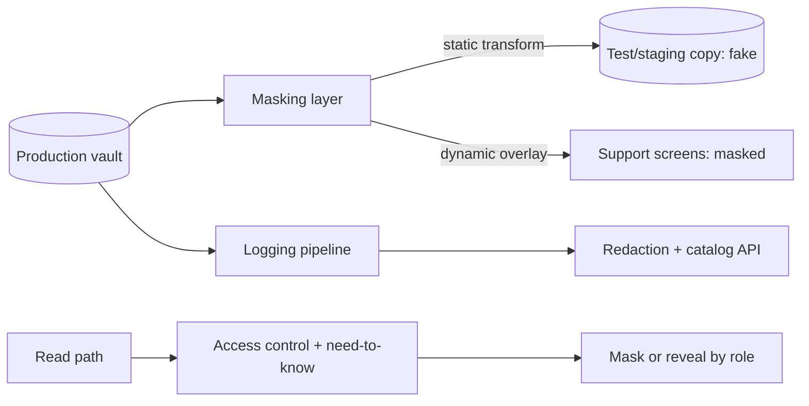

# Data Masking and Privacy

## 1. One-Line Definition
Data masking replaces or obscures sensitive values (names, emails, payment cards, logs, test data) so that only people with a genuine need — and only systems authorized to see them — can view the real values, without changing the shape/structure of the data for the rest of the stack.

## 2. Why Do We Need It?
Sensitive data (PII, cards, credentials, tenant business data) multiplies as it flows: production, staging, QA, analytics, support screens, third-party tooling, log pipelines. Every copy is a breach surface. Masking reduces the surface — dev sees `jo**@gmail.com`, not the real email; support sees a card's last 4, forever; a leaked backup of staging data leaks nothing real. It's also the privacy/regulatory requirement (see [[data-residency|Data Residency and Sovereignty]] for the geography angle): show me only what my role needs, and retain only what's required.

## 3. Simple Intuition
A hospital doesn't put full names on every door and board — it shows "Room 4, patient #12." The nurse knows the name; the janitor doesn't need it. Masking is that exact system for your data: the real values live in the vault; what surfaces to most people and systems is a purpose-built, need-to-know view.

## 4. What Happens Without It?
One careless query dumps customer emails/PII to a support agent screen, a logging example leaks a card, a staging DB copy with real emails gets compromised, an analytics export ends up in a shadow bucket, and everyone who "needed it to debug" has full access. The cost: regulatory fines (GDPR/PCI/HIPAA), reputational damage, and — even without breaches — a system where the value of personal data can't be contained because it's replicated everywhere as plaintext.

## 5. Core Idea
- **Masking is applied per-data-attribute, per-context:** the requirement differs by whether you're showing a screen, exporting to analytics, or seeding a test DB. The same field can be masked once, kept real elsewhere.
- **Techniques:**
  - *Static masking:* transform a real dataset into anonymized copy (test/staging/analytics) — values replaced once, at rest.
  - *Dynamic masking:* mask at read time (e.g., overlay rules in the query/UI layer): support sees `•••• 4242`, never the full card.
  - *Tokenization:* replace PII with random tokens; the mapping lives in a protected vault (the only place the real value exists) — the strongest form for card data.
  - *Format-preserving:* keep shapes (email-like, phone-like) so test data still behaves, while the values are fake.
  - *Redaction/truncation:* strip or shorten in waterfalls (logs, errors, support artifacts).
- **Need-to-know principle:** the same least-privilege idea as [[access-control|Access Control (RBAC / ABAC / Least Privilege)]] applied to data visibility — mask is the enforcement of "you may see this field at this granularity."
- **Redaction at the edge of every pipeline:** logs, traces, errors, and support exports are where real values leak most often (see the logging discipline in [[logging|Structured / Centralized Logging]]).
- **Separate the vault:** real values centralized (KMS/encrypted store with access control and audit); surfaces receive only masked/tokenized views.

## 6. Important Terminology

| Term | Simple Meaning |
|------|----------------|
| PII | Personally identifiable information |
| Static masking | Transform a full dataset copy at rest |
| Dynamic masking | Mask at read/display time |
| Tokenization | Replace value with a random token kept in a vault |
| Format-preserving | Fake values that keep shape/validity |
| Redaction | Removing/truncating value from output |
| Need-to-know | Only who must see real values does |
| Data classification | Tagging fields by sensitivity |
| Right-to-erasure | GDPR: delete or make data unrecoverable |
| Cryptographic erasure | Delete the key → data unrecoverable (see [[encryption-and-keys|Encryption and Keys]]) |

## 7. Basic Architecture



## 8. Request or Data Flow
1. A support agent loads an order; the service asks the masking layer "what granularity does this role get on field `email`?"
2. The answer is `whole` if the role is allowed, else masked (e.g., `jo**@gmail.com`) or token view only.
3. For staging: a nightly job pushes prod → masking transform → fake dataset; the fake copy never contains real PII, but shapes/types survive.
4. Analytics: PII columns replaced with tokens or aggregates before the warehouse (see [[data-warehouse-lake|Data Warehouse and Data Lake]]).
5. Log/system events: redaction rules strip emails/cards/password-shaped values before the event ever reaches the log store.

## 9. Practical Example
**Fintech support flow (assumptions):**
- Card numbers tokenized at ingestion; the vault holds the mapping; the app never re-sees the full PAN after first use.
- Log redaction regexes and an API that masks emails before the log line is written — nothing reaches ELK with a real email.
- Staging is a nightly masked copy: emails become `user<pk>@sample.dev`, cards become random-but-valid Luhn digits; developers can debug against realistic data without touching real PII.
- Audit: every read of the token vault is logged; a support agent who typed a full card into a support note is flagged via redaction screening → the note never stores the number.

## 10. Scaling
- **Rule centralization:** masking policies in one place (data-classification catalog) rather than per-service, so "email is high sensitivity" is one decision, not a thousand.
- **Pipeline coverage:** every copy of prod (test, analytics, DR, backups, third-party) must be a declared surface; unknown shadow copies are the real risk. Inventory them.
- **Token vault as a hot path:** vault lookups per masked read scale with reads — cache the token↔value mapping with strict access control, or move to format-preserving deterministic tokens to avoid per-read lookups.
- **Dynamic masking at query time** can be slow on large scans — push masking into the application/DB layer (views, row-level security), not a per-row overlay.

## 11. Reliability and Failure Scenarios

| Failure | What Happens | Detection | Recovery | Trade-off |
|---------|--------------|-----------|----------|-----------|
| Token vault down | Masked reads fail | Health/error rates | Cache + HA vault | staleness |
| Redaction rule misses | Real value in log | Secret scan / screening | Fix rule, scrub | lag |
| Masking rule wrong | Under-masked (leak) or over-masked (broken) | E2E tests | Process-of-record test suite | effort |
| Unmasked raw copy discovered | Full exposure | Data inventory | Isolate + delete | discovery lag |
| Staging leak | Fake data — low harm | Incident review | Confirm fakes, re-run masking | reputation |

## 12. Consistency and Correctness
Masking must be **deterministic and role-stable**: the same person in the same role sees the same what-for (or a consistent masked form), otherwise debugging breaks. Tokenization mapping must be exactly consistent across systems that share an identity (the same customer in two services should carry correlated masked form). Redaction must be applied before persistence, not at display — a "client-side masking" that lets the full value reach the browser or log is theater. Masked copies must preserve joinability and format so tests and analytics still work.

## 13. Performance
Tokenization adds a vault lookup per value on reads when mapping isn't cached — a real cost at 10k+s reads/s; use deterministic format-preserving tokens where possible. Static masking is a batch cost (nightly ETL), cheap. Dynamic masking at display is negligible. The engineering cost is mostly the policy catalog and the test coverage that verifies every surface.

## 14. Security
The masking system is itself a crown jewel: the token vault and the "true value" store must be protected like the keys in [[encryption-and-keys|Encryption and Keys]] (access control, audit, encryption at rest). The redaction/reveal decision is an authorization decision — enforce it server-side (never trust client masking). For GDPR right-to-erasure on immutable stores, [[encryption-and-keys|Encryption and Keys]] cryptographic erasure is the complement: delete the key and the token mapping to make data unrecoverable.

## 15. Trade-Offs

| Choice | Advantages | Disadvantages | When to Use |
|--------|------------|---------------|-------------|
| Static masking | Zero runtime cost, true copies | Batch snapshot staleness | Test/analytics copies |
| Dynamic masking | Real data, role-granular | Per-read overhead, policy upkeep | Support/dev screens |
| Tokenization | Strongest (real value isolated) | Vault hot path, mapping ops | Cards, super-PII |
| Format-preserving | Joins preserve, looks real | Slightly weaker than random tokens | Test realism |
| Redaction in pipeline | Cheap, catches leaks early | Rule gaps, false positives | Logs/errors/exports |

## 16. Common Mistakes
- Masking "at display only" while the real value rides in the API/network/log.
- Shadow copies of prod never inventoried — the ungoverned "quick export" with real emails.
- One global mask rule where need-to-know differs by role/context.
- Token vault as a single shared secret, unauthed, unaudited.
- Redaction by regex only — misses nested/encoded values; combine with schema-aware field rules.
- Forgetting third-party tooling (support, analytics, BI) gets the full data stream.

## 17. HLD vs LLD Boundary
HLD: data classification policy, masking-vs-tokenization strategy per sensitive field, static/dynamic masking architecture, vault placement + availability, redaction policy for all pipelines, staging/analytics copy policy, need-to-know authorization for reveal. LLD: the masking function/algorithm, redaction regexes and field rules, token-vault API and cache, masking transforms in ETL jobs, per-role reveal logic.

## 18. Interview Questions

### Beginner
- Static vs dynamic masking — one line each.
- What's the difference between masking and encryption?

### Intermediate
- Design data masking for a support system where agents must see enough to help, but never the full card number.
- What does a "masked ready" staging copy need so developers can debug without PII?

### Advanced
- You must support GDPR right-to-erasure on immutable object storage. Design it with [[encryption-and-keys|Encryption and Keys]] and tokenization.
- Design the masking rule catalog so one misconfiguration can't silently leak a whole class of PII fleet-wide.

## 19. Interview Memory Summary

> [!abstract]- Interview Memory Summary

### Remember

- Masking = need-to-know enforcement on data visibility.
- Static = full-copy transform at rest; dynamic = at read time; tokenization = value moved to a vault.
- Format-preserving keeps test/analytics realistic.
- Redaction happens before persistence, not at display — client to logs.
- Masking decisions are authorization decisions (server-side, role-based).
- Every copy of prod (test, analytics, DR, backups, third-party) is a surface — inventory them.
- Cryptographic erasure (delete key) makes data unrecoverable for GDPR.

### 30-Second Explanation

Classify sensitive fields once, then apply consistent per-context treatments: static masking for copied environments, dynamic masking and tokenization for real-data surfaces, redaction in every log/pipeline — with the true values confined to a protected, audited vault and reveal decided by need-to-know server-side — so most of the fleet and most copies never carry real PII at all.

### Interview Traps

- "We mask at display" while the real value rides the wire — masking must be at data boundaries.
- Not inventorying shadow copies — an ungoverned export is still a plaintext surface.
- Tokenization vault as an unaudited fast-path.
- Redaction losing the joins — format-preserving protects analytics/debugging.

### Key Trade-Off

Data masking trades operational overhead (catalog upkeep, vault lookups, transform jobs) plus some debugging convenience for a dramatically smaller real-PII blast radius — most systems, copies, and pipelines operate on masked data, and the true values exist only where genuinely needed.

## 20. Related Concepts

### Prerequisites

- [[encryption-and-keys|Encryption and Keys]]
- [[access-control|Access Control (RBAC / ABAC / Least Privilege)]]

### Commonly Used Together

- [[logging|Structured / Centralized Logging]] (redaction in pipelines)
- [[data-residency|Data Residency and Sovereignty]]
- [[tenant-isolation|Tenant Isolation / Audit Trails / Zero Trust]]

### Advanced Concepts

- [[encryption-and-keys|Encryption and Keys]] (cryptographic erasure, token vault protection)
- [[data-warehouse-lake|Data Warehouse and Data Lake]] (masked/tokenized analytics feed)

Related planned topics (not authored yet): differential privacy, GDPR/PII classification taxonomy.

## 21. References
OWASP Data Protection Cheat Sheet, NIST Privacy Framework, GDPR Article 5 (storage limitation) and right-to-erasure. Verify current regulatory interpretation pre-interview.

## 22. Active Recall

Test yourself before revealing each answer.

> [!question]- Static vs dynamic masking — what differs?
> Static masking transforms a whole dataset copy once, at rest (test/staging/analytics never contain real values). Dynamic masking masks at read/display time against the real store, per role (support sees `•••• 4242` while the value exists in the vault). Static is for copies; dynamic is for real-data surfaces.

> [!question]- Masking vs encryption — same goal?
> No. Encryption protects data at rest/in transit so a leak is ciphertext, but decryption keys can exist and data stays recoverable. Masking reduces the value copied elsewhere: test, analytics, and most screens simply never see the real value at all. They compose — encrypt the vault, mask everywhere else.

> [!question]- Design masking for a support agent who needs to help but never see a full card.
> Keep the card tokenized at ingestion (real PAN only in the vault). Surface agent views with dynamic masking: full value replaced by last-4 plus issuer, token view when needed for matching, never the PAN. The vault read is itself an audited, need-to-know-authorized event; the agent's own screens and any pasted logs are redacted so the number never persists.

> [!question]- What does a reliable masked staging copy need for debugging?
> Realistic shape and joinability without real values: format/type-valid fakes (email-like, valid-Luhn cards), retained referential integrity across tables, and masked-but-unique identifiers so joins and tests behave like prod. Everyone's debugging works because the shape is right; nothing real leaks because the values are all fake.

> [!question]- GDPR right-to-erasure on immutable object storage — how?
> Store each object's PII under a per-user encryption key (or store PII values tokenized with a per-user token). "Erasure" = delete that user's key/token mapping — cryptographic erasure — which makes the immutable blob's copy unreadable though the bytes persist. It's the same mechanism as [[encryption-and-keys|Encryption and Keys]] crypto-shredding; your compliant answer is "unrecoverable," not "physically deleted."

> [!question]- One masking misconfiguration leaks a class of PII fleet-wide. What's the systemic fix?
> Centralize masking policy as code in a classification catalog, enforce at the data boundary which fails closed (no rule → mask), version and review policy changes in CI, run scrape/scan jobs that assert no real PII appears in logs/staging/warehouse, and make the reveal path an audited authorization decision — not a "which env am I in" branch.

## 23. When Should I Use This?

### Use it when

- You process PII/cards/credentials and the data replicates into dev, staging, analytics, or third-party tools.
- Support staff or low-trust helpers need enough data to work without full values.
- Compliance (GDPR, PCI, HIPAA) demands minimization and erasure.
- You ship observability and need logs/errors to stay clean of PII.

### Avoid it when

- No replication, no third-party surfaces, single region — masking is still typically worth it, but the needle is smaller.
- You cannot sustain a classified policy catalog — an ungoverned mask is worse than none when it's wrong silently.
- The real value must be available everywhere with no role distinction (rare, and usually a sign of over-privileged design).

### What problem does it solve?

Personal and card data proliferates into dev, staging, analytics, logs, and third-party tooling, each copy a plaintext breach surface — and regulators demand minimization plus erasure. Data masking confines real values to a need-to-know, audited vault with masked/tokenized/redacted views everywhere else, caps the blast radius of any single dump, and makes erasure achievable.

### What problem does it NOT solve?

It doesn't protect data *before* your masking/de-identification layer (the source still carries real values), doesn't stop an over-privileged user from reading what they're allowed to read (that's [[access-control|Access Control (RBAC / ABAC / Least Privilege)]]), and deterministic/format-aware masking is not full anonymity — it needs to be treated as protection, not a substitute for access control or breach response.

## 24. Decision Connections

Decisions that go together with data masking and privacy:

- [[encryption-and-keys|Encryption and Keys]] — the vault's encryption; tokenization and crypto-erasure live here.
- [[access-control|Access Control (RBAC / ABAC / Least Privilege)]] — reveal-by-role is an authorization decision.
- [[logging|Structured / Centralized Logging]] — redaction before persistence keeps logs PII-clean.
- [[data-residency|Data Residency and Sovereignty]] — geography of where real PII may live.
- [[tenant-isolation|Tenant Isolation / Audit Trails / Zero Trust]] — per-tenant masking posture.
- [[data-warehouse-lake|Data Warehouse and Data Lake]] — analytics receive masked/tokenized rather than raw PII.

Decision tree:

```
How must sensitive values flow through the system?
    |
    +-- Copies for test/staging/analytics?
    |      → static masking (format-preserving) → no real PII in copies
    |
    +-- Real-data surfaces with role distinctions?
    |      → dynamic masking + tokenization + need-to-know reveal
    |      → enforce server-side, never trust client masking
    |
    +-- Logs / errors / exports?
    |      → redaction rules before persistence
    |
    +-- Strongest guarantee / cards?
    |      → tokenization, real value only in the vault
    |
    +-- Erasure requirement?
    |      → per-user key/token → cryptographic erasure ([[encryption-and-keys|Encryption and Keys]])
    |
    +-- Governance?
           → classification catalog, policy-as-code, scrape-and-assert audits
```