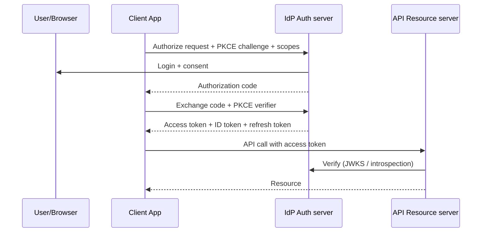

# OAuth 2.0, OIDC, JWT, and Refresh Tokens

## 1. One-Line Definition
OAuth 2.0 is an authorization framework that lets an app obtain limited access to a user's resources without their password (via access tokens); **OIDC** adds an identity layer (an ID token proving *who* the user is) on top; **JWT** is a common token format; **refresh tokens** obtain new access tokens without re-login.

## 2. Why Do We Need It?
Sharing passwords with third parties is a disaster (you give full control and untraceable access). OAuth solves it with delegated, scoped, revocable access: "this app may read your calendar, and you can revoke it." OIDC then answers the login question ("who is this user") in a standardized way, enabling SSO. Together they are the backbone of modern login and API access — but they're frequently misunderstood, which produces real vulnerabilities.

## 3. Simple Intuition
A valet key: your car's valet key opens the door and starts the engine but not the trunk, and you can revoke it. OAuth is the valet-key system for APIs — the app gets a limited key (access token) instead of your master password. OIDC is the valet *also* confirming your name badge ("you are indeed Jane"), so the app knows who it's serving. The refresh token is the spare valet key you keep, swapped for a new short-lived one when the first gets old.

## 4. What Happens Without It?
Password sharing/anti-patterns: apps ask for your Google password (phishing heaven), access can't be scoped or revoked, and a breach of one app leaks your master credential. Custom login systems reinvent authN, forget MFA/SSO, and create account-takeover bugs. Without OIDC, integration with enterprise identity (Okta, Azure AD) becomes bespoke and fragile. Without refresh tokens, users are either logged out constantly (short tokens) or hold long-lived secrets (dangerous).

## 5. Core Idea
- **The actors:** *Resource owner* (user), *client* (app), *authorization server* (IdP — issues tokens), *resource server* (API validating tokens).
- **OAuth 2.0 flows (grants):**
  - **Authorization Code + PKCE** — the modern default for web/mobile: user authenticates at the IdP, app gets a short-lived code, exchanges it (with PKCE verifier) for tokens. PKCE prevents code interception.
  - **Client Credentials** — machine-to-machine, no user.
  - *(Deprecated/legacy: Implicit, Resource Owner Password — avoid; Implicit leaks tokens in URLs, ROPC collects passwords.)*
- **Tokens:**
  - **Access token** — short-lived (~minutes–hour), server-side credential for API calls; often a JWT but can be opaque (introspection).
  - **Refresh token** — longer-lived, used at the token endpoint to get new access tokens; must be stored securely and rotated.
  - **ID token (OIDC)** — a JWT assertion about the authenticated user (identity), for the *client* to consume, not for calling APIs.
- **JWT structure:** `header.payload.signature`, base64url-encoded. Header (alg, typ), payload (claims: `sub`, `iss`, `aud`, `exp`, `iat`, scopes/roles), signature (signed, and optionally encrypted with JWE). Critical rules: **verify the signature** (with the right key/alg; reject `alg=none` and confusion attacks), validate `iss`/`aud`/`exp`/`nbf`, and never treat the payload as secret (it's readable).
- **Scopes vs claims:** scopes are requested/authorized permissions (`read:orders`); claims are assertions in the token. Authorization decisions still belong on the server (see authentication-vs-authorization).
- **OIDC specifics:** discovery (`/.well-known/openid-configuration`), ID token + UserInfo endpoint, JWKS for key rotation, standardized scopes `openid profile email`.
- **PKCE:** the client creates a random verifier, sends its hash (challenge) with the authorization request, then the verifier with the code exchange — an interceptor with the code can't use it.

## 6. Important Terminology

| Term | Simple Meaning |
|------|----------------|
| OAuth 2.0 | Delegated authorization framework |
| OIDC | Identity layer (login) on OAuth |
| Access token | Short-lived API credential |
| Refresh token | Long-lived token to renew access |
| ID token | JWT proving the user's identity |
| Scope | Requested permission string |
| Claim | Statement inside a token |
| Authorization Code | One-time code exchanged for tokens |
| PKCE | Code-intercept protection for public clients |
| JWKS | Published public keys to verify JWTs |
| JWT | Signed token format (header.payload.signature) |

## 7. Basic Architecture



## 8. Request or Data Flow
1. App redirects the user to the IdP with `client_id`, `redirect_uri`, scopes, and PKCE challenge.
2. User authenticates (MFA) and consents; IdP redirects back with a one-time **code**.
3. App exchanges code + verifier at the token endpoint → gets access/ID tokens (+refresh token).
4. App calls APIs with `Authorization: Bearer <access token>`; API verifies signature/claims (or introspects).
5. Access token expires → app uses refresh token (rotated) to get a new one; no user interaction.
6. Revocation: user/IdP revokes → refresh fails and/or tokens denied (plus short TTL limits the window).

## 9. Practical Example
**SaaS with "Sign in with Google" + enterprise SSO (assumptions):**
- OIDC Authorization Code + PKCE; access token JWT TTL 10 min; refresh rotation on every use (old refresh invalidated).
- API gateway verifies JWTs via JWKS (cached, refreshed on `kid` rotation), checks `aud` = API, `iss` = IdP.
- A leaked access token is useless in ~10 min; a leaked refresh token is detected by rotation-anomaly (reuse of an old refresh invalidates the family and alerts).
- Enterprise tenant uses SAML/OIDC SSO with the same app — the app never stores passwords.

## 10. Scaling
- **JWT verification scales** (local crypto, cached JWKS) — no per-request IdP lookup; opacity/introspection scales worse (network hop per call).
- **IdP is a dependency:** cache JWKS and OIDC discovery; plan for IdP outage (fail-closed for auth; consider break-glass admin login).
- **Refresh token storage** for many users/devices is stateful — store hashed, indexed, and per-device so revocation is targeted.
- **Token size:** JWTs travel on every request; fat claims (many roles) bloat headers — keep access-token claims minimal, fetch more server-side if needed.

## 11. Reliability and Failure Scenarios

| Failure | Happens | Detection | Recovery | Trade-off |
|---------|---------|-----------|----------|-----------|
| IdP down | Users can't log in | Health/error rate | Retry, cached sessions, break-glass | security |
| Expired access token | API 401s | Client metrics | Silent refresh + retry once | complexity |
| Refresh token stolen | Long-lived access | Rotation anomaly | Revoke family, re-auth | detection cost |
| JWKS key rotation | Signature verify fails | Verify errors | Cache refresh on `kid` | brief failures |
| Wrong redirect_uri validation | Token leak | Security test | Strict allow-list | none |
| Revoked user still valid | Access window | — | Short TTL / introspection | latency |

## 12. Consistency and Correctness
Tokens are *assertions at issuance time* — permissions in a JWT can be stale for its TTL. Prefer short access tokens and re-verify sensitive actions; don't encode critical authorization in long-lived tokens. Validate *all* claims (alg, iss, aud, exp, nbf, nonce for OIDC). On logout, revoke the refresh token and (if possible) the session; access tokens may remain valid until expiry — plan for that window.

## 13. Performance
JWT verify ≈ microseconds; introspection is a round-trip per call (use only for opaque/high-security tokens). PKCE and code exchange are one-time login costs. Keep JWKS cached and refresh asynchronously. Avoid putting huge role lists in tokens; keep them small and stable.

## 14. Security
- **Never** use Implicit/ROPC for new systems; use Code + PKCE.
- Validate `state` (CSRF) and PKCE; strict `redirect_uri` allow-list; use `nonce` in OIDC.
- Never store tokens in localStorage if avoidable (XSS risk) — prefer HttpOnly Secure SameSite cookies or platform secure storage; if unavoidable, harden XSS (see web-vulnerabilities).
- Reject `alg=none`, verify the algorithm is the expected one, and use the IdP's JWKS (never a key from the token).
- Rotate refresh tokens and detect reuse (token family revocation); store refresh tokens hashed server-side; bind to client where possible (DPoP/mTLS is emerging).
- ID token ≠ access token: don't send ID tokens to APIs as bearer credentials (a common bug).

## 15. Trade-Offs

| Choice | Advantages | Disadvantages | When to Use |
|--------|------------|---------------|-------------|
| Opaque access token | Easy revoke, introspection | Network hop | High-security/high-revocation |
| JWT access token | Stateless, fast | Hard revoke, size | Microservices, scale |
| Long access TTL | Fewer refreshes | Stolen token lives long | Rare — avoid |
| Short access + refresh | Revocation window small | More token-endpoint traffic | Default for user apps |
| PKCE (public clients) | No secret needed, safe | Slight extra step | SPA/mobile |
| IdP federation (OIDC) | SSO, MFA, no passwords | IdP dependency | Almost always |

## 16. Common Mistakes
- Confusing OAuth (authorization) with OIDC (authentication) and using an *access* token as proof of identity.
- Not validating JWT signature/claims (accepting unsigned or wrong-issuer tokens).
- Putting sensitive data in the JWT payload (it's readable) or trusting claims as authoritative forever.
- Storing tokens in localStorage with a XSS hole; or logging tokens.
- No refresh rotation / no revocation → stolen refresh token = permanent access.
- Using deprecated Implicit flow.

## 17. HLD vs LLD Boundary
HLD: OAuth/OIDC architecture, grant selection, token lifetimes + rotation, IdP federation/SSO, token validation strategy (JWKS vs introspection), revocation policy. LLD: PKCE implementation, state/nonce handling, JWKS caching, refresh logic, secure token storage, claim validation code.

## 18. Interview Questions

### Beginner
- OAuth vs OIDC: what does each do?
- What are access, ID, and refresh tokens for?

### Intermediate
- Walk the Authorization Code + PKCE flow end to end, naming what each artifact protects against.
- How do you validate a JWT correctly on the API? List the checks.

### Advanced
- Design login + API auth for a multi-device SaaS: token lifetimes, refresh rotation/reuse detection, revocation, and IdP outage handling.
- A frontend stores tokens in localStorage and the app has XSS. Describe the full compromise chain and the hardened redesign (cookie posture, CSRF, nonce, rotation).

## 19. Interview Memory Summary

> [!abstract]- Interview Memory Summary

### Remember

- OAuth = delegated authorization; OIDC = identity layer on top.
- Authorization Code + PKCE is the modern flow; avoid Implicit/ROPC.
- Access token short-lived; refresh token long + rotated; ID token just for identity.
- JWT must be signature + claim validated (iss/aud/exp/alg); payload is readable, never secret.
- Authorization decisions still belong server-side — never treat a login as permission.
- Rotate refresh tokens and detect reuse; store them hashed; validate state, nonce, redirect_uri.

### 30-Second Explanation

Redirect the user to the IdP (OIDC), exchange the code securely with PKCE, receive short-lived access + refresh + ID tokens, validate JWTs strictly against JWKS, refresh with rotation, and revoke on logout — never treat a token payload as secret or a login as permission.

### Interview Traps

- Saying "we use JWT so we're stateless and secure" — without signature/claim validation, short TTLs, rotation, and server-side authZ, JWTs become a permanent bearer-token liability.
- Confusing OAuth (authorization) with OIDC (authentication) and using an access token as proof of identity.
- Putting sensitive data in the JWT payload, or storing tokens in localStorage with an XSS hole.
- No refresh rotation / no revocation → stolen refresh token = permanent access.

### Key Trade-Off

JWT access tokens verify statelessly and scale; the price is that revocation can't take effect until expiry — so you shrink the window with short TTLs, rotate refresh tokens, and accept that a stolen refresh token is only safe with reuse-detection and family revocation.

## 20. Related Concepts

### Prerequisites

- [[authentication-vs-authorization|Authentication vs Authorization]]
- [[http-and-https|HTTP and HTTPS]]

### Commonly Used Together

- [[encryption-and-keys|Encryption and Keys]]
- [[web-vulnerabilities|Web Vulnerabilities]]
- [[rate-limiter|Rate Limiter]]

### Alternatives

- [[authentication-vs-authorization|Authentication vs Authorization]] (server-side sessions instead of stateless tokens)

### Advanced Concepts

- [[web-vulnerabilities|Web Vulnerabilities]] (token storage vs XSS; state/CSRF; SSRF)

Related planned topics (not authored yet): API Keys and Sessions.

## 21. References
OAuth 2.0 RFC 6749, PKCE RFC 7636, OIDC Core spec, OWASP JWT Cheat Sheet + OAuth 2.0 Security Best Current Practice. Verify specs pre-interview.

## 22. Active Recall

Test yourself before revealing each answer.

> [!question]- What is the difference between OAuth 2.0 and OIDC?
> OAuth 2.0 is an *authorization* framework: it lets an app obtain limited access to a user's resources (via access tokens) without their password. OIDC is an *identity* layer on top that adds an ID token proving who the user is, enabling login/SSO. OAuth ≠ authentication; OIDC is OAuth + authentication.

> [!question]- What are access, ID, and refresh tokens for, and why does each live where it does?
> Access token: short-lived (~minutes–hour), server-side credential for API calls — verified by the API. ID token (OIDC): a JWT about the authenticated user for the *client* to consume, NOT for APIs. Refresh token: long-lived, used at the token endpoint to mint new access tokens; must be stored securely and rotated.

> [!question]- Walk the Authorization Code + PKCE flow. What does each step protect against?
> 1) Client sends authorize request with PKCE challenge + scopes. 2) User logs in (MFA) and consents at the IdP. 3) IdP redirects back with a one-time code (PKCE prevents code interception). 4) Client exchanges code + PKCE verifier for access/ID/refresh tokens. 5) API calls use the bearer access token, verified locally via JWKS.

> [!question]- How do you validate a JWT correctly on the API? List the checks.
> Verify the signature with the right key from the IdP's JWKS (reject `alg=none` and algorithm-confusion / don't take keys from the token), then validate claims: `iss`, `aud`, `exp`, `nbf`, and `nonce` for OIDC. Also bind the token to its intended client/audience and never trust the readable payload as secret.

> [!question]- Why is Authorization Code + PKCE the modern default instead of Implicit or ROPC?
> Implicit leaks tokens in redirect URLs (token in browser history/referrer); ROPC collects passwords directly, defeating delegated auth. Code + PKCE keeps a short-lived code in the URL and proves the caller via the PKCE verifier, so an interceptor with the code can't use it — and public clients (SPA/mobile) need no client secret.

> [!question]- What's the revocation trade-off between JWT and opaque access tokens?
> JWTs verify statelessly (fast, no per-request lookup) but can't be revoked until expiry — a compromised token works for its whole TTL. Opaque tokens need introspection (a network hop per call) but can be revoked instantly. Compromise: short JWT TTLs + refresh rotation + deny-list for compromised tokens.

> [!question]- Why must refresh tokens be rotated, and what does "reuse detection" catch?
> A refresh token is long-lived, so a stolen one equals near-permanent access. Rotation invalidates the old refresh on every use; if an attacker replays an already-used refresh token, that reuse signals theft and triggers family revocation (reject the whole token family, alert). Store refresh tokens hashed server-side.

> [!question]- The IdP goes down during peak login. What actually breaks and what do you do?
> Users can't authenticate (login/SSO fails) and refresh flows can't mint new access tokens. Recovery: health monitoring + retry, cached JWKS and OIDC discovery so verification still works, cached sessions for logged-in users, and a break-glass admin login. Trade-off: fail-closed for auth vs availability.

> [!question]- A frontend stores tokens in localStorage and the app has XSS. Walk the compromise chain and the hardened redesign.
> XSS reads the tokens from localStorage and exfiltrates them (or calls APIs directly), so the attacker gets full account access for the token lifetimes. Hardened redesign: tokens in HttpOnly Secure SameSite cookies (invisible to JS, with CSRF protection via `state`/SameSite), strict CSP, nonce, short TTLs, refresh rotation with reuse detection, and never logging tokens.

> [!question]- Interview scenario: design login + API auth for a multi-device SaaS. What's the decision chain?
> Choose OIDC Authorization Code + PKCE; access token JWT TTL ~10 min with minimal claims; refresh token rotated per use with family revocation and per-device hashed storage; validate via cached JWKS (refresh on `kid`). Revocation: revoke refresh family on logout, accept the short access-token window. IdP outage: cached discovery + break-glass. Guard with nonce/state, strict redirect allow-list.

## 23. When Should I Use This?

### Use it when

- You need login with third-party providers (Google, GitHub) or enterprise SSO without storing passwords.
- You need to give a third-party app scoped, revocable access to user resources (delegated authorization).
- Microservices/API backends need stateless, verifiable credentials (JWT via JWKS).
- Mobile/SPA clients need secure login without embedding a client secret (PKCE).
- You need standardized SSO/OIDC with standardized scopes, discovery, and key rotation.

### Avoid it when

- Simple server-side sessions with a cookie are sufficient and you want instant revocation — OAuth adds real complexity.
- Machine-to-machine access only — consider Client Credentials (OAuth) or API keys with the same care.
- The team won't validate signatures/claims, rotate, or build revocation — a JWT without validation is worse than a session.
- The real problem is authorization logic (roles/ownership), not identity — fix authZ separately.

### What problem does it solve?

Sharing passwords with third parties is a disaster — full, untraceable, unrevocable access. The bottleneck: custom login reinvents authN and forgets MFA/SSO. The solution: a standard, delegated authorization framework (OAuth) issuing scoped, revocable tokens, an identity layer for login (OIDC), a compact verifiable token format (JWT), and refresh tokens to renew short-lived access without re-login.

### What problem does it NOT solve?

Authorization decisions (scopes/claims still need server-side enforcement), instant revocation of short-lived access tokens, client-side token storage security (XSS still steals cookies/tokens), and the IdP dependency (your availability now rests on the IdP).

## 24. Decision Connections

Decisions that go together with OAuth 2.0 / OIDC / JWT:

- [[authentication-vs-authorization|Authentication vs Authorization]] — OAuth/OIDC is the authN mechanism; authZ decisions must still be enforced server-side.
- [[http-and-https|HTTP and HTTPS]] — tokens travel over TLS; cookies need Secure/SameSite; redirects use standard HTTP semantics.
- [[encryption-and-keys|Encryption and Keys]] — token signing/JWKS is key management; never hardcode secrets; secure key storage underpins trusted verification.
- [[web-vulnerabilities|Web Vulnerabilities]] — XSS (token theft), CSRF (`state`/SameSite), and SSRF are the concrete threats to token flows.
- [[rate-limiter|Rate Limiter]] — protect the token endpoint and login from brute force and credential stuffing.
- [[stateless-vs-stateful-services|Stateless vs Stateful Services]] — JWT = stateless identity; sessions/introspection = stateful; choose by revocation vs scale.

Decision tree:

```
Need login / delegated access over HTTP?
    |
    +-- Users log into your app with external identity?
    |      → [[oauth-oidc-jwt|OAuth 2.0 / OIDC / JWT]] (OIDC — identity layer)
    |
    +-- Grant a third-party app access to user resources?
    |      → OAuth 2.0 (authorization framework)
    |
    +-- Choose a flow
    |      +-- Web/mobile, user present?   → Authorization Code + PKCE
    |      +-- Machine-to-machine?          → Client Credentials
    |      +-- Legacy/SPA token-in-URL?     → avoid Implicit/ROPC
    |
    +-- Carry identity to APIs?
    |      +-- Stateless, scale at edge?    → JWT + JWKS validation
    |      +-- Instant revocation needed?   → opaque token + introspection
    |      → see [[stateless-vs-stateful-services|Stateless vs Stateful Services]]
    |
    +-- Extend sessions without re-login?
    |      → refresh token + rotation + reuse detection (family revocation)
    |
    +-- Harden the flow?
    |      → validate iss/aud/exp/alg + nonce
    |      → [[encryption-and-keys|Encryption and Keys]] (TLS, key handling)
    |      → [[web-vulnerabilities|Web Vulnerabilities]] (XSS/CSRF/SSRF posture)
    |      → [[rate-limiter|Rate Limiter]] on the token endpoint
```