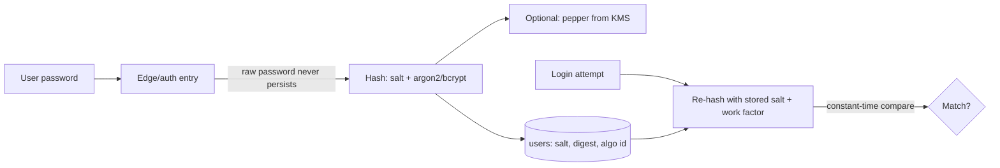

# Password Hashing / Hashing vs Encryption

## 1. One-Line Definition
Password hashing is the one-way transformation (with per-user salt and a deliberately slow algorithm like bcrypt/argon2/scrypt) that makes a stored password unreadable and impractical to reverse, in contrast to encryption which is *reversible* with a key — so passwords are always hashed, never encrypted.

## 2. Why Do We Need It?
If passwords are stored plaintext or encrypted-reversibly, a single database breach leaks every credential — and because people reuse passwords, that leak cascades into every other service. Hashing is the difference between "the attacker has my database" and "the attacker has a pile of unsalted digests." The required defenses go further: a slow algorithm defeats GPU brute-force, per-user salt defeats rainbow tables, and pepper (secret salt) adds a second line of defense. Many breaches trace back not to crypto broken but to passwords being stored recoverably.

## 3. Simple Intuition
Hashing is a meat-grinder: you put a password in, you get a fixed-size digest out, and there is no machine to "un-grind" it — you can only test candidate inputs to see which one produces the same output. Encryption is a locked box: you can unlock it if you have the key. For verification you never need to reverse the password — you just grind the candidate and compare digests. So store the grind, never the lockable box.

## 4. What Happens Without It?
A database dump anywhere means trivially reversible passwords: plaintext (worst), reversible encryption (key leaks alongside), fast unsalted hash (attacker builds a rainbow table / GPU-cracks the whole set in hours). Credential stuffing then sparks account takeover on every other site. Passwords also leak through logging and memory snapshots — which is why you hash at the edge (right after input, before any downstream system touches them), and why you never log, alert, or pass the raw password beyond the entry point.

## 5. Core Idea
- **Hashing vs encryption:** hashing = one-way (bcrypt/argon2/scrypt); encryption = reversible with a key (AES). Password fields are hashed; encrypted data is decrypted later. Hash tables exist for lookup — password *verification* never needs to reverse anything, only to re-hash-and-compare. See the same distinction in [[encryption-and-keys|Encryption and Keys]].
- **Salt:** a random per-user value prepended to the password before hashing. Two users with the same password get different digests; precomputed rainbow tables become useless. Salt must be unique per user and stored alongside (it isn't a secret).
- **Slow algorithms (work factor):** bcrypt/argon2/scrypt are deliberately slow (memory-hard where possible) so a GPU/ASIC can't brute-force at millions/s. Tune the work factor to ~100ms on your hardware — the cost is paid once per login, but it's prohibitive at scale for an attacker.
- **Pepper:** a secret value you add server-side (in KMS/secrets) on top of salt. It defends against a scenario where the DB leaks but the pepper vault doesn't. Optional second line — even if the digest leaks, derived digests stay unguessable.
- **Verification flow:** hash the submitted password with the stored salt + work factor, constant-time compare against the stored digest. Never reveal "user exists" separately from "password wrong" on login error.
- **Upgrade path:** when a user logs in with a working password on an old hash scheme, transparently re-hash with the modern algorithm; migrate rows over time rather than forcing a password reset.

## 6. Important Terminology

| Term | Simple Meaning |
|------|----------------|
| Hash | One-way fixed-size digest |
| Encryption | Reversible scrambling with a key |
| Salt | Random per-user value mixed into the hash |
| Pepper | Secret value added beyond salt |
| Work factor / cost | CPU/memory cost of one hash operation |
| Rainbow table | Precomputed hash-to-plaintext table |
| Memory-hard | Algorithm needing lots of RAM (argon2/scrypt) |
| Constant-time compare | Compare string without timing leaks |
| Credential stuffing | Reusing leaked passwords across sites |
| Rehash-on-login | Upgrade old schemes transparently |

## 7. Basic Architecture



## 8. Request or Data Flow
1. Signup: generate a random per-user salt, append it, hash with argon2 (work factor tuned), store `salt`, `digest`, `algorithm_id` in the user record.
2. Login: look up the record, re-hash the submitted password with the *stored* salt and the algorithm historically used — naive "current algorithm for everyone" breaks old accounts mid-migration.
3. Compare in constant time; on mismatch return a generic "invalid credentials" (no user-exists oracle).
4. Migration: if the stored `algorithm_id` is legacy, re-hash with the modern algorithm and update the record after a successful login.

## 9. Practical Example
**Auth service, argon2 (assumptions):**
- Work factor tuned to ~100ms/attempt on auth hardware. GPU md5 cracks billions/s; comparable argon2 at ~100ms makes even a strong GPU limited to ~10k/s — the site's password is one in a trillion GPUs-years at that rate.
- Breach happened; attacker got the DB. Because digests are salted argon2, they can't reuse any precomputed table; the pepper (if enabled) sits in KMS and was untouched; the leaked credentials are effectively inert except for brute-forcing the weakest users individually.
- All services hash at the auth-service edge; nothing downstream ever sees the plaintext; logs never record it.

## 10. Scaling
- **Work factor is a throughput tax:** you pay 100ms per login, but attacker pays it per guess — that's the intended asymmetry. On the hot path, batch/scale auth nodes; the factor is a shared secret knob (store per-account, not global, so it's tunable without invalidating).
- **Rehash-on-login:** converts the fleet over time without password resets; monitor the legacy-password population to know migration progress.
- **Pepper per region:** pepper in the region's KMS; disaster-recovery concerns (see [[rpo-rto|RPO and RTO]] and [[disaster-recovery|Disaster Recovery]]) — a lost pepper restricts access painfully, so replicate it guarded.
- **Credential stuffing defense:** rate-limit login, per-account lockout/backoff, and breach-PI + 2FA is at the product layer (see [[rate-limiter|Rate Limiter]]).

## 11. Reliability and Failure Scenarios

| Failure | What Happens | Detection | Recovery | Trade-off |
|---------|--------------|-----------|----------|-----------|
| Work factor too high | Login latency / outage under load | Latency metrics | Tune factor down (or scale) | security vs speed |
| Work factor too low | Brute-force feasible | Security review | Raise factor via rehash-on-login | migration cost |
| Pepper lost/unreachable | All logins fail | Auth outage | Guarded restore (#5) | availability |
| DB breach with legacy hashes | Old digests weak | — | Force rehash-on-login + 2FA push | UX |
| Panic compare (not constant-time) | Timing oracle | Code review | Constant-time lib | correctness |
| Plaintext logged by a dependency | Credential leak invisibly | Secret scan | Redact at edge, never log | discipline |

## 12. Consistency and Correctness
The stored record is `(algorithm_id, work_factor, salt, digest)` — the hash must be *re-computable with the stored parameters only*, not with whatever is current at code-deploy time. Constant-time comparison is correctness-critical: never short-circuit compare on the first mismatching byte. Account enumeration is a privacy leak: "no such user" and "wrong password" return the same error. On password change, re-generate salt and digest; on breach, the unsalted/legacy population must be force-migrated urgently, not by next login.

## 13. Performance
The deliberate cost dominates login: ~50–200ms of CPU/memory per attempt is normal for argon2/scrypt; bcrypt similar. This is per-login, not per-request, so it's fine for most tiers but must be load-tested under bursts (e.g., password reset campaigns). Constant-time compare and storage reads are negligible. If login QPS is huge, consider adding rate-limiting upstream rather than lowering the work factor.

## 14. Security
Store only salted slow-hash digests — never plaintext, never reversible encryption, never fast hashes (md5/sha1/sha256 are fine for fingerprints/checksums, not passwords). Keep the pepper in KMS/secrets with an alert on use. Enforce output hygiene: no password in logs, error messages, or support transcripts; bind 2FA and breach monitoring to credential events. Treat any password seen outside the auth-entry edge as compromised.

## 15. Trade-Offs

| Choice | Advantages | Disadvantages | When to Use |
|--------|------------|---------------|-------------|
| Argon2id | Modern, memory-hard, tunable | Needs param management | New systems (default) |
| bcrypt | Widely supported, CDN-friendly | Work factor max ~72 bytes input | Mature stacks |
| scrypt | Memory-hard, simple | Harder to tune right | Resource-constrained |
| Salted sha256 | Fast | GPU-crackable in hours | Never for passwords |
| Encryption for data | Reversible for retrieval | Legible if key leaks | Data, not passwords |
| Rehash-on-login | Migrates silently | Legacy window remains | Every migration path |

## 16. Common Mistakes
- Using a fast hash (md5/sha256) — GPU-cracked in minutes for real distributions.
- No salt — rainbow tables make the whole DB crackable at once.
- Storing the work factor globally — tuning or retiring the algorithm breaks all accounts.
- Encrypting passwords "for security" — an encryption key leak = plaintext.
- None or broken constant-time compare — timing side channel.
- Revealing account existence on login (user enumeration).
- Logging passwords "temporarily" — it's permanent and leaks.

## 17. HLD vs LLD Boundary
HLD: hashing-vs-encryption policy (passwords hashed, data encrypted), algorithm choice + work factor, salt/pepper strategy, rehash-on-login migration, credential hygiene (no plaintext past the edge), login rate-limiting stance. LLD: the hashing library/config, salt generation, constant-time compare implementation, record schema (algorithm_id, work factor, salt, digest), pepper fetch from KMS, the rehash trigger on success.

## 18. Interview Questions

### Beginner
- Hashing vs encryption — which applies to passwords and why?
- Why is salt necessary even though it's not secret?

### Intermediate
- Design password storage for a SaaS facing a credential-stuffing attack: algorithm, salt, work factor, rate-limiting, 2FA.
- You inherit a DB of md5-hashed passwords. Design the migration.

### Advanced
- Explain why memory-hard hashing defeats GPU farms, and how you'd reposition the work factor as you scale the login hot path.
- A DB leaked with salted argon2 digests and (separately) the KMS pepper bucket was touched. Give the full risk assessment and response.

## 19. Interview Memory Summary

> [!abstract]- Interview Memory Summary

### Remember

- Passwords: hash only — one-way, salted, slow.
- Encryption is reversible; hashing is not; never the two for passwords.
- Salt defeats rainbow tables; work factor defeats GPU brute-force; pepper adds KMS defense.
- Record schema: algorithm_id, work_factor, salt, digest.
- Constant-time compare; no user-enumeration on login.
- Rehash-on-login migrates old schemes without forced resets.
- Never let plaintext pass the auth edge (logs, services, support).

### 30-Second Explanation

Store password digests with per-user salt using a slow, memory-hard algorithm (argon2/bcrypt) at ~100ms cost, keep the parameters per record so migrations don't break, compare constant-time, return no account-existence oracle, and re-hash on login — the stored credential is then resistant to DB dumps and GPU brute-force, and encryption is reserved for data you actually need to decrypt later.

### Interview Traps

- "We encrypt passwords and store the key" — same as plaintext when the key leaks.
- "md5/sha256 is fine, we hash" — fast hashes are crackable cheaply.
- Global work factor that a future change invalidates.
- Revealing "user not found" vs "wrong password."

### Key Trade-Off

Slow, salted, memory-hard hashing buys "even a full DB dump is effectively inert" at the cost of 50–200ms of CPU per login, per-account parameters, and disciplined edge-only password handling — an operational tax many times smaller than the breach it prevents.

## 20. Related Concepts

### Prerequisites

- [[encryption-and-keys|Encryption and Keys]] (the hashing-vs-encryption distinction)

### Commonly Used Together

- [[authentication-vs-authorization|Authentication vs Authorization]]
- [[oauth-oidc-jwt|OAuth 2.0 / OIDC / JWT]]
- [[rate-limiter|Rate Limiter]]

### Advanced Concepts

- [[access-control|Access Control (RBAC / ABAC / Least Privilege)]]
- [[encryption-and-keys|Encryption and Keys]] (pepper via KMS)

Related planned topics (not authored yet): passkeys/WebAuthn, breach-monitoring integration.

## 21. References
OWASP Password Storage Cheat Sheet, NIST SP 800-63B (memorized secrets), Argon2 spec (RFC 9106). Verify current guidance pre-interview.

## 22. Active Recall

Test yourself before revealing each answer.

> [!question]- Why do passwords get hashed and data gets encrypted — what's the fundamental difference?
> Hashing is a one-way function: given a digest you cannot recover the input, and you never need to — verification is "re-hash the candidate and compare." Encryption is reversible with a key, so if the key leaks the ciphertext becomes plaintext. Stored passwords must be unrecoverable even with the whole DB; stored data must be retrievable, so data is encrypted and passwords hashed.

> [!question]- Why is salt necessary when it's not secret?
> Salt makes every digest unique even for identical passwords, so precomputed rainbow tables (one lookup per candidate) fail — an attacker must brute-force each user individually. It's not secret because its job is uniqueness and table-breakage, not secrecy — that's the pepper's job.

> [!question]- Why does the stored record need algorithm_id and work_factor per account?
> Because the hash must be re-computable with the exact parameters used at creation, regardless of how your code or libraries evolved. Global parameters break every account when you raise the factor or retire an algorithm — per-account metadata lets old accounts verify while new ones use the modern scheme, and rehash-on-login migrates silently.

> [!question]- Design the defense for a credential-stuffing attack on login.
> Slow salted hashing (argon2/bcrypt) makes offline cracking hard; per-account rate limiting and backoff throttle online guessing; account lockout and breach-PI alerting; 2FA/passkeys as the real cure; generic error messages so enumeration doesn't narrow targets; and a denylist of breached-password matches at signup/reset.

> [!question]- Your DB just leaked 1M salted argon2 digests. What's the actual exposure?
> The digests themselves are computationally hard to crack at ~100ms each with memory-hard algorithms (weakest users only by brute force). Real risks: (1) the same weak passwords reused elsewhere → credential stuffing; (2) if direction pepper entered, whether the KMS leaked matters; (3) account enumeration. Response: force 2FA where possible, push password resets for risky accounts, rotate pepper, watch stuffing attempts, log and audit.

> [!question]- Behavioral: an auth service must encrypt some user data while always hashing passwords. How do you keep the two from drifting?
> Separate the stores: passwords live in a hash-only column with (algorithm_id, work_factor, salt, digest); user data lives in encrypted columns via a KMS with an HSM. Never mix — no hashing code decrypts, no encryption code hashes a password. Document it in the schema as a hard rule: password fields are the only irreversibly hashed fields in the system.

## 23. When Should I Use This?

### Use it when

- You persist any user credential with a lifetime longer than one session.
- You want a DB/backup breach to be non-escalating (digests are hard to crack).
- You care about not leaking across sites (salt + slow hash + stuffing defenses).

### Avoid it when

- The "password" is actually transient (OTP, one-time links) — a fast digest is fine there.
- You need to know the value later (that's the encryption path, not hashing).
- The system is a throwaway prototype and login security is out-of-scope — still salt + argon2; it's free.

### What problem does it solve?

A stored password is the crown jewel an attacker wants from a database dump, and reversible storage turns that dump into universal account takeover. Salted slow hashing makes stored credentials computationally inert, salt defeats precomputed tables, and work factors hold even GPU farms at bay — converting a data breach into a limited, brute-force-hard to the weakest users problem.

### What problem does it NOT solve?

Hashing doesn't stop online guessing (rate-limiting/2FA do), doesn't protect reused passwords on other sites (breach monitoring does), doesn't defend the login channel itself from phishing (MFA/passkeys), and doesn't protect any data you legitimately need to decrypt — that's encryption + key management.

## 24. Decision Connections

Decisions that go together with password hashing:

- [[encryption-and-keys|Encryption and Keys]] — the reversible counterpart; pepper and key storage live here.
- [[authentication-vs-authorization|Authentication vs Authorization]] — hashing is an authN storage decision; authZ is separate.
- [[oauth-oidc-jwt|OAuth 2.0 / OIDC / JWT]] — federated login avoids storing passwords altogether.
- [[rate-limiter|Rate Limiter]] — the pragmatic online-defense layer around the login endpoint.
- [[access-control|Access Control (RBAC / ABAC / Least Privilege)]] — hashed credential doors must still be authorized once open.
- [[data-masking|Data Masking and Privacy]] — a leaked password is PII; hygiene shares the same redaction discipline.

Decision tree:

```
Do I need to store a secret that the service must check but never see?
    |
    +-- Recoverable later (data, not password)?
    |      → [[encryption-and-keys|Encryption and Keys]] (AES + KMS, reversible)
    |
    +-- Verification only, irreversible (password)?
    |      +-- Choose slow memory-hard algorithm → argon2/bcrypt/scrypt
    |      +-- Random per-user salt, per-account work factor
    |      +-- Optional pepper from KMS
    |      +-- Constant-time compare, no user-enumeration oracle
    |      +-- Rehash-on-login for legacy accounts
    |
    +-- Can you avoid storing passwords at all?
    |      → [[oauth-oidc-jwt|OAuth 2.0 / OIDC / JWT]] / passkeys instead
    |
    +-- Online attack is the real threat?
           → [[rate-limiter|Rate Limiter]] + lockout + [[access-control|Access Control (RBAC / ABAC / Least Privilege)]]
```