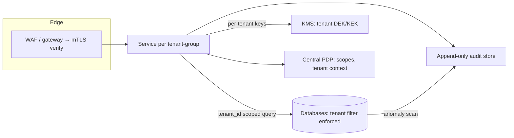

# Tenant Isolation / Audit Trails / Zero Trust

## 1. One-Line Definition
Tenant isolation guarantees that one customer's data and operations can never be read or affected by another tenant; audit trails make every security- and data-relevant action attributable, tamper-evident, and replayable; zero trust treats the network as hostile and verifies every identity/device/request regardless of "inside" status.

## 2. Why Do We Need It?
Multi-tenant SaaS concentrates huge value in one shared system — and every other tenant is now a potential attacker surface as well as a compliance liability (GDPR/HIPAA claim breach if Tenant B reads Tenant A's records). One shared DB row, one mis-scoped query, one leaked tenant_id, one service account with global read = a cross-tenant breach that ends trust and triggers regulatory exposure. Isolation is the design-time boundary; audit trails are the evidence layer that makes isolation trustworthy and attributable; zero trust hardens "inside the boundary" because network position alone is no longer a security boundary in shared infrastructure.

## 3. Simple Intuition
- *Isolation:* an apartment building where each unit's walls, pipes, and front door are separate: the plumbing can't leak into your neighbor's flat and their spare key can't open yours (silo model) — or one shared building where the wiring is carefully separated by unit and every door checks your unit's badge (pooled with hard tenant_id filtering, see [[tenancy-and-cells|Multi-Tenancy and Cell-Based Architecture]]).
- *Audit trails:* the building's security tape and keylog: every door unlock, every entry to the server room, time-stamped and sealed, so "who got in and when," and what they touched, is provable later.
- *Zero trust:* even inside the building, nobody is trusted by breathing: the 4th-floor room requires a badge that can be revoked, the maintenance visit is an authenticated guest with scope, and the elevator asks before going to any floor. Trust by identity + proof, never by "you got past the lobby."

## 4. What Happens Without It?
One bug — a query without a `tenant_id` filter, a shared cache key missing the tenant, a SQL injection past the WAF — and every tenant's data is readable (IDOR at organizational scale). No isolation also means a "noisy neighbor" (see [[tenancy-and-cells|Multi-Tenancy and Cell-Based Architecture]]) can burn shared capacity and degrade every other tenant. Without audit trails, an insider breach, a tenant-outage claim, or a "who changed this?" question is unanswerable and unrecoverable. Without zero trust, a single port scan from inside (or a leaked internal service credential) becomes a lateral-movement goldmine, because "internal" was trusted.

## 5. Core Idea
- **The isolation stack (defense in depth, never a single claim):**
  1. *Data layer:* every table/query every time carries `tenant_id` (filter is enforced, not assumed); per-tenant keys for encryption (KMS) make blast radius per tenant (see [[encryption-and-keys|Encryption and Keys]]).
  2. *Application layer:* tenant scoping in every service call, per-tenant rate limit (see [[rate-limiter|Rate Limiter]]), and resource-name validation (never index other tenants' objects — IDOR guard).
  3. *Network/cell layer:* cell-based isolation partitions whole stacks per tenant-group ([[tenancy-and-cells|Multi-Tenancy and Cell-Based Architecture]]) and catches the case where a shared service is meaningless because its secrets are shared.
  4. *Model choice:* silo (per-tenant instances) for high-security/compliance; pooled+filtered for most; bridge (silo+filters hybrid) in between; the isolation dial is a cost/safety trade, not a default.
- **Cross-tenant failure modes to design against:** tenant_id omission, cross-tenant cache keys, shared secrets/keys, noisy-neighbor saturation, tenant orphaned resources, IDOR by guessable IDs.
- **Audit trails:** who/what/when/where/outcome on every authn+authz+data event; append-only, tamper-evident (hash-chained or write-once store), immutable, with mandated retention per compliance. Worthless if nobody reads them — alert on anomalies (e.g., new-tenant access patterns), not archive.
- **Zero trust (the identity-first model):**
  - *Verify every request:* identity, device/posture, authN always (mTLS for services, see [[encryption-and-keys|Encryption and Keys]]; identity for users/tokens, see [[oauth-oidc-jwt|OAuth 2.0 / OIDC / JWT]]).
  - *Least privilege + micro-segmentation:* per-service credentials, short-lived tokens, scope-limited keys (see [[access-control|Access Control (RBAC / ABAC / Least Privilege)]]).
  - *Never trust network location:* the edge is not a trust boundary; internal is hostile until proven.
  - *Zero trust data:* application-layer controls (authZ + audit), not just network ACLs, since the network can no longer be trusted to enforce tenancy.

## 6. Important Terminology

| Term | Simple Meaning |
|------|----------------|
| Tenancy model | Silo / pooled / bridge share profile (see [[tenancy-and-cells|Multi-Tenancy and Cell-Based Architecture]]) |
| tenant_id | The partition column/filter on every data item |
| Cross-tenant leak | Tenant B reading/writing Tenant A's data |
| IDOR | Insecure direct object reference at org scale |
| Blast radius | What fails/leaks when one thing is compromised |
| Audit trail | Append-only log of security/data-relevant events |
| Tamper-evidence | Hash-chaining/write-once so edits are detectable |
| Zero trust | Verify every identity against every resource |
| mTLS | Mutual TLS for service identity (see [[encryption-and-keys|Encryption and Keys]]) |
| Micro-segmentation | Per-service network+identity boundaries |

## 7. Basic Architecture



## 8. Request or Data Flow
1. Request arrives from an authenticated identity with a tenant context; the gateway terminates TLS and (for services) mTLS-establishes service identity and tenancy label.
2. The PDP decides allow/deny for (identity, action, resource, tenant) — see [[access-control|Access Control (RBAC / ABAC / Least Privilege)]]. Identity and tenancy are part of the decision, never drawn from a URI alone.
3. Every service applies tenant_id filtering at the data layer (SQL/ORM: `WHERE tenant_id = ?` always, asserts on the query). Cross-tenant loads use per-tenant keys for any field-level secrecy.
4. The audit pipeline captures the event (what/who/which tenant/outcome) append-only; anomaly detection reviews the stream.
5. On compromise or audit: the trail reconstructs exactly what one tenant was allowed to see, and the blast radius of any shared secret is bounded per-tenant.

## 9. Practical Example
**Healthcare SaaS, 3 tiers (assumptions):** high-compliance enterprises get a silo (their own DB cluster + keys); mid-tiers are pooled with enforced tenant_id filters; surgical cells for the largest tenants (see [[tenancy-and-cells|Multi-Tenancy and Cell-Based Architecture]]).
- A noisy tenant in the pooled tier saturates a shared queue → per-tenant rate limits shape it; the hospital-tier silo never feels it.
- One service account "accidentally" runs `SELECT * FROM patients` — the assert-on-tenant filter rejects it; the anomaly scan flags the pattern; audit shows which tenant it was and blocks it.
- A leaked cloud credential can reach only the cells it's scoped to; mTLS and short tokens bound the blast radius before the network can be traversed.

## 10. Scaling
- **Tenant count:** thousands of tenants = per-tenant silos are economically impossible (see the dial in [[tenancy-and-cells|Multi-Tenancy and Cell-Based Architecture]]); tier the model — pooled for the bulk, silos/cells for the few high-value or regulated.
- **Isolation verification at scale:** automated, continuous cross-tenant tests (request Tenant A's resource as Tenant B's identity on every deploy — the "IDOR canary" suite); every new service ships with its isolation test.
- **Audit volume at scale:** only write audit events for security/data-relevant actions (not every GET), store to a cost-tiered append-only sink, and sample the anomaly scan; archive per compliance windows, delete beyond.
- **Zero trust at scale:** service identity (mTLS/SPIFFE) for the whole fleet, credentials short-lived and automatically rotated (K8s/service-mesh), and deny-by-default network policy — none of it manually provisioned.

## 11. Reliability and Failure Scenarios

| Failure | What Happens | Detection | Recovery | Trade-off |
|---------|--------------|-----------|----------|-----------|
| Missing tenant filter | Cross-tenant read (breach) | Isolation canary, anomaly scan | Rollback + assert, audit | effort |
| Shared key/credential | Cross-tenant secret exposure | Secret scan | Rotate, per-tenant keys | key sprawl |
| Noisy neighbor | All tenants in pool degraded | Per-tenant metric | Rate limit + isolate | pooled cost |
| Audit sink full/down | Events lost | Ingest lag/health | Fail queue, prioritize | coverage gap |
| Zero-trust misconfig | Legit services blocked | Access errors | Narrow change, canary | complexity |
| Tenant orphaned after churn | Access to deprovisioned data | Deprovisioned list | Reassign/irrecoverable delete | retention policy |

## 12. Consistency and Correctness
Isolation must be an invariant, not an assumption: enforce tenant_id at the data layer and assert the absence of cross-tenant patterns in code review and tests; a missing filter is a bug class, not a config. Audit events are the trust contract — they must be append-only, tamper-evident (hash chain), time-synchronized, and correlated with identity (never a partially redacted, replacable record). Zero trust requires the identity contract to hold at every hop: the decision at the PDP must match the enforcement at the service, or a zone left outside the policy finds an unprotected path.

## 13. Performance
Isolation machinery adds a small tax: tenant_id filters cost a column, KMS unwrap adds per-read latency (mitigate with cached, short-TTL DEKs; see [[encryption-and-keys|Encryption and Keys]]), mTLS handshakes add connection cost (mitigate with reuse/keep-alive), audit writes add IO (asynchronous, sampled, cost-tiered). The alternative — a shared service with no isolation — is not faster, it's just a leak.

## 14. Security
- Defense in depth: no single claim stands alone — data filter + app scope + network + per-tenant keys.
- Audit + zero trust are security controls themselves: the audit trail must be protected from tampering and quarantined from the code it records; the PDP and identity stores are crown jewels.
- Never put a tenant's decrypt key in a shared secret; never let a shared service account bypass tenant checks; zero trust is optional only when you have literally zero multi-tenant risk.

## 15. Trade-Offs

| Choice | Advantages | Disadvantages | When to Use |
|--------|------------|---------------|-------------|
| Pooled + enforced filter | Cheap, easy scale | Single shared blast radius | Most tenants |
| Silo (per-tenant stack) | Strongest isolation | Expensive at scale | Regulated / high-value |
| Bridge hybrid | Balanced | Complex to operate | Mixed customer tiers |
| Per-tenant keys | Blast radius = one tenant | Key sprawl (see [[encryption-and-keys|Encryption and Keys]]) | Any PII store |
| Cells (via [[tenancy-and-cells|Multi-Tenancy and Cell-Based Architecture]]) | Failure/tenant isolation at fleet scale | Topology cost, affinity rules | Very large deployments |
| mTLS + short tokens (ZT) | Kill lateral movement | Infra overhead | Fleet with internal services |

## 16. Common Mistakes
- Trusting one isolation claim ("we filter by tenant somewhere in the service").
- No isolation tests — cross-tenant bug ships and rots undiscovered for months.
- Shared cache/session/queue with no tenant key → cross-tenant cache hits.
- No audit, or audit that is read-only in spirit and never queried.
- Zero trust that still trusts "internal" network paths (segmentation not actually enforced).
- Tenant_id omitted on a hot new endpoint "because it's fast" — that's the leak's home address.

## 17. HLD vs LLD Boundary
HLD: tenancy model (silo/pooled/bridge/cells), tenant-id filter contract, per-tenant encryption key strategy, audit event taxonomy/retention, anomaly-scan plan, zero-trust architecture (mTLS/SPIFFE, PDP, micro-segmentation, short-lived credentials), isolation test suite as a release gate. LLD: the SQL filters and ORM layer, KMS wrap/unwrap calls, mTLS config, PDP policy rules, audit-event schema, anomaly queries.

## 18. Interview Questions

### Beginner
- What is tenant isolation and why can't a single filter be trusted?
- Silo vs pooled tenancy — one-line trade.

### Intermediate
- Design tenant isolation for a multi-tenant SaaS database, including the failure where a filter is accidentally omitted.
- How do you prove isolation at scale (automated canaries)?

### Advanced
- Design zero trust for a fleet of microservices with per-tenant data: identity, mTLS, PDP, short-lived creds, micro-segmentation, and how an audit trail makes the whole thing verifiable.
- A cross-tenant leak is reported, but the audit trail is missing events. Diagnose both the leak and the evidence gap.

## 19. Interview Memory Summary

> [!abstract]- Interview Memory Summary

### Remember

- Isolation = a stack (data filter + app scope + network + tenant keys), never one claim.
- tenancy model: silo / pooled / bridge / cells — a cost-safety dial.
- tenant_id filtering enforced at data layer, asserted in tests, no shared secrets.
- Every cross-tenant bug class: missing filter, shared cache/keys, IDOR, noisy neighbor.
- Audit = append-only, tamper-evident, queryable — valuable only when read.
- Zero trust: verify every identity every time; the network is hostile.
- mTLS + short-lived creds + micro-segmentation kill lateral movement in the fleet.

### 30-Second Explanation

Choose a tenancy model (silo/pooled/bridge/cells), enforce tenant_id at the data layer with a defensive assert pattern and an automated cross-tenant canary suite, bound per-tenant blast radius with per-tenant keys, and layer audit trails (append-only, tamper-evident, anomaly-scanned) plus zero trust (mTLS service identity, short-lived scoped credentials, micro-segmentation) so no single bypass — in the data, app, or network — can silently leak one tenant into another.

### Interview Traps

- "We filter by tenant in the service" — a single unasserted line is a leak.
- Believing "internal = trusted" — zero trust exists precisely because that's false.
- Audit trails that never get read — they're evidence, not a compliance poster.
- Per-tenant silos everywhere — the dial (silo/pooled) is a cost decision.

### Key Trade-Off

Tenant isolation + audit + zero trust buy provable multi-tenant safety at the price of a deep defense stack (enforced filters, per-tenant keys, mTLS, micro-segmentation, audit sinks, canary suites) and its operational cost — the failure mode is not "too expensive," it's a single broken claim believed to be enough.

## 20. Related Concepts

### Prerequisites

- [[tenancy-and-cells|Multi-Tenancy and Cell-Based Architecture]]
- [[access-control|Access Control (RBAC / ABAC / Least Privilege)]]

### Commonly Used Together

- [[encryption-and-keys|Encryption and Keys]] (per-tenant keys, mTLS)
- [[oauth-oidc-jwt|OAuth 2.0 / OIDC / JWT]] (identity for zero trust)
- [[data-masking|Data Masking and Privacy]] (masked view of tenant data)
- [[sharding|Sharding]] (tenant-based shard keys)

### Advanced Concepts

- [[cell-based-architecture|Cell-Based Architecture]]
- [[data-residency|Data Residency and Sovereignty]]
- [[microservices|Microservices]] / [[service-mesh|Service Mesh]] (zero-trust enforcement point)

Related planned topics (not authored yet): SPIFFE/SPIFFE trust domains, audit-hash-chain implementation.

## 21. References
AWS SaaS Tenant Isolation guidance, Google Cloud resource hierarchy best practices, NIST Zero Trust Architecture (SP 800-207). Verify current guidance pre-interview.

## 22. Active Recall

Test yourself before revealing each answer.

> [!question]- Why can't a single "filter by tenant somewhere in the service" be trusted?
> Because one unasserted query, one shared cache/queue key, one service credential, or one accidental `SELECT *` removes the filter at runtime with no error. Isolation needs a stack: tenant_id enforced and asserted at the data layer, scope in the app, per-tenant keys for high-value secrecy, cell/network boundaries, and automated cross-tenant canary tests that try to read across tenants and fail loudly if a path opens.

> [!question]- Silo vs pooled — give the one-line trade.
> Silo isolates everything per tenant (strongest, expensive); pooled shares everything with enforced tenant_id filters (cheap, single shared blast radius). The bridge model pools the cheap parts and silos the risky ones — set the dial by regulatory weight and value per tenant, not by default.

> [!question]- Design the isolation test suite as a release gate.
> Every merge that touches a data path triggers a cross-tenant canary: create Tenant A and Tenant B, authenticate each, and assert that A can neither read nor write B's resource through every endpoint, cache key, session and analytics path; assert tenant_id is present in every SQL bind (static analysis); fail the merge on any cross-tenant hit. The suite is the tool that turns "we intend isolation" into "isolation is continuously proven."

> [!question]- Name the concrete cross-tenant bug classes and their fixes.
> 1) Missing tenant filter → enforce + assert at data layer. 2) Shared cache/session/queue keys → tenant-scoped keys. 3) Shared secrets/keys → per-tenant keys/KMS. 4) IDOR by guessable IDs → validate ownership at app layer. 5) Noisy neighbor → per-tenant rate limiting + isolation dial. Fix each at its layer and prove them with the canary suite.

> [!question]- How does zero trust actually bind a compromised credential?
> A stolen credential is scoped and short-lived, so it opens little: mTLS binds a service credential to its identity; short-lived tokens rotate; per-service micro-segmented network paths bound lateral reach; the PDP denies any request the scope doesn't cover; and the audit trail shows what the credential touched. An attacker who wins one host stops at that host's blast radius instead of the fleet's.

> [!question]- A cross-tenant leak happened, but the audit trail has no entries for it. Diagnose both problems.
> The leak means a path lacked tenant enforcement (query, cache, or keys). The missing audit events mean the recording layer was broken or bypassed — which is itself a breach-grade finding: events may have been dropped on a saturated sink, sampled out, or the path predates the audit hook. Fix both: enforce + assert tenant scope everywhere, and make audit capture non-optional on the data path (fail-closed if the audit sink is unhealthy), then reconstruct from raw network/log sources what the trail should have recorded.

## 23. When Should I Use This?

### Use it when

- More than one tenant shares any compute/storage.
- Compliance requires per-tenant data separation (health, finance, GDPR-sensitive).
- A leaked credential anywhere could read multiple tenants' data.
- You need to answer "who saw what, and is it tamper-resistant" for auditors/customers.

### Avoid it when

- Truly single-tenant (one customer, one cluster) — most isolation machinery is still worth a layer, but the stack is overkill.
- No audit requirement and no multi-tenant data — zero trust still applies if multiple services exist, but its full apparatus may be right-sized later.

### What problem does it solve?

Multi-tenant concentration makes every other tenant an attack surface and every breach a cross-tenant disaster; the network can no longer be trusted as a boundary. The isolation stack (enforced filters, per-tenant keys, cells), continuous isolation canaries, tamper-evident audit trails, and zero-trust identity/micro-segmentation make "Tenant B can't reach Tenant A" provable rather than assumed, and bend any breach into one tenant's blast radius.

### What problem does it NOT solve?

It doesn't filter at the network layer by itself (need segmentation); it doesn't protect a single compromised app that the owner serves — an application the tenant owns can always extract what it's allowed to read; and audit trails only prove what happened, they don't prevent harm if the enforcement/deployment is wrong. Isolation is verified and hardened operationally, not achieved once at design time.

## 24. Decision Connections

Decisions that go together with tenant isolation, audit trails, and zero trust:

- [[tenancy-and-cells|Multi-Tenancy and Cell-Based Architecture]] — the tenancy dial (silo/pooled/bridge) and cell-based partition are the parent pattern.
- [[access-control|Access Control (RBAC / ABAC / Least Privilege)]] — the PDP/scoping that makes the tenant decision explicit.
- [[encryption-and-keys|Encryption and Keys]] — per-tenant keys and mTLS enforce isolation at rest and on the wire.
- [[oauth-oidc-jwt|OAuth 2.0 / OIDC / JWT]] — identity for zero-trust verification.
- [[data-masking|Data Masking and Privacy]] — masked views keep real PII from low-trust surfaces.
- [[sharding|Sharding]] — tenant-based shard keys make isolation structural.
- [[service-mesh|Service Mesh]] / [[microservices|Microservices]] — the enforcement plane where zero trust lives.

Decision tree:

```
Multi-tenant system or hostile-internal fleet?
    |
    +-- Which tenancy model? ([[tenancy-and-cells|Multi-Tenancy and Cell-Based Architecture]])
    |      +-- Regulated / high-value → silo / cells
    |      +-- Most tenants          → pooled + enforced filters
    |      +-- Mixed tiers           → bridge hybrid
    |
    +-- Can a shared bug cross tenants?
    |      → assert tenant_id at data layer + canary suite
    |      → per-tenant keys ([[encryption-and-keys|Encryption and Keys]])
    |      → tenant-scoped caches/queues/sessions
    |
    +-- Need to prove who did what?
    |      → append-only tamper-evident audit trail
    |      → anomaly scan on the stream
    |
    +-- Can a credential move laterally?
    |      +-- mTLS service identity + short-lived tokens
    |      +-- micro-segmented network
    |      +-- PDP deny-by-default ([[access-control|Access Control (RBAC / ABAC / Least Privilege)]])
    |
    +-- Data behind the perimeter?
           → [[data-masking|Data Masking and Privacy]] + application-layer authZ, never network ACLs alone
```