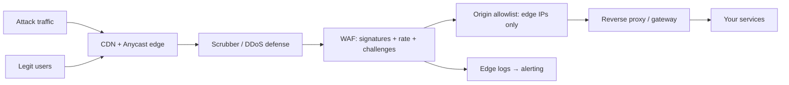

# WAF and DDoS Protection

## 1. One-Line Definition
A WAF (Web Application Firewall) inspects HTTP traffic at the edge to block application-layer attacks like injection/XSS (see [[web-vulnerabilities|Web Vulnerabilities]]), while DDoS protection defends the network from volumetric floods that aim to exhaust capacity — together the outer security perimeter that keeps your origin breathing.

## 2. Why Do We Need It?
Attackers don't knock politely: they send malformed requests at millions of RPS to exhaust CPU/bandwidth (volumetric DDoS), or craft requests that slip through normal app validation (SQL injection via a WAF-bypassed path). Without an edge layer, every request — trash included — reaches your services and databases. Edge protection is the difference between "an attack costs you money and uptime" and "an attack is someone else's cost because the edge absorbs it." It also buys time: signatures and rate rules block known attack shapes before your app code ever parses them.

## 3. Simple Intuition
A WAF is the bouncer checking every entrant's ID and body language before they reach the dance floor: known gang members (signatures) get turned away, someone with a knife (injection pattern) is stopped, and if fifty brawlers show up at once (flood), security routes them into the parking lot rather than letting them fill the room. Your app code is the dance floor — the bouncer keeps trouble outside so the party can keep running.

## 4. What Happens Without It?
Volumetric DDoS knocks your origin offline for hours or days: DNS blackholes, routing slow-down, cloud egress bills in the thousands. Worse, L7 floods "slowloтris" the app: one cheap bot per connection, each tying up a worker. App-layer attacks continue unabated: a SQL injection through a forgotten endpoint dumps your DB (see [[web-vulnerabilities|Web Vulnerabilities]]); bots scrape the entire site; credential-stuffing floods your login. Every byte of that junk costs you compute. Without an edge, there is no line in the sand — a firehose goes straight to your app servers.

## 5. Core Idea
- **WAF (L7, application):** inspects the HTTP layer:
  - Signature/managed rules: block known attack patterns (SQLi, XSS, path traversal, LFI/RFI).
  - Behavioral rules: anomaly/rate-based detection, bot management, per-IP / per-account throttling.
  - OWASP CRS-style rulesets, geo/IP allowlists, header/UA normalization.
  - Virtual patching: block a vulnerability in the WAF while the app fix ships.
- **DDoS (L3/L4 and L7):**
  - Volumetric: flood of packets/bytes saturating uplink/edge → absorb it via massive Anycast/CDN/scrubbing.
  - Protocol: SYN floods, amplification (NTP/DNS), reflection → state-inspect and rate-limit at edge.
  - L7 HTTP floods: slowloris, high-RPS GET floods → challenge/rate-limit at proxy, TLS-challenge (JS challenge) for bots.
- **Edge architecture:** CDN + Anycast + scrubbing centers (Cloudflare/AWS Shield/Google Cloud Armor) sit in front of origin; only clean traffic reaches [[reverse-proxy|Reverse Proxy]]. Caching absorbs repeat GETs; challenges absorb bots; origin sits behind a strict allowlist (edge → origin only, see [[http-and-https|HTTP and HTTPS]]).
- **How it composes with the app:** the WAF is a first filter; it never replaces app-layer validation or authZ — a WAF is a net, not a lock. Log everything at the edge: WAF logs feed [[alerting|Alerting and Alert Fatigue]] and forensics.

## 6. Important Terminology

| Term | Simple Meaning |
|------|----------------|
| WAF | Web application firewall (L7 inspection) |
| DDoS | Distributed denial-of-service (volumetric or L7) |
| L3/L4 vs L7 | Network/transport vs application layer |
| Signature | Known attack-shape rule |
| Managed rule set | Vendor-updated signature library (OWASP CRS) |
| Scrubber | Center that filters attack traffic by scrubbing |
| Anycast | Same IP advertised from many locations to absorb |
| Challenge | Human/bot proof (JS challenge, CAPTCHA) |
| Slowloris | L7 attack: hold many connections idle |
| Virtual patching | WAF blocks while app fix ships |

## 7. Basic Architecture



## 8. Request or Data Flow
1. Users and attackers both hit the Anycast edge; volumetric floods are absorbed/spread across edge nodes.
2. Protocol-level floods are rate-limited/scrubbed at the edge before reaching app logic.
3. The WAF inspects each HTTP request: signature match → block; suspicious pattern → challenge; rate exceed → throttle; benign → allow.
4. Allowed traffic flows to the reverse proxy, then to services; origin only accepts traffic from edge/scrubber IP ranges (optionally mTLS).
5. Edge logs every block/allowed decision for alerts and forensics.

## 9. Practical Example
**E-commerce during a sale (assumptions):** attacker launches a 400 Gbps L3 flood and an L7 GET flood on checkout.
- Anycast edge + CDN absorbs the volumetric flood; edge never reaches the origin.
- WAF signature rules block SQLi attempts on the search endpoint; rate rules throttle per-IP GET floods; JS challenge deflects scripted bots before they hit checkout.
- Origin allowlist (edge-only IPs) means even if the flood outpaced defenses, origin would refuse non-edge traffic.
- Outcome: real users see mildly degraded CDN cache serves; origin load stays near normal; the "attack" costs the attacker money, not you.

## 10. Scaling
- **Edge capacity scales better than you:** sign the runtime of edge providers (CDN/scrubbing) — your origin can't saturate an Anycast network; the critical metrics are cache hit rate and origin egress, not raw bandwidth.
- **WAF rules at scale:** signatures with TLS-inspect cost compute; front the WAF with caching so repeat assets never reach L7 inspection; normalize requests and strip headers before rule evaluation.
- **Bot management scales with data:** fingerprinting and behavioral models need a feedback loop; the edge provider's streamed attack log is the input.
- **Split-edge resilience:** redundant providers (two CDNs/scrubbers) so no single edge is one outage away from exposing origin; fail-over routes via DNS (see [[dns|DNS and DNS Resolution]]).

## 11. Reliability and Failure Scenarios

| Failure | What Happens | Detection | Recovery | Trade-off |
|---------|--------------|-----------|----------|-----------|
| Volumetric spike | Edge absorbs it (normal) | Edge dashboards | Scale edge / move to scrub | cost |
| WAF false positive | Legit users challenged/blocked | Block-rate jump | Widen rule, log review | tuning |
| WAF false negative | Attack passes through | App errors / anomalies | Harden rule, app validation | false-positive risk |
| Edge provider outage | Whole site down | Health checks | Fail-over DNS / second edge | complexity |
| L7 flood at origin (edge bypassed) | Origin saturates | Origin saturation metrics | Allowlist origin, rate-limit | latency |

## 12. Consistency and Correctness
WAF rules are attack-shaped heuristics, not a guarantee — they must be consistent with app-level validation as defense-in-depth, never treated as authoritative authZ. Signature updates lag novel attacks; the false-positive/IP churn trade-off requires region-aware and tenant-aware rule policy. Edge decisions should be deterministic for the same request (stable hashing per IP/account) so challenges don't flap. Block decisions feed the same audit trail as app authZ.

## 13. Performance
The edge layers add ~a few ms of latency (cacheable; TLS terminated once). TLS inspection is the main cost — mitigate with session resumption and sampling. Oversized payloads are a cost axis (limit body sizes at edge). The alternative cost — origin saturating under a flood — is far worse; edge protection is the cheapest way to buy "attack resistance."

## 14. Security
The edge is a security control with its own risks: WAF config misrules can block real users (availability), bypassed shadows (e.g., unprotected staging domains) must be kept out of the routing table, and edge blocklists/API responses may leak topology. Keep edge logs only as long as forensics need, encrypt them at rest, and avoid edge logging full request bodies that contain secrets/PII (see [[data-masking|Data Masking and Privacy]]).

## 15. Trade-Offs

| Choice | Advantages | Disadvantages | When to Use |
|--------|------------|---------------|-------------|
| Managed WAF/CDN | Absorbs scale, updated rules | Vendor lock, cost | Most internet products |
| Self-managed WAF | Full control, internal trust | YOU eat the flood | Low exposure apps |
| DDoS-only (no WAF) | Cheap L3/L4 buffer | L7 app attacks reach you | Internal APIs behind VPN |
| Strict origin allowlist | Hard floor | Edge as single ingress | Any public origin |
| Bot challenge | Stops scripted abuse | Some user friction | Login/checkout surfaces |

## 16. Common Mistakes
- No origin allowlist — flood outpaces the edge → origin eats it.
- WAF as the only layer — virtual patching ≠ app validation; the WAF is a net, not a lock.
- Oversized/undersized body limits at edge — either flood risk or broken legitimate uploads.
- Not monitoring edge false-positives — they silently brick real users mid-sale.
- Exposing staging/internal domains without the same edge posture.
- Single edge provider — one outage = total outage.

## 17. HLD vs LLD Boundary
HLD: edge topology (CDN/Anycast/scrubber), WAF posture, DDoS tiering (L3/L4/L7), origin allowlist strategy (IP + mTLS), tolerance for challenge/friction, redundancy of edge providers, incident playbook for flood events. LLD: rule sets and exceptions, rate-limit config per endpoint, challenge thresholds, edge log schema, allowlist updates, TLS inspection sampling.

## 18. Interview Questions

### Beginner
- WAF vs DDoS protection — same thing?
- What exactly does "edge absorbs it" mean?

### Intermediate
- Design the edge security perimeter for an origin behind a CDN with allowlist + WAF.
- An L7 GET flood is degrading your API. Walk the fixes in order.

### Advanced
- Design a protection layer that survives a 1 Tbps volumetric flood AND a slowloris-style L7 attack simultaneously, with no origin exposure.
- Your WAF starts blocking legitimate users. Detect, diagnose, and recover with weights and canary.

## 19. Interview Memory Summary

> [!abstract]- Interview Memory Summary

### Remember

- WAF = L7 app-layer attack filter (signatures, rate, challenges).
- DDoS = volumetric + protocol + L7 floods; edge absorbs them.
- Edge architecture: Anycast/CDN + scrubber + WAF + origin allowlist.
- Origin stays alive because edge does the heavy lifting — never expose origin.
- WAF is a net, not a lock — app validation + authZ remain.
- Virtual patching buys time to fix the service.
- Watch edge false positives — they break your own users.

### 30-Second Explanation

Put an Anycast/CDN/scrubber edge in front of every origin, let the WAF filter signatures, rates, and bot challenges at L7, keep layer-3/4 floods in the edge's network, and allowlist origin to edge-only IPs — then no ordinary flood or injection pattern ever reaches your app, and the edge's false-positive/block metrics stay on the operational alerting radar.

### Interview Traps

- Saying "WAF protects us" while the origin is publicly routable — bypassed in minutes.
- Treating DDoS as pure bandwidth — L7 low-and-slow kills app workers too.
- WAF-instead-of-validation — injection still needs app-level checks; WAF is a net, not a lock.
- Not planning for edge-provider outage; single vendor = single point.

### Key Trade-Off

WAF + DDoS protection trades a managed edge dependency, latency overhead, and rule-tuning effort for absorbing attacks that would otherwise saturate your origin — the real cost is any path where the edge is bypassed, so origin rely solely on the edge is the design's hard requirement.

## 20. Related Concepts

### Prerequisites

- [[http-and-https|HTTP and HTTPS]]
- [[web-vulnerabilities|Web Vulnerabilities]]
- [[dns|DNS and DNS Resolution]]

### Commonly Used Together

- [[reverse-proxy|Reverse Proxy]]
- [[rate-limiter|Rate Limiter]]
- [[cdn|CDN and Edge Caching]]
- [[load-balancing|Load Balancing]]

### Advanced Concepts

- [[api-gateway|API Gateway]]
- [[web-vulnerabilities|Web Vulnerabilities]]
- [[data-masking|Data Masking and Privacy]] (edge log hygiene)

Related planned topics (not authored yet): bot management, scrubbing-center deep dive, firewall.

## 21. References
OWASP WAF/ModSecurity documentation, Cloudflare DDoS protection docs, AWS Shield documentation. Verify current rule/behavior guidance pre-interview.

## 22. Active Recall

Test yourself before revealing each answer.

> [!question]- WAF vs DDoS protection — the same thing?
> No. A WAF is application-layer (L7): it inspects HTTP for attack signatures (SQLi/XSS), enforces rate and bot challenges, and does virtual patching. DDoS protection is network + application load defense: volumetric floods (L3/L4) are absorbed at the edge, protocol floods scrubbed, and L7 floods challenged. In practice they're the same perimeter — edge defense — with different mechanisms at different layers.

> [!question]- What does "the edge absorbs it" actually mean?
> Attack traffic is spread across a massive Anycast/CDN/scrubbing network, so each node only needs a tiny share of capacity and the origin never sees the flood at all. The principle: the edge has far more bandwidth/compute than your origin could buy, so the cost of the attack lands on the attacker, not on your datacenter.

> [!question]- Design the edge perimeter for a public origin.
> Anycast/CDN fronting the origin; scrubber filters L3/L4 floods; WAF runs signature + rate + challenge rules at L7; the WAF passes clean traffic to the reverse proxy; origin accepts traffic ONLY from edge/scrubber IP ranges (ideally mTLS). Add second edge provider for redundancy, edge logs feeding alerting, and strict staging-domain separation.

> [!question]- An L7 GET flood is degrading your API. Fix in order.
> 1) Rate-limit per IP/account at the edge and raise cache hit rate (repeat GETs shouldn't reach origin). 2) Enable JS challenge / cacheable landing for suspected bots. 3) Enable WAF bot rules. 4) As a backstop, ensure origin rejects any source outside the edge allowlist. 5) Tighten app-level limits (connection, body, worker) so a residual trickle can't stall workers.

> [!question]- WAF starts blocking legitimate users mid-sale. Detect, diagnose, recover.
> Detect via blocked-rate spike vs baseline on edge dashboards. Diagnose by reviewing the offending rule(s), region, and payload. Recover with a canary: allowlist a small % of traffic and measure, then widen/update the rule; when it's a false positive (product page regex caught a legit query), fix the rule, not the traffic. Record the learning in the rule-revision process.

> [!question]- Why is exposing the origin to the internet simultaneously nullifying your WAF/DDoS?
> Because attackers route around the edge: if the origin IP is public, a flood or injection hits your services directly with zero filtering. The origin allowlist (edge-IP-only + mTLS) is what makes "edge does the work" a hard guarantee rather than a suggestion — protect the IP through DNS isolation, and never let staging route around it.

## 23. When Should I Use This?

### Use it when

- Your service is publicly reachable and an outage has cost (money, trust, compliance).
- You handle user-supplied input over HTTP and must stop known attack shapes cheaply.
- Bots abuse your site (scraping, credential stuffing, fuzzing) and you need a choke point.
- You've ever been the one told "we're being DDoSed."

### Avoid it when

- The service is internal-only behind a VPN/VPC — add a hardened proxy instead of a public edge.
- You have no one to maintain the rules — a misconfigured edge blocks real users.
- The app can't stand the ~1-2ms edge LA latency trade-off (few cases).

### What problem does it solve?

Raw volumetric floods and app-layer attacks reach the origin and exhaust its capacity before app-level defenses can matter. WAF + DDoS protection puts a scale-buffering, traffic-filtering perimeter in front: floods absorbed at the edge, known attack patterns blocked by signature/rate/challenge, and the origin effectively unreachable except via the edge — buying uptime and reducing egress cost under attack.

### What problem does it NOT solve?

It is not app-level validation or authZ (injection still needs parameterized queries and access control); it can't stop a well-crafted novel attack that no signature covers (that's patching and observability); and misconfiguration can break legitimate traffic — the edge is a new layer to operate, review, and alert on, not a set-and-forget.

## 24. Decision Connections

Decisions that go together with WAF and DDoS protection:

- [[web-vulnerabilities|Web Vulnerabilities]] — the attack classes the WAF blocks on the way in.
- [[reverse-proxy|Reverse Proxy]] — the traffic-cleaning and request-forwarding stage the WAF sits beside.
- [[rate-limiter|Rate Limiter]] — per-IP/account throttling at the edge complements app rate limits.
- [[cdn|CDN and Edge Caching]] — caching absorbs repeat GETs so fewer requests reach L7 inspection.
- [[load-balancing|Load Balancing]] — the layer that distributes the remaining clean traffic.
- [[api-gateway|API Gateway]] — the higher-value L7 enforcement point downstream of the WAF.
- [[http-and-https|HTTP and HTTPS]] — TLS termination, TLS inspection, and edge security handshake.

Decision tree:

```
Public HTTP-facing service?
    |
    +-- Must survive floods?
    |      +-- Yes → Anycast edge + CDN + scrubber (absorb L3/L4)
    |      +-- No  → hardened reverse proxy may suffice
    |
    +-- Application-layer attacks matter?
    |      → WAF (signatures, rate, challenge) at L7
    |
    +-- Bot abuse / scraping?
    |      → bot management + challenges on login/checkout
    |
    +-- Origin exposure?
    |      → allowlist origin to edge IPs + mTLS (hard requirement)
    |
    +-- Redundancy cost acceptable?
    |      → second edge provider + DNS fail-over
    |
    +-- Bypass paths?
           → lock staging/internal domains to the same posture
           → [[web-vulnerabilities|Web Vulnerabilities]] still need app-level validation
```