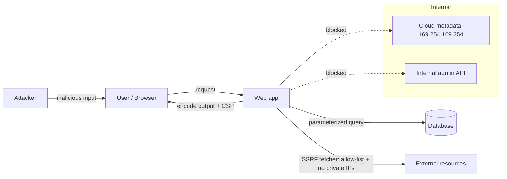

# Web Vulnerabilities (Injection, XSS, CSRF, SSRF)

## 1. One-Line Definition
The core web vulnerabilities are classes of bug where untrusted input reaches an interpreter or privileged action without proper handling — SQL/command **injection** (data interpreted as code), **XSS** (script injected into pages), **CSRF** (another site makes the user's browser send authenticated requests), and **SSRF** (the server is tricked into making requests to internal targets).

## 2. Why Do We Need It?
These four bug classes dominate real-world breaches because they bypass every perimeter control: the attacker uses *your* application and *your* users' credentials as the weapon. They're also classic HLD interview topics because mitigations are architectural (parameterized queries, output encoding, token/session design, network egress rules), not just code linting. Understanding them is understanding how to keep a web system trustworthy end-to-end.

## 3. Simple Intuition
- *Injection:* a bank teller who types whatever a customer writes on a slip directly into the vault-command terminal — if the slip says "…and open the safe," it opens. Fix: tellers use a form where letters can't be commands.
- *XSS:* posting a note on the office board that says "read me" but actually rewires the printer for everyone who reads it. Fix: the board renders words as words, never as instructions.
- *CSRF:* someone mails you a "click to claim a prize" button that is secretly a signed-in transfer request from a page you're already logged into. Fix: your browser checks that the request really came from your site (token), not a third-party page.
- *SSRF:* the office concierge will fetch any address you give (including the internal vault room). Fix: the concierge has an allow-list of external addresses and refuses internal ones.

## 4. What Happens Without It?
- *Injection:* full database dump, authentication bypass, RCE (command injection), data tampering — the classic `' OR 1=1--` login and the `; rm -rf` shell.
- *XSS:* session theft (tokens in JS-readable storage), credential phishing on your own domain, malicious actions as the victim, wormable self-spreading (stored XSS in profiles/comments).
- *CSRF:* money transfers, email/password changes, and state-changing admin actions performed silently while the user is logged in.
- *SSRF:* internal network discovery, hitting metadata services (cloud credentials!), internal admin APIs, port scanning from your server — often the first step in a cloud breach.

## 5. Core Idea
- **Injection:**
  - SQL: use **parameterized queries/prepared statements** (never string-concatenate SQL); ORM safely used; least-privilege DB accounts.
  - Command: avoid shell; if needed, allow-list args, no shell interpolation.
  - NoSQL/template/LDAP injection: same principle — bind values, never interpret input as code/structure.
  - Defense-in-depth: input validation (format), least privilege, escape on output.
- **XSS:**
  - *Stored* (persisted, served to others), *Reflected* (in a link/response), *DOM-based* (client-side JS reads input into the DOM).
  - Fix: **context-aware output encoding** (HTML/attr/JS/URL contexts), Content-Security-Policy (CSP) as a strong secondary control, avoid `innerHTML`/`eval`, sanitize rich HTML with a vetted library, mark cookies `HttpOnly`.
- **CSRF:**
  - Root cause: browsers automatically attach cookies to cross-site requests.
  - Fix: **anti-CSRF tokens** (synchronizer token / double-submit) for state-changing requests; `SameSite=Lax/Strict` cookies; verify `Origin`/`Referer`; never perform state changes on GET.
- **SSRF:**
  - Root cause: server fetches a user-supplied URL without restrictions.
  - Fix: strict **allow-list** of destinations, block private/link-local/metadata IP ranges (169.254.169.254), disable redirects or re-validate each hop, egress firewall/DNS controls, and use cloud metadata protections (IMDSv2). Treat URL fetchers/webhooks/image-proxies as untrusted-by-design.
- **Cross-cutting:** input validation for *format*, encoding for *context*, least privilege for *blast*; assume any input from users/systems/third parties is hostile. OWASP Top 10 as the checklist.

## 6. Important Terminology

| Term | Simple Meaning |
|------|----------------|
| Injection | Untrusted data interpreted as code |
| Parameterized query | Query with bound values, not concatenation |
| XSS | Injecting script into a page |
| Stored / Reflected / DOM XSS | Persisted / echoed / client-side variants |
| CSP | Browser policy restricting script sources |
| CSRF | Cross-site request forged with user's cookie |
| CSRF token | Unpredictable value proving same-site intent |
| SameSite cookie | Browser rule limiting cross-site sends |
| SSRF | Server tricked into fetching internal target |
| IMDS | Cloud instance metadata (SSRF target) |
| Allow-list | Only explicitly permitted values/domains |

## 7. Basic Architecture



## 8. Request or Data Flow
1. User submits input → server validates format (allow-list) → uses parameterized queries → output-encoded when rendered.
2. For state-changing requests, browser sends SameSite cookie + anti-CSRF token; server verifies both.
3. For URL-fetching features (webhooks, previews), server checks the target against an allow-list, blocks private IPs/metadata, and re-checks redirects.
4. CSP limits any script that slips through; logs/alerts flag blocked violations.

## 9. Practical Example
**Multi-tenant SaaS (assumptions):**
- *Login form:* parameterized query + rate limiting → `' OR 1=1--` returns no rows (fixed).
- *User profile:* bio field stored XSS in profile view → fixed with context-aware encoding + sanitizer + CSP; session cookies `HttpOnly; Secure; SameSite=Lax` so script can't read them anyway.
- *Transfers:* POST with anti-CSRF token + SameSite=Strict → a "free iPhone" phishing page can't trigger a transfer.
- *Image-URL import:* server-side fetch made SSRF-able when a user supplied `http://169.254.169.254/latest/meta-data/` → fixed with allow-list + IMDSv2 + egress rules; the pentest that found it also found an internal admin port.

## 10. Scaling
- **CSP at scale:** report-only first to collect violations, then enforce; a strict nonce-based CSP on large apps needs coordination (inline scripts, third parties).
- **Input validation scales via frameworks** (ORM/prepared statements by default); the risk is legacy string-SQL.
- **SSRF controls scale with infrastructure:** centralize outbound fetches behind a proxy with allow-list/policy, so every team doesn't reinvent it.
- **Security testing at scale:** SAST/DAST, dependency scanning, and fuzzing in CI; bug-bounty/pentest cadence.

## 11. Reliability and Failure Scenarios

| Failure | Happens | Detection | Recovery | Trade-off |
|---------|---------|-----------|----------|-----------|
| SQLi via legacy query | Data breach | WAF/DAST/scan | Parameterize, rotate creds | remediation time |
| Stored XSS | Session theft/worm | CSP reports, bug bounty | Encode, sanitize, revoke sessions | UX for rich content |
| CSRF on transfer | Fraud | Anomaly/audit | Add tokens + SameSite | legacy client breaks |
| SSRF to IMDS | Cloud creds stolen | Egress alerts | IMDSv2, allow-list, rotate keys | feature limits |
| Dependency CVE | RCE/leak | SCA scanning | Patch/upgrade | upgrade churn |
| Misconfigured CSP | False security | CSP reports | Fix policy | enforcement effort |

## 12. Consistency and Correctness
Security controls must apply *uniformly*: one un-parameterized legacy endpoint or one image proxy without SSRF checks negates the rest. Encode for the **destination context** (HTML vs attribute vs URL vs JS) — a fix applied in the wrong context still fails. And authZ must be checked server-side per object regardless of XSS/CSRF defenses (see authentication-vs-authorization).

## 13. Performance
Parameterized queries are as fast/faster than ad-hoc (prepared plans); CSP adds negligible runtime overhead; CSRF token issuance is trivial (store in session). SSRF allow-list checks are string/IP validations (fast). The bigger cost is developer workflow (frameworks/encoders/templates) — worth it.

## 14. Security
This whole file *is* security. Meta-points: use the OWASP Top 10/ASVS as the baseline, apply secure defaults in frameworks, use a WAF as defense-in-depth (not primary), keep dependencies patched, and never trust client-side validation. Log/alert blocked requests, but don't log sensitive inputs.

## 15. Trade-Offs

| Control | Advantages | Disadvantages | When to Use |
|---------|------------|---------------|-------------|
| Parameterized queries | Eliminates SQLi | Legacy migration effort | Always |
| Output encoding + CSP | Stops XSS broadly | CSP tuning, rich HTML ops | All web apps |
| CSRF token + SameSite | Strong anti-CSRF | Breaks some cross-site flows | State-changing endpoints |
| SSRF allow-list + egress | Blocks internal access | Feature friction | Any server-side fetch |
| WAF | Quick mitigation | False positives/bypass | Layered defense |
| Sanitize rich HTML | Keeps features | Library maturity risk | User HTML (comments) |

## 16. Common Mistakes
- Client-side-only validation (defense in depth, not a fix).
- Escaping in the wrong context (HTML-escape in a JS attribute, etc.).
- `SameSite=None` without Secure, or state changes on GET (CSRF hole).
- SSRF unfixed because "only admins can set webhook URLs" (insider/second-order attacks).
- Trusting the `Host` header or redirects blindly; skipping metadata IP blocking.
- Treating WAF as the fix rather than monitoring + real code fixes.

## 17. HLD vs LLD Boundary
HLD: input handling policy, output encoding/CSP posture, session/CSRF architecture, outbound-fetch (SSRF) boundaries, security testing in CI, WAF placement. LLD: parameterized query code, encoder/CSP directives, token generation/verification, URL/IP validation, dependency scanning config.

## 18. Interview Questions

### Beginner
- What's the difference between stored and reflected XSS?
- Why is string-concatenated SQL dangerous, and what replaces it?

### Intermediate
- A user's profile bio executes JS for every viewer. Diagnose the bug class and give a layered fix.
- Why does CSRF work even though the attacker can't read the request? Design the token/SameSite defense.

### Advanced
- Design secure URL-preview fetching for a chat app at scale: allow-list policy, redirect handling, metadata protection, egress controls, and monitoring — and explain how you'd test it.
- An incident: SSRF hit the cloud metadata endpoint and exfiltrated temporary credentials. Give the full containment + remediation plan and the architectural changes to prevent recurrence.

## 19. Interview Memory Summary

> [!abstract]- Interview Memory Summary

### Remember

- Injection = data-as-code → parameterize + least privilege.
- XSS = script-in-page → context-aware encoding + CSP + HttpOnly.
- CSRF = forged authenticated request → anti-CSRF token + SameSite + no state changes on GET.
- SSRF = server-side fetch of internal targets → allow-list + block private/metadata + egress controls.
- Validate format on input, encode for context on output, least privilege always; never trust the client.
- Controls must apply uniformly — one legacy endpoint negates the rest.
- WAF is defense-in-depth, not the fix.

### 30-Second Explanation

Treat all input as hostile: parameterize queries, encode outputs and enforce CSP, use anti-CSRF tokens with SameSite cookies, and gate server-side fetches with allow-lists and egress rules — then test with SAST/DAST/pentest and keep dependencies patched.

### Interview Traps

- Offering WAF or client-side validation as the fix — interviewers expect the architectural fix (parameterization, encoding context, token/session design, egress allow-list) with defense-in-depth layered on top.
- Escaping in the wrong context (HTML-escape in a JS attribute, etc.).
- SameSite=None without Secure, or state changes on GET.
- SSRF unfixed because "only admins can set webhook URLs" — insider/second-order attacks.

### Key Trade-Off

Each control trades security for feature flexibility: parameterization beats ad-hoc SQL but needs legacy migration, CSP/encoding limits rich HTML, SameSite breaks cross-site flows, and egress allow-lists constrain legitimate fetches — the architect's job is layering them into the app rather than treating a WAF as sufficient.

## 20. Related Concepts

### Prerequisites

- [[http-and-https|HTTP and HTTPS]]

### Commonly Used Together

- [[authentication-vs-authorization|Authentication vs Authorization]]
- [[oauth-oidc-jwt|OAuth 2.0 / OIDC / JWT]]
- [[encryption-and-keys|Encryption and Keys]]

### Advanced Concepts

- [[rate-limiter|Rate Limiter]]

Related planned topics (not authored yet): API Gateway.

## 21. References
OWASP Top 10 + OWASP Cheat Sheets (SQL Injection Prevention, XSS Prevention, CSRF Prevention, SSRF Prevention), PortSwigger Web Security Academy. Verify current guidance pre-interview.

## 22. Active Recall

Test yourself before revealing each answer.

> [!question]- What's the difference between stored and reflected XSS?
> Stored XSS is *persisted* (e.g., in a profile bio or comment) and served to every visitor — often wormable. Reflected XSS is echoed immediately from the request (e.g., error message rendering a URL parameter) and delivered via a crafted link. Both are fixed with context-aware output encoding; stored additionally needs sanitization/CSP and HttpOnly cookies.

> [!question]- Why is string-concatenated SQL dangerous, and what replaces it?
> Untrusted input is concatenated into the query, so data becomes code — `' OR 1=1--` breaks the login or `; rm -rf` executes commands. Replacement: parameterized queries/prepared statements (values bound, never interpreted), ORM used safely, plus least-privilege DB accounts and format validation as defense-in-depth.

> [!question]- A user's profile bio executes JS for every viewer. Diagnose and give the layered fix.
> Stored XSS: the bio is rendered as HTML and the JS is executed for each viewer (session theft, phishing, or worm). Layered fix: context-aware output encoding for the HTML/attribute/JS context, a vetted HTML sanitizer for rich content, Content-Security-Policy restricting script sources, cookies marked HttpOnly so stolen script can't read tokens, and CSP-violation monitoring.

> [!question]- Why does CSRF work even though the attacker can't read the response?
> CSRF exploits the browser auto-attaching cookies: a third-party page triggers a request to your site that carries the user's session cookie, so the request *looks authenticated* — the attacker never needs to read the response, only forge the state-changing action. Defense: anti-CSRF tokens the forged page can't know, SameSite=Lax/Strict cookies, and never doing state changes on GET.

> [!question]- When would you build an SSRF-prone fetcher, and how do you harden it?
> Any server-side fetch of user-supplied URLs — webhooks, image proxies, URL previews, file import. Harden with: strict allow-list of destinations, blocking private/link-local/metadata ranges (169.254.169.254), disabling or re-validating redirects at each hop, egress firewall/DNS controls, and IMDSv2 for cloud metadata. Treat every URL fetcher as untrusted-by-design.

> [!question]- Why is escaping in the wrong context dangerous? Give an example.
> Encoding must match the *destination* context: HTML-encoding inside a JS string or attribute doesn't neutralize script there (e.g., `onerror` attribute). The fix applied in the wrong context still fails — that's why encoding is context-aware and you verify each sink (HTML, attribute, URL, JS) with the matching encoder.

> [!question]- One legacy endpoint doesn't use prepared statements. Is the rest of the app still safe?
> No — security controls must apply *uniformly*. A single un-parameterized legacy SQL endpoint or one image proxy without SSRF checks negates the rest of the hardening, because the attacker picks the weakest entry point. Remediation: parameterize that endpoint, rotate credentials, scan for more, and add SAST/DAST to find the stragglers.

> [!question]- SSRF hit the cloud metadata endpoint and exfiltrated credentials. Give containment and the architectural changes.
> Containment: block the metadata IP at egress immediately, rotate the exfiltrated temporary/static credentials, and audit the fetcher for other internal targets (admin APIs, ports). Architectural fixes: IMDSv2, strict allow-lists with no private/metadata ranges, redirect re-validation, centralized egress proxy/policy so every team inherits it, and alerts on blocked violation attempts.

> [!question]- Interview scenario: design secure URL-preview fetching for a chat app at scale.
> Centralize all outbound fetches behind one service/proxy with an allow-list policy and block private/link-local/metadata IPs; validate and follow redirects only after re-checking each hop; set short timeouts + size limits; enforce egress firewall/DNS controls and IMDSv2; log violations and rate-limit the fetcher. Test with a designed attack suite (metadata URL, redirect loop to internal IP).

> [!question]- "We bought a WAF, so our app is secure." How do you respond?
> WAF is defense-in-depth, not the fix: it can't enforce per-object authZ, can't context-aware encode your output, and can be bypassed — it adds monitoring and visibility. The architectural fixes (parameterization, output encoding + CSP, CSRF tokens + SameSite, SSRF allow-lists + egress) live in the app; WAF sits on top, layered with SAST/DAST, dependency patching, and honest testing.

## 23. When Should I Use This?

### Use it when

- Any web app accepts user input that reaches queries, HTML, cookies, or outbound fetches.
- You hold sessions/tokens in the browser (XSS and CSRF threat surface).
- Features do server-side fetching: webhooks, image proxies, URL previews, imports (SSRF).
- You're writing SQL/commands/templates with user or third-party data (injection surface).
- You're layering a security program: OWASP Top 10 baseline, SAST/DAST, WAF as defense-in-depth.

### Avoid it when

- There is genuinely no untrusted input and no browser context — the bug classes mostly don't apply (still keep hygiene).
- A WAF or client-side validation is proposed as the *only* control — that's not this pattern; the app-level architectural controls are the point.
- You can't commit to uniform enforcement — one legacy endpoint defeats the design.
- The real issue is authorization logic (IDOR/roles), not injection/encoding — focus on authZ instead.

### What problem does it solve?

Untrusted input reaching an interpreter or privileged action is the leak; the perimeter can't help because the attacker uses *your* application and *your users'* credentials. The bottleneck: each bug class has a different bypass. The solution: per-class architectural controls — parameterization for injection, context-aware encoding + CSP + HttpOnly for XSS, anti-CSRF tokens + SameSite for CSRF, and allow-lists + egress + IMDSv2 for SSRF — applied uniformly with defense-in-depth.

### What problem does it NOT solve?

Authorization (object-level authZ is still a separate server-side layer), fully stopping credentialed attackers or business-logic abuse, and it doesn't replace dependency patching, secrets hygiene, or secure deployment. It also only works if enforced uniformly and re-tested continuously.

## 24. Decision Connections

Decisions that go together with Web Vulnerabilities:

- [[authentication-vs-authorization|Authentication vs Authorization]] — missing object-level authZ is the IDOR class; authZ must be enforced server-side regardless of XSS/CSRF defenses.
- [[oauth-oidc-jwt|OAuth 2.0 / OIDC / JWT]] — tokens are prime XSS targets; token storage, state/nonce, and SameSite directly shape the CSRF posture.
- [[encryption-and-keys|Encryption and Keys]] — TLS transport, HttpOnly/secure cookies, and hashing (never encrypting) passwords; secret exposure is often the root leak.
- [[http-and-https|HTTP and HTTPS]] — HTTPS/HSTS, cookies, headers, and redirect semantics are the transport these bugs ride on.
- [[rate-limiter|Rate Limiter]] — throttles brute force, credential stuffing, and fetcher abuse that pairs with the rawer of these flaws.

Decision tree:

```
Web app accepting untrusted input
    |
    +-- Input reaches a query (SQL/NoSQL/command/template)?
    |      → parameterized queries / bind values, no shell interpolation
    |      → least-privilege DB accounts + input format validation
    |
    +-- User content rendered to other users?
    |      → context-aware output encoding + sanitizer + CSP + HttpOnly
    |         (stored/reflected/DOM XSS)
    |
    +-- State-changing requests from the browser?
    |      → anti-CSRF token + SameSite cookies; never state-change on GET
    |
    +-- Server fetches a user-supplied URL (webhook/preview/proxy)?
    |      → SSRF: allow-list + block private/metadata + egress + IMDSv2
    |
    +-- Sessions / authZ involved?
    |      → [[authentication-vs-authorization|Authentication vs Authorization]]
    |      → [[oauth-oidc-jwt|OAuth 2.0 / OIDC / JWT]] (token storage, state/nonce)
    |
    +-- Transport / storage of credentials?
    |      → [[http-and-https|HTTP and HTTPS]] (TLS/HSTS)
    |      → [[encryption-and-keys|Encryption and Keys]]
    |
    +-- Hardening and monitoring?
           → [[rate-limiter|Rate Limiter]] + WAF as defense-in-depth (not the fix)
```