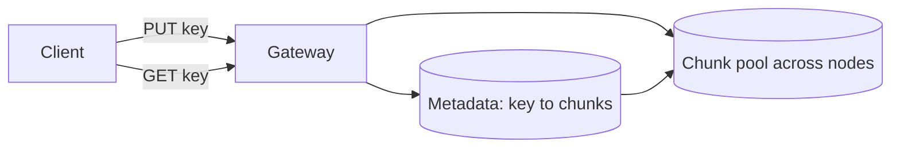

# Blob Storage

## 1. One-Line Definition
Blob storage (also called object storage) is a flat, scal-out service that stores opaque byte blobs under string keys in buckets and exposes them over HTTP verbs, where overwriting a key replaces the whole blob and individual bytes cannot be edited in place.

## 2. Why Do We Need It?
Databases and file systems cap out: a single node's disk, a namespace, a metadata server. User photos, videos, backups, and logs are *huge collections of independent atomic chunks* that do not need random byte edits — they need cheap, durable, HTTP-accessible storage that scales with the number of blobs, not with one server. Blob storage provides that: PUT a blob, GET it back later, pay per GB and per request, and never think about servers.

## 3. Simple Intuition
A post office where each parcel is labeled with a flat address (no folders inside folders). To change a parcel you hand in the whole new parcel under the same address — there is no editing inside. The post office sorts and stores parcels across many facilities so a million deliveries land in seconds; your only job is to keep addresses unique.

## 4. What Happens Without It?
You bolt storage onto whatever exists: images inside a database (expensive, indexed reads grow out of control), files on an NFS whose namespace and I/O cannot handle billions of small files, or raw disks that die with no redundancy. Uploads stall, retrieval is slow, and cloud economics disappear. Blob storage is the default answer for "unstructured, content-addressable-at-a-key, must scale" data.

## 5. Core Idea
- **Bucket/container** = top-level namespace scoped to an account/region.
- **Blob** = an opaque byte payload plus a system-managed metadata (ETag/checksum, content-type, last-modified) and user-supplied tags.
- **Key** = the flat string address for the blob (often looks like a path: `u/123/photo.jpg` — but it is not a folder).
- **Operations** = PUT/GET/HEAD/DELETE over HTTPS; overwrite and delete are whole-object; no append, no in-place patch.
- **Underneath**: blobs are split into chunks and spread across many machines with replication or [[erasure-coding|Erasure Coding]], exposed as one logical object.
- **Best-fit use**: media, documents, backups, logs, code artifacts — anything that is written once and read many times.

## 6. Important Terminology

| Term | Simple Meaning |
|------|----------------|
| Bucket | Account/region-scoped namespace of blobs |
| Blob / object | The byte payload plus metadata |
| Key | Flat string address inside a bucket |
| ETag / checksum | Fingerprint of the blob for integrity |
| PUT / GET / DELETE | HTTP verbs that create, read, remove a blob |
| Multipart upload | Split a large blob into parts, upload, then assemble (see [[chunking-and-uploads|Chunking and Resumable Uploads]]) |
| Signed URL | Time-bound URL that grants access to one blob |
| Lifecycle policy | Rules to move blobs to colder/cheaper tiers or delete them (see [[storage-tiering|Storage Tiering and Lifecycle]]) |
| Strong read-after-write | A just-uploaded blob is immediately visible to subsequent reads |

## 7. Basic Architecture



## 8. Request or Data Flow
1. A client uploads `docs/report.pdf` with a signed URL (or authenticated SDK call).
2. Gateway splits the payload into chunks (see [[chunking-and-uploads|Chunking and Resumable Uploads]]), writes them to the chunk pool with replication/Erasure Coding, computes an ETag.
3. Gateway writes metadata mapping `key → chunk list + ETag + content-type`. Only now is the blob visible: read-after-write is strong.
4. A GET pulls the metadata, streams chunks in order, verifies the ETag at the end. DELETE marks the metadata tombstoned; the bytes are reclaimed later by garbage collection.

## 9. Practical Example
A video platform stores every uploaded video as a blob:
- Key scheme: `v/{video_id}/original.mp4`, then processed renditions as sibling keys `v/{video_id}/720p.m3u8`, `v/{video_id}/720p-seg-0.ts` (see [[media-processing|Media Processing Pipeline]]).
- A 10 GB video is uploaded with multipart, resumable chunks; a user GETs it with HTTP range requests so playback starts at byte 0 without downloading the whole thing.
- Costs and durability are decided by bucket config: 3 copies of hot data, or a single copy + lifecycle to glacier after 90 days (see [[storage-tiering|Storage Tiering and Lifecycle]]).

## 10. Scaling
- **Blob count/GB**: partitions by key; nearly unbounded. Scale the metadata store and chunk pool, not any one node.
- **Hot keys**: thousands of concurrent GETs on one key is fine — the serving layer fans out to many chunk replicas; but watch very hot metadata for a single key.
- **Keys**: prefixed keys (`v/{video_id}/...`) cluster; hash prefixes (see [[consistent-hashing|Consistent Hashing]]) if you need even spread, at the cost of lexical listing.
- **Listing**: listing millions of keys lexically is expensive — design the key scheme so hot operations are direct GETs, not scans.

## 11. Reliability and Failure Scenarios

| Failure | What Happens | Detection | Recovery | Trade-off |
|---------|--------------|-----------|----------|-----------|
| Chunk node dies | Some chunks of many blobs unavailable | Chunk integrity checks / node health | Repair from same-region replicas or Erasure Coding parity | writes while rebuilding |
| Region outage | Blobs in that region slow/unreachable | Region health | Serve from cross-region replica; or failover (see [[standby-models|Standby Types]]) | RPO window |
| Blob corrupted in storage | ETag mismatch on read | Checksum at read time | Fetch another replica, rewrite the chunk | extra read cost |
| Bucket misconfigured (public) | Data exposure | Access logging, bucket scanning | Tighten IAM + use signed URLs (see [[authentication-vs-authorization|Authentication vs Authorization]]) | ops discipline |

## 12. Consistency and Correctness
- Modern majors (S3, Azure Blob, GCS) provide **strong read-after-write** for new objects and for overwriting existing objects in the same region.
- **Listing** can lag in some services after writes; if correctness needs immediate list visibility, list-check-write ordering must be designed for.
- Overwrite is a replace-whole-blob — two clients racing to PUT the same key end at the last writer; versioning (see [[immutable-storage|Immutable Storage and Versioning]]) turns overwrites into a visible history if you need that.
- Multipart upload commit is atomic: the blob appears only when you CompleteMultipartUpload, with the exact part list you declared.

## 13. Performance
- Small blobs: one HTTP round trip + metadata write, ~10-50ms warm.
- Large blobs: ranged/parallel GETs stream hundreds of MB/s; upload parallelism via multipart (see [[chunking-and-uploads|Chunking and Resumable Uploads]]).
- Throughput is bounded by network and request concurrency, not by a single disk — that is the point of scaling out warehouses of nodes.
- Beware: per-request pricing means millions of tiny blobs cost real money in request fees, not just GB — batch or compress small objects (see [[compression|Compression and Serialization]]).

## 14. Security
- **At rest**: server-side or client-side encryption (see [[encryption-and-keys|Encryption and Keys]]); buckets are encrypted by default on major clouds.
- **Access**: bucket policies, IAM, and **signed URLs** — time/scope-limited pre-issued URLs are how you let an unauthenticated app stream one private blob (see [[immutable-storage|Immutable Storage and Versioning]]).
- **In transit**: TLS; use signed URLs that tie method (GET/PUT), expiry, and key together.
- **Leaks** happen most often via over-broad bucket policies — default-private, least privilege (see [[authentication-vs-authorization|Authentication vs Authorization]]).

## 15. Trade-Offs

| Property | Advantage | Disadvantage |
|----------|-----------|--------------|
| Flat key namespace | Scales to exabytes | No native folders; key design is your job |
| Whole-blob replace | Simple, atomic | No append or in-place patch; editing data means rewriting it |
| HTTP API | Ubiquitous, signed URLs, range reads | Per-request cost; naive small-object floods are expensive |
| Strong read-after-write | Predictable | Cross-region replication still lags; design RPO on top |
| Cloud managed | No ops | Vendor + egress costs; migration needs tooling |

## 16. Common Mistakes
- Using a single key for a mutable, edited document — blob storage forces rewrite-on-change; prefer DB rows or versioning.
- Choosing tiny blobs per logical entity and paying request costs; batch or compress small payloads.
- Ignoring cross-region replication lag when promising users "instantly available everywhere".
- Making buckets public to "save time" — then everything leaks; use signed URLs instead.
- Forgetting lifecycle rules so hot-tier prices and backups grow unbounded (see [[storage-tiering|Storage Tiering and Lifecycle]]).

## 17. HLD vs LLD Boundary
HLD: bucket layout, key scheme, durability/replication scope, lifecycle policy, where signed URLs are minted, and the cheaper-than-DB boundary (what is a blob vs what is a row). LLD: the SDK calls — PUT/GET/range/request retries, checksum verification, exponential backoff inside one service.

## 18. Interview Questions

### Beginner
- What is a blob and what operations can you do on it?
- Why does blob storage scale where a file system does not?
- What is a signed URL and when would you use one?

### Intermediate
- Design the key scheme for a photo-sharing app with 1B photos so listing and access both stay cheap.
- Your app needs to edit part of a 1 GB document stored as a blob. What are the options and their costs?
- Why is overwrite consistency (strong read-after-write) easier to reason about with versioning?

### Advanced
- How does a blob store survive losing a rack of nodes without losing data, and how does that differ from replication?
- You promise "zero RPO" across regions for user uploads. Which blob-storage features do you need and what is the honest RPO with cross-region replication?

## 19. Interview Memory Summary

> [!abstract]- Interview Memory Summary

### Remember

- Blob storage = bucket + flat key + opaque byte payload, over HTTP.
- Whole-object replace; no byte edits, no append.
- Strong read-after-write for new objects/overwrites; listing may wait.
- Under the hood: chunks across many nodes + replication / Erasure Coding.
- Signed URLs for private, time-bound access; default-private buckets.
- Key design = your job; prefixes affect both hot spots and listing cost.
- Small blobs are expensive in request fees, not just GB.

### 30-Second Explanation

Blob storage offers an exabyte-scale, HTTP-native home for unstructured data: name each blob with a flat key in a bucket, PUT/GET/DELETE it whole, and let the service handle chunking, replication/Erasure Coding, and strong read-after-write. Design the key scheme so hot reads are direct GETs and writes are naturally spread; keep buckets private, mint signed URLs for access, and add lifecycle rules so cold data moves to cheaper tiers.

### Interview Traps

- Saying "blob storage is eventually consistent everywhere" — modern majors give strong read-after-write.
- Treating keys as folders — the flat namespace is a feature and a trap.
- Forgetting request-level pricing when choosing blob granularity.
- Ignoring cross-region RPO when promising global durability.

### Key Trade-Off

You trade random byte-editing and folders for unlimited cheap scale and a ubiquitous HTTP API; the tax is that you must treat blobs as immutable units and design key space yourself.

## 20. Related Concepts

### Prerequisites

- [[file-block-object-storage|File / Block / Object Storage]]
- [[capacity-estimation|Capacity Estimation]]
- [[cdn|CDN and Edge Caching]]

### Commonly Used Together

- [[chunking-and-uploads|Chunking and Resumable Uploads]]
- [[storage-tiering|Storage Tiering and Lifecycle]]
- [[media-processing|Media Processing Pipeline]]
- [[cdn|CDN and Edge Caching]]

### Alternatives

- [[file-block-object-storage|File / Block / Object Storage]] — file shares when you truly need byte-editable shared trees
- [[database-fundamentals|Database Fundamentals]] — rows when data is structured, indexed, transactional

### Advanced Concepts

- [[content-addressable-storage|Content-Addressable Storage]]
- [[erasure-coding|Erasure Coding]]
- [[immutable-storage|Immutable Storage and Versioning]]

## 21. References
AWS Simple Storage Service (S3) and multipart-upload documentation; Azure Blob Storage and Google Cloud Storage docs for object-store consistency semantics; Kleppmann, Designing Data-Intensive Applications, ch. 5 (replication-based storage backends).

## 22. Active Recall

Test yourself before revealing each answer.

> [!question]- What operations does blob storage natively support, and what does it refuse to do?
> PUT, GET, HEAD, DELETE of a whole blob under a key — plus multipart and range reads. It refuses byte-level in-place edits and appends; changing data means replacing the whole blob.

> [!question]- Why can blob storage scale to billions of objects when a single server cannot?
> The logical object is just metadata pointing at chunks spread across many nodes, so capacity grows by adding nodes to the chunk pool and sharding the metadata keyed by key-hash — there is no single disk or namespace to outgrow.

> [!question]- Design a key scheme for 1B user photos where listing a user's photos is cheap but writes are evenly spread.
> `u/{user_id}/{photo_id}` groups a user's photos lexically for cheap listing (a scan bounded by that prefix), and because user ids are high-cardinality, writes spread across partitions. Put the hot and common dimension first; reserve hashing for truly uniform keying (see [[sharding-strategies|Sharding Strategies]]).

> [!question]- How do you let an anonymous client upload a file to a private bucket?
> Mint a PUT signed URL scoped to the exact key and expiry, hand it to the client, and let them upload directly — the bucket stays private and you never expose credentials.

> [!question]- A blob read returns ETag mismatch. What happened and what do you do?
> The bytes changed since upload or a chunk corrupted in storage. The store serves another replica / repairs the chunk and rewrites; you detect via checksum verification built into the read path.

> [!question]- Interview scenario: users upload 2 GB graduation videos; what is your HLD in four moves?
> 1) Upload via multipart, resumable chunks (see [[chunking-and-uploads|Chunking and Resumable Uploads]]); 2) store original in blob storage, private, in the user's nearest region; 3) run asynchronous [[media-processing|Media Processing Pipeline]] to produce adaptive renditions stored as sibling keys; 4) serve range reads through [[cdn|CDN and Edge Caching]], with lifecycle rules moving old originals to cold tiers.

## 23. When Should I Use This?

### Use it when

- Data is unstructured, immutable-at-a-key bytes: media, backups, logs, artifacts.
- You need exabyte-class scale, cheap per-GB pricing, and HTTP access.
- Clients should upload/download directly without a proxy parsing bytes.
- You want managed replication/Erasure Coding and lifecycle (see [[storage-tiering|Storage Tiering and Lifecycle]]).

### Avoid it when

- You need byte-append or in-place update (use a database or a file-like log, e.g. [[kafka-retention|Kafka Retention]]).
- Random-access transactional lookups dominate (a database).
- The objects are tiny and ultra-high-QPS read updates — per-request cost and metadata overhead make [[caching|Caching]] or a KV store cheaper.

### What problem does it solve?

It removes the "where do I put an unbounded pile of blobs" problem: flat HTTP namespace, durable under the hood, strong read-after-write, costs predictable per GB and per request.

### What problem does it NOT solve?

It does not give you folders, append, in-place edits, transactional multi-blob operations, or instant cross-region availability; you supply key design, lifecycle, versioning policy, and access control.

## 24. Decision Connections

Blob storage decisions connect across the system:

- [[file-block-object-storage|File / Block / Object Storage]] — why object is the scale-out choice among the three.
- [[chunking-and-uploads|Chunking and Resumable Uploads]] — how big blobs actually get into and out of the store.
- [[cdn|CDN and Edge Caching]] — what makes GET-served blobs fast worldwide (dns, TLS, edge).
- [[storage-tiering|Storage Tiering and Lifecycle]] — hot vs cold handling of the same bucket.
- [[content-addressable-storage|Content-Addressable Storage]] — when the key should equal a content hash for dedup.
- [[media-processing|Media Processing Pipeline]] — the canonical consumer of upload blobs.
- [[encryption-and-keys|Encryption and Keys]] and [[immutable-storage|Immutable Storage and Versioning]] — data protection and WORM.

Decision tree:

```
Unstructured bytes that must scale:
    |
    +-- Need byte-level edits or append?
    |      → row/column in a DB, or an append-only log
    |
    +-- Editable shared tree over a LAN?
    |      → [[file-block-object-storage|File / Block / Object Storage]]
    |
    +-- Content is new, immutable, HTTP-served?
    |      → [[blob-storage|Blob Storage]]
    |         |
    |         +-- Big files?     → [[chunking-and-uploads|Chunking and Resumable Uploads]]
    |         +-- Cold data?     → [[storage-tiering|Storage Tiering and Lifecycle]]
    |         +-- Same bytes many times? → [[content-addressable-storage|Content-Addressable Storage]]
    |         +-- Media?         → [[media-processing|Media Processing Pipeline]] + [[cdn|CDN and Edge Caching]]
```