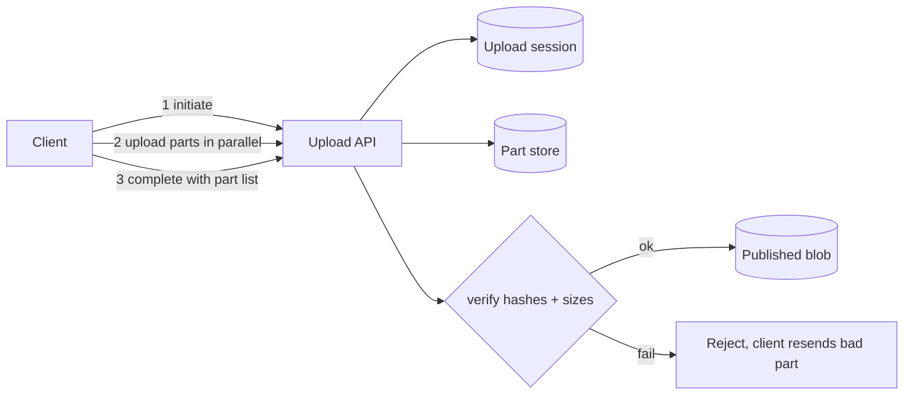

# Chunking and Resumable Uploads

## 1. One-Line Definition
Chunking splits a large payload into smaller independent parts so a system can upload them in parallel, retry only the failed part, and resume an interrupted transfer instead of restarting from byte zero; a resumable upload protocol persists upload state server-side under an upload ID until every part is committed.

## 2. Why Do We Need It?
A 10 GB video upload over a flaky connection either fails and the user starts again, or succeeds only after reading the whole payload through one fragile HTTP stream. Uploading monolithic files is a UX and reliability disaster. Chunking solves three problems at once: network resilience (resume mid-file), throughput (parallel parts bury latency), and storage efficiency (chunk-level checksums and dedup). It is the mechanism behind every serious media-sharing, backup, and cloud-storage product.

## 3. Simple Intuition
Moving a heavy crate vs moving it in boxes. The crate is all-or-nothing: one torn corner and nothing arrived. The boxes can be shipped on many trucks simultaneously, re-shipped individually if one falls off, and you can ask "which boxes already arrived?" and send only the missing ones. Chunked upload is the box method, with an inventory list (part numbers) kept by the receiving warehouse.

## 4. What Happens Without It?
Large uploads fail as a whole (bad UX, retried cost on mobile networks), throughput is serial so multi-GB files take forever, and there is no cheap way to make transfers idempotent — a retry after a blip re-sends everything already transferred. Team effort: without chunking there is also no clean chunk-level dedup, which makes same-content uploads (app updates, shared videos) squeeze storage.

## 5. Core Idea
- **Upload session / upload ID**: the server creates a logical transfer with an ID; all part operations reference it so a client can come back hours later.
- **Chunk size**: bounded transfer unit (commonly 5-64 MiB). Tune between too small (many round trips, metadata cost) and too large (expensive retries).
- **Parallelism**: upload parts concurrently; per-connection throughput × concurrency ≈ total speed.
- **Resumability**: client asks the server "which parts do you already have?", re-uploads the missing ones, then commits.
- **Idempotency + integrity**: each part has a checksum/ETag; re-uploading the same part overwrites it harmlessly; the commit lists exact parts and the server verifies sizes and hashes.
- **Commit is atomic**: the object appears only when the complete/commit call succeeds with a valid part list; before that the blob does not exist.

## 6. Important Terminology

| Term | Simple Meaning |
|------|----------------|
| Chunk / part | A bounded independent piece of the payload |
| Upload ID / session | Server-side handle for the in-progress transfer |
| Part number | Ordering index inside the session |
| Part ETag / checksum | Hash of one part, used for integrity and idempotency |
| Initiate / UploadPart / Complete | The three phases of multipart upload |
| Resume | Re-list uploaded parts and upload only the missing ones |
| Presigned PUT | A signed URL scoped to a key (see [[blob-storage|Blob Storage]]) |
| Content-defined chunking | Chunk boundaries decided by content hash, used for dedup (see [[content-addressable-storage|Content-Addressable Storage]]) |

## 7. Basic Architecture



## 8. Request or Data Flow
1. Client calls *InitiateMultipartUpload* with the key; server allocates an upload ID.
2. Client splits the file and uploads parts in parallel (N=4-10 simultaneous), each with its part number; every part is stored independently with an ETag.
3. On a network failure the client calls *ListParts*, sees parts 1-7 and 9-11 are in, re-uploads part 8 only, and continues.
4. Client calls *Complete* with the ordered `[partNumber, ETag]` list; server verifies everything, assembles the object (it is one logical blob, see [[blob-storage|Blob Storage]]), returns the ETag of the whole file.
5. Any uncommitted upload is garbage-collected by a lifecycle rule (retention hours-days).

## 9. Practical Example
A backup service uploads a 40 GB database snapshot:
- Chunk size 16 MiB → 2500 parts; uploads 10 at a time over a 100 Mbps line ≈ theoretical ~1.5 min at full parallel throughput if the line accepts it (real life: minutes).
- A 3-minute wifi dropout middle-of-upload: client resumes by listing parts, re-uploads the handful of lost parts, completes. No user-visible restart.
- Storage side: two users back up the same movie; with content-defined chunking (see [[content-addressable-storage|Content-Addressable Storage]]) both get stored once, so dedup savings can exceed 90% for shared content.

## 10. Scaling
- **Upload services** are stateless except for the session (which lives in the part store); scale out behind [[load-balancing|Load Balancing]].
- **Part store** is the same scalable chunk pool as blob storage — parts are just blobs keyed by `upload/{id}/{part}` (see [[blob-storage|Blob Storage]]); capacity grows by adding nodes.
- **Metadata DB** (upload id → part list) needs sharding at massive scale; key by upload id so each session is one row (see [[sharding|Sharding]]).
- Rule of thumb: bigger files, bigger chunks, but the *concurrency* is what moves throughput, not chunk size alone.

## 11. Reliability and Failure Scenarios

| Failure | What Happens | Detection | Recovery | Trade-off |
|---------|--------------|-----------|----------|-----------|
| Connection drop mid-upload | Progress lost for in-flight part only | Part store vs list | Resume: re-upload only missing parts | client must implement resume |
| Part store node dies | Some parts unavailable | Checksums + health | Write parts to multiple chunks/replicas | storage overhead |
| Client crashes after uploading all parts | Uncommitted session lingers | Session age | Lifecycle deletes stale sessions | GC delay |
| Two parts same number race | Ordered assemble breaks | Part-number check at Complete | Reject and resend | extra retry |

## 12. Consistency and Correctness
- **Atomic commit**: the blob is not visible until Complete succeeds; either all listed parts are present and valid or the commit is rejected.
- **Ordering**: part numbers define the order; the server never reorders. The final object's byte layout = concatenation of parts in order.
- **Idempotency**: retrying an UploadPart with the same bytes yields the same part state; Complete with the same part list is safe to retry.
- **Checksums**: every part and the final assembled blob carry hashes, so corruption is caught at write time (part) and at read time (whole object).

## 13. Performance
- Total time ≈ (bytes / (per-connection throughput × concurrency)) + number_of_parts × per-part overhead.
- Tune chunk size: too small → round-trip and index overhead dominate; too large → one failed part costs a big re-send. Common sweet spot 5-64 MiB.
- Parallelism ceiling is NIC/network and API capacity, not your process; use bounded concurrency and backpressure (see [[latency-vs-throughput|Latency and Throughput]]).
- Hashes are cheap relative to network: computing a SHA-256 of each 16 MiB part is trivial next to actually moving it.

## 14. Security
- Use **presigned PUT URLs** per part so uploads land in a private bucket without server secrets (see [[blob-storage|Blob Storage]] and [[immutable-storage|Immutable Storage and Versioning]]).
- Verify content-type and enforce max sizes at the gateway before accepting parts (see [[web-vulnerabilities|Web Vulnerabilities]]).
- Checksums double as tamper detection; TLS protects in transit (see [[encryption-and-keys|Encryption and Keys]]).
- Rate-limit Initiate and Complete endpoints so an attacker cannot mint unlimited sessions (see [[rate-limiter|Rate Limiter]]).

## 15. Trade-Offs

| Choice | Advantage | Disadvantage |
|--------|-----------|--------------|
| Fixed-size chunking | Simple, predictable, parallel-friendly | Poor dedup across similar content |
| Content-defined chunking | Great dedup (see [[content-addressable-storage|Content-Addressable Storage]]) | CPU cost, variable boundaries complicate resume |
| Small chunks | Cheap retries, fine resume | More round trips + metadata cost |
| Large chunks | Fewer parts, less bookkeeping | Expensive retries, coarse resume |
| Server-side list-parts resume | Robust, independent of client state | Needs a stateful session store |
| Client-side only resume | No server state | Broken across devices/clients |

## 16. Common Mistakes
- Chunking by a fixed byte offset for dedup — inserting one byte at the start of a file changes every chunk boundary and kills dedup; use content-defined chunking for dedup.
- No server-side session — after a crash the client cannot find where it left off.
- Ignoring idempotency: a retried UploadPart that appends instead of replaces corrupts the file.
- Chunk size set once and never revisited as average file size grows.
- Forgetting lifecycle cleanup for abandoned upload sessions (they leak storage).

## 17. HLD vs LLD Boundary
HLD: chunk-size policy, concurrency target, session persistence, resume protocol, GC of stale sessions, integration with the object store. LLD: the SDK's UploadPart retry loop, checksum computation, listing parts, backoff logic inside one client library.

## 18. Interview Questions

### Beginner
- Why upload a large file in chunks instead of one stream?
- What happens on the server between "upload parts" and "you have a file"?
- How does a client resume an interrupted upload?

### Intermediate
- Pick a chunk size for 1 GB video uploads over 50 Mbps mobile links and justify it with numbers.
- How do you make retries idempotent in a multipart upload?
- Where does the upload session state live, and what happens if that store fails?

### Advanced
- Design upload to handle 10k concurrent 5 GB files with minimal per-file metadata overhead.
- How does content-defined chunking differ from fixed chunking for dedup, and what does it cost?

## 19. Interview Memory Summary

> [!abstract]- Interview Memory Summary

### Remember

- Three phases: Initiate → UploadPart (parallel) → Complete.
- Chunk size sweet spot 5-64 MiB; concurrency, not size, moves throughput.
- Resume = ListParts + re-upload only missing ones + Complete.
- Commit is atomic: no blob until the verified part list is committed.
- Parts are just blobs in the same scalable chunk pool.
- Idempotent part writes + ETags make retries safe.
- Stale sessions need lifecycle GC.

### 30-Second Explanation

A large upload starts as an upload session with an ID. The client splits the payload into bounded parts, uploads them in parallel, and on any failure can list the server's parts and re-send only the missing ones. Completion is atomic: the server verifies every part's size and checksum against the client's ordered list and only then publishes the blob. Tune chunk size to balance retry cost and metadata overhead, persist sessions server-side for true resumability, and content-defined chunking unlocks dedup on top.

### Interview Traps

- Saying uploads are "atomic" without the Complete step — the atomicity lives at commit.
- Throwing chunks over a fixed offset and promising dedup — boundaries must be content-based.
- Forgetting idempotency for retried part writes.
- Ignoring abandoned-session cleanup.

### Key Trade-Off

Chunking buys resilience, parallelism, and dedup-ability at the cost of protocol complexity and per-part bookkeeping; the size/concurrency choices decide how much you pay.

## 20. Related Concepts

### Prerequisites

- [[blob-storage|Blob Storage]]
- [[latency-vs-throughput|Latency and Throughput]]
- [[retry-and-timeout|Retry, Timeout and Backoff]]

### Commonly Used Together

- [[cdn|CDN and Edge Caching]]
- [[media-processing|Media Processing Pipeline]]
- [[compression|Compression and Serialization]]

### Alternatives

- [[delivery-semantics|Delivery Semantics]] — at-least-once re-delivery is the queue-world cousin of resumable upload
- [[message-queue|Message Queue]] — for small metadata, not bulk bytes

### Advanced Concepts

- [[content-addressable-storage|Content-Addressable Storage]]
- [[erasure-coding|Erasure Coding]]

## 21. References
AWS S3 multipart-upload documentation (Initiate/UploadPart/Complete and 5GB-5TB guidance); Google Cloud Storage resumable uploads docs; Azure Blob Storage block-blob docs; Kleppmann, Designing Data-Intensive Applications, ch. 2 and 5 for immutability and storage backends.

## 22. Active Recall

Test yourself before revealing each answer.

> [!question]- What are the three phases of a standard multipart upload?
> Initiate (get an upload ID), UploadPart (parts, in parallel, each with its own ETag), Complete (send ordered part list, server verifies, blobs appear atomically).

> [!question]- Why is atomic commit important for uploads?
> The reader should never observe a half-uploaded file. The blob only becomes visible when Complete verifies the whole ordered part list, so a user streaming a just-uploaded video never sees truncated bytes.

> [!question]- A client dies after uploading parts 1-30 of 100. What exactly does resume do?
> Call ListParts (or the resumable sessions API), see which part numbers exist, re-upload only the missing ones, and re-Complete. No bytes outside the failed set are ever re-sent.

> [!question]- Why is a retried UploadPart idempotent, and why does that matter?
> Parts are addressed by upload ID + part number; re-writing the same part replaces it rather than appending. Without idempotency, a retry after a dropped response would corrupt the assembled file with duplicate bytes.

> [!question]- What breaks if you chunk by fixed 8 MiB offsets and then enable dedup?
> A single byte inserted near the start shifts every chunk boundary, so neither the old nor new file shares a single chunk with the other — dedup ratio collapses. Content-defined chunking fixes this by choosing boundaries from content hashes.

> [!question]- Interview scenario: users upload 3 GB videos on flaky mobile networks. Sketch the design.
> Resumable multipart upload with ~32 MiB parts, server-side session store, ListParts-based resume, presigned per-part PUTs, parallel upload with backoff, lifecycle GC for abandoned sessions, then an asynchronous [[media-processing|Media Processing Pipeline]] transcodes after Complete.

## 23. When Should I Use This?

### Use it when

- Files are large (typically tens of MB or more) or transfers run over unreliable networks.
- Users must be able to pause, resume, or retry uploads cheaply.
- You want upload throughput to scale with connection count (video, backup, file-sync products).
- You plan content-level dedup or persistent chunked storage.

### Avoid it when

- Payloads are small (a few KB) — a single PUT is cheaper than session overhead.
- You need byte-append semantics (see [[kafka-retention|Kafka Retention]] for logs) — chunking a mutable file is a different problem.
- A message/handle is what flows, not bytes (use [[message-queue|Message Queue]]).

### What problem does it solve?

It makes large transfers resilient (resume, no full restarts), fast (parallelism), and cheap to retry (part-level idempotency), and it prepares data for chunk-level dedup and Erasure-Coded chunk pools.

### What problem does it NOT solve?

It does not fix a flaky network (that is retry/backoff and multipath), does not guarantee the file is valid content (checksums verify bytes, not meaning), and does not solve post-upload processing — that belongs to the media/processing pipeline.

## 24. Decision Connections

Upload design connects to the wider storage system:

- [[blob-storage|Blob Storage]] — the destination; parts are blobs, the final object is a blob.
- [[content-addressable-storage|Content-Addressable Storage]] — chunking reused for dedup when boundaries are content-defined.
- [[retry-and-timeout|Retry, Timeout and Backoff]] — upload retries and backoff policy at the part level.
- [[rate-limiter|Rate Limiter]] — protect Initiate/Complete from abuse at scale.
- [[media-processing|Media Processing Pipeline]] — what runs after Complete fires.
- [[cdn|CDN and Edge Caching]] — large-file reads downstream of the upload path.

Decision tree:

```
Large payload to move?
    |
    +-- Payload small (KB)?
    |      → single PUT/request; skip sessions
    |
    +-- Large and network-flaky?
    |      → [[chunking-and-uploads|Chunking and Resumable Uploads]]
    |         |
    |         +-- Need dedup?      → content-defined chunking (see [[content-addressable-storage|Content-Addressable Storage]])
    |         +-- Need resume?     → server-side session + ListParts
    |         +-- Uploads frequent?→ lifecycle GC of stale sessions
    |
    +-- Bytes are a message, not a file?
           → [[message-queue|Message Queue]] instead
```