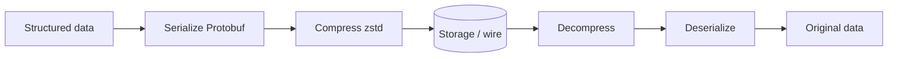

# Compression and Serialization

## 1. One-Line Definition
Compression shrinks bytes by removing redundancy (lossless: gzip/zstd/deflate; lossy for media), while serialization converts structured data into a compact, agreed byte layout (JSON/XML text vs Protobuf/Avro/Thrift binary) so it can be stored or sent efficiently and reconstructed exactly.

## 2. Why Do We Need It?
Storage and bandwidth are real costs: a 10 MB log file compresses to under 1 MB; analytics on JSON blows up CPU and latency versus a compact binary. Compression cuts storage bills, network time, and cache pressure at the cost of CPU. Serialization does the same for structured messages and is the difference between readable-but-bloated JSON and a Protobuf that is 5-10x smaller and faster to parse. Every HLD that moves or stores data answers "how dense is this byte format?".

## 3. Simple Intuition
Compression is packing a suitcase with a vacuum bag: the same clothes take a third of the space (lossless — nothing is lost). Lossy compression is throwing out the boring shirts you will never re-wear (audio/video/photo — slight quality loss accepted). Serialization is agreeing on a common written language before mailing letters: JSON is a verbose human-readable letter, Protobuf is a dense coded-form letter with a shared dictionary (schema) both sides must have.

## 4. What Happens Without It?
Storage bills balloon (10x more bytes for text-heavy data), big transfers take 10x longer, caches hold a fraction of what they should, and every API exchange ships verbose tags. Analytics on plain JSON waste CPU; logs without compression flood disk. Systems that skip serialization design end up with ad-hoc, version-brittle payloads — fast to write, painful to evolve.

## 5. Core Idea
- **Lossless compressors** (gzip/zlib/deflate, zstd, brotli, lz4, snappy): reversible, guaranteed identical output. Trade ratio vs speed: lz4/snappy are CPU-cheap and used on hot paths; zstd/brotli deliver better ratios; gzip is the interoperability baseline.
- **Dictionary/block models**: most formats are block/stream based with a sliding-window dictionary — they do best on repetitive data (logs, JSON, time-series). Already-random or already-compressed data (images, video, other archives) gains nothing.
- **Lossy codecs** (JPEG, H.264/HEVC, Opus) trade fidelity for size on perceptual data — handled separately in [[media-processing|Media Processing Pipeline]].
- **Serialization** is the byte *layout*; compression is optional on top. Text formats (JSON/XML/YAML) are human-debuggable, self-describing, and larger; binary formats (Protobuf, Avro, Thrift, MessagePack, Parquet) are schema-driven, tiny, and fast but need a shared schema + versioning.
- **Right order**: serialize/compact first, optionally compress the result; never compress then serialize a format that adds tags.

## 6. Important Terminology

| Term | Simple Meaning |
|------|----------------|
| Lossless | Reversible compression, zero fidelity loss |
| Lossy | Irreversible; trades fidelity for size (media) |
| Ratio | compressed_size / original_size (smaller = better) |
| Dictionary / LZ | Sliding-window redundancy removal core of gzip/zstd |
| Codec | Encode/decode pair |
| Serialization | Structure → flat bytes, plus the reverse |
| Schema | The agreed structure a binary format relies on |
| Brotli / zstd / lz4 | Modern codecs with different ratio-vs-speed profiles |
| Self-describing | Data carries field names (JSON) vs schema-referenced (Protobuf) |

## 7. Basic Architecture



## 8. Request or Data Flow
1. Service A builds an order object, serializes it to a Protobuf message (schema from the registry/contract) and optionally zstd-compresses it.
2. The bytes go to a queue or blob (see [[blob-storage|Blob Storage]] and [[message-queue|Message Queue]]).
3. Service B decompresses, deserializes against the same schema version, and processes. Schema evolution rules (additive-only, defaults) keep old/new services compatible.

## 9. Practical Example
A log ingestion pipeline: 1 PB of app and infra logs/year.
- JSON text with gzip: ~0.2-0.3 of original (often better with brotli), so storage ~250-300 TB.
- Time-stamped repetitive logs also hit dictionary/block compressors; adding columnar serialization (Parquet for queryable logs) further reduces bytes read by analytics (see [[compression|Compression and Serialization]] across the vault).

Latency example: a 1 KB gRPC JSON call at ~10ms vs a 1 KB Protobuf at ~2ms over the same wire — serialization saves round trips and CPU when the wire is the bottleneck.

## 10. Scaling
- **Compression is CPU-bound**: deploy on the strength right before write and use the *fastest* codec that meets your ratio target — lz4 for hot write paths, zstd for storage tiers, brotli/gzip for HTTP (see [[http-and-https|HTTP and HTTPS]] for content-encoding).
- **Decompression on read** can become the bottleneck for high-QPS caches; weights: store compressed, serve compressed, decompress at the consumer (see [[caching|Caching]]).
- **Serialization speed scales** with schema size and codegen; Protobuf/Avro parse 10-50x faster than JSON at big-payload sizes.
- Combine with [[storage-tiering|Storage Tiering and Lifecycle]]: you can trade a slower tier for stronger compression (zstd -X).

## 11. Reliability and Failure Scenarios

| Failure | What Happens | Detection | Recovery | Trade-off |
|---------|--------------|-----------|----------|-----------|
| Corrupt compressed block | Streams fail mid-way | Block checksums/crc | Re-fetch from source, re-download part | per-block checksum cost |
| Schema mismatch (field removed) | Old service mis-parses new messages | Contract tests + schema registry | Additive-only evolution; ignore unknown fields | strict process around schemas |
| Compression CPU spike on hot write | Write latency balloons | CPU metrics on the encode stage | Move to faster codec (lz4) or bigger machines | worse ratio |
| Pathological incompressible payload | No savings, wasted CPU | ratio monitoring | Skip compression when content is already compressed (media/zip) | classifier complexity |

## 12. Consistency and Correctness
- Lossless compression must round-trip byte-identically — validate with sample round-trip tests in CI.
- Serialization requires **schema agreement** at every hop. Versioning: additive fields with defaults; forward-compat via ignore-unknown. A schema registry is the source of truth (see [[outbox-pattern|Outbox Pattern]] for how messages carry schema version).
- Recompressibility is not guaranteed: gzip-of-gzip is pointless; make the outer layer the only compressor.

## 13. Performance
Typical ballparks (illustrative, relative):
- lz4: ~0.5-1 GB/s per core, ratio ~0.6-0.7 on text/logs — for latency-critical paths.
- zstd: near-lz4 speed at level 1-3, ratio ~0.4-0.5 on text; level 19-22 much better ratio, 10-50x slower — for storage tiers.
- gzip/brotli: brotli better HTTP ratio; gzip universal baseline (every client supports it).
- Protobuf vs JSON: typically 5-10x smaller and 5-20x faster to parse at realistic payload sizes; Avro adds schema-evolution friendliness for data pipelines.

## 14. Security
- Keys/schema definitions: serialize the values, never the secrets — and encrypt before or after compression, never both in the wrong order (see [[encryption-and-keys|Encryption and Keys]]: compressible plaintext leaks entropy to observers, so compress *then* encrypt).
- Deserializers are attack surface: zip bombs and crafted payloads — enforce size/ratio limits before decompressing (see [[web-vulnerabilities|Web Vulnerabilities]]).
- Never serialize auth material into logs; compression makes logs denser, so redaction matters more, not less.

## 15. Trade-Offs

| Choice | Advantage | Disadvantage |
|--------|-----------|--------------|
| lz4/snappy | Near-zero CPU, fine for hot paths | Worse ratio than zstd/gzip |
| zstd | Best speed/ratio curve, levels | Slightly less universal than gzip |
| brotli | Best HTTP text ratio | Focused on web; less standard elsewhere |
| gzip | Everywhere | Middle of every axis |
| JSON | Human-readable, self-describing | Big, slow parse, no schema |
| Protobuf/Thrift | Tiny, fast, schema-typed | Schema must be managed/versioned |
| Avro/Parquet | Great for pipelines/analytics, evolvable | Heavier tooling, columnar not universal |

## 16. Common Mistakes
- Compressing already-compressed data (media, archives, encrypted blobs) — wasted CPU, zero gain.
- Buying savings on data that is mostly incompressible without checking the samples.
- Using an expensive codec (gzip -9) on a hot path where lz4 preserves 90% of savings at 1/10 the CPU.
- Evolving binary serialization without a schema registry and breaking old consumers.
- Serializing then compressing with a format that re-adds structural tags (JSON inside gzip is fine; don't encrypt-then-compress, and don't compress-then-encrypt carelessly).

## 17. HLD vs LLD Boundary
HLD: which codec for which tier, which serialization contract and schema-evolution policy, where compression happens (edge vs producer, see [[reverse-proxy|Reverse Proxy]] for HTTP compression offload). LLD: the codec call parameters, max-compression-clip checks, schema-file version bump in one service.

## 18. Interview Questions

### Beginner
- What is lossless compression and when does it give nothing?
- Why is JSON bigger and slower than Protobuf?
- Where does compression typically happen in an HLD?

### Intermediate
- You log 500 TB/year. How do you decide between lz4 and zstd for the write path?
- Design schema evolution for a Protobuf contract with 100 producers. What rules do you set?
- When should compression be at the proxy/CDN edge rather than the app?

### Advanced
- A data lake stores Parquet + zstd. Explain what columnar layout does for compression and for selective reads.
- An attacker can craft a 1 MB compressed blob that expands to 10 GB. Where does this live in your pipeline and how do you defend?

## 19. Interview Memory Summary

> [!abstract]- Interview Memory Summary

### Remember

- Compression removes redundancy; serialization picks the byte layout.
- Lossless: lz4 (fast) → zstd (balanced) → gzip/brotli (universal/best ratio).
- Lossy = media-specific (see [[media-processing|Media Processing Pipeline]]).
- Already-compressed data (media, archives) gains nothing — skip it.
- Serialization: text (JSON/XML) = readable + big; binary (Protobuf/Avro) = small + fast + schema-driven.
- Schema evolution: additive-only, defaults, schema registry.
- Compress then encrypt; never the reverse in logs/secrets contexts.
- Ratio-monitor; pathological inputs waste CPU.

### 30-Second Explanation

Pick a codec by workload: lz4 on latency-critical write paths, zstd on storage tiers, brotli/gzip at the HTTP edge. For structure, swap bloaty JSON for a schema-driven binary format (Protobuf/Avro) when payloads are large or repeated, and manage schema evolution with additive fields and a registry. Always measure ratio on your real data — incompressible streams make compression pure overhead that you should skip.

### Interview Traps

- Claiming compression "always reduces size" — media/encrypted/archived data is a counterexample.
- Ignoring CPU cost on hot paths (gzip -9 everywhere).
- Evolving binary schemas without versioning and breaking consumers.
- Encrypt-before-compress, which hides redundancy and wastes CPU.

### Key Trade-Off

You buy storage reduction and transfer speed at the price of CPU and complexity; the right codec/serialization choice is a function of your actual ratio, latency budget, and schema maturity.

## 20. Related Concepts

### Prerequisites

- [[latency-vs-throughput|Latency and Throughput]]
- [[capacity-estimation|Capacity Estimation]]

### Commonly Used Together

- [[blob-storage|Blob Storage]]
- [[storage-tiering|Storage Tiering and Lifecycle]]
- [[cdn|CDN and Edge Caching]] — content-encoding negotiation at the edge
- [[http-and-https|HTTP and HTTPS]]

### Alternatives

- [[content-addressable-storage|Content-Addressable Storage]] — dedup when identical whole blobs repeat (compression is per-bytes; dedup is per-content)

### Advanced Concepts

- [[media-processing|Media Processing Pipeline]]
- [[kafka-retention|Kafka Retention]] — how compressed stream data is retained and compacted

## 21. References
RFC 1951 (DEFLATE/gzip), RFC 7932 (Brotli), and the zstd standard (RFC 8878); Protocol Buffers and Apache Avro/Parquet documentation; Kleppmann, Designing Data-Intensive Applications, ch. 3 (encoding formats and schema evolution).

## 22. Active Recall

Test yourself before revealing each answer.

> [!question]- What is the difference between compression and serialization?
> Compression shrinks already-bytes by removing redundancy; serialization defines the byte layout of structured data. You serialize first (structure → bytes), then optionally compress (bytes → fewer bytes).

> [!question]- You have repetitive JSON logs and two codec options: lz4 and zstd-9. Which wins and when?
> lz4 wins when write-path CPU is your bottleneck (near-zero overhead, decent ratio); zstd-9 wins when bytes are the scarce resource (better ratio, slower). The decision is ratio vs CPU, measured on your logs.

> [!question]- Why does compression do nothing to an already-encrypted or already-compressed file?
> Both processes remove/randomize redundancy: encryption hides it, and a previous compressor already removed it — so further compression has nothing to find and wastes CPU, sometimes even growing the output.

> [!question]- Protobuf is 5-10x smaller than JSON. What must you manage in exchange?
> The schema: Protobuf assumes both sides share the field-number/structure definition. You must govern schema evolution (additive fields, defaults, ignore-unknown), usually via a schema registry, or old/new services silently misparse.

> [!question]- An attacker uploads a compressed blob that expands 10,000x on decompress. Defend your pipeline.
> Never trust content-length or compressed size: bound decompressed size and ratio at the decompression boundary, stream-decompress with limits, and reject inputs exceeding configured budgets before CPU is spent (see [[web-vulnerabilities|Web Vulnerabilities]]).

> [!question]- Interview scenario: your video platform compresses every uploaded MP4 again with gzip. What do you say?
> Stop: media codecs already maximize compaction, so gzip adds CPU and near-zero savings. Keep serialization (e.g., compressed manifest JSON) light and let [[media-processing|Media Processing Pipeline]] choose codec/size policies; reserve gzip/zstd for logs, metrics, and text payloads.

## 23. When Should I Use This?

### Use it when

- Data is text/repetitive (logs, metrics, JSON, time-series) and storage or bandwidth is a real line item.
- Payloads are large and repeated, and a schema can be maintained (Protobuf/Avro over JSON).
- You control both ends or have a contract/registry to manage versioning.

### Avoid it when

- Data is already compressed (media, archives, encrypted blobs) — measure first.
- Payloads are tiny and latency-critical; the extra codec round trip may not pay off.
- The consumer ecosystem can't agree on a schema (public/flexible APIs may prefer JSON).

### What problem does it solve?

It turns "too many bytes" into "the right amount of bytes": fewer disk GB, faster transfers, smaller caches, and cheaper telemetry — while keeping data lossless and structure recoverable.

### What problem does it NOT solve?

It cannot shrink truly-random payloads, does not create structure (serialization defines structure, it does not invent it), and it does not remove the CPU cost of encoding/decoding — only relocates it.

## 24. Decision Connections

Compression/serialization decisions connect across the stack:

- [[storage-tiering|Storage Tiering and Lifecycle]] — stronger compression buys access to cheaper tiers.
- [[cdn|CDN and Edge Caching]] and [[http-and-https|HTTP and HTTPS]] — content-encoding and cache-key negotiation at the edge.
- [[blob-storage|Blob Storage]] — compressed blobs use less concrete, but beware CPU on re-compression.
- [[content-addressable-storage|Content-Addressable Storage]] — dedup and compression overlap; dedup wins on whole-content repeats.
- [[kafka-retention|Kafka Retention]] — compressed streams, retention, and compaction interplay.
- [[caching|Caching]] — compressed cache entries shrink cache pressure but add decode cost per hit.

Decision tree:

```
Reduce bytes for storage/transfer?
    |
    +-- Data is text/repetitive?
    |      → lossless compression
    |         |
    |         +-- Latency-critical? → lz4/snappy
    |         +-- Storage cost-critical? → zstd (high level)
    |         +-- HTTP edge? → brotli/gzip content-encoding
    |
    +-- Data is structured messages?
    |      → serialization contract
    |         +-- Public/flexible + few consumers? → JSON
    |         +-- Many producers + schema governance? → Protobuf/Avro + registry
    |
    +-- Data is media?
           → [[media-processing|Media Processing Pipeline]] lossy codecs; do not recompress
```