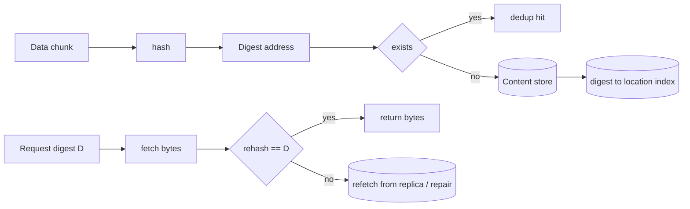

# Content-Addressable Storage

## 1. One-Line Definition
Content-addressable storage (CAS) identifies data by a secure hash of its bytes instead of a location or name, so the same content always maps to the same address and identical bytes are stored exactly once.

## 2. Why Do We Need It?
The same big blob shows up millions of times: shared videos, repeated app builds, duplicate backups, re-uploaded photos. Location-addressed stores keep N copies and waste storage; also, they cannot cheaply prove a blob is intact. CAS fixes both: identical content dedups automatically, and the address is the checksum, so read-time verification is free — fetch the bytes and re-hash them to confirm what you got is exactly what was stored.

## 3. Simple Intuition
A warehouse that shelves parcels by their fingerprint. You hand the parcel a fingerprint scanner; identical parcels (same fingerprint) share one shelf. When you ask for "fingerprint 42", the clerk brings the parcel and scans it again to prove it really is fingerprint 42. Nobody can silently swap contents — the new parcel's fingerprint would not match the shelf label.

## 4. What Happens Without It?
Storage fills with byte-identical copies (a shared 2 GB file uploaded by 10k users is stored 10k times); corruption goes unnoticed until a user reports it; content deduplication and "trust the bytes" pipelines are impossible; and you cannot locate a blob by asking "what is this content?" for cache/registry systems.

## 5. Core Idea
- **Address = hash(bytes)**: pick a strong hash (SHA-256 at minimum in 2026). Write path: hash payload → find that digest.
- **Write**: if the digest already exists, do nothing (dedup hit); else store the bytes under that digest.
- **Read**: given a digest, fetch bytes, re-hash, and if it mismatches the digest, fail loudly (integrity check).
- **Granularity matters**: store whole files or chunk-level digests. Chunk-level CAS (with content-defined boundaries) catches shared segments and makes dedup much stronger — this is where [[chunking-and-uploads|Chunking and Resumable Uploads]] and CAS meet.
- **Names point at digests**: a manifest/layer file maps a *name* (e.g. a Docker tag) to a set of content digests. Names are mutable; digests are immutable.
- **Garbage collection**: reference-count digests; content without any referencing name is deleted — the hard part of CAS.

## 6. Important Terminology

| Term | Simple Meaning |
|------|----------------|
| Digest | Hash output used as the address |
| Content addressing | Look up by hash of bytes, not by name/location |
| Manifold/manifest | Name → list of digest references |
| Reference count | Number of names pointing at a digest |
| Content-defined chunking | Boundaries from content hash → stable chunking (see [[chunking-and-uploads|Chunking and Resumable Uploads]]) |
| Rehash-on-read | Verify fetched bytes by recomputing the hash |
| Identifier stability | Same content ⇒ same address ⇒ dedup and caching free |

## 7. Basic Architecture



## 8. Request or Data Flow
1. Upload arrives; splitter produces content-defined chunks.
2. Each chunk is hashed; digest is looked up in the index.
3. Unknown digests are stored; known digests increment refcount only.
4. A manifest (name → [digest list]) is written; the user's request is recorded as a new name.
5. On fetch: resolve name → manifest → digests → fetch chunks → rehash each → reassemble and serve. Any digest mismatch means corruption and triggers a replica/repair path.

## 9. Practical Example
A build-artifact registry holding 100 versions of one app, each ~2 GB but ~85% shared chunks across versions:
- Naive storage: 200 GB. CAS chunked storage: ~30-40 GB (shared layers stored once).
- Docker layering is the canonical real-world CAS: each image layer is content-addressed; `ubuntu:latest` vs `ubuntu:22.04` share base layers, so the registry stores shared layers once (see [[blob-storage|Blob Storage]] for the substrate it runs on).
- Integrity: a bit flip in storage is caught the moment a client rehashes; no silent corruption is served.

## 10. Scaling
- **Index is the hot spot**: a digest→location lookup per chunk; shard the index by digest prefix (see [[sharding|Sharding]] and [[consistent-hashing|Consistent Hashing]]).
- **Content store** is the blob chunk pool — scales exactly like [[blob-storage|Blob Storage]].
- **refcount updates** are a write bottleneck for popular content; batch + queue updates, tolerate approximate counts with periodic sweeps.
- **GC** is O(all digests) — run offline/at low traffic, never in the hot path.

## 11. Reliability and Failure Scenarios

| Failure | What Happens | Detection | Recovery | Trade-off |
|---------|--------------|-----------|----------|-----------|
| Bit rot on one chunk | Read rehash fails | Digest mismatch at read | Fetch another replica, re-verify, repair/rewrite | deduplicated storage sometimes lacks other copies → replica/parity still needed |
| Hash collision | Two contents share a digest | Extremely unlikely with SHA-256 | Design for bounded work: never reuse space from a "hit" without sampling | tiny risk, negligible |
| Index node down | Cannot resolve digests | Health of index shard | Load from replica index / rebuild from scan | index availability is critical |
| refcount drift | Orphans or premature delete | Audit sweep | Periodic refcount recount + GC mark/sweep | offline cost |

## 12. Consistency and Correctness
- Digests are immutable: once stored, bytes never change under that address (see [[immutable-storage|Immutable Storage and Versioning]] for the same principle at object level).
- **Dedup correctness**: a "hit" must be byte-identical. Rehash verified at write time; read-time rehash protects against races.
- **Name-to-digest** mapping is the only mutable state; treat manifest updates as atomic swaps (write new manifest, atomically point the name).
- GC must be exclusive with readers: mark-then-sweep (find reachable digests first, then delete unreferenced) prevents deleting data a reader is still using.

## 13. Performance
- Write cost ≈ hashing + possible write. SHA-256 is fast (~hundreds of MB/s to GB/s) and cheaper than the network it guards.
- Read cost includes rehash: extra CPU is small vs the I/O it prevents; integrity checking effectively free.
- Dedup hit writes skip the network entirely (cache/store hit), which is why CAS shines for registries/caches/build pipelines.
- GC is the slow op: it touches the whole index. Budget for it as a maintenance window, not a request-path cost.

## 14. Security
- Hash binding prevents undetected tampering at rest — any byte change breaks the digest. Pair with at-rest encryption for confidentiality (see [[encryption-and-keys|Encryption and Keys]]).
- Do not use deprecated hashes (SHA-1) — collision attacks remove the binding guarantee; prefer SHA-256/512.
- Digest-only addressing plus a registry ACL: access control lives on *names/manifests*, not digests, so authorization wraps the name layer (see [[authentication-vs-authorization|Authentication vs Authorization]]).
- Content-store scan: a malicious client can upload anything addressable; set content policy at the manifestation/publish layer.

## 15. Trade-Offs

| Choice | Advantage | Disadvantage |
|--------|-----------|--------------|
| Whole-file CAS | Trivial | No intra-file dedup |
| Chunk-level CAS (content-defined) | High dedup ratio | Reassembly + refcount complexity (see [[chunking-and-uploads|Chunking and Resumable Uploads]]) |
| Digest = name | Authentication-free integrity, cache-friendly | Hard for humans; needs a name layer on top |
| Strong hash (SHA-256) | Secure binding | Slightly more CPU than weaker hashes |

## 16. Common Mistakes
- Using digest as a location name and mutating the bytes under it (breaks the invariant).
- Chunking with fixed offsets and expecting dedup (see the boundary-stability trap in [[chunking-and-uploads|Chunking and Resumable Uploads]]).
- Deleting unreferenced digests via live count without running a mark/sweep — that is how you delete a chunk a reader is holding.
- Skip rehash on read "to save CPU" — you lose the free integrity guarantee.
- Using SHA-1 out of habit and inheriting collision attacks.

## 17. HLD vs LLD Boundary
HLD: chunking policy + hash choice, index sharding, GC cadence, manifest/name layer, interaction with object store. LLD: hash library calls, chunk-boundary algorithm, refcount increment on write, the digest index query in one registry service.

## 18. Interview Questions

### Beginner
- What does "content-addressable" mean?
- How does deduplication work in CAS?
- Why is rehash-on-read useful?

### Intermediate
- Why does chunking granularity determine your dedup ratio, and why content-defined boundaries?
- How do you garbage-collect unreferenced content without breaking concurrent readers?
- A CAS store's index shard is down; how does a request fail and how do you degrade?

### Advanced
- Design a Docker-registry-like store for 10k daily image builds; where does the digest index live and how do you scale writes?
- Give the math: identical 2 GB uploads × 100k users, 90% shared chunks — storage before and after CAS, including refcount overhead and GC bounds.

## 19. Interview Memory Summary

> [!abstract]- Interview Memory Summary

### Remember

- Address = secure hash of bytes; identical bytes ⇒ identical address.
- Dedup is automatic; refcount + manifest name layer for GC.
- Start with SHA-256; never SHA-1.
- Content-defined chunking (not fixed offsets) preserves dedup across similar files.
- Rehash-on-read = free integrity checking; never skip it.
- Names are mutable; digests are not.
- GC is an offline mark-and-sweep, never a live request-path count-only.

### 30-Second Explanation

Content-addressable storage names data by the hash of its bytes. On write, hash the chunk; if the digest already exists, it is a dedup hit (store once), otherwise store under the digest. On read, fetch by digest and rehash to verify integrity before serving. Chunk at content-defined boundaries so similar files share chunks, keep a name→digest manifest layer for humans/algorithms to reference, and GC offline with a mark-and-sweep so you never delete reachable content.

### Interview Traps

- Pretending SHA-1-era collisions are acceptable for security-sensitive registries.
- Claiming "dedup is automatic" while using fixed-size chunking that destroys cross-version sharing.
- Deleting by live refcount without mark-and-sweep (race with readers).
- Treating digest as a mutable location.

### Key Trade-Off

You get dedup, immutability, cache-friendliness, and free integrity at the cost of never being able to modify or rename the addressed bytes, plus index/GC machinery to keep unreferenced content reaped.

## 20. Related Concepts

### Prerequisites

- [[blob-storage|Blob Storage]]
- [[chunking-and-uploads|Chunking and Resumable Uploads]]
- [[sharding|Sharding]] and [[consistent-hashing|Consistent Hashing]] for the index

### Commonly Used Together

- [[immutable-storage|Immutable Storage and Versioning]]
- [[compression|Compression and Serialization]]
- [[media-processing|Media Processing Pipeline]]
- [[caching|Caching]] — dedup stores behave like caches with perfect keys

### Alternatives

- [[blob-storage|Blob Storage]] — location addressing when you need per-name versioning and human keys

### Advanced Concepts

- [[erasure-coding|Erasure Coding]]
- [[database-indexing|Database Indexing]] — the digest index borrows the same structuring ideas

Related planned topics (not authored yet): Merkle trees / CRDT (see `crdt.md` in the syllabus), bloom-filter digest indexes.

## 21. References
Kleppmann, Designing Data-Intensive Applications, ch. 6 (partitioning of key-value stores) and hash-based storage discussion; Docker registry image-layering documentation; Backblaze's engineering notes on chunked, deduplicated storage; NIST hash recommendations (SHA-256 and newer).

## 22. Active Recall

Test yourself before revealing each answer.

> [!question]- Why does the same content always produce the same CAS address?
> The address is a deterministic hash of the bytes: hash(bytes) is a pure function, so equal bytes hash to equal digests. Hence identical uploads collide on the same address and dedup for free.

> [!question]- What happens on a dedup hit during write?
> The chunk is not stored again; its reference count increments (refcounted by the referencing manifest/name). Bytes exist exactly once, and shared content across files/versions stays single-copy.

> [!question]- Why is read-time rehashing "free" in CAS?
> The rehash is cheap CPU compared to the I/O it protects, and it catches bit rot, tampering, and routing errors before they reach the user — turning a latent corruption bug into an immediate fail-loud check.

> [!question]- Why does fixed-size chunking destroy dedup when a similar file has one inserted byte?
> All chunk boundaries shift by one byte, so no chunk aligns between old and new file — every chunk looks new. Content-defined chunking re-derives boundaries from content hashes so unchanged regions produce identical chunks (see [[chunking-and-uploads|Chunking and Resumable Uploads]]).

> [!question]- You must delete unreferenced chunks without deleting one a reader still uses. What is the safe algorithm?
> Offline mark-and-sweep: traverse the name→manifest→digest graph to mark every reachable digest, then sweep all digests not marked — exclusive with readers. Never trust only live counters, which race with concurrent reads.

> [!question]- Interview scenario: propose a registry for 1M image tags with heavy layer sharing. What are your five non-negotiables?
> 1) SHA-256 digests only; 2) content-defined chunking or layer-level CAS; 3) digest-index sharded by hash prefix for scale; 4) name→manifest layer for ACLs and tags; 5) offline mark-and-sweep GC with refcount as an approximation, plus rehash-on-read everywhere.

## 23. When Should I Use This?

### Use it when

- The same bytes will be stored or fetched many times (registries, caches, backups, build artifacts).
- Integrity-by-construction matters more than name-stability (content is what you trust).
- You want dedup without building a separate fingerprint system.

### Avoid it when

- You need in-place updates, human keys, or per-name version history (those are [[blob-storage|Blob Storage]] + [[immutable-storage|Immutable Storage and Versioning]] features).
- Content differs almost every time (little dedup to gain) and hashing is pure overhead.
- Your index/GC tools can't run offline — a CAS store without GC leaks space.

### What problem does it solve?

It converts "identical byte content" from a liability (N wasted copies) into an asset (N almost-free references), and makes data integrity a property of the addressing scheme instead of a separate checksum feature.

### What problem does it NOT solve?

It does not give names/versions/tenancy (those live in a manifest layer above), does not provide confidentiality (you still encrypt), and does not remove the need for replication/Erasure Coding — a deduplicated copy is still a single copy if replicated nowhere.

## 24. Decision Connections

CAS decisions connect to the storage platform:

- [[blob-storage|Blob Storage]] — the content pool beneath; CAS is best built *on top of* or *alongside* the blob layer.
- [[chunking-and-uploads|Chunking and Resumable Uploads]] — chunk boundaries decide dedup strength.
- [[immutable-storage|Immutable Storage and Versioning]] — both exploit write-once bytes; CAS for dedup, versioning for overwrite history.
- [[compression|Compression and Serialization]] — dedup and compression are complementary, not alternatives.
- [[caching|Caching]] — dedup stores make perfect cache keys and warm caches.
- [[sharding|Sharding]] and [[consistent-hashing|Consistent Hashing]] — index and content scale the way any keyed store does.

Decision tree:

```
Do identical bytes repeat a lot (users, builds, backups)?
    |
    +-- Rarely repeated, human keys matter?
    |      → [[blob-storage|Blob Storage]] plain key/value
    |
    +-- Repeated content and dedup = real savings?
    |      → [[content-addressable-storage|Content-Addressable Storage]]
    |         |
    |         +-- Whole files vs chunks?   → chunks with content-defined boundaries
    |         +-- Need names + ACLs?       → add name→manifest layer above digests
    |         +-- Bounded dedup only?      → consider [[compression|Compression and Serialization]] first
    |
    +-- Bytes must keep history on overwrite?
           → [[immutable-storage|Immutable Storage and Versioning]] (not raw CAS)
```