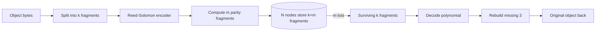

# Erasure Coding

## 1. One-Line Definition
Erasure coding (EC) is a redundancy technique that splits data into k data fragments, computes m parity fragments using a systematic code (Reed-Solomon is the classic), and stores all k+m fragments so that any m lost fragments can be reconstructed exactly — giving replication-level durability at a fraction of the storage overhead.

## 2. Why Do We Need It?
Replication's cost grows linearly: 3 copies = 3x storage for ~2-node-failure tolerance; 4 copies = 4x for ~3-failure tolerance. A 1 PB tier replicated 3x costs 3 PB. Erasure coding decouples durability from copies: a (6,3) code tolerates any 3 of 9 fragments failing using only 1.5x storage (k+m / k overhead), so cloud object storage, HDFS, Ceph, and media archives get near-replication durability for ~30-50% of the write amplification. It is the difference between a videos archive costing 1.5x vs 3x its logical size.

## 3. Simple Intuition
Think of a 6-digit code and a 3-addend checksum problem. A repairperson (Reed-Solomon encoder) takes a file in 6 blocks and writes 3 additional "parity blocks" using clever math so that any *3* of the 9 blocks can be lost and, from the surviving 6, an inverse formula rebuilds the missing 3 exactly. It is richer than a backup copy: each parity block hedges against any set of missing blocks, not just one designated replica.

## 4. What Happens Without It?
You pay 3-4x storage to tolerate a couple of node failures, or you accept risk by using less redundancy. Either way you either front 2-4x billable storage for data that mostly sits still, or you gamble durability. Without EC, archives and cold tiers become uneconomically expensive, so organizations keep less history — a direct durability/archival regression.

## 5. Core Idea
- **Systematic code**: encoder keeps the k original fragments and adds m parity fragments. Storage fragments = k + m.
- **Reed-Solomon math**: treats data as a polynomial over a finite field; each fragment evaluates the polynomial at a distinct point; any k distinct evaluations (fragments) recover the whole polynomial → all data.
- **Failure tolerance**: with any m of k+m fragments missing, reconstruction works. Storage overhead = m/k (a (6,3) code → +50%; a (10,4) → +40%).
- **Reasons it is not replication**: lower storage amplification (1.5x vs 3x) at the cost of (a) higher CPU to encode/decode, (b) higher read I/O amplification on repair (must read k fragments to rebuild one), and (c) more scattered placement. It is ideal for write-once, read-mostly data: archives, backups, media, replicas of static content.
- **Local Reconstruction Codes (LRC)**: a variant reducing repair bandwidth by adding local parity groups (Azure used a 12+2+... scheme); trade slightly more storage for cheaper rebuilds.

## 6. Important Terminology

| Term | Simple Meaning |
|------|----------------|
| k | Number of data fragments a file is split into |
| m | Number of parity fragments computed |
| Fragment | A stripe piece of fixed byte size |
| Stripe | The k+m fragment set of one logical object |
| Reed-Solomon | The workhorse systematic erasure code |
| Storage overhead | m/k ratio (copies avoided) |
| Repair/rebuild | Reading k surviving fragments to reconstruct a lost one |
| Systematic | Original k fragments stored as-is; only m added |
| LRC | Local Reconstruction Codes (repair-cheap variants) |

## 7. Basic Architecture



## 8. Request or Data Flow
1. A 100 MB media file is striped: k=6 data fragments (~16.6 MB each) + m=3 parity (~16.6 MB each) → 9 fragments (~150 MB stored; +50%).
2. Fragments scatter across distinct nodes/racks (anti-affinity placement matters — you never put all 9 on one failure domain).
3. On node failure, storage notes "fragment #4 of stripe X unreachable".
4. Repair job reads k=6 surviving fragments of stripe X, runs the decode formula, regenerates fragment #4 onto a new node. Metadata maps object → fragment list (see [[blob-storage|Blob Storage]] metadata role).

## 9. Practical Example
An archive tier holding 10 PB of videos:
- Replicated 3x: ~30 PB (all copies live). EC (6,3): ~15 PB. Storage savings ~15 PB at the cost of transcode-time CPU and rare rebuild reads.
- Failure math: 3 copies tolerate up to 2 failures; (6,3) tolerates up to 3 of 9 — equal or better durability with half the storage.
- Rebuild cost: one lost fragment needs reading the ~100 MB data span of its 6 siblings — typically < 1 GB of read traffic, bounded by stripe size, so repair is network-cheap in absolute terms but 6x the fragment read (I/O amplification).

## 10. Scaling
- **Chunk/fragment placement** is the scaling lever: spread the k+m fragments across distinct nodes/racks/domains; use [[consistent-hashing|Consistent Hashing]]-style placement for the metadata of which node holds fragment x.
- **Repair bandwidth** scales with the set of surviving stripes, not live traffic: batch repairs, throttle to below write-path capacity (see [[consumer-lag|Consumer Lag]] for the queueing lessons).
- **Index/shipping metadata** scales like blob metadata (see [[blob-storage|Blob Storage]]); typically one row per stripe.
- Compute on encode/decode scales linearly in k+m but the codec is the same per stripe — encoders are embarrassingly parallel (see [[media-processing|Media Processing Pipeline]] workers as an analogy).

## 11. Reliability and Failure Scenarios

| Failure | What Happens | Detection | Recovery | Trade-off |
|---------|--------------|-----------|----------|-----------|
| 1-2 nodes die | Object still readable (needs only k) | Fragment health checks | Reposition repair job | read amplification for repair |
| m+1 nodes die within window | Some stripes under-redundant before rebuild | Failure-domain accounting | Emergency restore from a *second code* or backup copy | dedicated small fallback copy |
| Double failure hits the same stripe | Stripe lost (data unrecoverable from that code) | Age + node state | Off-site replica / DR | already paid for fallback |
| Repair job overloads write path | Slow backend | Node metrics | Throttle/prioritize K highest-risk stripes first | slower rebuild slot |

## 12. Consistency and Correctness
- Code correctness: any k distinct fragments reconstruct the original **exactly**; verified with checksums (ETag) at write and at repair.
- EC is a storage-format decision under the object layer; the object API (GET/PUT) stays strong read-after-write because the codec completes before the metadata claims the object is durable (see [[blob-storage|Blob Storage]]).
- Repair consistency: a fragment being repaired must read a consistent snapshot of the remaining k — otherwise the rebuild itself can corrupt the stripe (snapshot/timestamp per stripe).
- Placement and idempotency: rerunning a repair must not double-commit fragments; repair records are idempotent writes.

## 13. Performance
- Write: encode cost is bounded (linear in size, optimized SIMD) — encoding is a small percent of object-write time vs network.
- Read on k-available path: identical to a replicated read (you read the fragment directly, not all k).
- Read bandwidth on repair: O(k) fragments for one fragment — the reason for LRC on high-churn hot tiers.
- Storage efficiency closes survivability gap: (6,3) pays 50% to recover from 3 failures; replication pays 200% for the same. For cold data the CPU/bandwidth trade is nearly always a win.

## 14. Security
- Fragments at rest must be encrypted same as any tier (see [[encryption-and-keys|Encryption and Keys]]); EC on already-encrypted fragments interoperates fine — encoding does not reduce confidentiality.
- Integrity: checksums travel into the codec; repair must verify fragment checksums before blending (a bad fragment spreads if the repair reads corrupted siblings).
- Key fencing: repair/placement services need least-privilege access to fragment metadata (see [[authentication-vs-authorization|Authentication vs Authorization]]).
- Do not let a "repair path" become a full read of the archive — cap read amplification and add alerting (see [[observability|Observability]]).

## 15. Trade-Offs

| Choice | Advantage | Disadvantage |
|--------|-----------|--------------|
| ER (k+m) vs replication 3x | ~1.5x vs 3x storage for ≥ durability | CPU + repair I/O amplification |
| Large k (e.g., 10+4) | Lower overhead per stripe | More fragments, bigger repair fan-out |
| LRC (local groups) | Repair reads k_local, not k_total | Extra local parity bytes |
| Small stripes | Cheap rebuilds, fast repairs | More metadata rows; overhead per stripe |
| Cold/archive EC | Best cost reading for dormant data | Any read (if it happens) costs a decode |

## 16. Common Mistakes
- Choosing EC for frequently-updated hot data — every rewrite invalidates parity, so the "single write path gets k+m writes" cost shows up (better replication or a KV model, see [[database-replication|Database Replication]]).
- Ignoring failure-domain placement: all 9 fragments on one rack means the code tolerates only 1 rack failure, not 3 node failures.
- Repairing stones too hot: a repair job heavier than the write path stalls ordinary traffic.
- Skipping the checksum pre-check before blending fragments into a rebuild — corrupted inputs corrupt the repair.
- Not budgeting the second copy: EC alone has no spare when transient m+1 events hit a stripe; keep a geo/offs hosted fallback for the tail (see [[disaster-recovery|Disaster Recovery]]).

## 17. HLD vs LLD Boundary
HLD: (k,m) choice per tier (hot vs cold), placement domains, repair scheduling/policy, second-copy/DR fallback. LLD: calling the Reed-Solomon codec with tuned SIMD parameters, computing fragment checksums in the encoder, the repair worker's striping loop over one stripe.

## 18. Interview Questions

### Beginner
- What does "k of k+m fragments suffice" mean?
- How does erasure coding differ from replication in cost?
- Why can't you write to EC-encoded data as cheaply as replicated data?

### Intermediate
- A (6,3) code the tree holds 9 fragments of a 6 GB file. How big are fragments, what is the overhead, and how much must a rebuild read to recover one fragment?
- You manage an archive; pick (k,m) for a 100 PB tier and justify the trade.

### Advanced
- Explain LRC and why Azure/HDFS variants use it; give the repair-bandwidth win and its storage cost.
- Model lifetime durability: failure rate per node, 3x replication vs (10,4) EC, and failure-window/burst behavior — which wins as node count grows?

## 19. Interview Memory Summary

> [!abstract]- Interview Memory Summary

### Remember

- EC splits data into k fragments + m parity; any k of k+m rebuild the original.
- Overhead = m/k: (6,3) → +50%; replication 3x → +200%.
- Systematic: original k stored untouched; only m are derived.
- Tolerates m failures anywhere in the stripe, not just "one replica".
- Repair requires reading k surviving fragments (I/O amplication).
- Placement across failure domains decides real durability.
- LRC trades a little storage for much cheaper repairs.
- Use EC for write-once/read-cool; replication for hot/mutable.

### 30-Second Explanation

Erasure coding replaces "N copies" with "k data + m parity fragments" using Reed-Solomon math: any k of the k+m fragments recover the full object, so a (6,3) code achieves replication-grade durability (3 lost fragments tolerated) at +50% storage instead of +200%. The bills it saves are cold/archive tiers; what it spends is encode CPU and the need to read k fragments each time a lost one is rebuilt. Failure-domain-aware placement, idempotent repair jobs, and a second geo copy for transient m+1 windows finish the design.

### Interview Traps

- Claiming EC "always beats replication" — hot/mutable writes make parity stale and costly.
- Judging durability from (k,m) alone without placement domains.
- Forgetting repair reads (k siblings, not 1) when estimating recovery time.
- Assuming EC removes the need for a fallback/DR copy.

### Key Trade-Off

You trade replication's simple 3x storage for a k-of-(k+m) code that stores ~1.5x while tolerating several failures — paying, instead, in encode/decode CPU and repair-bandwidth amplification.

## 20. Related Concepts

### Prerequisites

- [[blob-storage|Blob Storage]]
- [[reliability|Reliability]]
- [[database-replication|Database Replication]]

### Commonly Used Together

- [[storage-tiering|Storage Tiering and Lifecycle]]
- [[immutable-storage|Immutable Storage and Versioning]]
- [[disaster-recovery|Disaster Recovery]]

### Alternatives

- [[database-replication|Database Replication]] — hot-tier mutation-friendly copy for databases
- [[standby-models|Standby Types]] — failover alternatives to encode-heavy storage

### Advanced Concepts

- [[content-addressable-storage|Content-Addressable Storage]]
- [[cap-theorem|CAP Theorem]] — designing a durable store is a consistency-and-partitioning exercise

## 21. References
Kleppmann, Designing Data-Intensive Applications, ch. 5 (replication) and the storage-engine survey; Plank, "Tutorial: Erasure Coding for Storage Applications" (Reed-Solomon math); Apache HDFS Erasure Coding docs; Azure Storage documentation on LRC and Reed-Solomon-style archives; Backblaze/cloud storage durability engineering notes.

## 22. Active Recall

Test yourself before revealing each answer.

> [!question]- What is the storage overhead of (k,m) erasure coding vs replication, and what durability do they give?
> Overhead is m/k (a 6,3 code = +50%); replication x3 = +200%. Durability: any m fragment failures are tolerated by the code; 3 copies tolerate up to 2 copy failures — so the code matches or exceeds replication durability for less storage.

> [!question]- Why is write-once, read-much data the natural home of EC?
> Parity must reflect content; every overwrite forces re-encoding of the whole stripe. Read-mostly, never-rewritten archives and backups minimize re-encode cost, and their do-not-access hot reads make the repair-CPU tax nearly invisible.

> [!question]- Rebuild a lost fragment of a (6,3) object. What must the repair read and write?
> Read the k=6 surviving fragments of that stripe (sibling reads), run the systematic decode to derive the missing fragment, and write 1 fragment to a spare node. Full-object reads for the user always require only k fragments, not 9.

> [!question]- Three nodes die but all stripes have ≥6 survivors. What do you do?
> It behaves correctly: repaint existing reads, then schedule background repair per stripe (idempotent, throttled, priority by stripe age/criticality) to restore each stripe's m parity without stalling user traffic.

> [!question]- Why does placement trump the (k,m) numbers?
> A code tolerates m *fragments* downed; if all 9 fragments of a stripe sit in one rack, one rack loss = 9 failures on that stripe = data loss. Placement must spread each stripe's k+m fragments across distinct failure domains, or the theory is void.

> [!question]- Interview scenario: an archive vendor advertises "(6,3) EC, better than 3x replication". Probe the claim.
> 1) Verify tier: is written once/read rarely? If hot/mutable, parity cost kills it. 2) Check placement: fragments across ≥9 failure domains? 3) Ask for the second geo copy (m+1 transient windows) — EC alone is not DR. 4) Ask about repair bandwidth vs a 3x system's copy bandwidth during a mass loss.

## 23. When Should I Use This?

### Use it when

- Data is write-once, read-rarely: archives, backups, media originals.
- Storage bill is the dominant cost and you can afford encode/repair CPU.
- You need >2-node-failure durability without paying replication's 3-4x.
- A repair/rebalance pipeline exists so a lost node is rebuilt promptly.

### Avoid it when

- Data is rewritten frequently (parity re-encode tax).
- Latency on reads is ≤replicated hot-tier requirements and decode jitter matters.
- You cannot guarantee failure-domain placement (single-rack tiers).
- You have no second-copy/DR fallback for transient m+1 windows.

### What problem does it solve?

It cuts the durability-vs-cost curve: near-replication write tolerance at ~1.5x storage (for common k,m) instead of 3x, turning exabyte-sized archives and object stores affordable.

### What problem does it NOT solve?

It does not give fast in-place writes, does not replace replication's simple fan-out recovery, does not provide cross-region DR by itself, and does not remove the need for strong placement metadata and idempotent repair.

## 24. Decision Connections

EC decisions connect to storage architecture and redundancy:

- [[blob-storage|Blob Storage]] — EC lives under the object layer; the API stays object-oriented.
- [[database-replication|Database Replication]] — the hot/mutable alternative EC is contrasted with.
- [[storage-tiering|Storage Tiering and Lifecycle]] — EC is the economical enabler of cold/archive tiers.
- [[immutable-storage|Immutable Storage and Versioning]] — ECM and WORM/versioned content compose (write-once is the friendly workload).
- [[disaster-recovery|Disaster Recovery]] and [[standby-models|Standby Types]] — the second copy EC does not provide.
- [[content-addressable-storage|Content-Addressable Storage]] — dedup + EC are the two levers on cold-tier economics.
- [[observability|Observability]] — repair progress and redundancy-level dashboards.

Decision tree:

```
Need durability without replication's storage cost?
    |
    +-- Data hot and frequently rewritten?
    |      → [[database-replication|Database Replication]] (keep it simple)
    |
    +-- Data write-once/read-rarely (archive, media, backups)?
    |      → [[erasure-coding|Erasure Coding]]
    |         |
    |         +-- Tolerate m failures?    → pick (k,m): m parity, e.g. (6,3) or (10,4)
    |         +-- Repair cheaply?         → LRC, or (smaller stripe)
    |         +-- Placement?              → k+m fragments across distinct failure domains
    |         +-- DR windows?             → second geo copy ([[disaster-recovery|Disaster Recovery]])
    |
    +-- Latency-critical random access?
           → hot replicated tier; EC only for the cold tail
```