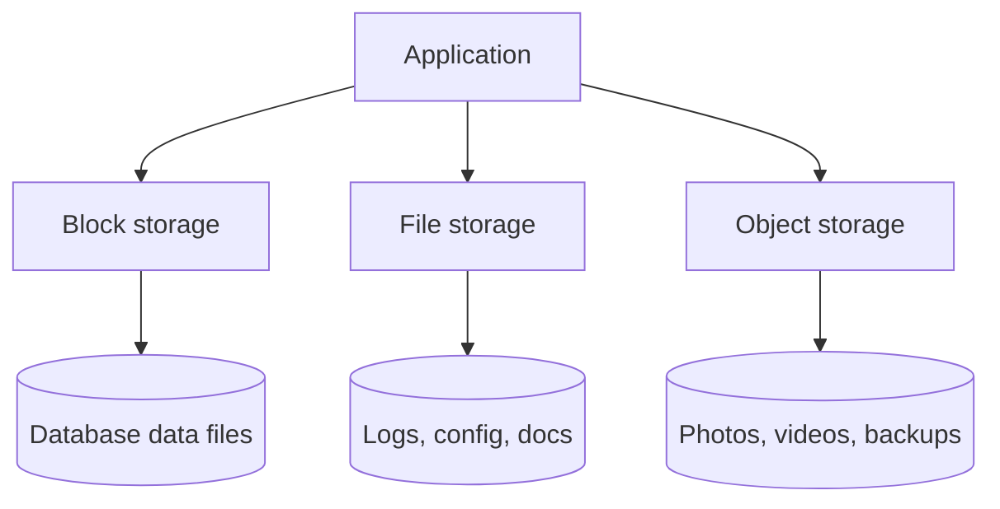

# File / Block / Object Storage

## 1. One-Line Definition
The three storage abstractions: block storage exposes raw fixed-size bytes addressed by block number, file storage exposes bytes inside a named hierarchical directory tree, and object storage exposes whole immutable blobs addressed by a string key in a flat namespace.

## 2. Why Do We Need It?
Different data has genuinely different access patterns. A database needs random, low-latency reads and writes at arbitrary offsets (block). Documents, source, and logs are naturally organized as named files in directories (file). Photos, videos, backups, and archives are large self-contained units that must scale to billions of items with HTTP-style access (object). No single abstraction wins at everything: block is fastest, file is most familiar, object scales the most. An HLD picks the abstraction per data type instead of forcing one everywhere.

## 3. Simple Intuition
- **Block storage** = a wall of identical empty drawers. Each drawer holds a fixed number of bytes; the operating system itself writes the labels and decides which drawer holds what. Blazing fast to poke into any drawer, but you manage all the inventory yourself.
- **File storage** = a library of labeled notebooks, each with its own table of contents. You read any page, edit any page, or append a page, and the library tracks which notebook the pages belong to.
- **Object storage** = a post office. You mail whole sealed parcels with a string address. You cannot peek inside or edit a page; you can only deposit a parcel, read it all, or discard it and maybe a newer parcel takes the same address.

## 4. What Happens Without It?
You feel the mismatch: millions of uploaded images stuffed into a relational DB or one NFS mount; a filesystem namespace that cannot outgrow a single machine or whose metadata server becomes a single point of failure; a video service that cannot do HTTP-range reads so a user must download a whole file; and a backup pipeline with no per-object retention. Latency-sensitive databases degrade badly on file or object backends, and content that should scale to billions chokes on a block device's capacity ceiling.

## 5. Core Idea
The abstractions differ along a few axes you must internalize:

| Axis | Block | File | Object |
|------|-------|------|--------|
| I/O unit | Sector (512B-4KiB) | Byte range | Whole object |
| Addressing | Block / LBA number | Path in hierarchy | Key in flat bucket |
| Modify | Random in-place | Byte-level overwrite | Replace whole object |
| Latency (typical) | µs to low ms | ms (network FS higher) | ms to tens of ms |
| Scale | One device / SAN | One namespace / cluster | Exabyte, global |
| Access API | SCSI/NVMe/driver | open, read, write, seek | HTTP PUT / GET / DELETE |
| Best for | Databases, OS paging | Docs, logs, code | Content, backups, media |

The rule of thumb: put anything a DB or VM needs on block; put flat user-generated content and archives on object; put developer and shared-services data on file, and consider object when the tree grows past a namespace's practical limit.

## 6. Important Terminology

| Term | Simple Meaning |
|------|----------------|
| Block / LBA | Fixed-size storage unit and its address |
| Volume / LUN | A block device carved out and exposed to one host |
| Inode | File metadata: size, owner, pointers to data blocks |
| POSIX | Standard file interface: open, read, write, seek, fsync |
| NAS | Network-attached shared file server (file abstraction) |
| SAN | Network block device pool exposed to hosts (block abstraction) |
| Bucket | Top-level object namespace |
| Object key | String name of an object inside a bucket |
| Blob | Binary large object; synonym for an object |

## 7. Basic Architecture



## 8. Request or Data Flow
1. A DB wants a page: issues a block read at LBA X; the driver / SAN returns exactly one sector range — low latency, no parsing.
2. An app wants bytes 100-200 of a config: file API maps the path to an inode, reads the range, honors a lock if requested.
3. A client uploads a profile photo: HTTP PUT with key `users/u1/profile.jpg`; the object store returns a handle and (usually) a strong read-after-write guarantee for that key.

## 9. Practical Example
A photo-sharing app with ~100M users:
- **Object:** original uploads and thumbnails, keyed `u/{user_id}/photo/{photo_id}.jpg`, stored in one bucket, served via HTTP range requests (see [[blob-storage|Blob Storage]] and [[media-processing|Media Processing Pipeline]]).
- **Block:** the MySQL cluster's data files, which need random 16KiB page reads with µs-ms latency (see [[database-fundamentals|Database Fundamentals]]).
- **File:** service config, TLS certificates on app servers, and hot write-ahead logs (could equally be object or a stream; rarely the performance bottleneck).

Numbers: a block volume backs a DB doing ~10k random IOPS; a single NFS export comfortably serves low-QPS configs; the object store holds ~10B objects totalling ~2 PB and only cares that keys are unique.

## 10. Scaling
- **Block:** scales up — replace with a bigger device; scales out only via SAN / RAID / strip across machines, which adds latency and complexity. Volumes are typically attached to one host at a time.
- **File:** a positive tree ~thousands of files is fine; billions of files stress the inode tables and metadata server. Distributed file systems move the metadata problem into a cluster that must be consistent.
- **Object:** near-unlimited (flat namespace partitioned across many servers). Thumbprints for scaling: hash the key for even spread (see [[sharding|Sharding]] and [[consistent-hashing|Consistent Hashing]]), shard by user, keep listing off hot paths.
- The generic answer to "I am out of room": classify the data, then move it to the right abstraction rather than buying a bigger box.

## 11. Reliability and Failure Scenarios

| Failure | What Happens | Detection | Recovery | Trade-off |
|---------|--------------|-----------|----------|-----------|
| Block device dies | One VM/DB loses its data | Smart-monitoring, RAID | Restore from replica/backup (see [[rpo-rto|RPO and RTO]]) | rebuild time |
| NFS / NAS file server down | Apps fail to open files | Health checks | Failover to standby export | stale locks |
| Object node degrades | Some objects slower | Replica checks, chunk verify | Read from a healthy replica; repair via [[erasure-coding|Erasure Coding]] | storage overhead |
| Object overwritten by accident | Old data gone | Versioning disabled | Object versioning + lifecycle (see [[immutable-storage|Immutable Storage and Versioning]]) | retention cost |

## 12. Consistency and Correctness
- Block is strongly consistent within a device's caching rules (a completed write is visible to the next read; ordering depends on barriers/fsync).
- File gives POSIX semantics on one node; network file servers weaken them (who sees an update, locking, cache-coherence) and you must design around those gaps.
- Object stores: modern majors (S3, Azure Blob, GCS) now provide strong read-after-write for new objects and overwrites; be careful with listing consistency after writes and with cross-region replication lag.

## 13. Performance
- Block: SSD ~10-100µs random read, ~GB/s sequential; the right tool when a database needs thousands of small random IOPS.
- File: single-node near-block speed; over NAS add network round-trips → ms-level latency and throughput capped by NIC.
- Object: small-object PUT ~tens of ms (a single HTTP round trip + metadata write); large objects streamed at ~hundreds of MB/s with parallel ranged GETs, so throughput scales with connection count, not the store's single-core limit.

## 14. Security
All three must encrypt at rest (see [[encryption-and-keys|Encryption and Keys]]): block on the device / volume, file with encryption layer, object via server-side or client-side encryption. Object additionally gets bucket policies, IAM, and signed URLs for time/scope-limited access (see [[immutable-storage|Immutable Storage and Versioning]]); file relies on POSIX permissions and ACLs; block is usually protected by virtue of being attached to an authenticated host.

## 15. Trade-Offs

| Choice | Advantages | Disadvantages | When to Use |
|--------|------------|---------------|-------------|
| Block | Low latency, random access | Capacity wall, one-host attach | Databases, VMs, OS |
| File | Familiar, hierarchical, shareable | Namespace scale ceiling, weaker network semantics | Configs, code, shared docs |
| Object | Exabyte scale, cheap, HTTP-native | Whole-object replace, list cost, higher latency | Media, backups, archives |

## 16. Common Mistakes
- Storing generated images/blobs in a database or NFS instead of object storage.
- Putting a hot database on a file or object backend and complaining about latency.
- Attaching one giant block volume to every host instead of using object/block per need.
- Ignoring flat-namespace key design and substring-prefix hotspots (keys with a shared prefix can collide on one partition).
- Forgetting per-object retention and lifecycle, so backups on object storage grow without bound.

## 17. HLD vs LLD Boundary
HLD: choose the abstraction per data type, topology (volumes vs buckets vs shared FS), durability/replication strategy, and where the throughput/latency budget lies. LLD: the SDK calls and driver settings — `open()` flags, NVMe queue depth, S3 client configuration, retries and checksums inside one service.

## 18. Interview Questions

### Beginner
- What are the three storage abstractions and when is each appropriate?
- Why is a database usually put on block rather than file or object storage?
- What does "flat namespace" mean for object storage and why does it scale?

### Intermediate
- Pick the right abstraction for: a MySQL DB, user photos, container images, and Kubernetes pod logs.
- Your image service outgrows its NFS mount. Walk the migration to object storage.
- Why is strong read-after-write consistency easier to promise for object stores than for a shared file server?

### Advanced
- Design the key-space for 10B objects so no partition becomes a hotspot.
- A tenant's antivirus scan reads one 100 GB video host-side. Block, file, or object — and how do you keep it fast with range reads and caching?
- Compare durability and economics of block replication vs object [[erasure-coding|Erasure Coding]] for the same dataset.

## 19. Interview Memory Summary

> [!abstract]- Interview Memory Summary

### Remember

- Block = fixed-size bytes by number, µs-ms, one host; best for databases/VMs.
- File = named hierarchy, byte-level edits; best for configs, code, shared docs.
- Object = whole immutable blob by key, HTTP, exabyte; best for media/backups.
- Latency: block lowest, file next, object highest; scale is the reverse.
- Object outage mode is replace-whole-object, not byte patch.
- Classify your data first, then pick the abstraction — do not rubber-stamp one everywhere.

### 30-Second Explanation

Storage choices reduce to I/O unit and scale: block gives a database sector-level random IOPS on an attached volume; file gives developers a familiar named tree that stops scaling at namespace size; object gives nearly unbounded HTTP-addressable blobs that you must treat as immutable and replace whole. Classify data by access pattern and pick the abstraction that matches, then layer encryption, lifecycle, and replication on top.

### Interview Traps

- Claiming object storage is slow/anonymous for everything — its latency is fine; its I/O unit is the property that matters.
- Forgetting object stores require whole-object replace, so "edit one byte of a video" must restore/re-upload.
- Mixing up NAS (file protocol) and SAN (block protocol).
- Ignoring key design and leaving hotspot-prone prefixes.

### Key Trade-Off

You trade latency and in-place editability (block/file) for unlimited scale and cheap HTTP-native storage (object) — the correct pick depends entirely on the data's access pattern.

## 20. Related Concepts

### Prerequisites

- [[capacity-estimation|Capacity Estimation]]
- [[latency-vs-throughput|Latency and Throughput]]
- [[system-design-fundamentals|System Design Fundamentals]]

### Commonly Used Together

- [[blob-storage|Blob Storage]]
- [[storage-tiering|Storage Tiering and Lifecycle]]
- [[compression|Compression and Serialization]]

### Alternatives

- [[caching|Caching]] — if it is read-hot, keep it in memory instead of any disk abstraction
- [[database-fundamentals|Database Fundamentals]] — structured data belongs in a DB, not a raw file

### Advanced Concepts

- [[erasure-coding|Erasure Coding]]
- [[content-addressable-storage|Content-Addressable Storage]]

## 21. References
Kleppmann, Designing Data-Intensive Applications, ch. 5 (replication) and the storage-backend discussion; AWS S3, EBS and EFS documentation for the three abstractions; Azure Blob and Google Cloud Storage docs for object-store semantics.

## 22. Active Recall

Test yourself before revealing each answer.

> [!question]- What is the fundamental I/O unit of each storage abstraction?
> Block = fixed-size sector (512B-4KiB) addressed by number; file = byte ranges inside a named tree; object = whole immutable blob addressed by a string key.

> [!question]- Why does a MySQL data file want block storage specifically?
> Databases issue thousands of small random reads (16KiB pages) with strict ordering and latency budgets; block storage delivers µs-ms random I/O, while file adds parsing/locking overhead and object only replaces whole blobs.

> [!question]- If your file share holds 2 billion photos, what is the first thing to change?
> Move to object storage: a single NAS namespace cannot practically serve billions of small files (metadata/inode and scan cost), while a flat bucket scales by partitioning keys (see [[sharding|Sharding]]).

> [!question]- Your object store's keys start with a user-provided name. What could break and how do you fix it?
> Identical prefixes cluster many objects onto one partition or hotspot. Fixes: hash the key, shard by user id, or use a prefix-safe key scheme like `user_id/photo_id`.

> [!question]- A drive dies under a 4-drive SAN volume. What are the recovery options and their cost?
> RAID rebuild (needs the parity copy), volume snapshot restore, or replica promotion; trade-off is downtime and rebuild time vs added parity/replica storage. Durable design layers [[database-replication|Database Replication]] on top so a DB never depends on a single volume.

> [!question]- Interview scenario: pick storage for user photos, the config of a fleet, and the payment DB, and justify each in one line.
> Photos → object (flat blob, exabyte scale, HTTP); configs → file (familiar tree, low QPS); payment DB → block (random IOPS + durable volumes). The classification is the whole answer.

## 23. When Should I Use This?

### Use it when

- Classifying a dataset's storage needs at design time and matching abstraction to access pattern.
- Choosing between a DB's volume (block), shared configs (file), and user content (object).
- Estimating capacity and durability for a new system (tie to [[capacity-estimation|Capacity Estimation]]).

### Avoid it when

- The real question is memory (use [[caching|Caching]]).
- Over-engineering: one small NFS mount is fine until metrics say otherwise.
- You need transactional, indexed access to that data — that is a database, not raw storage.

### What problem does it solve?

It gives a decision rule for where every byte lives: block for low-latency random I/O, file for named shareable trees, object for scale-out immutable blobs — so you do not force one storage company to serve incompatible workloads.

### What problem does it NOT solve?

It does not fix a badly-designed schema, replace a database, or guarantee consistency by itself; durability and redundancy are separate choices (replication, [[erasure-coding|Erasure Coding]], snapshots).

## 24. Decision Connections

Storage abstraction decisions connect to the rest of the system:

- [[blob-storage|Blob Storage]] — the object side of this decision, owned by the same team.
- [[storage-tiering|Storage Tiering and Lifecycle]] — object/block files rarely all need the same tier.
- [[compression|Compression and Serialization]] — bytes on the wire and at rest interact with whichever abstraction you pick.
- [[caching|Caching]] — read-hot data often never reaches disk at all.
- [[database-replication|Database Replication]] and [[rpo-rto|RPO and RTO]] — durability is decided on top of the abstraction, not by it.
- [[erasure-coding|Erasure Coding]] — how object/block stores survive lost devices cheaply.
- [[sharding|Sharding]] — how a flat key space spreads across many storage nodes.

Decision tree:

```
Which storage abstraction?
    |
    +-- Random low-latency I/O on attached volumes (DB, VM)?
    |      → [[database-fundamentals|Database Fundamentals]] on Block storage
    |
    +-- Named, shared, byte-editable files (config, code, logs)?
    |      → File storage
    |         +-- Billions of small files or global scale?
    |                → object storage instead (see [[blob-storage|Blob Storage]])
    |
    +-- Large, immutable, HTTP-addressable content (media, backups)?
           → Object storage
              +-- Access is cold/rare?    → [[storage-tiering|Storage Tiering and Lifecycle]]
              +-- Needs dedup?            → [[content-addressable-storage|Content-Addressable Storage]]
```