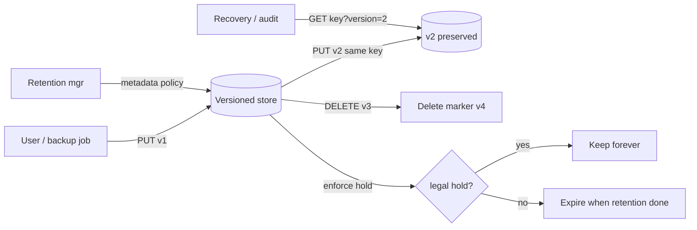

# Immutable Storage and Versioning

## 1. One-Line Definition
Immutable storage guarantees that once a version of data is written it can never be changed, overwritten, or deleted (except by a versioning/retention policy), giving you write-once-read-many (WORM) semantics; object versioning is the mechanism that preserves every overwrite as a new version and makes deletes tombstone-only.

## 2. Why Do We Need It?
Mutation is the enemy of audit, backup, and ransomware recovery. If a row, object, or backup can be overwritten in place, then an attacker (or a bug) can destroy the evidence and the recoverable state in one move. Immutability + versioning answers three requirements: regulatory/compliance evidence (WORM, see [[rpo-rto|RPO and RTO]]-adjacent retention), instant rollback to any prior state, and ransomware-resistant backups (an attacker cannot encrypt what it cannot mutate).

## 3. Simple Intuition
A paper ledger vs a whiteboard. A whiteboard is erased and rewritten — history gone. A ledger is a bound book: every entry is added at the end and nobody rips out pages; you can always see the older balances (previous versions). Versioning is the ledger with pages kept even after correction; WORM takes the ledger one step further and glues the pages shut for a set time.

## 4. What Happens Without It?
One bad deploy or one malicious account overwrites the only copy of a config, a DB dump, or audit records and recovery becomes "hope we took a copy". Backups that are mutable are impeachable as evidence and vulnerable to ransomware erasure. Rollback becomes "re-run from remembered state" instead of "restore version N". Compliance audits fail because data was overwritten rather than preserved.

## 5. Core Idea
- **Immutability is a property of a version**: the bytes under a version id are fixed forever. Any update is a *new version*, never an edit.
- **Versioning** assigns a monotonically increasing version id per key; overwrites create v2, v3... and delete creates a delete-marker/tombstone (the prior versions remain retrievable).
- **WORM / legal hold**: retention modes (governance/compliance + legal holds) block version deletion until a date or forever; this is what makes backups "immutable" and audit data compliant.
- **Cost model**: every saved version costs bytes; retention policy decides how long versions live (versioning + lifecycle interplay, see [[storage-tiering|Storage Tiering and Lifecycle]]).
- **Access**: you still read the latest by default; read version N by specifying the version id. Signed/limited URLs gate access (see [[blob-storage|Blob Storage]]).

## 6. Important Terminology

| Term | Simple Meaning |
|------|----------------|
| WORM | Write Once, Read Many — bytes cannot change after write |
| Version id | Identifier of one immutable snapshot of a key |
| Delete marker / tombstone | A visible "deleted" version that hides earlier ones |
| Retention mode | Governance (per-account can lift) / compliance (nobody lifts) |
| Legal hold | A hold that blocks deletion indefinitely |
| Versioned bucket | Bucket where every PUT/DELETE creates a version |
| Snapshot | Point-in-time copy, often on block storage |

## 7. Basic Architecture



## 8. Request or Data Flow
1. A config service PUTs `app=config` → stored as version 1.
2. Next deploy PUTs the same key → version 2 is created; version 1 still exists underneath.
3. A bug/attacker DELETEs the key → the store writes a delete-marker version; the object disappears from normal GET but every real version is still recoverable by request.
4. Retention manager runs: versions older than the policy and not on hold are expired (removed for real); anything on legal hold stays.
5. Recovery requests version 2 explicitly, downloads bytes, redeploys — rollback in minutes, evidence intact.

## 9. Practical Example
A database backup system:
- Nightly: full snapshot → versioned object `backups/db/full-<ts>`; hourly WAL segments → immutable log (see [[rpo-rto|RPO and RTO]]: RPO = last WAL, RTO = restore window).
- Retention: keep 30 daily, 12 monthly, 7 yearly — all as versions, never overwritten.
- Ransomware scenario: the attacker reaches the backup account but cannot overwrite/delete on a compliance-held versioned bucket — recovery to a pre-attack version is always possible.
- Storage volume: 30 dailies of a 100 GB DB ≈ 3 TB versioned (same as 30 copies) — that is the price of immutability, tunable via lifecycle tiering to cold (see [[storage-tiering|Storage Tiering and Lifecycle]]).

## 10. Scaling
- **Version store** = the blob/chunk pool; versions are just additional keys → scales like [[blob-storage|Blob Storage]].
- **Metadata** grows per version; version listing of a hot key must not become a scan — key scheme `key/version` and index by key.
- **Retention batch jobs** are the busy path at scale (millions of objects expired daily): batch, throttle, one job per bucket (see [[storage-tiering|Storage Tiering and Lifecycle]]).
- Tiering matters: old versions can sit on cold tiers; only the newest deserve hot (see [[compression|Compression and Serialization]] to shrink retained versions).

## 11. Reliability and Failure Scenarios

| Failure | What Happens | Detection | Recovery | Trade-off |
|---------|--------------|-----------|----------|-----------|
| Accidental overwrite | Latest "config" is a bad version | Version listing, alerting | Restore prior version in minutes | none — versioning is the fix |
| Malicious bulk delete | Objects tombstoned | Delete-event alerting | Deletes are markers; real bytes recoverable unless retention expired | bytes kept until retention done |
| Retention job deletes too early | Evidence lost | Audit/alert on near-expiry | Legal hold / compliance lock tightens policy | retention duration cost |
| Version store corrupts a chunk | Read of that version fails | Version checksum (ETag) verification | Re-fetch replica of that version (see [[erasure-coding|Erasure Coding]]) | single-node repair |

## 12. Consistency and Correctness
- Versioning + immutability give **undo** for every mutation — strong for recovery, but ordering matters: version ids must be monotonic so "restore latest visible" is well-defined.
- Deletes are markers: two racing DELETEs/PUTs resolve to a deterministic last marker/version sequence (caused by last-write-wins on the *marker*, not on the bytes).
- Retention vs read path: a version on hold must never be served half-deleted; enforcement is checked at deletion time, not lazily.
- Multi-region caveat: cross-region replication lag can briefly show a pre-delete state — strong read-after-write is region-scoped (see [[strong-vs-eventual-consistency|Strong vs Eventual Consistency]]).

## 13. Performance
- Versioning adds a metadata write per mutation (version id allocation + index bump) — small but nonzero; batching helps high-WPS keys.
- Reads at "latest" are unaffected; reads of a specific version cost a lookup by (key, version).
- Listing versions of a key is the expensive op — keep it off hot paths; key-scheme by version helps lexically order.
- Tiering old versions to cold moves the storage cost curve down sharply (see [[storage-tiering|Storage Tiering and Lifecycle]]).

## 14. Security
- **Immutability is the security property**: WORM and compliance locks defeat ransomware-overwrite and insider tampering of evidence.
- Access control on versioning: who can *list versions* and who can *permanently delete* must be separated (least privilege; see [[authentication-vs-authorization|Authentication vs Authorization]]).
- Encryption is orthogonal: versions are encrypted at rest (see [[encryption-and-keys|Encryption and Keys]]) but still immutable.
- Signed URLs can read a specific version; retention settings themselves must require multi-party/root approval on cloud controls (ganging + MFA), because a loose retentions policy is how ransomware survives in "immutable" buckets.

## 15. Trade-Offs

| Choice | Advantage | Disadvantage |
|--------|-----------|--------------|
| Versioning on | Kill-switch for bad writes; WORM | Storage multiply-x; metadata writes; listing cost |
| Versioning off | Cheapest, simplest | One overwrite destroys history forever |
| Retention short | Low cost, clean | Shorter recovery/audit window |
| Retention long | Deep audit/rollback | Storage, and cost of mistakes persists |
| Compliance vs governance lock | Nobody can bypass hold | Rigid; mistakes (mis-set retention) are hard to undo |

## 16. Common Mistakes
- Enabling versioning but no retention → versions accumulate forever and storage explodes (needs lifecycle, see [[storage-tiering|Storage Tiering and Lifecycle]]).
- Using governance mode when you want truly unbreakable WORM — governance can be lifted by privileges; compliance cannot.
- Reading "latest" after a delete and forgetting the delete marker — the DELETE survives as a version; restore must target the right version id.
- Relying on versioning instead of explicit backup/DR for off-site copies; versioning is not replication outside the bucket.
- Forgetting holds interact with expiry — a hold on a key silently disables deletion, which teams discover as a storage-cost spike.

## 17. HLD vs LLD Boundary
HLD: which keys are versioned, retention/lock modes, holds policy, backup cadence + tier interplay, restore playbooks. LLD: the SDK call to PUT with versioning semantics, version-listing pagination, delete-marker handling in one service, the restore script that fetches version N.

## 18. Interview Questions

### Beginner
- What problem does object versioning solve?
- What is WORM and what is it used for?
- What happens to old versions when you DELETE a versioned key?

### Intermediate
- A corrupted deploy overwrote a config for 3 days. How do you restore and how do you prove the restore is exact?
- When is governance-mode retention enough vs compliance-mode?
- Why doesn't versioning alone protect you from ransomware? What must layer on top?

### Advanced
- Design a versioned backup system (daily full + hourly WAL) with RPO and RTO targets, then add a 7-year audit hold without an unmanageable bill.
- A retention policy is mis-set to "keep forever" on a hot bucket. Model the storage blow-up, the fix, and the governance lesson.

## 19. Interview Memory Summary

> [!abstract]- Interview Memory Summary

### Remember

- Immutability = bytes under a version never change.
- Versioning = every overwrite is a new version; deletes are markers.
- WORM + compliance lock protects against overwrite/ransomware tampering.
- Retention policy decides when old versions really die; holds block even that.
- Deletes are recoverable until retention/hold says otherwise.
- Versioning without lifecycle blows up storage; tiering fixes cost.
- Governance lock is liftable; compliance lock is not.

### 30-Second Explanation

Immutable/versioned storage makes every mutation append-only: PUT creates a new version, DELETE writes a tombstone, and retention/lock governs how long old versions survive — governance mode lets a privileged operator lift a hold, compliance mode never does. This turns any bad write, bug, or attacker into an undoable event and makes backups non-tamperable evidence, at the price of multiplied storage and metadata writes. Pair versioning with lifecycle tiering and separate "can list versions" from "can permanently delete" privileges.

### Interview Traps

- Saying versioning removes the need for off-site DR — it does not replicate outside your cluster.
- Confusing delete-marker masking with real deletion.
- Claiming governance lock equals compliance lock (both are "locks", different rigidity).
- Forgetting retention interactions: holds silently disable expiry and grow cost.

### Key Trade-Off

You trade storage multiplication and metadata overhead for the ability to undo any write/delete and to hold tamper-proof evidence; without lifecycle and holds, the multiplication capsize becomes a cost black hole.

## 20. Related Concepts

### Prerequisites

- [[blob-storage|Blob Storage]]
- [[rpo-rto|RPO and RTO]]
- [[disaster-recovery|Disaster Recovery]]

### Commonly Used Together

- [[storage-tiering|Storage Tiering and Lifecycle]]
- [[compression|Compression and Serialization]]
- [[encryption-and-keys|Encryption and Keys]]
- [[authentication-vs-authorization|Authentication vs Authorization]]

### Alternatives

- [[content-addressable-storage|Content-Addressable Storage]] — CAS gives immutability by construction (digest addressing), versioning gives it by policy

### Advanced Concepts

- [[erasure-coding|Erasure Coding]]
- [[database-replication|Database Replication]] — the isomorphic idea applied to rows/DB pages

## 21. References
AWS S3 Object Lock and versioning documentation; Azure Blob Storage immutability policy documentation; Google Cloud Storage retention policy and holds docs; ransomware-recognition best-practice guidance from cloud vendors.

## 22. Active Recall

Test yourself before revealing each answer.

> [!question]- What is the difference between versioning and WORM?
> Versioning preserves every overwrite as a new version (undo + audit by snapshot). WORM (write-once-read-many) guarantees bytes cannot be *modified* after write and, in lock/retention form, blocks deletion — the stronger guarantee you rely on for compliance and ransomware recovery.

> [!question]- You DELETE a key in a versioned bucket. Where did the data go?
> Nowhere. A delete-marker version is created that masks the object for normal GETs; the prior byte-versions remain and are recoverable by requesting a preceding version id — until retention/expiry genuinely removes them.

> [!question]- Why is governance-mode retention not equivalent to compliance-mode?
> Governance lock can be lifted by an authorized privileged user (an internal override exists); compliance lock cannot be removed by anyone including root until the retention date. Compliance is the only one suitable for audit evidence an adversary could otherwise "fix".

> [!question]- An attacker with the backup account tries to encrypt your backups. How do you survive?
> Backups live in a versioned bucket with compliance-lock retention: the attacker can SHOW the account can PUT (new versions) but CANNOT overwrite/delete earlier bytes, so the last clean versions survive; combined with separate least-privilege accounts for permanent-delete, recovery is guaranteed.

> [!question]- Enabling versioning multiplies storage. Show the countermeasure.
> Lifecycle/tiering: keep recent versions on hot, transition older versions to cold/archive (see [[storage-tiering|Storage Tiering and Lifecycle]]), and add a retention cap (N versions or N days) so storage grows log-linearly with new writes, not linearly forever.

> [!question]- Interview scenario: a fintech company must keep 7 years of immutable audit records. State your three decisions.
> 1) Versioned, compliance-locked bucket (WORM-grade) keyed `audit/{date}/...`; 2) lifecycle transitions old records to cold/archive at month/year boundaries to control cost while honoring retention; 3) separate "read/list" vs "permanent delete" roles with MFA, plus alerts on any delete/lock change (see [[observability|Observability]]).

## 23. When Should I Use This?

### Use it when

- You must undo bad writes or deletions (config, schema, data, backups).
- Compliance, audit, or evidence-grade retention is required (WORM).
- Ransomware must not be able to encrypt or erase your recoverable state.
- Multi-version rollback or "any past state" is a product requirement (see [[transactions-and-acid|Transactions and ACID]] for the DB analog).

### Avoid it when

- Keys are genuinely ephemeral and math-on-storage is your constraint (unversioned + short TTL is cheaper).
- You need byte-append/in-place growth on a hot mutable object — immutability fights that; use a log or DB instead (see [[message-queue|Message Queue]]).
- You misunderstand its scope: immutable within a region is not cross-region DR (pair with [[disaster-recovery|Disaster Recovery]]).

### What problem does it solve?

It makes mutation reversible and deletion (until retention says otherwise) non-destructive, converting overwrite/delete from data-loss events into versionable, auditable, recoverable operations; it is also the structural defense against ransomware.

### What problem does it NOT solve?

It does not protect against keys being exposed (a public bucket leaks every version), does not replicate outside the region (off-site DR is separate), and does not delete data for you — retention/lifecycle decide when bytes are truly gone.

## 24. Decision Connections

Immutability/versioning decisions connect to reliability and storage:

- [[blob-storage|Blob Storage]] — the substrate; versioning lives on the bucket/key model.
- [[storage-tiering|Storage Tiering and Lifecycle]] — retention and version age go hand-in-hand with tier moves.
- [[disaster-recovery|Disaster Recovery]] and [[rpo-rto|RPO and RTO]] — restore-granularity and retention windows derive from these.
- [[content-addressable-storage|Content-Addressable Storage]] — a different (hash-based) route to the same immutability idea.
- [[encryption-and-keys|Encryption and Keys]] — versioned, encrypted, immutable at rest.
- [[authentication-vs-authorization|Authentication vs Authorization]] — separating list/read from permanent-delete is the security crux.
- [[observability|Observability]] — delete/lock events need alerts; near-expiry warnings prevent evidence loss.

Decision tree:

```
Is mutation a hazard (rollback/audit/ransomware)?
    |
    +-- No, mutable ephemeral data?
    |      → no versioning; TTL/lifecycle
    |
    +-- Yes, need undo of overwrites/deletes?
    |      → object versioning enabled
    |         |
    |         +-- Storage cost worry?   → lifecycle tiering + version cap
    |
    +-- Evidence/compliance/anti-ransomware?
           → WORM: compliance lock + legal hold
              +-- Recovery window kept   → retention policy aligned with [[rpo-rto|RPO and RTO]]
              +-- Worst case overwrite?  → split permanent-delete privileges + alerting ([[observability|Observability]])
```