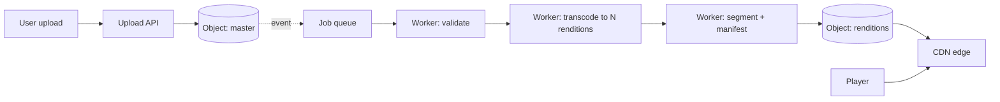

# Media Processing Pipeline

## 1. One-Line Definition
A media processing pipeline is an asynchronous system that takes uploaded media (video, audio, image), validates it, transcodes/transforms it into multiple renditions and formats (H.264/HEVC/VP9/AV1, HLS/DASH segments, thumbnails), stores the results in object storage, and publishes them to a CDN-ready path for playback.

## 2. Why Do We Need It?
A single raw file cannot serve every viewer: devices, bandwidths, and formats differ. You encode one master into several resolutions/bitrates (adaptive bitrate), produce segment files for streaming protocols, extract stills/audio, and validate uploads (malformed/corrupt/infected). Doing this synchronously during upload would block users for minutes per video. The pipeline also centralizes encode/quality decisions and can scale work with demand, decoupled from the upload API (see [[chunking-and-uploads|Chunking and Resumable Uploads]]).

## 3. Simple Intuition
A restaurant kitchen vs the front counter. Customers order at the counter (upload API, fast reply). The kitchen (pipeline) cooks each dish in stages — pre-prep, cook, plate — often hours before or after the order, and different chefs (workers) handle different dishes in parallel. If a customer wants the dessert earlier, the kitchen serves a smaller prepared portion (low-res preview) while the full dish (high-res master) finishes.

## 4. What Happens Without It?
Either you block uploads for minutes-hours (terrible UX, failed timeouts), or you serve raw files (no adaptive bitrate: mobile playback stalls), or you encode on every request (CPU meltdown at scale, garbage caching). No validation means corrupted/infected uploads reach viewers. No renditions means a 4 GB film plays badly on a 300 kbps connection.

## 5. Core Idea
- **Asynchronous, queue-driven**: upload completes → an event fires → a worker pool picks up processing jobs (see [[event-driven-architecture|Event-Driven Architecture]] and [[message-queue|Message Queue]]).
- **Stages**: validate (ffprobe/container checks, virus scan) → transcode into N renditions (different resolutions × codecs) → segment (HLS: .ts/.m3u8 or DASH: .mpd/.m4s) → generate thumbnails/waveforms → store to object storage → publish manifests → invalidate/ping CDN.
- **Renditions**: master + ladder of profiles (e.g. 2160p→240p); every rendition segmented; the HLS/DASH manifest lists them so the player switches dynamically by bandwidth.
- **Storage-facing**: object storage is the home for masters, renditions, and segments (see [[blob-storage|Blob Storage]]); CDN caches hot segments (see [[cdn|CDN and Edge Caching]]); cold masters drop to archive tier later (see [[storage-tiering|Storage Tiering and Lifecycle]]).
- **Failure semantics**: jobs are retried with idempotency (re-encode produces deterministic output for the same input+config); dead-letter queues hold poisoned jobs; cost is measured in wall-clock and encode-minutes.

## 6. Important Terminology

| Term | Simple Meaning |
|------|----------------|
| Transcode | Re-encode into another resolution/codec |
| Rendition | One output profile (size × codec) |
| Master | Highest-quality source kept for future render |
| Manifest | The playlist HLS/DASH players read (segments list) |
| Segment | Fixed-duration chunk of a rendition (HLS ~6s .ts, DASH .m4s) |
| ABR | Adaptive bitrate: player switches renditions |
| GOP | Group-of-pictures: keyframe interval for switching (typically 2s-6s) |
| Thumbnail / sprite | Still images; sprite = many in one grid for scrubber |
| DRM | Encryption of segments + rights to play (see [[encryption-and-keys|Encryption and Keys]]) |

## 7. Basic Architecture



## 8. Request or Data Flow
1. User uploads a 4 GB video via multipart (see [[chunking-and-uploads|Chunking and Resumable Uploads]]); the upload API stores the master and emits a `video-uploaded` event.
2. A validate worker checks container, duration, resolution, virus.
3. A transcode worker renders N profiles (1080p/720p/480p/240p, H.264 + maybe AV1 test), each in chunks; each rendition is segmented (~6s .ts segments) and its manifest (.m3u8) written.
4. Thumbnail/sprite worker produces artwork; all outputs land in object storage as versioned immutable blobs (see [[immutable-storage|Immutable Storage and Versioning]]).
5. CDN is primed/invalidated; a notification pings the app, which updates user-facing "ready".

## 9. Practical Example
A 10-minute 1080p video:
- Master ~1.5 GB; transcode to 4 renditions ≈ ~1.2 GB stored + manifests/segments (HLS 600 segments ~ each 6s) — total so small the CDN edge mostly absorbs it.
- Queue timing: transcode of 4 profiles on a GPU worker ≈ 30-60s; on CPU ≈ minutes — playback can start with the low-res profile within seconds (progressive/ladder-first).
- Failure test: encode of the 720p rendition fails once due to a flaky worker — lazy retry (idempotent re-encode, same output as the finished 1080p) > blocking the whole video; a poisoned job (corrupt source) lands in DLQ and alerts instead of looping forever.

## 10. Scaling
- **Workers are stateless**: pool scales with queue depth (autoscale), each taking one job at a time (see [[stateless-vs-stateful-services|Stateless vs Stateful Services]]).
- **Queue partitions**: key jobs by content hash/tenant to preserve ordering and isolation; scale is in consumer count, not queue size (see [[consumer-lag|Consumer Lag]]).
- **CPU/GPU mix**: profile-based; GPU for encode-heavy profiles, CPU for validation/thumbnail.
- **Storage I/O**: renditions are write-heavy bursty; bump part-store parallelism (see [[blob-storage|Blob Storage]]).
- **CDN scale-out** handles per-viewer load — the app API never sees per-playback traffic.

## 11. Reliability and Failure Scenarios

| Failure | What Happens | Detection | Recovery | Trade-off |
|---------|--------------|-----------|----------|-----------|
| Worker dies mid-transcode | Job uncommitted; partial artifacts orphaned | Job status + heartbeat | Job redelivery is idempotent (same input→same output) (see [[delivery-semantics|Delivery Semantics]]) | redelivery cost |
| Encode of one rendition fails | Partial renditions; unready manifest | Stage-level status | Retry with backoff, else DLQ + alert | delay vs strict-fail-all |
| Queue down | No jobs progress | Queue health | Failover to standby queue; uploads still stored | intermediate availability |
| CDN cache poisoning | Stale segments served | Cache-hit + content hash checks | Invalidation + segment-revalidate | small write amplification |
| Master corrupted post-upload | All renditions fail base validation | Validation stage rejects | Re-upload or alternate source (DR) | user-facing retry |

## 12. Consistency and Correctness
- **Manifest atomicity**: the pipeline publishes the manifest only after *all* its segments exist; players never see a partial playlist.
- **Idempotency of encode**: same input + same config ⇒ same output (GOP/segment boundaries deterministic); retries are safe.
- **Per-version rendition naming** avoids cache-coin collisions across re-encodes (version in the path, see [[immutable-storage|Immutable Storage and Versioning]]).
- Event order: "ready" must be sent only after manifest+segments are durable in object storage (read-your-writes within the pipeline is strong because the store is strong read-after-write).

## 13. Performance
- Transcode is the pipeline's slowest, most expensive stage: GPU (10-100x encode throughput), tuned encoder presets, per-profile parallelism.
- Segment once, serve many: CDN edge turns ms → µs-ish edge hits for hot segments; range requests for browser seeking (see [[cdn|CDN and Edge Caching]]).
- Ladder-first gating: first-playable in ~2-5s from a low rendition means perceived quality = the cheap rendition, not the full transcode.
- Monitoring the right signals: queue depth, encode-minutes, rendition-to-(disk,segment) rate, abort/cache-hit ratio (see [[golden-signals|Golden Signals]] and [[observability|Observability]]).

## 14. Security
- Validate *before* heavy processing: virus scan, size/format caps, entity-type allowlist — a malformed "video" must not consume GPU (see [[web-vulnerabilities|Web Vulnerabilities]]).
- DRM/encryption of segments where required (Widevine/FairPlay keys in [[encryption-and-keys|Encryption and Keys]] terms) + signed playback URLs.
- Signed/limited upload URLs for clients writing directly to object storage (see [[blob-storage|Blob Storage]]).
- Manifest/segment tamper checks: HTTPS + segment checksums; don't let "old version" keys leak after manifest rotation.

## 15. Trade-Offs

| Choice | Advantage | Disadvantage |
|--------|-----------|--------------|
| Few renditions | Cheap, fast | Poor delivery on weak/mobile/4K screens |
| Many renditions/AV1 | Best quality-per-bit | Encode cost, longer pipeline |
| GPU workers | 10-100x encode speed | $/per-minute, infra complexity |
| Segment-tiny (2s) | Snappiest switching | More segments, more manifest/index overhead |
| Manifest-last publish | Atomicity for player | Slightly later total-ready |
| Post-encode CDN primed | Zero first-buffer for hot content | Transient write+fetch overlap |

## 16. Common Mistakes
- Publishing the manifest before all segments are durable → players 404 on missing second segments.
- Forcing synchronous processing in the upload path → the upload API inherits encode latency.
- Skipping validation and trusting uploads — corrupted/infected content reaches the CDN and costs GPU time to "process".
- Ignoring segment/cache-coherence: overlapping GOP boundaries between rendition updates produce "jitter"/glitch on mid-stream switches.
- Forgetting the master is the crown jewel: losing the master after generating renditions means you can never re-render better (store master durably + tier it, see [[storage-tiering|Storage Tiering and Lifecycle]]).

## 17. HLD vs LLD Boundary
HLD: rendition ladder, codec choice, queue/topic topology, worker autoscaler policy, CDN/DRM plan, master-storage and tiering. LLD: encoder preset CLI flags (crf, preset), segment muxing params (GOP, keyint), ffmpeg pipeline calls inside one worker, manifest-parser validation logic.

## 18. Interview Questions

### Beginner
- Why is a media pipeline asynchronous instead of part of the upload response?
- What is a rendition and why multiple?
- What is HLS/DASH and why segments?

### Intermediate
- Design the processing flow for a 4 GB user upload with an "available in under a minute" first-playable goal.
- A worker dies mid-transcode. How do you make the retry safe?
- When does the manifest get published, and why does ordering matter?

### Advanced
- Scale the transcode step to 10k videos/wave under spiky demand with bounded cost — and define the autoscaling control loop.
- Your pipeline must deliver 60fps sports on 5 Mbps mobile AND 4K TV. Design the ladder, codec, and ABR choice with cost numbers.

## 19. Interview Memory Summary

> [!abstract]- Interview Memory Summary

### Remember

- Pipeline: validate → transcode → segment → manifest → store → CDN → notify.
- Async via queue; workers stateless; prepared for idempotent retry/DLQ.
- Store master + renditions in object storage; CDN serves hot segments.
- Manifest publishes only after all segments durable (playback atomicity).
- Ladder-first: low rendition plays first, upgrades later.
- GPU for encode, CPU for validate/thumbnail; autoscale workers by queue depth.
- Master is irreplaceable — tier it, never delete it.
- Validate before encode; scan before spend.

### 30-Second Explanation

Upload lands in object storage and an event queues a processing job. Workers validate, transcode the master into a ladder of renditions, segment each into HLS/DASH chunks with a manifest, and write all output to object storage. The manifest is published only when every segment is durable, so players always see a complete playlist; the CDN edge then serves the hot segments, keeping the app API off the per-viewer path. Idempotent re-encode + dead-letter queues keep failures retryable, and the master is kept durably for future re-renders.

### Interview Traps

- Making transcode synchronous with upload.
- Publishing incomplete manifests (segments missing).
- Treating encode as CPU-only — GPU/ladder choices are the cost lever.
- Forgetting the master is the recoverable source; renditions cannot re-generate it.
- Ignoring validation/security before expensive processing.

### Key Trade-Off

Asynchrony buys UX (instant upload response, no blocking) and cost-effective elastic encoding, in exchange for a stateful queue-to-worker machinery and a small "available soon" window where the endpoint is ready before all renditions are.

## 20. Related Concepts

### Prerequisites

- [[chunking-and-uploads|Chunking and Resumable Uploads]]
- [[blob-storage|Blob Storage]]
- [[message-queue|Message Queue]]

### Commonly Used Together

- [[event-driven-architecture|Event-Driven Architecture]]
- [[cdn|CDN and Edge Caching]]
- [[storage-tiering|Storage Tiering and Lifecycle]]
- [[observability|Observability]]

### Alternatives

- [[consumer-lag|Consumer Lag]] — queue backpressure lessons
- [[compression|Compression and Serialization]] — lossless vs lossy is decided inside the codec choice

### Advanced Concepts

- [[erasure-coding|Erasure Coding]] — cold masters stored under EC
- [[immutable-storage|Immutable Storage and Versioning]] — rendition/master versioning

## 21. References
RFC 8216 (HTTP Live Streaming) and ISO/IEC 23009-1 (DASH); FFmpeg documentation for transcoding pipelines; AWS MediaConvert and Azure Media Services documentation for production pipelines; H.264/HEVC/AV1 vendor specs.

## 22. Active Recall

Test yourself before revealing each answer.

> [!question]- Why is the manifest the last thing published, and what breaks if it ships early?
> The manifest defines what a player can request. Published early, a player may enumerate segments that are not yet durable in object storage → 404s and mid-video glitches. Publishing after all segments are durable makes playback atomic.

> [!question]- A worker dies 40% through encoding the 720p rendition. Why is the retry safe?
> Encode is idempotent: same input + same encode config ⇒ deterministic output (same segments and boundaries). Redelivery re-encodes and overwrites atomically; a corrupted intermediate never publishes because the manifest still references only complete outputs.

> [!question]- Which stage costs the most and how do you tune it?
> Transcode is the dominant cost. Tune by: rendition ladder (fewer/better profiles), codec (AV1 vs H.264), encoder presets (CRF/pre-encode quality-per-time), and GPU vs CPU — thinking of it as encode-minutes, not "do all the work".

> [!question]- How do you get "first playable in seconds" when 4K transcode takes minutes?
> Ladder-first: render the low rendition first (or a profile-height baseline), publish its manifest immediately, and let the player upgrade to higher renditions as they finish; the CDN edge caches the low segment so the first play is edge-served, not API-served.

> [!question]- An uploaded video fails virus/format validation. What must the pipeline do vs never do?
> Reject at validation *before* any GPU spend, put it on a dead-letter/job-failure path with alerting, never retry a poisoned job into encode, and make sure the user sees a "invalid/corrupt" state rather than a hung "processing".

> [!question]- Interview scenario: streaming app with 30s time-to-first-frame on mobile. Walk the fix.
> 1) Ladder-first + tiny segments → ready low manifests in seconds; 2) CDN/(edge) prefetch of the first videos, 3) ABR with the player picking lowest first, 4) edge-range reads for segment/seek, 5) monitor queue depth so the pipeline never blocks the upload path ([[observability|Observability]]).

## 23. When Should I Use This?

### Use it when

- You distribute video/audio/images that need multiple renditions (adaptive playback, thumbnails).
- Upload volume is high enough that synchronous processing would be unacceptable.
- You need central encode/quality policy and elastic compute on demand.
- Players must start fast and upgrade quality gradually (ABR ladder).

### Avoid it when

- Media is one-size static (a single doc/photo no render) and upload is small — direct store + CDN suffices.
- Real-time interactivity is required (live/WebRTC is a different streaming design).
- The team is too small to operate a queue worker fleet; a serverless per-upload function may be a simpler first step.

### What problem does it solve?

It turns arbitrary uploads into a uniform, playable, gradient-quality library: validated, multi-rendition, segmented, CDN-backed media with fast first-play and no blocking on the upload API.

### What problem does it NOT solve?

It does not deliver live/low-latency streams (a push/broadcast design), does not magically make bad uploads good (validation only filters), and does not control playback clients' buffer logic — ABR behavior lives in the player, not the pipeline.

## 24. Decision Connections

Media pipeline decisions connect storage, streaming, and async infra:

- [[chunking-and-uploads|Chunking and Resumable Uploads]] — the front door to the pipeline.
- [[blob-storage|Blob Storage]] — masters, renditions, segments all live here.
- [[cdn|CDN and Edge Caching]] — the only layer the player talks to.
- [[message-queue|Message Queue]] and [[event-driven-architecture|Event-Driven Architecture]] — pipeline orchestration, retries, DLQ.
- [[storage-tiering|Storage Tiering and Lifecycle]] — old masters/renditions cool down to archive.
- [[immutable-storage|Immutable Storage and Versioning]] — rendition and master versioning.
- [[observability|Observability]] — queue depth, encode-minutes, layer-TTL dashboards.

Decision tree:

```
Media to serve?
    |
    +-- Single static asset, one durable copy?
    |      → store + [[cdn|CDN and Edge Caching]] directly
    |
    +-- Multiple devices/bandwidths / large video?
    |      → [[media-processing|Media Processing Pipeline]]
    |         |
    |         +-- Real-time interactivity?     → live streaming design (not this pipeline)
    |         +-- Fast first play?             → ladder-first manifests
    |         +-- Scalable encode?             → queue + stateless workers + [[message-queue|Message Queue]]
    |         +-- Deliver worldwide?           → [[cdn|CDN and Edge Caching]]
    |         +-- Old content cost?            → [[storage-tiering|Storage Tiering and Lifecycle]]
    |
    +-- Image-only, small?
           → thumbnail/convert via serverless + store + CDN
```