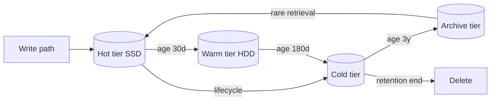

# Storage Tiering and Lifecycle

## 1. One-Line Definition
Storage tiering places data on the tier (hot, warm, cold, archive) whose latency and cost match how often it is accessed, and lifecycle policies automate moving, retaining, or deleting data as its access pattern decays over time.

## 2. Why Do We Need It?
Access patterns are zipf: a small slice of data is read constantly, while years-old backups, audit logs, and user media are touched rarely if ever. Keeping everything on the expensive hot tier wastes 10-100x the storage budget. Tiering makes the bill proportional to actual access, and lifecycle automation makes the policy explicit (mature N days, lower to archive, delete after retention) instead of a forgotten pile of hot-tier backups.

## 3. Simple Intuition
A house has shelves in the kitchen (hot — everything used daily), the pantry (warm — monthly), the attic (cold — yearly), and the landfill-vs-shrine decision (archive/delete). You do not build a glass fridge tower for the old photo albums. Storage tiers are the kitchen/pantry/attic; lifecycle policies are the moving-in rules the family writes in the manual.

## 4. What Happens Without It?
Costs scale linearly with total bytes kept, no matter how rarely they are read — a 100 TB archive at N=1 year sits on the same per-GB price as the live product. Teams also forget deletion: retention requirements (compliance, see [[rpo-rto|RPO and RTO]] and [[disaster-recovery|Disaster Recovery]] interplay) are easy to miss, and "never delete" becomes an unmanaged cost center and a data-governance liability.

## 5. Core Idea
- **Tiers differ in: cost/GB-month, latency, retrieval cost, and minimum retention.** Hot (SSD) = fastest, priciest; warm = HDD, mid; cold (IA/one-zone variants) = cheaper, seconds-to-minutes materialization; archive (glacier-like/depth) = cheapest, minutes-to-hours retrieval with extra retrieval fees.
- **Lifecycle = transitions + retention + deletion rules**, usually time/age-based (`older than 90 days → cold; older than 3 years → archive; delete at N years unless on hold`).
- **Access-based (not just age)**: a hot object read every minute belongs at the top tier regardless of age; rare-access big objects drop fast. Metrics—access frequency, last-access-time—drive the policy.
- **Manual promote on demand**: occasional cold reads can trigger a restore (materialize a hot copy temporarily) — a classic latency/cost trade.
- **Storage classes are legal/quiz topics**: SLA on retrieval time differs by tier, and compliance holds (see [[immutable-storage|Immutable Storage and Versioning]]) can pin data to a tier to keep retention guarantees.

## 6. Important Terminology

| Term | Simple Meaning |
|------|----------------|
| Tier / storage class | Latency/price band (hot, warm, cold, archive) |
| Lifecycle policy | Rules: transition, retain, expire |
| Transition | Automatic move between tiers |
| Retrieval fee | Cost paid to pull an object out of cold/archive |
| Materialization/rehydrate | Making a cold object readable again, usually progressive (byte-range first) |
| Minimum retention / hold | Floor on how long an object must stay before deletion |
| Expiration | Rule that deletes after retention |

## 7. Basic Architecture



## 8. Request or Data Flow
1. A photo service writes new uploads to the hot tier (fast writes + immediate reads for recent media).
2. A lifecycle rule checks ages daily: 30-day-old photos drop to warm; 180-day-old to cold.
3. When a user requests an old photo, the store materializes it (short hot copy), serves it, and drops the temporary copy after hours.
4. Compliance rule retains audit objects 7 years before deletion; any object on a hold is never deleted regardless of age.

## 9. Practical Example
A video platform storing 1 PB/year:
- Hot tier (10%): ~$23-25k/month at $0.023/GB.
- Warm (30%): ~$4-5k/month.
- Cold/archive (60%): ~$1-3k/month + retrieval fees on rare old-video pulls.
- Net ~$28-33k vs ~$230-250k if the whole 1 PB lived on hot — a ~10x saving for the price of betting on access patterns and accepting minute-scale-to-hour-scale old retrievals.

## 10. Scaling
- Lifecycle is a batch job: scan metadata, run rules, issue transition/delete requests in batches, monitor throttle limits — it scales as an async pipeline, not on the request path (see [[event-driven-architecture|Event-Driven Architecture]]).
- Transition explosions: daily lifecycle firehose can saturate the store's transition API; batch sizes + backoff (see [[retry-and-timeout|Retry, Timeout and Backoff]]).
- Monitoring: tier distribution, retrieval requests/week, cost per tier, transition-failure rate — a 10-line dashboard answers "is my policy right?" (see [[observability|Observability]]).

## 11. Reliability and Failure Scenarios

| Failure | What Happens | Detection | Recovery | Trade-off |
|---------|--------------|-----------|----------|-----------|
| Transition job fails | Data stuck on an expensive tier | Lifecycle job metrics | Retry batches, alert on threshold | cost, not durability |
| Archive restore slow | User-visible latency on old content | Retrieval queue age | User-triggered materialization + estimated wait | latency vs cost |
| Deletion rule too aggressive | Data gone before needed | Governance review | Compliance hold + retention floors (see [[immutable-storage|Immutable Storage and Versioning]]) | extra retention cost |
| Tier suffers partial outage | Cost-optimal tier temporarily unavailable | Availability of class metrics | Serve from next-warm tier as fallback | tier config |

## 12. Consistency and Correctness
- Lifecycle is eventual: a rule "at age X" is a job, not a promise; expect transition lag of hours-days for scale.
- Materialization must be atomic for reads: a user should never see a half-rehydrated cold object — the object is visible as cold, then hot, never torn.
- Retention vs deletion: expiry must not run during a legal hold — policy enforcement checks holds first.
- Multi-tier consistency mirrors [[strong-vs-eventual-consistency|Strong vs Eventual Consistency]]: lifecycle is eventual by nature; reads that need strong semantics materialize first.

## 13. Performance
- Tier latency bands: hot ms, warm ms-tens of ms, cold seconds (restore), archive minutes-to-hours (glacier-like batch retrieval).
- Retrieval is often progressive (first bytes fast, full object slower) → supports head-of-file streaming.
- Lifecycle transitions cost a handful of requests per object, not per byte — batch to amortize.
- Ratio-minder: transition-to-cold bandwidth is finite; smooth the job (see [[consumer-lag|Consumer Lag]] lessons for pipeline backpressure).

## 14. Security
- Archive/cold paths encrypt the same as hot; never disable key rotation on an old tier (see [[encryption-and-keys|Encryption and Keys]]).
- Retention holds prevent deletion for compliance — tie tiering to [[immutable-storage|Immutable Storage and Versioning]] WORM for legal-grade evidence.
- Access control is tier-invariant: cold data is not less secret because it is rarely read (least-privilege policies, see [[authentication-vs-authorization|Authentication vs Authorization]]).
- Cost-side security note: public buckets with lifecycle off pay hot-tier prices forever — shutdown/expiration governance is an operational-security control (billing leak).

## 15. Trade-Offs

| Choice | Advantage | Disadvantage |
|--------|-----------|--------------|
| Aggressive cold transition | Big cost savings | Old-data latency, retrieval fees |
| Keep hot longer | Fast retrievals, simple | Pays hot price for rarely-read bytes |
| One-zone cold tiers | Cheapest | Less durability (zone-reduced) — pair with replication/DR |
| Delete at retention | Lowest cost, governance-clean | Irrecoverable if policy is wrong (see holds) |
| Materialize-on-demand | Saves an always-hot copy | Waiting user, transient hot capacity |

## 16. Common Mistakes
- Setting lifecycle by age alone while hot reads still hit old objects (access should be a signal too).
- Underestimating retrieval fees on archive — "cheap" tiers billed per retrieval can exceed hot-tier cost for active data.
- One-zone-glacier for data that must actually survive a zone failure (see [[standby-models|Standby Types]]).
- Deleting on expiry without compliance holds for regulated datasets.
- Forget the "materialize hot copy" step when a user needs old content now (they get a 3-hour wait instead of seconds).

## 17. HLD vs LLD Boundary
HLD: tier map, lifecycle rule table (age, class, hold), retrieval UX policy, billing/data egress decisions. LLD: the SDK call implementing a transition, the API-batch loop in the lifecycle worker, per-object tag updates in one storage bucket.

## 18. Interview Questions

### Beginner
- Name the four storage tiers and how their latency/cost differ.
- What does a lifecycle policy rule look like?
- Why is lifecycle eventual rather than instantaneous?

### Intermediate
- A photo app has 10% daily-active photos and 90% never touched after week one. Design the tiering + lifecycle and estimate savings.
- An audit object is on legal hold but its lifecycle says delete. What wins and how is it enforced?
- When a cold object must be served now, walk the materialize/serve/delete flow.

### Advanced
- Design the lifecycle worker for a 10 PB bucket without disrupting request traffic; include batching, retry, and throttle handling.
- A product's access pattern is unpredictable (spiky). Should you keep it hot or archive-and-materialize? Give the decision rule and its cost sensitivity.

## 19. Interview Memory Summary

> [!abstract]- Interview Memory Summary

### Remember

- Tiers trade cost-per-GB vs latency vs retrieval fee.
- Lifecycle = age/retention/delete rules, run as an async batch job.
- Access frequency, not just age, should drive tier choice.
- Cold reads usually need materialization (hot copy) first.
- Holds beat lifecycle: compliance/legal pins override deletion.
- One-zone cold classes save money but reduce durability.
- Monitor tier distribution + retrieval cost to keep the policy honest.

### 30-Second Explanation

Storage tiers let you pay for the access you actually have: hot for daily-use data, warm for monthly, cold/archive for rarely-touched old content, with retrieval fees as the price of cheap storage. Lifecycle is an asynchronous job that transitions, retains, or deletes by age — hardware-independent, eventual, and always subordinated to compliance holds. Materialize on demand when a user genuinely needs old data now, and monitor tier mix vs retrieval fees to catch a policy that is silently overpaying.

### Interview Traps

- Using age-only policies when access is the real signal.
- Forgetting cold/glacier retrieval is billed per operation, not free.
- Treating tiering as "set-and-forget" instead of a monitored policy.
- Assuming one-zone cold offers the same durability as replicated hot.

### Key Trade-Off

You buy 5-10x storage cost reduction for most data at the price of minute-to-hour retrieval latency and per-operation retrieval fees; the art is choosing which data deserves which latency.

## 20. Related Concepts

### Prerequisites

- [[blob-storage|Blob Storage]]
- [[capacity-estimation|Capacity Estimation]]

### Commonly Used Together

- [[immutable-storage|Immutable Storage and Versioning]]
- [[compression|Compression and Serialization]] — compress before archiving to shrink coldest bytes further
- [[disaster-recovery|Disaster Recovery]] and [[rpo-rto|RPO and RTO]]
- [[observability|Observability]]

### Alternatives

- [[caching|Caching]] — hot reads can be served from cache/memory and never touch cold tiers

### Advanced Concepts

- [[erasure-coding|Erasure Coding]] — how the underlying store survives node loss regardless of tier
- [[immutable-storage|Immutable Storage and Versioning]] — WORM retention interacts directly with expiry rules

## 21. References
AWS S3 Storage Classes and Lifecycle documentation; Google Cloud Storage storage classes docs; Azure Blob access tiers documentation; retrieval-fee pricing pages for the archive classes (historical/standard data — verify with current pricing).

## 22. Active Recall

Test yourself before revealing each answer.

> [!question]- What are the four tiers and the axis they differ on?
> Hot (SSD, ms), warm (HDD, ms-tens ms), cold (seconds materialize), archive (minutes-hours). The axis is cost-per-GB, access latency, and retrieval fee — not storage technology alone.

> [!question]- Why is lifecycle eventual and not synchronous?
> It is a background batch job that scans metadata and issues transitions/deletes in batched requests, throttled to not disturb request traffic — objects move when the worker runs, not at the moment they age past a rule.

> [!question]- An object has passed its lifecycle deletion age but is on legal hold. Who wins?
> The hold wins. Retention/compliance (see [[immutable-storage|Immutable Storage and Versioning]]) is enforced at the storage layer and overrides any expiry rule; enforcement checks the hold before deleting.

> [!question]- A user suddenly needs a 3-year-old archived video now. What is the flow?
> Trigger retrieval/materialization, create a temporary hot copy (or progressive first-bytes), serve from it, then let the temporary copy expire back to archive — paying a retrieval fee for one access instead of keeping it hot forever.

> [!question]- Why can a one-zone cold class be a trap?
> It is cheaper per-GB but only survives one zone; for regulated/durable data you accept a durability ceiling, so it is only safe with cross-zone replication/DR design on top (see [[standby-models|Standby Types]]).

> [!question]- Interview scenario: estimate tiering savings for 1 PB where 10% is accessed daily. Give the structure of the answer.
> Split by access: hot for active (10%), warm for monthly (30%), cold/archive for the rest (60%). Multiply each slice by its tier price, add projected retrieval fees, and compare to all-hot — typically a ~10x reduction, with the caveat that old-data retrieval latency is now minutes-to-hours for users.

## 23. When Should I Use This?

### Use it when

- Data age/access is skewed — a small hot set, a long cold tail.
- Storage cost is a named budget line and retention is a real requirement.
- You can express lifecycle explicitly (age + retention + hold) for compliance.

### Avoid it when

- All data is genuinely active and latency-sensitive (tiering just adds transition risk).
- Retrieval fees would exceed hot-tier savings (active archives).
- You need the same durability everywhere and one-zone cold would violate it (unless you add replication/DR, see [[disaster-recovery|Disaster Recovery]]).

### What problem does it solve?

It makes storage spend track actual access rather than total bytes: rare data moves cheap, active data stays fast, and policy is enforced by automation instead of vigilance.

### What problem does it NOT solve?

It does not fix the underlying durability/replication story (a tier is a class of service, not a backup), does not make cold data free (retrieval fees), and does not protect you from a wrong policy deadline — only holds and versioning do.

## 24. Decision Connections

Tiering/lifecycle connects to the whole cost and durability picture:

- [[blob-storage|Blob Storage]] — the substrate tiering operates on.
- [[immutable-storage|Immutable Storage and Versioning]] — retention holds that override lifecycle.
- [[disaster-recovery|Disaster Recovery]] and [[rpo-rto|RPO and RTO]] — recovery obligations set the minimum tier.
- [[compression|Compression and Serialization]] — the cheapest tier pays off compress-before-archive.
- [[caching|Caching]] — hot reads may never touch tiered storage at all.
- [[observability|Observability]] — tier mix and retrieval-fee metrics keep policy honest.
- [[erasure-coding|Erasure Coding]] — under-the-hood durability inside any tier.

Decision tree:

```
Data access pattern over time?
    |
    +-- Accessed constantly and latency matters?
    |      → Hot tier + [[caching|Caching]]
    |
    +-- Accessed monthly/weekly, mid latency OK?
    |      → Warm tier
    |
    +-- Rarely (months) but might be read with a wait?
    |      → Cold tier + materialize-on-demand
    |
    +-- Years-old, long retention, rare retrieval?
           → Archive tier
              +-- Compliance/retention required? → hold + [[immutable-storage|Immutable Storage and Versioning]]
              +-- Cheap/durable enough?           → one-zone cold + DR plan
              +-- Savings matter?                 → compress before transition
```