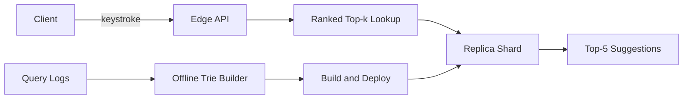

# Autocomplete

## 1. One-Line Definition
Autocomplete returns a short ranked list of query or term suggestions as the user types each prefix, using a pre-built prefix index (typically a trie) plus frequency and personalization signals, served with a sub-100 ms latency budget against an eager client that fires a request per keystroke.

## 2. Why Do We Need It?
Typing a query is the single most expensive interaction a user performs. Every keystroke is a potential correction opportunity, and suggestions cut typing effort dramatically (on mobile, where the keyboard eats the screen, type-ahead is nearly mandatory). It also accelerates search discovery, reduces misspellings ("elasticsaerch" → corrected before the user commits to it), and — because the suggestions are precomputed from real query logs — it surfaces the popular, high-quality queries your corpus actually knows how to answer. The cost: autocomplete runs at QPS equal to roughly the number of keystrokes per search, so it multiplies search traffic 5-10x, and users demand near-zero latency — both constraints structure the whole design.

## 3. Simple Intuition
The paperback dictionary thumbnail: you know "dictionary" lives between "dic..." and "dif...". A trie is the dictionary-as-memory: each node is a prefix, and every word in it is a path from the root. To suggest for "dic", you walk the "d-i-c" path and enumerate what hangs below it — and if you have precomputed "most popular word under this node," you answer instantly. Personalization is the library that remembers what books you tend to check out and nudges those to the top.

## 4. What Happens Without It?
Users type every query in full; typo-prone strings get search-boxed into the engine, yielding low-quality or empty result pages; on mobile the hit is brutal. Meanwhile, even if you keep the search box, a "suggestions" feature bolted onto the search engine naively — scanning the whole lexicon per prefix — costs more per keystroke than a real search costs per query, and the keystroke flood melts the backend. The absence is felt as slow, dead-feeling UX and hard-to-fix fat-finger queries.

## 5. Core Idea
- **A trie is the heart:** a prefix tree over the suggestion vocabulary. Each node represents a prefix; walking to the node for the typed prefix and reading its subtree gives all completions. Lookup cost is proportional to prefix length, not vocabulary size — the scalable reason a trie beats scanning.
- **Not all completions are equal:** suggestions are ranked, typically by query frequency (popularity), with fresh/trending boosts, and optional per-user personalization. The trie stores ranked answer lists at nodes, so ranking is precomputed at build time.
- **Top-k precomputation:** nodes don't enumerate their whole subtree per request — they store the top-K list (default ~5-10) for that prefix, computed once during build.
- **Compression:** a raw trie is memory-hungry (pointer per edge). Compressed/radix tries and ternary search trees shrink it; the whole suggestion lexicon typically fits in a few hundred MB of RAM on one node for millions of distinct prefixes.
- **Two hard scaling realities:** keystroke QPS (5-10x search QPS) and hot prefixes (popular queries all share a handful of prefix paths — the classic hotspot). Answers: replica shards + aggressive caching + stratified suggestion sets.
- **Fuzzy tolerance:** prefix-exact matching alone fails on misspelled keystrokes; a Bloom filter over valid prefixes short-circuits "no node exists" cases (forgiving "no suggestions" states), and edit-distance/n-gram fallbacks add fuzziness — see [[probabilistic-data-structures|Probabilistic Data Structures]].

## 6. Important Terminology

| Term | Simple Meaning |
|------|----------------|
| Prefix | The string typed so far (e.g., "elast") |
| Trie | Prefix tree; each node = one prefix |
| Radix/compressed trie | Trie with single-child chains merged, less memory |
| TST | Ternary search tree — trie-like, 3-way branching, cache-friendly |
| Top-k | The K best suggestions at a prefix (default 5-10) |
| Hot prefix | A prefix shared by so many popular queries it receives extreme load ("s", "te", "bo") |
| Debounce | Client-side delay before sending a keystroke's request |
| Personalization | Reordering suggestions from a user's history |
| Frequency | How often a query was issued — the popularity signal |
| Candidate set | The query-suggestion vocabulary the autosuggest search answers from |

## 7. Basic Architecture



## 8. Request or Data Flow
1. User types "he"; the client (after ~50-100 ms debounce) sends `suggest?prefix=he`.
2. The edge/gateway layer checks its local cache (a popular-prefix LRU) — most keystrokes are hot, so this is where most requests die and get answered.
3. On cache miss, a trie node lookup walks the "h → he" path and reads the precomputed top-K.
4. Personalization applies if the user is logged in: reorder the top-K with the user's query-history weights (cheap, on the suggestion list, never changing the trie).
5. The top 5 suggestions render; the result is one round-trip per keystroke, with a soft 100 ms budget end to end.

## 9. Practical Example
A search app with 50M queries/day (about 3.3k typed-searches/s) with an average query of 6 keystrokes:
- Suggested keystroke QPS ≈ 3.3k × 6 ≈ 20k QPS — 6x the search-engine QPS. This number structures everything (replicas, caching).
- Suggestion vocabulary: the top ~10M unique queries, tokenized into ~2M unique "sampling tokens"; a compressed trie over 2M leaves ≈ 150-400 MB RAM — fits two replicas on modest machines.
- Trie structure: each node holds top-10 of its subtree by frequency (precomputed at build); e.g., prefix "se" → ["search", "security", "series", ...] ordered by popularity.
- Hot-prefix reality: prefixes "s", "se", "a", "b" routinely take more than half of all traffic. The cache absorbs them (hit ratio ~85-90% for those) and distributing them across replicas protects the trie nodes.

## 10. Scaling
- **Sharding the trie:** split the vocabulary across shards (e.g., by first-letter bucket or hash) so each shard holds a subset; a prefix lookup routes to the shard(s) owning that prefix's subtree. This is the search-layer version of [[sharding|Sharding]] applied to a trie.
- **Replicas:** read replicas absorb keystroke fan-out; a replica set per shard gives both QPS headroom and availability.
- **Hot prefixes:** all hot queries share early prefixes — cache those entries aggressively at the edge; symmetric distribution (all replicas can serve any prefix) keeps a single hot node from melting.
- **Cache-first:** the 80-20 prefix distribution means an LRU cache of typed prefixes serves most requests; the trie itself only needs to survive the long tail.

## 11. Reliability and Failure Scenarios

| Failure | What Happens | Detection | Recovery | Trade-off |
|---------|--------------|-----------|----------|-----------|
| Trie builder fails | Suggestions go stale | Build pipeline alert | Rebuild against retained query logs | Stale suggestions unlimited |
| A replica dies | Keystroke latency spikes | Health checks | Fail over to siblings, keep cache | Reduced capacity while failing over |
| Personalization store down | Suggestions revert to popular-only | Feature store health | Serve non-personalized top-k (graceful) | Lost personalization, still usable |
| Cache stampede on hot prefix | Thundering herd to trie | Latency metric | Cache-aside with short TTL + jitter, lock | Stale by TTL window |

## 12. Consistency and Correctness
- **Read-only, eventually consistent by construction:** suggestions are a prebuilt artifact; the "source of truth" is the query log, and the trie is a snapshot. Updates flow on a schedule (e.g., hourly re-build from the last N days of logs), so a query's very first occurrence may take hours to appear as a suggestion — acceptable.
- **Ordering stability:** top-k ordering must be deterministic (tie-break by descending frequency then lexicographic) or two replicas answer differently.
- **Personalization is layered, not in the trie:** applying user history as a re-rank over the cached top-k keeps the core artifact shareable and cache-friendly.
- **Graceful degradation:** if the prefix is unknown (no trie node), return a short generic popular-queries fallback or nothing fast — never block a keystroke on a full rebuild.

## 13. Performance
- **Latency:** end-to-end budget typically 50-100 ms; a RAM-resident top-k trie lookup is ~1-5 ms; the rest is network and cache. Disk must be off the path entirely — the trie lives in memory.
- **Throughput:** keystroke QPS ≈ 5-10x search QPS by construction; cache hit ratio is the single largest lever (80-90%+ for top-prefix caches).
- **Memory vs speed:** raw trie is fastest but fattest; radix/TST compresses; per-node top-k lists add a little memory for a big lookup win. The suggestion set stays in RAM, so memory sizing = vocabulary size × trie overhead.

## 14. Security
- Suggestions are a disclosure surface: they can reveal what other users searched (trend of sensitive terms). Filter profane, sensitive, and PII-bearing queries at build time; keep per-user personalization data scoped and encrypted (see [[encryption-and-keys|Encryption and Keys]]).
- Tenants must not leak suggestions across accounts in multi-tenant search — build per-tenant suggestion vocabularies or strict scoping.
- Input validation: prefix is still untrusted user input — cap length, reject path/injection attempts, and never let a prefix walk outside the vocabulary tree logic.

## 15. Trade-Offs

| Choice | Advantages | Disadvantages | When to Use |
|--------|------------|---------------|-------------|
| Raw trie | Fastest lookups | High memory, rebuild cost | High-QPS flagship |
| Compressed/radix trie | Small memory | Slightly slower, complex build | Memory-constrained trie |
| TST | 3-way branching, cache-friendly | Slower than pure trie | Medium scale |
| Sorted-array + binary search | Tiny memory | Prefix walk is slower, cold starts | Small vocab, prototype |
| Personalization | Higher relevance | Cache-unfriendly, per-user state | Logged-in consumer apps |
| Popularity-only | Cacheable, fair, cheap | No individual relevance | Work/product/guest search |

## 16. Common Mistakes
- Sending one request per keystroke with no debounce → a 4x request explosion and p95 latency blowing the budget.
- Building suggestions on the search engine's hot path (each keystroke is a full inverted-index query) instead of a precomputed trie.
- Ignoring hot prefixes — a tiny set of early prefixes takes the majority of traffic and melts a single trie node without caching.
- No graceful degradation: when the trie/store hiccups, keystrokes hang instead of returning the low-cost fallback.
- Using popular-only suggestions for logged-in users and missing the whole personalization value — or applying personalization inside the trie and destroying its shareability.

## 17. HLD vs LLD Boundary
HLD: pick the trie/compressed structure, decide build cadence from query logs, set debounce/limit/rate controls, choose cache placement, and define personalization as a layered re-rank. LLD: the node structs, edge-compression algorithm, the top-k precompute pass, debounce timer values, and the per-user re-rank code.

## 18. Interview Questions

### Beginner
- What data structure makes "return all completions for prefix 'se'" fast, and why?
- Give the back-of-the-envelope for keystroke QPS vs search QPS.

### Intermediate
- Design autocomplete for a global consumer app with hot-prefix overload. Pick mitigations.
- How do you keep suggestions fresh while keeping the trie a shared, cacheable artifact?

### Advanced
- The suggestion vocabulary is 20M queries and keystroke QPS is 50k. Size the trie memory, the shard layout, and the cache to meet a 100 ms SLO.
- How do you add spelling-tolerant suggestions without sending every keystroke through an edit-distance scan?

## 19. Interview Memory Summary

> [!abstract]- Interview Memory Summary
> ### Remember
> - Autocomplete is trie-based top-k by prefix, built offline from query logs.
> - Keystroke QPS is 5-10x search QPS — the load profile is the design driver.
> - Precompute top-k at trie nodes so each request is one cheap lookup.
> - Hot prefixes (early letters of popular queries) concentrate traffic — cache aggressively.
> - The trie is read-only and eventually consistent; personalization is a layered re-rank.
> - Memory: compressed tries keep millions of leaves in hundreds of MB — RAM-resident is required.
> - Debounce, rate-limit, and degrade gracefully on the client and edge.

> ### 30-Second Explanation
> Build a trie over the top queries extracted from logs, with each node storing its precomputed top-k by frequency. Each keystroke (debounced) does a prefix walk — cache hit or 1-5 ms RAM lookup — ranked by popularity, optionally reranked by user history. Keystroke QPS runs 5-10x search QPS, so cache the hot prefixes and shard+replicate the trie; refresh the artifact on a schedule as a read-only snapshot.

> ### Interview Traps
> - Running suggestions as live search queries per keystroke.
> - Missing the keystroke/QPS amplification number in capacity math.
> - Forgetting hot prefixes and the cache that must absorb them.
> - Putting personalization inside the shared trie.
> - Ignoring graceful degradation on trie/store hiccups.

> ### Key Trade-Off
> Precomputed trie top-k gives sub-10 ms, cache-friendly suggestions that scale like a read-mostly artifact, at the cost of new-query staleness and an offline build pipeline you must keep fed with query logs.

## 20. Related Concepts

### Prerequisites
- [[search-engine|Search Engine]] (suggestions feed the search box that feeds the index)
- [[caching|Caching]]
- [[sharding|Sharding]] (trie shard placement)

### Commonly Used Together
- [[search-ranking|Search Ranking]] (suggestion ordering uses the same frequency/freshness signals)
- [[elasticsearch|Elasticsearch]] (a service that *can* host fuzzy prefix search when a trie is overkill)
- [[probabilistic-data-structures|Probabilistic Data Structures]] (Bloom short-circuit for unknown prefixes)

### Alternatives
- [[sql-vs-nosql|SQL vs NoSQL]] prefix scans when the vocabulary is tiny and QPS is low
- [[database-indexing|Database Indexing]] (B-tree range scans on prefix — fine for small vocab)

### Advanced Concepts
- [[probabilistic-data-structures|Probabilistic Data Structures]] (n-gram/Bloom hybrids for typo-tolerant suggestion gates)
- [[consistent-hashing|Consistent Hashing]] (spreading a sharded trie across hot-prefix traffic)

Related planned topics (not authored yet): type-ahead personalization, n-gram fuzzy matching, query-log mining.

## 21. References
Kleppmann, "Designing Data-Intensive Applications," ch. 3 (trie/prefix data structures, cited as "the user interface uses a trie" classic). Verify current runtime performance claims (cache hit ratios, memory-per-leaf) against the specific engine you deploy before interviews.

## 22. Active Recall

Test yourself before revealing each answer.

> [!question]- Why is a trie the natural structure for prefix suggestions, and what is the lookup cost?
> Every node in a trie corresponds to one prefix, and the subtree under a node is exactly the set of completions for that prefix. Type-ahead lookup is O(prefix length) node walks — independent of total vocabulary size — so it beats scanning or sorting the whole lexicon per keystroke.

> [!question]- Why do you store top-k *at each node* instead of enumerating the subtree per request?
> Enumerating a subtree is proportional to the number of completions (which can be millions for "a"), per keystroke. Precomputing each node's top-k makes the hot path one constant-size read (5-15 entries) that was ranked once at build time — turning an O(subtree) per request into an O(precomputed-list) read.

> [!question]- Why does autocomplete multiply your search-engine QPS, and by how much?
> Search typically sends one request; autocomplete runs a suggestion request per keystroke. With an average 5-8 character query, keystroke QPS is 5-10x search QPS — the multiplier you must size caches, replicas, and the trie fleet for or the feature eats the backend.

> [!question]- The prefix "a" is a single node but handles a third of all traffic. What breaks, and how do you fix it?
> What breaks: one hot trie node/machine saturates while others idle, and per-key disk spills kill latency. Fixes: cache the hottest prefixes at the edge (LRU of typed prefixes), serve every replica symmetrically so load spreads, and shard the trie so prefix subtrees distribute across nodes with cache-first routing.

> [!question]- You see a typo daily ("elasticsaerch") yet perfect-prefix suggestions never return it. Why, and what do you fix?
> The trie is prefix-exact: the path "e-l-a" exists but the user typed "e-l-s"; the exact-prefix walk fails before reaching any useful completions. Fixes: add n-gram or edit-distance candidates, and use a Bloom filter over valid prefixes to detect "no such path" cheaply and trigger the fuzzy fallback rather than returning nothing.

> [!question]- How does a weekly-rebuilt trie stay relevant for a viral, brand-new query?
> It cannot until the next build. The honest answer is a two-tier design: the batch-built trie covers popularity, and a small live "rising queries" stream (updates every few minutes from the query stream) supplements top-k — accepting that brand-new queries are inherently cold for suggestions.

> [!question]- Interview scenario: "type-ahead over 50M logged-in users." Walk the top-three design decisions.
> 1. Load model first: estimate keystroke QPS = searches/s × avg query length, then size replicas + caches around it.
> 2. Artifact: compressed trie with per-node top-k, RAM-resident, rebuilt incrementally on a schedule.
> 3. Personalization: layered re-rank from a per-user history store so the shared trie stays cacheable.

## 23. When Should I Use This?

### Use it when
- Users type free-text queries — suggestions cut keystrokes, fix typos, and boost discovery.
- The interaction is mobile-first or keystroke-costly.
- You have query logs to mine popularity from, or a limited domain lexicon to enumerate.
- Latency is a UX feature: fast prefix answers look magical and forgive other jank.

### Avoid it when
- The vocabulary is tiny and navigation is menu-driven (overkill machinery).
- You cannot budget for the keystroke QPS amplification and the offline build pipeline.
- Suggestions would leak sensitive or cross-tenant information you cannot filter.

### What problem does it solve?
Turning the most expensive typing interaction into a short, instant, ranked choice — reducing typo surface and keystroke cost via a pre-built prefix index with frequency-ranked suggestions.

### What problem does it NOT solve?
The actual retrieval/ranking of results ([[search-engine|Search Engine]]/[[search-ranking|Search Ranking]] do that once the user commits), spelling correction in the *result* stream, or instant reflection of new queries (the trie is a batch artifact with a freshness window).

## 24. Decision Connections

Decisions that go together with autocomplete:

- [[search-engine|Search Engine]] — suggestions run in front of the search box; commit a suggestion and the engine takes over.
- [[search-ranking|Search Ranking]] — suggestion ordering reuses frequency/freshness ideas but ranks *queries*, not documents.
- [[elasticsearch|Elasticsearch]] — "prefix/edge-ngram" queries can prototype suggestion search, but a precomputed trie is the scale answer.
- [[caching|Caching]] — hot-prefix cache hit ratio is the dominant throughput lever.
- [[sharding|Sharding]] — when the trie vocabulary outgrows one node, shard the prefix space like any hot-keyset.
- [[probabilistic-data-structures|Probabilistic Data Structures]] — Bloom filters make "no-such-prefix" checks cheap so fuzzy fallbacks run only when needed.
- [[capacity-estimation|Capacity Estimation]] — the keystroke-multiplier math starts here.

Decision tree:

```
Users type into a text box
    |
    +-- Vocabulary is small, QPS is low?
    |      → keep it simple: prefix scan, no trie
    |
    +-- Need instant ranked suggestions at real QPS?
    |      → [[autocomplete|Autocomplete]]
    |         |
    |         +-- Keystroke load is large?     → cache hot prefixes + replicas
    |         +-- Vocabulary too big for RAM?  → shard the trie
    |         +-- Typos common?                → Bloom filter + fuzzy fallback
    |         +-- Logged-in users?             → layered personalization
    |
    +-- The UX is menu-based, not typed?
           → skip suggestions; design navigation instead
```

