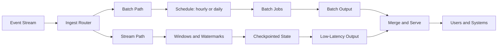

# Batch vs Stream Processing

## 1. One-Line Definition
Batch processing runs computations over a complete, bounded dataset on a schedule (everything at once, results as fresh as the schedule), while stream processing consumes an unbounded sequence of events continuously as they arrive, producing low-latency results that require explicit windows, watermarks, and ordering semantics.

## 2. Why Do We Need It?
Raw events — clicks, orders, sensor readings, logs — arrive continuously and in volume, but users and systems need them in *processed form*: hourly dashboards, daily sales reports, real-time fraud flags, refreshed recommendations. Nobody operates directly on a raw stream; they consume derived views. Batch and stream are the two ways to produce those views, and they have opposite natures: batch is simple, complete, and easy to make correct but slow; stream is fast but must explicitly handle data that is still arriving, out of order, or late. Choosing the wrong one for the latency tier you need is how projects end up with stale dashboards or an unmaintainable wall of stateful stream code.

## 3. Simple Intuition
Batch is a daily newspaper: the night crew collects all of yesterday's news, edits it, prints a consistent edition, and delivers one complete paper — nobody sees a "half-printed" day. Stream is a live feed: reporters push stories the moment they break; you see a headline instantly and a correction thirty seconds later, and the picture is never quite complete. The newspaper is easier to reason about; the feed is what you want when "yesterday's paper" is too late.

## 4. What Happens Without It?
Without batch, there is no reconciliation — no "run the whole world over again and get the same exact number" path — and no complete historical view. Without stream, everything waits a day or an hour: a fraud system that flags a fraudulent purchase tomorrow is just a bill, and a ride-surge system that reprices per-day serves nobody. Without choosing deliberately, teams improvise — cron scripts at 1 a.m. nobody understands, or brittle streaming pipelines with no replay story — and both break quietly.

## 5. Core Idea
- **Batch — the bounded model:** input is a finite dataset (yesterday's logs, a table snapshot). The job runs, completes, output is written; retry a failed batch by rerunning the whole thing — determinism makes reprocessing trivial. Staleness equals schedule granularity (hourly/day).
- **Stream — the unbounded model:** input is a continuous event series with no natural end. Output emits continuously, usually into windows (tumbling, sliding, session) — you must decide what a partial window means and what happens to late events that pass the watermark.
- **It is a spectrum, not a binary:** micro-batch (e.g., Spark Streaming cutting 100ms-1s granules) sits between, and continuous stream engines (Flink, Kafka Streams) process per-record. The concepts stay distinct; modern engines blur the line.
- **Time is the crux:** event time (when the event happened) vs processing time (when the machine saw it). Stream processing must pick one and reconcile the other — the single most common correctness failure. See also [[distributed-tracing|Distributed Tracing]] (event timestamps across hops) and [[strong-vs-eventual-consistency|Strong vs Eventual Consistency]] for the broader correctness framing.
- **Stream state is the price of freshness:** windows/joins need state (rolling counts, join buffers); fault tolerance therefore = checkpointed state + replay from the log, which is why delivery semantics (at-least-once, exactly-once effect) become first-class settings (see [[delivery-semantics|Delivery Semantics]]).
- **Frameworks:** Spark = batch + micro-batch; Flink and Kafka Streams = continuous streaming; both supply windowing, joins, aggregation, and state.

## 6. Important Terminology

| Term | Simple Meaning |
|------|----------------|
| Batch job | A bounded, scheduled computation over a complete dataset |
| Stream | An unbounded, continuous sequence of events |
| Event time | Timestamp in the data, when the thing happened |
| Processing time | Wall clock when the processor saw the event |
| Window | Bounding a stream into buckets for aggregation |
| Tumbling window | Fixed, non-overlapping buckets (5-minute) |
| Sliding window | Overlapping buckets (last 10 min, advancing 1 min) |
| Session window | Buckets delimited by gaps of inactivity |
| Watermark | A heuristic: events before this time are unlikely to arrive |
| Late event | An event arriving after its window's watermark |
| Checkpoint | Snapshot of stream state for fault tolerance |
| Backfill / replay | Reprocessing a historical range of a log |
| Exactly-once effect | Result as if processed once, even with retries in the machinery |

## 7. Basic Architecture



## 8. Request or Data Flow
1. Events are ingested (a Kafka topic, files, DB CDC) and duplicated to the batch and stream paths — the classic [[mapreduce-lambda-kappa|Lambda and Kappa]] fork.
2. **Batch path:** a scheduled job reads a bounded slice (yesterday's partition), runs a deterministic transform (group, aggregate, join), writes a complete output set, and records a commit point. Rerun = same input, same output.
3. **Stream path:** consumers read the live topic, assign events to windows by event time, hold window state, and emit each completed window as a low-latency result; checkpoints snapshot state so a crash resumes without losing progress.
4. **Merge and serve:** batch provides the complete, reconciled baseline (exact daily totals); the stream provides fresh interim numbers; a serving store layers or blends them.

## 9. Practical Example
Mobile analytics at 2 billion events/day:
- **Batch (nightly):** the daily report tables are rebuilt in full — DAU, funnels, retention cohorts, exact counts from the complete event set. Determinism means an audit can rerun any historical day and reproduce the number bit-for-bit; the batch result is the official truth.
- **Stream (real time):** a 5-minute tumbling window keeps a live DAU counter and a top-events board; numbers update every few minutes and are explicitly labeled approximate — the live board is a preview, not the official figure.
- **Reconciliation:** at 06:00 the batch result overwrites the stream's interim numbers; users watch the live estimate smooth into the exact figure. This split — live preview plus exact baseline — is the canonical batch-and-stream coexistence story.

## 10. Scaling
- **Batch scales by splitting input:** shard the data by key/time across workers — the [[mapreduce-lambda-kappa|MapReduce]] split-map-shuffle-reduce pattern. More workers over more input splits; the scheduler owns it.
- **Stream scales by partition:** one topic partition is a unit of parallelism and per-partition ordering; consumers attach per-partition state. Scale = add partitions + a redistributing rebalance (see [[kafka-rebalancing|Kafka Rebalancing]] and [[consumer-lag|Consumer Lag]]).
- **Stateful stream scaling is the hard part:** when parallelism changes, held state must be repartitioned keyed consistently, or you pay rebalance storms and state-migration cost.
- **Backfill both:** pipelines must be rerunnable — batch reruns naturally; streams rerun by replaying a topic range (within [[kafka-retention|Kafka Retention]]).

## 11. Reliability and Failure Scenarios

| Failure | What Happens | Detection | Recovery | Trade-off |
|---------|--------------|-----------|----------|-----------|
| Batch job fails | Today's output missing | Job status, alerting | Rerun the deterministic job, idempotent by design | Rerun duration |
| Stream worker dies | Results stall, state unflushed | Consumer lag spikes | Restore checkpoint, replay from log | Reprocessing window |
| Late or flooded events | Windows shift out | Watermark and lateness metrics | Emit corrections for late data | Freshness vs exactness |
| Producer double-sends | Duplicate events | Batch reconciliation diffs | Idempotent writes and dedup keys | Exactly-once complexity |

## 12. Consistency and Correctness
- **Batch correctness is cheap:** deterministic rerun gives exactly-once per job; output commits only after success; the schedule is the freshness contract.
- **Stream correctness is earned:** commit to event time or processing time and document it; late events past the watermark trigger corrections; checkpoints define the recovery guarantee. "Exactly-once effect" comes from idempotent sinks plus upstream dedup and transactional writes, not magic (see [[delivery-semantics|Delivery Semantics]]).
- **Reconciliation is mandatory:** stream results should be reconcilable against the batch truth; the difference between them is your freshness-vs-exactness budget. Design that merge explicitly, not as an afterthought.

## 13. Performance
- **Batch:** throughput is the metric (GB/min via parallelism); latency is schedule-bound (hours to a day). Highly efficient at scale — vectorized scans over bounded files, columnar formats in a [[data-warehouse-lake|Data Warehouse and Data Lake]].
- **Stream:** latency is the metric (seconds to minutes); per-record or per-micro-batch overhead trades efficiency for freshness; throughput is bounded by partition parallelism and state-restore cost.
- **Watch out for:** windowed state outgrowing memory and spilling to embedded stores (latency spikes on restore), and batch jobs emitting millions of tiny files (compact outputs).

## 14. Security
- Both paths carry sensitive payloads: encrypt at rest ([[encryption-and-keys|Encryption and Keys]]), TLS in transit, and scope access to derived stores — aggregates are often enough for analysts; do not hand a whole lake of raw rows on demand.
- PII in stream state and batch outputs obeys the same retention and encryption rules as the raw sources — derived stores must not become the compliance bypass.
- Connectors run arbitrary code in your cluster: validate connectors/plugins, and treat batch job submissions as privileged (least privilege + signed artifacts).

## 15. Trade-Offs

| Choice | Advantages | Disadvantages | When to Use |
|--------|------------|---------------|-------------|
| Pure batch | Deterministic, cheap, easy to rerun | Minutes-to-days staleness | Reports, reconciliations, backfills |
| Pure stream | Seconds-not-hours freshness | Windowing/watermark complexity, state cost | Fraud, monitoring, live ops |
| Micro-batch | Batch simplicity on stream data | Granularity floor of seconds | Spark Streaming default |
| Continuous stream | Lowest latency | Most state and ordering care | Flink and Kafka Streams jobs |
| Lambda, both | Fresh and exact together | Two code paths to maintain | Tiered latency needs |
| Kappa, stream only | One code path; replay is the batch | Whole-history replay becomes the reprocess | When retention is affordable |

## 16. Common Mistakes
- Confusing event time with processing time in windowing — "it processes fast, but the number is wrong."
- Promising stream exactly-once without the idempotency/dedup plumbing, then getting duplicates under failure (see [[delivery-semantics|Delivery Semantics]]).
- Running batch-style joins inside a stream where cascade state costs blow the memory budget.
- No reconciliation: stream and batch produce different numbers and nobody knows which is official.
- Scheduling one giant cron batch with no input partitioning, so parallel runs starve or OOM.

## 17. HLD vs LLD Boundary
HLD: choose batch, stream, or micro-batch for each latency tier; define windows and watermark policy; decide the delivery semantics you must deliver; set the reconciliation contract (batch official, stream interim). LLD: the specific Spark SQL / transform expressions, Flink windowing and watermark code, checkpoint-interval tuning, and format schemas.

## 18. Interview Questions

### Beginner
- What distinguishes a batch dataset from a stream?
- Give one application where batch is obviously right and one where stream is mandatory.

### Intermediate
- A search-click pipeline needs live top-query dashboards and exact daily reports. Which side does what, and where do the numbers meet?
- Event time vs processing time: when do they diverge, and which should a 5-minute DAU window use?

### Advanced
- Design session-window tracking for a ride-hailing app with a 10-minute watermark, and handle a 2-hour lag spike.
- You must deliver exactly-once-effect counts in a stream for billing. Walk the end-to-end design and say where exactly-once actually comes from.

## 19. Interview Memory Summary

> [!abstract]- Interview Memory Summary
> ### Remember
> - Batch: bounded, scheduled, deterministic, easy to rerun — the correctness winner, the latency loser.
> - Stream: unbounded, continuous, low-latency — but windows, watermarks, and state decide correctness.
> - Event time vs processing time is the classic trap; pick one and document it.
> - Stream fault tolerance = checkpointed state + replay from the log.
> - Latency tiers coexist: stream previews plus batch reconciliation is the normal shape.
> - Scaling: batch splits input; streams scale per partition (with state-migration pain).
> - Delivery semantics plus idempotent sinks produce the exactly-once effect.

> ### 30-Second Explanation
> Batch is a deterministic, rerunnable computation over a bounded dataset, scheduled hourly or daily, giving exact but stale results. Streams consume an unbounded event series, aggregate into event-time windows bounded by watermarks, checkpoint state for recovery, and emit low-latency, possibly-corrected results. Real systems run both — stream for live previews, batch for the official reconciled numbers — and scale batch by input splitting and streams by partition parallelism.

> ### Interview Traps
> - Confusing event time with processing time.
> - Claiming exactly-once without naming the idempotent sink and dedup mechanism.
> - Ignoring the reconciliation step between stream and batch numbers.
> - Treating batch and stream as a binary when micro-batch and Kappa sit in between.

> ### Key Trade-Off
> Batch buys determinism, cheap reruns, and exactness at the price of staleness; stream buys freshness at the price of windowing complexity, state management, and corrections — and mature designs run both rather than choosing one.

## 20. Related Concepts

### Prerequisites
- [[message-queue|Message Queue]]
- [[kafka-cluster|Kafka Cluster]] / [[kafka-retention|Kafka Retention]]
- [[delivery-semantics|Delivery Semantics]]

### Commonly Used Together
- [[mapreduce-lambda-kappa|MapReduce, Lambda, and Kappa]]
- [[data-warehouse-lake|Data Warehouse and Data Lake]]
- [[oltp-vs-olap|OLTP vs OLAP]]
- [[kafka-rebalancing|Kafka Rebalancing]], [[consumer-lag|Consumer Lag]]

### Alternatives
- [[event-driven-architecture|Event-Driven Architecture]] (when the consumer reacts per-event rather than aggregating)

### Advanced Concepts
- [[probabilistic-data-structures|Probabilistic Data Structures]] (approximate counts in streams)
- [[reliability|Reliability]] / [[observability|Observability]] for pipeline health

Related planned topics (not authored yet): windowing semantics deep-dive, checkpointing internals, Spark vs Flink comparison.

## 21. References
Kleppmann, "Designing Data-Intensive Applications," ch. 10 and 11 — the standard batch/stream treatment. Akidau et al., "The Dataflow Model: A Practical Approach to Balancing Correctness, Latency, and Cost" (2015) — the watermark/windowing formalism. Verify framework-specific defaults (Spark micro-batch, Flink checkpointing) against current docs before interviews.

## 22. Active Recall

Test yourself before revealing each answer.

> [!question]- Why is a batch job trivially reproducible while a stream job is not?
> A batch run reads a finite, immutable input snapshot and is deterministic — rerunning reproduces the same output bit-for-bit, so failure recovery is "just run it again." A stream never has a simple rerun: input keeps arriving, windows were already emitted, and state must be reproduced — recovery is restore-checkpoint-and-replay, not rerun.

> [!question]- What is the difference between event time and processing time, and which usually decides window correctness?
> Event time is when the event actually occurred (the timestamp in the data); processing time is when your machine happened to see it. Windowed aggregates must use event time for correctness — "what happened between 10:00 and 10:05" — while processing time only measures machine speed and conflates lag with truth when upstream delivery is delayed.

> [!question]- What problem does a watermark solve, and what is the price of setting it too low vs too high?
> A watermark is the heuristic point beyond which a window is declared complete and can be emitted. Too low, and you emit the window early and emit corrections for late arrivals. Too high, and you wait long enough that results are stale. It is the dial that trades freshness against correctness inside a stream.

> [!question]- Where does "exactly-once" actually come from in stream processing?
> Not from a magic single delivery. It comes from a combination: at-least-once delivery plus dedup/idempotent operations on the sink, versioned output transactions, and checkpointed state — together producing the *effect* of exactly-once, i.e., the observable result is indistinguishable from processing once even though the machinery retries. See [[delivery-semantics|Delivery Semantics]].

> [!question]- Your stream window holds gigabytes of state and now scales from 4 to 8 parallel instances. What's the risk?
> State is keyed and partitioned; rescaling repartitions it. If keys or state don't realign cleanly, consumers need a full rebalance with state migration — rebalance storms, latency spikes, and correctness cringe. Mitigate: key by the same field as the partition, checkpoint often, and prefer adding partitions before scaling consumers.

> [!question]- Why recommend batch for reconciliation on top of a streaming dashboard?
> Streaming numbers are approximate by construction (windows, late data, watermarks). A batch job over the complete dataset produces the definitive figure. Running both and letting the batch overwrite the stream's interim answer gives users live numbers that are eventually exact — the only way most products can have both freshness and official correctness.

> [!question]- Interview scenario: an ad-network needs sub-5-minute spend dashboards and also exact-invoice billing. What's the split, and what would you reconcile?
> Stream path (5-minute tumbling windows) powers the live spend dashboard — approximate, labeled as such. Batch path (nightly, full dataset) computes exact per-advertiser invoices. Reconciliation: invoice totals must equal or be explainable against the sum of streamed spend; the delta is charged to late events and window rounding. This is the canonical batch-for-truth / stream-for-speed architecture.

## 23. When Should I Use This?

### Use it when
- The freshness requirement is minutes-to-hours: **batch** gives deterministic, cheap correctness at exactly that tier.
- The freshness requirement is seconds-to-minutes and the pipeline handles events as they come: **stream**.
- You need backfill, audits, or reproducibility — batch pipelines are the natural tool.
- The volume is huge and partitionable — both paths leverage it differently (batch splits, stream partitions).

### Avoid it when
- You need per-event transactional reactions (compose [[event-driven-architecture|Event-Driven Architecture]] instead of stream windows).
- Seconds-latency precision with zero approximation is promised — streaming cannot deliver exactness without a reconciliation tier.
- The team wants one code path over one dataset without two systems — consider [[mapreduce-lambda-kappa|Kappa]]-style single-stream or micro-batch.

### What problem does it solve?
Producing derived, aggregated views from raw events at the right latency tier: batch delivers exact but scheduled results; stream delivers approximate but immediate results — and together they reconcile into a single coherent data output.

### What problem does it NOT solve?
Per-event side effects and transactional business logic (event-driven systems do that), interactive ad-hoc querying (that is a [[oltp-vs-olap|OLTP vs OLAP]] warehouse matter), or removing the need for planning — windowing, watermarks, checkpoints, and reconciliation are all deliberate design work.

## 24. Decision Connections

Decisions that go together with batch/stream processing:

- [[mapreduce-lambda-kappa|MapReduce, Lambda, and Kappa]] — the architectural shapes for exactly how batch and stream compose.
- [[delivery-semantics|Delivery Semantics]] — what the stream promises under retries; the foundation of exactly-once-effect claims.
- [[kafka-retention|Kafka Retention]] — how far back a stream can replay, i.e., how much "batch" a Kappa pipeline can simulate.
- [[consumer-lag|Consumer Lag]] — the health signal that says the stream is falling behind its freshness target.
- [[data-warehouse-lake|Data Warehouse and Data Lake]] — the serving layer that batch results land in.
- [[oltp-vs-olap|OLTP vs OLAP]] — why processed output feeds analytic stores, not transaction stores.
- [[probabilistic-data-structures|Probabilistic Data Structures]] — approximate unique/frequency counts inside stream windows at sub-linear memory.
- [[observability|Observability]] — dashboard health of both paths (job status, watermark lag, reconciliation diffs).

Decision tree:

```
Raw events need to become derived views
    |
    +-- Hours-to-days latency acceptable?
    |      → [[mapreduce-lambda-kappa|Batch processing]]
    |         +-- Determinism and rerunability are the goal
    |
    +-- Seconds-to-minutes latency, data keeps arriving?
    |      → Stream processing
    |         +-- Need session/event semantics?   → continuous engine: Flink, Kafka Streams
    |         +-- Batch simplicity welcome?       → micro-batch: Spark Streaming
    |         +-- Windowed aggregates matter?     → watermarks and event time
    |
    +-- Both freshness AND exact reconciliation required?
    |      → [[mapreduce-lambda-kappa|Lambda or Kappa]] shape
    |         +-- Two outputs, one truth? → batch reconciles stream
    |         +-- One pipeline, replayable? → Kappa suits
    |
    +-- Per-event reactions, not aggregates?
           → [[event-driven-architecture|Event-Driven Architecture]] instead
```

