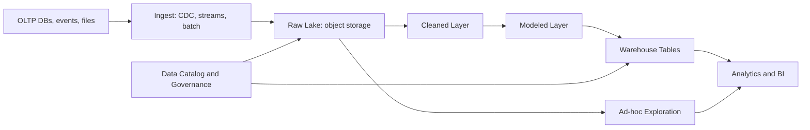

# Data Warehouse and Data Lake

## 1. One-Line Definition
A data warehouse is a curated, schema-on-write analytical store tuned for fast, reliable SQL over cleaned and modeled data, while a data lake is a cheap, schema-on-read repository that stores raw data in any format — and a lakehouse merges the two by layering warehouse-style tables and governance over lake storage.

## 2. Why Do We Need It?
Transactional databases ([[oltp-vs-olap|OLTP vs OLAP]]) are built for serving one row at a time and cannot survive broad analytical queries. Analysis wants the opposite shape: scan millions of rows, aggregate, join across subjects, answer historical "what happened" questions. Meanwhile raw data — logs, events, files, images — arrives in more formats and volumes than any schema can anticipate, and teams need a cheap place to keep it before anyone decides what it means. So enterprises end up with two stores: a warehouse for the modeled, queried, governed truth, and a lake for the raw, permissive archive that feeds the warehouse. "Should I put this in the warehouse or the lake?" is the daily data-engineering decision, and getting it wrong misdirects money, engineering, and compliance effort.

## 3. Simple Intuition
The warehouse is the organized archive: paper is indexed, catalogued, deduplicated, standardized into a consistent schema the moment it enters — anyone can reliably find "all Q3 sales by region" in a query. The lake is the loading dock where every raw container gets dropped "as-is," unopened, cheaply, in any shape — nothing is sorted yet, but nothing is thrown away either, and later, specialists crack containers open and decide how to dry-dock their contents into the archive. Warehouse = knowing where everything is because you classified it on the way in. Lake = keeping everything because classification can come later.

## 4. What Happens Without It?
Analytics run against the production OLTP database: long-running aggregation scans compete with customer-facing transactions, lock contention and CPU spikes shred the OLTP's latency SLO, and "big query" after big query crashes the service (see [[oltp-vs-olap|OLTP vs OLAP]] for why). Without a lake, the raw-data hoard is unmineable — teams keep unstructured data as flat files on shared drives, unversioned and unsearchable, and every "what was actually in that Kafka topic last March" question is answered from memory. Without either, the analytics team spends its life exporting CSVs.

## 5. Core Idea
- **Warehouse = schema-on-write:** define the schema, transform the data (ETL), then load it. Queries are fast and trusted because the data was cleaned at the door. The cost: flexibility — new questions need schema changes and re-modeling; raw details the schema never captured are gone.
- **Lake = schema-on-read:** store raw bytes first (object storage, columnar-friendly formats like Parquet), interpret and filter them at query time. Flexible, cheap (storage $.02-ish/GB/month), future-proof — but every consumer re-interprets the raw data, so quality and governance are your problem.
- **ETL vs ELT:** warehouse means ETL (extract, transform, load — transform before storage); lakes/lakehouses popularized ELT (extract, load raw, transform later within the store, often in SQL).
- **The lakehouse:** put a warehouse engine (table format + query engine) on top of lake storage (e.g., Delta/Iceberg-style tables on S3) — schema-on-read storage with schema-on-write tables, ACID-ish table operations, and warehouse-class query performance. It tries to eat both worlds: one cheap platform, warehouse conveniences.
- **From transactional source to analytics:** CDC/streams continuously push source changes into the pipeline ([[batch-vs-stream-processing|Batch vs Stream Processing]]), batch and stream both land results here; this store is the read model for analysis, never the source of truth.
- **Copy of truth, not the truth:** whatever lands in warehouse/lake is a projection derived from systems of record; lineage and staging layers document the journey. A medallion-style layering (bronze raw → silver cleaned → gold modeled) is the dominant organizational pattern.

## 6. Important Terminology

| Term | Simple Meaning |
|------|----------------|
| Warehouse | Modeled, schema-on-write analytical store |
| Data lake | Raw, schema-on-read storage for any format |
| Lakehouse | Warehouse tables and engine over lake storage |
| ETL | Extract, Transform, Load — transform before storing |
| ELT | Extract, Load, Transform — transform later inside the store |
| Parquet | Columnar file format that makes scans cheap |
| Medallion layers | Bronze raw, silver cleaned, gold modeled |
| Star schema | Facts + dimension tables, the classic warehouse model |
| Materialized view | Precomputed query result stored as a table |
| Governance | Lineage, access control, retention over the data |
| CDC | Change data capture: streaming row-level changes from a DB |
| Schema drift | Incoming data that no longer fits the declared schema |

## 7. Basic Architecture



## 8. Request or Data Flow
1. **Ingest:** change streams (CDC) and batch dumps pull from transactional systems into the pipeline (see [[kafka-producers-consumers|Kafka Producers and Consumers]] for the streaming side); raw payloads land in the lake as Parquet/JSON.
2. **Cleaning (silver/bronze gold):** scheduled jobs deduplicate, type-check, and standardize the raw data into a clean relational shape — lineage recorded per table.
3. **Modeling (gold):** clean data is shaped into star schemas and materialized views that BI can query directly.
4. **Query:** analysts and dashboards query the modeled layer through the warehouse engine; data scientists/ML engineers may query the raw layers directly for features the models never captured.

## 9. Practical Example
A ride-hailing platform:
- **Lake (raw):** every trip event, driver location sample, surge-decision log, and app crash stack lands raw as Parquet in S3 — hundreds of TB, object storage prices, retained for regulatory and modeling use.
- **Silver:** a nightly batch job dedupes and normalizes "trips," "drivers," "payments." Data quality checks fail loudly on schema drift (a new payment field breaking the shape, not silently).
- **Gold/warehouse:** star schemas for "trip_facts" with driver/passenger/time dimensions; materialized daily revenue and utilization views.
- **BI/analytics:** management dashboards hit gold tables; a data-science team queries bronze/silver directly for a pricing model feature no one predicted — the warehouse would have forced them to wait for a schema they didn't yet have.

## 10. Scaling
- **Storage scales like object storage:** lakes inherit virtually unbounded, cheap horizontal storage — no sharding math for raw volumes.
- **Compute scales separately:** warehouse engines decouple query compute from storage (serverless-style scaling); scaling the warehouse is adding query capacity, not moving data.
- **Table format physics:** analytic performance depends on file layout — partition pruning, bucket/range clustering, and compaction keep scans small; skip statistics reduce files read. Partitioning a big table = the analytical cousin of [[sharding|Sharding]] over time/tenant keys.
- **Concurrency:** BI concurrent dashboards all scanning the same tables → cache hot result sets, use materialized views, and reserve heavy exploration for separate clusters. Memory/CPU per query is per-node; wide scans on big nodes win.

## 11. Reliability and Failure Scenarios

| Failure | What Happens | Detection | Recovery | Trade-off |
|---------|--------------|-----------|----------|-----------|
| Ingest job fails | Data missing for that window | Job DAG alerting | Rerun the deterministic batch | Rerun latency |
| CDC lag | Tables stale | Freshness metrics on watermark | Restore lag; backfill from lake | Freshness vs cost |
| Corrupt/partial files | Wrong analytics | Quality checks on silver+ | Purge + rerun from lake source | Reprocessing cost |
| Schema drift | Loads fail | Schema validation alerts | Version schema / flexible columns | Breaks strictness |
| Lake silently un-governed | Compliance exposure | Catalog access audit | Scoped access + retention policies | Governance overhead |

## 12. Consistency and Correctness
- **Batch-load visibility:** table visibility switches at load/commit — readers see old state or new state, not an in-between; this is the warehouse's "transaction," far simpler than the streaming case.
- **Late data:** a verification load or backfill arrives after "today's" table was finalized — merge-on-key or version by load-timestamp so late events update, not duplicate.
- **Idempotent loads:** writes must be rerunnable (overwrite by partition, dedup keys), or a rerun doubles rows — the classic warehouse bug.
- **Lineage and trust:** correctness in a warehouse is auditable provenance — "this number came from these 14 source tables through these jobs" — not just output equality.

## 13. Performance
- **Columnar files win:** Parquet/ORC read only the columns a query needs and compress well — the difference between a 10-minute scan and a 30-second scan on the same data.
- **Partition pruning is everything:** a `WHERE date = '2026-09-01'` on a date-partitioned table reads one directory instead of years of data; wrong partitioning turns an analytic query into a full scan.
- **Materialized views:** precomputing frequent aggregations trades storage/compute for query speed — the same calculus as [[caching|Caching]] at the table level.
- **Compression and clustering:** sorted/bucketed columns compress better and merge-join faster; the storage engine's physical organization decides your query budget.

## 14. Security
- The lake holds raw, often-sensitive data: dynamic-row/column-level access control and scoped roles are essential — storage-level ACLs are not enough once engines run queries.
- Lineage, data-retention, and masking are governance work, not tape backups: enable audit trails on catalog access (see [[encryption-and-keys|Encryption and Keys]] for the encryption layer).
- Cross-tenant isolation: analytic tables list tenant columns, and engines must enforce per-tenant filters on shared tables — the multi-tenant sandbox question again.

## 15. Trade-Offs

| Choice | Advantages | Disadvantages | When to Use |
|--------|------------|---------------|-------------|
| Warehouse only | Trusted, fast, governed SQL | Rigid schemas, pricey storage, high ingest engineering | Stable, well-understood analytics |
| Lake only | Cheap, flexible, raw | Query effort on every consumer, governance is yours | Exploration, ML, archive |
| Lakehouse | Both: cheap store + warehouse ergonomics | Format/engine maturity risks, still evolving tooling | The default for new builds |
| ETL shape | Clean at the door, simple consumers | Rigid, brittle to change | Classic warehouse org |
| ELT shape | Flexible, SQL-native transformations | Raw data needs re-interpreting each query | Lakehouse teams |

## 16. Common Mistakes
- Building a warehouse on a schema you invent before knowing the queries — then re-modeling every quarter.
- A lake with no governance: raw PII from the "keep everything" habit becomes every analyst's sandbox and every auditor's nightmare.
- Treating the lake as storage-only and skipping file-quality habits (partitioning, columnar, compaction), so every query is a full "read everything once" scan.
- The silent "official number" problem: different teams compute "revenue" differently from the same lake; gold-layer modeling and a shared dimension dict fix it — absence of them breaks it.
- Replicating OLTP-style update-in-place semantics into the analytics store; warehouses batch by design, fight the design and you fight the engine.

## 17. HLD vs LLD Boundary
HLD: warehouse vs lake vs lakehouse, layering strategy (medallion), partitioning cadence, ETL vs ELT, and the governance/catalog approach. LLD: the DDL for star-schema tables, partition column definitions, materialized-view SQL, the specific CDC connector transforms, and the quality-check rules.

## 18. Interview Questions

### Beginner
- What is the one-line difference between schema-on-write and schema-on-read?
- Why is the data warehouse not the same as the production database?

### Intermediate
- The finance team needs auditable, trusted numbers while the ML team needs raw unfiltered events. Where does each read from, and what stops the ML team from corrupting the finance numbers?
- A nightly warehouse load takes 4 hours and the window is 3. What are your top-three levers?

### Advanced
- Design the lakehouse layering for a healthcare provider with hard retention and audit requirements. Where does governance live, and how do you enforce row-level patient access at scale?
- A backfill arrived for a table finalized yesterday. Design the merge so late data corrects rather than duplicates.

## 19. Interview Memory Summary

> [!abstract]- Interview Memory Summary
> ### Remember
> - Warehouse: schema-on-write, curated, query-trustworthy; Lake: schema-on-read, cheap, raw; Lakehouse: tables over lake storage.
> - ETL tames data at the door; ELT interprets it at query time.
> - Columnar files and partition pruning decide query speed — physical layout is the HLD lever.
> - Batch loads switch table state atomically; idempotent reruns are the correctness habit.
> - Lakehouse = one platform for warehouse ergonomics and lake economics; a maturing trade.
> - The analytics store is a derived read model; the transactional DB is the source of truth.
> - Governance (lineage, ACLs, retention) is where lakes silently fail.

> ### 30-Second Explanation
> Data is ingested from transactional systems via CDC and batch into a raw lake (cheap object storage, Parquet), where it is kept in bronze layers; scheduled jobs clean it into silver, then model it into gold star schemas that BI queries through a warehouse engine. That layering reconciled as a lakehouse — warehouse tables over lake storage — makes the trade simpler: keep everything raw for flexibility, but present curated, governed, materialized views to analytics. Physical arrangement, idempotent loads, and lineage are the design essentials.

> ### Interview Traps
> - Solving "analytics on the OLTP database" as a query-tuning problem instead of a separation problem.
> - Promising a lake with no governance/lineage plan.
> - Skipping physical layout (partition keys, columnar) and then blaming the engine for slow scans.
> - Claiming ETL and ELT interchangeably when the pipeline shape differs.

> ### Key Trade-Off
> The warehouse buys query trust and speed by paying storage cost and schema rigidity; the lake buys flexibility and price by moving interpretation and governance onto you — the lakehouse parks in between wherever maturity allows.

## 20. Related Concepts

### Prerequisites
- [[oltp-vs-olap|OLTP vs OLAP]]
- [[batch-vs-stream-processing|Batch vs Stream Processing]]
- [[database-fundamentals|Database Fundamentals]]

### Commonly Used Together
- [[kafka-producers-consumers|Kafka Producers and Consumers]] (streaming ingestion)
- [[outbox-pattern|Outbox Pattern]] / CDC-shaped writes
- [[mapreduce-lambda-kappa|MapReduce, Lambda, and Kappa]]
- [[normalization-vs-denormalization|Normalization vs Denormalization]]

### Alternatives
- [[elasticsearch|Elasticsearch]] when the "analytics" is really search + low-cardinality aggregations
- [[sql-vs-nosql|SQL vs NoSQL]] raw stores for operational data, not analytics

### Advanced Concepts
- [[probabilistic-data-structures|Probabilistic Data Structures]] (approximate counts in analytic queries)
- [[cap-theorem|CAP Theorem]] (why analytical read models separate from OLTP)

Related planned topics (not authored yet): specific lakehouse table formats, columnar engine internals, data-quality and lineage tooling.

## 21. References
Kleppmann, "Designing Data-Intensive Applications," ch. 3 (columnar storage, schema-on-read vs write, cited as the definitive treatment). Armbrust et al., "Lakehouse: A New Generation of Open Platforms for Data Analytics" (2021) — the lakehouse framing. Verify current warehouse/lake feature boundaries against the platform you use before interviews.

## 22. Active Recall

Test yourself before revealing each answer.

> [!question]- Why can't an OLTP database just serve the analytics queries?
> OLTP storage is row-oriented and index-tuned for point lookups and transactional writes; analytic scans want columnar storage and full-relation scans. Running heavy aggregates on the production store competes with live transactions for CPU, I/O, and locks — the latency SLO of the app degrades. Separation into an OLAP-optimized read model (see [[oltp-vs-olap|OLTP vs OLAP]]) is structural, not a tuning choice.

> [!question]- Schema-on-write vs schema-on-read: what does each buy and cost?
> Schema-on-write (warehouse) validates/cleans data at ingestion — queries are fast and trustworthy, but new questions need schema changes and untransformed details are lost. Schema-on-read (lake) stores raw bytes and interprets at query time — any future question is possible and storage is cheap, but every consumer re-interprets and you own the quality.

> [!question]- A nightly load is not idempotent and a rerun doubles rows. Why is that a warehouse-class bug?
> Warehouse tables are rebuilt by schedule, so reruns and job retries are a normal operational event — if a load's write is not idempotent (overwrite-by-partition, dedup on keys), the retry silently doubles every row and "trusted analytics" starts from wrong numbers. Idempotent-by-design writes are the difference between a rerun and a data incident.

> [!question]- What physical decisions actually decide warehouse query speed? Name three.
> 1. Columnar file format (Parquet/ORC) — read only needed columns; 2. Partitioning/clustering on the hot filter keys (date, tenant) so queries prune whole directories; 3. Compaction/sorting — small files and good key ordering keep scans and merges cheap. These dominate the engine's raw capabilities.

> [!question]- What is the difference between ETL and ELT, and who prefers which?
> ETL transforms before storing — clean data, brittle pipeline, warehouse-generated shape. ELT loads raw first and transforms later in the store (usually SQL) — flexible, schema later, lakehouse-preferred. The choice decides whether the transformation passes through a code-owned pipeline or the query engine.

> [!question]- The lake is 'raw and permissive'. What is the classic failure mode?
> Un-governed lakes become compliance and quality disasters: raw PII accessible to every analyst, conflicting ad-hoc definitions of "revenue," unbounded retention, and no lineage to defend a number in an audit. Governed layering (bronze raw / silver clean / gold modeled) with access control and lineage is what saves the lake from itself.

> [!question]- Interview scenario: 200K db updates/min plus daily full-load dashboards. Sketch the architecture.
> 1. CDC stream to Kafka, consumed into the lake as bronze append-only data (cheap, complete).
> 2. Silver cleanup jobs dedupe/type-check → gold star schemas built as materialized views.
> 3. Dashboards read gold; ad-hoc exploration and ML read silver/bronze; finance reads only governed gold with lineage. This is the standard lakehouse-medallion shape.

## 23. When Should I Use This?

### Use it when
- Analytical questions span the whole dataset and cannot be answered from the production store without hurting [[oltp-vs-olap|OLTP vs OLAP]] workloads.
- You need historical, joined, cross-subject reporting ("last 3 years of revenue by region and product").
- Raw data arrives in many formats and you want to keep everything (ML features, future questions, compliance archive) — that is a lake's job.
- You can staff the maintenance: ETL/ELT pipelines, partitioning, quality checks, and governance.

### Avoid it when
- The "analytics" is a handful of known queries over a few million rows — a replica or a simple analytic read model from [[database-replication|Database Replication]] suffices.
- Nobody has time to model and govern — a lake without governance/lineage is a cost center and a liability.
- Freshness is required in seconds and queries are small slices — streaming [[elasticsearch|Elasticsearch]]-style search may fit better than a warehouse.

### What problem does it solve?
Providing a separate, cheap-with-curation place where broad, historical, join-heavy analytical queries run without degrading production systems, and where raw data is retained for interpretations you have not needed yet.

### What problem does it NOT solve?
Transactional serving (that stays in OLTP), real-time per-event reactions ([[event-driven-architecture|Event-Driven Architecture]]), or governance-by-itself — a lake with no catalog, ACLs, and lineage is just a big insecure disk.

## 24. Decision Connections

Decisions that go together with warehouse/lake:

- [[oltp-vs-olap|OLTP vs OLAP]] — the upstream vs analytic separation that justifies the store at all.
- [[batch-vs-stream-processing|Batch vs Stream Processing]] — the pipelines that fill the layers; warehouse results are batch-shaped, lakes ingest streams too.
- [[mapreduce-lambda-kappa|MapReduce, Lambda, and Kappa]] — the compute engines that transform layers.
- [[normalization-vs-denormalization|Normalization vs Denormalization]] — gold tables are deliberately denormalized star schemas.
- [[kafka-producers-consumers|Kafka Producers and Consumers]] — the streaming CDC path that keeps lakes current.
- [[elasticsearch|Elasticsearch]] — the low-cardinality/aggregation alternative for search-flavored analytics.
- [[probabilistic-data-structures|Probabilistic Data Structures]] — approximate count/distinct shortcuts in huge scans.
- [[reliability|Reliability]] — job retries, idempotent loads, and reconciliation as reliability properties.

Decision tree:

```
Broad, historical analytics needed
    |
    +-- Once-off small data? 
    |      → analytics read model from a DB replica
    |
    +-- Ongoing huge analytics?
    |      → [[data-warehouse-lake|Warehouse and Lake]]
    |         |
    |         +-- Known queries, stable schema?   → warehouse-first (ETL)
    |         +-- Raw flexibility + ML features?  → lake-first (ELT), skimmed later
    |         +-- Need warehouse ergonomics cheaply? → lakehouse shape
    |         +-- Governance/lineage eschewed?    → stop: lake without it is a liability
    |
    +-- Real-time aggregations/narrow lookups?
           → search-flavored: [[elasticsearch|Elasticsearch]] likely fits better
```

