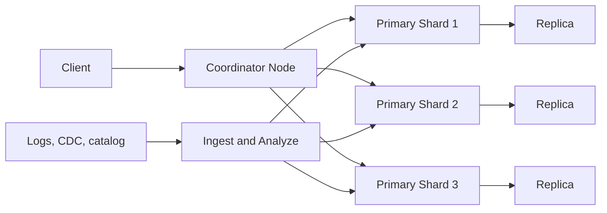

# Elasticsearch

## 1. One-Line Definition
Elasticsearch is a distributed, near-real-time search and analytics engine built on Apache Lucene that stores documents as JSON, indexes them into inverted-index segments, and fans out queries across shards and replicas to serve full-text search, aggregations, and structured queries at scale.

## 2. Why Do We Need It?
You need full-text search with relevance ([[search-ranking|Search Ranking]]), but you do not want to hand-build the distributed inverted index, the analyzer pipeline, the shard/replica management, and the query DSL yourself. Elasticsearch packages Lucene's inverted index (the same engine family as the [[search-engine|Search Engine]] abstraction) into an operational product: JSON in, ranked results and aggregations out, with replication, sharding, and recovery built in. It also doubles as an analytics engine — log analytics and observability dashboards are its most common production use — because aggregations run over the same indexes that serve documents. It is the default answer to "design a search system" interview questions because it is the concrete embodiment of the search pipeline.

## 3. Simple Intuition
A giant, auto-partitioned card catalogue. You hand it a card (JSON document); it files the card into the right drawer (shard) and adds every word on it to a word→card index (inverted index). When someone asks for "tsunami warning near Osaka," it checks a few drawers (query fans out to shards), merges the word-lists, scores the cards by relevance (BM25), and returns the top 10 — with counts, if you ask for aggregations. The catalogue is organized for you; you just decide how many drawers and how many copies (shards and replicas).

## 4. What Happens Without It?
Without something like it, you are running `LIKE %term%` scans against a transactional database — O(n) per query, dead at scale — or hand-maintaining a bespoke search cluster: your own inverted index writer, your own replication, your own node-failure recovery, your own analyzer config. You lose months to search plumbing and still get it wrong (that is the classic "we built our own search and it broke" story). For log/observability workloads there is no practical "without it" at scale — a DB cannot ingest and aggregate the event volume that a segmented inverted index absorbs.

## 5. Core Idea
- **Lucene segments:** documents land in immutable inverted-index files called segments; segments are periodically merged and made visible. This is where near-real-time comes from — "documents appear searchable a moment after ingest, not instantly."
- **Near-real-time (refresh):** by default ~1s refresh: indexed docs are searchable shortly after write, but not transactionally committed — a committed (fsync'd, durable) write is a separate, less frequent step. There is always a small window where a crash can lose the last moments of *buffered* data (unless you use the higher-consistency settings).
- **Shards and replicas:** every index is split into primary shards (doc subsets = horizontal slicing, the direct application of [[sharding|Sharding]]) and replicas (copies that serve reads and provide failover = [[database-replication|Database Replication]]). Number of primary shards is fixed at index creation; replicas are flexible.
- **Coordinator routing:** any node can accept a request; coordinators route reads to the appropriate shard (or fan out to all shards for a full-text query) and merge results — the scatter-gather pattern of sharded systems.
- **Query types:** full-text match (analyzed terms), structured term/range queries, and aggregations (more-or-less the OLAP operation family over search data — see [[oltp-vs-olap|OLTP vs OLAP]] for why that is a different class than transactional queries).
- **Built-in relevance:** BM25 scoring by default per field; per-field boosts and custom analyzers are first-class settings.

## 6. Important Terminology

| Term | Simple Meaning |
|------|----------------|
| Lucene | The underlying Java indexing library that does the actual inverted-index work |
| Index | A collection of documents (≈ a logical table) |
| Document | One JSON object, the searchable unit |
| Shard | A horizontal slice of an index (Lucene index instance) |
| Replica | A copy of a shard, serving reads + failover |
| Segment | Immutable inverted-index file inside a shard |
| Refresh | Making newly ingested docs searchable (~1s default) |
| flush / commit | fsync of segments to durable storage |
| Translog | Write-ahead log in Elasticsearch (durability buffer between refresh and flush) |
| Coordinator | Node that receives a request and fans out/merges |
| Mapping | Schema for fields (analyzable text vs keyword vs numeric) |
| Ingest pipeline | Pre-processing of docs before indexing |
| Cluster health | green (all shards replicated), yellow (replicas not yet), red (primaries missing) |

## 7. Basic Architecture



## 8. Request or Data Flow
1. **Index a document:** a producer (call path, CDC connector, log shipper) POSTs JSON → coordinator hashes the doc's `_id`/routing to choose a primary shard → the analyzer tokenizes text fields → the doc is appended to an in-memory buffer + the translog.
2. **Refresh:** on the ~1s interval the buffer becomes a new segment — the doc is now searchable.
3. **Search:** the coordinator receives a `match` query on "tsunami warning" → it fans out to every shard holding that index (or to whichever shards apply for a routed/term query) → each shard intersects posting lists, computes BM25, returns its local top-k → the coordinator merges, applies any aggregations, and returns the final top-10.
4. **Commit/flush:** periodically, segments are fsync'd and the translog is trimmed — durability hardened for the inevitable crash.

## 9. Practical Example
E-commerce catalog (10M products) on 3 data nodes:
- Index `products` with 5 primary shards + 1 replica each → 15 Lucene shard copies across the cluster.
- Catalog service publishes changes to a Kafka topic; a heavyweight connector consumes it and indexes into Elasticsearch (CDC-style pipeline, see [[kafka-producers-consumers|Kafka Producers and Consumers]]).
- Query "red running shoes" → fans out to 5 primary shards, each returns its local top-10 by BM25 (title field boosted 3x) → coordinator merges to the global top-10 and computes a `terms` aggregation on category for faceted filters.
- Refresh ~1s, so a price change is already searchable within a second of the Kafka event; the DB remains the source of truth, Elasticsearch is a derived read model.

## 10. Scaling
- **Reads:** add replicas — more copies serve the same shards' queries; full-text queries fan out to every shard either way, so replica count scales concurrent QPS, not query latency.
- **Writes:** write throughput scales with the number of *primary* shards; more primaries = more parallel ingest, but you can't re-shard an existing index (you must reindex) — choose primary count with headroom at creation.
- **Corpus size:** total data = primaries × shard capacity; pick a shard size that stays manageable (~10-50 GB per shard recommended) so merges and recovery stay tame.
- **Hot data:** recent logs/news see uneven load — add time-based indices with a rolling pattern (index-per-day) rather than one growing index; search "last 7 days" over 7 indices instead of one giant one.
- **Aggregation cost:** heavy `terms` aggregations over big cardinalities are expensive — cache aggregations for dashboards and prefer left-heavy aggregations (see 13).

## 11. Reliability and Failure Scenarios

| Failure | What Happens | Detection | Recovery | Trade-off |
|---------|--------------|-----------|----------|-----------|
| Node dies | Some shard copies lost | Cluster health turns red/yellow | Promote replica to primary, rebuild replicas | Thin on replicas = longer downtime |
| Primary lost with no replica | Docs missing until recovery | Red cluster state | Restore from source/backups | Full restore cost |
| Disk full (red) | Writes stop, index read-only | Health + monitoring | Clean old indices, add nodes | Data loss risk on rollover |
| Split brain | Coordinators disagree | Former cluster-formation guard now off by default | Rebalance after quorum loss | Consistency risk if misconfigured |
| Mergebrain / segment storm | Latency spikes during merge | Merge queue metrics | Tune merge settings, more vCPU | Throughput vs merge jitter |

## 12. Consistency and Correctness
- **Eventual consistency near-real-time:** searchable within ~1s of ingest; between commit and crash, buffered-but-unflushed writes can be lost (controlled by `refresh_interval`, `translog` settings, and `wait_for` params) — choosing consistency settings is a business call, not an implementation detail.
- **Read-your-writes:** a doc indexed and immediately searched may not appear until the next refresh — a classic "I just wrote it, why isn't it there" moment; design the app to tolerate or use refresh wait.
- **Deletes/updates are lazy:** Lucene marks them dead; physical reclamation happens at segment merge. A "deleted" doc can therefore still appear briefly on searches — matters for compliance-style deletions.
- **Idempotency:** indexing by stable `_id` is an upsert — reprocessing a Kafka event should not duplicate a doc (design your CDC connector accordingly).

## 13. Performance
- **Latency:** query path = coordinator fan-out + per-shard Lucene scoring + merge; p99 usually 10-100 ms with RAM-resident segments (the "filesystem cache" is the index's working set — it wants the hot segments in memory).
- **Refresh/merge tax:** high write QPS with short refresh intervals produces many tiny segments and frequent merges — the classic "indexer churns, queries slow down" spiral; size primaries and balance refresh vs merge.
- **Aggregations:** full scans over result sets inside a request; keep them left-heavy (few buckets, low cardinality) and cache dashboard-level aggregations.
- **Amplification:** full-text queries always go to every shard — per-query cost grows linearly with shard count; routing on deterministic fields (e.g., tenant) pins some queries to one shard and buys latency.

## 14. Security
- Authentication (defaults to multilayered x-pack licensing; external IDP via proxies often used), TLS, and per-index role-based access control are the baseline — see [[authentication-vs-authorization|Authentication vs Authorization]].
- Document/field-level security can be applied per role (queries are rewritten with security filters), but it is a defense-in-depth layer — keep the source of truth upstream and enforce access at the API/layer boundary.
- Logs contain sensitive payloads by nature: apply field masking in the ingest pipeline (see [[encryption-and-keys|Encryption and Keys]], [[web-vulnerabilities|Web Vulnerabilities]] for the broader input-hygiene picture).

## 15. Trade-Offs

| Choice | Advantages | Disadvantages | When to Use |
|--------|------------|---------------|-------------|
| Elasticsearch as source of truth | Fast reads | Eventual consistency, lazy deletes, reindex pain | Cache/derived read models only |
| DB as source + ES as read model | SQL truth + search speed | Dual-write/CDC plumbing | The normal real-world shape |
| Many small primaries | Parallel ingest | Fan-out per query, more merges | High write QPS |
| Few big primaries | Cheap queries, better recovery | Ingest bottleneck, slow rebalance | Read-heavy, low-write |
| Always `routing` keyed | One-shard queries, sub-ms | Skews if keys are hot | Tenant-isolated SaaS |
| Time-based rolling indices | Cheap retention, bounded hot set | Cross-index searches, mapping drift | Logs/observability |

## 16. Common Mistakes
- Treating Elasticsearch as the system of record — lose the durability window and lazy deletes, and suddenly "source of truth" lies to you.
- Fixing the primary-shard count at index creation with no headroom, then needing more primaries and discovering reindexing is the only way (reindex = new index, copy, alias swap).
- Ignoring the filesystem-cache physics: on cold caches, query p99 explodes because segments aren't resident.
- Letting merge amplification spiral: short refresh intervals + small shards + high write rate = constant Lucene merge storms in CPU.
- Running `terms` aggregations with unbounded buckets over huge cardinalities — a per-request full scan that surprises the ops team.
- Not defining an alias/refresh strategy for deploy-time reindexing and schema/mapping changes.

## 17. HLD vs LLD Boundary
HLD: choose whether search is a derived read model, pick shard/replica counts and refresh policy, lay out the ingest pipeline (CDC/Kafka), decide routing and index-per-time patterns, and define what-must-the-query support. LLD: the specific mappings and analyzers, BM25 boost values, the ingest-pipeline processors, and the query DSL body for each feature.

## 18. Interview Questions

### Beginner
- What does "near-real-time" mean for Elasticsearch, concretely?
- Why is Elasticsearch a derived read model rather than the database of record?

### Intermediate
- Design the ingest-to-search pipeline for a catalog that changes via Kafka CDC. How do you avoid duplicates?
- Your cluster health is yellow after a node dies. What happened, and what's the recovery sequence?

### Advanced
- You need 50k writes/s and <100 ms search p99. Size primaries, replicas, refresh, and merge-limit the cluster — and justify each.
- A query returns the same term with both a match and an aggregation that disagree. Where does consistency break, and how do you design around it?

## 19. Interview Memory Summary

> [!abstract]- Interview Memory Summary
> ### Remember
> - Elasticsearch = Lucene inverted index, packaged distributed: JSON in, ranked/aggregated results out.
> - Near-real-time: refresh visibles docs ~1s; commits/translog own durability.
> - Shards = horizontal slicing ([[sharding|Sharding]]); replicas = read copies + failover ([[database-replication|Database Replication]]).
> - Full-text queries always fan out to every shard; latency = slowest shard + merge.
> - Primary count is fixed at creation — reshard = reindex via alias.
> - Keep it as a derived read model; the transactional DB stays the source of truth.
> - Filesystem cache is the working set: hot segments must stay resident.

> ### 30-Second Explanation
> Elasticsearch indexes JSON through Lucene into immutable segments inside shards; a ~1s refresh makes them searchable and the translog/commit cycle hardens durability. Queries reach a coordinator that fans out to all shards, each scoring with BM25 and returning local top-k, then merges — aggregations run over the same path. Scale with replicas for QPS and priming for writes; time-based rolling indices keep the hot set bounded; the transactional database remains the source of truth upstream via CDC/Kafka.

> ### Interview Traps
> - Naming sharding only for writes, forgetting that search queries fan out to *every* shard.
> - Promising transaction-grade consistency from an eventual, NRT engine.
> - Ignoring the refresh window when the user asks "why is my just-created doc missing?"
> - Assuming you can change primary-shard count without a reindex.

> ### Key Trade-Off
> You trade transaction-grade consistency and simple schema to a durable-Kafka/DB dual for second-latency search at 10k+ writes/s with built-in sharding/replication and relevance — accept the NRT window and the reindex-via-alias workflow as the price.

## 20. Related Concepts

### Prerequisites
- [[search-engine|Search Engine]] (the inverted-index abstraction it implements)
- [[sharding|Sharding]] (search sharding in operation)
- [[database-replication|Database Replication]] (replicas inside ES)

### Commonly Used Together
- [[search-ranking|Search Ranking]] (BM25 and boosts are the default relevance)
- [[autocomplete|Autocomplete]] (suggestion features are often ES-backed)
- [[kafka-replication|Kafka Replication]] / [[kafka-producers-consumers|Kafka Producers and Consumers]] (CP pipeline carrying writes)
- [[caching|Caching]] (hot-query cache; cache the derived results)

### Alternatives
- [[sql-vs-nosql|SQL vs NoSQL]] DB full-text when search is a minor feature
- [[data-warehouse-lake|Data Warehouse and Data Lake]]/[[oltp-vs-olap|OLTP vs OLAP]] engines when the workload is heavy aggregations, not ranked text search

### Advanced Concepts
- [[probabilistic-data-structures|Probabilistic Data Structures]] (cardinality/approx aggregations inside ES)
- [[observability|Observability]] (ES's own most common workload: logs/metrics)

Related planned topics (not authored yet): Elasticsearch under the hood (segments, translog, merge policy), Solr comparison, CDC-to-search streaming.

## 21. References
Sharma, "Elasticsearch: The Definitive Guide" (O'Reilly) — canonical shard/segment/refresh explanations. Kleppmann, "Designing Data-Intensive Applications," ch. 3 (Lucene segment model, cited as "ES is built on Lucene"). Verify current default refresh/translog settings with the version you deploy before interviews.

## 22. Active Recall

Test yourself before revealing each answer.

> [!question]- Refresh vs flush/commit, in Elasticsearch terms — what is each and which is on the hot path per write?
> Refresh (default ~1s) materializes buffered docs into a searchable segment; it is frequent and on the per-write path but does NOT fsync. Flush/commit fsyncs segments and trims the translog, giving durability — it is rarer and heavier. Searchable-now (refresh) and durable-now (commit) are deliberately different moments.

> [!question]- Full-text search hits all primary shards even though the index has 50 primaries. Why, and what does that mean for latency?
> A full-text query needs every shard's posting lists because any shard can hold any match. Each shard computes local top-k; latency = slowest shard + coordinator merge. So shard count doesn't save you on search latency — it buys write parallelism — and an imbalanced/hot shard node directly inflates p99.

> [!question]- A node dies and cluster health shows yellow. Wait — why not red?
> Red = at least one primary shard unassigned (have lost data-copy). Yellow = replicas are unassigned but every primary is still reachable — a transient state that usually self-heals as the remaining nodes rebuild replicas. Red is the disaster; yellow is the temporary eyebrow raise.

> [!question]- You realize your index needs 12 primaries, but it was created with 5. What are your options?
> Primary count is fixed at creation; the standard move is the reindex flow: create a new index/mapping with 12 primaries, reindex (copy) into it while traffic reads the old one, then switch an index alias to the new index atomically — using aliases from day one makes this safe.

> [!question]- Why does the OS page cache decide your query latency?
> Segments are files; Lucene relies on the operating system filesystem cache to keep hot segments memory-resident. If that cache is cold (cache pressure from ingest/merges), every query pays disk seeks — p99 blows out. You must size JVM heap for a fraction of memory and leave the rest of RAM for the page cache.

> [!question]- Ingestion is a CDC event stream from a relational DB. How do you avoid duplicate documents when a source record is replayed?
> Index by the stable source primary key (`_id` = source row id): indexing is an upsert, so a Kafka replay with the same record updates/overwrites rather than creating a second doc. Combine it with idempotent or deduplicated consumers upstream (see [[delivery-semantics|Delivery Semantics]]).

> [!question]- Interview scenario: a chat app wants "search my past messages" with per-user isolation. Walk the design.
> 1. Index `messages`, document = one message, text fields analyzed, `_id` = message id.
> 2. Routing on `user_id` so any single-user query lands on one shard; tenant filter enforced per query.
> 3. Ingest via CDC/Kafka from the message store; `_id` = stable message id for idempotent upserts.
> 4. Accept NRT (~1s) visibility; DB stays the system of record; refresh tuned to write volume.

## 23. When Should I Use This?

### Use it when
- You need ranked full-text search or sub-second queries over large, semi-structured JSON corpora.
- Aggregations/dashboards are a real feature (log analytics, product analytics, facet counts).
- You want built-in sharding/replication/recovery instead of building a distributed Lucene by hand.
- A CDC/Kafka or log-shipping pipeline already exists to feed it — it is a derived read model.

### Avoid it when
- The data is transaction-critical — it is eventual and near-real-time by design, not an OLTP store.
- Queries are simple key lookups on small data — a [[sql-vs-nosql|SQL vs NoSQL]] store or plain DB wins on correctness (see [[oltp-vs-olap|OLTP vs OLAP]]).
- Your team has no capacity for index/mapping/reindex lifecycle and ops runs (merge storms, disk reds are real).
- You need heavy, star-schema analytic joins — a [[data-warehouse-lake|Data Warehouse and Data Lake]]/OLAP engine is a better fit; ES is not a data warehouse.

### What problem does it solve?
It operationalizes the distributed inverted index: second-level freshness, BM25 relevance, horizontal scale via shards/replicas, and aggregations over the same data — with query fan-out, recovery, and monitoring handled for you.

### What problem does it NOT solve?
Transactional ACID writes ([[transactions-and-acid|Transactions and ACID]] is upstream in your DB), instant strong consistency, join-heavy analytics, or magically cheap reconfiguration — primary-shard count, mapping changes, and schema evolution all cost a reindex workflow.

## 24. Decision Connections

Decisions that go together with Elasticsearch:

- [[search-engine|Search Engine]] — ES is the concrete instantiation of the inverted-index pipeline.
- [[search-ranking|Search Ranking]] — BM25/boosts ship default; heavy learned ranking is a custom layer on top.
- [[autocomplete|Autocomplete]] — suggestions are often ES fields (edge-ngram analyzer) before a dedicated trie is justified.
- [[sharding|Sharding]] — search sharding is the same slicing decision applied to Lucene indexes.
- [[database-replication|Database Replication]] — replicas serve reads + failover inside the cluster.
- [[kafka-producers-consumers|Kafka Producers and Consumers]] — the CDC/streaming bridge that keeps the read model fresh.
- [[caching|Caching]] — ES queries are often cached behind the coordinator anyway; cache derived aggregations and hot queries.
- [[observability|Observability]] — ES clusters themselves must be watched (health, disk watermarks, merge queues).

Decision tree:

```
Full-text search or analytics at scale?
    |
    +-- Small corpus, minor feature?
    |      → DB full-text index, skip the cluster
    |
    +-- Large corpus, ranked search or dashboards?
    |      → [[elasticsearch|Elasticsearch]]
    |         |
    |         +-- Write-heavy?     → more primaries (plan for reindex)
    |         +-- Read-heavy?      → replicas (never-fixed) scale QPS
    |         +-- Logs/observability? → time-based rolling indices
    |         +-- Tenant-aware?    → routing on tenant key
    |
    +-- Currently heavy analytic joins?
           → [[data-warehouse-lake|Data Warehouse and Data Lake]] instead of ES
```

