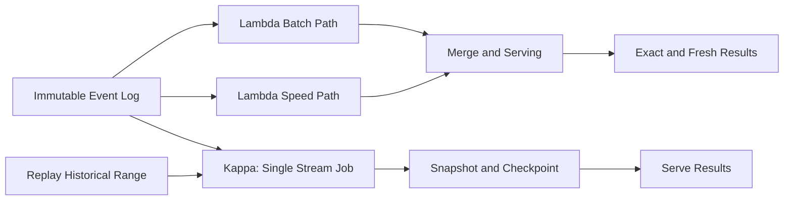

# MapReduce, Lambda, and Kappa

## 1. One-Line Definition
MapReduce is the programming model that tamed distributed batch computation (split, map, shuffle, reduce over many machines), while the Lambda and Kappa architectures are the two shapes for combining batch and streaming paths — Lambda runs both and merges, Kappa runs one replayable stream and treats reprocessing as replay.

## 2. Why Do We Need It?
Single machines cannot compute over petabytes — you must spread the work across thousands of machines, but spreading work is a minefield of partitioning, fault tolerance, and aggregation. MapReduce hid that maze behind a simple map/reduce abstraction and made giant batch jobs feasible and retryable; it is the ancestor of every modern distributed engine (Spark, Flink, Hive). Batch and streaming then grew apart, and teams hit the second problem: a real pipeline often needs *both* exact historical results and fresh live results, and nobody wants to write the derivation logic twice. Lambda and Kappa are the two honest answers to "build me one system that returns both exact and current," and interviewers use them to test whether you can trade simplicity against operational cost rather than just recite toys.

## 3. Simple Intuition
Counting word frequencies across every page in a city's library. MapReduce: every aisle gets a volunteer who reads each book and writes a sticky note for every word (map); a central sorting table bundles identical words (shuffle); tally clerks sum each bundle (reduce) into the final count. Fault tolerance is "any volunteer who breaks mid-book is replaced and re-reads only their aisle." Lambda: you run the overnight census (batch) for exact totals, and also have live counters on the circulation desk (stream) for today's number — two systems, two sets of books, merged at the report. Kappa: you digitize everything and, when you want "yesterday's exact," you replay yesterday's tape through the same live counter pipeline — one system, replay as the batch.

## 4. What Happens Without It?
Without MapReduce-style thinking, a petabyte job either runs single-threaded for never, or you hand-build distributed shuffles that silently corrupt under node failure. And without an architecture for batch+stream (Lambda/Kappa), product teams who need both pay the hidden tax: two teams maintain two derivations of the same logic, they drift, and the "fresh" number and the "official" number disagree forever — the reconciliation problem from [[batch-vs-stream-processing|Batch vs Stream Processing]] becomes a standing incident. There is a real cost to ignoring this: every duplicate/divergent pipeline is an accounting or trust incident waiting to happen.

## 5. Core Idea
- **MapReduce:** a *deterministic* two-phase model. Map runs a pure function over each input record → emits (key, value) pairs; the shuffle groups all pairs by key (the expensive network step); Reduce runs a function over each key's values to emit final output. Determinism + immutability = rerun-to-recover. Write-skew: it fits clean problems (counts, sorts, index builds, joins); it is clumsy for iterative and graph workloads (Spark, with in-memory RDDs and iterative programs, grew directly out of this pain).
- **Lambda:** batch path computes the complete, exact result; speed path computes approximate, fresh results; a merge layer reconciles (batch overwrites speed layer). The deal: *exact + fresh* in one product — at the cost of writing and maintaining *two* implementations of the same logic, plus a merge reconciler. Correctness falls out of the batch layer; the speed layer is throwaway-precise.
- **Kappa:** eliminate the batch layer entirely — everything is a stream, and "batch" is achieved by *replaying the log* through the same streaming job to recompute any state or table. One codebase, no merge logic, and reprocessing is a first-class operation (as long as you can replay — which is bound by log retention/[[kafka-retention|Kafka Retention]] and the ability to snapshot state). The deal: one pipeline, replay-as-batch — at the cost of requiring unbounded-enough replay and streaming-grade tooling for everything.
- **The shared truth:** both rely on *immutable, replayable logs* as the single source of events (see [[kafka-architecture|Kafka Architecture]]); Lambda materializes two derivations, Kappa one derivation replayed.
- **Modern position:** today's engines (Spark Structured Streaming, Flink) unify batch and stream in *one API* — the practical death of the "two codebases" Lambda tax; the Lambda-vs-Kappa framing now mostly decides data semantics and replay strategy rather than programming effort.

## 6. Important Terminology

| Term | Simple Meaning |
|------|----------------|
| Map | Pure per-record function emitting (key, value) pairs |
| Shuffle | Network regroup of all values under the same key |
| Reduce | Aggregate over one key's grouped values |
| Split | The chunking of input a worker owns and can restart |
| RDD | Spark's immutable, partitioned dataset abstraction |
| Batch layer | Lambda's complete, exact, slowly-updated path |
| Speed layer | Lambda's approximate, fast, streaming path |
| Serving layer | Stores that merge/combine batch + speed results |
| Replay | Re-processing a historical range of the log |
| Checkpoint | Snapshot of streaming state for recovery |
| Watermark | "No more events before this time" heuristic |
| Log compaction | Keeping the latest value per key instead of full history |

## 7. Basic Architecture



## 8. Request or Data Flow
1. **Shared truth:** producers append events to an immutable, replayable log (a Kafka topic or object-store partition range). Both architectures consume this same log.
2. **Lambda batch:** the batch job runs on a schedule over finished windows — complete, exact, deterministic; it rebuilds or replaces the "official" derived tables. Reruns reproject from the same log.
3. **Lambda speed:** a streaming job consumes the live tail, computes approximate windowed numbers, and writes interim tables; the serving layer lets users see fresh figures while batch is running.
4. **Merge:** the serving layer serves speed-layer numbers live and batch numbers when complete; a reconciliation step makes the official number authoritative — this merge is the part Lambda gets wrong operationally.
5. **Kappa:** only one streaming job exists; a state checkpoint tolerates crashes; to recompute anything "historically," the same code runs over a replayed log range with a fresh state — replay is the batch.

## 9. Practical Example
A ride-hailing platform needs both a "live revenue today" ops board and exact daily finance statements:
- **Lambda approach:** a Flink speed layer computes rolling 5-minute revenue (approximate); a nightly Spark batch recomputes the exact official revenue from the complete event log; the finance table is authoritative, the ops board is labeled provisional — two codebases, shared pricing/commission rules, racing to drift.
- **Kappa approach:** both needs become one streaming job with checkpointed state; "official yesterday" is produced by replaying yesterday's log range through the same job into a new state table; the ops board reads the live run, finance reads the replay's output — one codebase, replay-as-batch.
- The deciding question: 7-day log retention gives Kappa cheap replays; a 2-year audit horizon with tighter replay windows pushes toward Lambda-style exact recomputation of large history — retention is where the two genuinely part ways.

## 10. Scaling
- **MapReduce/batch scaling:** split the input across workers; scaling = more splits + more workers (the shared-nothing model: see [[horizontal-vs-vertical-scaling|Horizontal vs Vertical Scaling]]). The shuffle network step is the throughput bottleneck and usually the first thing to tune.
- **Stream scaling:** partitions are the unit of parallelism and ordering; state is keyed per partition, so rescaling means repartitioning state (see [[batch-vs-stream-processing|Batch vs Stream Processing]] and [[kafka-rebalancing|Kafka Rebalancing]]).
- **Lambda serving layer:** two writers (batch, speed) to one store → write amplification and merge contention; time-partitioned tables (date-partitioned) keep each layer's overwrite scope small.
- **Kappa replay:** the whole replayable-history question — scaling Kappa means sizing the log retention and replay bandwidth, not just the live processors.

## 11. Reliability and Failure Scenarios

| Failure | What Happens | Detection | Recovery | Trade-off |
|---------|--------------|-----------|----------|-----------|
| MapReduce worker dies | That split unprocessed | Task tracker / fault detection | Reschedule the split on another worker | Rerun partial work |
| Shuffle node hiccups | Reduced progress stalls | Stage metrics | Retry fetch; materialize intermediate | Extra disk/network |
| Batch job fails | Official output missing | Job status/alert | Rerun deterministically from the log | Rerun duration |
| Speed layer lags | Board stale | Freshness/watermark metric | Catch up from the tail; optional backfill | Freshness vs cost |
| Kappa state lost | Results reset | Checkpoint health | Replay from latest checkpoint or log start | Replay window/cost |
| Log retention expired | Can't replay further back | Retention policy audit | Archive to object storage; recompute tier | Replay depth vs storage |

## 12. Consistency and Correctness
- **MapReduce is determinism-by-construction:** pure map/reduce functions + immutable input = identical reruns; that is the whole reliability story and why it survived for decades.
- **Lambda correctness** lives in the batch layer; the speed layer is approximate by contract, so the merge must have an authoritative reconciliation step — "which table does the CFO trust" must be settled, or drift is inevitable (see [[batch-vs-stream-processing|Batch vs Stream Processing]] section on reconciliation).
- **Kappa correctness** is streaming correctness: windows, watermarks, checkpoint-and-replay, and idempotent sinks deliver the exactly-once effect (see [[delivery-semantics|Delivery Semantics]]). Late data triggers recomputation of affected state — replay makes "recompute everything" a normal move.
- Both depend on *immutable logs*: never mutate an already-written event; correct by appending a new event — replay semantics break if history changes under the reader.

## 13. Performance
- **Map shuffle is the memory wall:** grouping by key across machines is network-bound; hash-partition smartly, minimize the shuffle payload (map-side combine), and consider range/bucket optimizations before buying more nodes.
- **Lambda:** two full derivations of the same data = ~2x compute and storage for the same output; the speed layer front-rolls freshness at small latency; the batch layer dominates cost and windows.
- **Kappa:** one derivation to store, but every historical replay re-runs the logic — replay throughput is the real capacity metric; snapshots/checkpoints cut replay cost sharply (replay from latest snapshot, not log start).
- **Serving layer:** both architectures end at a speed-of-read store; columnar layouts and materialized views carry it over the finish line (see [[oltp-vs-olap|OLTP vs OLAP]]).

## 14. Security
- Job code runs with cluster privileges — that is remote-code-excecution-by-design: gate job submission (auth + approval), least-privilege service accounts, and signed artifacts (see [[authentication-vs-authorization|Authentication vs Authorization]]).
- Immutable logs are a compliance goldmine but also a liability: retention and purge controls for PII/audited data must be explicit (enforced via log compaction/archival + object-store lifecycle (see [[encryption-and-keys|Encryption and Keys]])).
- Derived tables are derived from sensitive raw data — scope access at the serving layer; do not give the dashboard the raw event stream's credentials.

## 15. Trade-Offs

| Choice | Advantages | Disadvantages | When to Use |
|--------|------------|---------------|-------------|
| MapReduce | Deterministic, batch-scale, fault-tolerant | No streaming, shuffle-bound, awkward iterative jobs | Clean bounded computations, index/report builds |
| Lambda | Exact + fresh, each side simple | Two codebases, merge/reconciliation burden | Teams with a hard exact+live requirement |
| Kappa | One codebase, replay-as-batch | Stream-grade everywhere, replay/retention costs | Log-centric orgs with replayable history |
| Unifield engines (Spark Structured, Flink) | One API for batch+stream | Semantic sharp edges (windows vs exact) | The pragmatic modern default |

## 16. Common Mistakes
- Standing up Lambda strictly from the book and letting the "stable" batch and "throwaway" speed layers both become permanent, divergent products — drift and double-maintenance are the norm.
- Replaying a Kappa job from log start on every redeploy instead of checkpointing — throughput collapses for no correctness gain.
- Writing map functions with hidden side effects (external DB lookups), destroying MapReduce determinism.
- Choosing Kappa without a retention/archival answer for the historical replay you claimed you'd support.
- Copying the "shuffle" network pattern blindly (shuffle-heavy) when a broadcast join avoids the network entirely.

## 17. HLD vs LLD Boundary
HLD: choose MapReduce-batch vs streaming vs unified engines, decide Lambda two-path vs Kappa replay, define the merge/reconciliation semantics, set retention that bounds replay, and lay out the serving layer. LLD: the map/reduce functions, the window/watermark configuration, the checkpoint interval, partition/hash function choices, table schemas, and the merge SQL.

## 18. Interview Questions

### Beginner
- Walk map-reduce-shuffle-reduce on "count unique visitors per page."
- Why is determinism the key property that makes MapReduce reliable?

### Intermediate
- Lambda vs Kappa: same company, a leaderboard that must be fresh, and an audit that must be exact. Which shape and where does the merge live?
- A Kappa replay of two months exceeds your log retention. What is your plan?

### Advanced
- A shopping site with session definitions that only data science can pin down needs both live dashboards and exact attribution. Design the pipeline and say where the reconciliation contract must live.
- Your listing says "exactly-once" and you run Spark micro-batch. Trace exactly where the exactly-once effect is produced and what breaks it.

## 19. Interview Memory Summary

> [!abstract]- Interview Memory Summary
> ### Remember
> - MapReduce = split, map, shuffle, reduce: deterministic, batch-scale, rerun-to-recover.
> - Lambda = batch (exact) + speed (fresh) + merge. Cost: two codebases and a reconciler.
> - Kappa = one streaming pipeline, replay-as-batch. Cost: replayable retention + stream-grade everywhere.
> - Both rest on an immutable, replayable event log.
> - Correctness: batch determinism for MapReduce; watermarks+checkpoints+idempotency for streams.
> - Modern engines unify batch/stream in one API — the architecture question is now semantics and replay.
> - Retention decides Kappa feasibility; reconciliation decides Lambda trust.

> ### 30-Second Explanation
> MapReduce is the timeless recipe: a pure map function over splits, a network shuffle grouping by key, and a reduce aggregating each key — deterministic enough that failures just rerun a split. Lambda materializes the same truth twice — a slow exact batch layer and a fast approximate speed layer — and merges them, paying double code and reconciliation. Kappa drops the second store: one replayable stream and checkpointed state, where reprocessing history is replay, bounded by log retention. Immutable logs are the foundation either way.

> ### Interview Traps
> - Presenting Lambda as modern and "two systems = bad" without acknowledging its exact+fresh payoff.
> - Forgetting that Kappa's replay is limited by retention and needs an archival answer.
> - Promising stream exactly-once without naming the idempotent sink / dedup mechanism.
> - Describing MapReduce as obsolete — every big batch engine still walks splits/shuffle/reduce.

> ### Key Trade-Off
> Lambda buys exact-plus-fresh at double implementation and reconciliation cost; Kappa buys one codebase and replay-as-batch at the price of retention-bound replay and stream-grade semantics for everything.

## 20. Related Concepts

### Prerequisites
- [[batch-vs-stream-processing|Batch vs Stream Processing]]
- [[kafka-retention|Kafka Retention]]
- [[delivery-semantics|Delivery Semantics]]

### Commonly Used Together
- [[kafka-architecture|Kafka Architecture]] (the immutable log both architectures consume)
- [[data-warehouse-lake|Data Warehouse and Data Lake]] (the serving/storage layer)
- [[oltp-vs-olap|OLTP vs OLAP]] (derived analytic tables at the end)
- [[consumer-lag|Consumer Lag]], [[kafka-rebalancing|Kafka Rebalancing]]

### Alternatives
- [[event-driven-architecture|Event-Driven Architecture]] (per-event reaction, no "batch" concept at all)
- [[message-queue|Message Queue]] patterns when a simple pipeline suffices

### Advanced Concepts
- [[strong-vs-eventual-consistency|Strong vs Eventual Consistency]] (what replay/merge can and cannot achieve)
- [[probabilistic-data-structures|Probabilistic Data Structures]] (the speed layer's approximation toolbox)

Related planned topics (not authored yet): shuffle internals, stream-processing checkpoint detail, unified-engine semantics.

## 21. References
Dean and Ghemawat, "MapReduce: Simplified Data Processing on Large Clusters" (2004) — the original paper. Kreps, "Questioning the Lambda Architecture" (2014) — the Kappa position. Marz and Warren, "Big Data: Principles and Best Practices of Scalable Realtime Data Systems" (2015) — Lambda's definition. Verify framework semantics against current Flink/Spark docs before interviews.

## 22. Active Recall

Test yourself before revealing each answer.

> [!question]- What makes a MapReduce job recoverable from any worker failure?
> Determinism plus split-ownership: input is split into immutable chunks, map/reduce are pure functions, so a failed worker's split can be rerun on another worker and the output is provably the same. Recovery is "restart the split," not "rebuild the world."

> [!question]- When does Lambda's merge actually fight you?
> In the serving layer: batch writes complete-table truth while speed writes interim estimates to the same tables; without an explicit reconciliation step one layer shadows the other and the two outputs drift. The merge is the contract that decides which table the business trusts — design it, or the disagreement becomes a recurring incident.

> [!question]- Kappa claims "one pipeline." Where does the batch actually hide?
> In replay: "yesterday's official numbers" are produced by replaying yesterday's log range through the streaming job into a fresh state/table — replay *is* the batch. So Kappa's hidden cost is replayable retention and replay bandwidth; retention caps how far back your "batch" can reach (see [[kafka-retention|Kafka Retention]]).

> [!question]- Exactly-once in a streaming Kappa-style pipeline: where exactly does it come from?
> From three mechanical parts: 1) upstream dedup/at-least-once delivery; 2) checkpointed state so recovery resumes precisely; 3) idempotent sinks with atomic versioned writes. Together they make the observable effect indistinguishable from processing each event once — retries happen, results don't duplicate ([[delivery-semantics|Delivery Semantics]]).

> [!question]- Your Kappa replay of two months crosses log retention. What are the options?
> 1) Increase retention or archive the log to object storage and replay from archive; 2) snapshot/checkpoint state at the boundary so replay starts from the latest snapshot, not log start; 3) admit the workload needs a Lambda-style exact batch layer over a separate durable dataset. Retention reach is exactly the Kappa-vs-Lambda switch argument.

> [!question]- Why are modern unified engines (Spark Structured Streaming, Flink) eroding the Lambda-vs-Kappa decision?
> They express batch and stream in one API, so the "two codebases" Lambda tax collapses — the decision shifts from programming effort to *semantics*: unified engines still choose batch-exact vs stream-approximate behavior per window, and replay/retention still decide Kappa feasibility. The architecture question became a data-semantics and ops question, not a development-question.

> [!question]- Interview scenario: "live session analytics plus exact refund attribution." Which shape and why?
> Kappa-shaped: session windows live in a Flink-style streaming job (fresh); the same job replayed over the completed day produces exact refund attribution; retention sized to replay need (or archived). Use Lambda only if the exact path is so historical/irregular that replay is impractical — where retention genuinely binds. One version of logic, checkpointed, replayed for exactness.

## 23. When Should I Use This?

### Use it when
- You have clean, generic, batch-friendly computations at huge scale (counts, sorts, joins, index builds) — MapReduce-model engines are the proven tool.
- The product genuinely needs *both* fresh and exact results — Lambda's exact-fresh shape or a unified batch+stream engine.
- Your organization is log-centric and retention is affordable — Kappa's replay-as-batch stays honest.
- Reprocessing and audits are normal operations (rerun/replay must be first-class, not scary).

### Avoid it when
- Freshness and exactness are both cosmetic — one tier of processing suffices; two is waste.
- Retention is too short to support the replay you'd promise under Kappa.
- The problem reads per-event and transactional, not aggregate — that is [[event-driven-architecture|Event-Driven Architecture]], not a big-data shape.
- The team cannot maintain two derivations (Lambda) — drift will make the doubled logic worse than either tier alone.

### What problem does it solve?
Making huge, correct, distributable batch computation possible (MapReduce), and making "both fresh and exact" achievable — either by running both derivations and reconciling (Lambda) or by replaying one pipeline (Kappa).

### What problem does it NOT solve?
Streaming correctness for free (windows/watermarks/checkpoints are still yours), or per-record business logic (aggregate-shaped architectures do not do transactions). And Kappa cannot outrun retention — replay is only as deep as the log you kept.

## 24. Decision Connections

Decisions that go together with MapReduce/Lambda/Kappa:

- [[batch-vs-stream-processing|Batch vs Stream Processing]] — the parent trade both shapes optimize.
- [[kafka-architecture|Kafka Architecture]] / [[kafka-retention|Kafka Retention]] — the immutable log that makes replay semantics exist at all.
- [[delivery-semantics|Delivery Semantics]] — the guarantee the speed/Kappa layer must actually deliver.
- [[data-warehouse-lake|Data Warehouse and Data Lake]] — where their outputs live and get governed.
- [[oltp-vs-olap|OLTP vs OLAP]] — why the serving layer is analytic-store shaped, not transactional.
- [[probabilistic-data-structures|Probabilistic Data Structures]] — the speed layer's approximation toolkit.
- [[observability|Observability]] — job status, watermark lag, and reconciliation diffs run both architectures.
- [[reliability|Reliability]] / [[retry-and-timeout|Retry and Timeout]] — rerun and replay are reliability designs, not accidents.

Decision tree:

```
Compute over a huge, event-shaped problem
    |
    +-- Bounded data, needs correctness, batch ok?
    |      → MapReduce-model engine, rerun-to-recover
    |
    +-- Need fresh AND exact?
    |      +-- Retention affordable, log-centric? → Kappa, replay-as-batch
    |      +-- Hard audit/replay constraints?     → Lambda, batch + speed
    |
    +-- One API, pragmatic default?
    |      → unified engine (Spark Structured / Flink):
    |         batch windows for exact, stream windows for fresh
    |
    +-- Per-event reactions, no aggregates?
           → [[event-driven-architecture|Event-Driven Architecture]], not big-data
```

