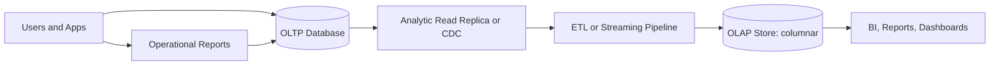

# OLTP vs OLAP

## 1. One-Line Definition
OLTP (online transaction processing) serves many small, low-latency read/write operations on current row-level data, while OLAP (online analytical processing) answers few but large, scan-heavy aggregate queries over historical data — and the two require fundamentally different storage, indexing, and consistency designs.

## 2. Why Do We Need It?
One database cannot be excellent at both jobs because the two shapes of work are physically opposed. OLTP visits one row at a time: a checkout updates an order and decrements inventory — row-oriented storage, indexes tuned for point lookups, and ACID guarantees (see [[transactions-and-acid|Transactions and ACID]]). OLAP reads the whole table to answer "revenue by region last quarter" — columnar storage where only the needed columns are read, and no point-lookup index matters. If you run OLAP queries against an OLTP engine, you burn OLTP's CPU, lock rows real transactions need, and take minutes on what a columnar store does in seconds. The separation is a core data-layer decision: where does transactional serving live, and where does analysis read (see [[data-warehouse-lake|Data Warehouse and Data Lake]]).

## 3. Simple Intuition
A retail store's cash register and its accountant. The register handles thousands of tiny, fast operations — ring up one item, take payment, hand over change — and must record each perfectly. The accountant occasionally demands one giant question — "total sales by category over five years" — and can wait half an hour for the answer because the whole set of receipts is scanned. Give the accountant's job to the cash register and the queue of customers grinds to a halt. Different tools evolved for the same receipts: the register is OLTP, the accountant's ledger is OLAP.

## 4. What Happens Without It?
Analytics run directly on the transactional database. Query "sum of all orders by month since 2021" scans tens of millions of rows, hammering CPU and I/O, contending for locks with live checkouts — p95 transaction latency balloons and you get a site slowdown every time finance runs a report. Indexes optimized for point lookups offer no help (an index only helps when you know the key; analytics don't). Meanwhile, if you tried to serve transactions from an analytic store, every single-row update would be grossly inefficient. Without the split, both workloads degrade — that is why the split exists.

## 5. Core Idea
- **Row-oriented vs column-oriented storage:** OLTP tables store a row's columns together (one disk block = one row = a fast point read and fast update). OLAP stores a column's values together (one block = thousands of values of one column = fast aggregation over just the needed columns, skipping the rest). This one choice drives 10-100x differences on the "wrong" workload.
- **Index philosophy:** OLTP indexes speed up exact-key lookups (B-tree) and range scans; OLAP engines get their speed from columnar layout, compression, and partition pruning — a lookup index on a warehouse is mostly a performance footnote.
- **Access patterns:** OLTP = INSERT/UPDATE/DELETE + point SELECT per transaction; OLAP = big columnar SELECTs with GROUP BY / JOIN / window functions; write-volume tiny relative to read-volume of scans.
- **Consistency:** OLTP needs ACID, isolation, and immediate visibility of the last write. OLAP is a snapshot/historical read model — late data and batch-loaded tables with eventual visibility are the norm (see [[strong-vs-eventual-consistency|Strong vs Eventual Consistency]] for the framing).
- **Schema shape:** OLTP normalizes to avoid update anomalies; OLAP denormalizes into star schemas so joins stay few and scans stay wide ([[normalization-vs-denormalization|Normalization vs Denormalization]]).
- **Freshness:** OLTP is live; OLAP is as fresh as the pipeline (ETL/ELT, CDC streaming) that feeds it — minutes to a day is normal.

## 6. Important Terminology

| Term | Simple Meaning |
|------|----------------|
| OLTP | Online transaction processing — row-level, low-latency, ACID |
| OLAP | Online analytical processing — scan-heavy aggregate queries |
| Row store | Data stored one row at a time |
| Column store | Data stored one column at a time |
| Fact table | The central transactional measure table in a star schema |
| Dimension table | The descriptive side table (product, time, region) |
| Star schema | One fact table connected to dimensions |
| Materialized view | A precomputed aggregate stored as a table |
| Columnar compression | Compressing like-values in a column; huge per-column wins |
| Partition pruning | Skipping entire partition folders outside the WHERE range |
| Write amplification | Extra writes caused by append/storage structure |
| CDC | Change data capture — piping OLTP changes into OLAP (streaming ETL) |

## 7. Basic Architecture



## 8. Request or Data Flow
1. **Transactional flow:** a checkout POST → the OLTP engine executes a point lookup on order id, updates order + inventory in one transaction, applies isolation and durability — commit in single-digit milliseconds.
2. **Extraction:** changes propagate out of the OLTP store — CDC reads the transaction log (streaming via [[kafka-producers-consumers|Kafka Producers and Consumers]]) or periodic batch snapshots.
3. **Transformation/loading:** the pipeline cleans and reshapes into the OLAP schema (ETL/ELT), appending or upserting to the columnar store.
4. **Analytical flow:** a BI tool asks "revenue by region and month, last 4 years" → the OLAP engine scans the two needed columns' partitions, aggregates, and returns in seconds/minutes — without touching the live transactional store.

## 9. Practical Example
E-commerce with 2M orders/day:
- **OLTP:** order, payment, inventory tables in the transactional DB — 500M rows, row-oriented, B-tree indexes on order/user; 10k transactions/s peak, p99 under 50 ms.
- **Pipeline:** change-data-capture streams order events into a warehouse ([[data-warehouse-lake|Data Warehouse and Data Lake]]); a nightly job also refreshes dimensions.
- **OLAP:** the columnar warehouse stores 2 years of deliveries (1.4B rows) partitioned by month and clustered by region; the revenue dashboard scans just `revenue_amount` + `region` columns of the relevant month-partitions.
- **The point:** the query that would scan 1.4B rows against the OLTP store while shoppers used it now runs against the columnar store in seconds, and shoppers in the row store feel nothing.

## 10. Scaling
- **OLTP scales by sharding/replication:** shard by the access key for write capacity; replicas for read QPS (see [[sharding|Sharding]] and [[database-replication|Database Replication]]).
- **OLAP scales by compute-storage separation:** query engines scale out workers on demand; storage lives independent in object storage — adding query power doesn't require moving data.
- **OLAP file layout is the scaling lever:** partition keys (date, tenant) plus clustering/bucketing drive pruning; a bad partition key is the OLAP equivalent of a bad [[shard-key|Shard Key]] — every query pays for it.
- **Concurrency:** BI dashboards hammering the same tables → materialized views and result caching (the warehouse's [[caching|Caching]]).
- **Freshness vs isolation:** a nightly reload competes with live dashboard queries — separate load traffic, and use append/overwrite-by-partition to keep the overlap small.

## 11. Reliability and Failure Scenarios

| Failure | What Happens | Detection | Recovery | Trade-off |
|---------|--------------|-----------|----------|-----------|
| OLTP DB down | Transactions stop | Health checks | Failover to replica (see [[failover|Failover]]) | RPO/RTO window |
| CDC pipeline lags | OLAP stale | Freshness watermark | Backfill from log/DB | Freshness vs cost |
| OLAP load corrupt | Wrong dashboard numbers | Quality checks | Rerun idempotent load from source | Reprocessing cost |
| OLAP nodes die | Queries fail | Cluster health | Resumes from independent storage, no data loss | Query downtime only |
| Replica lags OLTP | Reports stale | Replication lag metrics | Wait/flush; use fresh replica | Fresh reads vs consistency |

## 12. Consistency and Correctness
- **OLTP** = strong, immediate consistency within a transaction — the last write is visible to the next read (by the app or with appropriate isolation level); that is the contract ([[transactions-and-acid|Transactions and ACID]]).
- **OLAP** = eventual, snapshot-consistent — reads see whatever the last completed load produced; late data arrives with the next batch/stream cycle. It is a read model derived from OLTP, never the source of truth.
- **The join between the two:** a dashboard may briefly disagree with a just-committed OLTP row — the freshness lag is a designed property, not a bug; set explicit SLAs per reporting tier.
- **Idempotency in the middle:** ETL/ELT loads must be rerunnable without double-counting (overwrite-by-partition, dedup keys) — pipeline retries otherwise corrupt the OLAP read model.

## 13. Performance
- **Point lookups:** row store wins (one block read); column store on point lookups is awkward (many column blocks per row reconstructed).
- **Aggregation scans:** column store wins decisively — reads only `amount`, `region` columns, compresses like-values, often 10-100x fewer bytes than the row-equivalent.
- **Updates:** row store supports in-place updates; column store treats updates as inserts/rewrites — update-heavy OLAP is a design smell.
- **Latency target:** OLTP = ms, per-row; OLAP = seconds-to-minutes, per-query, over whole relations. Same hardware, opposite goals — remember this when someone asks to "just add an index" to fix an OLAP query.

## 14. Security
- OLTP carries live PII and payment data — least-privilege app roles, per-row/column authorization where compliance demands it, and audit of access (see [[authentication-vs-authorization|Authentication vs Authorization]]).
- OLAP aggregates can still leak: low-cardinality "aggregates" with filters can identify individuals (differential-privacy-grade caution when raw browsing access is granted).
- The ETL/CDC path is a copy pipeline — encrypt it in transit and at rest in both stores and grant analysts the minimal warehouse scope, never the raw OLTP connection ([[encryption-and-keys|Encryption and Keys]]).

## 15. Trade-Offs

| Choice | Advantages | Disadvantages | When to Use |
|--------|------------|---------------|-------------|
| Row store / OLTP | Fast point ops, ACID, natural updates | Useless for big scans | Serving, operations |
| Column store / OLAP | Huge scan efficiency, compression | Awkward updates, slow point ops | Analytics, BI |
| Analytic read replica | Simple, no ETL pipeline | Limited to OLTP-query shapes | Small analytics needs |
| Streaming CDC into OLAP | Minutes-fresh analytics | Pipeline complexity, backfill care | Fresh dashboards |
| Batch ETL into OLAP | Simple, deterministic, cheap | Day-of staleness | Most classic reporting |
| True hybrid engines | One store for both | Compromises on both extremes | Special niches only |

## 16. Common Mistakes
- Running analytical queries against the production OLTP DB "temporarily" — it becomes the standing performance incident.
- Expecting indexes to fix OLAP: an index helps at a known key; scans don't have one — columnar layout is the answer.
- Designing OLAP reads as if they were OLTP upserts — warehouse stores are append/overwrite-by-partition, not row update heroes.
- Forgetting the freshness contract: a dashboard reading a nightly-loaded table presented as live data misleads decision-makers.
- Normalizing the warehouse into OLTP-shaped schemas — star schemas and denormalization exist for a reason ([[normalization-vs-denormalization|Normalization vs Denormalization]]).

## 17. HLD vs LLD Boundary
HLD: split the workloads and route traffic correctly, pick row vs columnar stores, decide CDC vs batch freshness, and set the consistency/freshness contract between the two. LLD: the actual DDL (indexes on the OLTP side, partition keys on the OLAP side), transform SQL in the pipeline, and the materialized-view definitions.

## 18. Interview Questions

### Beginner
- Give the defining difference between a row store and a column store.
- Why is an index useless for an aggregation that scans the whole table?

### Intermediate
- Your BI tool is slow and it queries the production DB. What do you change structurally?
- A nightly-loaded dashboard misleads a VP; the data was 23 hours old. Trace what went wrong and fix it.

### Advanced
- Design a 5-minute-fresh analytics layer with streaming CDC for an order platform without disturbing OLTP latency.
- When would a single engine genuinely serve both workloads, and what does it give up?

## 19. Interview Memory Summary

> [!abstract]- Interview Memory Summary
> ### Remember
> - OLTP: many tiny row-level ops, ACID, ms latency; OLAP: few huge full-relation aggregate scans.
> - Row store = one row per block, fast point work; column store = one column per block, fast scans.
> - Put analytics on a columnar OLAP store fed by CDC/ETL — never run them on the OLTP DB.
> - OLTP is strong/current; OLAP is eventual/derived — freshness is a designed SLA.
> - Star schemas and denormalization are the OLAP shape; normalization is the OLTP shape.
> - Physical layout (partition/cluster keys) is the OLAP scaling lever, like shard keys for OLTP.
> - Loads into OLAP must be idempotent or retries double-count.

> ### 30-Second Explanation
> OLTP serves a checkout: one row, a few columns, a transaction, millisecond latency — row-oriented storage with point-lookup indexes. OLAP answers "revenue by region last quarter": scan the `amount` and `region` columns across partitions — columnar storage, compression, and pruning do the work. Changes flow from OLTP to OLAP through CDC or batch ETL, so analytics reads a derived, eventually-fresh snapshot instead of grinding the live store. Same data, opposite physics — split them on purpose.

> ### Interview Traps
> - Suggesting "just add an index" for a full-scan aggregation.
> - Promising live freshness on a nightly-loaded warehouse table.
> - Normalizing the warehouse as if it were OLTP.
> - Treating OLAP as the source of truth instead of a derived read model.

> ### Key Trade-Off
> You accept the operational cost of a second, columnar, eventually-consistent store plus a pipeline to keep it filled, in exchange for keeping the transactional store fast and letting analytic scans run 10-100x faster without touching a transaction.

## 20. Related Concepts

### Prerequisites
- [[transactions-and-acid|Transactions and ACID]]
- [[database-indexing|Database Indexing]]
- [[normalization-vs-denormalization|Normalization vs Denormalization]]

### Commonly Used Together
- [[data-warehouse-lake|Data Warehouse and Data Lake]]
- [[batch-vs-stream-processing|Batch vs Stream Processing]]
- [[kafka-producers-consumers|Kafka Producers and Consumers]] (CDC path)
- [[database-replication|Database Replication]] (analytic read replicas)

### Alternatives
- [[elasticsearch|Elasticsearch]] (aggregation-shaped analytics that want search, not warehouse SQL)
- [[sql-vs-nosql|SQL vs NoSQL]] (when the workload is neither strictly transactional nor analytic)

### Advanced Concepts
- [[strong-vs-eventual-consistency|Strong vs Eventual Consistency]]
- [[probabilistic-data-structures|Probabilistic Data Structures]]

Related planned topics (not authored yet): columnar storage internals, star-schema modeling, CDC connectors deep-dive.

## 21. References
Kleppmann, "Designing Data-Intensive Applications," ch. 3, "Transaction Processing or Analytics" — the canonical OLTP/OLAP treatment. Chaudhuri and Dayal, "An Overview of Data Warehousing and OLAP Technology" (1997) — classic survey. Verify engine-specific layout claims against current documentation before interviews.

## 22. Active Recall

Test yourself before revealing each answer.

> [!question]- What kills row-oriented storage on an aggregate query?
> The aggregate needs only a few columns but a row store reads whole rows (all columns) for every row it touches — tens of extra bytes fetched per useful byte, and no compression win since values interleave. Columnar storage reads just the needed columns, compresses like-values, and skips the rest — the 10-100x.

> [!question]- Why doesn't a B-tree index on "region" fix a "sum by region across all rows" query?
> An index accelerates locating rows at a known key. An unfiltered aggregation visits every row in the table — that's a full scan regardless, and row-major storage still reads all columns per row. Indexes accelerate point lookups; columnar layout accelerates scans. Different workloads, different mechanisms.

> [!question]- The analytics dashboard reads from the production OLTP DB. Walk the structural fix.
> 1. Separate the workloads: point OLTP ops stay on the row store.
> 2. Stand up/reuse an OLAP columnar store.
> 3. Feed it via CDC (streaming, minutes-fresh) or scheduled ETL (batch, daily-appropriate), not by delegating dashboard queries to the OLTP engine.
> 4. Set a freshness SLA, and materialize heavy aggregates so dashboards don't rerun any pipeline joins.

> [!question]- What is the freshness contract between OLTP and OLAP, and why is it designed rather than accidental?
> OLTP commits and reads the current state immediately. OLAP sees what the last completed load produced — the lag is batch frequency or CDC latency, deliberately chosen. The contract is explicit SLAs per reporting tier (monthly reports tolerate a day; ops dashboards need minutes); a table presented as live when loaded nightly is a design bug, not a fact of life.

> [!question]- Double-count risk: the ETL job retried. Where does duplicate revenue come from, and what prevents it?
> A non-idempotent load appends the same rows again on retry, so "sales" doubles. Prevention is structural: load overwrites whole partitions that were already loaded (overwrite-by-partition), or upserts on business keys, so reprocessing the same source range replaces rather than adds.

> [!question]- Why are warehouse tables denormalized when OLTP tables are normalized?
> OLTP normalizes so an update happens in one place with no anomaly — anomaly-prevention trades joins for correctness. OLAP wants few, wide joins: a star schema with facts + dimensions means aggregations stay cheap and scans stay scan-centric. Update anomalies are irrelevant because warehouse data is append/overwrite, not updated. See [[normalization-vs-denormalization|Normalization vs Denormalization]].

> [!question]- Interview scenario: "5-minute-fresh revenue dashboards without touching the checkout DB." Sketch the design.
> 1. CDC reads the OLTP transaction log (a Kafka pipeline that never queries the DB).
> 2. Streaming transforms land into the columnar warehouse's aggregation tables (materialized).
> 3. Dashboards read warehouse partitions; nightly batch reconciles the streaming numbers to exact figures.
> 4. OLTP latency remains untouched because analytics never touch the transaction store.

## 23. When Should I Use This?

### Use it when
- Both transactional serving and analytical querying exist in one product — separate them.
- Queries aggregate large fractions of the data (reporting, dashboards, BI).
- You need historical, cross-subject, long-window answers — OLAP's natural territory.
- The volume justifies pipeline infrastructure (CDC or ETL) to keep the analytic store fed.

### Avoid it when
- The workload is only tiny, keyed lookups — OLTP alone is right.
- Analytics are ad-hoc over tiny data — a replica or in-memory scan is simpler than a warehouse.
- You have no staffing for the pipeline — a fed-with-nobody OLAP store silently rots.

### What problem does it solve?
Resolving the conflict where analytics queries and live transactions fight for the same engine, by splitting them into fundamentally different stores — row/ACID for serving, columnar/derived for analysis — connected by a deliberate freshness pipeline.

### What problem does it NOT solve?
Real-time per-row reactions (event-driven serving), or search-flavored bounded aggregations (see [[elasticsearch|Elasticsearch]]), and it cannot make a pipeline-lagging read model "live" without adding the streaming infra to match ([[batch-vs-stream-processing|Batch vs Stream Processing]]).

## 24. Decision Connections

Decisions that go together with OLTP vs OLAP:

- [[transactions-and-acid|Transactions and ACID]] — the OLTP side's contract; the analytic side intentionally doesn't keep it.
- [[data-warehouse-lake|Data Warehouse and Data Lake]] — the OLAP store lands here, governed and layered.
- [[batch-vs-stream-processing|Batch vs Stream Processing]] — decides how fresh the OLAP copy is.
- [[normalization-vs-denormalization|Normalization vs Denormalization]] — OLTP normalize, OLAP denormalize; the shapes are workload-driven.
- [[database-replication|Database Replication]] — the cheap "replica for analytics reads" stepping stone before a real warehouse.
- [[sharding|Sharding]] — OLTP write scaling; the OLAP equivalent is compute-storage separation + partition keys.
- [[kafka-producers-consumers|Kafka Producers and Consumers]] — the CDC bridge with the transactional log.
- [[strong-vs-eventual-consistency|Strong vs Eventual Consistency]] — why OLAP is eventually consistent on purpose.

Decision tree:

```
A database serves both transactions and analytics
    |
    +-- Point lookups + updates dominate?
    |      → row store, keep ACID (OLTP engines)
    |
    +-- Whole-relation aggregate scans?
    |      → [[oltp-vs-olap|OLAP store, columnar]]
    |         |
    |         +-- Need minutes-fresh?     → CDC streaming path
    |         +-- Daily granularity ok?   → batch ETL path
    |         +-- Heavy repeated queries? → materialized views
    |
    +-- Both, in one product?
    |      → separate engines + pipeline (the norm)
    |
    +-- Neither clearly wins?
           → re-examine the query patterns before choosing
```

