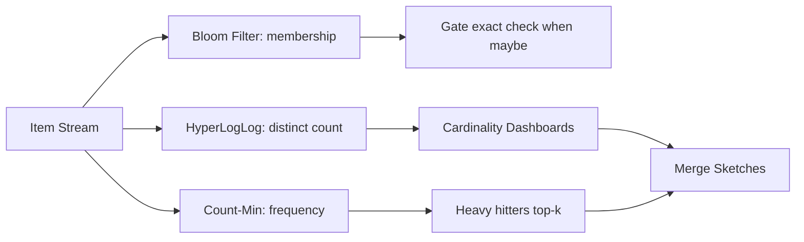

# Probabilistic Data Structures

## 1. One-Line Definition
Probabilistic data structures — Bloom filters, Count-Min Sketches, HyperLogLog, and their cousins — answer set-membership, frequency, and cardinality questions over enormous data in sub-linear memory, trading a tiny, controlled error rate (and sometimes false positives) for dramatically lower space than any exact structure.

## 2. Why Do We Need It?
Exact answers to "is x in set S," "how many times did x appear," and "how many distinct values are there" all cost space proportional to the data: a hash set of 1 billion items, a per-item counter, a full distinct list. At web scale (a billion URLs, a stream of 100k events/sec, a year of unique visitors), the exact structures cost gigabytes-to-terabytes and don't fit hot memory — but "does this URL exist in a gigabyte blocked list" or "roughly how many distinct search terms last month" only needs a yes-with-a-tiny-error or a cardinality within a couple percent. Probabilistic structures convert that allowance into space that fits in RAM: a Bloom filter can hold a billion-key set in ~1.2 GB with a 1% false-positive rate, HyperLogLog collapses a billion distinct values into ~1.5 KB, and Count-Min answers "how many times" with log-scale memory. Every big system — caches, dedup, cardinality dashboards, prefix checks, load-balancing — leans on them (see [[caching|Caching]] and [[autocomplete|Autocomplete]] in particular).

## 3. Simple Intuition
A high-school teacher deciding if a student has taken the intro course. Instead of a folder per student (memory), she keeps one wall of checkboxes: 10,000 boxes, each student's name hashes into 5 box positions, and she boxes them. A name is "definitely not in the folder" if any of its 5 boxes is empty — that is airtight, because every real student boxed *all* of their positions. If all 5 are boxed, the student *might* have taken the course (someone else's name could have boxed those slots first) — a small false-positive risk, no false negatives ever. The teacher's wall uses a tiny fraction of the memory the real folder would. Bloom filters are exactly this wall; HLL and Count-Min are smart cousins counting and averaging on the same idea: sample the space, bound the error.

## 4. What Happens Without It?
Memory and latency blow up, or correctness silently costs more than paying for it. Without a Bloom filter at the cache's "check if the key could exist" gate, every cache miss on a non-existent key falls through to a DB or engine lookup (the classic *cache penetration* attack/accident — see [[caching|Caching]]). Without HLL, a "distinct users today" dashboard either queries the full user table on every render or *stores every user id* per day in memory. Without Count-Min, "top items in this stream" boxes by materializing counters for every item, most of which are one-hit wonders. The grim alternative to all three: sampling-and-holding, which is wrong in the ways you can't control, or exact structures that don't fit.

## 5. Core Idea
- **Bloom filter — membership, false-positive only:** a bit array + k hash functions. Insert items by setting the k positions; check membership by testing the k positions — all set ⇒ "maybe," any unset ⇒ "definitely not." No false negatives, a tunable false-positive rate. Size ≈ m bits and k optimal-ish (m ≈ 1.44 × n × log2(1/p)); deletion is the problem → the counting/cuckoo variants add removals.
- **HyperLogLog — cardinality (distinct count):** estimate "how many distinct values" from the *longest run of leading zeros* seen across hashes — a rare long run implies many distinct items — combining several hash registers and merging them with a harmonic mean (the HLL sketch). Uses ~12-16 KB for estimates accurate to ~0.8-2% at *any* scale up to billions.
- **Count-Min Sketch — frequency estimation:** a matrix of counters; each item hashes to one cell per row and increments; an item's count = min over its cells (lower-bounded estimate, never a false negative on the *count* — it over-approximates). Supports "top-k / heavy hitters" by tracking a candidate heap against the estimate.
- **Cuckoo filter:** Bloom's delete-capable cousin (also false-positive-only) with better space and deletes; shown in interview answers that need "delete from a Bloom filter" — the counting-Bloom and cuckoo names are enough to prove depth.
- **Where the "error" lives:** false positives and frequency over-estimation are the accepted cost; the guarantee "no false negatives" is what makes them safe to gate exact systems — a Bloom-negative is a hard negative in every case.
- **They compose anywhere you'd hoard exact state:** cache gates, dedup-idempotency pre-checks, DB "existence" checks, stream heavy-hitter detection, cardinality dashboards, per-partition counting in [[batch-vs-stream-processing|Batch vs Stream Processing]] pipelines.

## 6. Important Terminology

| Term | Simple Meaning |
|------|----------------|
| False positive | "Item is present" when it is not (overflow) |
| False negative | "Item is absent" when it is present — Bloom filters never have these |
| Hash function | Maps an item to a (seemingly random) position/register |
| Bit array | The Bloom filter's raw storage (m bits) |
| k hashes | Number of positions each item touches (typical 5-11) |
| Optimal sizing | m ≈ 1.44n × log2(1/p): bits vs false-positive rate trade |
| Leading zeros | Prefix-count trick HLL uses to measure "cardinality" |
| Registers | HLL's small counters that record the leading-zeros max |
| Counter matrix | Count-Min's rows/columns of counters |
| Heavy hitters | The most frequent items in a stream (a Count-Min use) |
| Cuckoo filter | Delete-capable Bloom-like structure (false positives only) |
| Mergeability | Combining sketches (union) without rerunning the data |

## 7. Basic Architecture



## 8. Request or Data Flow
1. **Membership (Bloom):** a cache lookup for key X → hash X with the k functions → all k positions set? Then proceed to the exact layer (cache/DB) — X is "maybe" — else return "absent" immediately, skipping the expensive exact lookup. This is the cache-penetration gate.
2. **Distinct count (HLL):** each incoming event (e.g., visitor id) → one hash → find the register whose leading-zeros is highest → update; dashboards estimate distinct count from the registers, summing/merging registers across shards for the day's total.
3. **Frequency (Count-Min):** each item increments its cell in every row; to report "count of item Y," read the minimum across Y's cells (the never-under-over-estimate); top-k tracks a heap updated whenever the estimate passes the candidate floor.

## 9. Practical Example
A search engine's **cache-penetration + analytics** stack, 500M daily lookups:
- **Bloom filter upstream of cache:** 100M known-existing keys → a 120 MB Bloom at 1% false positives stops ~99% of non-existent-key lookups from ever reaching the cache/DB (see [[caching|Caching]] and [[autocomplete|Autocomplete]]).
- **HLL for "distinct users/day":** every visitor id heading to a 12-16 KB HLL register set; 8 shards' registers merge into a ~0.8-2% daily DAU estimate — the dashboard never materializes the user-id list at all.
- **Count-Min for "trending queries":** each typed query increments its cells; the heavy-hitter heap produces a live trending list; a check on a query with no heap entry reads its min-count directly.
- **The math:** all three structures together cost well under 200 MB on hot RAM; their exact equivalents (100M-key hashset + full daily-distinct lists + per-query counters) would cost tens of gigabytes and hourly maintenance.

## 10. Scaling
- **Merging is the scaling trick:** all three structures are *mergeable* — union two Bloom filters (bitwise OR), union HLL registers (element-wise max), add Count-Min matrices (cell-wise sum) — so shard the data, estimate locally, merge at read time. This is how [[batch-vs-stream-processing|Batch vs Stream Processing]] pipelines and multi-node caches stay cheap.
- **Sharding placement:** "which shard has my Bloom filter" is a routing decision like any distributed state ([[sharding|Sharding]]); replicate for read QPS, keep the sketch in-memory (it is small by definition) or on fast local disk.
- **Size for the future:** Bloom m is fixed at creation — growth in n raises false positives (you can create a second filter, not resize the first); preregister enough headroom or plan a rebuild.
- **Cardinality ceilings:** HLL registers saturate beyond their range at a guard level — for practical web scales that guard is astronomically high; still verify with your expected maximum.

## 11. Reliability and Failure Scenarios

| Failure | What Happens | Detection | Recovery | Trade-off |
|---------|--------------|-----------|----------|-----------|
| Sketch lost (node dies) | Gate/counts lost | Sketch health/checksum | Rebuild from replayable log (see [[kafka-retention|Kafka Retention]]) | Rebuild window |
| Bloom tuned too small | False-positive rate climbs | Sampled FP audit | Add second filter / rebuild | Extra memory |
| Sparse high-cardinality HLL bucket | Estimate wobble | Bucket-count metric | Merge to bigger register set | Estimation error |
| Count-Min overflow on hot key | Count loops the counter | Cell-saturation metric | Widen counters / reset epoch | Rare item precision |
| Sketch/service race | Interleaved reads | No checksum mismatch | Rebuild from exact source after backfill | Rebuild cost |

## 12. Consistency and Correctness
- **Correctness is bounded error, not luck:** you *design* the false-positive rate: Bloom p=0.01 defaults to "1% of 'maybe's spur a wasted exact check, zero negatives ever"; Count-Min never under-reports frequency; HLL is exact-merging-sketches + a proven estimator deviation (~1.04/√m).
- **No false negative is the contract:** a Bloom-negative or HLL-zero is a definitive absence in the sampled world — that is what makes them safe gates. Every "maybe" still goes to an exact layer.
- **Mergeability preserves correctness:** two merged sketches remain valid estimates for the union of their items; replaying a portion of stream into a sketch is atomic-append, so crash-recovery reuse the same guarantee: rebuild from the log, not by doubling existing false-positive-heavy estimates.
- **Idempotent inserts** (Count-Min increments per processed-and-deduplicated event) matter — double-processing an event doubles its counter; pair with the pipeline's [[delivery-semantics|Delivery Semantics]] story.

## 13. Performance
- **Space is the headline:** Bloom ~1.44n log2(1/p) bits; HLL ~12-16 KB for billions of distincts; Count-Min ~ (rows × cols × counter-bits) with error ε relative to the total frequency. Literal orders-of-magnitude under exact structures.
- **Time:** each operation costs k tiny hashes (Bloom), one hash + register update (HLL), c×d counter touches (Count-Min) — all O(k) or O(1) per item, millions of inserts/sec per core.
- **Merge cost:** bitwise ORs and cell-wise maxes are embarrassingly parallel — merging a day's shards is milliseconds-to-seconds, not a rerun.
- **Watch:** hashing quality matters — a bad hash (biased low bits) ruins HLL and empties Bloom pockets; use a good 64-bit hash and rely on the collision-resistance it was chosen for.

## 14. Security
- Sketches can leak: Bloom false positives and HLL totals do not expose item identities directly, but a tiny bucket in a richly-dimensioned HLL/Count-Min can single out an individual ("the 3 users who searched X") — treat such views like any PII aggregate and scope, mask, and audit them.
- A malicious client can amplify false positives: feeding a Bloom filter keys that share pockets inflates the FP rate — batch volume and verify honest-actor assumptions (see [[rate-limiter|Rate Limiter]] for one guard).
- Sketches are not encryption: bits and registers are readable — keep them inside the trusted service, keys hash-consistent with the same secret-hash policy as other derived data.

## 15. Trade-Offs

| Structure | Exact words wrong | Error type | Space for 1B items | Deletes |
|-----------|-------------------|------------|--------------------|---------|
| HashSet (exact) | Nothing | None | ~8-16 GB | Yes |
| Bloom filter | FP: "maybe" for absent | False positives only, tunable | ~1.2 GB at 1% | No (cuckoo/ counting variants) |
| Concise/HLL | ±1-3% distinct count | Two-sided estimate | ~12-16 KB | No |
| Count-Min | Frequency over-estimate | Over only | ε-relative ⇒ log | Resets |

## 16. Common Mistakes
- Tuning Bloom m to data that *grows* without headroom — FP rate silently climbs past the SLA.
- Using a Bloom where deletes are required and skipping to cuckoo/counting variants — then "delete 1" is wrong.
- Sizing HLL registers by daily cardinality fine but querying merged years of registers over the same register set — estimate error scales with range, not with total count.
- Feeding exact layers with False-Positive-without-check: forgetting a "maybe" must still gate to the exact store, then leaking missed items. (The gate is exact lookup on "maybe," always.)
- Hashing badly — home-grown hash yields biased registers and a sketch that "should have been fine."

## 17. HLD vs LLD Boundary
HLD: choose which questions to approximate (membership/cardinality/frequency), pick the structure + error budget for each, decide where in the path the gate sits, and set sketch rebuild/merge policy. LLD: the hash function choice, k/m sizing math, the register width, the exact seed/parameters in code, and the merge SQL/joins.

## 18. Interview Questions

### Beginner
- Why does a Bloom filter cost what it costs for a 1% false-positive target?
- What does "no false negatives" buy you as a cache gate?

### Intermediate
- Design the DAU dashboard for 100M users without ever storing the distinct list. Where does the error come from, and how wide can a register-set of 16 KB be?
- A Bloom filter that can delete keys: name two options and the trade off.

### Advanced
- You must count the top-50 heavy hitters in a 100k-events/sec stream with bounded memory. Design the structure and the exact handling of the "maybe-heavy" candidates.
- Cache penetration at a payment-validate endpoint: build the end-to-end defensive sketch plan and justify every error budget.

## 19. Interview Memory Summary

> [!abstract]- Interview Memory Summary
> ### Remember
> - Bloom: bit array + k hashes; "all set ⇒ maybe, any unset ⇒ no." False positives only.
> - HLL: ~12-16 KB distinct-count estimate to ~1% at billions — leading-zeros trick.
> - Count-Min: counter matrix, min over cells = never-under-estimated frequency.
> - Cuckoo/counting Bloom add deletes; the classic Bloom cannot.
> - Space wins are orders-of-magnitude; error budgets are designed, not accidents.
> - Mergeable sketches = shard + merge: the scaling superpower.
> - Rebuild from the log after sketch loss — replayability decides recovery.

> ### 30-Second Explanation
> Bloom filters answer "membership" in a bit array: k hashes map an item to k bits; if any bit is unset, it is definitely absent — a safe negative gate that stops cache/DB penetration with ~1.4n bits. HyperLogLog estimates distinct counts from the longest leading-zero runs across hash registers (~16 KB for 10^9 distincts, ~1% error). Count-Min sums into a counter matrix and reads the cell minima for never-under-estimates of frequency, feeding heavy-hitter detection. All three are mergeable, so split the data, sketch locally, and merge — replacing GB of exact state with MB/KB of RAM and a controlled error budget.

> ### Interview Traps
> - Claiming a Bloom "stores the set" — it stores the answer's fingerprint, not the set.
> - Removing from a vanilla Bloom and calling it fine — need cuckoo/counting.
> - Using HLL as an exact counter — its error is the point.
> - Forgetting the "maybe ⇒ exact check" contract: the gate is only as safe as the fallback exact lookup.

> ### Key Trade-Off
> You trade a designed error budget (tackled by sizing math) for orders-of-magnitude memory at scale — and the no-false-negatives property keeps that trade safe when sketches gate exact systems.

## 20. Related Concepts

### Prerequisites
- [[database-indexing|Database Indexing]] (what exact-but-big structures cost)
- [[caching|Caching]] (the primary consumer of bloom gates)

### Commonly Used Together
- [[autocomplete|Autocomplete]] (prefix-exists short-circuit, fuzzy fallback trigger)
- [[batch-vs-stream-processing|Batch vs Stream Processing]] (sketch-per-window, merge per shard)
- [[kafka-producers-consumers|Kafka Producers and Consumers]] (replayable source for sketch rebuild)
- [[capacity-estimation|Capacity Estimation]] (the sizing math for registers/bits)

### Alternatives
- [[kafka-cluster|Kafka Cluster]] compacted/other exact dedup stores when zero false positives are mandatory for the business rule

### Advanced Concepts
- [[strong-vs-eventual-consistency|Strong vs Eventual Consistency]] (sketch lag is an eventual-consistency decision)
- [[rate-limiter|Rate Limiter]] (counting-heavy-hitter integration)

Related planned topics (not authored yet): exact dedup and idempotent counters, hyperloglog internals math, streaming top-k algorithms.

## 21. References
Bloom, "Space/Time Trade-offs in Hash Coding with Allowable Errors," CACM 1970 — the original. Flajolet et al., "HyperLogLog: the analysis of a near-optimal cardinality estimation algorithm" (2007). Cormode and Muthukrishnan, "An Improved Data Stream Summary: The Count-Min Sketch" (2005). Fan et al., "Cuckoo Filter: Practically Better Than Bloom" (2014). Verify sizing constants against standard references before interviews.

## 22. Active Recall

Test yourself before revealing each answer.

> [!question]- Prove that a Bloom filter can never return a false negative.
> A false negative would require "all k bits set" to be reported false at query time. But inserting an item set those k bits and bits are only ever set, never cleared (in the vanilla filter) — so any item's k positions are still set at query time, and "all set" is always observed. The only failure mode is a false positive from another item having set the same cells.

> [!question]- Why is Count-Min the right structure for "top-k queries right now" in a 100k-events/sec stream?
> Exact per-item counters explode on unbounded distinct items; Count-Min keeps a fixed counter matrix that any item updates in O(k) and reads in O(k), and it never under-estimates a count. A candidate heap keyed on estimates yields the k heaviest hits, and because under-estimation is impossible, the true top-k can't quietly drop off — the structure gives bounded memory + a heavy-hitter guarantee.

> [!question]- What happens to a Bloom filter when you double the data it was sized for?
> The false-positive rate climbs super-linearly toward uselessness — you can't just keep inserting. And you cannot resize a bit array in place. The fix is a new filter at proper size with a rebuild from the source, or a second-generation filter (check both) during migration. Sizing-with-headroom at creation is the cheap preventive.

> [!question]- "Delete" from a Bloom filter: why is it illegal, and what are the variants?
> Clearing an item's k bits could clear bits shared by other items — false negatives appear, breaking the core guarantee. Variants that allow deletes: counting Bloom (a small counter per cell, subtract after delete) and cuckoo filters (store fingerprints; delete is removing the fingerprint) — both still false-positive-only.

> [!question]- A Bloom filter returns "maybe" for 1% of absent keys at your cache gate. Why is that acceptable?
> "Maybe" only means the gate *proceeds to the exact lookup* — the cache/DB returns the authoritative answer. So 1% FPs merely waste a fraction of the exact lookups you would otherwise have made; the gate still eliminates the ~99% of absent keys that would have been full cache/DB hits (cache penetration). Error budget spent = lookup amplification, not incorrectness.

> [!question]- HLL registers merge to estimate a year of DAU. Why does the estimate stay within ~1% even though you merged 365 days?
> HLL's estimator's error depends on the number of registers (m), and merging is element-wise max — the merged register-set still has m registers, representing the union's extremes. The cardinality estimator's relative error is ~1.04/√m, independent of the count itself; more distinct items saturate registers but do not inflate error. Size the register width for the *maximum range* you'll query, not the per-day count.

> [!question]- Interview scenario: payment-validate endpoint is being hammered with nonexistent order ids. Design the defense and identify every sketch.
> A Bloom gate sized for the order-id space (e.g., 100M keys at 1% FP ≈ 120 MB) lives in front of the exact DB lookup: "maybe" proceeds to a real lookup, "absent" short-circuits to an empty-hit. Count-Min on the endpoint guards the heavy-hitter "replay/attack key" pattern feeding it to [[rate-limiter|Rate Limiter]]-style controls. Rebuild the sketch from the order-id source of truth on node loss; audit FP drift as order volume grows.

## 23. When Should I Use This?

### Use it when
- "Does x exist / how many distinct / how often" over huge or unbounded data, under memory constraints that rule out exact structures.
- An error budget is acceptable and controlled: 1% FP on a gate, ±1-2% on a counter, "never under report" on frequency.
- You need mergeability: shard writes, merge sketches per [[batch-vs-stream-processing|Batch vs Stream Processing]] window or [[sharding|Sharding]] group.
- Existence/cardinality is a *derived* signal, not the system of record — a sketch gate that says "maybe" still calls the exact store.

### Avoid it when
- Zero false positives are legally/semantically required (billing-exactness, health records, any "false positive is an actual error" case) — go exact.
- The set is small enough for an exact structure in RAM — a hash set is simpler and better than a Bloom.
- You need deletions in a vanilla Bloom — use the counting/cuckoo variants or an exact structure.
- Correctness-by-chance will be misread as correctness-guaranteed — mismanaged sketches are worse than exact stores that are just a bit bigger.

### What problem does it solve?
Sub-linear-memory heuristics for membership, distinct counts, and frequencies at web scale, where exact state does not fit and a designed, bounded error beats sampling or gigabytes.

### What problem does it NOT solve?
Exact membership/counts (the fallback exact layer is still required when "maybe" is not enough), updates with deletions out-of-the-box, or storing the data itself — sketches answer aggregate questions, they do not retrieve items.

## 24. Decision Connections

Decisions that go together with probabilistic data structures:

- [[caching|Caching]] — the Bloom gate at the cache boundary is the canonical cache-penetration defense.
- [[autocomplete|Autocomplete]] — Bloom "does this prefix path exist" short-circuits and triggers fuzzy fallback.
- [[batch-vs-stream-processing|Batch vs Stream Processing]] — per-window sketches merge per shard; replay from the log rebuilds them.
- [[database-indexing|Database Indexing]] — exact structures their memory replaces; the contrast frames every "how big is the alternative" question.
- [[capacity-estimation|Capacity Estimation]] — the m/k/N sizing math is an estimate-and-protect exercise.
- [[rate-limiter|Rate Limiter]] — heavy-hitter counting sketched into admission-control decisions.
- [[sharding|Sharding]] — sketch-merging is the shard-local-estimate/global-merge pattern.
- [[strong-vs-eventual-consistency|Strong vs Eventual Consistency]] — sketch-lag and rebuild windows are eventual-consistency decisions with defined staleness.

Decision tree:

```
A question over huge/unbounded data
    |
    +-- "Is it in the set" (membership)?
    |      +-- Need deletes too?  → cuckoo/counting Bloom
    |      +-- No deletes?        → Bloom filter gate
    |
    +-- "How many distinct" (cardinality)?
    |      → HyperLogLog registers, ~1% error
    |
    +-- "How often / top-k" (frequency)?
    |      → Count-Min sketch + heavy-hitter heap
    |
    +-- Exact answer legally required?
           → exact structure, pay the memory
```

