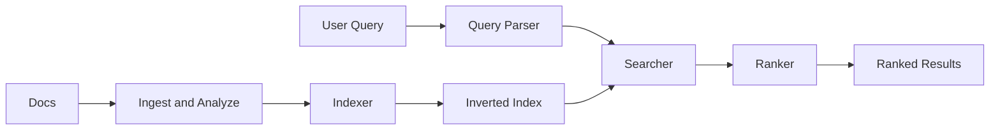

# Search Engine

## 1. One-Line Definition
A search engine pre-builds an inverted index over a corpus of documents so that keyword queries are answered by looking up term posting lists and merging them, returning ranked results in tens of milliseconds instead of scanning every document.

## 2. Why Do We Need It?
At small scale, a `LIKE '%term%'` scan over a few thousand rows is fine. That approach dies at millions or billions of documents: every query reads the whole corpus, latency grows linearly with data, and I/O saturates long before you serve an audience. A search engine inverts the work: the expensive part (tearing each document into tokens and recording where each term appears) happens once up front, at ingest time, so each query touches only the terms the user typed. This is what makes "find all documents containing the word tsunami" return instantly on a library the size of the web.

## 3. Simple Intuition
The index at the back of a nonfiction book: instead of re-reading all 400 pages to find "volcano," you flip to the V entries and get the page numbers told to you directly. The search engine's inverted index is exactly that — a dictionary mapping each word to the list of documents (and positions) where it appears. Queries read the dictionary and the short posting lists; they never open the documents themselves until ranking and snippet extraction.

## 4. What Happens Without It?
Every query scans every document — O(corpus) per query. At 1 billion documents, even a fast sequential scan of 10 TB takes minutes per query, QPS collapses to a handful, and two concurrent users fight for the same disk. You end up serving cached "hot" queries only and returning "no results" or an apology page for anything long-tail. You cannot scale reads by adding replicas either, because each replica still pays the full scan cost per query. Pre-built indexes are not an optimization; they are the difference between "a search feature" and "a search product."

## 5. Core Idea
- **Ingest → analyze → index:** each document is tokenized (split into words), normalized (lowercase, strip punctuation, stem or lemmatize), then written into the inverted index once. Search quality is mostly decided here, before any query arrives.
- **Inverted index:** term → posting list (doc IDs, term frequency, positions). The core data structure; a nice contrast to the B-tree's "row → all its columns" ordering used by [[database-indexing|Database Indexing]] — the inverted index is ordered by term, not by row or primary key.
- **Query pipeline:** analyze the query with the same analyzer, AND-intersect the posting lists (optional OR / phrase / prefix / fuzzy), apply filters, rank, return result ids and snippets.
- **Scoring:** ranking decides the order — see [[search-ranking|Search Ranking]] (BM25 and beyond). Matching only finds candidates; ranking decides relevance.
- **Freshness trade-off:** building the index takes work, so engines batch it: new documents appear after a short refresh interval (near-real-time), not instantly — a deliberate consistency choice.
- **Distributed deployment:** the index is split into shards (document subsets) and replicated for read scaling and availability — in a managed product like [[elasticsearch|Elasticsearch]], this is search-level sharding that reuses the ideas of [[sharding|Sharding]].

## 6. Important Terminology

| Term | Simple Meaning |
|------|----------------|
| Document | The searchable unit (a page, a product, a tweet) |
| Corpus | The full set of documents being searched |
| Token | One unit after splitting text (usually a word) |
| Tokenizer | Splits text into tokens on spaces, punctuation, boundaries |
| Analyzer | Tokenizer + normalizer (lowercase, stemming, stop words) |
| Inverted index | Term → posting list dictionary |
| Posting list | Ordered list of doc IDs (and positions) that contain a term |
| Indexing (verb) | Building the inverted index from documents |
| Term frequency (tf) | How many times a term appears in one document |
| Document frequency (df) | How many documents contain the term |
| NRT (near-real-time) | New documents become searchable within seconds, not instantly |
| Precision | Fraction of returned results that are relevant |
| Recall | Fraction of relevant documents that were returned |

## 7. Basic Architecture



## 8. Request or Data Flow
1. **Ingest path:** raw docs arrive → tokenizer splits → normalizer lowercases/stems → indexer appends each term to its posting list → segments flushed to disk.
2. **Query path:** a user types "tsunami warning" → the query parser runs the same analyzer (so "Tsunami" matches "tsunami") → the searcher intersects the posting lists of both terms → filters apply → the ranker scores survivors with BM25/click data → the top 10 with snippets are returned.
3. Because analyzer steps are shared between index and query, mismatch here (e.g., query analyzer not stemming) is the most common invisible bug.

## 9. Practical Example
Product search on an e-commerce site with 50 million products:
- Each product document: title, description, category, brand, price, image URL.
- Ingestion: catalog updates flow in via CDC → each product is tokenized and indexed. A priced engine agent refreshes the index every second, so a new product is searchable within ~1-2 seconds of appearing in the catalog.
- Query "wireless noise cancelling headphones": candidate set from intersecting posting lists might be ~2,000 products; ranking (title match boosted, brand authority, sales velocity) returns the 10 most relevant; filters (price under $300, in stock) applied before ranking.
- Numbers: index size ~1.5x the original JSON (more with positions); a query touches only the posting lists of 3 terms; median query latency ~8 ms at 5,000 QPS on 12 search nodes with replicas.

## 10. Scaling
- **Shard the index:** split documents across N shards (by doc-id hash or time range); each shard owns a fraction of the term→doc dictionary — rewrite of [[sharding|Sharding]] at the search layer.
- **Replicate per shard:** read replicas scale query QPS linearly; combos of shards × replicas give both capacity and availability.
- **Query fan-out:** a query hits every shard (because every term appears in every shard) then merges top-k per shard — this is scatter-gather, so query latency is bounded by the slowest shard; keep shards balanced.
- **Caching:** cache hot queries and top results upstream; filter/sort by precomputed doc metadata rather than live joins.
- **Reindexing:** schema/analyzer changes require full rebuild — plan a side-by-side reindex with cutover rather than a live swap.

## 11. Reliability and Failure Scenarios

| Failure | What Happens | Detection | Recovery | Trade-off |
|---------|--------------|-----------|----------|-----------|
| Shard/node dies | Queries partial or fail | Node health checks | Promote a shard replica; rebalance | More replicas = more storage |
| Index corruption | Wrong results, crashes | Checksums on segments | Rebuild segment from source | Rebuild cost |
| Ingest backlog | Documents stale | Refresh lag / consumer lag | Backpressure + more ingest workers | Freshness vs load |
| Analyzer change | Index/query mismatch, silent misses | Diff-index regression tests | Full reindex | Reindex downtime |

## 12. Consistency and Correctness
- **Near-real-time, not ACID:** a doc becomes searchable after the refresh interval; deleted/updated docs linger in old segments until merged. Readers see the new index only at refresh boundaries — eventual consistency by design.
- **Deletes are lazy:** removing a doc marks it deleted; physical removal happens at segment merge, so a deleted doc can sit in old segments briefly. Plan for that window if compliance is strict.
- **Idempotent reindexing:** reprocessing a document must not duplicate it — key the document by a stable id so an insert is an upsert.
- Query side needs determinism too: scoring must be reproducible across replicas (deterministic tie-breaking) so the same query does not return shuffled results depending on the node that served it.

## 13. Performance
- **Build cost:** indexing is CPU/I-O heavy; expect index size roughly 30-100% of raw source (positions push it up) and ingest throughput far below raw write throughput.
- **Query cost:** proportional to posting-list length, not corpus size — the whole point. Phrase queries and prefix/wildcard queries are expensive; avoid on hot paths.
- **Latency budget:** 10-100 ms p99 is achievable; most of it is the scatter-gather network fan-out and top-k merge.
- **Memory:** keep the term dictionary (and hot posting lists) in memory — disk seeks on a shared term dictionary murder latency. See [[caching|Caching]] for the general cache layer on top.

## 14. Security
- Permission filtering must happen at query time inside the index, merging ACLs into the posting list intersection — filtering after returning results leaks documents (see Common Mistakes).
- Fields may carry different sensitivity: index encrypted at rest (see [[encryption-and-keys|Encryption and Keys]]), TLS in transit, per-tenant index/alias isolation for multi-tenant corpora.
- Beware analyzer/term injection with crafted input — treat the query path as untrusted input and validate field names against an allowlist.

## 15. Trade-Offs

| Choice | Advantages | Disadvantages | When to Use |
|--------|------------|---------------|-------------|
| Full scan (LIKE/search outside ESC) | Zero infrastructure | O(corpus) per query | Tiny datasets only |
| Inverted index | Millisecond queries at any scale | Build cost, index storage, NRT consistency | Any real search feature |
| NRT refresh 1s | Fresh results | Ingest amplification, more segments | Churn-heavy catalogs |
| Slow refresh 60s | Fewer segments, cheaper merges | Stale results | Read-mostly corpora |
| Sharded index | Scales doc count + QPS | Fan-out, slowest-shard latency | Corpus or QPS too big for one node |
| Single-node index | Simple, no fan-out | Hard ceiling | Small corpora early on |

## 16. Common Mistakes
- Implementing search as `LIKE '%term%'` and discovering the O(n) bill at scale — the classic "search feature" trap that dies in production.
- Indexing time and query time analyzers drifting apart (one stems, one doesn't) → silent recall loss.
- Applying security/ACL filtering *after* the top-k is selected, leaking documents in results and snippets.
- Ignoring the refresh window and promising instant search after writes — then debugging "the data is there but search doesn't show it."
- Spending all effort on matching and none on ranking, so results are complete but useless.

## 17. HLD vs LLD Boundary
HLD: choose inverted index + analyzer strategy, decide shard count and replication, set the refresh/freshness contract, define the query pipeline stages, and decide caching. LLD: the concrete tokenizer regexes and stemming rules, the BM25 tuning constants, the snippet-extraction code, and the per-service query builder.

## 18. Interview Questions

### Beginner
- How is a search query faster than a database LIKE scan?
- Walk the path of one document from ingest to searchable.

### Intermediate
- Design search for a chat-history feature with strict per-user isolation.
- The corpus triples overnight. What breaks, and what do you do?

### Advanced
- Your search index shards: a query touches every shard. Derive the latency math and explain how you keep p99 acceptable.
- How do you reconcile near-real-time freshness with a strong requirement that deletes be immediately invisible?

## 19. Interview Memory Summary

> [!abstract]- Interview Memory Summary
> ### Remember
> - An inverted index maps terms → posting lists, built once at ingest, so queries touch only the typed terms.
> - Analyzer consistency between index time and query time is the silent killer of recall.
> - Matching finds candidates; ranking decides order.
> - Search is near-real-time by design — decide the freshness contract explicitly.
> - Scale by sharding the index and replicating per shard; queries fan out to every shard.
> - Permission filtering happens inside the index during the query, never after the top-k.
> - Index size is ~30-100% of raw text; build cost is paid at ingest, not per query.

> ### 30-Second Explanation
> Search pre-indexes documents with an analyzer (tokenize + normalize + stem) into an inverted index of term → posting lists. Queries are analyzed the same way, posting lists are intersected under ACL filters, and survivors are ranked (BM25, click signals). The index is sharded for size and replicated per shard for QPS, refresh gives new docs a seconds-later visibility window, and hot queries cache upstream. That is the whole product: cheap query-time cost paid for with ingest-time work.

> ### Interview Traps
> - Proposing LIKE scans "because it's simpler" without hitting the O(n) math at your real corpus size.
> - Filtering ACLs after ranking — documents leak.
> - Promising instant visibility while running a 60-second refresh.
> - Ignoring analyzer drift between index and query time.

> ### Key Trade-Off
> Inverted indexing trades expensive one-time ingest work and index storage for sub-hundred-millisecond queries at any corpus size — you pay in freshness and build cost what you save in every query.

## 20. Related Concepts

### Prerequisites
- [[database-indexing|Database Indexing]]
- [[caching|Caching]]
- [[sharding|Sharding]]

### Commonly Used Together
- [[search-ranking|Search Ranking]]
- [[autocomplete|Autocomplete]]
- [[elasticsearch|Elasticsearch]]

### Alternatives
- [[sql-vs-nosql|SQL vs NoSQL]] (DB full-text extensions when search is a small feature, not the product)
- [[database-replication|Database Replication]] (read replicas for simple lookups that never need ranking)

### Advanced Concepts
- [[probabilistic-data-structures|Probabilistic Data Structures]]
- [[strong-vs-eventual-consistency|Strong vs Eventual Consistency]]

Related planned topics (not authored yet): query parsing, search relevance tuning, snippet generation.

## 21. References
Kleppmann, "Designing Data-Intensive Applications," ch. 3 (indexing) — the inverted index discussion. Manning, "Elasticsearch: The Definitive Guide" (verified constants like refresh defaults against current docs before interviews).

## 22. Active Recall

Test yourself before revealing each answer.

> [!question]- Why is a search query faster than SELECT ... WHERE title LIKE '%term%'?
> A LIKE scan reads every row and string-matches — O(corpus) per query. An inverted index answers by dictionary lookup into term posting lists, so cost is proportional to the number of matching documents (posting list length), not the corpus size. The O(corpus) work is moved to ingest, where it is paid once per document.

> [!question]- A document was indexed with stemming but queries are run without it. What goes wrong?
> Query-recording-intent mismatch: queries and documents use different analyzers. Seeking "runs" won't match the stemmed posting list for "run"/"running", or vice versa — silent recall loss that appears random. Index-time and query-time analyzers must be kept identical.

> [!question]- Why can't you just add replicas to handle more search QPS?
> Replicas of the inverted index do scale pure query QPS (more copies serve the same index). What replicas cannot fix is corpus size (each replica still stores the full index) and ingest pressure; those need sharding the index across more nodes.

> [!question]- When does "near-real-time" show up, and what is the freshness contract?
> At refresh intervals: the engine buffers new docs and periodically pipelines them into new index segments; readers see them only after a refresh. The contract is explicit — e.g., "searchable within ~1 second of updates." Choose the interval to balance freshness against merge/amplification costs.

> [!question]- Where do you enforce that User A cannot see User B's private documents?
> Never after ranking. Per-user ACLs are merged into the query intersection itself — each user's allowed-doc ids constrain the posting lists before scoring, so forbidden documents never reach the top-k or the snippet buffer.

> [!question]- Your index is spread over 8 shards. What happens to a single query?
> It fans out to all 8 shards (any term can live in any shard), each shard ranks its local top-k, and a coordinator merges the local top-k lists into the global top-10. Latency is the slowest shard + a merge hop; hot or imbalanced shards directly inflate p99.

> [!question]- Interview scenario: a large email service wants full-text search over 5 years of mail. Walk the top-three decisions.
> 1. Inverted index over each mailbox's messages, with per-user ACL (owner id) as a mandatory query constraint — isolation is structural.
> 2. Shard by user id so one user's mail stays on one shard (co-location), replica per shard for read QPS.
> 3. Set a freshness contract (seconds-to-minutes) and reindex the oldest year to a slower tier to control build cost.

## 23. When Should I Use This?

### Use it when
- You need ranked, keyword-based querying over large text corpora (tens of millions of docs and up).
- Users type free-text queries where ordering/snippets/highlighting matter, not exact key lookups.
- Scalability targets are hundreds or thousands of queries per second with strict latency budgets.
- The dataset changes in batch or stream but reads dominate and staleness of seconds is acceptable.

### Avoid it when
- Data is tiny and a DB index or LIKE is genuinely fast enough — an engine is premature machinery.
- Queries are exact lookups or small-range scans ("show my order by id") — a relational PK index better.
- You need transactional, immediately-consistent reads of the live data — look at [[strong-vs-eventual-consistency|Strong vs Eventual Consistency]] elsewhere instead.

### What problem does it solve?
Millisecond multi-term search over corpora too large to scan per query, by pre-building an inverted index and paying the interpretation cost once at ingest.

### What problem does it NOT solve?
Exact-match transactions and strong consistency (it is near-real-time, eventual read-model), global aggregations across the corpus (that is [[oltp-vs-olap|OLTP vs OLAP]] work for a warehouse), real-time freshness guarantees, or relevance — matching is necessary but ranking quality is a separate [[search-ranking|Search Ranking]] problem.

## 24. Decision Connections

Decisions that go together with a search engine:

- [[database-indexing|Database Indexing]] — B-trees keep rows findable by key; the inverted index is the analogous structure for terms. They coexist, they do not compete.
- [[search-ranking|Search Ranking]] — once candidates are found, order decides whether the feature feels useful.
- [[elasticsearch|Elasticsearch]] — the operational form: Lucene-based, shard/replica model, near-real-time defaults.
- [[sharding|Sharding]] — the index must outgrow one node eventually; search sharding is sharding applied to term→doc dictionaries.
- [[caching|Caching]] — hot queries are the easy wins; cache results upstream of the index.
- [[strong-vs-eventual-consistency|Strong vs Eventual Consistency]] — search is a deliberately eventual read model; spell out what the freshness budget is.
- [[probabilistic-data-structures|Probabilistic Data Structures]] — Bloom filters power "is this term even in the index" short-circuits for multi-term queries.

Decision tree:

```
Users need to find text in a corpus
    |
    +-- Corpus is tiny (below ~1M docs) and no ranking needed?
    |      → DB full-text index keeps it simple
    |
    +-- Need ranked, millisecond, terms-in-text search at scale?
    |      → [[search-engine|Search Engine]]
    |         |
    |         +-- Corpus too big for one node?    → shard the index
    |         +-- Query QPS high?                 → replica per shard
    |         +-- Ordering of results matters?    → [[search-ranking|Search Ranking]]
    |         +-- Type-ahead required?            → [[autocomplete|Autocomplete]]
    |         +-- Operational product preferred?  → [[elasticsearch|Elasticsearch]]
    |
    +-- Writes must be instantly, transactionally visible?
           → this is not a search-read-model problem; question the requirement
```

