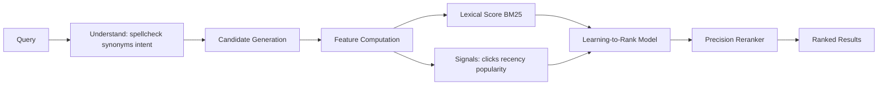

# Search Ranking

## 1. One-Line Definition
Search ranking orders the candidate documents that match a query so the most relevant ones surface first, using lexical scoring (BM25), query-understanding signals, and often machine-learned models blending many relevance features.

## 2. Why Do We Need It?
Matching finds *which* documents contain the terms; it says nothing about *which order to show them in*. A query like "java" can match frameworks, a book, and a city; "wireless headphones" matches thousands of products. If you return them in raw index order, users see noise, click nothing, and the feature fails despite a perfect inverted index. Ranking converts candidate sets into usable answers — it is the difference between a keyword filter and a search product, and it directly drives engagement and revenue (a top-ranked result gets orders of magnitude more clicks).

## 3. Simple Intuition
You asked a librarian for "books on wolves." They did not hand you all 5,000 matches alphabetically — they ordered them: books where "wolf" is central and the title matches first, scholarly over pamphlet if you wanted depth, recent editions over old. The librarian applies implicit rules: term rarity importance, term commonness is noise, exact title hits matter more than an incidental mention, and prior experience with patrons shapes the order. That is ranking, and search engines do it with math instead of intuition.

## 4. What Happens Without It?
Results appear in insertion order or by whatever the inverted index returns — effectively random with respect to relevance. Users scan the first page, find nothing useful, and either rephrase, add filters, or leave. Click-through collapses, and for commerce, revenue collapses with it. Relevance is the feature: users may forgive a slightly slow search, but they do not forgive results that are "technically correct and useless."

## 5. Core Idea
- **Lexical core — TF-IDF and BM25:** score a doc by how often the term appears in it (term frequency, tf) and how rare the term is across the corpus (document frequency, df; rare terms are more discriminating). BM25 adds length normalization + saturation so a 200-word page with one "tsunami" isn't crushed by a 2,000-word page with two.
- **Query understanding:** the query itself must be interpreted well — spell-correct, synonym expand, recognize the "intent" (navigational vs informational vs transactional), determine term weights.
- **Blend of features, not one formula:** title exact-match boost, field weighting (title > body), recency, freshness, popularity, sales/seconds-of-engagement, geo-proximity, entity types. Corpus-level relevance (BM25) is the backbone; entity + behavioral signals are the differentiator.
- **Learned ranking:** production systems train pointwise/listwise/pairwise ranking models (gradient-boosted trees, then neural) over a feature vector; the model's job is to get the *relative order* right, often by optimizing click-through or examination signals.
- **Precision vs recall trade-off:** ranking is also the place you decide whether to widen the net (more recall, derivative results) or keep it tight (precision-first).
- **Top-k matters more than the rest:** p99 relevance of position 3 beats p50 relevance of position 30; resources concentrate on getting the top 10 right and reranking the top candidates with a heavy but accurate model (die-verband: cheap candidate generation, expensive precision rerank).

## 6. Important Terminology

| Term | Simple Meaning |
|------|----------------|
| Relevance | How well a document satisfies the query intent |
| Precision | Fraction of shown results that are relevant |
| Recall | Fraction of all relevant documents that were shown |
| TF-IDF | tf × idf: term frequency × inverse document frequency |
| BM25 | The standard lexical ranking function (tf-saturation, length norm, idf) |
| Document frequency | How many docs contain the term — rareness signal |
| Feature | Any input to the ranker (title match, recency, clicks) |
| Reranker | Expensive, accurate model applied to a shortlist of candidates |
| Click-through rate | Clicks / impressions, a proxy signal for "useful" |
| Mean reciprocal rank | 1/position of first relevant hit — measures how high the first good result is |
| nDCG | Normalized discounted cumulative gain: graded relevance, logged position penalty |
| Judgments | Human labels of query-doc relevance used for evaluation/training |

## 7. Basic Architecture



## 8. Request or Data Flow
1. The query is interpreted: spelling corrected ("elastisearch" → "elasticsearch"), synonyms expand ("laptop" ↔ "notebook"), and the intent is classified (buy vs learn vs go-to).
2. Candidate generation pulls a wide net from the inverted index ([[search-engine|Search Engine]]) plus structured filters — thousands of docs, deliberately generous on recall.
3. Features are computed for each candidate: lexical (tf/BM25 per field), freshness, popularity, clicks-momentum, geo, entity-type match.
4. A fast first-pass model (or pure BM25) orders candidates and keeps the top 50-100.
5. The expensive reranker recomputes those few with heavy features (deep model, more context) — this is where the top-10 order is actually decided.

## 9. Practical Example
Marketplace product search (5 million live products):
- Query "red running shoes size 10" → query understanding extracts color, category, and size facets; BM25 over title/description narrows to ~8,000 candidates.
- Features: title has "red", "running", "shoes" (high term weight); recency matters (new arrivals win ties); merchant rating and recent sold-count as provenance; size-10 availability as a hard filter.
- A gradient-boosted rerank model blends these into a final order; the model is trained daily on clicks, with human judgments sampled weekly to guard against click loops.
- Outcome metric: first-page click-through up ~30% after switching from BM25-only to blended ranking; revenue on a top-3 slot measured in a/b test.

## 10. Scaling
- **Compute plateaus:** ranking cost grows with candidate count — keep candidate generation cheap (posting-list intersect) and let only the top-k cross the expensive rerank (cascade: cheap → expensive at decreasing cardinality).
- **Feature/embedding cost:** computing 100 features per candidate × 8,000 candidates × 5,000 QPS is a huge multiply; precompute document-side features at ingest (updatable sidecar doc), and serve user-context features from a cache.
- **Model serving:** learned models go behind their own fleet; if the model is down, fall back to BM25 (degrade gracefully, never serve empty).
- **Personalization:** per-user ranking multiplies feature compute — personalization belongs in the rerank stage over cached profiles, not in candidate generation.
- **Cold start:** new documents have no click history — blend a "static relevance prior" (content match, quality) with slowly accumulating behavioral signals.

## 11. Reliability and Failure Scenarios

| Failure | What Happens | Detection | Recovery | Trade-off |
|---------|--------------|-----------|----------|-----------|
| Model serving outage | Rank quality drops or requests fail | Model health, fallback path | BM25 fallback + alert | Quality dip vs 5xx errors |
| Click-data pipeline stalls | Behavioral features stale | Feature lag metric | Recompute from stream (see [[consumer-lag|Consumer Lag]]) | Fresh features vs cost |
| Feature explosion latency | p99 climbs | Latency SLO alerting | Cache doc features, reduce feature set | Accuracy vs latency |
| Wrong training labels | Whole order drifts wrong | Offline eval on judgment set, live CTR | Relabel, retrain, rollback model version | Time to detect |

## 12. Consistency and Correctness
- **Ranking is per-query, not global:** correctness is "did the right order come back," which is fuzzier than data consistency — hence offline evaluation (judgment sets, nDCG/MRR) is the honesty check.
- **Determinism across replicas:** tie-breaking must be stable (use a rank-stable key) or the same query returns different order from different nodes — users and a/b tests both notice.
- **Exposure bias / feedback loops:** clicks reinforce what was already ranked high, entrenching bad results ("rich get richer"). Mitigate with randomized or per-user exploration slots and periodic human judgment audits.
- **Freshness of the ranking model:** a model trained on last month's clicks serves stale intent; retrain on a schedule and version models for rollback.

## 13. Performance
- **Latency budget:** total query budget is typically 50-150 ms. Candidate generation + BM25 ≈ 5-20 ms; feature compute ≈ 10-40 ms; the rerank model is often the biggest single chunk — time-box it and precompute what you can.
- **Throughput:** cost is candidates × features × QPS; trimming candidate count from 8,000 to 2,000 with a better filter is a 4x win, not a trade-off.
- **Caching:** cache heavy, query-independent features as precomputed per-document metadata; popularity and other decaying signals update via scheduled recompute, not per-query computation.
- **Precompute popular queries:** for the top few thousand queries, precompute and cache the ranked list; render it instead of ranking live (a common 5-10x QPS saver).

## 14. Security
- Ranking features must not leak per-user data across tenants — a feature like "personal affinity" must carry user scope so it cannot be used to query into another user's history.
- Guard the training pipeline: poisoned or adversarially crafted click/label data is an input-integrity issue; validate and sample-label human judgments, and audit rare high-value segments.
- Never expose raw feature vectors/ids in API responses (information disclosure beyond the intended result set). TLS and access control on the ranking endpoints apply as usual (see [[web-vulnerabilities|Web Vulnerabilities]]).

## 15. Trade-Offs

| Choice | Advantages | Disadvantages | When to Use |
|--------|------------|---------------|-------------|
| BM25 only | Cheap, transparent, no training data | Ignores intent, popularity, recency | Small corpora, first version |
| TF-IDF (pre-BM25) | Simplest explainable baseline | No length normalization, bursts dominate | Teaching/debugging only |
| Learned rerank | Best quality with labeled data | Ops burden, feature/label pipeline, cold start | Commercial/scale search |
| Personalized ranking | Highest engagement | Requires profiles, explosion of query variants | Logged-in consumer apps |
| Global (non-personalized) | Simple, cacheable, fair to all | Misses individual intent | Work/product search, clarity-first |

## 16. Common Mistakes
- Treating ranking as matching — returning alphabetical or insertion-order results and calling it search.
- Ignoring cold start: new, high-quality documents rank at the bottom forever because they have no click history.
- Ranking on popularity alone: headlines like "best headphones 2020" dominate 2026 and stale products bury fresh ones.
- Building one massive real-time feature computation per query on the hot path, when 90% of features are precomputable at ingest.
- Evaluating last week's clicks as "ground truth" without guarding the exposure/feedback loop that made those clicks happen.

## 17. HLD vs LLD Boundary
HLD: choose the ranking pipeline stages (candidate gen → features → first-pass → rerank), decide BM25 vs learned-ranking, set the eval framework (judgments, nDCG/MRR) and the freshness/retrain schedule. LLD: the actual BM25 parameter tuning, feature-vector schemas, the model architecture and training loop, and the query-understanding rules.

## 18. Interview Questions

### Beginner
- What does BM25 do that keyword matching does not?
- Define precision and recall for search and give an example where they trade off.

### Intermediate
- A query matches 10,000 docs but your index returns them in arbitrary order. How do you get quality into the top 10?
- Why does recency matter for news search but matter less for legal search?

### Advanced
- Design the feature pipeline and rerank cascade for a 100k-QPS search service without blowing the latency budget.
- Click-through rate is the training signal, but clicks only happen on what was already shown. How do you break the feedback loop and evaluate fairly?

## 19. Interview Memory Summary

> [!abstract]- Interview Memory Summary
> ### Remember
> - Matching finds candidates; ranking orders them — both are required for a search product.
> - BM25 is the lexical backbone: tf saturation, length normalization, rare-term idf.
> - Features (title match, recency, popularity, entity, geo, clicks) are blended; production adds learned reranking.
> - Spend compute as a cascade: cheap candidate generation → expensive rerank only on the top-k.
> - Evaluate with judgment sets and nDCG/MRR, not vibes — and watch for feedback loops.
> - Determinism and model versioning matter: same query must rank the same from any replica.
> - Cold start for new docs is a first-class problem, not an afterthought.

> ### 30-Second Explanation
> Query understanding normalizes the query, candidate generation pulls a generous match set from the inverted index, and features are computed per candidate — lexical BM25, freshness, popularity, behavioral signals. A fast first-pass ranks the whole set, then an expensive reranker fixes the final top-10 order. The model is trained on clicks plus human judgments, evaluated offline by nDCG/MRR, retrained on a schedule, and versioned for rollback; everything expensive is precomputed at ingest or cached.

> ### Interview Traps
> - Claiming "we use ML ranking" without a labeled-data and evaluation story.
> - Letting popularity drown recency (or vice versa) with no blending strategy.
> - Training solely on clicks and ignoring the exposure loop that manufactured them.
> - Putting a 200-ms model on the hot path with work that should be precomputed.

> ### Key Trade-Off
> Ranking quality costs compute and training data; the win is surfacing genuinely relevant results instead of merely-correct ones, so you spend latency/feature-pipeline budget on the top-k and keep the bulk of candidates on a cheap first pass.

## 20. Related Concepts

### Prerequisites
- [[search-engine|Search Engine]]
- [[database-indexing|Database Indexing]]

### Commonly Used Together
- [[autocomplete|Autocomplete]]
- [[elasticsearch|Elasticsearch]]
- [[caching|Caching]]

### Alternatives
- BM25-only search when there is no labeled data or scale demands
- [[oltp-vs-olap|OLTP vs OLAP]] analytics when "ranking" is really "sorted aggregation", not relevance

### Advanced Concepts
- [[probabilistic-data-structures|Probabilistic Data Structures]] (heavy-hitter detection for trending features)
- [[observability|Observability]] (per-query relevance SLOs and a/b evaluation)

Related planned topics (not authored yet): learning to rank, neural/vector search, evaluation and judgment sets.

## 21. References
Manning, Raghavan, Schütze, "Introduction to Information Retrieval," ch. 6 (BM25) — canonical scoring references. Robertson and Zaragoza, "The Probabilistic Relevance Framework: BM25 and Beyond" (2009). Verify field-weighting guidance against current engine documentation before interviews.

## 22. Active Recall

Test yourself before revealing each answer.

> [!question]- Why is ranking a separate problem from matching? Give the one-sentence case.
> Matching decides which documents contain the query terms; it gives no opinion on which document should appear first, and for ambiguous or broad queries the correct order is the entire UX. A "java" search matches dozens of unrelated categories; only ranking can put "JAVA programming" ahead of the island and the coffee brand.

> [!question]- Intuitively, why does BM25 use the inverse document frequency of a term?
> A term like "the" or "best" appears in nearly every document, so it discriminates almost nothing — high document frequency means low information. Rare terms ("tsunami", "elastomeric") concentrate occurrence among the truly relevant docs; idf up-weights discriminative terms and down-weights corpus-wide noise.

> [!question]- What is the cascade pattern in ranking and why is it essential at scale?
> Stage the cost by cardinality: a cheap first pass (posting-list intersect, BM25, simple features) ranks the full candidate set, then only the top 50-100 cross the expensive rerank model. Computing heavy features on all 8,000 candidates at 5,000 QPS is arithmetic that does not survive budget review.

> [!question]- Click-through is the training label. What is the trap?
> Exposure bias: users can only click what you already ranked high, so clicks reinforce the existing order (feedback loop), and "popular" can drown genuinely better but never-shown results. Mitigate with exploration/randomization, debiased estimators, and periodic human judgment audits.

> [!question]- A brand-new product has no behavioral data. How does it ever rank well?
> Cold start: blend a static content-quality prior (strong text match, title alignment, freshness) that is computable at ingest, then let behavioral signals accumulate weight over time. Do not let the absence of clicks mean "irrelevant forever."

> [!question]- Same query returns different orders from two replicas. What did you forget?
> Deterministic ranking: the final order needs a stable tie-break key (stable doc id) so two seeds don't shuffle otherwise-tied documents. Non-deterministic ranking breaks users, caching, and a/b tests all at once.

> [!question]- Interview scenario: your employer complains "search returns everything in random order." Walk the fix.
> 1. Add BM25 lexical scoring — order by term relevance, not index order.
> 2. Add the cheap domain features: title boost, recency, popularity/reviews.
> 3. Stand up an offline evaluation (judgment set + nDCG) before and after every change, so the fix is measured.
> 4. Only then consider a learned reranker, with feedback-loop controls from day one.

## 23. When Should I Use This?

### Use it when
- Users issue natural-language queries with more than one plausible answer per query.
- Order is consequential: commerce, news, knowledge search, job/candidate matching.
- You have behavior signals (clicks, views, purchases) or content signals (recency, quality scores) beyond pure term match.
- A query can match thousands of docs but users will only ever read the first page.

### Avoid it when
- Queries are exact/key lookups with a single canonical answer — rank is irrelevant; an index suffices.
- The corpus is tiny and every query returns all matches on one screen.
- There is no evaluation mechanism: ranking without a way to measure quality is guesswork that cannot be improved.

### What problem does it solve?
Turning a large set of "technically matching" documents into an ordered list whose top results actually answer the query, by scoring relevance and blending signal types.

### What problem does it NOT solve?
Matching/recall ([[search-engine|Search Engine]]), discovery of docs that share no terms with the query (semantic/vector search — planned), and finding data in a database by key (that is [[database-indexing|Database Indexing]]). Good ranking can also rank good candidates; it cannot rescue a failed candidate-generation step.

## 24. Decision Connections

Decisions that go together with search ranking:

- [[search-engine|Search Engine]] — ranking consumes the inverted-index candidates; without matching there is nothing to order.
- [[autocomplete|Autocomplete]] — type-ahead suggestion ordering uses the same signals (frequency + freshness) but for *queries*, not documents.
- [[elasticsearch|Elasticsearch]] — ships BM25 and per-field boosts out of the box; heavy learned ranking usually moves to a custom service beside it.
- [[caching|Caching]] — stable, non-personalized rankings are cacheable; personalization fights caching and must be designed for.
- [[observability|Observability]] — relevance needs its own metrics (CTR, p99 error, eval deltas) beyond the classic red/gold signals.
- [[oltp-vs-olap|OLTP vs OLAP]] — ranking is neither: it reads an eventual search index, not the operational DB or the warehouse.

Decision tree:

```
A query returns matching docs
    |
    +-- Single canonical answer, exact lookup?
    |      → no ranking needed, use the key index
    |
    +-- Many matches, order is the product?
    |      → [[search-ranking|Search Ranking]]
    |         |
    |         +-- No labeled data / small corpus?  → BM25 lexical scoring
    |         +-- Behavioral signals available?    → blend features + rerank
    |         +-- Logged-in, high engagement?      → personalization at rerank
    |         +-- Need measurable, guardable quality? → judgment set + nDCG
    |
    +-- Need type-ahead behavior too?
           → add [[autocomplete|Autocomplete]] beside ranking
```

