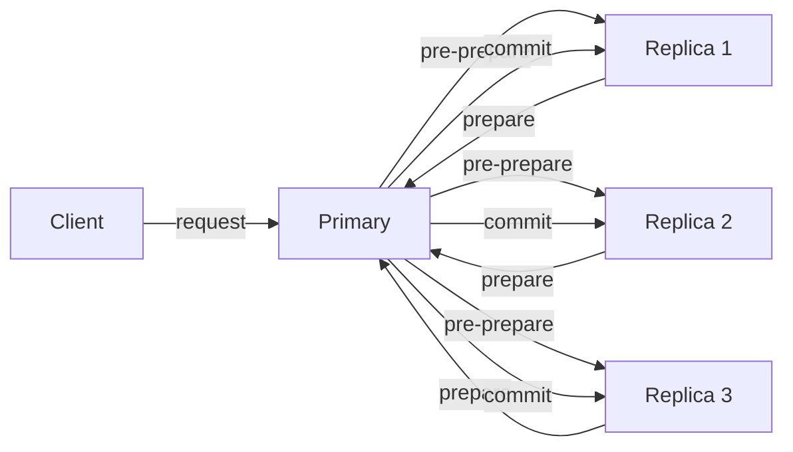

# Byzantine Fault Tolerance

## 1. One-Line Definition
Byzantine fault tolerance (BFT) is consensus's answer to *malicious* faults — nodes that do not just crash but lie, forge, or collude — guaranteeing agreement as long as fewer than one-third of the nodes are faulty, i.e. with 3f+1 nodes for f tolerated faulties under the classic protocol.

## 2. Why Do We Need It?
Classic [[consensus|Consensus]] (Raft/Paxos) assumes *crash faults*: nodes stop but never lie. That assumption dies the moment nodes run untrusted code, hold split identities (sybils), or might be compromised — blockchains, permissionless networks, multi-party ledgers, and systems where competing parties control replicas. If even one node can forge a heartbeat or invent a value, the whole vote can be rigged. BFT covers the gap between "it crashed" and "it is fighting you."

## 3. Simple Intuition
Ordinary election recounts trust that poll workers miscount honestly — nobody considers a worker fabricating votes. BFT assumes some workers are actively cheating, in secret, coordinating. The only defense is redundancy plus authentication: you cannot stop a liar, but you can arrange the system so that a minority of liars cannot out-vote the honest majority. Every message carries a signature; a forged vote is provably a lie, and a 2/3 honest supermajority makes the cheaters mathematically irrelevant.

## 4. What Happens Without It?
A single compromised node can become a "leader" that proposes garbage while everyone else copies it (crash consensus assumes followers trust the leader). Without signatures, a node cannot prove a fake heartbeat; without the 2/3 rule, three colluders in a 7-node group could commit (imagine 4 honest + 3 liars — the liars plus one honest maybe). Malicious "pause-and-resume" nodes manipulate timeouts to keep the honest side leaderless. Plain distributed systems quietly assume "no lying node", and in permissionless/multi-tenant settings that assumption is a target.

## 5. Core Idea
- **The Byzantine generals problem:** N generals must attack together; traitors can send forged messages to different recipients. Consensus must still decide to attack or not consistently if fewer than 1/3 are traitors.
- **f practicality bound:** to tolerate f Byzantine nodes, you need at least 3f+1 total nodes. One faulty node in four; 3f+1 = 4 for f=1, 7 for f=2. Crash tolerance (n >= 2f+1) is cheaper — you pay the extra replica to cover *lies*.
- **Why 3f+1?** With f faulty nodes, primary-broadcast (PBFT-style) designs must hear from n-f nodes and keep honest majority: (n-f) > f + (n-... ) — algebra yields n > 3f as the boundary; the protocol needs 3f+1 replicas to round-trip the votes safely.
- **Authentication is the enabling mechanism:** every message is signed; verify-before-use makes forged votes detectable and honest quorums provable (digital signatures, Merkle-ized state).
- **PBFT = practical BFT:** primary proposes, all replicas 'prepare' and 'commit' to a value in three exchange rounds; a replica that hears f+1 conflicting views starts a change-of-primary — a view-change. Client waits for f+1 identical replies to be sure.
- **Honest supermajority = 2f+1:** a client/leader accepts a decision when 2f+1 (i.e., a quorum excluding liars) agree on the same transcript — the extra f over majority is the buffer that makes lying unprofitable.

## 6. Important Terminology

| Term | Simple Meaning |
|------|----------------|
| Byzantine failure | Node runs arbitrary, malicious behavior |
| Crash failure | Node simply stops; never lies |
| f | Number of faulty nodes tolerated |
| 3f+1 | Replicas needed to tolerate f Byzantine |
| PBFT | Practical Byzantine Fault Tolerance (Castro & Liskov) |
| View / view-change | Primary epoch + rotation when a primary misbehaves |
| Prepare / Commit | PBFT's two agreement rounds |
| Authenticated quorum | 2f+1 signed same-view responses |
| Sybil identity | An attacker creating fake nodes |
| Digital signature | Proof of origin making forgery detectable |

## 7. Basic Architecture



## 8. Request or Data Flow
1. Client sends a signed request to the primary.
2. Primary broadcasts pre-prepare with the sequence number; replicas verify the signature, sequence, and view.
3. Replicas reply with prepare; each replica accepts once it has 2f prepare messages (including enough that a lied-to node's story cannot fake quorum).
4. On 2f prepares, they send commit; on 2f commits matching, the value is committed and the replica executes against its state machine.
5. The client accepts the result when f+1 identical replies arrive — it never needs to trust a single node.

## 9. Practical Example
**A private permissioned ledger across 4 banks (with a rogue operator):**
- 4 replicas, f=1: one bank could tamper with its copy, forge timestamps, or refuse to sign — the remaining 3 honest nodes still commit via 2f+1 = 3 agreed replies, and the tamperer's divergence is provably different (signatures defend the transcript).
- Every block references the previous block's hash and a signed digest per replica; a forged block fails signature verification locally and is not appended.
- Contrast: a 3-node Raft replica with one operator could silently corrupt or forge a new block; consensus would accept it as arbitrary state — the fault model was the wrong one.

## 10. Scaling
- **BFT is brutally expensive.** PBFT's prepare/commit rounds cost O(n^2) message exchanges per decision — every replica talks to every other; 4 nodes are viable, 100 are slow, 1000 are out.
- **Practical workarounds:** cluster the BFT domain (shards of 4-7 nodes each), tree/aggregate gossip for the message fan-in/out, and batching with BLS signatures to compress many signatures into one.
- **Security scaling:** the honest-supermajority assumption must hold across the lifetime — sybil-resistance (proof-of-work/stake on permissionless chains) is the sibling problem at "who gets a vote".
- **Read scale:** like consensus generally, BFT is control-plane/metadata-scale for enterprises; permissionless blockchains pay additional randomness/liveness costs per block.

## 11. Reliability and Failure Scenarios

| Failure | What Happens | Detection | Recovery | Trade-off |
|---------|--------------|-----------|----------|-----------|
| Primary lies | Replicas see conflicting pre-prepare | f+1 disagreement → view-change | Elect new primary, re-run | pause during rotation |
| Node forges state | Commit rejected by signatures | Verify fails | Exclude, rejoin state | state divergence cost |
| Node goes silent | Slows quorum waits | Liveness timer | Tolerance handles (still majority honest) | throughput dip |
| Corrupt checkpoint | Cannot replay state | Checkpoint hash mismatch | Rebuild from last checkpoint + transcript | storage + sync cost |
| Anti-sybil attack | Fake replicas flood group | Identity/registration | Fixed genesis members (permissioned) | permissioned vs open |

## 12. Consistency and Correctness
- **Safety under the honest-majority condition:** as long as fewer than f = floor((n-1)/3) replicas are Byzantine, two honest replicas never accept conflicting values, even with forged messages and collusion.
- **Liveness bounded by the same f:** a slow-but-honest replica behaving like faulty does not block progress as long as the honest set exceeds f; view-changes recover from primary-mischief.
- **State machine replication needs deterministic order:** all honest replicas apply the same sequence to identical state machines. Non-determinism (time-of-day reads) must be pinned in the summary, e.g., as part of the proposal.
- **Looser models:** "Weak BFT" tolerates occasional dual acceptance of a f-1 captured node; "responsive" BFT drops the round-clock dependence. Choose your honesty margin before you size nodes.

## 13. Performance
- Message cost: O(n^2) per decision (every replica tells every other) — the fundamental scaling tax versus Raft's O(n) leader-fan-out.
- Latency: multiple signed-message rounds (pre-prepare, prepare, commit), signature verify everywhere — typically 1.5-3x-10x a crash-consensus round trip.
- Batching + BLS aggregation compresses the bottleneck: thousands of signed decisions into one commit at the block level (this is how production BFT blockchains amortize).
- Honest-node throughput is the floor: a 4-node group is fine for thousands of ops/s; a 100-node permissioned ledger should be sharded.

## 14. Security
BFT *is* a security primitive: it is the honest-majority assumption about adversaries. Deploy constraints multiply the guarantees on top — authenticated membership (no sybil injection), revoked-key discipline (a stolen operator key = one fewer honest node), TLS on channels, signing keys in HSM, and constant awareness that a subsidy of honest replicas below f makes the protocol's promise void. The distributed-systems stack is the wrong place for the symmetric-keys to be guessable too.

## 15. Trade-Offs

| Choice | Advantages | Disadvantages | When to Use |
|--------|------------|---------------|-------------|
| Crash consensus (Raft/Paxos) | Fast, O(n), well-understood | Assumes honest, no lying | Trusted single operator / same org |
| PBFT | Safety under fraudulent nodes | O(n^2), heavy signatures | Permissioned multi-org chains, critical control plane |
| Hybrid (Raft inside, BFT edges) | Balance | Two-fault-model complexity | Rare production compromise |
| Practical BFT variants (HotStuff, Tendermint) | Lower message cost / higher throughput, structured | Still O(n) log replication + crypto cost | Modern permissioned/PoS systems |

## 16. Common Mistakes
- Deploying crash-consensus where hostile parties own replicas.
- Under-sizing the group: f=1 needs 4 nodes, but a 3-node BFT group tolerates 0 Byzantine nodes.
- Basing the "honest majority" on node count when identities are forgeable (sybil defeat).
- Using unsinged messages, then "BFT" is just theater.
- Treating a checkpoint hash as proof of nothing — sign the checkpoint.

## 17. HLD vs LLD Boundary
HLD: choose the fault model explicitly (crash vs Byzantine), set f and group size, decide crypto (BLS/batching) and sharding plan, and state the honest-majority operational assumptions. LLD: PBFT message formats and signing, view-change state machine, prepare/commit count thresholds, checkpoint signing, and the key-revocation path in the node.

## 18. Interview Questions

### Beginner
- What is a Byzantine failure, and how does it differ from a crash?
- Why does tolerating f Byzantine nodes need 3f+1 replicas instead of 2f+1?
- How do digital signatures enable BFT?

### Intermediate
- Walk through one decision in PBFT: who proposes, what is exchanged, when is a value committed?
- Is N=4 enough for f=1? What can a 3-node BFT group actually tolerate?
- What makes a sybil attack fatal to "honest majority" reasoning, and what counters exist?

### Advanced
- Compare BFT to Raft on message cost, liveness during a partition, and trust assumptions.
- Design a permissioned ledger shared by 5 banks with one suspected rogue operator.
- How do modern PoS protocols (Tendermint/HotStuff) reduce PBFT's O(n^2) while keeping safety?

## 19. Interview Memory Summary

> [!abstract]- Interview Memory Summary
> ### Remember
> - BFT = consensus where nodes can lie by design.
> - Tolerate f Byzantine nodes with 3f+1 replicas.
> - Crash consensus needs 2f+1; the extra replica is the lies buffer.
> - Signatures + honest 2f+1 quorum = the security backbone.
> - PBFT: pre-prepare, prepare, commit; client accepts f+1 identical replies.
> - Safety and liveness both depend on fewer than 1/3 faulty.
> - O(n^2) message cost and crypto make BFT expensive — shard.
> - Permissioned (fixed genesis) avoids sybils; permissionless adds its own cost.
>
> ### 30-Second Explanation
>
> BFT solves agreement when nodes are not just slow or dead but malicious — forging messages, colluding, and faking state. The classic protocol tolerates f such nodes with 3f+1 replicas: a primary proposes, every replica signs prepares and commits, and a 2f+1 authenticated quorum of identical responses finalizes the decision. The price is real: O(n^2) message fan-out and signature verification everywhere. Use it where crash-fault trust fails — multi-party ledgers, permissioned chains, adversarial control planes.
>
> ### Interview Traps
>
> - Saying "BFT is just Raft with more nodes" — different fault model, different math.
> - A 3-node group claiming f=1 (it tolerates none).
> - Counting on node counts without sybil protection.
> - Ignoring signature verification costs in your sizing.
> - Confusing liveness of an honest 2/3 with "a majority vote is enough".
>
> ### Key Trade-Off
>
> You trade roughly an order of magnitude of message cost and latency for the ability to agree while some nodes actively lie — justified only where untrusted parties genuinely control replicas.

## 20. Related Concepts

### Prerequisites

- [[consensus|Consensus]] — the problem BFT solves under a stronger fault model.
- [[raft-and-paxos|Raft and Paxos]] — the crash-fault baseline to compare against.
- [[encryption-and-keys|Encryption and Keys]] — signatures that make forgery detectable.
- [[authentication-vs-authorization|Authentication vs Authorization]] — who is allowed to be a node.

### Commonly Used Together

- [[cap-theorem|CAP Theorem]] — the same tension under adversarial copies.
- [[distributed-id-generation|Distributed ID Generation]] — node identities that must be unforgeable.
- [[gossip-protocol|Gossip Protocol]] — message propagation in large BFT domains.

### Alternatives

- [[raft-and-paxos|Raft and Paxos]] — when there is no adversarial party.
- [[distributed-transactions|Distributed Transactions (2PC / Saga)]] — weaker, pragmatic multi-party agreement.

### Advanced Concepts

- [[consensus|Consensus]] — proof-of-work/stake as the adversarial-survivor cousins.

Related planned topics (not authored yet): HotStuff/Tendermint internals, BLS aggregation details, responsive-BFT variants.

## 21. References
Lamport, Shostak & Pease, "The Byzantine Generals Problem" (1982). Castro & Liskov, "Practical Byzantine Fault Tolerance" (1999). Yin et al., "HotStuff" (2019). Tendermint/Cosmos documentation on their consensus. Verify signature and batching costs against the protocol impl you choose.

## 22. Active Recall

Test yourself before revealing each answer.

> [!question]- Why 3f+1 replicas to tolerate f Byzantine faults?
> With f faulty nodes, the honest majority of the n-f nodes that answer must exceed the f that may lie. Algebra: n-f honest answers and f arbitrary, the quorum of size n-f still contains f lies, so require n-f > 2f → n > 3f. Hence 3f+1 is the smallest safe group; fewer nodes means liars could swing the vote.

> [!question]- What exactly stops a Byzantine primary from proposing different values to different replicas?
> The pre-prepare carries the sequence number and the primary's signature; replicas verify it. If the primary sends value A to three replicas and value B to another three, the replicas compare their pre-prepares in the prepare phase — f+1 conflicting pre-prepares triggers a view-change that ejects the primary. Divergence is detectable precisely because every message is signed.

> [!question]- A 4-node group, f=1. One node forges an entry and claims it committed. Why does it fail?
> The client accepts only f+1 = 2 identical prepared/committed replies. The forger's own signed claim is 1 reply; it cannot produce a second honest replica's signature for a value it also fabricated, and the honest 3 nodes agree on the real value. Two honest + one forger = no 2-signature quorum for the lie.

> [!question]- Why is BFT so much more expensive than Raft?
> Raft is a leader broadcast: the leader sends to followers and waits for a 2-of-3-majority — O(n) messages per decision. PBFT has pre-prepare, prepare, and commit rounds where every replica signs to every other — O(n^2) messages plus signature verify at each hop. Batching and BLS aggregation recover the amortized cost, never the raw fan-out.

> [!question]- Interview scenario: a permissioned blockchain with 5 banks has a suspected rogue bank. Right or wrong to use Raft?
> Wrong: Raft's fault model is crash-honest, so the rogue can forge blocks or steal a quorum-by-likelihood. BFT with n=7, f=2 tolerates two colluding banks and returns safety even if the rogue operator pushes garbage into the proposal stream. Use crash consensus only where all replicas are your own org's fleet.

> [!question]- How does the honest-majority assumption interact with sybil attacks?
> "Honest majority" is only meaningful when identities are meaningful. If an attacker can mint unlimited identities, it owns a fictitious majority of "nodes" and dictates everything — the safety math collapses. Permissioned systems fix genesis identities; permissionless ones must buy liveness through proof-of-work/stake economics, which is a whole security model in itself.

> [!question]- Design decision: production BFT ledger with hundreds of thousands of transactions a second.
> Shard it: split the state into BFT shards of 4-7 nodes each, process transactions per shard, and cross-shard honestly via an inter-shard consensus channel. Add batching and BLS signature aggregation to keep the per-decision cost flat. This is the practical deployment shape — single-group BFT caps at thousands of ops/s.

> [!question]- What happens during a view-change when a primary is found lying?
> Replicas that saw conflicting pre-prepares broadcast their signed evidence; a new primary collects 2f+1 view-change messages, learns the highest checkpoint/commit, and resumes the sequence. New proposals from the old primary are ignored because the new view has a higher number. Liveness returns after a bounded pause; safety is preserved by signatures.

## 23. When Should I Use This?

### Use it when

- Multiple organizations or untrusted parties control replicas.
- Node compromise is a realistic threat and lies could corrupt the agreement.
- You need provable agreement among adversarial parties (ledgers, coordination across competitors).
- The transaction rate fits the O(n^2)-ish cost of a small shard.

### Avoid it when

- All replicas live in one org and crash is the only realistic fault (Raft/Paxos is the honest 2/3).
- Throughput demands exceed what batched signatures can buy.
- You cannot run the crypto correctly (no HSM, no key discipline).
- The system is fine with weaker pragmatic outcomes (compensation, eventual consistency).

### What problem does it solve?

Agreement when some nodes are malicious: safety and liveness with fewer than 1/3 faulties, using authentication and quorums that make liars provably irrelevant.

### What problem does it NOT solve?

Throughput at scale (it concentrates it into small shards), sybil-proofing by itself (that is economics/identity), honest-majority-required-in-forever (a majority captured over time breaks nothing it promised), and the added cryptanalytic exposure of your signing stack.

## 24. Decision Connections

Decisions that go together with BFT:

- [[consensus|Consensus]] — the crash-consensus base BFT replaces for adversarial parties.
- [[raft-and-paxos|Raft and Paxos]] — the cheaper, honest-node baseline to size against.
- [[encryption-and-keys|Encryption and Keys]] — signatures and key lifecycle make BFT real.
- [[authentication-vs-authorization|Authentication vs Authorization]] — membership that must resist sybils.
- [[cap-theorem|CAP Theorem]] — the availability math under a hostile partition.
- [[gossip-protocol|Gossip Protocol]] — message dissemination in larger BFT deployments.
- [[distributed-transactions|Distributed Transactions (2PC / Saga)]] — the pragmatic unsilenced alternative between orgs.

Decision tree:

```
Do untrusted or mutually-hostile parties control replicas?
    |
    +-- No — same org, crash faults only
    |      → [[raft-and-paxos|Raft and Paxos]] / [[consensus|Consensus]]
    |
    +-- Yes, adversarial parties possible
    |      |
    |      +-- Identity fixed (permissioned)?  → PBFT / Tendermint, n = 3f+1
    |      |      +-- Rate high?               → shard into BFT groups, batch + BLS
    |      |
    |      +-- Open membership?                → add sybil-resistance (PoW/PoS)
    |
    +-- Wrong-agreement is tolerable and fast is needed?
           → sagas / compensation, not BFT
```