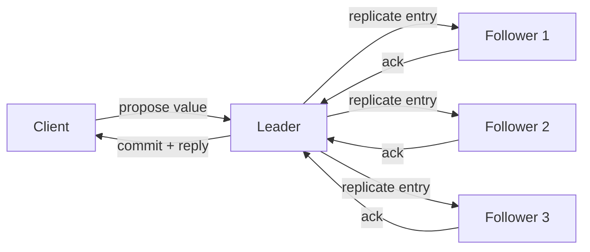

# Consensus

## 1. One-Line Definition
Consensus is the problem of getting multiple independent processes to agree on a single value, and on a single order of values, even when some are slow or have crashed — the machinery behind leader election, atomic broadcast, and coordination stores like ZooKeeper and etcd.

## 2. Why Do We Need It?
A single machine can decide anything but is a single point of failure; the moment you replicate state, replicas can disagree. Who is leader? Which write won? Which entry is committed? Guessing yields split brain or lost updates. Consensus gives replicas a way to make the same decision even when the network partitions and nodes die, which is what lets a cluster elect one leader, order entries once, and fail over without two writers appearing.

## 3. Simple Intuition
A classroom needs one agreed answer for a quiz that some students miss. If everyone could shout, you get chaos. So you vote: an answer counts only if a majority agrees, and any majority can always reach some absent students. When one student is clearly speaking, the class treats them as moderator until a new one is voted in. The minority keeps quiet during the vote so the class never hears two answers at once.

## 4. What Happens Without It?
Replicas drift apart — one server thinks a write happened, another does not. Two followers decide they are both primary (split brain) and accept conflicting writes. Calls like "who is the leader" and "what is the latest value" get contradictory answers from different nodes. Restarting a dead primary without consensus re-introduces the value it may already have overwritten elsewhere. Replication without consensus is only safe if you accept losing the minority on failover or tolerate stale reads.

## 5. Core Idea
- **Safety vs liveness:** safety means no two nodes ever commit different values — guaranteed always. Liveness (they eventually decide) only while a majority is alive and reachable.
- **Majority quorum:** a decision is final only when floor(N/2)+1 nodes agree; any two majorities intersect, so two conflicting decisions can never both be quorum-final.
- **Two rounds:** round one breaks ties about the candidate (Paxos prepare / Raft leader term), round two locks it in (accept / log append) — this is what prevents two different values sneaking in.
- **Total order via a replicated log:** agreeing on the sequence (entry 1, entry 2, ...) lets all downstream state agree — replication and coordination are built on this single total order.
- **Epochs / terms:** each leadership contest runs in a numbered round; a higher term invalidates a lower term's leader, so a stale leader cannot keep deciding.
- **CP by construction:** no value can be decided while the majority is partitioned away — see [[cap-theorem|CAP Theorem]].

## 6. Important Terminology

| Term | Simple Meaning |
|------|----------------|
| Safety | No two nodes commit different values |
| Liveness | A proposed value is eventually decided |
| Quorum | Majority, floor(N/2)+1, that must agree |
| Leader / Follower | Proposer of values / accepter of proposals |
| Term / Epoch | Numbered leadership round; higher wins |
| Log entry | One value at one index in the replicated log |
| Commit | Entry is majority-acked, durable, final |
| Split brain | Two live leaders deciding independently |
| Fencing token | Monotonic proof that a node is the current owner |
| Coordination store | Service (ZooKeeper, etcd) exposing consensus to apps |

## 7. Basic Architecture



## 8. Request or Data Flow
1. Client proposes a value (write a key, take a lock, become leader) to the current leader.
2. Leader appends the entry to its log and replicates it to followers.
3. Each follower durably writes and acks.
4. When a majority acks, the leader commits and replies.
5. Lagging nodes catch up on the next heartbeat, and any node acting on the value first verifies it is committed and in the current term.

## 9. Practical Example
**Configuration store for a 5-node service cluster:**
- etcd/ZooKeeper holds the shard map, current leader name per service, and distributed locks.
- "Become leader of service X" is a consensus write: committed only after 3 of 5 nodes store it.
- A network slice leaving one side with 2 of 5 nodes cannot commit — it stays quiet instead of risking two leaders.
- The store's lease means a dead service leader loses its lease after roughly 8 seconds, and the store sets a new one — this is how [[failover|Failover]] gets a safety guarantee rather than a guess.

## 10. Scaling
- **Control plane, not data path:** every decision costs a majority round trip plus majority fsyncs, so throughput is far below a single machine.
- **More nodes make it slower:** 5 nodes wait on 3 acks, 7 on 4; add nodes for fault tolerance (always odd), not for capacity.
- **Scale by splitting consensus groups:** different services or keyspace ranges use separate 3- or 5-node groups — how Kubernetes and Kafka control planes stay horizontal.
- **Optimize the log, not the replicas:** batch entries, pipeline, and use read leases to raise throughput.

## 11. Reliability and Failure Scenarios

| Failure | What Happens | Detection | Recovery | Trade-off |
|---------|--------------|-----------|----------|-----------|
| Leader crashes | Proposals stall until re-election | Heartbeat timeout | Followers elect new leader, higher term | brief availability gap |
| Minority partitioned | Cannot commit (no quorum) | Lost quorum acks | Wait for heal; committed data wins | liveness lost, safety kept |
| Majority partitioned | Old side loses quorum | Leader steps down | Other side elects new leader | old side discards uncommitted state |
| Slow / lagging node | Far-behind follower | Lag alert | Catch-up from leader log | extra load while catching up |
| Disk full | Node cannot ack new entries | Local error | Replace node, rejoin group | writes stall if node is inside quorum |

## 12. Consistency and Correctness
- Committed entries are linearizable: any later read sees the same or newer value.
- **Commit is one-way:** once a majority durably stores an entry it can never be lost or changed, regardless of future partitions.
- **Fencing:** acting on a decision requires still holding the current term/lease — a stale leader from an old term must not write (see [[distributed-locks|Distributed Locks]]).
- Any downstream ordering guarantee (Kafka partitions, serializable transactions) inherits the consensus log's total order.

## 13. Performance
- Latency per decision: one leader-to-majority RTT plus a durable write per node — a few ms in a rack, tens of ms across regions.
- Throughput: leader fsync and serial log bound it, typically thousands to tens of thousands of ops/s before batching.
- Levers: batch multiple entries per round, pipeline appends, ephemeral reads served from leader lease without a vote round.

## 14. Security
Classic consensus assumes *crash faults* — nodes that stop, not nodes that lie. It does not defend against malicious members. Use authenticated TLS channels so outsiders cannot join a vote, and authenticated membership changes so an attacker cannot add themselves to the group. When nodes may be corrupted and lie, the problem becomes [[bft|Byzantine Fault Tolerance]].

## 15. Trade-Offs

| Choice | Advantages | Disadvantages | When to Use |
|--------|------------|---------------|-------------|
| Consensus store (etcd/ZK) | Safety under partitions, linearizable locks/leases | Slow, low write throughput, operational weight | Control plane: metadata, leaders, locks |
| Plain leader-follower replication | Fast, simple | Split-brain risk, manual failover, loss risk | Single-leader DBs with tolerated downtime |
| Follower ack without quorum | Cheapest latency | No safety; lost acknowledged writes | Throwaway state, caches, best-effort |
| Cached/local ownership assumption | Near-zero latency | Stale decisions, active conflicts | Where a wrong guess is cheap and retryable |

## 16. Common Mistakes
- Running an even node count, or forgetting that a 3-node group needs 2 votes.
- Putting consensus on the data hot path, then "fixing" latency with unsafe shortcuts.
- Ignoring epochs: an old leader keeps writing after re-election; monotonic fencing tokens stop it.
- Believing a partitioned minority can keep serving safe reads — serving decisions without a majority is how split brain begins.
- Changing membership mid-election without a proper joint-consensus / membership-change protocol.

## 17. HLD vs LLD Boundary
HLD: choose the coordination store or embedded algorithm (Raft inside RaftDB/Kafka metadata, Paxos in Spanner), decide group size, quorum, lease duration, and which decisions require it. LLD: term bookkeeping, log index management, prepare/accept message formats, and the exact lease-renewal callback in one member process.

## 18. Interview Questions

### Beginner
- What does a 3-out-of-5 quorum mean, and why is that number required?
- Why is consensus needed for leader election but not for read replicas?
- What is the difference between safety and liveness in consensus?

### Intermediate
- A 5-node group loses 3 nodes. What can it still do and why?
- Why is consensus slow versus a single database, and where should you still place it?
- How does a term or epoch prevent a stale leader from writing?

### Advanced
- Walk through a 3-node Raft group when the leader is partitioned away from the other two.
- Design coordination for 50 small clusters: where does consensus live and how do you scale past one group?
- Compare a consensus-backed lock server against a single Redis lock (see [[distributed-locks|Distributed Locks]]).

## 19. Interview Memory Summary

> [!abstract]- Interview Memory Summary
> ### Remember
> - Consensus = many processes agree on one value, in one order, despite crashes.
> - Safety always holds; liveness needs a majority alive and reachable.
> - Quorum floor(N/2)+1; any two majorities intersect, so two commits cannot differ.
> - Leader proposes, majority durably acks, then and only then is it committed.
> - The replicated log order is the source of all downstream order.
> - Terms fence stale leaders; leases bound how long a decision stays valid.
> - It is CP: partitions pause progress but never diverge the committed state.
> - Use for the control plane, never for a high-throughput data path.
>
> ### 30-Second Explanation
>
> Consensus lets a set of nodes commit one value with a total order even as nodes crash or partition. A leader proposes, a majority durably acks, and only then is the entry committed and safe. The vote is the firewall against split brain: partitioned minorities can stall but never commit divergent state. You route ownership, leader election, and locks through a small coordination store and keep the data hot path on normal databases.
>
> ### Interview Traps
>
> - Saying "the leader decides" — the leader proposes; the majority decides what is committed.
> - Forgetting a 2-of-3 minority can serve nothing safely.
> - Claiming consensus scales with node count — it worsens; you scale by splitting groups.
> - Treating "has a heartbeat" as "agrees on a value" — commit requires durable majority acks.
> - Assuming it foils malicious nodes — that is [[bft|Byzantine Fault Tolerance]].
>
> ### Key Trade-Off
>
> You exchange permissive availability for guaranteed conflict-free agreement: partitions pause progress rather than bend the rules, and every agreement costs a majority round trip plus majority fsyncs.

## 20. Related Concepts

### Prerequisites

- [[cap-theorem|CAP Theorem]]
- [[failover|Failover]]
- [[strong-vs-eventual-consistency|Strong vs Eventual Consistency]]

### Commonly Used Together

- [[raft-and-paxos|Raft and Paxos]] (the concrete algorithms)
- [[distributed-locks|Distributed Locks]] (built on the consensus store)
- [[distributed-id-generation|Distributed ID Generation]] (sequences and leases)

### Alternatives

- [[database-replication|Database Replication]] — cheaper copying without agreement; unsafe on failover by default.
- [[retry-and-timeout|Retry and Timeout]] — fine when wrong guesses are cheap and idempotent.

### Advanced Concepts

- [[bft|Byzantine Fault Tolerance]]
- [[gossip-protocol|Gossip Protocol]]

Related planned topics (not authored yet): quorum mathematics, joint membership change, lease-based coordination theory.

## 21. References
Kleppmann, *Designing Data-Intensive Applications*, ch. 9 — a plain-language treatment of consensus and linearizability. Lamport, "The Part-Time Parliament" (1998), "Paxos Made Simple" (2001). Ongaro & Ousterhout, "In Search of an Understandable Consensus Algorithm (Raft)" (2014). Vukolic, "Quorum Systems". Verify lease and quorum defaults against current etcd and ZooKeeper documentation.

## 22. Active Recall

Test yourself before revealing each answer.

> [!question]- Why is quorum floor(N/2)+1 and not just any majority?
> Because any two quorums must intersect. Below half-plus-one, two different majorities could shrink until they no longer overlap, and two different values could each claim majority support. The intersection guarantees one value can never be un-made by a later different value.

> [!question]- A 5-node group loses 3 nodes. What can the 2-node side do and why?
> Almost nothing needing a decision: it cannot reach the 3 required, so it can neither commit new values nor serve authoritative reads (the other side may hold committed data). It can serve already-committed local state. Progress returns when the majority regroups; safety is preserved because no divergent commit could get 3 votes.

> [!question]- Where do you put consensus in a system with a hot transactional database?
> Reserve consensus for ownership and metadata — leader identity, membership, locks, shard maps — and keep the database on the data path. Run a small 3- or 5-node etcd/ZooKeeper group for the control plane; shard consensus groups if the decision rate grows. Do not mirror every transaction through a consensus log.

> [!question]- What happens to uncommitted state when a majority partition elects a new leader?
> Uncommitted entries that belong to the old term are not majority-durable and can be superseded or discarded. The new leader replays only committed entries. This is safe by design — losing *uncommitted* state is not a correctness violation; losing *committed* state would be.

> [!question]- Design decision: 3 nodes or 5 nodes for your coordination store?
> Both tolerate 1 failure. 5 tolerates the same 1 while also surviving certain 2-node loss during membership changes, and is standard for production. Beyond 5 the latency and vote cost rise faster than the safety gained. Even counts are wrong — a 2-of-4 group cannot necessarily self-heal after one failure.

> [!question]- How do leases fit into leader election for a side-service leader?
> The service leader holds a lease (expiring lock) in the consensus store and renews it on a timer. If it dies or is partitioned away, the lease expires and the store grants it to another process. The lease duration trades availability (shorter = faster failover) against safety risk (longer = more room for a stale leader to act).

> [!question]- Interview scenario: your failover keeps producing two active primaries. Diagnose.
> Two causes. Either failover does not run through a consensus-backed decision (each side assumes it is primary on a guess), or a stale primary outlives its fence — it still holds a service lease others have overwritten. Fix: elect the primary via the consensus store, commit the decision to a majority, and require a fencing token in every write path so the displaced primary is rejected.

> [!question]- "We run replication without consensus and it is fine." When is that truly OK?
> When the minority can be lost without losing acknowledged data and without correctness harm — reads tolerate staleness, failover is manual and rare, or the service tolerates a short window of two writers. Anywhere acknowledged writes must survive an arbitrary partition, or two writers are unacceptable, you need consensus or a much weaker guarantee explicitly accepted.

> [!question]- Why does each decision need a durable write on a majority, not just an in-memory ack?
> In-memory acks vanish if nodes crash before the leader replies. The commit promise is "durable on a majority" so the value survives subsequent node loss. If the majority crashes before acking, the entry is uncommitted and may be abandoned — that is the boundary that makes commit a one-way door.

> [!question]- How is consensus different from merely electing a leader once?
> "Who is leader" is a single decision; systems also need decisions about the state the leader changes and guarantees about ordering. Consensus provides a single total order of decisions, so electing a leader and committing a config change are the same mechanism — that is why Raft and Paxos implement both leader election and a replicated log.

## 23. When Should I Use This?

### Use it when

- Multiple nodes must agree on ownership, membership, or a single total order.
- Leader election must be safe under arbitrary partitions — no two primaries ever.
- You need linearizable locks, leases, or config that survives node loss.
- Failover must not lose acknowledged writes to a contradictory decision.

### Avoid it when

- A wrong decision is cheap, idempotent, and self-correcting (use retries and last-writer-wins instead).
- Your availability budget cannot tolerate the minor liveness stalls a partitioned majority causes.
- The write rate is high enough that a majority round trip per decision is unbearable — rethink scope first.
- All nodes are effectively trusted and a single long-lived primary with manual failover already suffices.

### What problem does it solve?

The safety of agreement: replicas cannot commit divergent values or elect two leaders, and acknowledged state stays committed across partitions and crashes.

### What problem does it NOT solve?

Throughput — it is a control-plane mechanism, not a data path. It also does not solve malicious/lying nodes (that is BFT), does not make partitioned minorities still available for writes, and does not make the leader's own local logic correct if it is buggy.

## 24. Decision Connections

Decisions that go together with consensus:

- [[raft-and-paxos|Raft and Paxos]] — consensus is the problem; Raft and Paxos are the concrete algorithms you implement or buy.
- [[failover|Failover]] — a failover only becomes safe when the "who is primary" decision is consensus-backed.
- [[cap-theorem|CAP Theorem]] — consensus is the CP choice: keep safety, lose liveness on partition.
- [[strong-vs-eventual-consistency|Strong vs Eventual Consistency]] — the strength of the consistency guarantee is set by whether reads/writes go through the consensus group.
- [[distributed-locks|Distributed Locks]] — locks and leases are consensus decisions wearing application clothes.
- [[distributed-id-generation|Distributed ID Generation]] — monotonic sequence generation needs the same ordering machinery.
- [[database-replication|Database Replication]] — the contrast case: copying without agreement is cheaper and less safe.
- [[bft|Byzantine Fault Tolerance]] — same agreement problem under a stronger (malicious) failure model.

Decision tree:

```
Do multiple nodes need to agree on ownership or order?
    |
    +-- No — single primary is fine, wrong guesses are cheap
    |      → [[retry-and-timeout|Retry and Timeout]]
    |      → [[database-replication|Database Replication]]
    |
    +-- Yes — decide how strong the failure model is
    |      |
    |      +-- Honest nodes that crash or partition
    |      |      → [[consensus|Consensus]] via [[raft-and-paxos|Raft and Paxos]]
    |      |         |
    |      |         +-- High-rate state?   → shard into small consensus groups
    |      |         +-- Locks/leases?      → [[distributed-locks|Distributed Locks]]
    |      |         +-- Failover safety?   → [[failover|Failover]]
    |      |
    |      +-- Malicious or lying nodes possible
    |             → [[bft|Byzantine Fault Tolerance]]
    |
    +-- Wrong guesses acceptable and expensive to coordinate?
           → skip consensus; accept eventual convergence
```